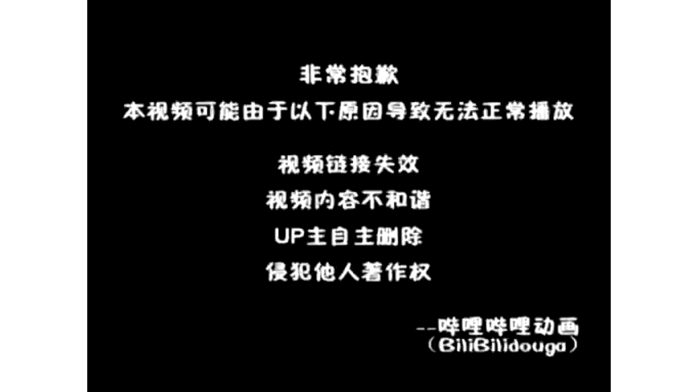

# 【Docker容器】零基础入门到实战教程，一天速通Linux运维容器篇（2026版） p01 课时1：初识容器-与虚拟机的本质区别

> 本书由课程字幕编辑而成，删除口语冗余并统一术语；时间标记用于回看原视频。

## 导读

本章围绕“核心概念”展开。阅读时建议在终端同步操作，并在每节结尾完成练习。

## 学习目标

- 理解本节的核心概念与适用边界。
- 能独立执行示例命令并验证结果。
- 掌握常见故障的定位路径。

## 1. 核心概念

*(参考时间：00:00:00)*



带你一天学会docker容器 欢迎来到LINUX运维进阶篇 容器技术基础的课程 接下来我们一起踏入云原生运维的大门 探索从虚拟机到容器的演进历史 我们回顾一下运维的历史啊

我们最早是处于物理级的时代 那个时候呢部署一个应用需要采购硬件 安装操作系统 效率比较低 而且的话资源严重浪费 这种虚拟其出现之后呢

通过硬件虚拟化 让我们能够在同样的一台物理机上 独立的运行多个系统 这在过去啊很长一段时间内了 都是企业的主流方案 然而要随着互联网业务对于响应速度的要求

越来越高 更加轻量 响应更快的容器技术应运而生啊 也开启了运维的新阶段 现在的企业呢特别是使用了LINUX的环境的企业啊 都在追求一些更加极致的敏捷开发

和高效的交付 那么为了适应这种技术转向了 我们掌握容器技术啊 不再是一个加分项了 而是必修课 本节课我们就以LINUX为基础

深入的探讨容器的奥秘 那什么是容器呢 刚才我们提到了运维技术的演进啊 现在我们来正式回答这个问题 到底什么是容器 container技术层面来看了

容器是一种轻量级的操作系统级的虚拟化技术 但是啊请注意 它和传统的虚拟机呢有着本质的区别 他不是在模拟一套完整的硬件 而是呢在操作系统前面啊进行一个区分 它的核心特征呢在于共享宿主机的内核

也就是说呀 如果你在rocking linux9里面去运行容器 那么这些容器呢会直接使用宿主机的内核 而不是每个容器都自带一个内核 同时呢他们又有拥有独立隔离的进程 网络和文件系统

互不干扰 那么如果觉得这个定义太抽象的话 我们来看一个形象的比喻啊 虚拟机就好像是一座座独立的别墅 每一家呢都需要自备地基水电和围墙 虽然说安全性极高

但是啊资源消耗非常大 而容器呢就像是一个精壮的公寓一样的 大家整栋楼的地基 水电管网都在我们的哎一起用 但是呢在房间的内部啊 每家每户的人家呢又是完全独立的去生活的

那么对于一些零基础啊 想要入职的同学来说 我们理解这种共享资源 但是环境隔离的特性呢也是至关重要的 因为啊这正是容器能够实现秒级启动 实现极高资源利用率的奥妙所在啊

那么了解了这些概念之后了 接下来我们来对比一下他们的底层架构啊 那么接下来我们来看一下啊 在虚拟机以及容器的在架构上的根本区别 这个对于理解我们LINUX下面的运维呢至关重要 那么无论是虚拟机还是容器

最底层的硬件都是我们的哎 都是我们的宿主机和硬件 在我们的实例当中了

### 命令速查

```bash
docker容器 欢迎来到LINUX运维进阶篇 容器技术基础的课程 接下来我们一起踏入云原生运维的大门 探索从虚拟机到容器的演进历史 我们回顾一下运维的历史啊 我们最早是处于物理级的时代 那个时候呢部署一个应用需
```

### 实践检查

确认命令执行结果与课程演示一致；若失败，先检查镜像、网络、权限和端口占用。

## 2. 操作步骤

*(参考时间：00:03:39)*


我们的宿主机啊运行的是rocky linux9 那么注意看啊 咱们虚拟机的这一层它是需要一个完整的 这个图来显示的不是很清楚 我们来一个啊更加形象的一个东西 给大家展示一下

好我们来重新来一遍啊 那么无论是虚拟机还是容器啊 最底层的话呢就是我们的基础设施 对不对 那么就是我们的一个宿主机 首先的话它是基础设施

是一些我们的CPU内存存储以及网络适配器 是我们的基础设施 在这个基础设施之下呢 我们去安装了一些操作系统OS 对不对 那么我们这里呢用的是LINUX

那我们如果装了一个rocky linux的话呢 也就是我们他由他来负责管理我们的硬件资源 并且提供了虚拟化软件或者容器的技术环境好 那这一层呢是其实是一样的啊 那么下一步的话我们就分开了啊 我们可以看一下

那如果是虚拟机的话呢 我们会运行的一个叫做VMM啊 虚拟机监控器 它会在我们的物理硬件和虚拟机之间 创建一个抽象层 那么允许来同时运行多个操作系统

那我们常见的比如KVM啦 WIMWR都是这样子的啊 它需要一个完整的客户机操作系统 那么这种意味着什么呢 意味着我们即便啊只是运行一个小小的应用 它也是需要一个完整的什么操作系统的内核

那我们可能会消耗了很多很多的资源 来支撑这个操作系统内核啊 非常的麻烦 那么右边这个是我们的容器引擎 那么容器引擎呢 它直接利用的是我们的宿主机的内核

彻底的去掉了我们沉重的我们的这个哎 get os这一层 把这一层呢给大家去掉了 那么总结一下来 我们虚拟机啊是硬件级的虚拟化 那么容器呢是进程级的一个隔离

那么容器啊 因为它共享内核启动了非常快 只需要毫秒级 而且的话非常的节省资源 好少了一层 大家可以看一下好

接下来我们回到刚刚那个PPT啊 给大家做一个详细的深度的剖析 我们一些具体的指标来看看啊 大家了解这些以后了 对于以后再找技术选型的时候也是至关重要的 这里有一张对比表啊

我们可以看一下 首先启动速度 这里因为虚拟机呢我们要加载完整的操作系统 通常需要分钟几二 而容器呢比如我们在LINUX里面运行的docker 是不是它是秒级甚至是毫秒级启动的

这个在处理突发流量的时候呢 优势非常的巨大 其次是资源的占用 我们虚拟机动辄占用数GB的内存 而容器呢只需要兆级别 这意味着同样的硬件资源

容器能够承载出很多倍的业务量 那么在隔离线上了 虚拟机提供的是硬件级的完全隔离更安全 但是性能损耗也比较大 容器则是通过LINUX内核技术 实现了我们的进程级的逻辑隔离

### 命令速查

```bash
docker 是不是它是秒级甚至是毫秒级启动的 这个在处理突发流量的时候呢 优势非常的巨大 其次是资源的占用 我们虚拟机动辄占用数GB的内存 而容器呢只需要兆级别 这意味着同样的硬件资源 容器能够承载出很多倍的业
```

### 实践检查

确认命令执行结果与课程演示一致；若失败，先检查镜像、网络、权限和端口占用。

## 3. 验证与排错

*(参考时间：00:07:20)*


这个就引出了我们下方的关键点啊 大家要特别注意一下这个备注 我们容器基数呢基于啊 之所以能够达到这种非常高的性能 因是这是因为它基于我们宿主机的内核实现的 在我们LINUX9啊这种现代化的LINUX发行版当中呢

内核对于容器的支持非常的成熟啊 基本上是没有什么性能的衰减的 那么这种轻量化的正是我们容器技术啊 席卷全球的根本原因 那我们在开始接下来实操之前呢 我们看一下这个对比啊

大家可以想一下 你觉得在什么样的情况下 我们依然需要使用虚拟机 而不是使用人气嘞啊大家可以想一想 好那么接下来我们通过这两个小测验啊 来看一下

巩固一下大家对于容器以及虚拟机的一个理解 第一题的关键点在于对于这个内核的调用啊 大家可以暂停作答 第二题呢是关于启动速度的一个优势来分析啊 刚刚其实已经讲到了 好作答

作答完成以后了 我给大家进行讲解啊 首先的话我们看第一道题目啊 我们看选项B啊 那么容器之所以啊它被称为轻量级的核心 就在于它直接共享了我们唉宿主机的内核

省去了我们去模拟硬件呀 加载独立的内核这种开销 那么虚拟机呢就需要我们在本地啊 去跑上一个完整的唉客户机操作系统 比较麻烦一点 第二题呢是关于启动速度的优势啊

我们的ab d哎 这三个选项呢共同构成的答案是不是啊 这个题我们选ABD容器了 它是不需要硬件自检的 post也不需要重新去加载内核镜像啊 它在虚拟机看来了就是一个什么呢

受限的进程启动速度了 自然是毫秒级的 这个在LINUX这种高性能服务器环境下 优势啊非常的明显好 那么理解了这些架构上的差异之后了 我们就知道为什么

在追求极致效率的生产环境当中 容器化会成为一个主流的选择 好大家可以思考一个小场景啊 就是如果你需要在一台LINUX主机上去运行 一个必须要依赖windows内核的旧版软件 哎你会选择用容器还是虚拟机啊

大家可以想一想 好刚才呢我们分析了容器和虚拟机的区别 接下来我们要正式的认识docker工作流的核心啊 叫做镜像 容器和仓库啊 这三者共同构成了docker的生态系统

那么理解了他们的关系了 你就掌握了容器化运维的一半啊 首先是image 就是镜像 你可以把它理解为一个只读的模板 这个就像是LINUX系统里面的一个安装镜像包

或者是我们手机应用的安装程序 它包含了我们运行应用程序所需要的 全部的代码 环境库文件和配置啊 它是静态的 那么一旦构建完成了

就不会被修改 有了镜像之后呢 我们就可以把它运行起来 这个时候它就变成了容器啊 container容器是镜像的运行实例啊

### 命令速查

```bash
docker工作流的核心啊 叫做镜像 容器和仓库啊 这三者共同构成了docker的生态系统 那么理解了他们的关系了 你就掌握了容器化运维的一半啊 首先是image 就是镜像 你可以把它理解为一个只读的模板 这个就
```

### 实践检查

确认命令执行结果与课程演示一致；若失败，先检查镜像、网络、权限和端口占用。

## 4. 小结

*(参考时间：00:10:57)*


打个比方呢 我们镜像是菜谱 那容器呢就是照着菜谱炒出来的一盘菜 最关键的是啊 我们容器是一个可写存 那你比如你在容器里面进行的操作了

都会记录在这里 而不会破坏底层的镜像 最后啦是我们的仓库啊 他好像是一个存放了各种各样镜像的 一个书店啊 或者应用商店

比如我们著名的docker hub啊 里面有成千上万的预制好的镜像 那后续呢我们在LINUX上部署服务的时候 大部分时间都是直接从仓库去拉取啊 现成的镜像来使用的 我们总结一下

我们从仓库里面下载镜像 然后来基于镜像去启动容器 那么这种解耦的设计呢 也是让应用的分发变得非常的高效的 大家可以思考一下 如果我们部署一个完全相同的web哎

从到十台相同的服务器上 那么这种镜像容器的这种模式有什么优势啊 大家可以思考一下 那么既然我们已经掌握了docker的核心概念啊 接下来我们就进入一个实战环节 在企业级的运维当中呢

我们的LINUX是一个非常主流的选择 那么接下来我就带大家在这个环境里面去完成 我们docker的一个部署 那么第一步了是环境的预检 这个也是为了方便我们导入docker 官方的一个软件仓库REPO

确保我们获取的是最新的 而且是最安全的安装包 那么准备工作完成之后呢 我们就进入一个核心的安装阶段 我们需要安装三个关键组件啊 首先一个是docker ce1

这个是社区的引擎 docker c的CLI呢 是我们跟它交互的一个命令行工具 还有一个container d点 IO就是我们底层的run time啊 RUNTIME也就是运行时环境

那么安装完了之后呢 也不代表我们服务啊已经运行起来了 那么在LINUX里面 我们还要去手动的去把这个docker给它开启起来 并且把它设置为开机自启 最后呢

我们通过运行一个简单的容器 来验证一下整个环境是不是真正的打通了 大家可以稍微留意一下 我们下面的这个术语表啊 我们熟悉一下REPO啦 以及run time啊

这种常见的术语 那么规范的操作也是成为运维专家的第一步啊 OK那么不知不觉 我们这一堂呢 关于容器和docker的初步的一个探索了 就告一段落了

那么在下课之前 我们还要把刚才讨论的几个核心的关键点 再梳理一遍好 大家一定要记住的是 我们container它并不是一个缩小的虚拟机 而是一种轻量高效的进程隔离技术

在LINUX环境下面呢 它本质上就是受限的啊 受内核约束的一个普通的进程 我们要完成思维的升级啊 从过去繁琐的硬件和资源分配 转向我们直接管理应用和业务

那这也是成为一名合格的运维工程师的哎基础 那么下一节课呢我们将正真正的动手去操作 那也会带领大家去在LINUX环境下来安装好 检查好我们的docker11的环境 然后来我们去从云端去拉镜像 亲手跑起来

我们第一个容器好 到时候我们就可以感受到容器的 秒级启动的魅力了 好那么感谢大家收看本期的课程 我们下一节课再见

### 命令速查

```bash
docker hub啊 里面有成千上万的预制好的镜像 那后续呢我们在LINUX上部署服务的时候 大部分时间都是直接从仓库去拉取啊 现成的镜像来使用的 我们总结一下 我们从仓库里面下载镜像 然后来基于镜像去启动容器
docker的核心概念啊 接下来我们就进入一个实战环节 在企业级的运维当中呢 我们的LINUX是一个非常主流的选择 那么接下来我就带大家在这个环境里面去完成 我们docker的一个部署 那么第一步了是环境的预检
docker 官方的一个软件仓库REPO 确保我们获取的是最新的 而且是最安全的安装包 那么准备工作完成之后呢 我们就进入一个核心的安装阶段 我们需要安装三个关键组件啊 首先一个是docker ce1 这个是社区
```

### 实践检查

确认命令执行结果与课程演示一致；若失败，先检查镜像、网络、权限和端口占用。

## 总结

完成本章后，你应能围绕“核心概念”独立复现课程演示，并将方法迁移到实际 Linux 运维环境。

### 延伸练习

1. 在独立测试环境重新执行本章命令。
2. 记录每条命令的输入、输出和回滚方式。
3. 为配置和数据建立备份，再进行下一章实验。
