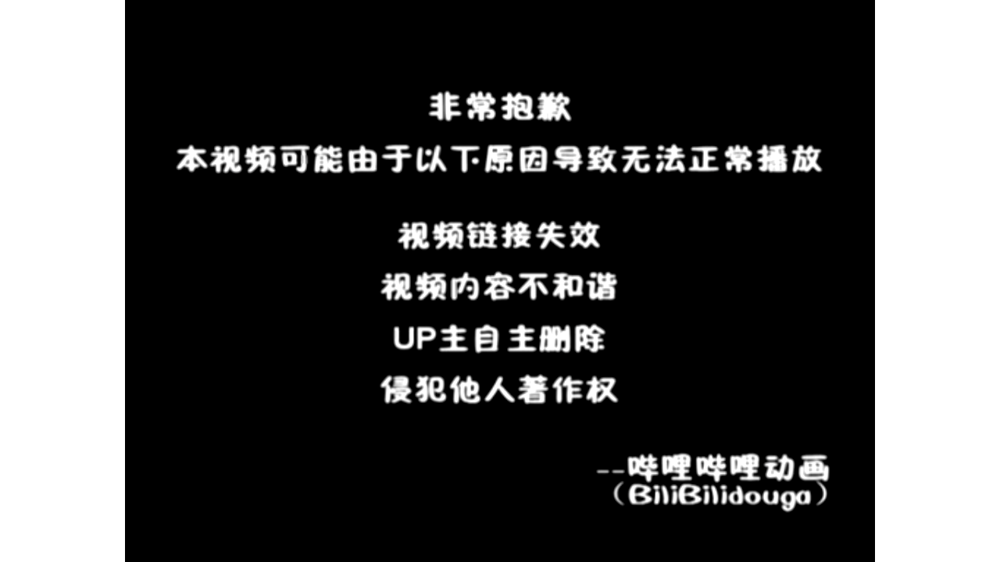

# 【Docker容器】零基础入门到实战教程，一天速通Linux运维容器篇（2026版） p03 课时3：容器生命周期管理-常用命令实战

> 本书由课程字幕编辑而成，删除口语冗余并统一术语；时间标记用于回看原视频。

## 导读

本章围绕“核心概念”展开。阅读时建议在终端同步操作，并在每节结尾完成练习。

## 学习目标

- 理解本节的核心概念与适用边界。
- 能独立执行示例命令并验证结果。
- 掌握常见故障的定位路径。

## 1. 核心概念

*(参考时间：00:00:03)*



哈喽 很高兴能够带领大家来继续学习我们docker的课题 本堂课啦是容器生命的周期管理 这个也是我们容器技术的第三节课 首先我们要明确什么是生命周期 在容器技术当中呢

它描述的是容器啊 从image镜像实例化的到产生到最后啊 被彻底释放了整个过程 那么理解了这个闭环 才能够在后续的实战当中来精确的定位问题 我们来看这张流程图

一个容器会经历从create创建到running运行的关键跨越 在运行阶段了 容器进程在rocky linux内核的支持下 高效的运作 对外提供服务 如果临时调整

我们还会用到暂停状态 当服务任务完成或者需要迭代更新的时候了 容器会进入stop停滞状态 并最终通过delete的销毁 记住啊 在企业级运维当中了

及时清理不再使用的容器 是保持系统整洁 避免资源浪费的关键 那么掌握这一状态有什么实战意义呢 比如故障自愈 我们可以配置监控系统运行状态

一旦发现容器挂掉了 就自动的触发重启 又或者是快速扩容 我们依托容器的秒级启动特性 在业务高峰期啊 迅速地增加服务节点

在我们深入学习具体的命令之前呢 我想请大家思考一个运维管理的常识性问题啊 关于容器销毁阶段的一个重要性有哪些 好我们继续刚才提到的运维管理常识 在LINUX生产环境当中了 管理容器的第一步就是理解它的生老病死

那么本小节我们要讨论的就是容器的状态转换 也就是容器的生命周期 这个也不仅仅是理论啊 也是我们后期排查故障的核心依据 容器有五个核心状态 首先是刚创建好的create

已创建 接着是任务正在处理当中的running 那么如果需要临时挂起来 我们可以进入一个暂停状态 harder的当任务结束或者手动关停之后了 会进入这个stop

最后彻底清理掉了 就是delete已删除 我们要像熟悉LINUX进程一样的熟悉这些状态 大家可以看一下这个流转图 它直观地展示了我们容器 在不同指令下的流转路径

比如我们最常用的docker run指令 其实啊 它是完成了从镜像到创建再到运行的复合跳跃 而右边这个触发指令 比如docker stop或者docker start 就是我们运维人员手中的遥控器

通过TAMA精准的控制容器在各个状态间的切换 大家在学习的时候啊 要把指令和状态的关系了对应记牢 再次强调 我们后续的所有的实验和命令演示 都是在LINUX环境下

基于docker引擎进行的 理解这些状态了 我们就可以自信的去执行 查看容器的实验操作了 好既然我们理解了容器状态的转换 接下来我们就看一下LINUX终端里面啊

怎么样实时的去监控这些容器 这个就是我们要去实战演练的docker PS命令 首先是基础的用法 我们直接输入docker PS 这个命令 默认会列出当前啊正在运行当中的容器

它是你确认我们业务服务 是不是正常在线的第一步 那么在实际运维当中呢 我们经常会遇到一些容器啊意外停止的情况 这个时候呢就需要加上docker p杠A这个参数 这个A呢就是O的意思

docker PS杠A会显示所有的容器 包括那些已经停止或者刚刚创建的 那么他是排查故障的一个利器啊 这些命令之后呢 你又会看到一排清晰的表头 理解这些核心的输出字段的含义

也是我们成为专业运维的基础 比如container id是容器的唯一身份证号 用于后续的精准控制 因mage字段 则表明了该容器是基于哪个镜像模板创建的 stage字段呢也是非常关键的

它会告诉你啊 容器运行了多久或者退出的状态码 而ports自带呢展示了容器内部 和LINUX宿主机之间的端口映射状况 直接关系到了网络访问是否通畅 最后也分享一个运维锦囊

请大家养成一个定期清理状态 废弃容器的状态啊 那么长期积累无用的容器啊 会占用系统id资源和磁盘空间 大家记住一些字段 接下来的实验环节呢就会得心应手啊

好大家可以在自己本地里面去演练一下啊 试一试咱们的docker PS命令以及docker p杠A的命令啊 在自己本地电脑试一试啊 那么试完之后了 我们就接着开始 好那么大家已经实验完了啊

刚刚看了大家都表现的比较好 那么如果是B站的小伙伴们呢 你们也可以动手操作一下 操作完了以后呢

### 命令速查

```bash
docker的课题 本堂课啦是容器生命的周期管理 这个也是我们容器技术的第三节课 首先我们要明确什么是生命周期 在容器技术当中呢 它描述的是容器啊 从image镜像实例化的到产生到最后啊 被彻底释放了整个过程 那
docker run指令 其实啊 它是完成了从镜像到创建再到运行的复合跳跃 而右边这个触发指令 比如docker stop或者docker start 就是我们运维人员手中的遥控器 通过TAMA精准的控制容器在各
docker引擎进行的 理解这些状态了 我们就可以自信的去执行 查看容器的实验操作了 好既然我们理解了容器状态的转换 接下来我们就看一下LINUX终端里面啊 怎么样实时的去监控这些容器 这个就是我们要去实战演练的
```

### 实践检查

确认命令执行结果与课程演示一致；若失败，先检查镜像、网络、权限和端口占用。

## 2. 操作步骤

*(参考时间：00:06:53)*


我们再接着往下走啊 首先是容器的控制状态啊 我们刚刚讲到了有start stop和restart几个指令啊 那么刚才呢大家已经在实验环境里面 亲手的通过命令去查看了容器 现在呢我们要更进一步掌握

如何像运维的专家一样的 我们可以精准的控制我们的container的运行状态 这个就是我们LINUX当中呢最常用的三个指令 start stop以及呢restart 首先我们看docker stop 在企业生产环境当中啊

我们非常忌讳直接杀掉进程 这个命令呢会向容器的进程呀发送一个信号 那么这个信号接收以后呢 程序啊就会开始处理一些残余的任务 以及保存数据 那么这个时间过了之后呢

就是可以优雅的停止啊 那么这种方式的话会有效的避免文件损坏 那么容如果容器啊已经是ex t exceed 这个状态啊 已经退出状态 那么我们可以使用呢docker start重新的启动它

大家要注意啊 这个操作会保留容器原有的配置 以及呢数据层 它并不是创建一个新的容器 而是唤醒一个已经存在的实体 而docker restart则是一个组合动作

它等同于了先执行stop 再执行start 当你修改了某些不涉及镜像变更的配置啊 或者服务出现假死 需要快速飞护的时候呢 这个是其他最高效的选择啊

快速恢复的时候啊 它是最高效的选择 最后呢我来提醒一下大家啊 在LINUX生态环境当中呢 我们对于核心业务啊 一定要配合一个参数

叫做restart always啊 这个可以确保容器在系统重启的时候 可以自启动 同时在操作stop之前呢 也务必确认关键的业务日志或者缓存 已经妥善处理了

接下来我们来通过几个测试题 来检验一下大家学习的情况 好这里来大家在答题的时候啊 重点回顾一下我们在前面学过的一些常用指令 特别是容器啊 停止啊

这种指令啊 你们要多试一下啊 多试一下 好如果没有动手操作的同学呢 赶紧动手 操作完之后呢

我们来暂停回答这几个问题好 首先第一题和第三题 考察的是我们对容器生命周期的直观的观察 我们记住啊 默认的docker PS只显示运行当中的容器 如果你发现之前运行的容器不见了

一定要记得加上一个什么参数呀 是不是有个A1参数or参数 好这个在生产环境当中呢 排账的时候非常关键啊 对于第二道题目了 我们docker的一个灵活性啊

我们体现在可以通过容器名 也可以通过id或者id的前几个字符 来精准的控制 那么只需要了前面几个字符 能够唯一的标志该容器啊 那么一些简写了也是合法的

但是呢我们要分清stop啊 它是停止 然后嘞趴着是挂起 两者呢在资源占用上是有本质的区别的 好那么做完这组自测啊 相信大家对于容器的状态切换了

是更加的有底气了 那么掌握这些基础命令了之后呢 我们接下来就可以更加从容地进入容器内部 进行更加深入的运维操作了 那么这几个题目来给大家做一个解答啊 首先第一道题我们选哪个呀

是不是选A呀 好第二道题了 我们可以看一下啊 哎假设一个运行当中的容器名称类目啊 为web app 他的id是这个是吧

哪个命令可以正确的停止 这是一个多选题啊 首先我们通过容器名它是可以的 对不对 那么id的话也是可以的啊 第四个选项啊

第三个选项也是可以的 那么选项B的话 这个8A9B呢 哎往往也是可以的啊 但是呢他前提是你没有另外一个容器的 前面也是这几个字母啊

他是只要是能够唯一标志的就可以啊 好这个题呢我们选ABC啊 那么D的话是挂起容器啊 而不是停止好 那么最后一道题docker stop停止一个容器之后呢 输出结果状态栏应该显示什么呢

唉显示我们的B答案啊 容器正常停止之后了 内部的主进程结束了 对不对 状态了会变变成这个EXTIT啊 好括号中的一个数字啊

零对吧 这个零代表什么意思呢 是退出状态码 一般来说啊 零是代表正常退出啊 正常正常正常退出

那么up呢表示的是正在运行当中 create了表示的是仅创建未启动 那么这个puzzle呢它是一个唉挂起状态好吧 那么没有答对的同学们也不要急 我们在本地啊 多试一试

多练一练 好那么掌握了我们容器切换的一个状态啊 接下来我们进入啊一个实战当中呢 频率非常高的操作叫做深度交互啊 很多同学问啊 容器运行起来之后了

如果啊我们想进去看一看里面的文件 或者修改配置该怎么办嘞 这个就要用到我们的docker c e x e c的命令啊 大家看一下这条标准的指令啊 docker e x e c后面跟了一个i it这个参数 然后嘞是容器的id

最后啊我们指定要运行的一个程序 那么通常呢是bin bash 这个就像是给了你一把钥匙 让你能够直接的在正在运行的容器里面 开一个命令行的窗口 那么这里的参数啊也是非常讲究的

我们杠I了代表着啊 interactive表示了我们容器的标准输入

### 命令速查

```bash
docker stop 在企业生产环境当中啊 我们非常忌讳直接杀掉进程 这个命令呢会向容器的进程呀发送一个信号 那么这个信号接收以后呢 程序啊就会开始处理一些残余的任务 以及保存数据 那么这个时间过了之后呢 就是
docker start重新的启动它 大家要注意啊 这个操作会保留容器原有的配置 以及呢数据层 它并不是创建一个新的容器 而是唤醒一个已经存在的实体 而docker restart则是一个组合动作 它等同于了先执
docker PS只显示运行当中的容器 如果你发现之前运行的容器不见了 一定要记得加上一个什么参数呀 是不是有个A1参数or参数 好这个在生产环境当中呢 排账的时候非常关键啊 对于第二道题目了 我们docker的
```

### 实践检查

确认命令执行结果与课程演示一致；若失败，先检查镜像、网络、权限和端口占用。

## 3. 验证与排错

*(参考时间：00:13:46)*


并且啊保持开启 这样呢你在键盘上敲下的每一条命令 容器才能够接收得到 而杠T了代表的是TTY 他会啊分配一个伪终端 那么如果没有这个参数啊

你进入容器之后了 可能连命令提示符都看不到 它会分配一个伪终端 是不是 然后来杠i it的这个组合了 是我们的标准动作啊

一般来说呢缺一不可 那么在实际的运维当中啊 我们会进入容器去执行一些命令啊 比如我们的P杠AUX啊等等啊 去看进程是否正常呀 或者使用WM来快速调整配置文件啊

甚至于当网络出现抖动的时候 我们还可能会进去进行拼测试啊 CURL测试连通性啊 这个嘞比重启整个容器要高效的多啊 好刚才我们学习了如何去利用啊 docker exec进入容器内部进行操作

但是呢在实际的运维工作当中啊 有时候我们并不需要钻到容器里面去 只需要在外面观察它的运行情况 这个时候呢docker logs啊就是我们最得力的帮手 那么在LINUX企业级的生产环境当中 我们掌握日志排查了

也是衡量一个运维工程师是否合格的首要标准 通过它 我们可以快速的获取容器运行的底层信息 最基础的用法是直接输入这个docker locks 然后加上容器的id 那么这条指令啊

会一次性的把容器迄今为止生产出来的 所有的哎标准输出以及标准错误啊 全部倒出来 这个对于查看容器为什么启动失败的情况下来 是非常有用的 那么如果你在调试一个服务啊

想要实时的去观察我们用户的访问轨迹呢 哎实时日志对不对 我们就要加上一个杠F参数 这个呢就像LINUX里面的tail杠F命令一样的 我们会锁定啊 并且实时的去追踪日志流

那么任何有新的变动了 都会立刻的显示在屏幕上 那么还有一种情况呢 当日志量啊非常庞大的时候 我们通过肉眼去寻找报错信息啊 就像是大海捞针一样的

这个时候我们还可以组合管道符 使用grape进行精准过滤 比如通过检索error关键字啊 我们可以瞬间锁定故障发生的具体函数 极大地提升了牌照效率 那么最后是讲到我们清理环境的参数啊

RM和RMI 那么刚才我们通过日志啊排查了故障 随着实验的深入之后啊 大家会发现系统里面呢堆积了许多 不再需要的容器以及镜像 那么大家如果不及时对它进行清理啊

它会占用大量的磁盘空间 现在我们就来学习运维当中了 非常关键的一环叫做清理环境 首先是容器的清理啊 对于已经处于停止状态的容器 我们可以直接使用docker RM来加上容器的id

但是要注意啊 如果容器正在运行当中 普通的删除指令会失效 此时呢如果你确定要立即移除 可以加上这个杠F参数进行强制删除 但是呢在docker啊

LINUX里面啊 我们的生产环境啊 通常会建议大家去先停止容器再进行删除 这样子呢可以确保数据的安全退出 接下来是镜像的清理 命令是r m i docker i m i

这里的I呢代表的是image 这里有一个新手啊经常踩的坑 如果某个镜像正在被某个容器啊 这里哪怕是已经停止过的容器哎 它也是不允许你直接删除这个镜像的 所以呢操作顺序应该是先删容器

再删对应的镜像 这个也体现了docker严谨的依赖检查机制啊 在LINUX运维实战当中了 我建议大家养成定期检查磁盘空间的习惯 我们使用DF杠H命令啊 可以查看到我们哎目录的占用情况

如果发现磁盘告警 除了手动清理之外 我们也可以使用docker system哎 poor这个清理无名镜像的一个命令 它可以来快速的回收所有没有被使用的资源啊 这个在自动化运维当中呢非常的实用

刚才呢我们讨论了如何去利用docker system poor 去回收资源啊 那么在实际的LINUX运维当中呢 清理工作啊只是日常的一部分 更加具有挑战的是在容器的出现故障的时候 怎么样去快速的定位并且啊修复问题

那么现在的话来我们通过这样几个练习啊 大家可以检验一下 对于前面学到的日志排查以及状态控制命令掌 掌握的如何啊 第一道题考察的是实战的效率啊 虽然说我们docker logs可以查看完整的日志

但是呢在处理一些app service啊 这种反复的重启的容器的时候了 我们可以直接使用什么样的命令 去快速的定位最后的报错信息呢 哎大家可以想一想 根据这几个选项啊

猜测一下好 然后大家如果要答题的话 可以暂停 然后慢慢答 稍后来会给答案 那么第二道题了

是对于一些过滤器的深度应用啊 我们使用杠f space等于什么东西呢 可以配合一些哎docker RM啊 实现精准的一个清理 对不对 哎大家可以想一想

### 命令速查

```bash
CURL测试连通性啊 这个嘞比重启整个容器要高效的多啊 好刚才我们学习了如何去利用啊 docker exec进入容器内部进行操作 但是呢在实际的运维工作当中啊 有时候我们并不需要钻到容器里面去 只需要在外面观
docker logs啊就是我们最得力的帮手 那么在LINUX企业级的生产环境当中 我们掌握日志排查了 也是衡量一个运维工程师是否合格的首要标准 通过它 我们可以快速的获取容器运行的底层信息 最基础的用法是直接输
docker locks 然后加上容器的id 那么这条指令啊 会一次性的把容器迄今为止生产出来的 所有的哎标准输出以及标准错误啊 全部倒出来 这个对于查看容器为什么启动失败的情况下来 是非常有用的 那么如果你在调
```

### 实践检查

确认命令执行结果与课程演示一致；若失败，先检查镜像、网络、权限和端口占用。

## 4. 小结

*(参考时间：00:20:39)*


最后的一个简答题 也是模拟了一个真实的NGINX报错的场景啊 好我们前面也学到了 那么面对一个403的错误 我们要先进入容器 对不对

然后检查一下配置文件啊 是不是存在 以及呢权限是否正确 那你可以把这一套了 进入查看测试的排账思路啊 记在你的笔记本里面

那么这三道题啊 涵盖了从日志定位到环境清理 再到交互排账的全过程 希望大家在做题的时候呢 不仅仅是记指令 更加的要理解每条指令背后的运维的逻辑

好那么我们看第一道题啊 第一道题的答案了 我们选B啊 选b docker logs 然后tail30啊 app service这个tail参数了

可以输出最后的啊指定的函数 避免在日志里面啊 巨大的时候造成了终端的卡顿 这个是排查频繁重启问题的一个标准做法 那么A选项呢会输出全部的日志啊 效率比较低

C选项呢用于我们的列出啊 列出容器 而不是日志 D选项呢一个路径啊 它不一定是固定的 对不对

而且不建议直接去操作我们的唉宿主机的文件 那么我们看第二道题 在进行容器清理任务的时候啊 我需要去删除主机上所有状态为这个的啊 已退出的容器 用来释放被占用的磁盘空间和各种资源

那么哪条指令可以通过组合筛选 去精确的实现该操作啊 这个题的答案了 选择我们的C啊 选择我们的C 那么这可会列出唉所有的已退出容器的id

我们这个id啊 会转化成一个哎特定状态的一个一个输出的 对不对 然后通过这个RM了就可以精确的删除啊 那么A选项呢会删除所有的啊运行当中的容器 非常的危险

那么B选项呢它是清理啊旧容器的另一种方式 但是呢更加侧重于时间维度啊 D选项呢只是停止容器而已好吧 而且的话这个也不对啊 而且这个也不对好那么我们看第三道题啊 某外部应用nginx service运行正常

但是呢前端访问报错是零三 请写出你进入该容器内部 检查其默认配置文件的以及存在还是否存在 以及查看文件完整内容的完整指令和排查思路 好那么这个题呢其实是比较简单的啊 就像我们正常排查N这个的故障

实际是差不多了啊 只不过呢我们可能会要多多一个步骤 就是要进入容器啊 docker e x e c大家还记得吗 然后后面是杠i it 对不对

杠i it以后呢 我们要跟上我们的容器的i id 对不对 antic server容器名字也是可以的 然后呢后面跟上一个bean啊 BH哎

这样子的话就可以进入到容器终端里面了 那么进去之后呢 我们可以确认一下文件是不是存在 对不对 我们LS一下 对不对

etc是吧 我们这个日志啊是否存在 如果存在的话 那它就有返回值啊 如果不存在的话 就没有

是不是好 那么这个命令呢可以查看它的一个是否存在啊 然后呢我们可以加上这个LS杠L啊 同时去看一下权限啊 那么最后呢我们也可以查看文件完整内容 是使用什么命令呀

是不是cat呀 哎cut是可以查看完整的内容的 然后呢我们可以重点的去检查一下 比如我们的root目录呀 index文件配置啊等等啊 那么检查完成之后呢

我们还要去退出容器啊 EXIT对不对 退出容器哎 或者了CTRL加D也是可以的 那么这个过程呢综合考察了我们容器的交互 文件系统的管理以及LINUX基础指令的一个运用啊

唉大家可以了解一下 那么经过刚才啊 我们对于外部容器的全周期的维护与实战 演练了 相信大家对于docker容器的生命周期管理呢 已经有了深刻的体会

那么在课程结束之前啊 我们针对本节课的知识点 做一个系统性的回顾以及总结 首先我们看一下这种命令速查表啊 在LINUX环境下呢 我们进行运维

不管是通过PS去确认状态 用EXEC去深入交互 用logs排查故障了 还是最后的stop和RM去清理环境 这些指令都是大家必须肌肉记忆的核心操作 那么大家可以把这张表啊

存到你们的技能库里面 那么除了掌握命令之外了 我更希望大家带走的是运维的核心操作习惯 在生态环境里面啊 状态优先以及谨慎删除啊 不仅仅是口号

更是我们的职业红线 我们严禁啊 在没有经过确认的情况下去使用RM杠F 这是一种呢对于我们的哎系统的敬畏之心 也是你们从零基础迈向专业运维的关键一步 今天我们学会了如何去管理容器

但是啦这些容器都是基于线程啊镜像去运行的 那么在下一集了 我们要进入更加有趣的领域来by编写dog fire 去定制专属镜像 那我也会教大家如何从零开始 构建符合企业需求的镜像

实现了从使用者到创造者的进阶 好那么我们下一节课再见

### 命令速查

```bash
docker logs 然后tail30啊 app service这个tail参数了 可以输出最后的啊指定的函数 避免在日志里面啊 巨大的时候造成了终端的卡顿 这个是排查频繁重启问题的一个标准做法 那么A选项呢会
docker e x e c大家还记得吗 然后后面是杠i it 对不对 杠i it以后呢 我们要跟上我们的容器的i id 对不对 antic server容器名字也是可以的 然后呢后面跟上一个bean啊 BH哎
docker容器的生命周期管理呢 已经有了深刻的体会 那么在课程结束之前啊 我们针对本节课的知识点 做一个系统性的回顾以及总结 首先我们看一下这种命令速查表啊 在LINUX环境下呢 我们进行运维 不管是通过PS去
```

### 实践检查

确认命令执行结果与课程演示一致；若失败，先检查镜像、网络、权限和端口占用。

## 总结

完成本章后，你应能围绕“核心概念”独立复现课程演示，并将方法迁移到实际 Linux 运维环境。

### 延伸练习

1. 在独立测试环境重新执行本章命令。
2. 记录每条命令的输入、输出和回滚方式。
3. 为配置和数据建立备份，再进行下一章实验。
