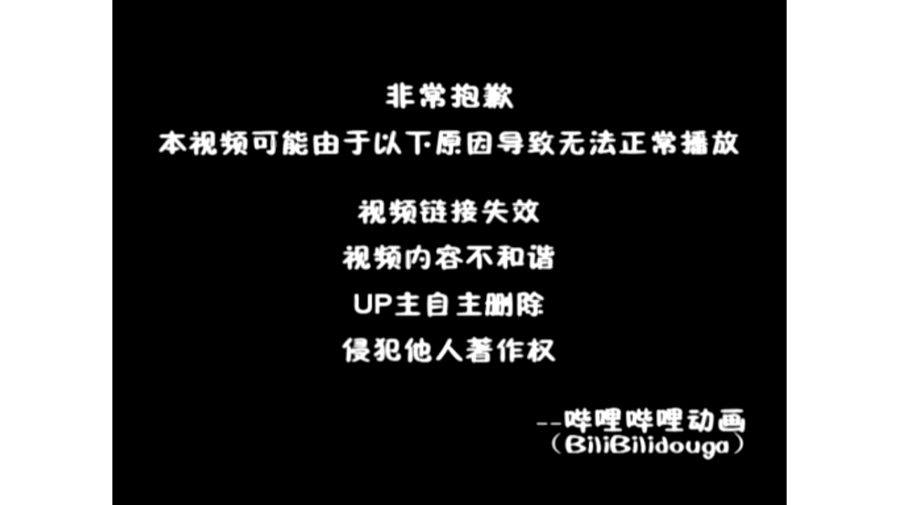

# 【Docker容器】零基础入门到实战教程，一天速通Linux运维容器篇（2026版） p04 课时4：自定义镜像-编写你的第一个Dockerfile

> 本书由课程字幕编辑而成，删除口语冗余并统一术语；时间标记用于回看原视频。

## 导读

本章围绕“核心概念”展开。阅读时建议在终端同步操作，并在每节结尾完成练习。

## 学习目标

- 理解本节的核心概念与适用边界。
- 能独立执行示例命令并验证结果。
- 掌握常见故障的定位路径。

## 1. 核心概念

*(参考时间：00:00:02)*



哈喽 接下来我们来学习的是docker fire 那么什么是docker fire嘞 这东西了 之前大家可能没有接触过啊 简单来说

docker fire它是一个包含了我们镜像构建指令的 一个文本的脚本 它的核心价值呢在于 实现了环境的标准化和自动化构建 这就是我们常说的基础设施啊 及代码

也就是IAC 那么通过它呢 我们可以用代码来定义服务器的环境 为了让大家更好的理解 我们可以看一下一个比喻啊 我们的docker fire好像是一张精心准备了食谱一样的

而镜像了就是按照这个食谱啊 制作出来的小蛋糕 那只要食谱在手 无论你是在哪台机器子上去制作 得到了蛋糕的味道了 都是完全一样的

那咱们课程重点使用的rocky linux 九的运维场景当中呢 我们的docker fire可以确保从开发到测试 再到生产环境的一致性交付 这也解决了运维工作当中啊 我的本地运行正常上线就报错了

这种头疼的问题 大家可以先观察一下这张示意图啊 那么接下来我会深入的去带领大家 了解这些指令语法的细节 那么大家可能也会有很多疑问 那么在后续的实战当中呢进行一个演示好

接下来我们来看一下 docker fire到底有哪些核心的指令来组成的 好docker fire的四大核心指令啊 承接刚才提到的一个流程 我们编写dog fire 就像是在写一份自动化运维的脚本

对于初学者来说呢 掌握矮这四个核心指令 就可以完成80%的日常镜像的构建工作 首先是from 它是让我们所有的docker fire的起点 在咱们LINUX环境当中啊

通常会写成from什么LINUX9rock linux9啊 这种这个就好比啊我们在装系统之前了 先选好一个光盘镜像 确定好地基 那么接着是run命令 他是负责在镜像构建当中啊

执行命令的 比如呢我们要在LINUX当中去安装NGINX 那么就会执行run dnf install杠YNGX 那每一个run的指令啊 都会在气象当中创建一个新的词 那么然后是copy啊

然后是copy 它的作用呢非常的纯粹啊 就是把我们宿主机上的配置文件或者源代码 搬运到我们镜像内部 那么这里也提醒大家啊 需要注意的是路径的规范性

避免找不到文件 最后了是CMD 那很多同学呢容易把它和run搞混了 其实呢CMD定义的是容器启动之后啊 默认执行的第一个动作 它在整个文件当中呢只能有一条生效啊

那如果写了多条了 他只有最后一条是管用的 大家看一下这张图啊 大家看一下这张图 那么关键的区别在于执行的时机 我们run是在构建的时候为了封装镜像而运行的

而CMD是在容器啊真正跑起来之后的 那么零基础的同学可以先重点区分这两点 接下来我们要结合大家关心的分层原理 看看这些指令啊 到底是哎怎么样生成生效的啊 好这里呢是一个交互演示啊

关于我们docker镜像分层结构的一个演示 我们可以通过这个程程序来一步一步去拆解 dog fire是如何堆叠成一个完整的镜像的 那么一切呢是从这个from开始的啊 那么这一层呢是基础镜像层 它包含了操作系统的核心文件

系统还是完全只读的 那么执行到第二层就是我们的run 这里的我们run dnf in store 杠Y这里来会产生一个新的制图层啊 所有的下载的NGINX2进制文件和依赖了 都会被打包到这一层里面

还堆叠在基础层之上 那么还有一个copy指令啊 它是用于添加应用层配置的docker的分层机制了 支持缓存 如果你只修改了配置文件啊 构建的时候呢

会直接复用前面两层的缓存 实现极速构建 然后是CMD命令啊 它本身呢不会去增加文件的体积 更像是一张便利贴 告诉我docker容器啊

启动的时候了 默认要运行哪个程序 这个属于镜像的原数据配置啊 最后呢当容器运行起来的时候 系统会加上最顶层的读和写啊

### 命令速查

```bash
docker fire 那么什么是docker fire嘞 这东西了 之前大家可能没有接触过啊 简单来说 docker fire它是一个包含了我们镜像构建指令的 一个文本的脚本 它的核心价值呢在于 实现了环境的标
docker fire好像是一张精心准备了食谱一样的 而镜像了就是按照这个食谱啊 制作出来的小蛋糕 那只要食谱在手 无论你是在哪台机器子上去制作 得到了蛋糕的味道了 都是完全一样的 那咱们课程重点使用的rocky
docker fire可以确保从开发到测试 再到生产环境的一致性交付 这也解决了运维工作当中啊 我的本地运行正常上线就报错了 这种头疼的问题 大家可以先观察一下这张示意图啊 那么接下来我会深入的去带领大家 了解这
```

### 实践检查

确认命令执行结果与课程演示一致；若失败，先检查镜像、网络、权限和端口占用。

## 2. 操作步骤

*(参考时间：00:05:58)*


读写层这里的写实复制 我们copy on write机制保证了下层镜像的安全性 所有的修改了 都只会发生在最顶层的这个call rewrite啊 好刚才呢我们已经了解了哎 探讨了都docker镜像的分层原理啊

大家应该已经知道了 镜像是一层一层叠出来的 那么在生产环境当中呢 我们如何去亲手制作一个镜像嘞 这个就涉及到了实战准备创建构建上下文 请大家看屏幕中间的终端命令啊

我们要做的第一步呢是执行make dr my nginx 创建一个专属目录 然后CD进去 接着呢 我们用一条echo命令 去创建一个包含特定内容的index HTML文件

这个就像是我们在去做饭之前了 先要把食材准备好 并且呢放在一个干净的盘子里面 这里的操作有三点 首先是建立独立的目录 实现了环境隔离

其次是准备好们要打包的海静态资源 也就是我们刚刚创建的HTML文件 最后呢我们要确保接下来的docker file啊 它是放在同一个目录里面 哎这个不仅仅是规范啊 也是为了避免后续的路径引用的麻烦

这里有一个至关重要的知识点啊 请大家看底部的重点提醒 构建上下文目的 所有文件在 在执行构建的时候都会被发送给docker守护进程 那么作为一名未来的运维工程师妹啊

你们不要记切记啊 不要在这个目录里面去放一些 无关紧要的大文件 否则的话你的构建速度啊会非常慢啊 甚至让你慢到怀疑人生 所以呢我们要尽量的保持上下文的精简

这个也是我们要养成的一个好习惯啊 那么好了啊 第一基础环境和食材的我们已经就位了 接下来我们要在这个my nginx目录里面 正式编写属于我们的第一课docker fire命令 好了既然环境和目录啊都已经准备就绪了

那我们接下来就开始动手编写这份镜像菜谱啊 这一节我们要通过一个具体的案例 也就是自定义一个NGINX镜像 带大家熟悉docker file的编写流程 首先我们都LINUX的容器啊 大家可以使用呢

wm docker fire这个指令来创建一个新的文件 这里需要注意的是了 dog fy的首字母啊 必须要是大写的 这个是docker默认识别的哎 规范的文件名

好大家请看这段脚本实例啊 第一行的from嘞 nginx late啊 这个非常的关键 它代表着我们要以官方的NGINX镜像来作为地基 也就是基础镜像

那么它的版本号呢是nice哎 最新版本 但是呢实际生产里面 不建议大家去使用这么一个最新版的啊 大家可以指定一个某个版本号 那么所有的后面的自定义修改啊

都是在这个地基上进行的 接下来了copy指令 把负责啊 把本地的我们的index点HTML文件 拷贝到人气类的一个镜像内的指定的路径 然后呢有个expose80则是来向外声明啊

我们这个镜像运行起来之后呢 会对外开放八零端口啊 这个就是从无到有的一个哎 定义镜像的核心逻辑 那么作为运维的高手是吧 我们一定要告诉大家啊

咱们LINUX环境当中操作的时候 一定要确保你的dog fire和你要拷贝的资源文件啊 处于同样的一个目录 下面 也就是我刚才提到的构建上下文 那么大家可以尝试一下啊

在自己的终端里面去把这个代码敲进去 然后呢保存退出之后呢 我们就拥有了第一个啊自定义镜像的源码 下一步了 我们要学习一下 如何把这个脚本编译成真正的镜像

好既然我们刚刚的一个dog范儿已经准备好了 接下来就是见证奇迹的时刻啊 我们要通过docker build的命令 把刚才写的那个文本文件 正式的转化成

### 命令速查

```bash
docker镜像的分层原理啊 大家应该已经知道了 镜像是一层一层叠出来的 那么在生产环境当中呢 我们如何去亲手制作一个镜像嘞 这个就涉及到了实战准备创建构建上下文 请大家看屏幕中间的终端命令啊 我们要做的第一步呢
CD进去 接着呢 我们用一条echo命令 去创建一个包含特定内容的index HTML文件 这个就像是我们在去做饭之前了 先要把食材准备好 并且呢放在一个干净的盘子里面 这里的操作有三点 首先是建立独立的
docker file啊 它是放在同一个目录里面 哎这个不仅仅是规范啊 也是为了避免后续的路径引用的麻烦 这里有一个至关重要的知识点啊 请大家看底部的重点提醒 构建上下文目的 所有文件在 在执行构建的时候都会被发
```

### 实践检查

确认命令执行结果与课程演示一致；若失败，先检查镜像、网络、权限和端口占用。

## 3. 验证与排错

*(参考时间：00:11:50)*


一个可以在rocky linux环境当中运行的镜像 大家可以看一下屏幕当中啊 这个是最经典的构建指令 它由docker build开头 配合参数和路径 然后这个指令呢一旦敲下之后啊

docker引擎就会开始解析你的代码 一层一层的进行封装 首先呢我们看一下这个杠T参数 它是tag的缩写 也就是给镜像打一下标签 在运维实战当中了

我们绝对不能乱起名字啊 推荐的格式是项目名 然后版本号 那比如这里写的是1.0版本是吧 那么如果不指定标签呢 docker fire啊

就会默认给他打上一个LIS 然后呢在生产环节里面啊 明确的版本号是安全运维的一个哎前提 请特别注意啊 命令末尾这个不起眼的点啊 这里有个点

对不对 这里代表的是当前目录啊 我们要学会啊观察这组输出的一个内容 请特别注意啊 在命令末尾这个不起眼的点是吧 这刚刚已经讲了

哎那么很多初学者构建失败啊 都是因为这个点的课程没有出现 或者说课程被人 好那么命令执行之后呢 控制台退出好 控制台会退出一大堆日志啊

作为专业的运维人员 我们要学会啊观察这些输出点 你会看到类似于step什么NM的提示啊 这个就告诉你当前正在执行docker file的一个部署 然后这会告诉你当前正在执行docker 里的哪一条指令啊

那么如果看到using catch 说明docker已经很聪明的复用了这之前的镜像 这极大地提升了在rocky linux环境下的构建速度啊 OK请大家一定要盯着这些进度看 确保每一次的构建成功了好 那么原理讲清楚了

大家可以试着在终端里面运行一下 好原理讲清楚了 我们接下来通过一个小测验啊 来看看大家对于这几个关键参数的记忆 深不深刻 好大家可以把刚才的一些构建啊先练习一下

练习完成之后呢 我们再看这三道题目来复盘一下 首先呢我们来看第一道题啊 这道题考的是docker fire的一个敲门砖 from和copy指令 大家要记住的是

在LINUX环境下编写的时候呢 from啊必须要是除了注释之外的第一条指令啊 它是我们镜像的基础底啊 基础啊 然后呢copy是负责把宿主机的文件搬到镜像里面 这两者的分工呢也是非常明确的

接着看第二道题啊 关于docker build的参数 我们来杠T是用来打什么的 是不是打标签的呀 杠F是用来指定非默认名称的door fire 那么还有一个叫NO catch啊

可以确保我们不想使用了旧的缓存 这个在调试的时候非常有用啊 然后这里还有一个陷阱 杠P的参数是docker run 运行之后才使用的镜像端口命令 那么在构建阶段呢是不起作用的

哎不要搞错了 那么第三道题了 涉及到我们之前啊 可能有些同学比较感兴趣的 叫做镜像分层原理啊 那么为了优化镜像体积呢

我们通常会利用哎反斜杠或者and符号 把相关的shell命令啊合并到一条run指令当中 这个就像C描述的样子是吧 安装完软件包之后啊 顺手的把缓存清理掉啊 这样子有能够有效的减少层数

让镜像呢更加的精简啊 这个也是运维岗位的基本功 那么通过这几道练习题

### 命令速查

```bash
docker build开头 配合参数和路径 然后这个指令呢一旦敲下之后啊 docker引擎就会开始解析你的代码 一层一层的进行封装 首先呢我们看一下这个杠T参数 它是tag的缩写 也就是给镜像打一下标签 在运维
docker fire啊 就会默认给他打上一个LIS 然后呢在生产环节里面啊 明确的版本号是安全运维的一个哎前提 请特别注意啊 命令末尾这个不起眼的点啊 这里有个点 对不对 这里代表的是当前目录啊 我们要学会啊观
docker file的一个部署 然后这会告诉你当前正在执行docker 里的哪一条指令啊 那么如果看到using catch 说明docker已经很聪明的复用了这之前的镜像 这极大地提升了在rocky linu
```

### 实践检查

确认命令执行结果与课程演示一致；若失败，先检查镜像、网络、权限和端口占用。

## 4. 小结

*(参考时间：00:17:43)*


要涵盖了我们刚才讲的一些核心知识点 哎大家可以来作答 我们来解答一下 首先第一道题啊 我们看一下它的题目 在LINUX环境下面去编写多个fire的时候

关于from和copy指令描述哪个是正确的啊 好这个题呢我们选B啊 选b gram指令必须为非注释的第一条指令啊 用于指定技术镜像 而copy用于从数值记复制文件 对不对

这刚刚已经讲过了啊 讲了几遍了 好A的描述了是颠倒了 对不对 C和D描述是错误的 哎这个不用看了

好我们看第二道题目 在执行docker build命令构建的镜像的时候啊 哪些参数及其用途说明是正确的 哎注意啊 这里是多选题啊 多选题啊

这题选ABC啊 三个选项 首先的话杠T也是tag 它是用于来标记镜像的名称以及版本 杠f fire啊 它是用于指定来构建了一个哎文件路径

NO catch是避免使用之前的构建缓存啊 都没毛病 那么最后一个选项 杠P是docker run命令的一个参数啊 用于我们启动容器时候的唉 映射端口

他这个时候是不能在构建阶段中使用的好 我们看第三道题目 在docker fire构建过程当中 为了优化镜像体积 并且减少镜像层数啊 哪一种run指令的写法符合最佳实践好

这个题呢我们选C啊 选C大家答对了吗 docker镜像构建当中呢 每一个run指令啊都会留一个新的只读层 通过反斜杠哎 可以把多个命令啊合并为一个run命令

这样子呢可以减少哎以镜像的层数 减少镜像的最终体积 然后CMD呢是容器启动时的默认执行命令啊 而不用于构建时的软件安装啊 这个题选C啊 好镜像构建好了之后呢

接下来就是进入我们的运行阶段啊 我们可以把刚才生成的镜像 变成一个真正运行的一个服务 然后呢我们可以看一下自定义的网页啊 能不能正常显示 我们第一步呢是启动容器

对不对 这里呢我们要使用的是docker run指令 注意这里的杠P参数啊 我们是把宿主机的8081端口了 映射到容器内部的八零端口啊 这样子我们才能够从外部访问它

第二部也是在rocky linux环境当中啊 至关重要的一步哎 配置防火墙 默认情况下呢我们LINUX防火墙是开启的 我们需要执行firework cmd命令 手动开放8081的端口

并且呢一定要执行reload重载 那么否则的话配置是不会立刻生效的 那么作为未来的运维工程师们呀 我们排查网络不通的时候 防火墙永远是第一个要排查的地方啊 最后我们进行结果验证

打开浏览器访问服务器的8081端口 那如果屏幕上出现了自定义的hello from什么什么image是吧 说明你已经打通了 从我们的docker fire到镜像运行的全流程 大家可以把这个命令啊死记硬背下来

好接下来 好同学们啊 最后是我们的一个总结环节 今天的课程呢也快接近尾声了 我们来回顾一下啊 首先我们今天学习了LINUX环境的四大核心指令

我们的from是用于指定基础镜像地基的run 负责执行构建时的安装命令 copy搬运本地文件 CMD了 决定了容器启动之后的默认行为啊 这四个指令是构建任何的生产及镜像的

即使者在操作流程上呢 我们要坚持先编写dog file 在执行docker build标准规范 那么正如我们前面环节当中演示的那样子啊 保持构建上下文的总结 也是每一位专业运维人员必须养成的良好习惯

那么我要特别强调的是啊 学会了编写dog file 不仅仅是掌握了几个技术指令啊 更加是思维的跨越 这标志着你正在从繁琐的手工运维 正式的迈向自动化和基础设施及代码

这是大家入职计算机运维岗位的关键一步啊 当然了 学习没有结束 容器也是短暂的 数据更宝贵啊 下一节课我们将带领大家探讨数据持久化

实战演练 我们的volume rebind mount 解决数据库容器的存储问题 那接下来呢我们就到了课程的尾声 下节课再见拜拜

### 命令速查

```bash
docker build命令构建的镜像的时候啊 哪些参数及其用途说明是正确的 哎注意啊 这里是多选题啊 多选题啊 这题选ABC啊 三个选项 首先的话杠T也是tag 它是用于来标记镜像的名称以及版本 杠f fire
docker run命令的一个参数啊 用于我们启动容器时候的唉 映射端口 他这个时候是不能在构建阶段中使用的好 我们看第三道题目 在docker fire构建过程当中 为了优化镜像体积 并且减少镜像层数啊 哪一种
docker镜像构建当中呢 每一个run指令啊都会留一个新的只读层 通过反斜杠哎 可以把多个命令啊合并为一个run命令 这样子呢可以减少哎以镜像的层数 减少镜像的最终体积 然后CMD呢是容器启动时的默认执行命令啊
```

### 实践检查

确认命令执行结果与课程演示一致；若失败，先检查镜像、网络、权限和端口占用。

## 总结

完成本章后，你应能围绕“核心概念”独立复现课程演示，并将方法迁移到实际 Linux 运维环境。

### 延伸练习

1. 在独立测试环境重新执行本章命令。
2. 记录每条命令的输入、输出和回滚方式。
3. 为配置和数据建立备份，再进行下一章实验。
