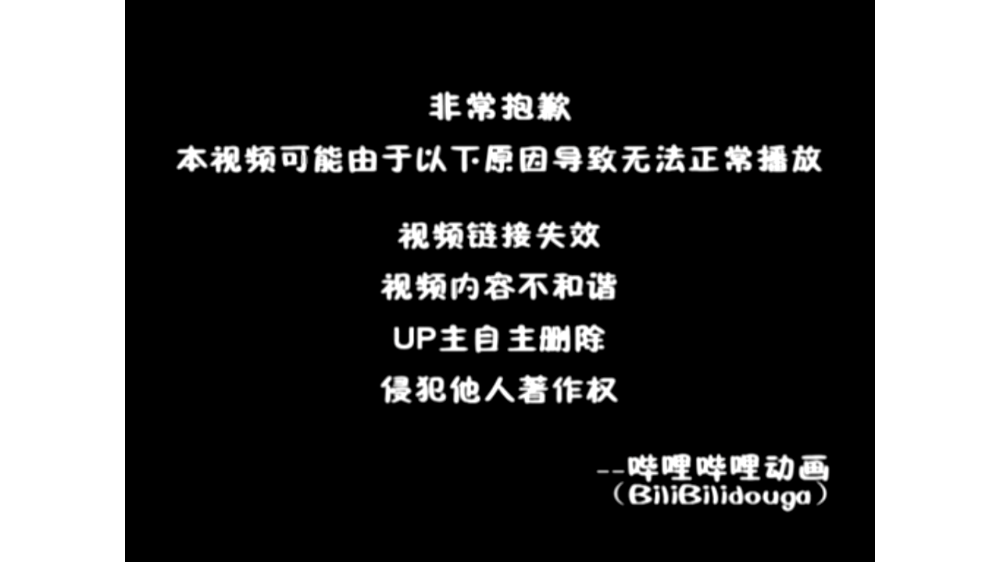

# 【Docker容器】零基础入门到实战教程，一天速通Linux运维容器篇（2026版） p09 课时9：容器运维：日志、备份与基础排错

> 本书由课程字幕编辑而成，删除口语冗余并统一术语；时间标记用于回看原视频。

## 导读

本章围绕“核心概念”展开。阅读时建议在终端同步操作，并在每节结尾完成练习。

## 学习目标

- 理解本节的核心概念与适用边界。
- 能独立执行示例命令并验证结果。
- 掌握常见故障的定位路径。

## 1. 核心概念

*(参考时间：00:00:00)*


哈喽 欢迎来到今天的容器运维实战课程啊 很高兴能够带领大家开启这段职业进阶之旅 我们今天这堂课的目标非常明确 就是要帮大家建立起容器运维的系统思维 帮助你顺利地跨入咱们的这个容器管理课程

在开始之前呢 我们先聊一聊管理思维的转变 在以前维护服务器啊 就像是修理家里面的老旧电器一样的 坏了之后呢 我们需要拆开零件一点一点的修

但是现在啊容器它就像是工业化的生产标准件 那我们的工作了不再是单纯的维修 而是通过一系列标准化的流程来管理这些组件 坏了的话也没关系啊 我们可以直接丢掉 换个新的

这就是容器运维的高效之处 那么要实现这个目标呢 第一个是可观测性 这就好比啊厨师盯着锅里面的火候 咱们呢通过logs日志 就可以掌控容器的生存记录

那么知道他现在的状态好不好 也就是backup备份 虽然啊容器是可以随意的拆 随意的换 但是呢里面的业务数据可是宝贝一样的 我们要学会持久化数据

给重要的信息啊存个档 这也是我们运维工程师的保密技能 第三个是可用性 专门负责排错当容器啊 我们又有一套标准的操作流程 像医生诊断一样的

我们可以快速的锁定病灶 并且解决它 那为了让大家学完就能立刻上手干活儿 那我们所有的操作呢 也会在企业里面常用的rocky linux9系统上进行 环境已经帮大家搭建好了

就是用的docker引擎配置和命令啊 全部都是实打实的工业级标准 准备好的话呢 我们就进入第一章 好我们来看一下怎么样去管理日志啊 日志管理啦也是我们容器的生存记录本

那刚才我们把容器运维比作维护厨房 那么容器产生的日志啊 就是它的深层记录本 不管这个容器是在欢快地写数据 还是在默默的报错 那所有的蛛丝马迹啊都会记在这里

在rocky linux9的生产环境里面 排障的第一步永远是查看输出标准 简单来说就是看看容器啊 在自言自语些什么东西 这也是定位问题最快最直接的方式 我们要记住的核心命令是docker logs

后面加上容器id 那如果你每天面对的是成千上万行日志 也不要慌 我们可以配合grape命令 去筛选一些关键的ever呀 或者warning啊等等关键字

这个就像用放大镜找菜里的沙子一样啊 一下子就可以抓住问题的所在 那如果你现在啊想要去观察容器的实时状态 我们可以加上杠F这个参数 也就是follow他 那像是一场日志的直播

屏幕会随着容器的动作而持续的滚动 让你实时监控那些动态变化的日志流 那除了这些之后啊 我们还为了提高效率 我们也帮大家整理了几个进阶的参数 我们一起来看一看这个速查表

比如杠杠tail 可以让你只看最后几行 避免了被刷屏 杠七会显示精准的时间戳 方便底核对啊 故障时刻而science了

会让你可以查看了特定时间段内的日志 掌握了这套组合拳啊 你就拿到了翻阅生存记录本的钥匙 接下来我们通过一段互动来 大家带着大家实战演练一下 好刚才呢我们通过这个互动环节

以及呢排查了我们的NGINX日志的启动故障了 大家有没有感觉到查看日志啊 就像是在厨房找漏水的源头一样 关键现在呢我们通过两道题目 把刚才我们实战当中用到的命令参数啊 彻底的记牢

第一题来考察的是大家在LINUX终端当中 最常用的实时监控的技巧 我们需要记住的是啊 想要像看直播一样的去盯着日志更新 杠F这个参数啊 必不可少

而为了避免被成千上万行的旧日制淹没呢 杠杠tail就是你最折力的截图工具 第二题了 就是进阶到了我们的docker compose的场景 我们在管理由多个服务组成的 复杂系统的时候呢

效率是第一位的 我们是该全局预览还是说定向的爆破啊 大家要仔细的辨别选项当中 关于命令组合的描述 这里的可不止一个正确答案呀 好我们来看一下解答

具体解答 首先第一题在rocky linux终端当中 如果你想要实时的追踪docker容器 产生的最新日志啊 并且呢只查看最后的实行记录 应该使用哪个命令组合好

这个题的答案呢 我们选A啊 选A在docker命令当中啊 我们的杠F了 就是follow参数用于的是持续追踪日志的输出 杠杠特有参数了

用于指定显示末尾的函数 这个是运维当中的最常用的排查错误的方法 好那我们看第二道题目 当你使用了docker compose管理 由多个容器组成的系统时 关于日志查看的操作

哪些描述是正确的 好选项的话呢 我们是选来这个选ABC啊

### 命令速查

```bash
docker引擎配置和命令啊 全部都是实打实的工业级标准 准备好的话呢 我们就进入第一章 好我们来看一下怎么样去管理日志啊 日志管理啦也是我们容器的生存记录本 那刚才我们把容器运维比作维护厨房 那么容器产生的日志
docker logs 后面加上容器id 那如果你每天面对的是成千上万行日志 也不要慌 我们可以配合grape命令 去筛选一些关键的ever呀 或者warning啊等等关键字 这个就像用放大镜找菜里的沙子一样啊
docker compose的场景 我们在管理由多个服务组成的 复杂系统的时候呢 效率是第一位的 我们是该全局预览还是说定向的爆破啊 大家要仔细的辨别选项当中 关于命令组合的描述 这里的可不止一个正确答案呀 好我
```

### 实践检查

确认命令执行结果与课程演示一致；若失败，先检查镜像、网络、权限和端口占用。

## 2. 操作步骤

*(参考时间：00:06:46)*



选ABC 这个题目来是比较简单啊 docker compose log了 它是一个聚合工具啊 默认的它是显示项目当中所有的服务的日志 并且呢按照颜色区分

他可以接受啊 服务名作为我们的过滤条件 也支持杠F去实时追踪 那选项D了是错误的 因为我们compose提供了比原生docker了 更加方便的日志聚合功能

来刚刚啊大家在知识检测环节的表现呢都很棒 那么对于日志命令的掌握了 我相信大家已经非常扎实了 现在啊我们进入一个实战性比较强的环节 就是在真实的运维工作当中 很多是部署在LINUX上的生产环境的

它是完全没有外网的 这个时候呢就需要用到我们这节课的主角啊 镜像的备份和迁移 首先我们看第一步啊 导出镜像 我们在本地环境构建好镜像之后了

使用的docker save命令 注意这里的杠O的参数啊 它代表的是output 也就是把镜像打包成一个点tar格式的文件 就好像呢把做好的菜肴装进保鲜盒里啊 方便你进行U盘或者内网传输

把他带走 那么当你把这个文件拷贝到目标服务器之后啊 我们再进行导入 使用docker load命令配合杠I参数 也就是input 就可以把镜像呢

重新的加载到目标机器的docker引擎当中 整个过程啊不需要你哪怕1KB的唉外网流量 那么刚才呢在笔记里面也特别标注了应用场景 对不对 这个在内网部署啊 或者版本存档的时候非常的关键

但是啊大家一定要记住这里的核心区别啊 safe导出的是静态的镜像模板 它不包含容器运行当中产生的动态数据 如果你想备份容器里的业务数据了 那又是另外一套逻辑了 好那么掌握了镜像的这个腾转挪移

对不对 离线环境了就难不倒你了 不过啊既然提到了数据 如果容器里的数据库或者日志需要持久化备份 那应该怎么办呢 好接下来我们看看后面的啊

就是volume的备份思路 好刚才我们学会了怎么样搬运进项 但是呢这只是搬了空房子容器里面的财务啊 也就是我们的一些业务数据 才是运维的重中之重 现在呢我们来看一下数据卷啊的备份思路

大家要记住的是容器啦 就像厨房里面的灶台坏了 可以随时换一个新的 但是volume啊是咱们的地下室仓库 容器容器销毁了我们数据了 仍然稳稳的存在速度界的挂载点上

所以啊备份容器数据的本质就是在去宿主机的 复制这个仓库里的内容 那在咱们的LINUX系统里面 最直接的物理备份方式啊 就是用time命令看这个范例啊 我们直接把宿主机上对应的volumes目录

进行压缩打包 这个就像是把仓库里面的货啊 直接搬到一个大箱子里面运走 操作非常的简单 直接 不过啊这里呀还是要告诉大家啊

像我们职业运维是法必坑指南 特别是一些MYSQL这种数据库的最稳妥的方式了 是双重策略 怎么样双重策略了 我们先用MYSQL当啊mysql dump去导出一份了逻辑脚本 然后啊再去做刚才说的物理备份

这样子的话有个双重保险 可以保证我们在数据恢复的时候唉万无一失 那么为了确保咱们数据备份的万无一失之后呢 我们接下来需要实时的掌控容器的身体状态 在rocky linux9的运维工作当中啊 就好像呢厨师要随时盯着我们的灶台的火候

一样的 我们也需要通过状态监控 来确保容器的平稳运行 那么这节课我们重点看两个命令 docker states和docker inspect 首先是docker states啊

这里啦可以看作是容器的 还体检实时监控器 如果你使用过多LINUX里面的top命令 那你对他来肯定是不陌生的 这个拓扑命令呢 它可以让你一眼就看到

每个容器占用了多少个CPU啊 吃掉了多少个内存 以及啊网络IO的吞吐量 这个在处理生产环境的性能瓶颈时呢 是我们排查哪个容器 吃掉了宿主机资源的头号工具

这里还有个小窍门啊 如果你不想看着它一直去跳动唉 只想拿某个瞬间的快照 记得加上一个杠杠 NO stream参数 那么这一点在写自动化运维脚本的时候

非常有用 如果说states是看表面的体力 那么docker inspect就是在给容器啊做深度扫描 也就是底层的探查 它会返回来一大串的JASON的格式字符串啊 不要被它吓到了

里面藏着容器的最核心的细节 比如容器的内部地址 环境变量 还有我们刚才啊反复提到的mount数据卷挂载点 那么当你发现容器启动了 但是连不上网或者呢找不到文件的时候了

inspect就是你的显微镜

### 命令速查

```bash
docker compose log了 它是一个聚合工具啊 默认的它是显示项目当中所有的服务的日志 并且呢按照颜色区分 他可以接受啊 服务名作为我们的过滤条件 也支持杠F去实时追踪 那选项D了是错误的 因为我们c
docker了 更加方便的日志聚合功能 来刚刚啊大家在知识检测环节的表现呢都很棒 那么对于日志命令的掌握了 我相信大家已经非常扎实了 现在啊我们进入一个实战性比较强的环节 就是在真实的运维工作当中 很多是部署在L
docker save命令 注意这里的杠O的参数啊 它代表的是output 也就是把镜像打包成一个点tar格式的文件 就好像呢把做好的菜肴装进保鲜盒里啊 方便你进行U盘或者内网传输 把他带走 那么当你把这个文件拷
```

### 实践检查

确认命令执行结果与课程演示一致；若失败，先检查镜像、网络、权限和端口占用。

## 3. 验证与排错

*(参考时间：00:13:42)*


好那么当容器启动失败的时候 我们通常遵循着看状态 查日志 减配置的排障闭环 那我们可以通过这个模拟器来实操一下 挂载路径错误了

是容器启动失败的常见原因啊 在这里啊可以模拟挂载是否正确 如果容器找不到指定的配置文件了 它也会立刻退出 我们在这这里也可以切换我们的配置 挂载等等

好我们来看一下啊 首先我们来把这个路径啊是错误的 对不对 配置文件给他搞正确 我们来试一下 来启动容器好

这个时候呢他直接退出了位置什么了 扣的一 然后我们呢可以通过这个牌照啊 牌照首先来看一下哎是不是有这么一个image啊 啊image它有一个编号了 对不对

但是呢它是没有启动的 然后我们也可以看这个它提示啊 没有这个挂载点 对不对 然后我们也可以哎inspect去看一下 他挂了点挂在data里面的

对不对 但是这个路径不存在 我们把这个路径给他修复一下 修复一下 然后呢他就可以启动了啊 很简很简单啊

很简单 然后呢如果我们是配置文件错了 我们来看一下啊 来如果我们是配置文件错了 它会提示什么呀 也是一样的扣的啊

127现在是127 然后我们看一下logo啊 他说是etc这个app是吧 Config ym not found 然后把它搞定以后啊 我们再重启一下

哎就已经启动成功了 是不是很简单 然后我们来这里可以看一下logo啊 dodocker inspect id去看一下它的一个详细信息 来挂载点描述啊 这里都有

那排查的话呢我们一般来说啊 他不是去靠猜的啊 大家要记得 我们可以通过这个日志以及配置信息等等的 去获取我们的证据啊 最后呢针对性的去修正

好那么刚才呀我们已经聊到了排错的核心逻辑 还掌握了一些具体的命令 那么接下来我们把这些逻辑啊 应用到具体的避坑指南当中 那么在运维的这种家庭厨房里面 我们想知道哪口锅容易糊

拿块抹布啊 容易丢 能够让我们少走很多弯路啊 大家可以看一下这张排错表 里面涵盖了面试和实战当中的 最常见的四大场景

比如说端口冲突啊 这个就像两个厨师啊 非要抢同一个灶台容器了 自然起不来 或者是磁盘满了啊 就像我们垃圾啊堆到天花板一样的系统了

想写数据也写不进去 那遇到这些啊 我们记得先用刚才讲过的日志命令去定位 那针对咱们使用的rocky linux9系统呢 有一个特别容易忽视的点 就是防火墙FIREWOR

那如果你的容器服务正常了 但是啊就是外部访问不了 往往就是这道防火门啊 忘了给容器流量开个小窟窿 那一定要去检查防火墙的状态 以及呢网关放行的情况

那么网络问题里面的DNS的解析也是一个常客 如果容器里连不上外网 我们要去检查一个叫resolve点CNF这个文件 这个文件呢我们把它理解为一个电话本 一样的啊 那么下次要是遇到CURL的不同域名

我们可以看一下这个配置文件 验证一下公网的DNS啊 是不是连通了的 最后呢也不要忘了啊 定期给系统啊做一个大扫除 我们做实验产生的一些无用的镜像

还有缓存会悄悄地吃掉我们硬盘 我们记住这个命令啊 Docker system pull 哎这个是我们的一键啊 释放冗余空间的命令 可以保持我们的系统清爽

然后这个命令呢 在维护生产环境的时候也是非常实用的啊 大家一定要记在笔记本里面 既然我们已经学完了 系统清理和故障排查的技巧 现在呢就到了我们见真章的时候

那么这一组容器的唉综合实战测试了 模拟的是我们运维工作当中啊 最高频的几个场景 大家也不用紧张啊啊好 那么主要是看一下大家的知识点 掌握的扎不扎实啊

第一题考验的是镜像的迁移 大家需要看准了啊 虽然export也能够导出 但是啊他会丢掉镜像的灵魂 也就是我们的原数据 还有历史层的信息

那我们要做到完整的镜像搬家啊 必须要使用docker safe和docker load这一对黄金搭档啊 这个在离线部署生产环境的时候是必修课啊 对于第一题了 我们选的是B啊 那么docker safe的命令呢会将镜像啊

以及它的所有的历史层 以及呢原数据打包成一个完整的tar文件 那么这种呢就非常适合在断网 或者没有那个数据源的这种情况下去进行啊 镜像的迁移 docker inexport呢就是针对于我们容器文件的哎

系统快照 但是呢它会丢失历史的记录 我们就好比了搬走了房子里面的家具啊 却丢掉了房子的设计图一样的好 所以来这个题我们选B答案啊 好那么我们看第二道题目啊

### 命令速查

```bash
docker inspect id去看一下它的一个详细信息 来挂载点描述啊 这里都有 那排查的话呢我们一般来说啊 他不是去靠猜的啊 大家要记得 我们可以通过这个日志以及配置信息等等的 去获取我们的证据啊 最后呢针
CURL的不同域名 我们可以看一下这个配置文件 验证一下公网的DNS啊 是不是连通了的 最后呢也不要忘了啊 定期给系统啊做一个大扫除 我们做实验产生的一些无用的镜像 还有缓存会悄悄地吃掉我们硬盘 我们记住这个
Docker system pull 哎这个是我们的一键啊 释放冗余空间的命令 可以保持我们的系统清爽 然后这个命令呢 在维护生产环境的时候也是非常实用的啊 大家一定要记在笔记本里面 既然我们已经学完了 系统清理
```

### 实践检查

确认命令执行结果与课程演示一致；若失败，先检查镜像、网络、权限和端口占用。

## 4. 小结

*(参考时间：00:20:17)*


这个是关于om的一个判断 也是啊很多新手啊最头疼的地方 那么大家可能会记得啊 当容器呢因为内存耗尽了 而被系统强制杀掉的时候 那他的状态啊是瞬时的

我们实时监控了success啊 可能抓不住那一秒的峰值 而docker inspect里面的om kilder字段呢 就是我们案发现场的证物 一样的能够直接告诉我们的真相 最后了有一个简答题

对不对啊 第二题我们答案选B啊 选b docker inspect的结果当中啊 我们这个stage节点下的OOMQ字段啊 那么第三个简答题 我们要深入到rocky linux的底层啊

我们记住这个路径 哎docker然后来volume下面还有一个data啊 我们直接操作数主机的路径进行back up 就像是绕过一些繁琐的取餐窗口 而直接的进到后台里面去搬货 那么不经过容器的文件系统转换呢

效率可靠性在处理大数据量的时候 优势非常的明显 那也请大家仔细的作答 完成之后呢 我们将通过这些案例 总结出一套属于你们自己的哎排错流水线

好那么这个题目啊 我们看一下啊 首先的话我们的默认的路径 我刚刚其实已经讲了 对不对 默认的路径在哪里啊

来默认路径 是不是我们的VR Lab docker volume Bike up 然后来v o l r volume 然后嘞哎DA啊

这个是默认的路径 那么直接在宿主机上哎操作这个类更高效啊 直接在宿主机 更高效是因为什么呢 第一我们的宿主机啊 拥有了完整的ITNU工具链

什么意思呢 那就是我们那些软件啊 比如我们那些软件 比如我们的哎tr啊 i think啊 等等啊等等

那么呢处理速度也快啊 第二个是什么呢 无需 通过a docker e x e c 进入耳容器环境减少了啊 资源开销

而复杂 度啊 复杂度 第三个是什么 即便我们的容器处于停止状态 是不是

处于停止状态 宿主线上的数据啊 依然可以来直接读取 方便啊 随时进行灾难恢复 这是这几点啊

这几点 那么大家可以参考一下啊 参考一下 但是这个题呢也也不是绝对的答案啊 你们可以参考一下 然后大家也可以思考一下啊

在实际的啊实际的生产环境当中 课后课后去思考一下啊 在实际的生产环境当中啊 如果发现容器啊频繁的触发了OOM 那除了增加物理内存 我们从docker的运维的角度来

还可以做哪些优化啊 大家可以讨论一下 或者来思考一下 好那么同学们啊 经过前面几个环节的一个实战演练 来我们这一堂课了

就大概要结束了 现在呢我们来对今天的内容啊做一个复盘 首先是核心的啊 工具箱就像我们之前所比喻的啊 我们管理docker就像厨房掌勺一样的是吧 我们用logs来看火候

用save和load来来做转移食材 我们通过states 可以随时看着我们的灶台是不是在负载张 还可以通过volume来保存 我们辛辛苦苦做出来的一个成品 还有大家一定要记住啊

排错的第一步永远是查看日志啊 这个也是我们运维人的一个生存求生指南 关于职场的进阶了 我建议大家课后去进行一个实践 正如我们之前在第九页里面看到的一样的啊 熟练地掌握docker compose下的排数流水线

就可以 让我们在面对复杂的企业级环境的时候啊 更加的游刃有余 但是呢这只是咱们运维之路的第一站 我们单机容器玩的转 只是打好了地基

我们的下一站呢就是我们的cooper nice 也就是我们常说的K8S 那到时候了 我们将面对的是成百上千个容器的集群编排 挑战更大 但是呢更有成就感

希望今天呢能够把学到的茶一看宝四字箴言 落实到日常工作当中 保持好奇 不断复盘 我会在K8S的课程里面等着大家

### 命令速查

```bash
docker inspect里面的om kilder字段呢 就是我们案发现场的证物 一样的能够直接告诉我们的真相 最后了有一个简答题 对不对啊 第二题我们答案选B啊 选b docker inspect的结果当中啊
docker然后来volume下面还有一个data啊 我们直接操作数主机的路径进行back up 就像是绕过一些繁琐的取餐窗口 而直接的进到后台里面去搬货 那么不经过容器的文件系统转换呢 效率可靠性在处理大数据量
docker volume Bike up 然后来v o l r volume 然后嘞哎DA啊 这个是默认的路径 那么直接在宿主机上哎操作这个类更高效啊 直接在宿主机 更高效是因为什么呢 第一我们的宿主机啊 拥有
```

### 实践检查

确认命令执行结果与课程演示一致；若失败，先检查镜像、网络、权限和端口占用。

## 总结

完成本章后，你应能围绕“核心概念”独立复现课程演示，并将方法迁移到实际 Linux 运维环境。

### 延伸练习

1. 在独立测试环境重新执行本章命令。
2. 记录每条命令的输入、输出和回滚方式。
3. 为配置和数据建立备份，再进行下一章实验。
