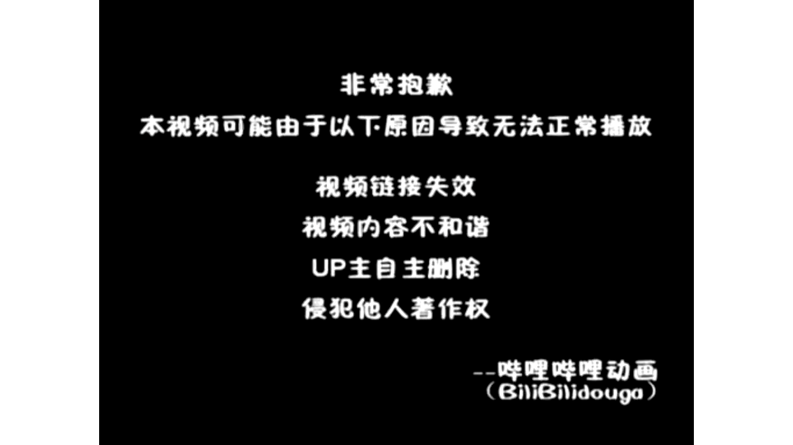

# 【Docker容器】零基础入门到实战教程，一天速通Linux运维容器篇（2026版） p10 课时10：展望与安全-从 Docker 到 Kubernetes

> 本书由课程字幕编辑而成，删除口语冗余并统一术语；时间标记用于回看原视频。

## 导读

本章围绕“从 Docker 走向云原生”展开。阅读时建议在终端同步操作，并在每节结尾完成练习。

## 学习目标

- 理解本节的核心概念与适用边界。
- 能独立执行示例命令并验证结果。
- 掌握常见故障的定位路径。

## 1. 从 Docker 走向云原生

*(参考时间：00:00:01)*



哈喽 欢迎来到今天的云原生运维实战课程 那么今天我们要探讨的主题是 如何从单机容器时代 跨越到大规模集群编排时代 我们先来回顾一下docker

最大的贡献是解决了环境一致性的打包问题 它好比给软件穿上了一个标准的集装箱 让程序在开发测试到生产上限的迁移 过程当中呢 不会因为环境差异而报错 但是啊随着业务增长

当容器数量从几个膨胀到成百上千个的时候 手动管理了就变得不可能了 那如何实现自动扩容呢 容器宕机了 怎么自动回复这些大规模的运维的挑战啊 正是我们今天要解决的问题

那面对这些问题呢 我们的K8s cooper nice就登场了 COOPERATIS被誉为云时代的操作系统 那如果说docker是单个的集装箱 那么K8S就是那个管理啊 万千货柜自动化调度航线的智能港口指挥中心

本节课程的核心 就是要带领大家攻克K8S的基础架构理解啊 像pod也就是容器组 它是K8S当中呢最小的运行单位 好比一个豌豆荚里面包含着几颗豆子 以及了我们的deployment叫做部署对象

那么部署对象是负责控制应用的版本的数量 那么这些核心概念了解之后了 我们再建立起安全运维的第一意识 那作为一名运维工程师 掌握这些技能了 真是我们迈向高薪岗位的敲门砖

大家准备好的话 我们就马上开始具体的架构剖析 刚才啊我们提到了架构剖析 那么想要深入理解名媛生运维 首先呢我们得搞清楚三个核心概念的本质区别 我们可以通过一个非常形象的房产比喻

来理解他们 首先是虚拟机 是比较经典的啊 我们的虚拟机软件 那么它像是一栋啊独立的房子 自带完整并且独立的地基

水电以及呢操作系统 虽然安全性极高 但是呢资源的占用却非常的大 那么我们的VM启动的时候呀 往往是需要分钟级的 那么分中级的话呢

在运维当中啊 这个就意味着它的灵活性相对较低 接下来的容器container 比如我们常用的docker 它更像是精装修的公寓 大家共享大楼的公共设施和内核

启动了是毫秒级的 而且部署密度极高 如果你需要快速扩容一个服务容器啊 是绝对的首选 那么CUBERNICE呀 也就是K8S她扮演了什么角色呢

他是公寓管理员啊 当公寓里的房间出现故障的时候 也就是hold容器组崩溃的时候 它会自动的修复 当住户变多 他负责扩建和调度资源

它让大规模的容器管理变得自动化智能化 最后啊请大家注意底部的rocky linux9 无论是我们的独立的房子还是公寓大楼 都是啊需要建立在稳固的地基上的 那么LINUX了就是承载了容器和集群的稳定底座 也是我们在后续实践当中了

将全程使用的操作系统理解了这些层级关系啊 我们就可以更好地看清接下来的逻辑架构了 好那么接下来让我们进入K8S的内部啊 看看这位管理员具体是如何工作的 好本节课了 我们来开始进行一个交互探索

我们来了解一下cooper atis的逻辑架构 cooperates了 简称K8S 那我们可以把K8S集群 看作一个高度的自动化的工厂 那首先呢它有一个叫做master节点

master节点是集群的大脑 他负责管理决策 比如决定哪个容器该去哪里运行 在LINUX运维当中呢 它是最核心的控制面 worker节点是四肢

那么这个是真正干活的地方 不得运行你的容器化应用程序 一个集群通常有多个这样的生产车间 API server它是集群的唯一的入口 无论是你输入的命令还是各个组件之间的交流 都需要通过这个网关

它是整个工厂的枢纽 etc d是K8S的数据库 你可以把它当成一个笔记本 那么通过这个笔记本啊 它保存了集群的所有状态数据 那么作为我们运维人员这一部分了

我们要记住的是 永远啊不要去修改 而不要去手动直接的修改它的内容 那么pod呢它是最小的部署单位 你可以把它想象成集装策略啊 里面呢装着一个或者多个应用容器

它是啊我们应用的一个运行的实例 那么从master决策到API server传达 再到cooperate t执行 并且在worker节点去启动这个pod 这个就是我们K8S协同的基本工作流程 好那么刚才我们梳理了K8S的逻辑架构

现在我们来看这套架构当中 最核心的三个逻辑对象 我们来把它称为K8S的三剑客 也就是pod deployment和service 在rocky linux的生产环境当中了 这三点构成了我们运维工作的日常核心

### 命令速查

```bash
docker 最大的贡献是解决了环境一致性的打包问题 它好比给软件穿上了一个标准的集装箱 让程序在开发测试到生产上限的迁移 过程当中呢 不会因为环境差异而报错 但是啊随着业务增长 当容器数量从几个膨胀到成百上千个
docker是单个的集装箱 那么K8S就是那个管理啊 万千货柜自动化调度航线的智能港口指挥中心 本节课程的核心 就是要带领大家攻克K8S的基础架构理解啊 像pod也就是容器组 它是K8S当中呢最小的运行单位 好比
docker 它更像是精装修的公寓 大家共享大楼的公共设施和内核 启动了是毫秒级的 而且部署密度极高 如果你需要快速扩容一个服务容器啊 是绝对的首选 那么CUBERNICE呀 也就是K8S她扮演了什么角色呢 他是
```

### 实践检查

确认命令执行结果与课程演示一致；若失败，先检查镜像、网络、权限和端口占用。

## 2. 安全基线与最小权限

*(参考时间：00:08:17)*


首先第一位是pd中文名字 我们把它叫做容器组 它是K8S的最小调度单位 大家可以把它形象地理解为一个房间 里面住着一个或者多个容器 这个房间里的容器啊

共享着网络和存储资源 需要记住的是 K8S并不是直接管理容器 而是管理pod这个房间 那有了房间谁来打你了 那平时的打理工作就交给了我们的deployment

也就是部署对象 他的角色像是房产经理 你只需要告诉他 你需要几个副本 那也就是我们的期望状态 它就会确保系统里面始终运行着这么多pod

即使了某个pod崩溃了 deployment也会立即啊启动一个新的来补位 这里就是我们常说的自愈能力 那么当pod发生变动 IP地址改变的时候呢 用户该怎么访问呢

这时候啊就需要service 也就是服务 它好比是酒酒店前台啊 固定在那里了 无论后端的pod怎么样更替前台的地址了 永远是不变的

service负责负载均衡 并且为外部访问提供一个稳定的入口 完美的解决了pod IP不稳定的这种痛点 最后啊大家可以看一下这张对比表 在运维场景当中呢 pod是运行的载体

deployment负责扩缩容和更新 而service则负责接入流量 理清了这三者的分工 我们接下来的cooper Ctrl 命令行操作就会变得非常顺手 好刚才呢我们梳理了pd deployment和service的分工

现在呢我们来检验一下大家的理解深度 这三道题啊 涵盖了控制平面的架构 资源对象的协作以及流量转发的原理 大家可以暂停 然后来回答一下

我这边给大家做一段简单的介绍啊 首先第一题了 它是关于master节点的考察 我们要抓住入口这个关键词 而在第二道题多选题里面呢 请重点参考deployment

也就是项目经理 它是如何通过副本数来维持系统的稳定的 第三题则回到了我们运维实操的核心 在LINUX环境当中 由于pod随时可能重建 并且呢更换IP

那service 是如何利用标签选择器 来充当固定的分期号码的 请大家仔细的审题 那现在呢也请大家开始答题 并且结合我刚才打的比喻

来理解这些抽象的概念 完成之后呢 我们会针对大家容易混淆的知识点 进行深入的剖析 好我们来看一下答案啊 首先第一道题在K8S集群当中

master节点控制平面啊 就是好比是指挥部 对不对 那以及呢与worker节点分工是不同的 那么关于master节点职能描述的哪个选项是正确的 好这个题啦

我们选B啊 选B my cooper API server server啊 它是集群大脑的入口 所有的指令呢都必须由他转发 而cooperate ate

而cooper poxy啊 通常呢它是运行在我们的啊 worker节点负责容器管理和网络转发的 那么etc d呢它存储的是集群的状态数据 而不是呢业务数据好 那么第一题答案选B

大家答对了吗 那我们看第二道题目关于了deployment 也就是部署对象与pd之间的关系 哪个描述是正确的好 这里是多选题啊 答案呢我们是ABC3个选项啊

那么需要说的是什么呢 我们来deployment的核心职责 它就是一个自愈以及副本控制 当pod异常或者缺失的时候了 pod本身它是随毁随灭的 那么IP呢它也是经常变化的

那么IP的固定啊 它是由service负责的 而不是让我们的deploying ment啊 这里要搞清楚 好第三道题啊 我们在rocky linux9环境当中管理集群的时候了

由于pod的IP地址会随着重建而发生变化 我们呢需要使用service 也就是服务对象来提供稳定的访问 关于service的负载均衡作用啊 下列描述正确的是什么 那么答案了

我们选a service 通过标签选择器动态关联后端pd 屏蔽了pd IP变动的影响 service的核心机制啊 是使用标签选择器自动的去跟踪匹配的pod IP 那么无论pod如何漂移或者重建

service的虚拟IP保持不变 这个过程是自动化的 无需人工干预 Ip tables 好这三道题目了 大家答对了吗

接下来是来到了我们的一个实战课程啊 我们的命令行工具cooper Ctrl 那么刚才呢已经通过了测试去巩固了核心概念 有了理论支持之后啊 我们现在进入实战环节 这一章节当中

我们要认识的是K8S运维当中最重要的伙伴 命令行cooper Ctrl 我们可以把cooper Ctrl形象地理解为集群的遥控器 那作为运维工程师了 我们不需要直接去操作复杂的后台数据 而是通过cuber catal与API server

也就是我们的应用接口哎 程序服务器进行交互 那么它是我们管理所有资源对象的 唯一的官方入口啊 地位了非常非常的核心 在日常运维当中啊

这里有几个指令 这个懒必须要练成一些肌肌肉记忆啊 首先是get get

### 实践检查

确认命令执行结果与课程演示一致；若失败，先检查镜像、网络、权限和端口占用。

## 3. Kubernetes 的核心对象

*(参考时间：00:16:30)*


用来快速的查看资源状态 看看我们的pod啊是否正常运行 DESCRIBBLE是详细透视啊 我们可以深入的观察对象的具体配置 和运行事件 而logs就是我们排站时候的听诊器啊

特别是这个logs 那么大家之前关心的一些容器排错的流程呢 绝大多数的时候啊 就是第一步呢就是通过它来查看日志的 那针对我们使用的LINUX系统安装的过程啊 非常的强调规范化

我们会先配置DNF的官方软件源 然后使用标准的df install m命令进行安装 那么这种安装方式不仅操作简单 也更加利于后面的哎系统安全的更新 以及版本的管理 那很多同学担心啊

初学阶段没有大规模的集群环境 那这个时候呢 我们mini cooper就是大家的本地神器啊 它可以在你的电脑上模拟出多节点 容器调度的核心逻辑是零成本快速验证配置 进行实验的最佳场所

有了它之后啊 大家在课后就可以放心 大胆的进行各种的操作练习了 接下来我们讲的是容器安全防御的第一道防线 刚才我们通过了mini cooper体验了本地实验的便捷 但是呢要把应用啊

真正的跑在rocky linux的生产环境当中呢 安全是我们的生命线 那么如果还没有安装好的 同学们可以在评论区留言 拿到我们的安装脚本 先在本地把环境搭建起来

体验几个命令之后呢 我们再来接着学习本小节的内容 那么在运维的规范当中啊 最核心的原则就是最小权限原则 简单来说啦 就是绝对啊严禁用root

也就是以超级管理员的身份来运行 生产环境的容器 如果容器被黑客攻破了 而他呢又是以root身份进行运行的 那黑客可能直接通过漏洞控制啊 整个我们的容器哎

整个的宿主机系统大家也可以看一下啊 右边有一个非常形象的比喻 最小权限了 好比是酒店的一些房卡一样的 你应该啊只能够打开属于你的那一间房间 而不是拿一张能够打开

那么作为一名合格的云原生运维工程师 我们要时刻守好这个边界 在具体的DOCKFIRE编写当中 我们通常会像这样啊 先通过命令去创建一个普通用户 比如app user

这样即便是程序运行报错或者被攻击损失啊 也会被控制在最小范围内 另外镜像的溯源也很重要 我们要确保所有的基础镜像都来自 官方或者企业受信任的仓库 并且要像给系统打补丁一样的

定期的扫描和更新的镜像 接下来我们就针对这种安全权限的配置 进行一次深度的探讨 好那么接下来又是到了我们的运维实操环节 镜像的扫描以及呢日志的审计 刚才我们聊到了镜像的溯源与安全理念

现在我们就进入了实战环节 那么看一下在运维岗位上 我们具体如何去通过工具来守护安全底线 并且解决故障 首先呢是镜像扫描 在生产环境当中

我们不能盲目地信任任何下载的镜像 我们会使用一些工具来识别 系统包中的一些漏洞 安全漏洞啊 比如我们的TVY或者grape这种工具是吧 那么场景呢就是发布之前进行镜像的体检

确保啊 他没有携带已知了病毒代码 那如果容器当中出现了一些问题了 我们就得靠日志审计的组合拳来定位了 大家要注意的是 区分两个核心命令

如果是查看应用层面的 报错了 我们首选dog logs 但是如果涉及到集群底层的通讯或者启动问题 那么在我们的LINUX系统里面呢 我们要查看系统级的日志命令是什么呀

是不是我们的general Ctrl杠U 然后cooper net这个参数呀 那除了日志啊 实时监控也非常的重要 大家以前在LINUX里面学过哎 我们的top命令看系统负载

在K8S里面 我们有对应的cooper stop 它可以帮助你去查看 还实时的查看hod的CPU和内存memory占用 那如果你发现某个pod突然食欲大增 占用了过多的资源

我们呢就是可以及时的去识别并且限制啊 防止它拖垮整个节点 最后啊 我们要为rocky linux9节点构建最后一道安全屏障 我们的FIREWORD防火墙策略 作为专业的运维

我们要遵循的是什么呢 最小化开放原则 这样意味着除了K8S组件通讯啊 必须的几个端口之外 其他所有的入口都应该是关闭状态 只有把地基打稳了啊

打扎实了上层的应用啊 才能够跑得安心 好大家可以在本地啊去把这些命令练习练习 熟悉熟悉 那么熟悉完之后呢 我们就来进入到我们的测试题目环节

好那么刚才的实战啊 我相信大家已经给防火墙哎 筑起了防火墙这种安全防线 那么真正的运维了 我们需要更加复杂的一些挑战 那么这几个题啊

模拟了生产环境当中最常见的安全和排障场景 请大家结合我们前面提到的最小化权限原则 先思考一下 然后再来答题 好我们现在呢我们来分别看一下几道题嘛 首先看第一道题

它是关于镜像image创建的 那么镜像啊就像是应用的系统模板 那很多新手来是为了方便直接以root用户对吧 那么这个root用户就像给了每个访客

### 命令速查

```bash
DNF的官方软件源 然后使用标准的df install m命令进行安装 那么这种安装方式不仅操作简单 也更加利于后面的哎系统安全的更新 以及版本的管理 那很多同学担心啊 初学阶段没有大规模的集群环境 那这个
```

### 实践检查

确认命令执行结果与课程演示一致；若失败，先检查镜像、网络、权限和端口占用。

## 4. 学习路线与小结

*(参考时间：00:24:49)*


非常危险 正确的做法是像选项B这样子是吧 指定明确的版本号 比如我们的python3.9什么什么的啊 并且呢使用非root用户运行 这样才能最大程度地压缩攻击面

让黑客无从下手 所以呢这个题我们选B啊 只有B的话是符合最小化原则的 那么首先的话指定这个版本号 它是可以避免啊 镜像版本的一个漂移产生的事故

其次的话这里有个SLIM是吧 slim这个呢是减小了镜像的体积 移除了一些不必要的工具 从而缩小了攻击面 最后了他还使用了非root用户去运行应用 它这样子可以防止一些应用漏洞啊

导致了我们宿主机被提前控制了 那么其他的一些选项呢 我们的A选项它是使用了root 并且啊版本不明确 风险极高 那么方案C当中呢

很多很多的一些开发工具保留了对吧 它也会增加一些安全隐患 方案D当中呢缺乏一些版本控制啊 属于运维的大忌 好第二道题目 我们是一个经典的台账场景啊

我们容器卡在create啊 状态没有跑起来 这个时候我们去查标准输出日志的logo时候 往往是一片空白的 那我们需要使用的是docker inspect这个命令 它能像ct一样去扫描们透视啊

容器的底层配置 可以帮你去找出啊 端口占用或者挂载路径不存在等等啊 这些低级的配置错误 这里啊记住一点 inspect查的是原数据

是我们运维进阶的必备的法宝 然后我们docker inspect 这返回的是容器的详细的一些JSON配置信息 包括了我们的挂载券状态 端口映射啊 错误原因等等的一些元数据

那么当容器是由于配置错误无法启动的时候 我们程序内部的 可能根本就是没有产生任何日志的 所以呢选项A就是logs是吧 往往是看不到有效信息的 而容器没有启动的时候了

我们选项B和选项D啊 包括我们states啊 以及呢ex e c 它是啊没办法正常工作的 所以在这种底层的排错场景下来 inspect是探测真相的首选工具

那么第三个题啊 假设你需要为一个新项目组创建cooperate is 命名空间啊 name space可以理解为 集群内部而实现资源隔离的虚拟园区 为了贯彻最小化权限和资源公平分配的原则

请简述该name space上你应该配置哪三个核心策略 来保障集群的安全与稳定啊 那这个题怎么回答呢 好第三道题啊 我们要管理的是叫什么命名空间 Name space

那let me space啊 就像是集群里面的一些什么呢 虚拟的园区 我们为了啊不让把整个组的是吧 把全公司的资源耗尽了 我们要配置什么呀

第一个是我们的RBAC 而配置基于角色的访问权限控制 确保了开发人员只能管理啊 该name space类的一个资源 第二个是我们的资源配额 Resource qua

类似于家庭的一个电量限额 防止了资源超支 防止了一个项目组消耗了过多的CPU和内存啊 导致了整个集群的崩溃 那第三个了 我们有一个叫网络策略或者我们的资源限制啊

保证我们园区内的秩序和隔离啊 资源限制范围了 会强制性的要求每个pod比如容器组啊 必须要设置最小和最大的资源请求量 配置网络资源 实现防火墙隔离

防止了非法的访问 那么通过这组挑战呢 大家应该能够感受到啊 运维不仅仅是让程序跑起来 更是了要让它安全稳定公平地跑起来 这个是我们要迈向云原生工程师的第一步啊

那么在最后的总结展望之前呢 我想听一听大家对于安全和效率的权衡的看法 好那么经过刚才对安全与效率的深入探讨 我们这一期的学习旅程呢就将华商句号了 现在让我们站在全局的角度来看一下 作为一名未来的运云原生运维工程师

我们该如何完成最后的进阶 这个也是我们本节课程最后的一站总结与展望 回顾了整堂课啊 我们构建了一个完整的技能闭环 首先是LINUX基础 我们在LINUX环境当中啊

学习了最扎实的底层操作 那没有这个基础啊 上面的容器和集群就像是空中楼阁 接着我们从基础的服务搭建数据库运维 一路走到了今天的重头戏 容器编排

从理解pod service的逻辑 到使用cooper Ctrl命令行工具 大家呢已经初步掌握了 云原生架构的核心生产力 那么在这里啊 作为大家的导师

我想送给大家两句话 第一句话是运维啊 他是一个细活在LINUX环境当中呢 我们深耕的时候啊 每一个配置文件的空格 每一行日志的异常都值得大家关注

细节决定了系统的稳定性 第二句 安全是红线 我们在前面的章节当中啊 很多次提到了镜像扫描和日志审计 那么也就是希望大家在追求啊

自动化和高效的同时 永远不要跨越安全的底线 守住红线就是守护业务的连续性 最后关于职业发展啊 建议大家持续的关注K8S社区的动态 并且考取一些像CKA这样的职业证书

那么这里的每一位同学了 看到大家从零基础到能够熟练的操作集群 感觉到非常的哎欣慰 运维之路漫漫 愿大家都能在云原生的浪潮当中 找到自己的位置

同学们再见

### 命令速查

```bash
docker inspect这个命令 它能像ct一样去扫描们透视啊 容器的底层配置 可以帮你去找出啊 端口占用或者挂载路径不存在等等啊 这些低级的配置错误 这里啊记住一点 inspect查的是原数据 是我们运维进
docker inspect 这返回的是容器的详细的一些JSON配置信息 包括了我们的挂载券状态 端口映射啊 错误原因等等的一些元数据 那么当容器是由于配置错误无法启动的时候 我们程序内部的 可能根本就是没有产生
```

### 实践检查

确认命令执行结果与课程演示一致；若失败，先检查镜像、网络、权限和端口占用。

## 总结

完成本章后，你应能围绕“从 Docker 走向云原生”独立复现课程演示，并将方法迁移到实际 Linux 运维环境。

### 延伸练习

1. 在独立测试环境重新执行本章命令。
2. 记录每条命令的输入、输出和回滚方式。
3. 为配置和数据建立备份，再进行下一章实验。
