# 【零到全栈】4.2：Vite、npm 与前端构建

> 本书整理自 B 站课程《零到全栈》第 4.2 讲《Vite、npm 与前端构建》（BV1k3JA6cEAt，约 58 分钟），
> 将授课口语重构为书面技术指南。上一讲（4.1）完成了项目的模块化改造，本讲解决模块化之后遗留的三大痛点：
> 引入 Node.js、npm 与 Vite 三个工具，体验构建工具的三条核心命令，并把第三方库从 CDN 收编到本地。

## 引言：本讲的三个新工具

*(参考时间: 01:44)*

上一节 4.1 我们给项目做了模块化改造，迈出了现代前端的第一步。这一节开始使用三个有意思的工具：

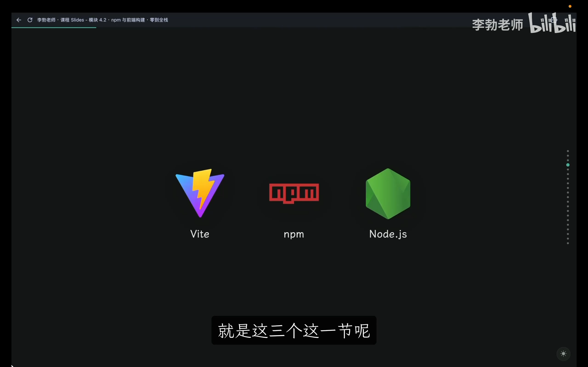

- **Vite**：前端构建工具，本讲主角；
- **npm**：包管理工具，学会这一节，以后无论做前端开发还是玩开源工具都用得到；
- **Node.js**：JavaScript 在浏览器之外的运行环境，是前两者的地基。

在进入正题之前，先给上节课收个尾。如果听 4.1 时觉得"看了各种 import/export 却没学会"，其实没关系——上一课只需要带走两个结论：

1. **模块化势在必行**：前端技术发展到今天，必然走向模块化；
2. **模块化之后必须走服务器**：改造完成的项目不能再双击 HTML 直接打开页面，浏览网页必须通过 HTTP 访问。

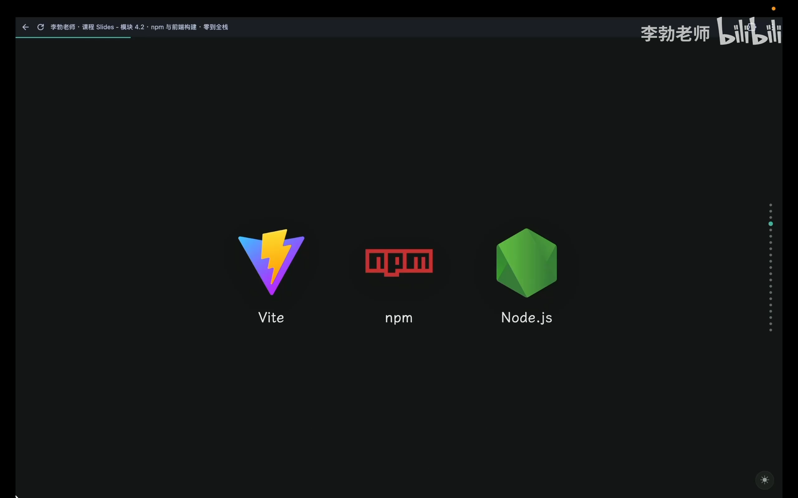

## 1. 模块化之后遗留的三个痛点

*(参考时间: 03:50)*

import/export 机制的确是个好规矩，它让 JS 代码之间的引用变得清晰。但从开发者的角度看，我们的体验变好了吗？——并没有。学到今天这一步，前端还有三个没解决的问题。

### 1.1 痛点一：改一个字，也要走一次发布流程

*(参考时间: 04:09)*

学基础前端时，每次改完代码直接刷新页面就能看效果。可模块化改造之后，按上一节的流程，哪怕只改一个字，想看效果都得走一轮完整发布：提交 → push → 登录服务器 pull → 刷新页面。这一轮折腾下来，开发体验非常差。

### 1.2 痛点二：文件拆得越多，页面加载越慢

*(参考时间: 04:36)*

只是开发体验差吗？你有没有感觉到，模块化之后**页面访问也变慢了**。用浏览器开发者工具（F12，或右键 → 检查）刷新一次页面看 Network 面板：

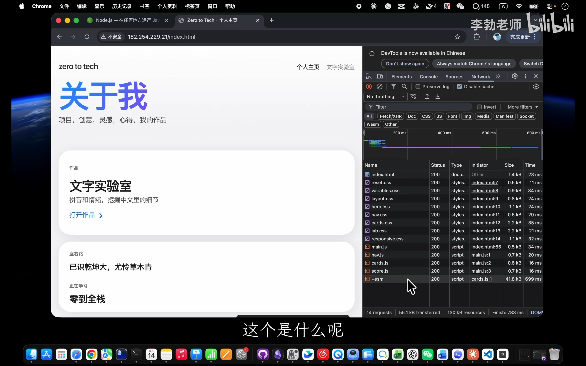

十几个网络请求排成长队——光 CSS 就有 8 个文件，每个都得单独走一次网络请求，再加上几个 JS 和 anime.js，浏览器要一个一个去拿。

还记得我们为什么要拆文件吗？好处列过很多：多个文件分工明确，人写代码方便多人协作和集成；AI 写代码时可以只加载必要的文件，有效减少上下文。**但对写代码的人是好事，对浏览器和最终用户未必**——网页变慢了。

看请求时间线：本来 200 毫秒以内就能拿到前几个文件，但总有文件把响应拖到 800 毫秒。网站再大一点，请求会越来越多，时间线甚至可能超过两秒。


### 1.3 痛点三：浏览器缓存

*(参考时间: 06:22)*

第三个问题更隐蔽：**缓存**。浏览器有缓存机制——用户请求过某个文件后，浏览器会把它存起来；下次刷新还要请求同一个文件时，浏览器一看是同名文件，就不再请求，直接把上次存的旧文件塞给用户。

缓存这东西好不好？也好：它让访问网页感觉更快，尤其在网络不好时。但反过来想：**如果网站更新了呢？** 假如只改了某个 CSS 文件里的一行代码（改了个 feature 或修了个 bug），浏览器却还在用缓存里的旧版本——这是最难受的。

早年有些经验的程序员写 CSS 时，会把文件名写"脏"：在名字后面拼一个时间戳，比如 `layout.20240315.css` 这样。哪天改了代码，就顺手改一下时间戳。因为浏览器是**按文件名匹配缓存**的，名字一变，缓存自然失效。

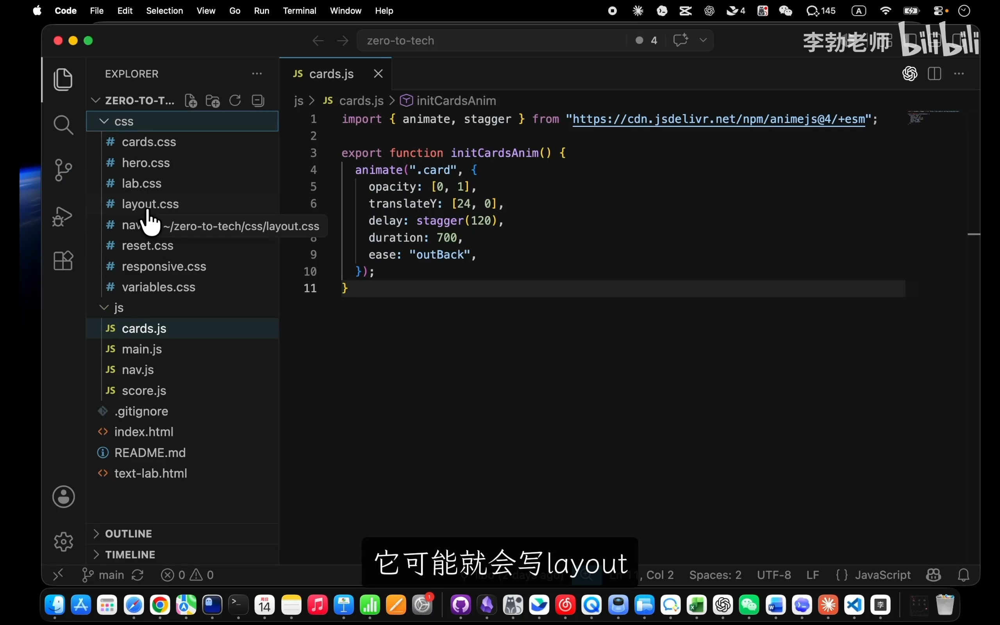

### 1.4 三个问题的责任归属

*(参考时间: 08:18)*

严格说，这三个问题不全是模块化的锅：

- **只有第一个**（开发流程笨重）是模块化改造直接带来的新问题；
- **第二个**（请求太多）与模块化有一定关系——模块化本来就要求代码尽量解耦；
- **第三个**（缓存）不算模块化的锅——基础前端阶段同样存在。

但不管责任在谁，走到今天这一步，这些痛点让开发体验和用户的浏览访问体验都不怎么好，必须解决。

## 2. 构建工具：调和三方矛盾的角色

*(参考时间: 08:58)*

分析这三个问题的背后，其实凸显出了一组矛盾——**工程治理、开发体验、用户体验**三者之间的矛盾：

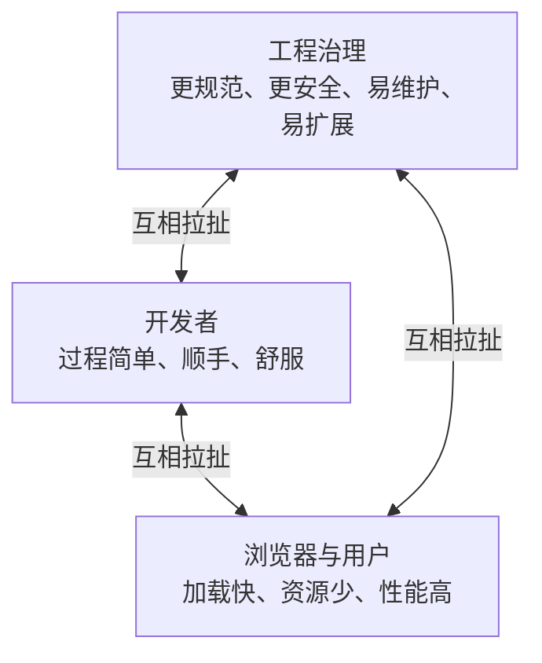
```mermaid
graph TD
    A["工程治理<br/>更规范、更安全、易维护、易扩展"] <-->|互相拉扯| B["开发者<br/>过程简单、顺手、舒服"]
    B <-->|互相拉扯| C["浏览器与用户<br/>加载快、资源少、性能高"]
    C <-->|互相拉扯| A
```

- **工程治理**是一套治理思想和规则，设计规则的人希望项目规范、安全、易维护、易扩展，确保在承载复杂业务逻辑时规则一直有效；
- **开发者**希望开发过程尽可能简单、顺手、舒服；
- **浏览器和最终用户**希望页面加载更快、资源更少、性能更高。

这三个目标经常互相拉扯：为了规范，可能牺牲一点开发便利；为了开发便利，可能影响运行效率；为了运行效率，又可能需要增加更多工程规则。

有没有办法让三方都尽量满意？**这就是构建工具（Build Tool）所做的事情**：工程治理这边"我 respect 你的规矩"；开发者这边"你怎么方便我怎么来"；浏览器这边"你想要什么样的资源，我负责把源码转成你想要的样子"。这个过程就叫做**前端构建**。

构建工具的三项能力，恰好一一对应三个痛点：

| 构建工具的能力 | 做法 | 解决的痛点 |
|---|---|---|
| **本地起服务 + 热更新** | 不用发布到远程服务器；代码一保存，浏览器自己就更新，秒级生效，连刷新按钮都不用点 | 痛点一 |
| **合并碎文件** | 人写的时候八个十个一百个都没问题，交付时尽量合在一起：8 个 CSS 合成 1 个，8 次请求变 1 次 | 痛点二 |
| **自动加文件指纹** | 根据文件内容算出哈希拼进文件名；内容一变指纹就变、文件名就变，浏览器不再走缓存，不必再手动加时间戳 | 痛点三 |

### 2.1 为什么选 Vite

*(参考时间: 11:55)*

构建工具有不少，早些年最知名的是 **webpack**，但最近几年最流行的已经不是它了。现在前端开发的首选构建工具叫 **Vite**。

这个名字有些小伙伴会按英文习惯念成 "ve-ti"，但它其实是个法语词，法语里读 "vit"。你可能以为这是法国人做的工具——其实不是，**Vite 的作者是中国人尤雨溪**。我们选它并不只是因为作者是中国人，更是因为 Vite 已经是当前前端构建工具中最优秀的存在。

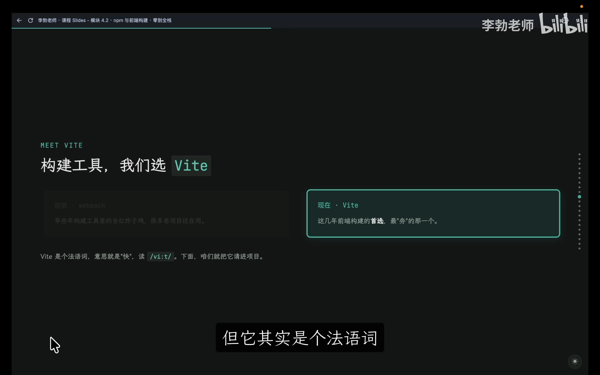

## 3. 前置工作：安装 Node.js

*(参考时间: 12:47)*

安装 Vite 之前还得做些前置工作，因为 Vite 自己也需要运行环境。Vite 本身是用 JavaScript 写的——不过它不是网页脚本，而是一个**命令行工具**，得在浏览器之外、我们自己的电脑上跑起来。

谁来运行它？打个熟悉的比方：运行一个 Python 文件，得先装 Python；打开一个 Excel 文件，得先装 Excel。同理，想在浏览器之外运行 JavaScript 脚本或用 JS 写的工具，就得装一个叫做 **Node.js** 的东西。

**Node.js 就是让 JavaScript 跳出浏览器、在我们自己电脑上直接运行的环境。**装了它，Vite 这类 JS 命令行工具才能跑起来。

### 3.1 安装步骤

*(参考时间: 14:00)*

打开 Node.js 官网 **nodejs.org**，点"获取 Node.js"进入下载页，页面上有安装两种方式：上面是命令行安装，下面是桌面安装包——**建议普通用户直接用安装包**，下载后一路"下一步"即可。

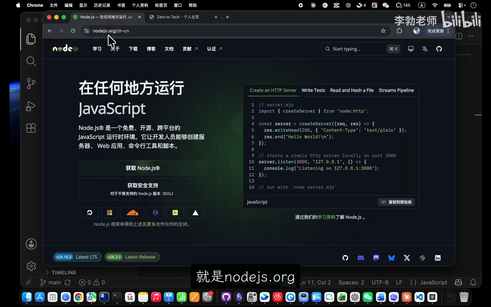

选包时先选操作系统，再选芯片架构：

- **Apple 芯片**（M 系列，或近年的 A 系列）→ 选 **ARM64**；
- **Intel 芯片**（早期 Mac 或 PC）→ 选 **x64**；
- Windows 同理：ARM 芯片选 ARM64，Intel 芯片选 x64。

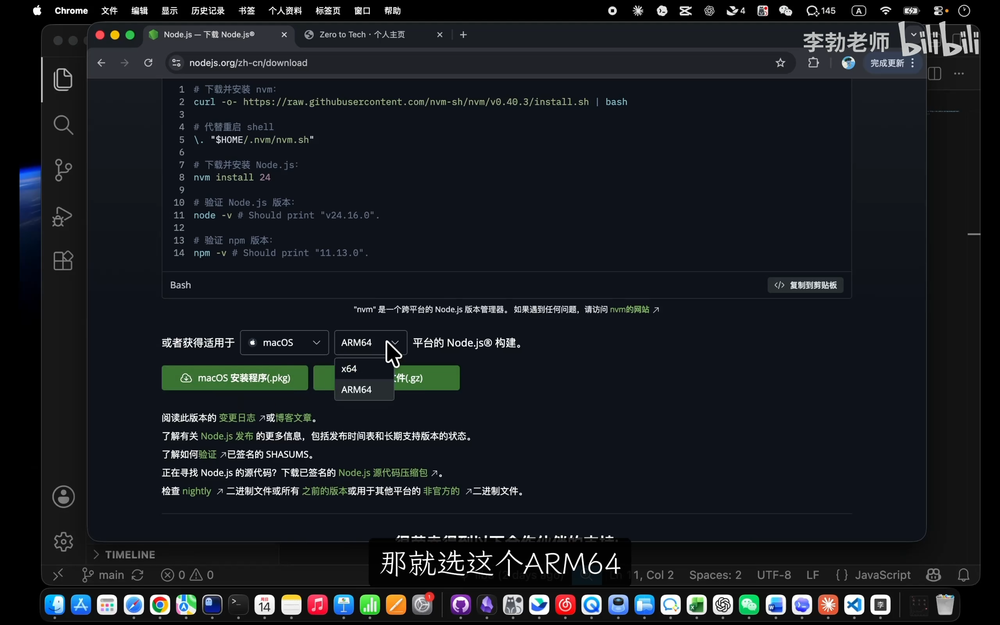

如果是在 Linux（比如 Ubuntu）上装，也可以用 apt，跟之前装 nginx 一个路子；想不起来就直接问 AI。

### 3.2 验证安装

*(参考时间: 15:26)*

装完后在终端确认：

```bash
node -v    # 输出 Node.js 版本号
npm -v     # 输出 npm 版本号
```

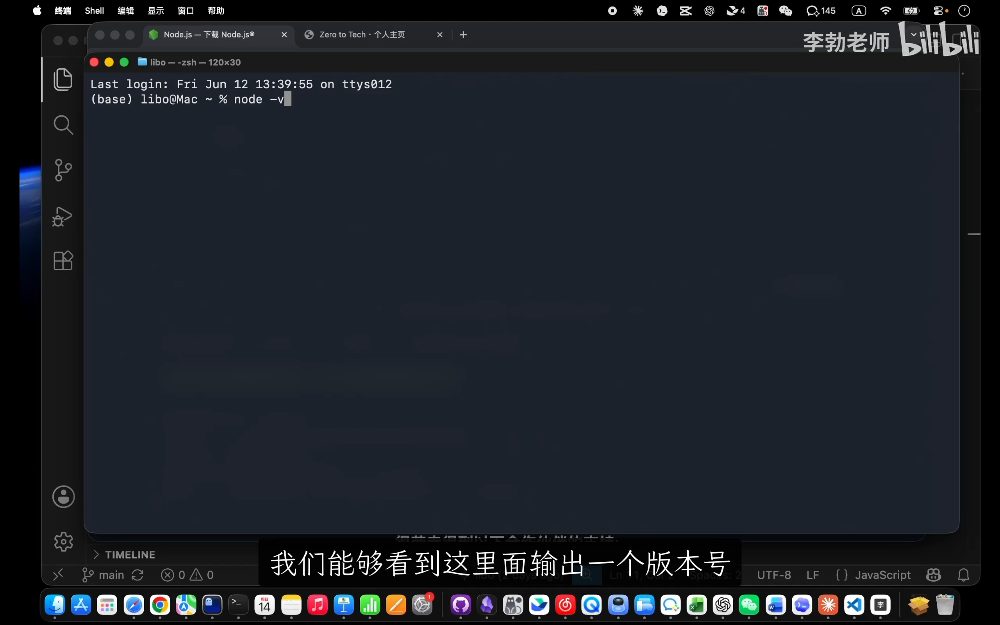

两个命令都有版本输出，说明 Node.js 装成功了。而且 Node **一次装好，以后所有项目都能用**，不用每个项目都装一遍。

你可能注意到了：刚才顺手敲的 `npm -v`——npm 是哪来的？它是**跟着 Node 一起装上的**，不需要单独安装。这个 npm，就是我们接下来的主角之一。

## 4. npm：JavaScript 的应用商店

*(参考时间: 16:01)*

npm 可以先理解成**一个 JavaScript 的应用商店**。这个比喻你应该不陌生：在 Ubuntu 上我们用 apt——`apt install nginx`、`apt install git`——apt 就是应用商店，帮我们把现成的软件装进系统。npm 干的是同样的事，只不过它装的是各种现成的 **JS 工具和库**。待会儿要用的 Vite，就用 npm 来装。

注意"先理解成"这个说法——因为 npm 其实**还不止是个应用商店**，它还有别的本事，本章后面会用到。

### 4.1 npm 与 apt 最重要的区别

*(参考时间: 17:14)*

虽然都是应用商店，但有一个关键差异：**apt 是给整台电脑装东西**，装一个 nginx 全系统都能用，整台机器就这一份；而 **npm 默认是给"当前这一个项目"装东西**。

也就是说：这个项目用 anime.js 的 4.4 版本，那个项目用 3.0 版本，两边各装各的、互不打架，每个项目自己管自己的一套。

### 4.2 初始化：npm init -y

*(参考时间: 17:56)*

正因为 npm 按项目管理，用它之前得先明确告诉它："这儿有一个项目需要用到 npm"——这个动作叫做**初始化**。

在终端进入 zero2tech 项目的根目录，执行：

```bash
cd zero2tech
npm init -y
```

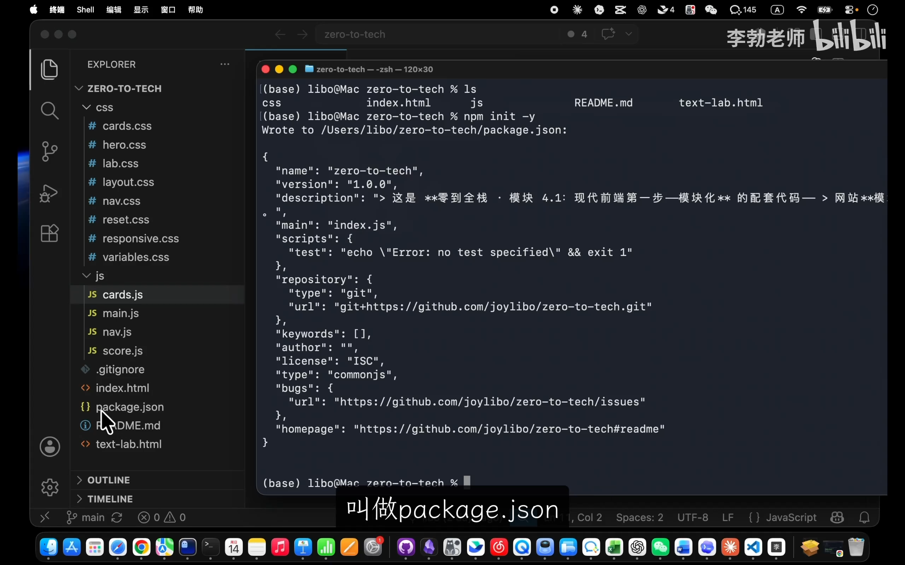

初始化完成后观察目录，会发现多出了一个文件：**package.json**。可以把它理解为这个项目的 **npm 账本（档案）**：以后 npm 给这个项目装了什么、项目能跑哪些命令，全都记在里面。

### 4.3 顺带认识 JSON 格式

*(参考时间: 19:40)*

package.json 的后缀是 `.json`——这是我们课程里第一次见到这种格式。JSON 是一种承载数据的格式，语法很简单：

```json
{
  "name": "张三",
  "age": 25,
  "address": {
    "city": "北京",
    "zipcode": 100000
  }
}
```

最外面是一层大括号，里面是"名字: 值"组成的**键值对**，用冒号隔开：冒号前叫键，冒号后叫值；值还支持嵌套（比如上面的 address 又是一个大括号）。这种语法人一眼能读懂，也方便程序解析，所以大量程序都用它存数据、传数据。**建议学一学**，虽然本系列不要求写代码，但 JSON 学起来很快。

有一个初学者最容易翻车的点——**逗号规则**：每一项结尾带一个逗号，但**大括号里的最后一项不带逗号**。比如上面 address 内的最后一项 zipcode 后面没有逗号；外层总共四项，address 是第四项，它的大括号后面也不带逗号。

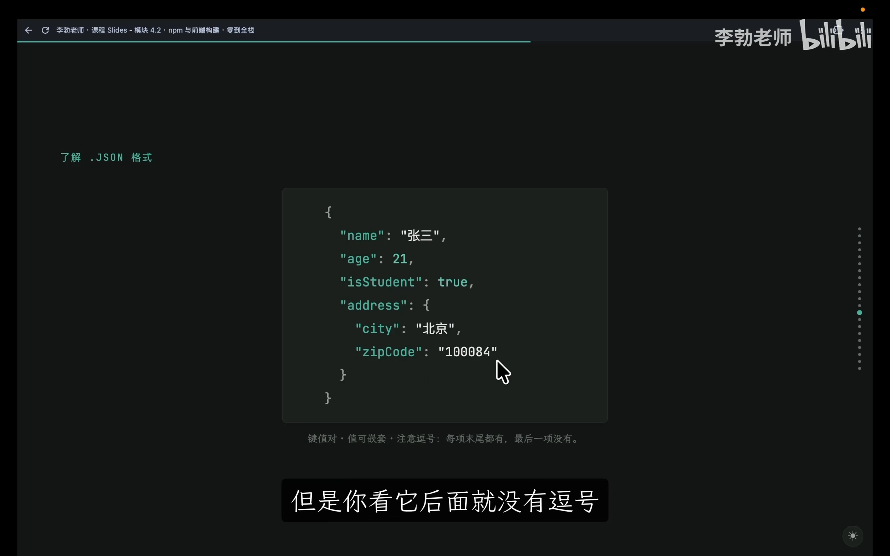

### 4.4 package.json 里哪些字段要管

*(参考时间: 21:48)*

回到刚才生成的 package.json，逐个字段看清楚哪些要管、哪些不要管。真正有价值的其实就两个：

- **name**：项目名。默认取项目文件夹的名字（我们的项目叫 zero2tech，它就拿了这个）。可以理解，但对咱们的项目不关键；
- **version**：项目自己的版本号，默认 `1.0.0`，想改随便改，不改也没事——同样不关键。

剩下的一堆（description、main 等）要么是给将来要把项目**发布成 npm 包**的人准备的，要么只是默认占位，对咱们的项目全都用不上。package.json 就是一个普通配置文件，手动改、删都没问题，npm 不要求这些字段必须在。所以干脆删掉，只留三个字段，**scripts 要留着**（马上就有用）：

```json
{
  "name": "zero2tech",
  "version": "1.0.0",
  "scripts": {}
}
```

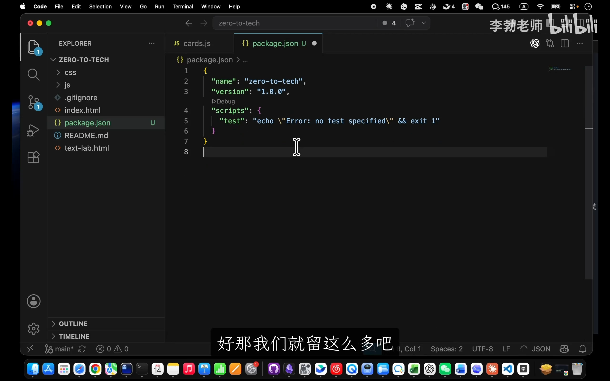

注意 scripts 的大括号后面原本有个逗号——删掉后面的字段之后它成了最后一项，**这个逗号也要跟着删掉**，语法才合法，否则会报错。现在的 package.json 看起来空空如也，但等真用 npm 装东西时，npm 会往里记有用的账。

## 5. 安装 Vite，看懂 npm 记的账

*(参考时间: 24:20)*

确认终端就在项目根目录，执行：

```bash
npm install -D vite
```

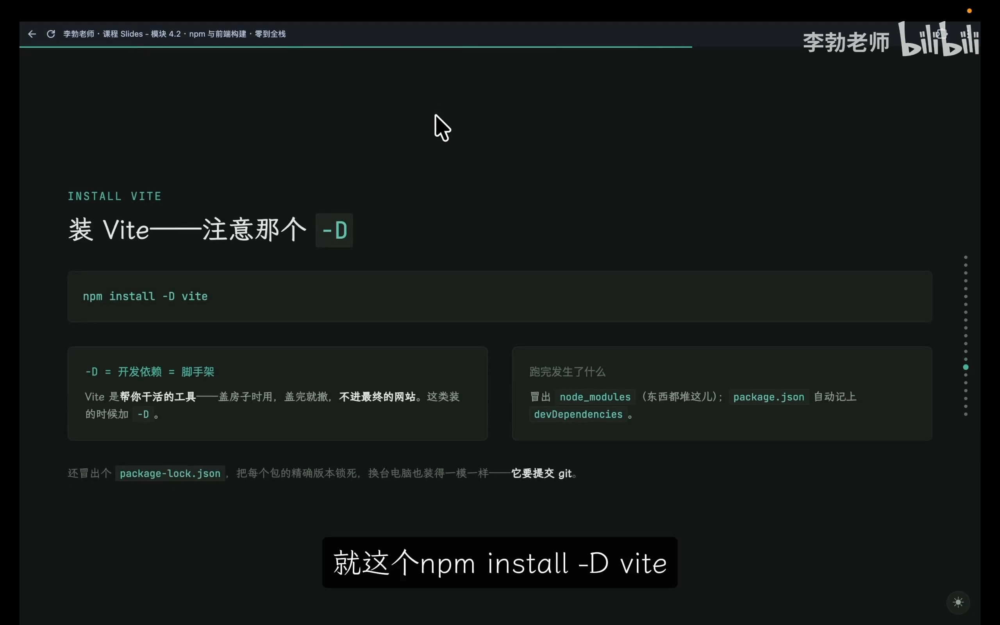

### 5.1 `-D` 的含义：脚手架与砖

*(参考时间: 24:53)*

`-D` 的意思是：把 Vite 装成一个**开发依赖**（devDependency）。这要从 npm 装的东西的两类角色说起：

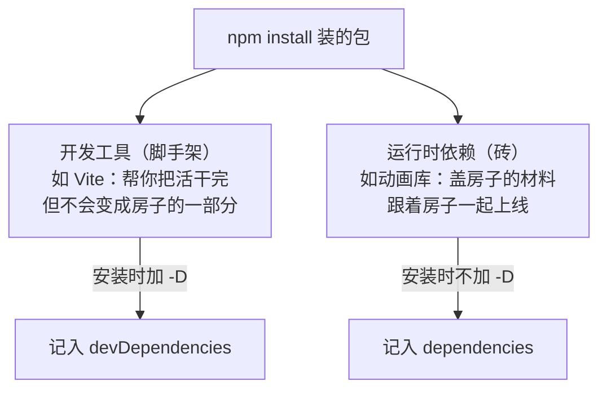
```mermaid
graph TD
    P[npm install 装的包] --> T["开发工具（脚手架）<br/>如 Vite：帮你把活干完<br/>但不会变成房子的一部分"]
    P --> L["运行时依赖（砖）<br/>如动画库：盖房子的材料<br/>跟着房子一起上线"]
    T -->|安装时加 -D| D1["记入 devDependencies"]
    L -->|安装时不加 -D| D2["记入 dependencies"]
```

- **第一类是在项目里帮我们干活的工具**。就像盖房用的脚手架：帮你把活干完，但它本身不会变成房子的一部分——最终上线的网站里没有 Vite。这种"脚手架"性质的，安装时就加 `-D`；
- **第二类是网站真正依赖的东西**。比如动画库，那不是脚手架而是盖房子的砖，会构建进最终产物、跟着网站一起上线。这种就不加 `-D`（本讲最后会用到）。

### 5.2 装完之后，三处变化

*(参考时间: 26:03)*

回车执行完，注意观察项目目录：

1. **多出 `node_modules/` 目录**——npm 装的所有东西都在这里：Vite 连同它所有依赖的一大包别的东西，全部下载堆在这里；
2. **多出 `package-lock.json` 文件**；
3. **package.json 发生了变化**：刚才精简到只剩三个字段，现在自动多出一段 **devDependencies**，里面记着一个 vite 和版本号——npm 自动帮我们记的账。

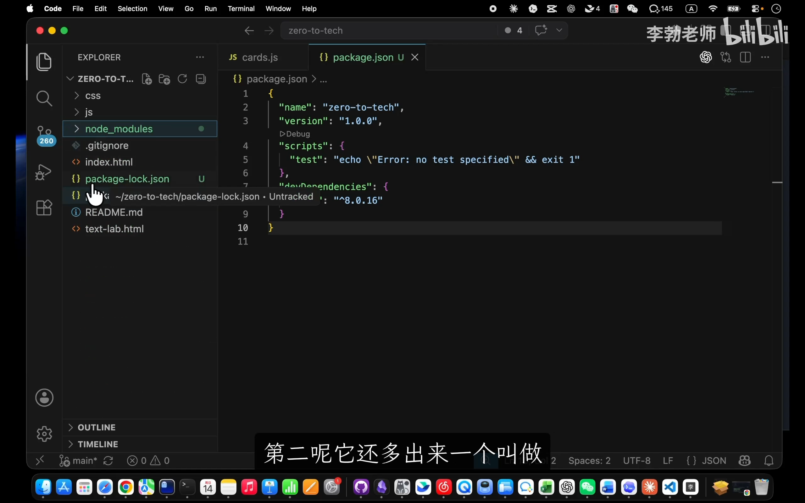

关于 package-lock.json 的作用：把**这次实际装的每个包的精确版本一笔一笔锁死**，确保以后重新安装依赖时装出来的东西与现在一模一样。它记录了所有包的具体版本，不需要读懂，知道它干的是"锁版本"这件事就够了——还要了解一点：**它最终是要提交到 Git 的**。

### 5.3 只装了一个 Vite，node_modules 为什么这么大

*(参考时间: 28:13)*

这个目录通常特别大、文件特别多，一般情况下不会去翻它，只要知道"npm 装的东西都在这里"就行。但从学习角度值得看一看：只装了一个 Vite，为什么下面有这么多东西？

因为 **Vite 自己也依赖别的包**，别的包又依赖别的包，一层层牵连进来就一大串（比如 postcss 等），所有依赖都会装进 node_modules。可以用 **npmgraphs.js.org** 这类可视化网站，输入 vite 看它的依赖关系图：

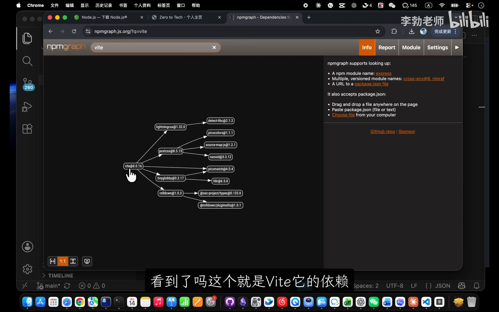

图里能找到的每个包，npm 安装时都一并装进了 node_modules——这就是它这么大的原因。

### 5.4 两个 "vite"，别搞混

*(参考时间: 29:25)*

在 node_modules 里仔细找，会发现**两个 vite**：

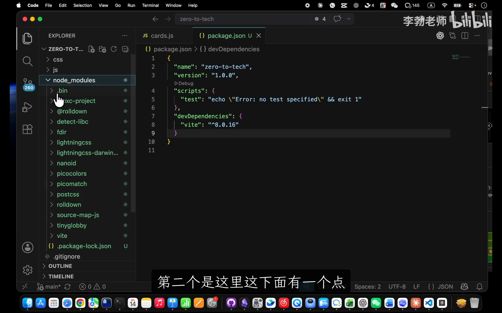

- `node_modules/vite/`：一个**文件夹**，里面是 Vite 的代码本身（npm 拉下来的源码就在这）；
- `node_modules/.bin/vite`：一个**可执行命令**（.bin = binary）。待会儿要"用 Vite"，用的就是这个命令。

## 6. Vite 的三条核心命令

### 6.1 `vite`：开发预览与热更新

*(参考时间: 30:37)*

因为命令在项目根目录下的 `node_modules/.bin/` 里，执行它：

```bash
node_modules/.bin/vite
```

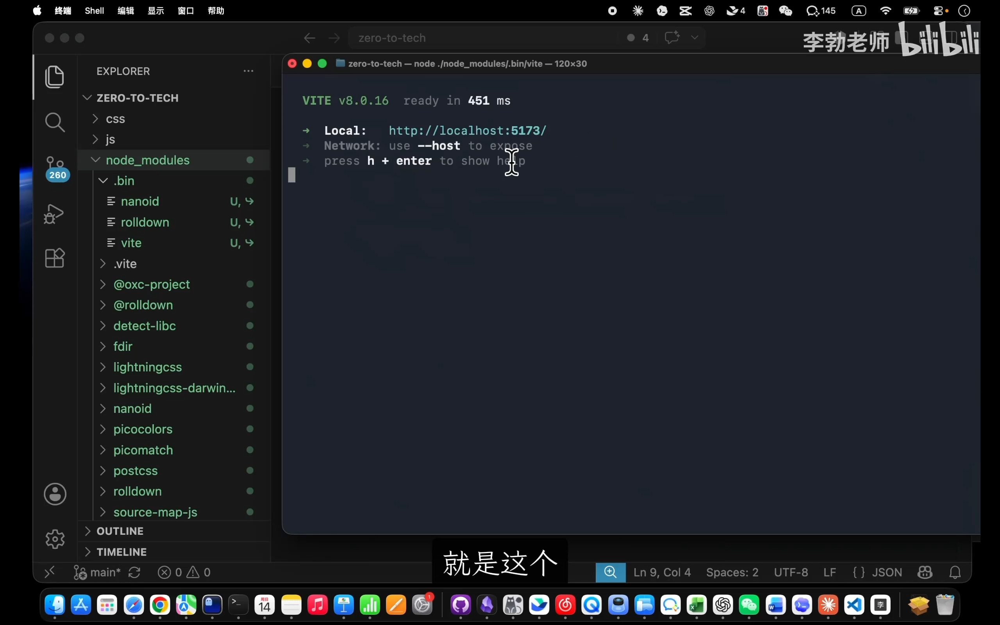

Vite 当场在本地起了一个服务器，给你一个地址：`http://localhost:5173`。这里的知识点：

- **http**：协议，以前讲过；
- **localhost**：看上去像个域名但长得不太一样——它代表的就是**我们本地这台电脑**。用 http 访问自己电脑上的 5173 端口；
- **5173**：端口号。

复制地址在浏览器打开——网站跑起来了，点导航在两个页面之间切换也都正常。**尽管网站做过模块化改造，现在也不用发布到远程服务器，就在本地起一个服务预览**，痛点一解决了一半。

最爽的是热更新：现在就改一行代码试试。把 index.html 里的标题"关于我"改成"关于我自己"，保存（Command+S / Ctrl+S）——浏览器立马变了；再删掉两个字、再保存，又立马变了，**连刷新都不用**：

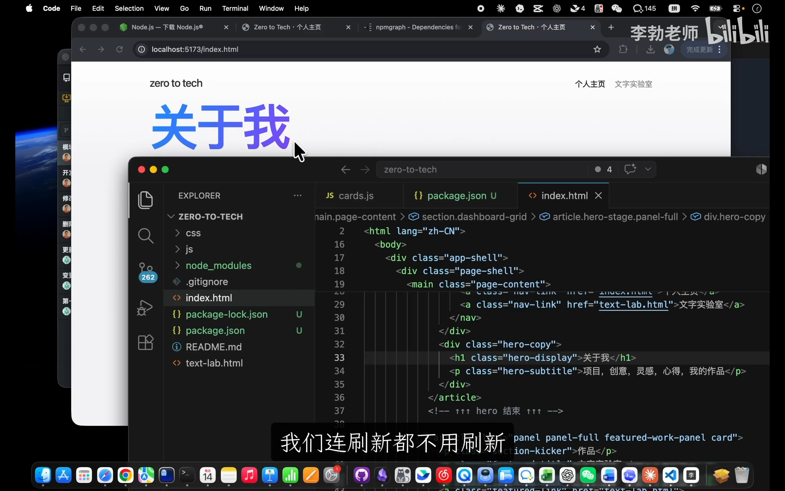

这就是前面说的**热更新**。回看开头的痛点——上一节改点东西要看效果得 push、pull、刷新一整轮，现在改完一眨眼就看到，给开发工作提供了极大的便利。

但 Vite 还不止这个。先把服务器停掉（Ctrl+C），停掉之后刚才的地址就访问不到了。不同终端下停止的方式：

| 环境 | 停止命令 |
|---|---|
| macOS | Ctrl + C |
| Windows CMD | Ctrl + C |
| Windows PowerShell | Ctrl + Shift + C |

这个"起本地服务器供开发时预览"的用途，叫做**开发预览**。

### 6.2 `vite build`：构建（打包）

*(参考时间: 33:37)*

到目前为止 Vite 还没做过它的本职——**构建**。构建也叫**打包**，英文 **build**。在命令后面加一个 build：

```bash
node_modules/.bin/vite build
```

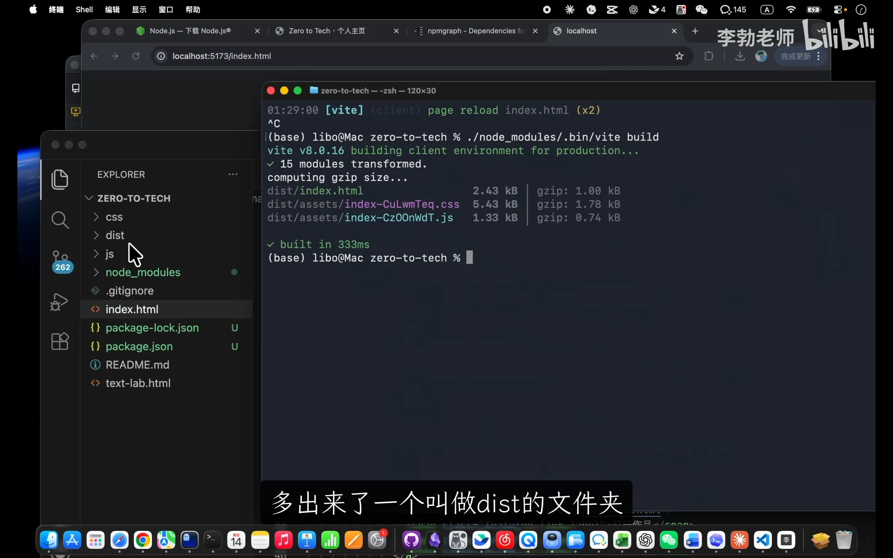

回车后目录发生变化：多出了一个 **dist** 文件夹（distribution，发行版）。打开看结构：里面有一个 index.html 和一个 **assets** 目录，assets 里是**一个 CSS 文件和一个 JS 文件**。

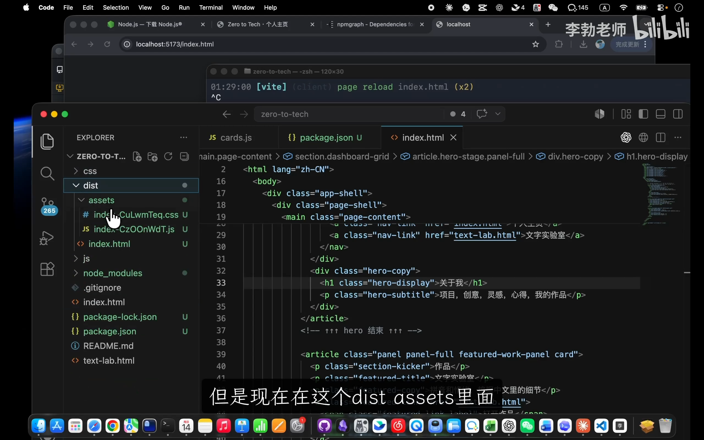

对比原来：CSS 有 8 个文件，现在只有 1 个；那几个 JS 模块也合并成了 1 个。**构建这个动作就是把它们合并**。合并之后，浏览器将来的请求数量从十几个减少到几个——痛点二解决。

再看这两个文件名，名字后面各挂着一串"乱码"——有同学已经猜到：这就是解决浏览器缓存问题的。这串就是**哈希（文件指纹）**，根据文件内容自动算出来：内容只要一变，哈希就变，整个文件名就变；浏览器一看名字不一样，就不会再走缓存——**痛点三也解决了**，而且开发者再也不需要徒手给文件名加时间戳。

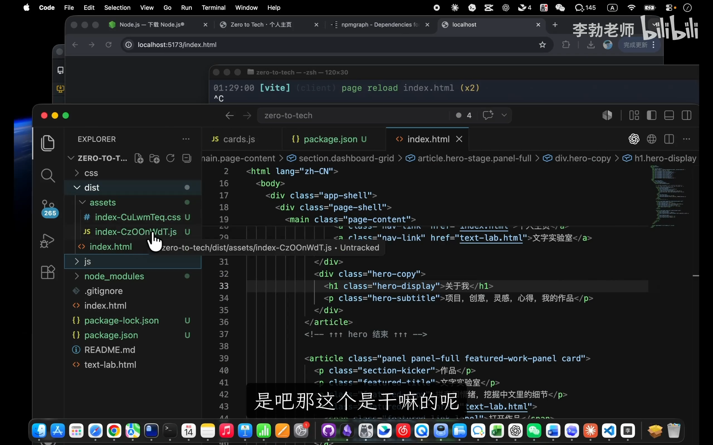

**一个小遗留：多入口。**你可能注意到 dist 里只有 index.html，没有 textlab.html——我们明明有两个页面。这不是被"打包合并"了，而是 **Vite 打包默认只认一个入口**：项目根目录的 index.html。想让两个页面都进包，需要给 Vite 加配置。这节课不做这个配置：因为下一节就要把项目改造成 React，到那时两个页面会自然地合成一个入口，多入口的麻烦将不复存在，这个问题留到下一节。

### 6.3 `vite preview`：预览构建产物

*(参考时间: 37:04)*

build 产物 dist 能不能在本地看看？**注意：它仍然不能双击打开**——打包后的文件引入 JS 时仍写着 `type="module"`，还是 ES 模块，本地 file:// 双击打不开。

Vite 准备了第三条命令：

```bash
node_modules/.bin/vite preview
```

它专门起一个本地 web 服务，来提供 dist 这个文件夹的资源。注意端口是 **4173**（刚才开发预览是 5173，别混淆）：

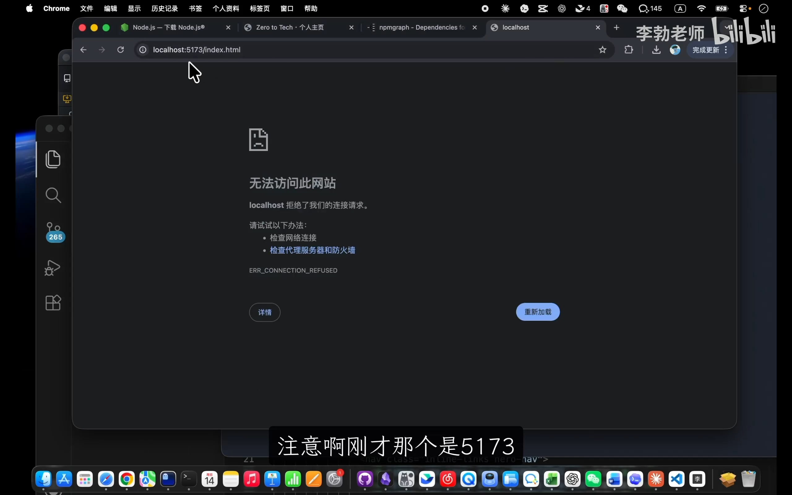

这时再打开 DevTools 的 Network 刷新一下：请求明显变少了，只有一个 CSS（JS 还是两个——多出来的那个来自 CDN，本章最后一节处理）。请求干干净净，效果立竿见影。

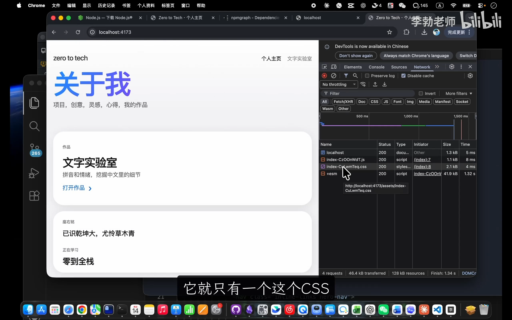

### 6.4 三条命令的分工

| 命令 | 何时用 | 跑的是什么 | 端口 |
|---|---|---|---|
| `vite` | 写代码时（开发预览） | 源码 + 热更新 | 5173 |
| `vite build` | 准备上线时 | 生成 dist（给生产服务器的版本） | — |
| `vite preview` | build 之后 | 本地预览 dist 产物 | 4173 |

命令很清晰，但你可能会感觉：**这三条命令都太长、太啰嗦**。谁来解决？马上登场。

## 7. 两份代码：源码与构建产物

*(参考时间: 38:55)*

到这里，有一个重要概念必须建立起来：我们现在手上其实有**两份东西**。

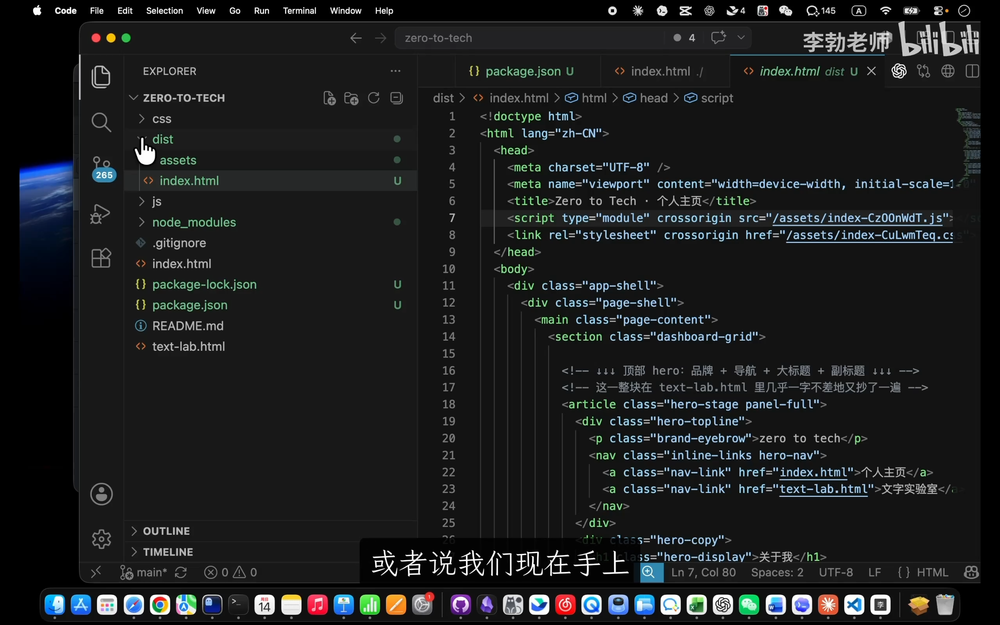

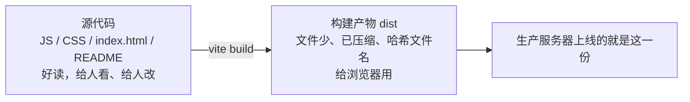
```mermaid
graph LR
    A["源代码<br/>JS / CSS / index.html / README<br/>好读，给人看、给人改"] -->|"vite build"| B["构建产物 dist<br/>文件少、已压缩、哈希文件名<br/>给浏览器用"]
    B --> C[生产服务器上线的就是这一份]
```

- **一份是我们维护的代码（源代码）**：原来那些 JS、CSS，包括 index.html、README——这些代码很好读，是给人看、给人改的；
- **另一份是真正上线跑的（dist）**：文件很少、内容被压缩过（打开看，连换行符都没有）、文件名带哈希——是给浏览器用的，不是给人读写的。

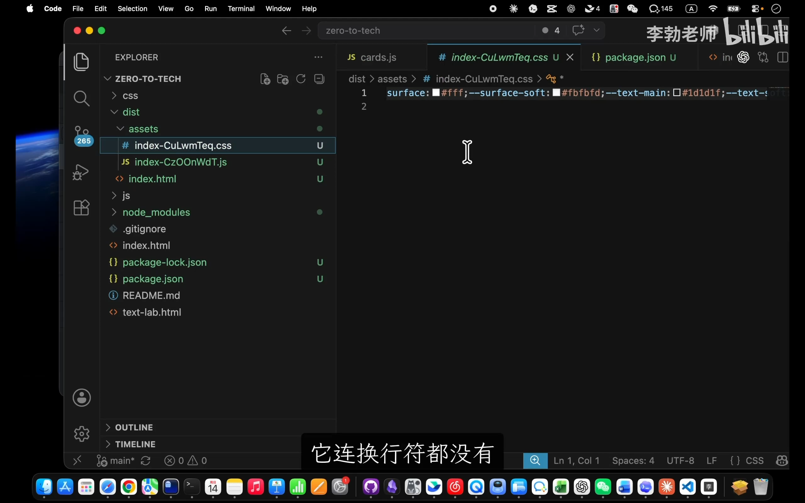

Vite 作为构建工具干的事，就是把"方便人看、方便人写"的代码文件，转换成"适合浏览器"的文件。**每次构建，dist 都会被重新生成一遍。**由此得出两条铁律：

1. **千万别手动改 dist 里的文件**——包括将来让 AI 写代码也一样：**写的永远应该是源码**。改了 dist 也是白改，下一次 build 就被整个覆盖了；
2. **dist 才是真正要送上线的那一份**。

## 8. scripts 与 npm run：给命令起短名

*(参考时间: 42:22)*

刚才说三条命令太长——谁能解决？还记得 package.json 里我们特意留下的 **scripts** 吗？它可以把常用命令**登记成简短命令**。配置三个：

```json
{
  "name": "zero2tech",
  "version": "1.0.0",
  "scripts": {
    "dev": "vite",
    "build": "vite build",
    "preview": "vite preview"
  }
}
```

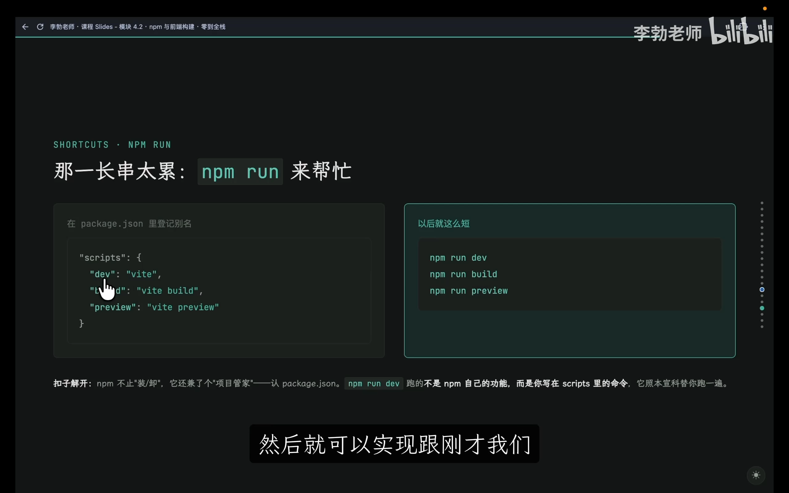

之后就可以这样执行（前缀都是 `npm run`，后面接登记的名字）：

```bash
npm run dev       # 等价于 vite（5173，开发预览）
npm run build     # 等价于 vite build
npm run preview   # 等价于 vite preview（4173）
```

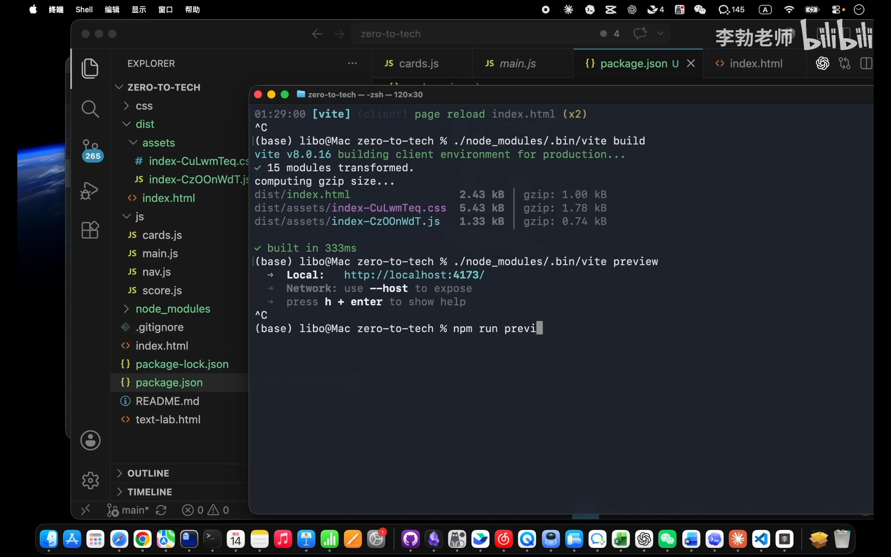

效果与刚才一字不差，是不是好记多了？还记得开头说 npm "先理解成应用商店"——此刻它就露出了另一面：**通过 package.json，它还能在一定程度上帮我们管理项目**。

### 8.1 命令名是约定，不是规定

*(参考时间: 44:47)*

为什么叫 dev、build、preview？这是**约定俗成**，不是规定死的——你真不想用，改成拼音"开发"也照样能跑。但没必要：**有约定就按约定来**，别人怎么写咱怎么写，自己容易理解、找资料容易；更关键的是，将来让 AI 帮你管理代码时，它见过的代码这里写的都是 dev，协作才顺畅。这三个名字建议不要改，别给自己找麻烦。

### 8.2 npm run 的执行逻辑

*(参考时间: 45:48)*

`npm run` 的逻辑非常简单：**帮你执行登记的那条命令而已**。你甚至可以让它跑电脑上的其他命令——比如在 scripts 里再配一个 `"hello": "ls"`，`npm run hello` 就会把当前目录的文件列出来；配 `"git --version"` 也一样，会打出 Git 的版本号。

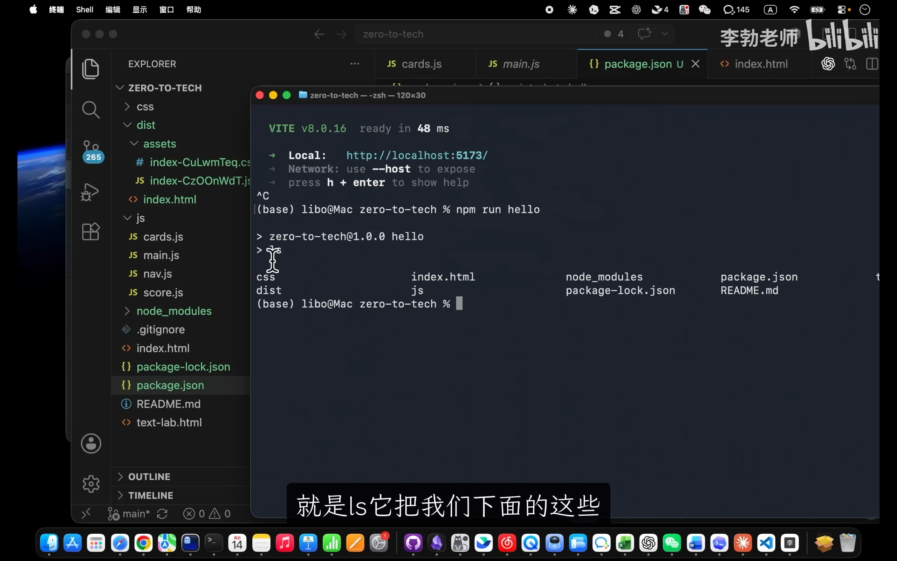

执行命令时的查找顺序：

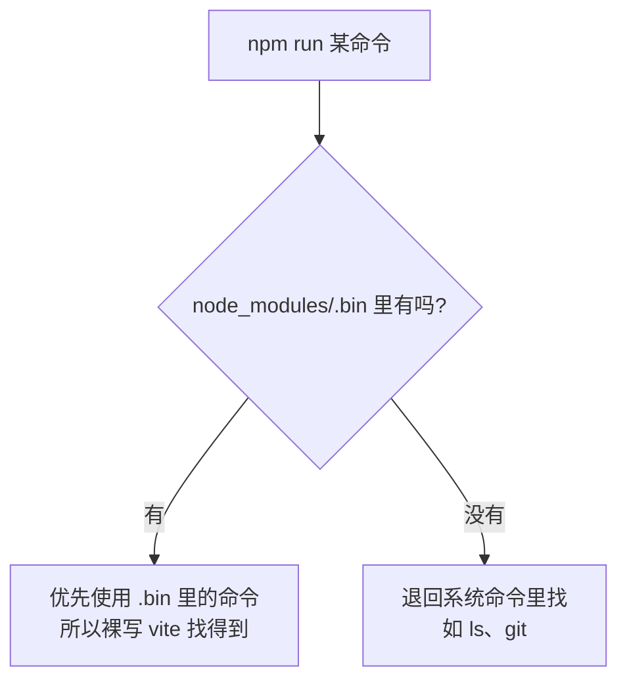
```mermaid
graph TD
    A[npm run 某命令] --> B{node_modules/.bin 里有吗?}
    B -->|有| C[优先使用 .bin 里的命令<br/>所以裸写 vite 找得到]
    B -->|没有| D[退回系统命令里找<br/>如 ls、git]
```

所以 scripts 里能直接写 `vite` 而不是 `node_modules/.bin/vite`——npm run 会优先去 node_modules/.bin 里找，找不到才去系统命令里找。演示用的 hello 配置记得删掉。

## 9. Git 该提交什么、忽略什么

*(参考时间: 48:00)*

现在项目里多出来好几个文件和文件夹，提交代码时要不要带上？**有说法**：

| 文件/目录 | 是否提交 Git | 原因 |
|---|---|---|
| `package.json` | ✅ 提交 | 项目配置（账本） |
| `package-lock.json` | ✅ 提交 | 项目配置，锁定版本 |
| `node_modules/` | ❌ 不提交 | 用 `npm install` 随时可重新生成 |
| `dist/` | ❌ 不提交 | 用 `vite build` 随时可重新生成 |

node_modules 照着 package.json（或 lock 文件）跑一次 `npm install` 就能原样装回来；dist 照着源码跑一次 build 就能构建出来。**既然随时能重建，塞进 Git 就是白白占地方**，还会拖慢远程同步的速度。

用 **.gitignore** 把这两个排除掉——在 .gitignore 里写上 `node_modules` 和 `dist` 两行，保存：

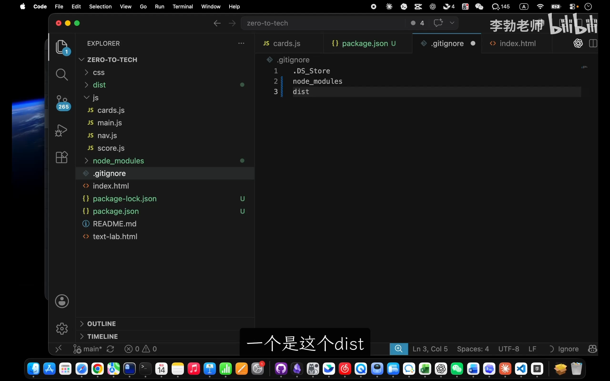

这两个目录的颜色立刻从绿色（未跟踪）变成灰色——git 已经不管它们了，以后随便怎么变都只发生在本地。

至于 dist 到底怎么送上线，后面讲现代前端部署的章节会细说。

## 10. 收尾实战：把 anime.js 从 CDN 收编到本地

*(参考时间: 50:10)*

课程最后还剩一个小尾巴。打开动画相关的 JS 文件（cards.js）：anime.js 现在**还是从一个 CDN 网址在拉**。上一节已经讲过这种写法也能跑，但总觉得不踏实，有三个隐患：

1. **多一次请求、拖慢页面**：每次打开页面都要联网去人家服务器拉一份 anime 的代码。还记得 `npm run preview` 的 Network 面板吗？打包好的产物只有一个 JS，下面却多出来一条对 CDN 地址的请求；看时间线，自己的代码 8~10 毫秒就加载完了，这一个 600 多毫秒；
2. **别人网站挂了就全挂**：万一哪天 CDN 站点宕机，我们的动画就废了；
3. **版本不可控**：保不齐哪天对方小版本一更新（比如 `anime@4` 的某个小版本），我们的页面毫无征兆地变了。

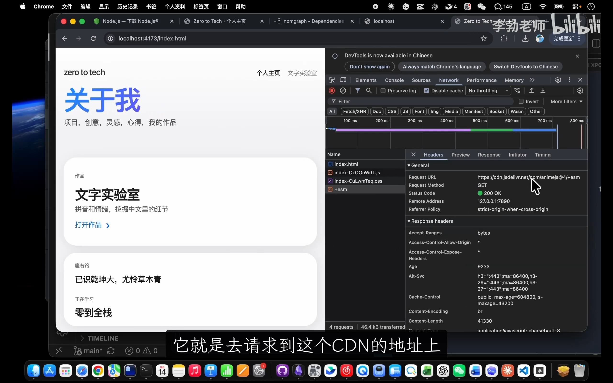

既然现在有了 npm，能把库装到本地、还能锁版本，anime.js 就没必要再拴在别人网站上了。

### 10.1 安装（不带 -D）

```bash
npm install animejs
```

注意这条命令与装 Vite 的那条几乎一样，但**关键区别是不带 `-D`**——因为这次装的是"砖"，不是"脚手架"。

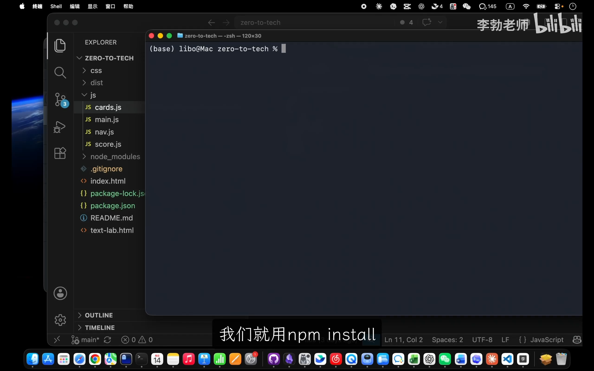

装完观察两处：node_modules 下已经有了 animejs；再看 package.json，**它的记账位置不一样**：

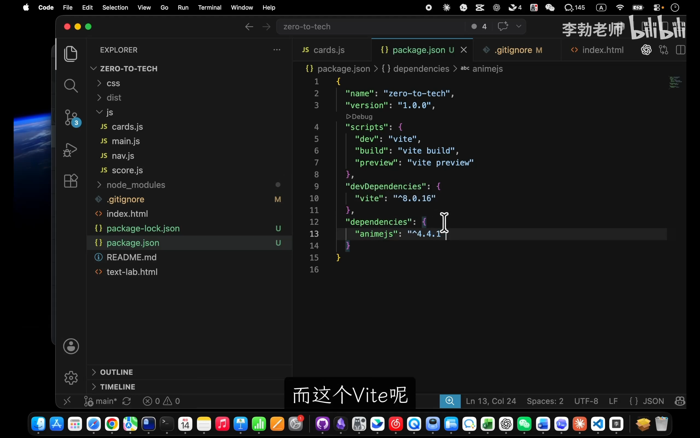

- **animejs → dependencies**：网站的砖，会被构建进最终产物、跟着上线，网站运行时真的在用它；
- **vite → devDependencies**：脚手架，盖完房子就撤，上线的站点里没有它。

两者虽然都用 npm 装、命令长得像，但在项目里扮演的角色完完全全不一样——这就是本节刻意把两次安装隔了大半节课的原因。

### 10.2 关键一步：改掉 CDN 的 import

光装上来还不算用上。回到代码，把那串很长的 CDN 网址换成一个干净的名字——**裸包名**：

```js
import anime from "animejs";
```

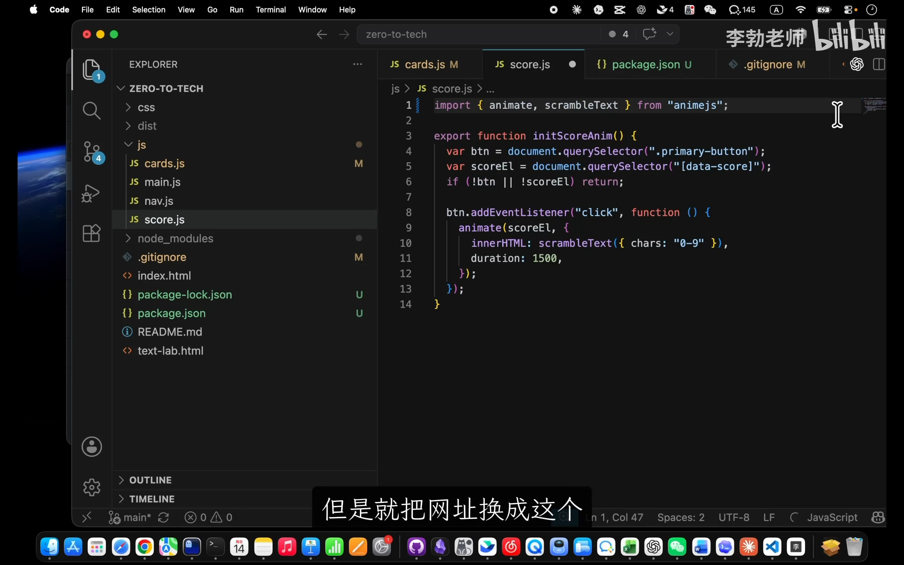

这种"光秃秃"的名字，以前浏览器是不认的；但 **Vite 会在背后帮你把它翻译成 node_modules 里对应安装的库**。这一步千万不要漏：你不能只 `npm install` 却不改 import——不改的话用的还是 CDN 那一份，**装到本地等于白装**。

### 10.3 验证

再构建、再预览：

```bash
npm run build
npm run preview   # 4173
```

build 前先盯着 dist 里的文件名——**build 之后文件名（哈希）变了**：说明 anime.js 已经打进产物，现在用的不再是 CDN 的那份，而是 node_modules 里的这份。再刷新 preview 的 Network：

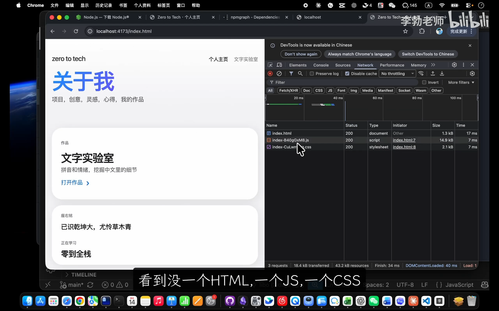

**一个 HTML、一个 JS、一个 CSS**——请求干干净净。本讲到此完整收官。

## 小结

*(参考时间: 57:28)*

把 4.1 与 4.2 两节放在一起盘：

- **4.1 模块化**：治好了代码顺序混乱、全局污染这些坑，让代码变得更现代；
- **4.2 构建**：请来了 Vite（以及支撑它的 Node.js 与 npm），把**开发预览不便、请求太多加载太慢、浏览器缓存**这三个问题一次全解决，最后还顺手把 anime.js 收进本地、甩掉了 CDN。


```mermaid
graph LR
    A["4.1 模块化<br/>代码变现代"] --> B["4.2 构建工具链<br/>Vite + npm + Node"]
    B --> C["工程化地基铺平"]
    C --> D["下一节：React<br/>顺带聊聊 Vue"]
```

工程化这套地基到这儿就铺平了。有了地基，接下来的事情就有意思了——**下一节讲 React，顺便聊一下 Vue**。
