# 【零到全栈】4.3：React 与前端开发规则

> 本书整理自 B 站课程《零到全栈》第 4.3 讲《React、前端开发规则》（BV1FX7F6UEWq，约 56 分钟），
> 将授课口语重构为书面技术指南。上一讲（4.2）引入了 Node.js、npm 与 Vite，把开发流程从"双击打开 HTML"
> 推进到"构建工具辅助开发"。本讲接着追问一个更根本的问题：既然构建工具能翻译，我们能不能干脆发明一套
> 更舒服的写法？由此引出前端框架，并以 React 为例，把上一讲的项目从 vanilla 一层一层改造成组件化的 React 项目。

## 引言：从"翻译官"到"发明新规则"

*(参考时间: 00:00)*

上一讲特别重要。如果你还不清楚什么是前端构建工具，建议先看完上一讲再回来——理解构建工具的能力之后，这一讲的内容才立得住。

上一讲我们得到过一个关键认知：**构建工具是一个翻译官**。开发者按自己舒服的方式写代码，构建工具在背后把它翻译成浏览器需要的样子。

顺着这个思路往下想一步：既然构建工具能翻译，那我们是不是干脆别再老老实实写浏览器那套底层的 HTML、CSS 和 JS 了？我们能不能发明一套写起来更舒服、更高效的新规则？浏览器认不认识我们的写法无所谓，只要构建工具能翻译，最终就能呈现。

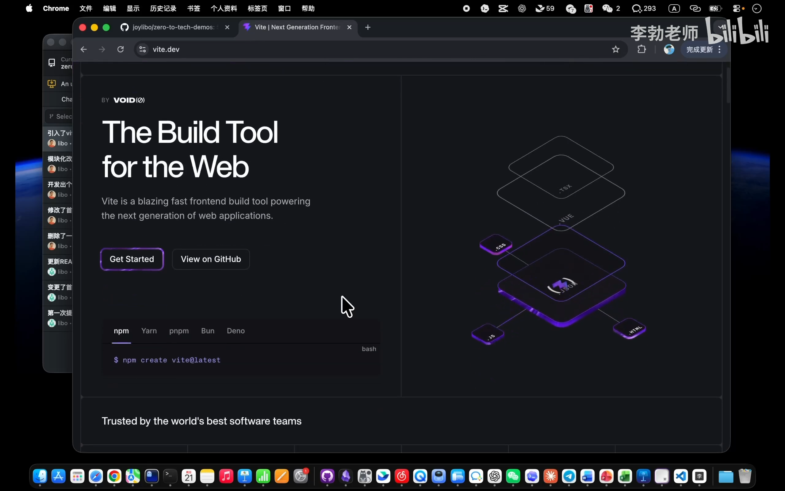

整套前端开发的老规则全部不用，完全发明一套新的——这个想法很大胆，但确实可行：只要构建工具能完成转换就行。这等于把构建工具的能力炸到极致。

听起来有点疯狂，但这正是**现代前端框架的基本逻辑**。而且这不是某个人或某个组织的异想天开，早就已经有许许多多的人这么想过，也这么做过了。

## 1. 那一排 logo：框架的谱系

*(参考时间: 02:03)*

打开上一讲用过的 Vite 官网，首页上有这样一句话：**Powering your favorite frameworks and tools**。底下密密麻麻列了一二十个 logo，其中每一个差不多就是一套这样的"新规则"。这些都是前面课程的评论区里有人问过的。

这些框架要解决的事大同小异：发明一套写起来更舒服的写法，然后交给构建工具去翻译，只不过各家的写法不太一样而已。

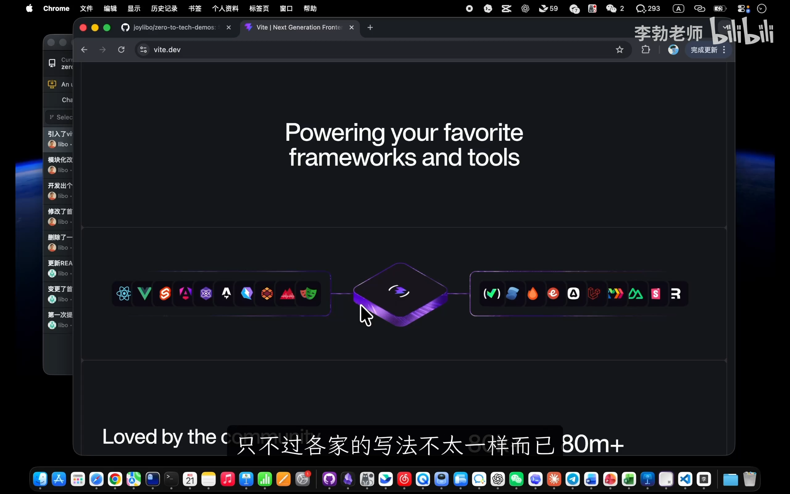

这张图里最左边那个像六瓣花一样的，就是 **React** 的 logo——也就是本讲要讲的框架。

## 2. 为什么选 React，不是 Vue

*(参考时间: 03:01)*

这个问题在开讲之前就已经在评论区被问过好几回了，这里一次说清楚。

### 2.1 同一类东西，只是写法不同

首先，React 和 Vue 是同一类东西：都是前端框架，要解决的问题一模一样，只不过写法不一样。就像上海话和粤语说同一件事，腔调不同而已。不存在"学了一个就放弃了另一个"——把其中一个的道理吃透，另一个也很快能触类旁通。

两个框架都非常优秀，没有高下之分。Vue 在国内用户很多，上手比较平缓，中文文档写得好。

### 2.2 用下载量说话

选 React 的主要理由是：**它在全球范围内最流行，生态最大**。

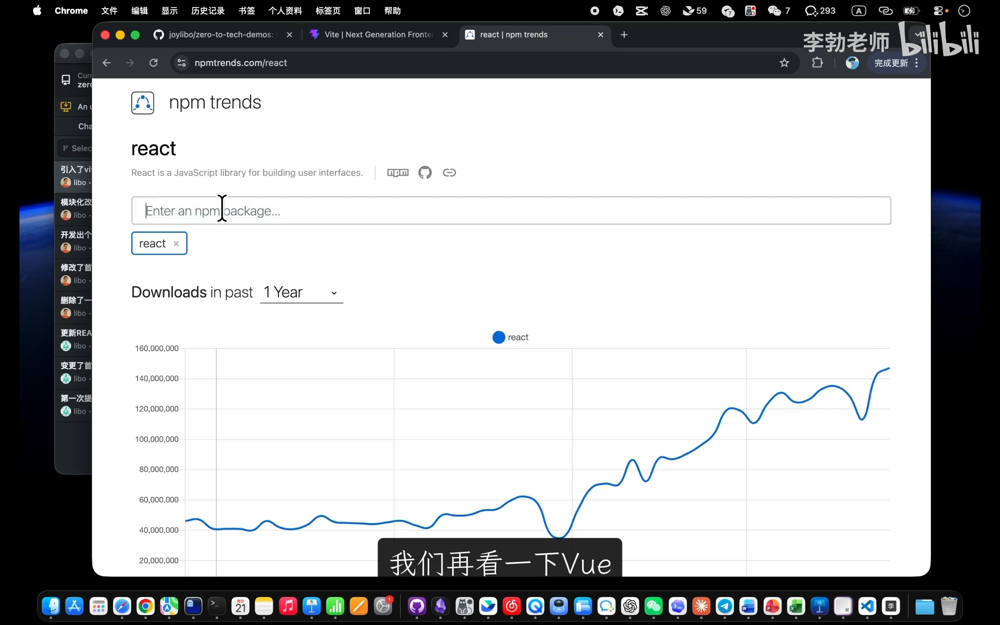

我们用另一个网站 npm trends 来对比——它统计 npm 上各个包的下载量。光看下载量这一项，React 就是 Vue 的好几倍。这说明有更多的项目是基于 React 做的，所以它的生态更大。

生态这件事到底有多重要，本讲最后会专门说。这里先记住一个结论：**我们挑 React，图的就是它那个又大又厚的生态**。

### 2.3 尤雨溪与两条产品线

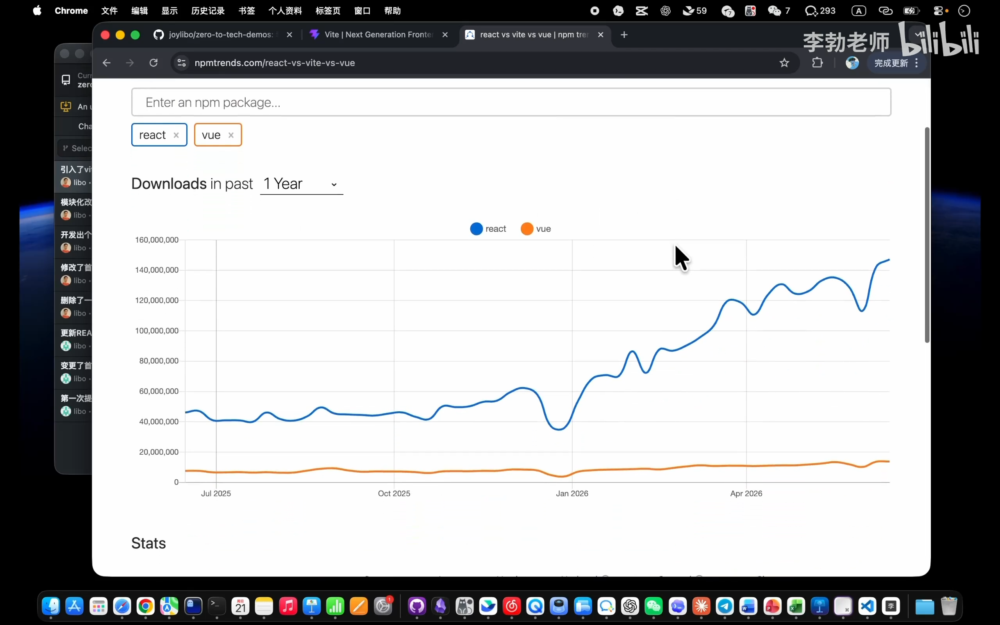

顺便看一下 Vite 的下载量（图中的绿色曲线）。会发现 Vite 这一年的下载量基本和 React 持平，或者是同一个量级。

有意思的是：Vite 的作者尤雨溪，其实也是 Vue 的作者。同一个人既做了 React 最大的竞争对手 Vue，又做了各种不同框架都在用的 Vite。可见这些工具之间其实是一套相互搭配的生态，不存在"非此即彼"。

### 2.4 这门课的重点不是语法

对我们来说，选哪个真的没那么重要。这门课的核心也不是语法，而是**先理解概念**——只要理解了概念，我们就能够指挥 AI 把事给做了。

这两套框架用到的一些概念，比如说组件、状态、数据驱动界面，这一套逻辑是完全相通的。先挑一个把概念吃透，这才是听完这门课真正能带走的东西。

## 3. 框架是什么：一套规则

*(参考时间: 06:06)*

课程里反复提到"前端框架"，那框架到底是个什么？

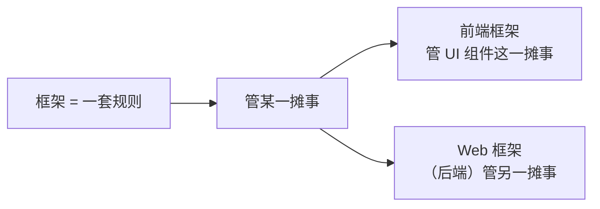
```mermaid
graph LR
    A["框架 = 一套规则"] --> B["管某一摊事"]
    B --> C["前端框架<br/>管 UI 组件这一摊事"]
    B --> D["Web 框架<br/>（后端）管另一摊事"]
```

框架，其实就是**管某一摊事的一套规则**而已。

React 是一个前端框架，Vue 也是一个前端框架。这些前端框架管的是 UI 组件这一摊事。等到后面讲后端的时候，我们还会见到 Web 框架，那是管另一摊事的规则。

所以以后再看到软件开发里出现"框架"这个词，把它理解成一套规则就可以了。

## 4. React 的核心思想：界面即组件

*(参考时间: 06:39)*

React 定义的核心思想，是**把用户界面定义成一个一个的组件**。

这些组件把界面的数据、结构、样式、行为都包在组件里面，并且组件可以像搭积木一样组合或者嵌套。

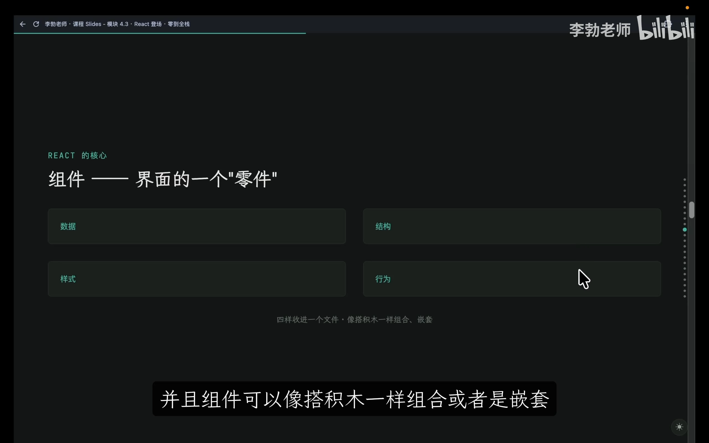

这和原来写 HTML 的方式就不一样了：

| | 组织单元 | 分工方式 |
|---|---|---|
| 传统写法 | **页面** | 结构放 HTML，样式放 CSS，行为放 JS |
| React 思想 | **组件** | 数据、结构、样式、行为都收进组件 |

以前写 HTML 是基于页面来写的：把页面结构保存到 HTML，把样式保存到 CSS，把行为保存到 JS。而 React 的思想是**基于组件来组织和管理项目**，它的管理单元是组件。

自从有了框架，现在比较大一些的项目基本都是用框架来写的。

## 5. vanilla：不用框架的写法

*(参考时间: 07:28)*

但原来那种不用框架的写法也并没有过时。现在很多 vibe coding 的 slides 之类的基本都是不用框架的。

这种不用框架的写法一般被叫做 **vanilla**：不依赖任何第三方框架，只使用浏览器原生支持的 HTML、CSS 和 JavaScript 来建设功能的前端开发方式。我们今天这节课之前写的那些页面，都可以算 vanilla。

vanilla 这个词在英文里是"香草"的意思。为什么用这个词？因为买冰淇淋的时候，那种基础的、默认的口味一般就是香草味。所以软件行业借用了这个词，来表示**原生的、没有添加额外框架或大规模扩展的版本**。

这种叫法不只前端有：

- 操作系统：vanilla Android、vanilla Linux；
- 游戏：vanilla Minecraft。

大家了解一下就行，以后遇到这个词知道是什么意思就可以。但也别为这个词较真——网上见过有人吵架，说"只要用了第三方库就不能叫 vanilla"，这真的没必要争论。**看到这个词，把它当成没有用框架的项目就可以了。**

## 6. 浏览器只认三件套

*(参考时间: 08:57)*

关于框架，还有一个知识点必须强调：**无论现在有多少前端框架，无论框架里定义了多少规则，浏览器是不管这些的。浏览器永远只认 HTML、CSS、JS 这三样。**

这一点从来没有变过。React 也没有抛弃这三件套，它只是在这三件套上面加了一层更舒服的"作者层"。你按照 React 的方式去写，构建工具在背后把它编译回这三样，然后再喂给浏览器。

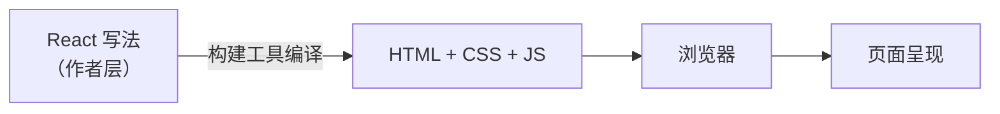
```mermaid
graph LR
    A["React 写法<br/>（作者层）"] -->|构建工具编译| B["HTML + CSS + JS"]
    B --> C["浏览器"]
    C --> D["页面呈现"]
```

所以 React 这种写法**绝对离不开构建工具**。没有构建工具那套翻译工序，浏览器根本不认 React 写出来的东西。

这也正是为什么这套课程设计时，先讲构建、再讲 React。

## 7. 把 React 装进项目

*(参考时间: 09:55)*

既然 React 是一套新规则，那我们就关注怎么把这套规则装进项目里。

具体操作层面其实平平无奇，就是会用 npm 去装几个包——还记得上一节课用到的 `npm install` 命令吗？跟我们装 anime.js 的方法是一样的，都是用 npm 装进来的。只不过 React 管的事更核心、更大。装上这几个包，我们的项目就拿到了 React 的那套规则，就能用它来写界面了。

另外还有一件事。刚才我们说 React 写出来的东西浏览器不认，得靠构建工具翻译回 HTML 三件套。那问题就来了：我们现在的构建工具用的是 Vite，**Vite 凭什么就知道怎么翻译 React 呢？**

所以 React 还会把"如何将自己翻译成基础前端"的这套规则告诉 Vite，Vite 只要照着这套规则去翻译就行。

### 7.1 "框架等于规则"的两层含义

*(参考时间: 10:55)*

到这里就清楚了，"框架等于规则"这句话其实有两层含义：

1. **对开发者来说**：它是一套更舒服的语法规则；
2. **对构建工具来说**：它还附带了一层规则——怎么把这种写法翻译回基础前端。

那 Vite 具体靠什么来执行这套规则呢？靠**一个插件**。

### 7.2 打开项目

*(参考时间: 11:36)*

我们找到上一节课完成的那个项目，用 VS Code 把它打开。

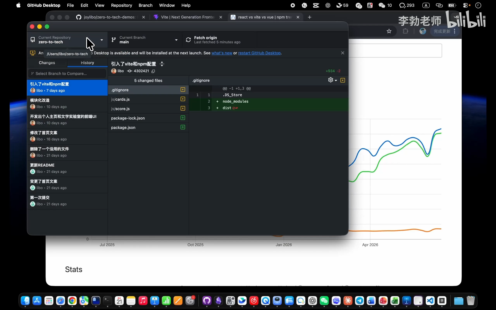

VS Code 本身也带了一个终端，跟我们电脑上自己的终端其实是一样的，你可以用。不过它这个位置不太方便演示，所以这里仍然用电脑自带的终端来演示。

先确认我们现在是在这个项目里面。

### 7.3 第一步：装 React 本身

*(参考时间: 12:44)*

在项目根目录里敲命令。React 不止一个包，还有 react-dom：

```bash
npm install react react-dom
```

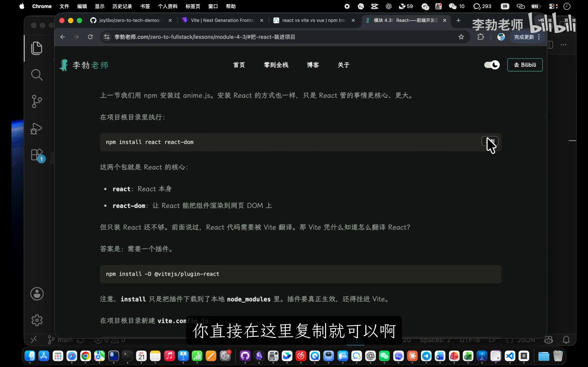

装好之后，看一下 `package.json`，里面已经有 react 和 react-dom 了。这两个就是 React 的两个核心包。

### 7.4 第二步：装翻译插件

*(参考时间: 13:56)*

接下来把刚才说的那个翻译插件也装上。插件的名字叫 `@vitejs/plugin-react`：

```bash
npm install -D @vitejs/plugin-react
```

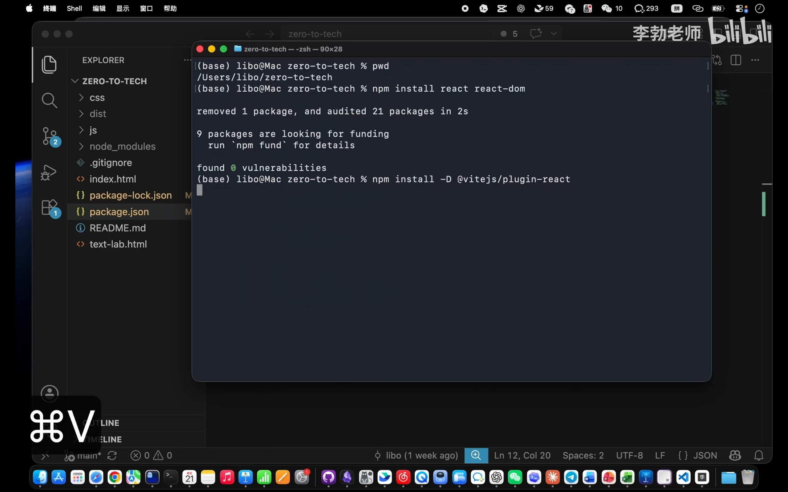

装好之后 `package.json` 里也能看到它了。

注意：**"装"只是把这个插件下载到了本地的 node_modules，它还不能直接生效。** 接下来我们还得告诉 Vite 把这个插件挂上。

### 7.5 第三步：新建 vite.config.js

*(参考时间: 14:39)*

怎么挂？得新建一个文件，名字叫 `vite.config.js`：

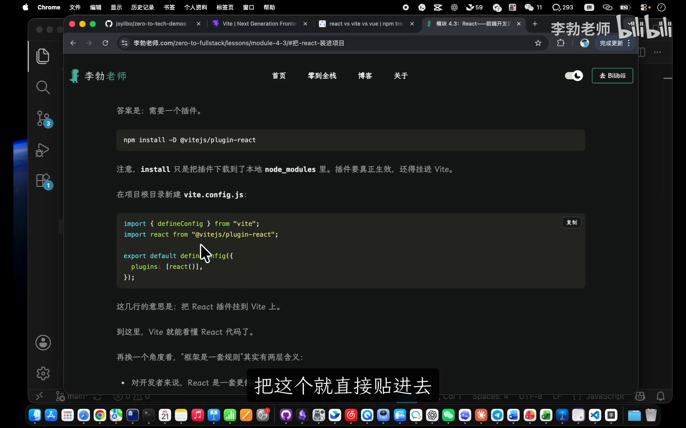

把课件里的内容直接贴进去，保存即可。

上一节课我们是不需要这个文件的——因为上一节课没有用框架，构建过程用 Vite 的默认配置就能跑。现在要给 Vite 加这个框架配置，所以必须新建这个文件。这个文件干的事，就是把刚才装的插件挂进 Vite 里面。

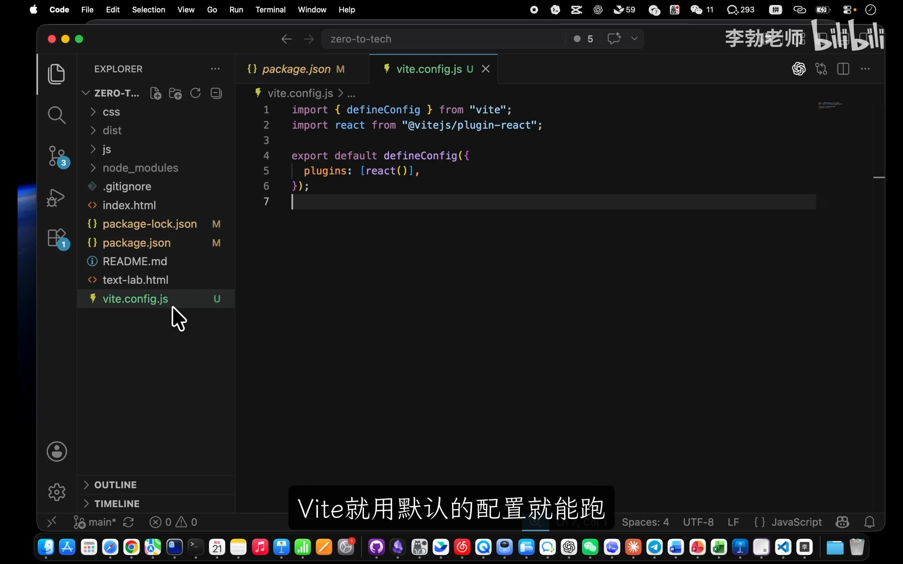

所以你看，这里是**两步**：

1. `install`——把插件下载到本地的 node_modules；
2. 挂上去——让它生效。

两步都做完，现在 Vite 就可以看得懂 React 代码了，并且可以去构建 React 代码。

## 8. 第一块组件：ResultCard

*(参考时间: 16:04)*

环境起来了，开始动手改造。

### 8.1 配套代码与"不抄答案"的学习法

这一节有配套代码，可以通过课件里的两行命令：第一行把示例代码拉到本地（`zero2tech-demos`），第二行打开这一节的代码目录。demo 放在一个 public 的 GitHub 仓库里，你自己也可以下载，跟上一节下载的方式一样。

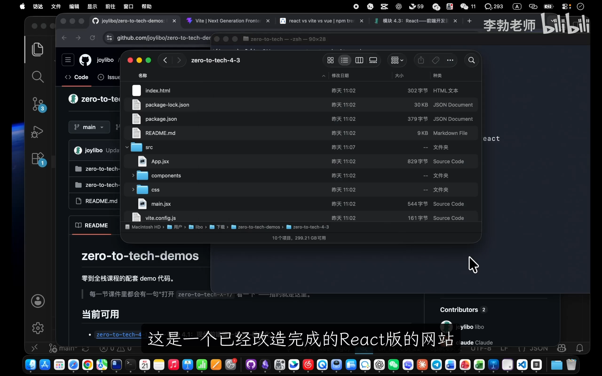

打开 demo 可以看到一个已经改造完成的 React 版网站——这是本节课的**最终答案**。

但注意，不要直接无脑抄答案，因为抄完什么也学不到。我们就在目前已有的代码基础上一点一点地改，最后把现有代码一步一步做成这个样子。

需要用到哪一个文件，就从这个 demo 里把对应的文件复制过来。这门课不教写代码，所以跟着步骤去搬文件、改一改配置、改完跑起来看看现象、理解背后的原理。这样改虽然会有点费劲，但毕竟是学习——**亲眼看着一个 React 项目怎样从无到有一层一层长出来**，比直接拿一个建好的工程来用，学到的东西多得多。

### 8.2 先动结果卡片区

*(参考时间: 18:38)*

先启动一下上一讲做完的项目，看一下页面。

我们看"文字实验室"这个页面，左下角有个**结果卡片区**。就先对它下手，其他部分原封不动。改完之后看一看，一个 React 组件到底长什么样。

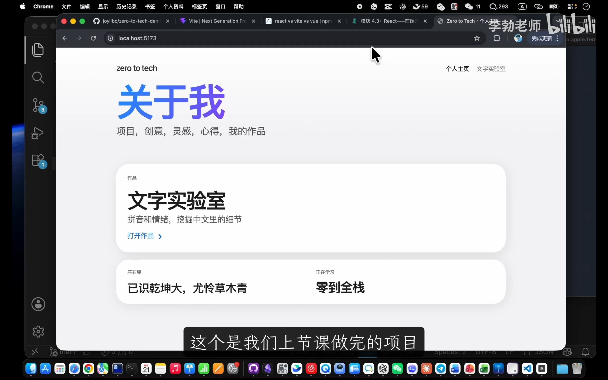

### 8.3 建目录，搬组件

*(参考时间: 19:03)*

先从 demo 里把刚才看到的那个组件找出来——就是这个 `ResultCard`。在 demo 里它放在 `src/components/` 下面。

那我们在自己的项目里也建一个 `src/components` 这样的目录，然后把它放进去。

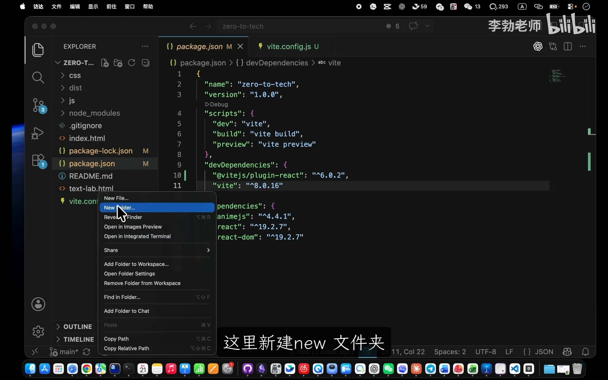

复制粘贴到这个目录下面。

### 8.4 入口文件：组件负责"是什么"，入口负责"挂哪"

*(参考时间: 20:09)*

接下来怎么用呢？这个地方要注意。

`ResultCard` 这个文件**它就是组件本身**：它定义了这个卡片组件是什么、长什么样。但它自己不会自动跑到任何页面上去。那谁负责把它放到页面上呢？

我们还得新建一个文件，放在 `src` 下面（随便命名，这里叫它 `result.jsx`）。注意它**没有放在 `components` 下面**，而是直接放在 `src` 下面，跟 `components` 同级。

这个文件干什么事呢？它就是把这个 `ResultCard` 组件挂到 HTML 里面的某一个位置。这种负责把组件挂上页面的文件有一个名字，我们叫它**入口文件**——你可以理解为从 HTML 进入 React 的入口，也可以理解为从 React 进入我们项目的入口。

它的内容很简单，课件里有写法：

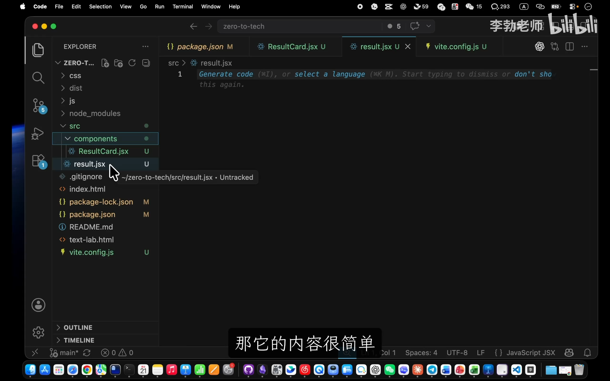

这几行不用完全读懂，直接说结论：它就是把这个 `ResultCard` 组件先 `import` 进来，然后去页面上找到一个名字叫做 `result-root` 的元素（或者说这么一个位置），把组件挂进去。

对应地，原来的 HTML 里那一大段 `<article>` 结果区被换成了这样一个空的挂载点：

```html
<div id="result-root" class="panel-half"></div>
```

并在 `<body>` 末尾加了一行引入入口文件的 `<script>`。

所以到现在为止，新增的这两个文件分工很明确：

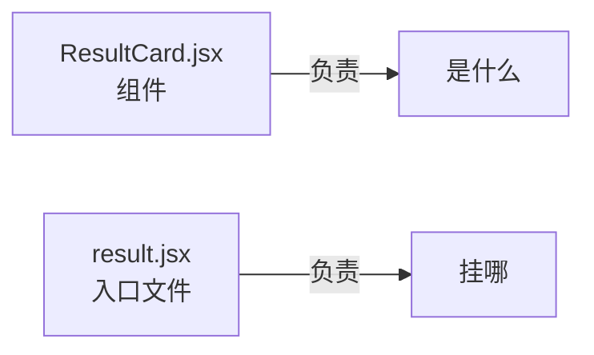
```mermaid
graph LR
    A["ResultCard.jsx<br/>组件"] -->|负责| A1["是什么"]
    B["result.jsx<br/>入口文件"] -->|负责| B1["挂哪"]
```

**组件负责"是什么"，入口文件负责"挂哪"。**

### 8.5 给组件腾位置

*(参考时间: 22:38)*

那挂哪呢？我们要挂到 `TextLab` 这个页面上。所以得先在这个页面上给组件腾个位置。

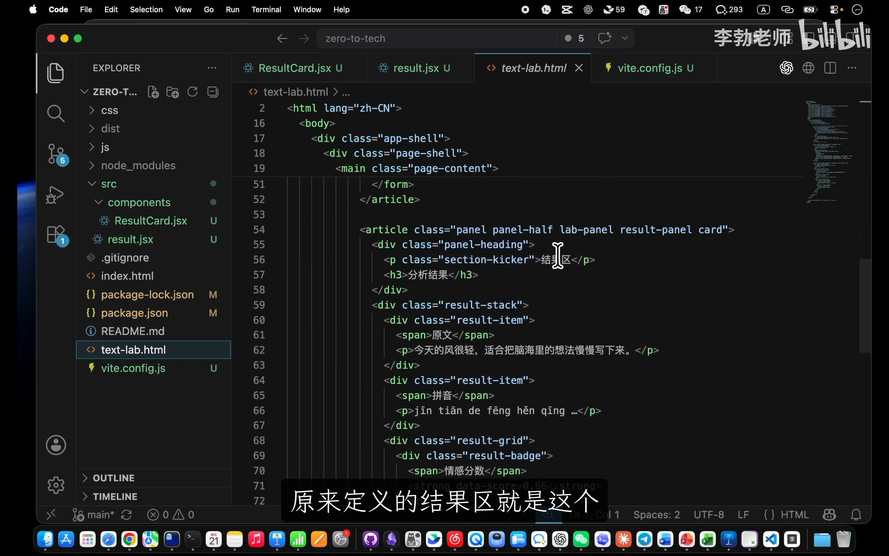

这个页面上原来定义的结果区在哪？就是最外面用 `<article>` 标签包裹的那一段区域。上面是输入区，我们不管，只看结果区。

把结果区这一整块先选中、删除，然后在这个地方定义一个位置，把组件挂进来。

写什么呢？课件里"改之前"和"改之后"的对照可以做参考：改之后原来那一大段 `<article>` 只剩一行。

底部原来引入了一个 `<script>` 标签引用 `main.js`（或类似的入口脚本），这一行不动，在下面再添加一行——就是引入我们新写的这个入口文件。

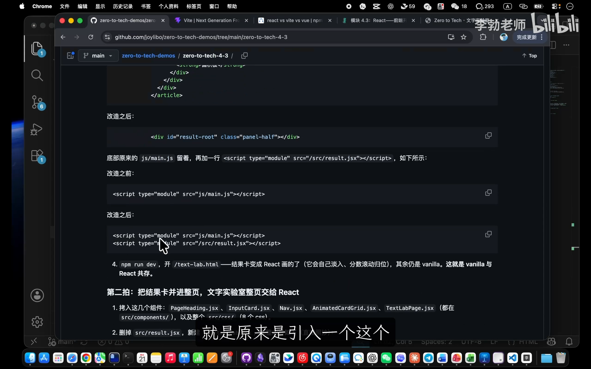

改完之后，这个组件项目里已经有了，也有入口文件把它挂到 HTML 里了，HTML 里也腾出了位置让它挂。现在可以跑起来看看。

### 8.6 第一次运行：只有结果区是 React

*(参考时间: 24:47)*

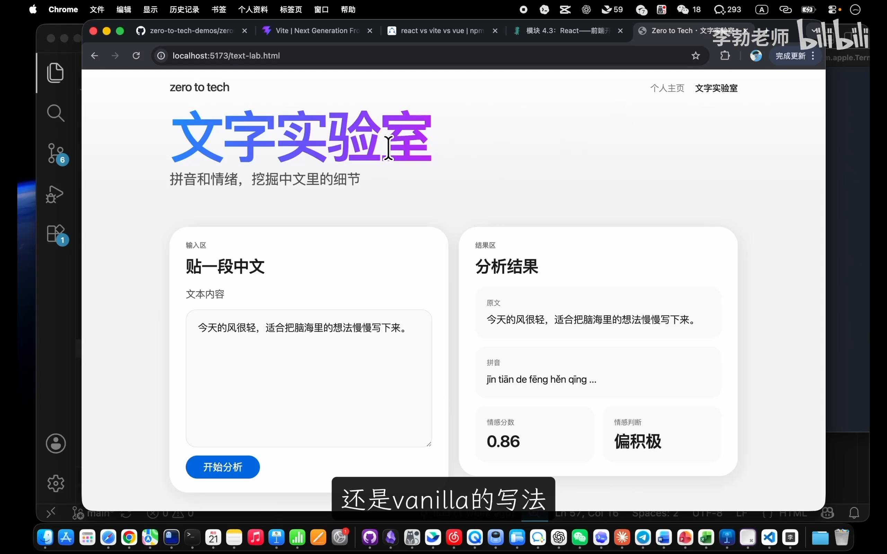

跑起来看一眼——结果区现在已经是用 React 实现的了。当然，页面其他部分还是 vanilla 的写法，只有这一个组件是用 React 写的。

只不过现在有个小问题：**这两个卡片高度有点不一样。** 这个等一下会处理好。

### 8.7 一个组件长什么样

*(参考时间: 25:11)*

这里有个小细节：`ResultCard` 现在的样式是谁来定义的？比如说卡片的圆角、文字的大小——目前还是靠外面那层全局 HTML 引入的全局 CSS 来定义。

React 里面呢，只需要跟原来的 HTML 标签一样，去写这些样式对应的类名就可以了。这和我们原来讲 HTML 和 CSS 时的逻辑是一样的。

打开这个组件看一下：

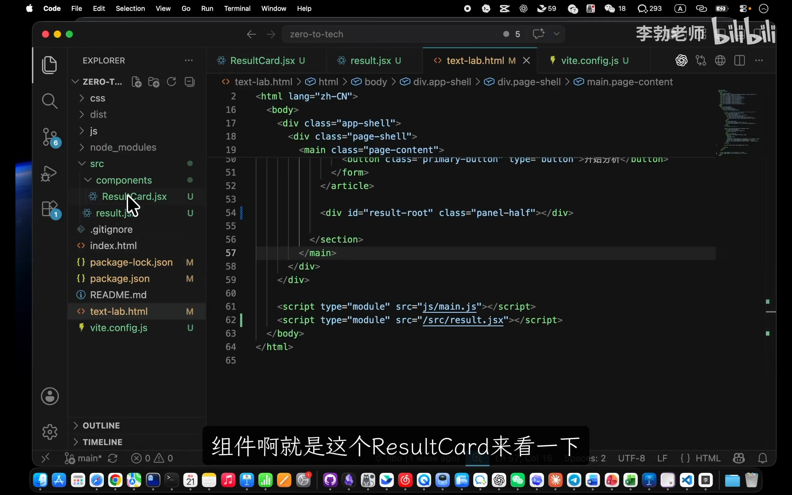

这个 React 组件像什么呢？**就好像是把 HTML 和 JS 写到了一起**：下面是 HTML 标签，中间这里是 JS 逻辑，并且里面写的这些 `className` 也就关联到了 CSS 里定义的样式。

其实你也可以把样式的定义（那些 CSS 部分）写到组件里面，但一般我们不这么做。因为样式这个东西一般还是在更全局的层面做才比较好——放在全局去定义的话，样式一改，整个项目就一起改。

### 8.8 一句话总结组件

*(参考时间: 26:26)*

> 一个组件，就是把这些数据、结构、样式、行为这一整套收进同一个文件，然后封装成一个**能够独立拎走的 UI 单元**，再加上它自带的 `import` / `export`：要什么东西自己进口，然后把自己交出去。

这就好像是一个项目的一个零件。这就是 React 的地基——接下来我们整个项目都可以拿这种零件去打出来。

### 8.9 vanilla 与 React 共存只是学习态

*(参考时间: 27:07)*

一个零件看明白了。现在项目里同时有 vanilla 写法和 React 组件——但这只是我们作为学习来用的。

**真正的项目开发中别这样**：要么就是纯 vanilla，要么就是纯框架。因为这种"两掺"的状态其实提高了复杂度，可能导致一些小问题。

比如你看，这两张卡片的高度现在还不太一样，这就是两掺带来的一个小别扭。当然现在也并非不能解决，只不过等一下我们整页都要改成 React，那它自然就好了，所以先不管它。

还有一个不知道你有没有注意到：现在我们去点"开始分析"这个按钮，分数不滚动了。这个会在下一节讲——现在如果你想看数字滚动动画，可以刷新页面，刷新的时候还是会滚动的。

## 9. 把整页拆成组件

*(参考时间: 28:06)*

接着改造。现在除了结果卡片能改成 React 组件，这个页面上的其他部分其实也都能拆成组件。

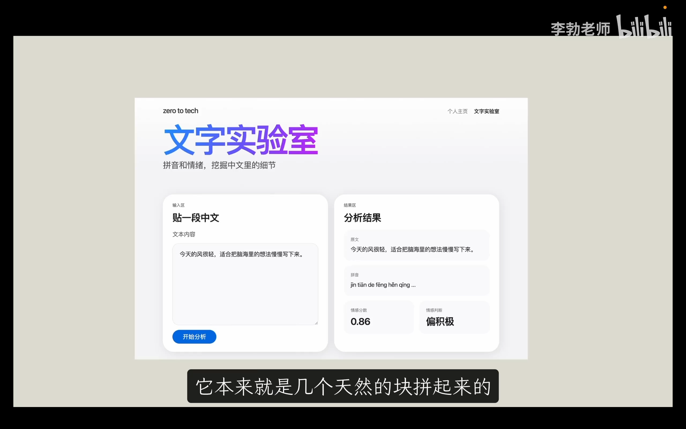

你看文字实验室这一页，它本来就是几个天然的块拼起来的：

| 区块 | 做成什么组件 |
|---|---|
| 顶部导航 | `Nav` |
| 中间的大标题 + 副标题 | `PageHeading` |
| 左边的输入卡 | `InputCard` |
| 右边的结果卡 | `ResultCard`（已做好） |

四块零件，外加一个管动画和布局的容器——这个也做成一个组件，叫 `AnimatedCardGrid`，把它们罩在一起。

那一整页到这儿就被拆成了一堆能各自拎走的小组件。

### 9.1 容器组件

*(参考时间: 29:11)*

注意，像 `AnimatedCardGrid` 这类**容器组件**也是很常见的。它自身没有 UI 元素内容，但它把其他的组件包进去，提供一些公共的属性。这种就叫做容器组件。

### 9.2 拼成一个大组件

*(参考时间: 29:52)*

那接下来怎么办？像刚才的 `ResultCard` 一样，把这些组件分别挂在 HTML 页面里面吗？

并不是。我们可以把现在看到的这四个组件连同它们的容器组件，再拼成一个大组件——也就是说，**把整个页面的全部内容做成一个组件**。这个就是 `TextLabPage` 组件。

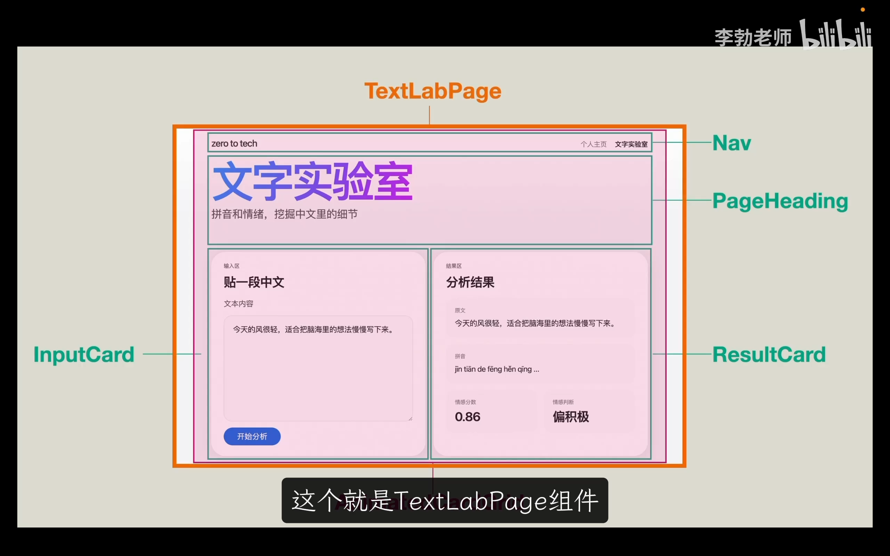

我们可以先用它把这几块零件拼装进去。

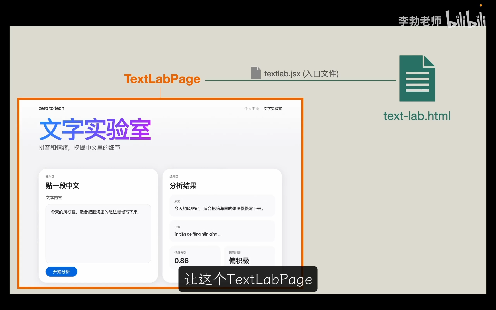

然后把 `TextLabPage` 这个大组件整个挂进 `text-lab.html`。本来好几个组件要一个一个地挂，现在拼成一个大组件了，那就**只需要挂这个大组件就可以了**。

这样一挂，这一整页 HTML 就塌缩成了一个**挂载点**：它什么都不用做了，只需要保留一个挂载点，让 `TextLabPage` 这个大组件挂进来。

不过你需要注意：只要让 React 组件挂到 HTML 里面，就需要一个入口文件。所以这里还需要一个入口文件，就是画面里灰色的这个 `textlab.jsx`。

## 10. 把 text-lab.html 变成挂载点

*(参考时间: 30:40)*

### 10.1 搬组件、搬 CSS

第一件事，先从 demo 里把刚才拆出来的那几块组件的代码文件拷进来：

- `InputCard`
- `Nav`
- `PageHeading`
- 容器组件（`AnimatedCardGrid`）
- 以及最终包成的大组件 `TextLabPage`

`ResultCard` 已经放进去了，所以不管它。把这些组件复制、粘贴到 `components` 下面。

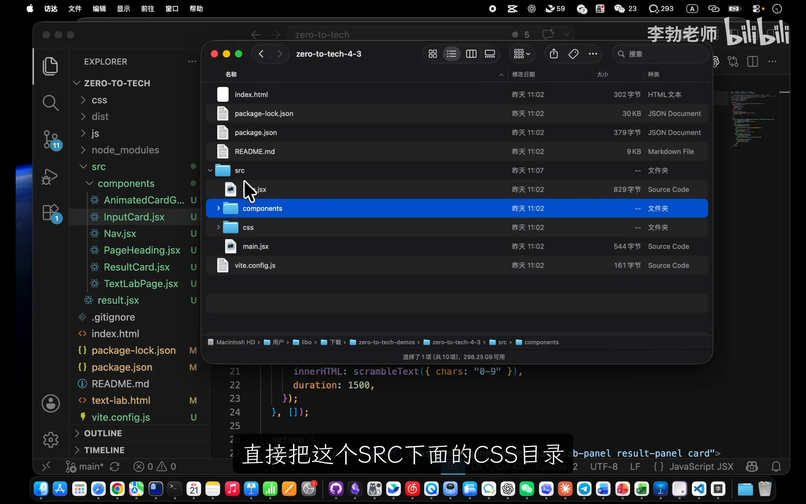

另外，原来我们的 CSS 还是依赖外面的 HTML 来引入的。现在 HTML 变成了一个挂载点，那么 CSS 也不让它来负责引入了——**React 自己去引入 CSS 就可以**。

所以就像 demo 文件一样，直接把 `src` 下面的 `css` 目录整个复制到我们的 `src` 下面。原来老的这几个 CSS 先不要动，因为我们另外一个页面 `index.html` 还在用它。

### 10.2 换入口文件：result.jsx → textlab.jsx

*(参考时间: 32:10)*

第二件事。我们前面做了 `result.jsx` 这个入口文件，当时说它的作用是把 `ResultCard` 这个组件挂进 `text-lab.html` 里面。

现在不用挂 `ResultCard` 了，因为 `ResultCard` 已经被集成进 `TextLabPage` 这个大组件了。所以我们直接把**大组件**挂进去就可以了。

那这个旧的入口文件就可以删掉了。

删完之后，还得建一个新的入口文件：在 `src` 下面新建一个 `textlab.jsx`。它负责两件事：

1. 把 `TextLabPage` 这个大组件挂进 `text-lab.html`；
2. 把那些 CSS 文件也都 `import` 进来。

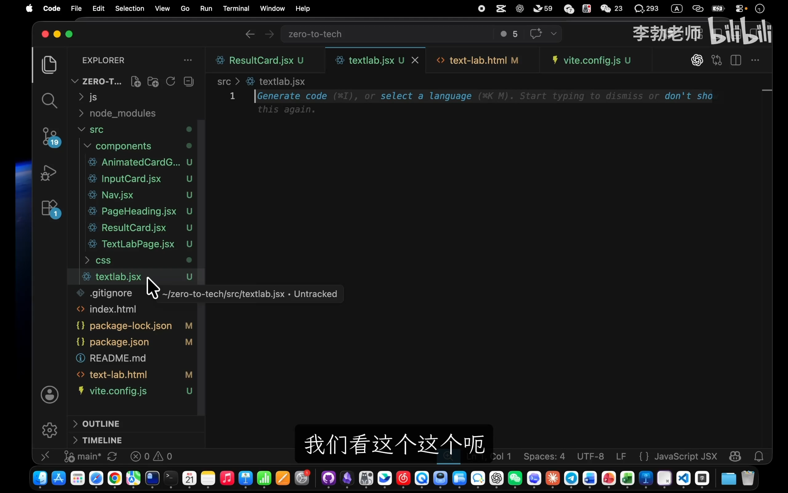

demo 的 README 里写了 `textlab.jsx` 完整的内容是什么，直接复制放进去即可。

### 10.3 清空 HTML：塌缩成一个挂载点

*(参考时间: 33:47)*

接下来找到 `text-lab.html`，这个要清理一下了。

原来 `<body>` 里面写的这些东西，包括下面的 `<script>`，全部删掉——因为它已经塌缩成一个挂载点了，不需要再自己管理这些标签。整个 `<body>` 都删掉，换成这么几行：

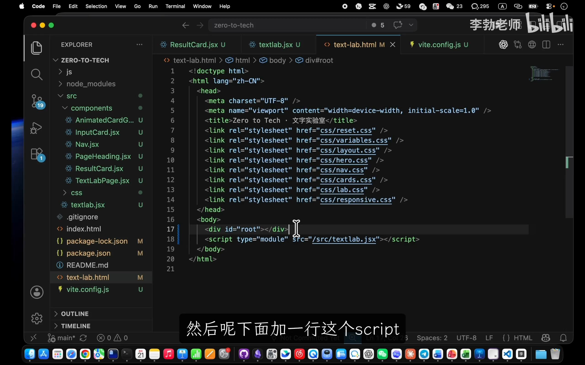

整个 `<body>` 里就剩下两行：一个**空的挂载点**，下面加一行 `<script>`，引入的就是那个入口文件。

另外，`<head>` 里面的那几个 CSS 也都可以删了——因为这个页面的 CSS 已经有入口文件来负责引入了。

到这一步，整个"文字实验室"的 HTML 文件已经变成了 React 组件的挂载点。

### 10.4 两个页面可以共存

*(参考时间: 34:56)*

现在注意：另外一个页面 `index.html`，也就是个人主页，现在一个字都还没动，它仍然还是原来的那个 vanilla 页面。

**这两个页面是可以共存的。** 我们看一下 Vite 跑出来的结果：

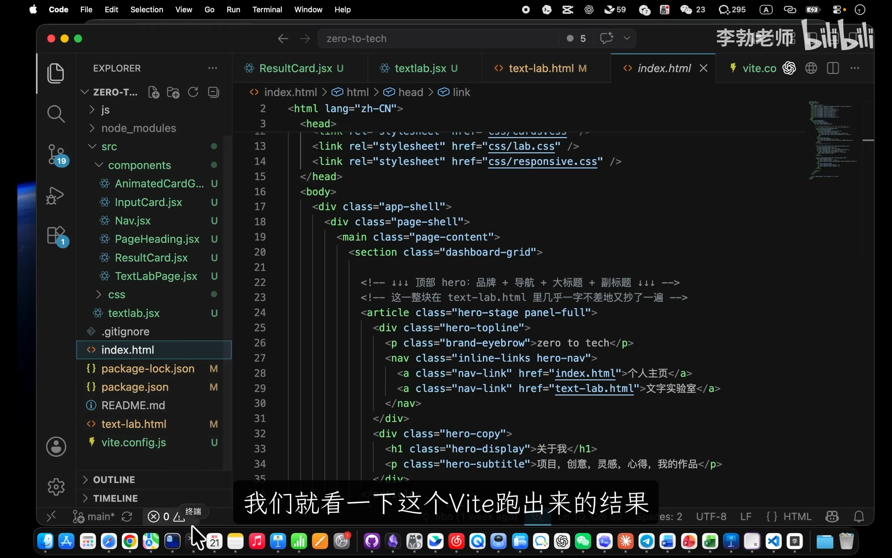

现在这个就是"文字实验室"，整个页面都是用 React 做的。想看个人主页的话，需要从 URL 里改——因为在页面上点击导航现在点不了。

这个不用管，因为我们等一下要改下一步，改完他们就可以点了。

刚才挂完结果之后，我们看到的是什么？我们看到的是一个页面里有 vanilla 写法和 React 组件共存的情况；也就是一个项目里，**有的页面是用 React 做的，有的页面是用 vanilla 做的**。

### 10.5 大写字母的规矩

*(参考时间: 36:10)*

现在跑通了，再回头看一下刚才这个大组件的代码。如果看不懂也没关系，你只需要看一下：它就是在里面把这些零件写进去——像这个 `Nav`、包括这个 `PageHeading`、`InputCard`、`ResultCard`，一块一块摆进去，就拼成了一个页面。

这里面**有大写字母开头的标签，也有小写字母开头的标签**：

- 小写字母开头的，比如说 `article`——这还是 HTML 标签；
- 大写字母开头的就是 React 组件。**React 组件的名字都用大写字母开头，这是 React 的一个规矩。**

另外还有一点：你看这个 `ResultCard`，刚才我们把它挂到 HTML 页面上的时候，还写了一个入口文件；但是把这个 `ResultCard` 挂到 `TextLabPage` 下面的时候，**是不需要入口文件的**，你直接把这个标签写进来就行了。

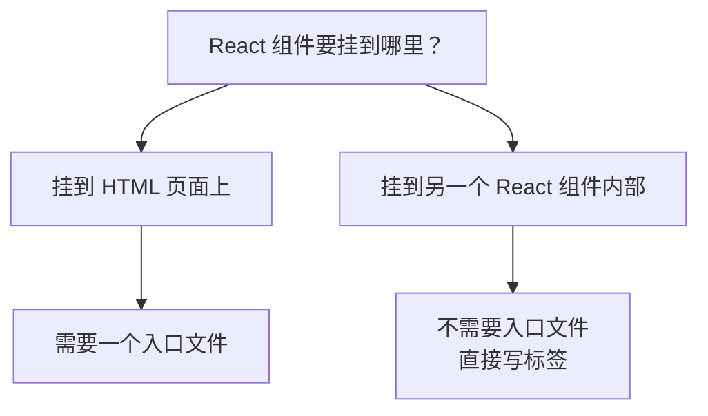
```mermaid
graph TD
    A["React 组件要挂到哪里？"] --> B["挂到 HTML 页面上"]
    A --> C["挂到另一个 React 组件内部"]
    B --> D["需要一个入口文件"]
    C --> E["不需要入口文件<br/>直接写标签"]
```

也就是说：**React 组件挂到 HTML 页面上，需要写入口文件；挂到一个大的 React 组件的内部，就不需要。**

## 11. 改造个人主页与组件复用

*(参考时间: 37:33)*

现在整个文字实验室都已经是用 React 来写了。接下来再进一步改造另外一个页面，就是这个个人主页。

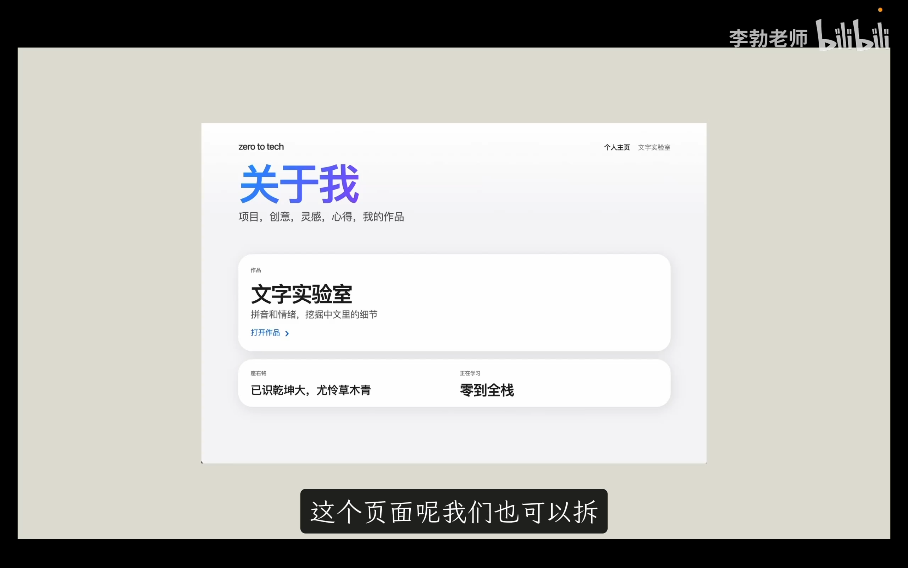

这个页面我们也可以拆，比如拆成这样的三个部分。跟刚才的 `text-lab.html` 一样，也是把这三个小组件一起先放在一个容器组件里面，最后再放到一个大组件里面。

### 11.1 复用 Nav 与 PageHeading

但是——这三个小组件里面的**顶部导航**和**大标题**，是不是和另一个页面看上去样式差不多？尤其是这个顶部栏，两边一模一样；而这个标题呢，它是样子一样，但写的字不一样。

那能不能复用呢？也是可以的。其实包括这个容器在内，两边都是一样的，这些都是可以复用的。也就是说，**我们不用再做一遍，直接就复用刚才的组件的代码就可以了。**

到项目里看一下。个人主页已经做成一个大组件了，就是这个 `homepage.jsx`（`HomePage`）。先把它复制到项目中，然后打开看一眼。

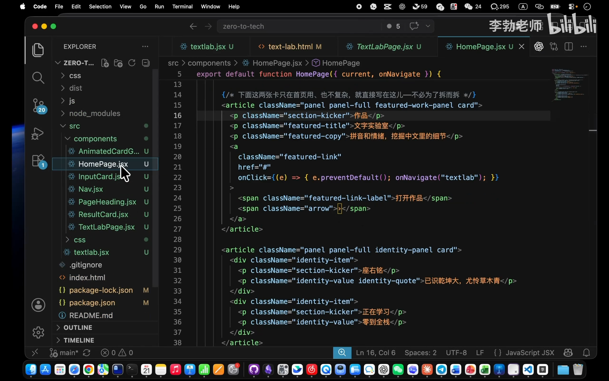

你看，在个人主页的顶部，用的也是这个 `Nav` 和 `PageHeading`，跟文字实验室一样。刚才我们说两边的标题里面写的字不一样，那这个是怎么复用的呢？

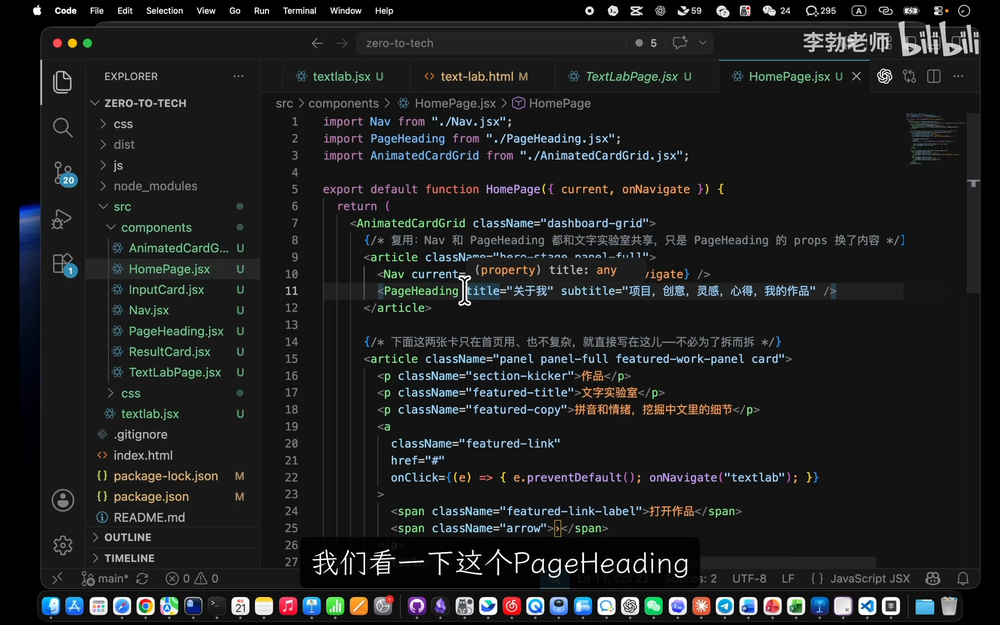

我们看一下 `PageHeading` 这个组件：它其实是把 `title` 和 `subtitle` 给**空出来**了。你要用它的时候，就告诉它让它显示什么——喂给它什么，它就会显示什么。

同样是这一个组件：这边 `title` 喂的是"关于我"、"文字实验室"，那边喂的是"文字实验室"，所以它在不同的页面里就会显示成不同的标题。

**这种只写一次组件、两个页面共享的做法，就是组件复用。** 如果哪天你想改它，改完这个组件之后，这两个页面里面都会同时生效。

### 11.2 什么时候不该拆组件

*(参考时间: 39:58)*

另外这个页面里面还有什么呢？还有下面这俩 `<article>`。我们并没有把它们拆成组件，而是直接写在了这个 `homepage` 里头。

为什么不拆呢？因为它俩**只在首页使用**，内容也很简单。你拆出去呢，既换不来复用，又凭空多出两个文件，这样反而更碎。

所以拆组件就是为了**能复用**，以及为了**让页面读着清爽**。不要为了拆而拆。

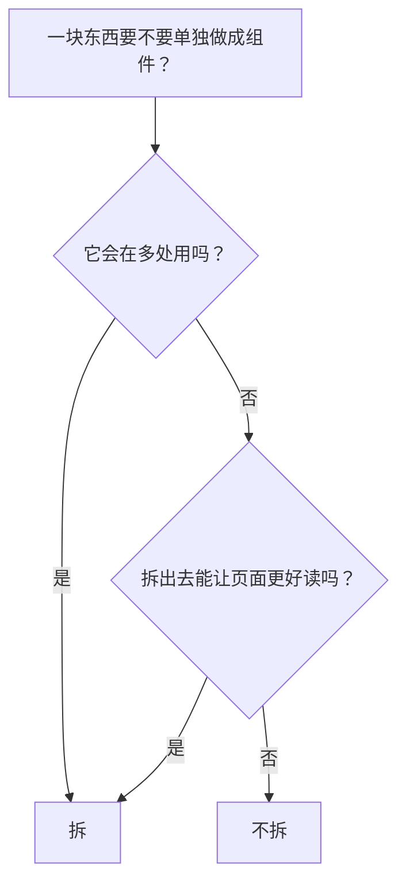
```mermaid
graph TD
    A["一块东西要不要单独做成组件？"] --> B{"它会在多处用吗？"}
    B -->|是| Z["拆"]
    B -->|否| C{"拆出去能让页面更好读吗？"}
    C -->|是| Z
    C -->|否| D["不拆"]
```

要不要单独做成组件，你就问这样两句话：

1. 它会在多处用吗？
2. 拆出去能够让页面更好读吗？

如果这两条都不沾，那就没必要拆。

## 12. 顶层组件 App

*(参考时间: 40:41)*

按我们上一拍的惯性，你大概已经想到要再写一个入口，然后把这个 `HomePage` 挂进 `index.html` 了——就跟当时我们挂 `TextLabPage` 到 `text-lab.html` 一样。

但是先别急着挂。我们停一下，看一看手里现在"攒"了什么东西：

- 我们有两个 Page 组件了：`TextLabPage` 和 `HomePage`；
- 并且 `TextLabPage` 现在是依赖一个叫做 `textlab.jsx` 的入口文件，挂在了 `text-lab.html` 里面的；
- 而我们刚做的这个 `HomePage` 组件，还没挂进 `index.html`。

这是我们当前的项目情况。

### 12.1 页面也能装进更大的组件

*(参考时间: 41:29)*

回想一下刚才说的：组件之间是可以嵌套的，小的组件可以装进大的组件里面。

那么 `TextLabPage` 和 `HomePage` 这两个大的 Page 组件，它们自己不也是组件吗？既然组件能够装进一个更大的组件里面，那这两页是不是也能够装进一个更大的组件里面？

能。这个最终装着两个 Page 组件的更大的组件，就叫做 **App**。

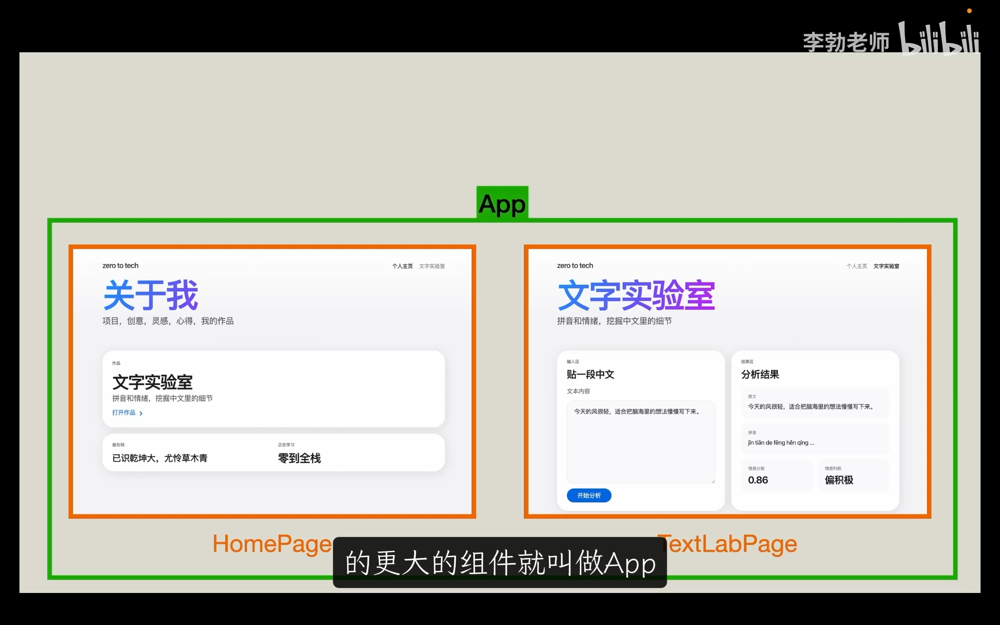

demo 里已经有这个 App 组件了。在 demo 里它放在 `src` 下面，我们把它拷进项目，也放在 `src` 里面。

**为什么没有放在 `components` 下面呢？** 因为这个 App 组件已经是我们这个项目里面最大的组件了，它直接包了我们现有的两个页面，所以它就不放在 `components` 下面，而是直接放在外面这一层。

它其实也就这么几行。读不懂也没关系，说一下它是干嘛的：它就是把这两个 Page 组件收纳进来，并且**管理现在应该显示哪一个**——该显示 `HomePage` 呢，还是 `TextLabPage` 呢。等一下我们点导航的时候，点哪一个，它就把哪一个 Page 组件给显示出来。

### 12.2 清理旧文件

*(参考时间: 43:07)*

但注意，现在还不能直接跑。先看一下项目现状：

这两个页面现在是不是都变成了组件，挂到这个 App 超级大组件上了？那么原来的两个 HTML 文件，以及这个叫做 `textlab.jsx` 的入口文件，是不是都用不上了？

因为这几个文件原本就是为了承载个人主页和文字实验室这两个页面的。现在两个页面都已经组件化、被收容到 App 里面了，那这俩页面和这个入口文件就用不着了。

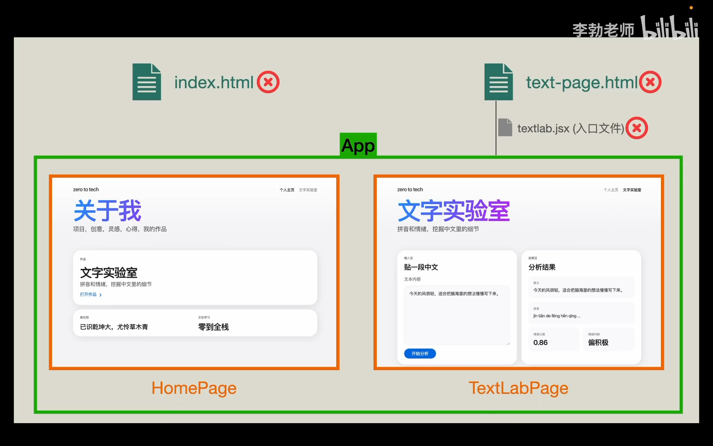

所以我们可以先把它们删了。直接把 `index.html`、`text-lab.html` 包括这个入口文件，三个一起删掉。

另外，外面的这一层 CSS 也可以删掉了——它们本来就是用在刚才那两个 HTML 里面的。现在我们的 React 组件用的已经是 `src` 里面的 CSS 了，所以外面的就不需要了。包括这个 JS 目录也可以删掉。

删了之后这个项目就很干净了：**已经没有任何的 HTML 和 JS 了，除了配置文件和 CSS 之外，全部都是 React 组件。**

## 13. main.jsx 与全新的 index.html

*(参考时间: 44:29)*

那接下来，整个项目最重要的组件是不是就是这个 App 超级大组件了？那么它可以直接用吗？

很遗憾，不行——它最终还是得挂到一个 HTML 页面上。这个页面可以啥事不干，专门就用来挂这个 App 超级大组件。并且挂的时候，仍然还是需要一个新的入口文件。

这个新的入口文件我们就叫它 `main.jsx`，最终挂的这个 HTML 我们就叫它 `index.html`。

注意：**这个新的 `index.html` 和刚才删掉的那个 `index.html` 不是同一个文件。** 刚才删掉的那个是个人主页；现在这个新的 `index.html` 是一个全新的、谁的内容都不装、只负责把整个 App 挂进来的 `index.html`。

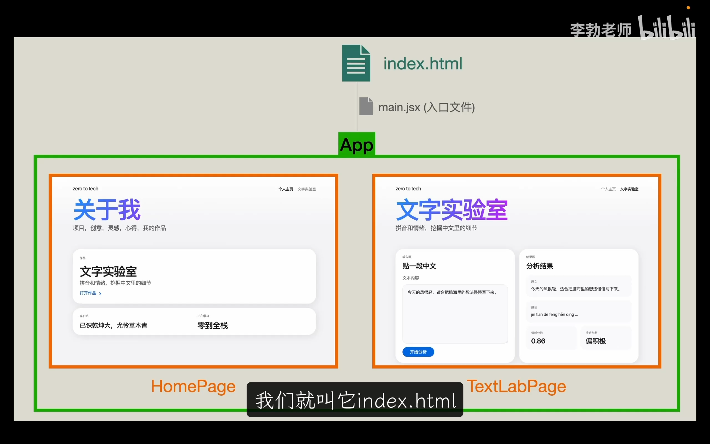

这两个文件都可以从 demo 里复制：

- `index.html` 放在**最外层**；
- 入口文件 `main.jsx` 放在 `src` 下面，跟 `App` 同级。

### 13.1 验证

*(参考时间: 45:59)*

看一下现在的渲染情况。先看 Vite 还在正常运行，再看页面：正常渲染，点导航能够在个人主页和文字实验室之间切换。

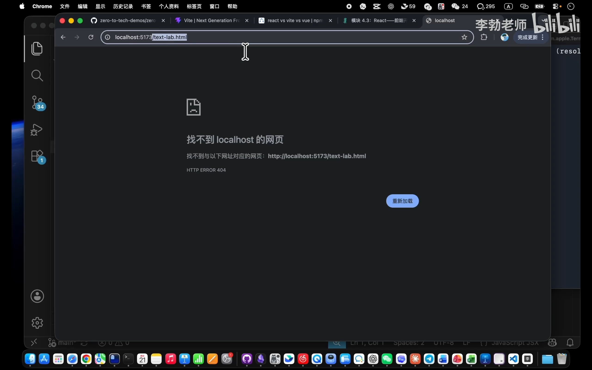

到这一步，我们这个项目已经和 demo 里的一样了——完完全全改成了 React 框架的实现。

## 14. React 项目骨架全景

*(参考时间: 46:27)*

接下来好好看一看，一个 React 项目的骨架长什么样。它是**一层一层套起来**的：

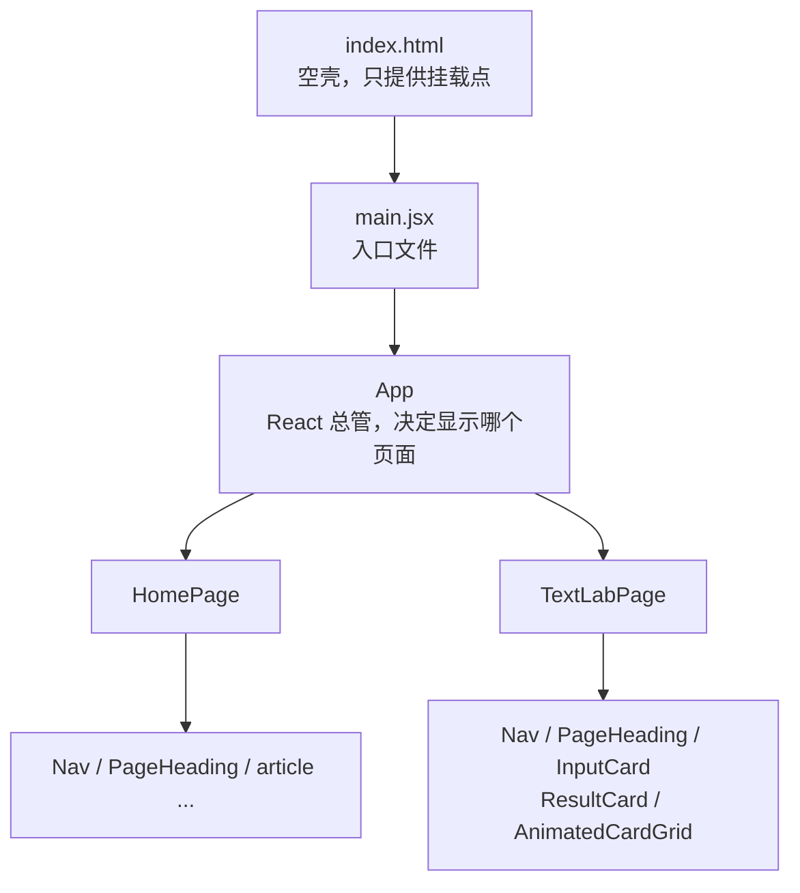
```mermaid
graph TD
    A["index.html<br/>空壳，只提供挂载点"] --> B["main.jsx<br/>入口文件"]
    B --> C["App<br/>React 总管，决定显示哪个页面"]
    C --> D["HomePage"]
    C --> E["TextLabPage"]
    D --> F["Nav / PageHeading / article ..."]
    E --> G["Nav / PageHeading / InputCard<br/>ResultCard / AnimatedCardGrid"]
```

- 最外面是 `index.html`，这是一个**空壳**，它只提供这样一个挂载点；
- 这个挂载点依赖 `main.jsx`；
- 然后这个 `main.jsx` 就把 App 给挂进来；
- 这个 App 是**React 的总管**：它把不同的页面放进去（这里面的两个页面），并且决定着什么时候该显示哪一个页面；
- 再往里面呢，就是这两个页面，以及这页面里面的这些零件。

**我们这个项目就像是搭积木一样，就这样搭起来了。**

现在我们整个项目中只剩下一个 HTML 文件了，并且它现在的作用只有一个：就是把 React 组件挂进来。那如果我们接下来再去做构建的时候，也就只会构建出来一个 HTML 文件了。**这就是 React 框架的实现方式：只有一个 HTML 文件。**

## 15. 构建与提交

*(参考时间: 47:25)*

那我们接下来构建一下，看一看现在 Vite 能不能成功构建这个项目。先把预览停掉：

```bash
npm run build
```

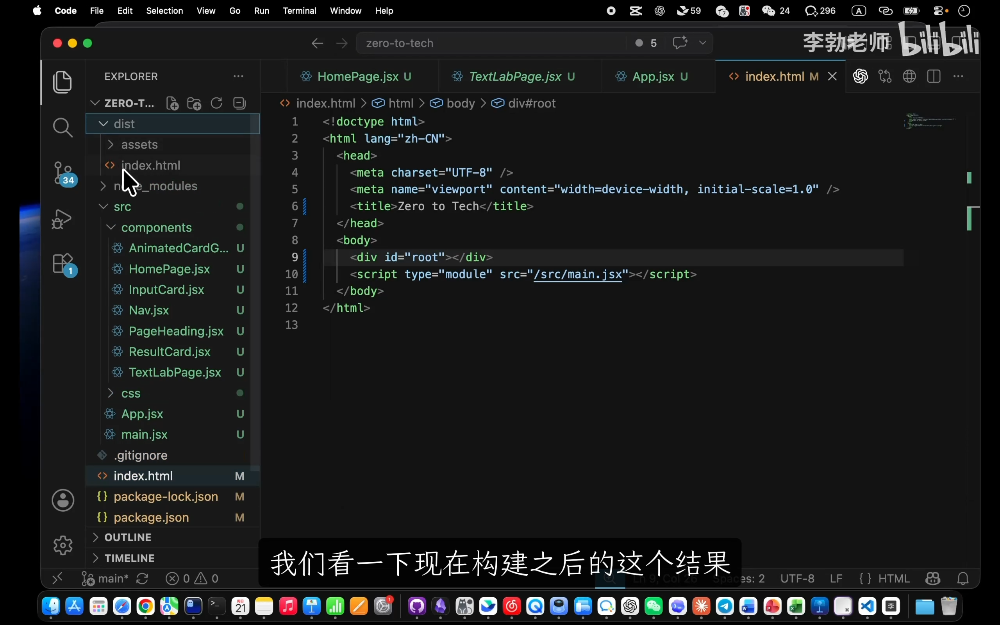

已经构建完成。看一下构建之后的结果：就是一个 HTML，然后里面一个 JS 和一个 CSS。这些就是浏览器能够接受的三个格式。

并且这个 HTML 文件很简单，**所有 React 写的东西都被打进了这个 JS 文件里面**，所以这个 JS 文件的内容就会很多。

到这一步，我们就进行一次 Git 提交——提交的内容是"实现了 React 改造"。今天咱们对项目的改造就到这了。

## 16. 从零建一个 React 项目

*(参考时间: 48:35)*

但是这节课还没结束。回顾一下：刚才我们一步一步地把项目从一个 vanilla 项目改造成了这个 React 结构。我们这么干是为了学习——这样一步一步改下来，我们更容易理解 React 和 vanilla 的关系，也更容易理解一个 React 项目是怎样从无到有、一层一层长出来的。

但你以后真要从零建一个全新的 React 项目的时候，完全不用这么麻烦。其实用这样一条命令就够了——用 Vite 可以直接初始化一个 React 项目：

```bash
npm create vite
```

演示一下。比如我们进入到我们的家目录，敲 `npm create vite`：

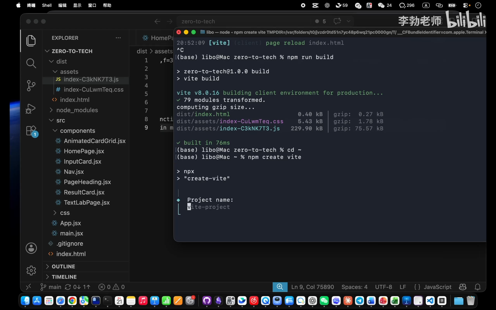

1. 第一步，它会要我们提供一个项目的名字，比如叫 `hello-react`；
2. 接下来让我们选一个框架，第一个就是 vanilla，我们在这里可以选 React；
3. 第三步，选 JavaScript。这里还有一个选项是 **TypeScript**——这节课就不讲了，你自己去查一查，很容易就可以知道它和 JavaScript 的关系。你只需要知道，它在写现代前端的时候可以替代 JavaScript 就可以了。

选完之后在这里选 yes，可能会需要一点时间。

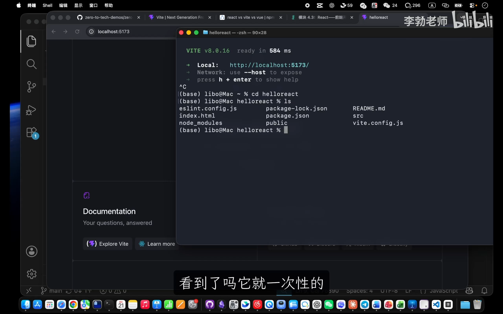

初始化完成之后，它已经自动帮我们创建了一个这样的 get-started 项目。这里面有一些基本的功能已经帮我们实现了——比如点击会有数字的增加。

看一看它初始化了一个什么样的项目：**它一次性地把整套 React 项目的骨架都给我们搭好了**，像 `index.html`、包括 `vite.config.js` 这些都已经有了。只不过这个项目里面多出来一个 ESLint——时间关系这个也不讲了，你可以自己去查一查。

## 17. 生态：框架真正的护城河

*(参考时间: 51:14)*

课程的结尾，我们再思考一下"框架"这件事。

现在有这么多框架，而且框架本身就是一套让我们写得舒服的写法和规则，最后 Vite 再靠这一套规则来翻译框架写的东西。

如果我们想通这一层，你会不会冒出来一个念头：**那如果我们自己有一套更好的代码组织的思路，我们是不是也能够创造一个新的框架呢？** 比如我定义我自己的写法，写完之后交给构建工具去跑——理论上是不是完全也可以？

没错，真的可以。造一个框架从技术上并不是什么遥不可及的事情。**但是难的是什么呢？难的是这套框架有没有生态。**

### 17.1 一个日期选择器的代价

*(参考时间: 52:04)*

假设你造了一个语法特别优雅的新框架。现在你要做一个后台管理系统，那么你需要一个日期选择器、一个数据表格，或者一些图表，或者是富文本编辑器这样的组件。

如果说你是用 React 或者是 Vue，这些东西早就有人做好了一行命令装进来，然后就能用——这两家的成套组件库都极其丰富。还记得这节课开头我说，选 React 或者是 Vue 主要是图它那个又大又厚的生态吗？**这就是答案。**

那如果是换成一个全新的框架呢？对不起，什么现成的都没有，全都得我们自己从零造。不说别的，就单单说一个日期选择器吧，看着简单，如果说你要真的把它做到好用、没有 bug、各种边界都对齐，那就能耗时好几天。

**这就是生态。** 一个框架值不值得用，很大程度上不是看它的语法有多么优雅、写起来有多简单，而是看它背后有多少现成的轮子能直接拿来用。

React 和 Vue 之所以是主流，最硬的护城河也就是它们背后那些海量的现成组件库、教程，还有替我们踩过坑的人。

所以为什么我们就在 React 和 Vue 里面挑，而不是去追求某一个更新潮的小众框架呢？因为**生态决定了我们能不能站在别人的肩膀上**。

还记得我们今天整理组件的时候用到的那个"复用"吧？我们复用的还只是我们自己写的两个组件而已。而框架的生态，让我们复用的是全世界别人写好的东西。

### 17.2 组件库巡礼

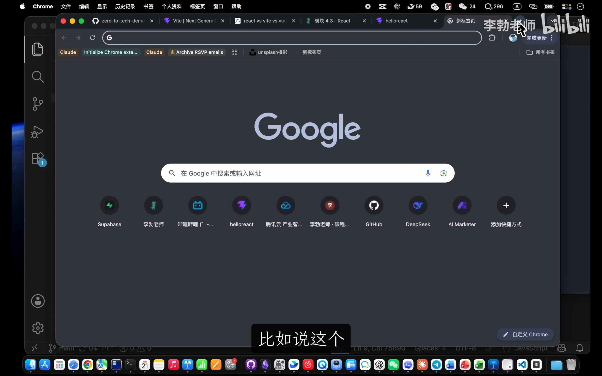

给大家看几个组件库。比如这个 **React Bits**，可以看到有许许多多很酷炫的组件动画。

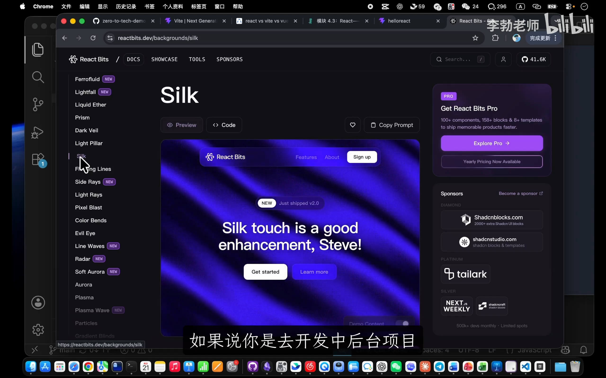

如果你是要去开发中后台项目，也有一个，比如说这个 **Ant Design**，里面也提供了非常非常多用来做中后台的组件。

包括现在也比较流行的其他组件库，里面定义了非常非常多各类的组件。这些都是基于 React 规则的组件库，**拿来就能用**。

这些东西，才是组件化、框架化最大的红利。

## 小结

*(参考时间: 55:31)*

本讲的内容就是以上这些。强烈建议大家跟着课程做一遍，并且每做一步都尝试一下这一步做的事情。

回过头看，这一讲其实只做了一件事：**把上一讲的 vanilla 项目，一层一层地改造成 React 项目**。而改造过程本身，就是理解 React 最好的方式——你会亲眼看到：

1. **框架是一套规则**，它有两层含义：给开发者的舒服写法，和给构建工具的翻译规则；
2. **React 的核心是组件**：把一个 UI 单元的数据、结构、样式、行为收进同一个文件，用 `import` / `export` 对外交互；
3. **组件负责"是什么"，入口文件负责"挂哪"**——挂到 HTML 要入口文件，挂到组件内部不用；
4. **一层一层往上拼**：零件 → 容器组件 → Page 组件 → App → `main.jsx` → `index.html`，最后整个项目只剩一个 HTML 文件；
5. **拆组件要问两个问题**：会在多处用吗？拆出去更好读吗？都不是就别拆；
6. **生态才是护城河**：造框架不难，难的是有没有现成的轮子可以站在上面。

下一节仍然围绕这些 React 组件来开展，我们把它做扎实，顺便把网站的内容和结构分开。下一节见。
