# 【零到全栈】4.4 数据驱动界面

> 视频来源：[Bilibili](https://www.bilibili.com/video/BV1Dg7H6oEHQ)  
> 配套代码：[`zero-to-tech-demos/zero-to-tech-4-4`](https://github.com/joylibo/zero-to-tech-demos/tree/main/zero-to-tech-4-4)

## 从“操作页面”到“改变数据”

*(参考时间: 00:01)*

上一节把项目从 Vanilla JavaScript 改造成 React 后，页面已经由组件搭建完成。本节进一步建立一个核心心智模型：**界面不是被逐行命令式修改出来的，而是由数据决定的结果。**

当某个值变化时，React 会让依赖这个值的界面呈现对应的新状态。开发者不需要手工寻找 DOM 节点、再命令它改文字或隐藏元素。

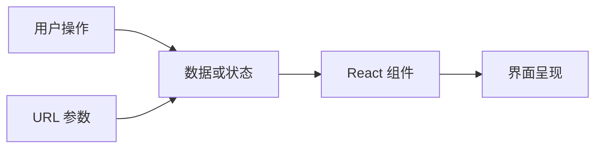
```mermaid
flowchart LR
    D[数据或状态] --> R[React 组件]
    R --> U[界面呈现]
    A[用户操作] --> D
    X[URL 参数] --> D
```

课程用已有的两个组件说明这一点：

- `PageHeading` 接收标题和副标题等外部值，收到什么就显示什么。
- `App` 保存“当前页面”这个值，例如 `home` 或 `text-lab`，并据此决定渲染哪个页面组件。

所以，数据驱动界面要回答的不是“怎样改这个标签”，而是：**这个值放在哪里、谁可以改变它、改变后界面如何响应？**本节介绍三种常用答案。

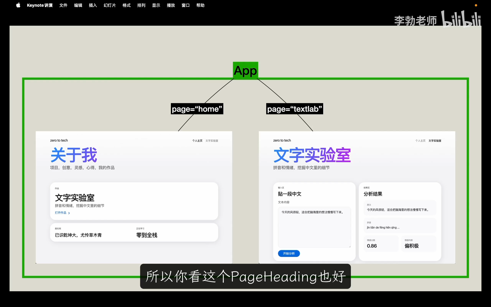

## 方案一：把内容数据从组件中抽离

*(参考时间: 03:39)*

### 为什么内容不应散落在组件结构中

如果 `HomePage.jsx` 同时包含页面结构、样式意图和所有文案，修改“关于我”这样的标题也必须在大量 JSX 结构中查找文本。这会让频繁变化的内容与相对稳定的界面结构耦合在一起。

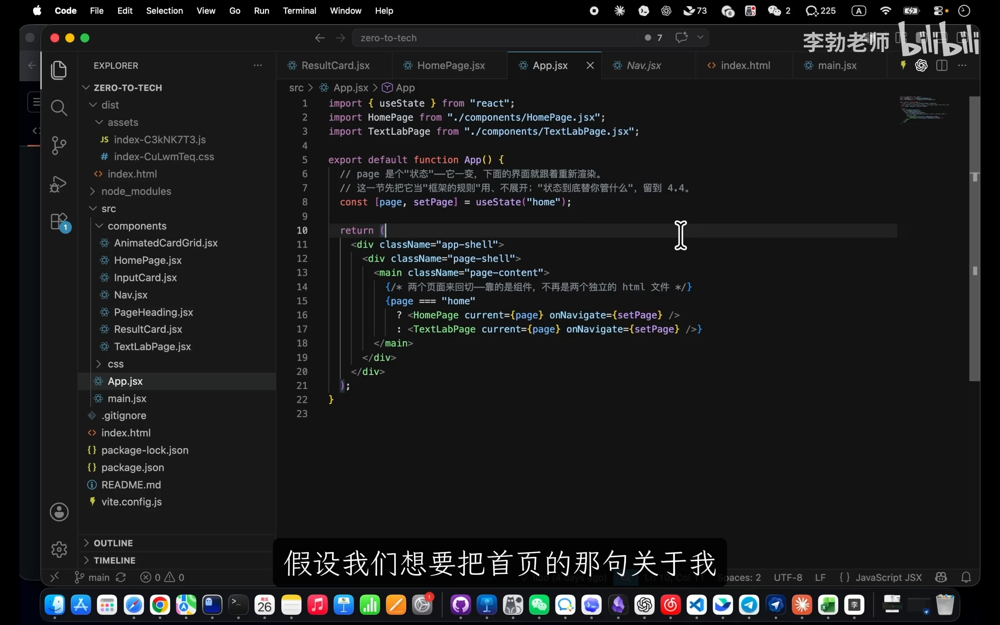

更合适的分工是建立一份内容表，例如 `src/data/site.js`：

```js
export const site = {
  home: {
    heroTitle: '关于我',
    heroSubtitle: '...'
  }
}
```

该文件是 JavaScript 模块，不是 JSON。两者外形接近，但 JavaScript 对象的最后一项可以保留尾随逗号，且可以导出、组合其他值。

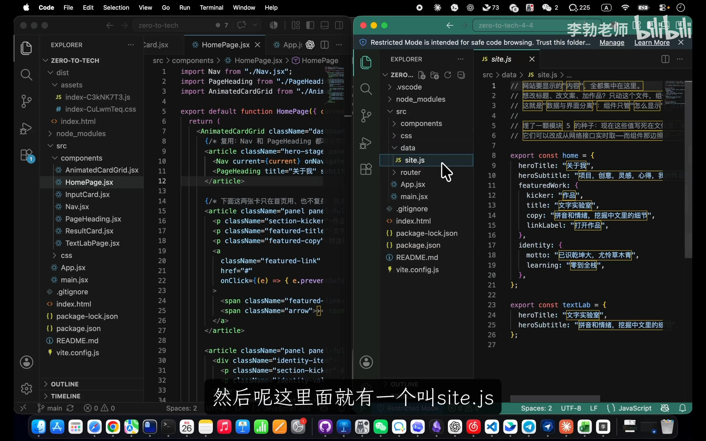

组件只读取字段并负责排版：

```jsx
import { site } from '../data/site.js'

export default function HomePage() {
  return <PageHeading title={site.home.heroTitle} />
}
```

这样，`HomePage`、`App` 和 `PageHeading` 都无需因“关于我”改成“你好世界”而修改；保存 `site.js` 后，开发服务器会立即呈现新值。

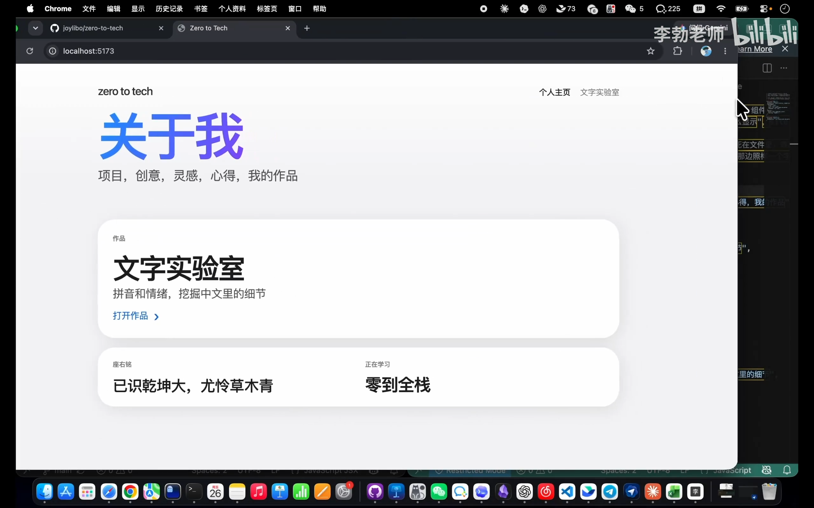

### 这种分离带来的收益

- **内容集中管理**：改文案、补作品卡片等操作集中在内容表中完成。
- **界面更稳定**：组件专注布局、样式和结构，不关心具体文案。
- **便于国际化**：准备中文、英文或法语内容表，再依据语言选择读取来源，无需复制页面结构。
- **为后端数据做准备**：当前数据写在本地文件，之后可以替换为 API 返回的数据，组件的呈现职责不变。

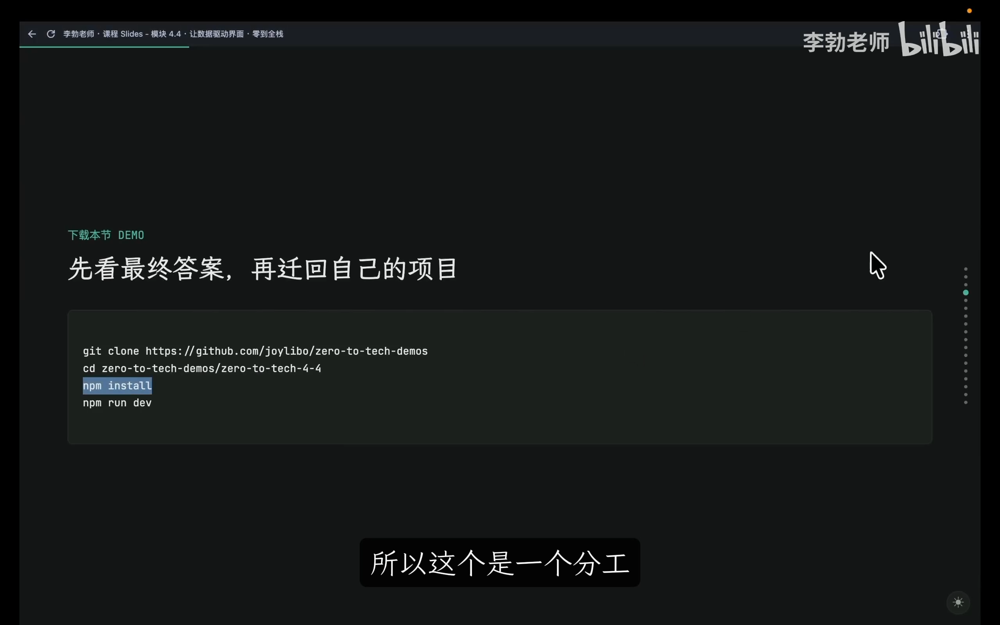

## 方案二：用 State 表示会变化的界面数据

*(参考时间: 12:12)*

内容表中的值由开发者改文件才会变化，但用户交互也会不断产生新数据。例如在文字实验室输入文本后，页面要实时显示“已输入 N 字”。这类会变化、变化后需重新渲染的值，在 React 中称为 **state（状态）**。

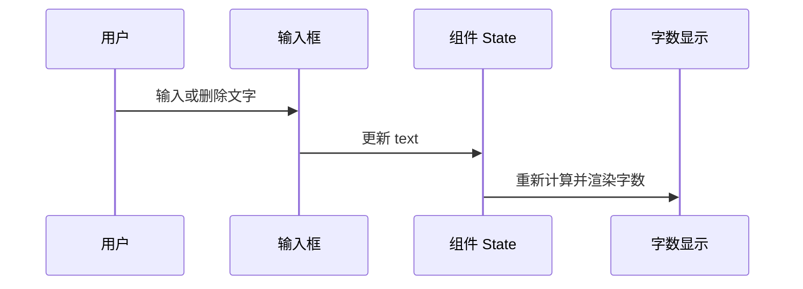
```mermaid
sequenceDiagram
    participant User as 用户
    participant Input as 输入框
    participant State as 组件 State
    participant UI as 字数显示
    User->>Input: 输入或删除文字
    Input->>State: 更新 text
    State->>UI: 重新计算并渲染字数
```

一个典型组件使用 `useState` 保存输入内容：

```jsx
import { useState } from 'react'

function InputCard() {
  const [text, setText] = useState('')
  return (
    <>
      <textarea value={text} onChange={(e) => setText(e.target.value)} />
      <p>已输入 {text.length} 字</p>
    </>
  )
}
```

`text` 是当前值，`setText` 是更新它的唯一入口。用户打字触发 `onChange`，状态更新，React 随即重新执行组件并让字数显示跟随变化。

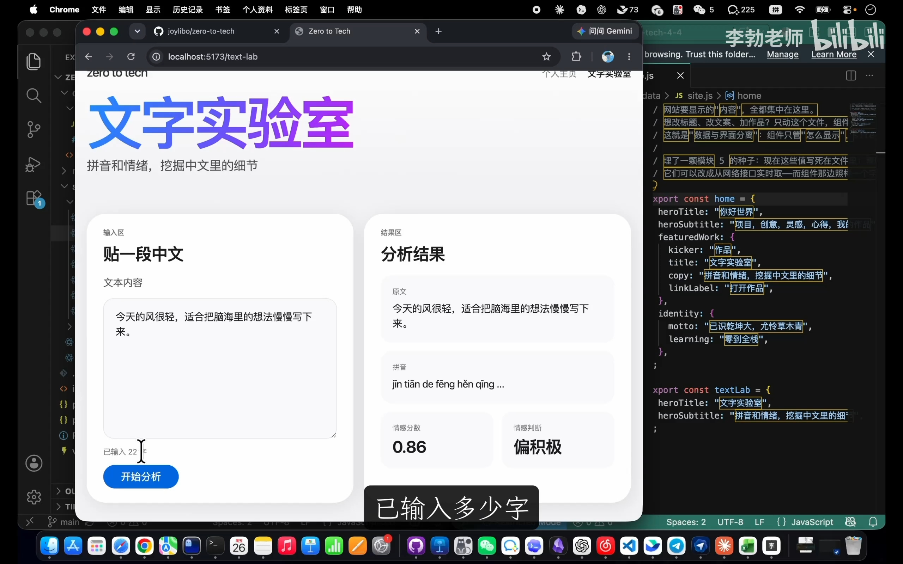

### State 的边界：刷新后会丢失

state 只存在于当前页面运行期间。刷新浏览器、关闭页面或直接把地址发给别人时，内存中的状态不会自动保留。

这也是上一节用 `App` 内部 state 管理页面切换的局限：进入文字实验室后刷新，页面又回到默认首页；复制地址给别人，也无法让对方直接进入当前页面。

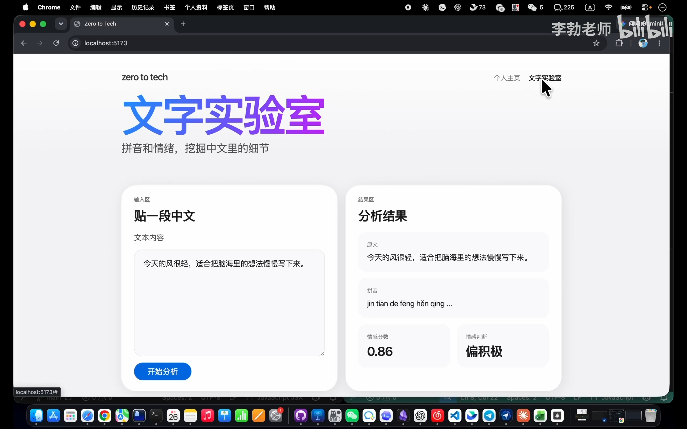

因此，适合 state 的是输入内容、弹窗开关、当前选中项等短期交互值；需要刷新后保留、可分享、可前进后退的页面位置，则应交给 URL。

## 方案三：把路由状态写入 URL

*(参考时间: 18:17)*

路由也是数据驱动界面：只不过“当前显示哪一页”这个数据不再只放在 `App` 的 state 中，而是编码在浏览器 URL 的路径里。

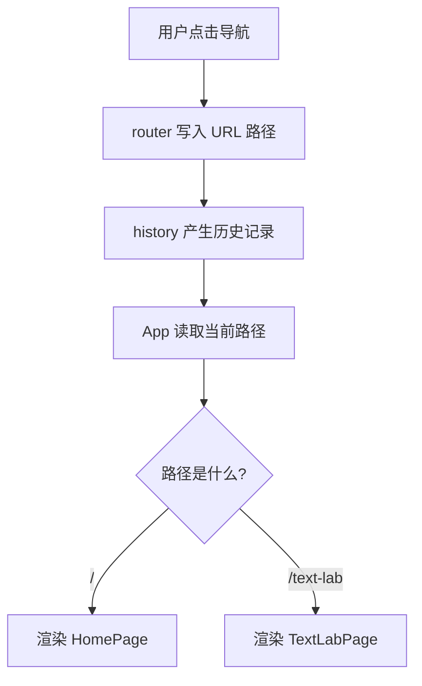
```mermaid
flowchart TD
    N[用户点击导航] --> W[router 写入 URL 路径]
    W --> H[history 产生历史记录]
    H --> R[App 读取当前路径]
    R --> P{路径是什么?}
    P -->|/| Home[渲染 HomePage]
    P -->|/text-lab| Lab[渲染 TextLabPage]
```

示例项目在 `src/router/useRoute.js` 中实现了一个轻量路由工具。它负责读取当前地址，并在点击导航时更新 URL。`App.jsx` 根据该路径选择页面。

```js
// 路由值的含义示例
'/'          // 个人主页
'/text-lab'  // 文字实验室
```

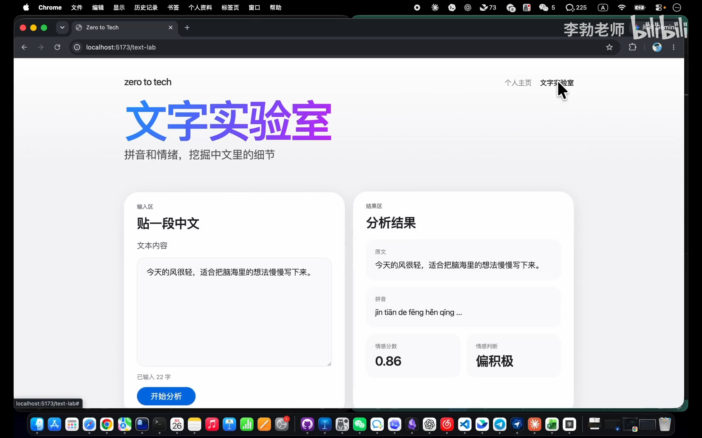

把路由放进 URL 后获得三个关键行为：

1. 在 `/text-lab` 刷新仍停留在文字实验室。
2. 浏览器前进、后退可以恢复之前的页面位置。
3. 把当前地址发给其他人，对方打开的是同一个页面。

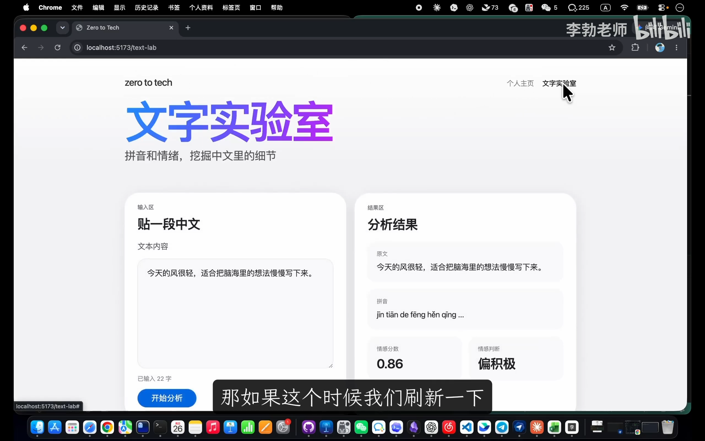

课程中的 `useRoute.js` 是为了理解原理而手写的最小实现。真实的成熟 React 项目通常直接使用 React Router；后续的 Next.js 也提供了内建的路由方案。

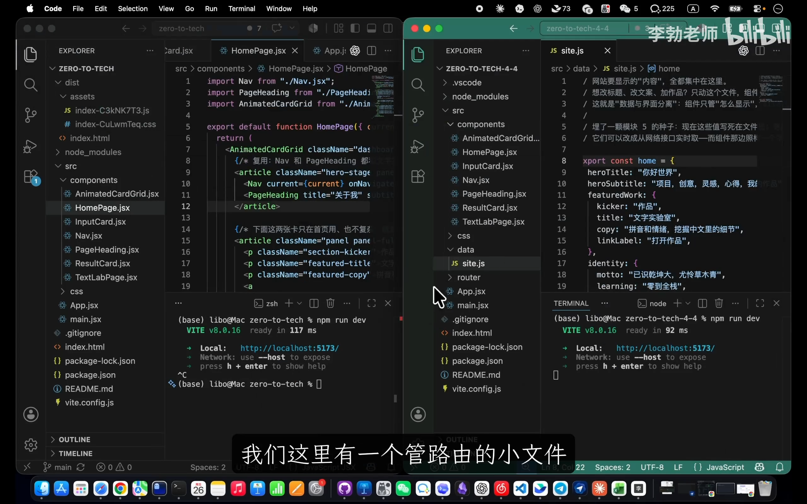

## 将 4.3 项目迁移到本节结构

*(参考时间: 22:18)*

本节 demo 是 4.3 项目的演进版。迁移时不必重建项目，只需把内容表和小路由加入现有目录，并用 demo 中的版本覆盖相关页面组件。

### 新增文件

```text
src/
├─ data/
│  └─ site.js
└─ router/
   └─ useRoute.js
```

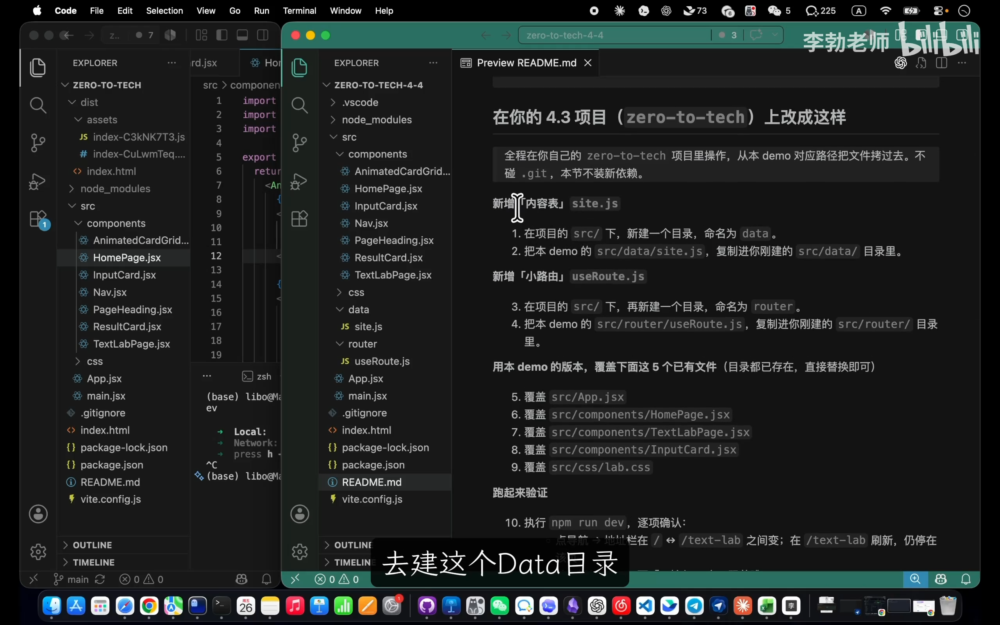

### 覆盖的已有文件

```text
src/App.jsx
src/components/HomePage.jsx
src/components/TextLabPage.jsx
src/components/InputCard.jsx
src/css/lab.css
```

迁移完成后启动开发服务器：

```bash
npm run dev
```

按以下顺序验收：

- 点击导航，地址栏在 `/` 与 `/text-lab` 之间切换；刷新 `/text-lab` 后仍在该页。
- 在输入框键入内容，“已输入 N 字”会立即更新。
- 改 `src/data/site.js` 的 `heroTitle` 并保存，页面大标题即时改变。

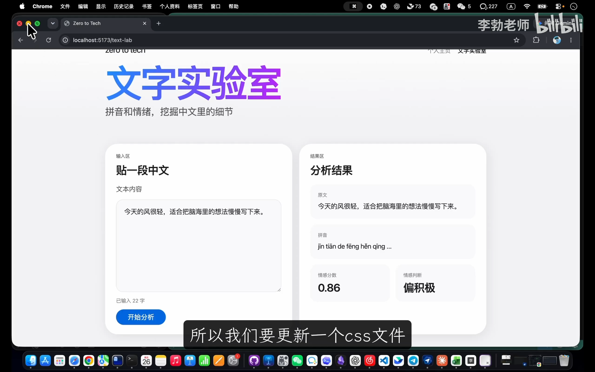

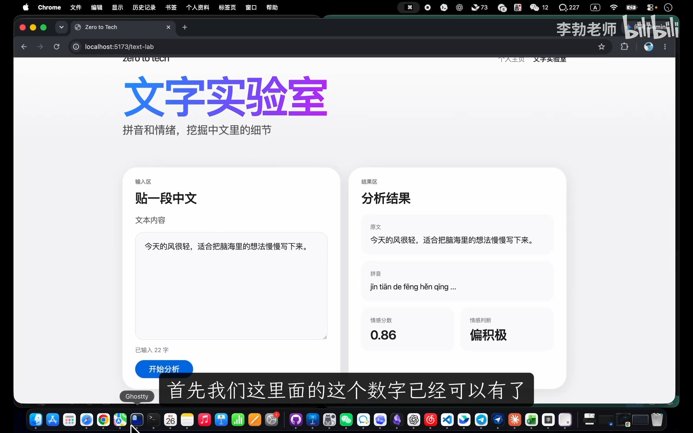

## Vite + React 项目的部署流程

*(参考时间: 28:55)*

从 Vanilla 项目切换到 Vite + React 后，服务器不能再把源码目录直接交给 Nginx。浏览器不认识 JSX 和框架源码，必须先在服务器上构建。


```mermaid
flowchart LR
    L[本地修改源码] --> G[git push]
    G --> S[服务器 git pull]
    S --> I[npm install
依赖变更时执行]
    I --> B[npm run build]
    B --> D[dist/ 静态产物]
    D --> N[Nginx root 指向 dist/]
    N --> U[用户浏览器]
```

### 首次部署或依赖变更时

1. 本地提交并推送源码。
2. 服务器进入项目目录后拉取代码。
3. 安装 Node.js，并执行 `npm install` 根据 `package.json` 安装依赖。
4. 执行 `npm run build`，生成 `dist/`。
5. 让 Nginx 的 `root` 指向项目的 `dist/` 目录。

```bash
npm install
npm run build
sudo nginx -t
sudo systemctl reload nginx
```

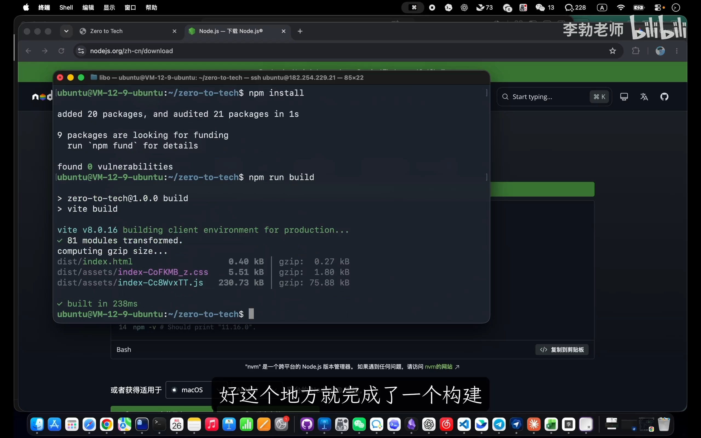

`dist/` 是构建产物，通常被 `.gitignore` 排除：Git 仓库提交的是源码，服务器拉取源码后自行构建。后续如果只改文案、`package.json` 没变，可以跳过 `npm install`，但仍要重新执行 `npm run build`。

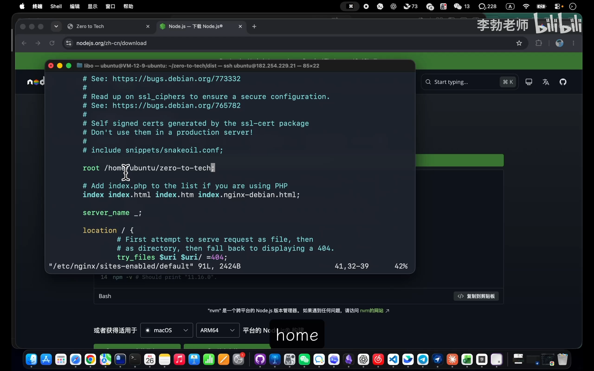

### 单页应用部署的遗留问题

本节通过 URL 路由实现了 `/text-lab`，本地 Vite 开发服务器刷新该路径没有问题；但直接使用静态 Nginx 部署时，刷新深层路径可能收到 404。这是单页应用（SPA）常见的服务器回退配置问题。

课程暂不在本节展开，而是在下一节引出 Next.js。核心结论是：开发环境能处理前端路由，不代表生产服务器已经知道如何把任意路径回退到应用入口。

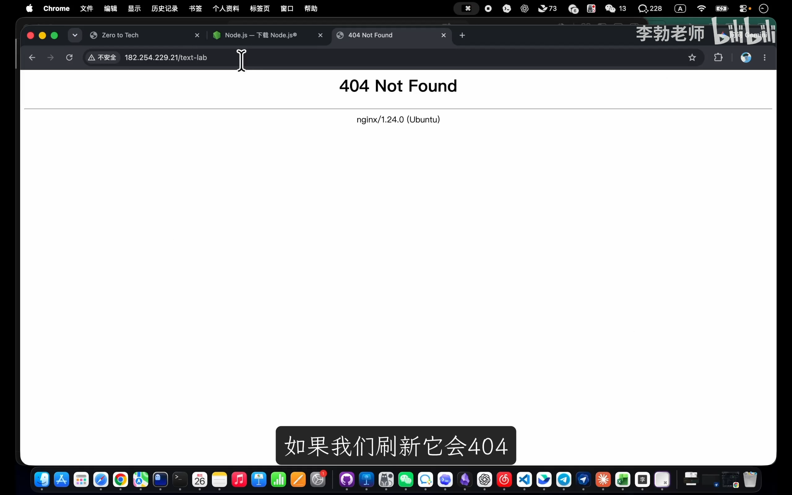

## 本节回顾

*(参考时间: 39:48)*

数据驱动界面有三种主要落点：

| 数据位置 | 适用场景 | 代表例子 |
| --- | --- | --- |
| 内容表 | 稳定、集中维护的展示内容 | `src/data/site.js` |
| 组件 state | 用户交互期间不断变化的短期值 | 输入框文本、字数 |
| URL | 需要刷新保留、可分享、支持前进后退的页面状态 | `/text-lab` 路由 |

对于 React 项目部署，服务器的职责也随之变化：不直接服务源码目录，而是安装依赖、构建 `dist/`，再由 Nginx 服务构建产物。

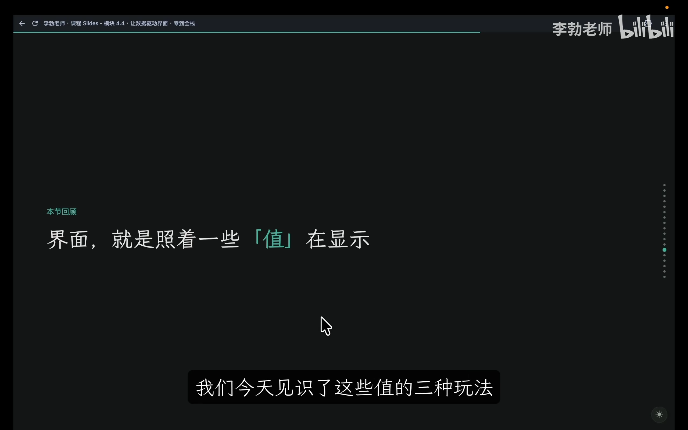
