# 【零到全栈】4.5 - 看懂 Next.js：从单页应用到生产级框架

在上一节中，我们将手写的小型 React 项目推送到服务器并通过 Nginx 发布上线。然而上线后遗留了一个非常典型的隐患：在浏览器中直接访问首页并通过导航跳转一切正常，但若直接在地址栏输入 `/text-lab` 刷新或访问，Nginx 便会直接返回 **404 Not Found**。

这一现象揭示了传统单页应用（SPA）在浏览器端渲染的核心痛点。本章将深入解析客户端渲染（CSR）的运行机制与局限，全面拆解 **Next.js** 这一 React 生产级框架如何通过**约定式路由**与**服务端预渲染（RSC）**优雅地解决这些工程难题。

---

## 客户端渲染（CSR）机制与三大痛点
*(参考时间: 02:05)*

### 1. 浏览器的加载与渲染顺序

打开 Chrome 开发者工具的 Network（网络）面板刷新页面，可以清晰观察到客户端渲染（Client-Side Rendering, CSR）的资源加载时序：

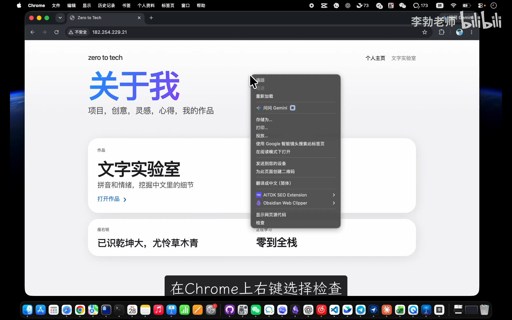

1. **第一步：获取 HTML 骨架**：浏览器首先向服务器请求 `index.html`。查看响应体可以发现，该文件除 `<head>` 引入外，`<body>` 内部近乎空白，仅声明了一个挂载节点：
   ```html
   <div id="root"></div>
   ```
2. **第二步：下载脚本与样式**：浏览器解析 HTML 后，发现其依赖打包生成的 JavaScript（如 `index-xxx.js`）与 CSS 文件，继而发起二次请求。
3. **第三步：客户端运行时计算与绘制**：JavaScript 下载完毕后在用户的浏览器中执行，由 React 框架动态构建虚拟 DOM 树，再将其真实绘制并填充到 `#root` 挂载点中。

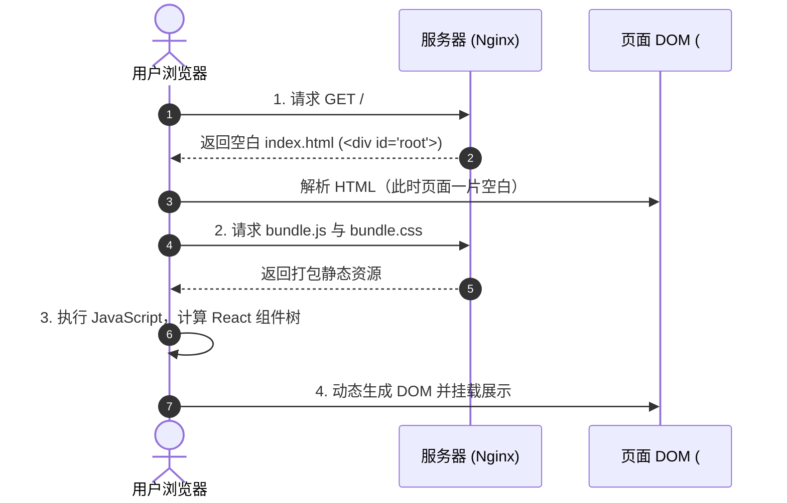
```mermaid
sequenceDiagram
    autonumber
    actor User as 用户浏览器
    participant Nginx as 服务器 (Nginx)
    participant DOM as 页面 DOM (#root)

    User->>Nginx: 1. 请求 GET /
    Nginx-->>User: 返回空白 index.html (<div id="root">)
    User->>DOM: 解析 HTML（此时页面一片空白）
    User->>Nginx: 2. 请求 bundle.js 与 bundle.css
    Nginx-->>User: 返回打包静态资源
    User->>User: 3. 执行 JavaScript，计算 React 组件树
    User->>DOM: 4. 动态生成 DOM 并挂载展示
```

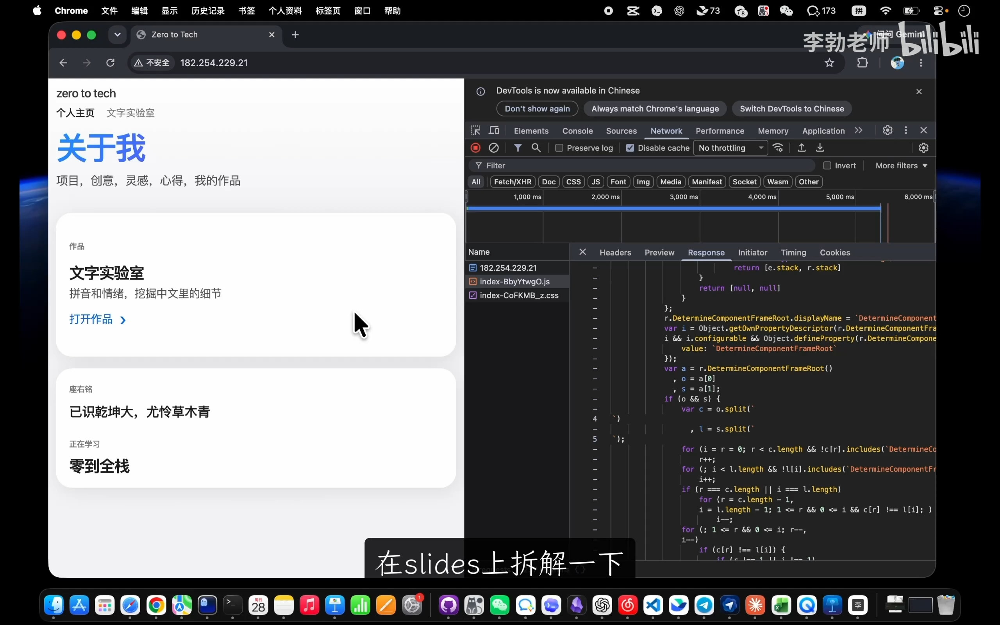

### 2. 传统 SPA 的三大硬伤

这种“浏览器端临时计算”的模式带来了三个不可忽视的工程缺陷：

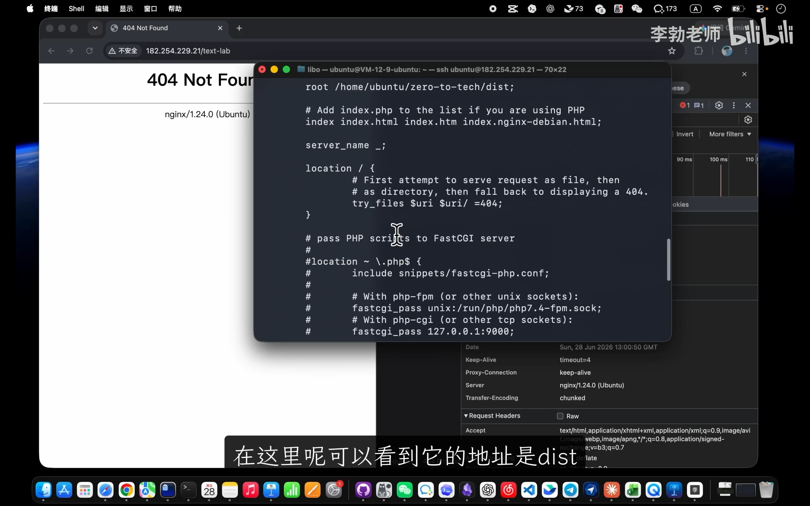

1. **深层路径直接访问 404**：
   - 当用户在已加载好的页面内点击导航切换到 `/text-lab` 时，是由内存中跑起来的 JavaScript 监听 URL 变化并切换组件渲染，并未向服务器真正索取文件。
   - 但若用户直接输入 `http://ip/text-lab`，请求首先抵达 Nginx。Nginx 会在磁盘的 `dist/` 目录下物理寻找名为 `text-lab` 的文件或目录。由于构建产物只有 `index.html`，Nginx 找不到对应资源，自然返回 404。
2. **首屏加载耗时明显**：
   - 页面内容必须经历“拉取 HTML → 拉取 JS → 执行 JS 渲染”三次串行阶段。若项目体积增大、引入较多依赖或网络延迟偏高，首屏白屏时间会急剧拉长。
3. **搜索引擎优化（SEO）极不友好**：
   - Google、Bing、百度等搜索引擎的爬虫爬取网页时，大多只做一次 HTTP 请求并解析静态 HTML，不会完整等待庞大的 JavaScript 执行渲染。在爬虫眼中，这个页面仅仅是一个没有有效文本的空壳，导致网站难以被有效收录和排名。

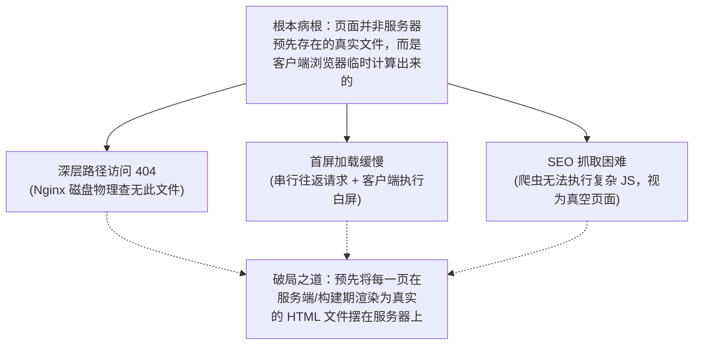
```mermaid
flowchart TD
    RootCause["根本病根：页面并非服务器预先存在的真实文件，而是客户端浏览器临时计算出来的"]
    
    RootCause --> Issue1["深层路径访问 404<br/>(Nginx 磁盘物理查无此文件)"]
    RootCause --> Issue2["首屏加载缓慢<br/>(串行往返请求 + 客户端执行白屏)"]
    RootCause --> Issue3["SEO 抓取困难<br/>(爬虫无法执行复杂 JS，视为真空页面)"]

    Sol["破局之道：预先将每一页在服务端/构建期渲染为真实的 HTML 文件摆在服务器上"]
    Issue1 -.-> Sol
    Issue2 -.-> Sol
    Issue3 -.-> Sol
```

---

## Next.js 定位与三层工程架构
*(参考时间: 09:37)*

### 1. 什么是“React 生产级框架”

面对上述痛点，如果仅依靠原生 React，开发者需要自行搭建 Node.js 服务端环境（SSR）、处理复杂的客户端 Hydration（注水）、手动配置路由系统等，工程链路极为冗杂。

**Next.js** 正是建立在 React 之上的“生产级框架”。它并不取代 React，而是在 React 之上补充了面向生产环境所需的全套基础设施。

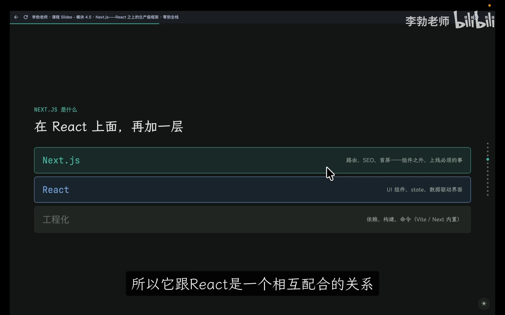

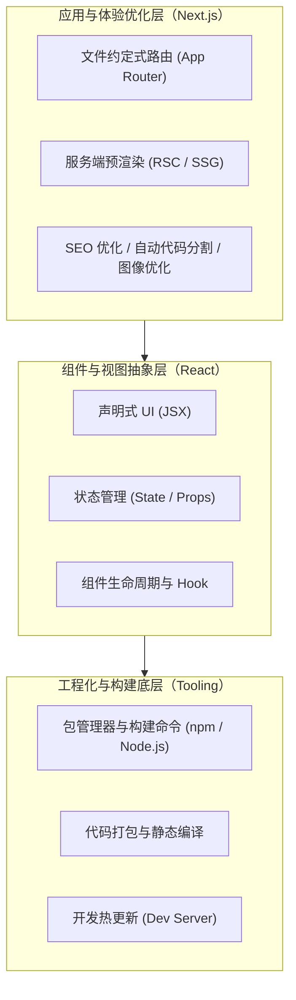
```mermaid
graph TD
    subgraph L3["应用与体验优化层（Next.js）"]
        N1["文件约定式路由 (App Router)"]
        N2["服务端预渲染 (RSC / SSG)"]
        N3["SEO 优化 / 自动代码分割 / 图像优化"]
    end

    subgraph L2["组件与视图抽象层（React）"]
        R1["声明式 UI (JSX)"]
        R2["状态管理 (State / Props)"]
        R3["组件生命周期与 Hook"]
    end

    subgraph L1["工程化与构建底层（Tooling）"]
        T1["包管理器与构建命令 (npm / Node.js)"]
        T2["代码打包与静态编译"]
        T3["开发热更新 (Dev Server)"]
    end

    L3 --> L2
    L2 --> L1
```

- **初学者理解 Next.js 的两个核心着力点**：
  1. **约定式路由**：丢弃手写路由器或手动注册配置，文件夹路径即网址。
  2. **服务端预渲染**：在构建期或服务器端提前把页面渲染为真实的静态 HTML，让浏览器和爬虫拿到的就是带完整内容的页面。

---

## 配置文件与开发环境对比
*(参考时间: 13:40)*

通过将现有的 Demo 项目与引入 Next.js 后的项目并排对比，可以清晰洞察两者的工程差异：

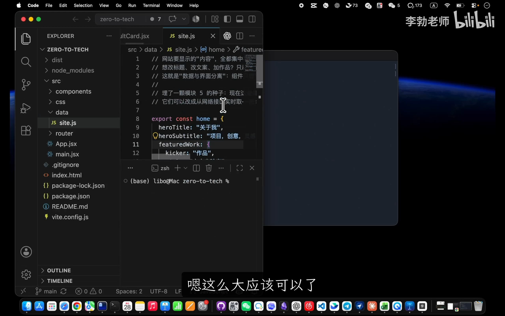

### 1. package.json 脚本与依赖变动

在项目的 `package.json` 中，核心差异体现在依赖项与脚本调用工具的迁移：

```json
{
  "scripts": {
    "dev": "next dev",
    "build": "next build",
    "start": "next start"
  },
  "dependencies": {
    "next": "^14.x.x",
    "react": "^18.x.x",
    "react-dom": "^18.x.x"
  }
}
```

- **构建工具接管**：旧项目中执行 `npm run dev` 背后是 Vite；而在 Next.js 项目中，底层构建被 Next.js 原生工具链整体接管。旧版用于本地静态预览的 `preview` 命令被替代为 `next start`（用于在本地启动由 `next build` 产出的生产级服务）。
- **默认服务端口**：Vite 默认运行在 `5173` 端口，而 Next.js 默认启动在 `3000` 端口。

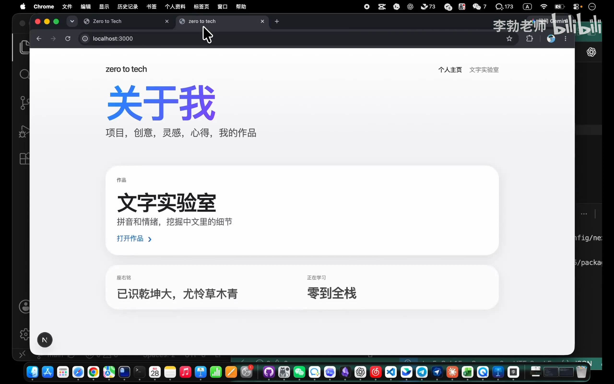

在运行 `next dev` 期间，网页左下角会显示一个黑色的 Next.js 浮动图标。若代码存在语法错误或运行时异常，该工具会直接在页面内以悬浮层精准标出错误行与堆栈信息，在辅助 AI 编程（Vibe Coding）时能极快地将报错信息复制给模型排查。

---

## 约定优于配置：App Router 路由机制
*(参考时间: 17:37)*

### 1. 目录结构与入口迁移

在旧的 Vite+React 项目中，核心代码均收纳在 `src/` 目录下，并由根目录的 `index.html` 引导加载 `src/main.jsx` 与 `src/App.jsx`。

而在 Next.js（App Router）架构中，结构发生了关键转变：

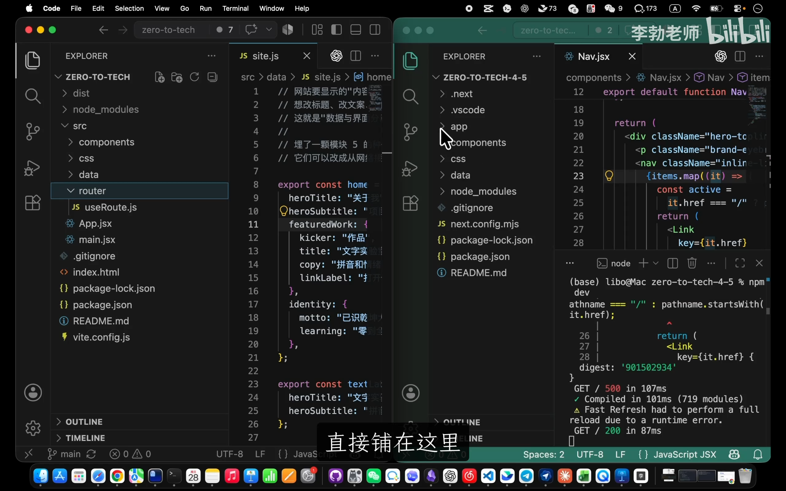

```
my-next-app/
├── app/
│   ├── layout.jsx        # 全局根布局（提供 HTML 基础结构与共享外壳）
│   ├── page.jsx          # 根路径 (/) 对应的首页视图
│   └── text-lab/
│       └── page.jsx      # (/text-lab) 路径对应的子页面视图
├── components/           # 公共组件库
├── data/                 # 模拟静态数据
├── styles/ (或 css/)     # 样式文件
└── package.json
```

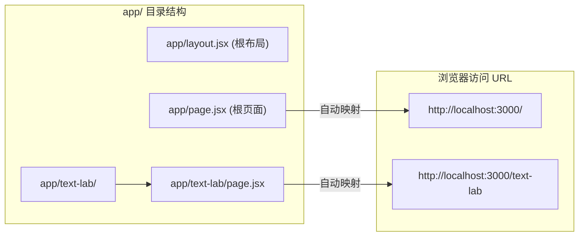
```mermaid
flowchart LR
    subgraph AppRouter["app/ 目录结构"]
        RootLayout["app/layout.jsx (根布局)"]
        RootPage["app/page.jsx (根页面)"]
        SubDir["app/text-lab/"]
        SubPage["app/text-lab/page.jsx"]
        
        SubDir --> SubPage
    end

    subgraph URLRoute["浏览器访问 URL"]
        HomeURL["http://localhost:3000/"]
        LabURL["http://localhost:3000/text-lab"]
    end

    RootPage -->|自动映射| HomeURL
    SubPage -->|自动映射| LabURL
```

### 2. 什么是“约定优于配置（Convention over Configuration）”

- **无需手动注册路由表**：不再需要上一讲中手写的 `window.location.pathname` 状态分发，也不用引入繁重的路由配置对象。
- **文件层级即网址层级**：只要在 `app/` 内部新建文件夹 `text-lab`，并在其内部放置规范命名的 `page.jsx`，Next.js 会自动将其映射为 `/text-lab` 路由。
- **页面与视图分离**：在实践中，推荐保持 `page.jsx` 纯粹简明，仅作为页面级容器引入具体视图组件（如 `TextLabView`），便于代码维护与 AI 理解。

---

## 核心进阶：服务端组件（RSC）与客户端组件
*(参考时间: 21:56)*

### 1. 顶部神秘声明：`'use client'`

在翻阅组件代码时，会发现部分组件的第一行明确声明了 `'use client'`，而另一些组件则没有：

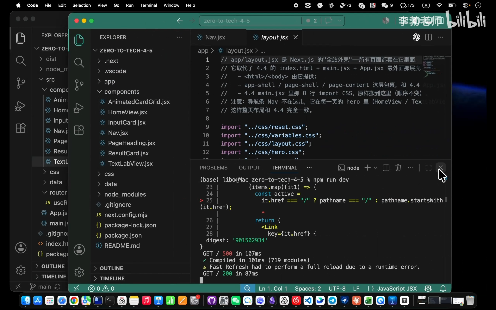

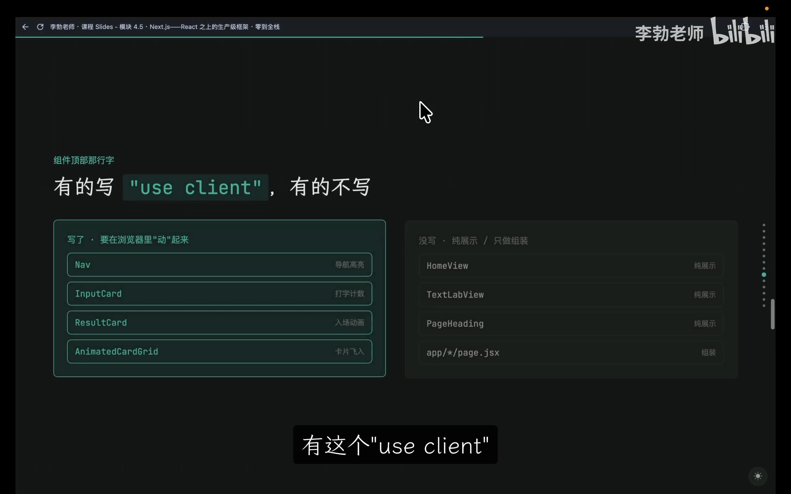

通过分类比对，其核心分界线一目了然：

| 组件分类 | 典型组件示例 | 特征与行为 | 运行宿主环境 |
|:---|:---|:---|:---|
| **客户端组件 (Client Component)** | `Nav`（高亮交互）、`InputCard`（输入打字计数）、`ResultCard`（动画飞入）、`AnimatedCardGrid` | 依赖鼠标点击、表单输入、浏览器动画、浏览器专属 API（`window` / `localStorage`） | **浏览器端**（在浏览器执行 JS 事件响应与重绘） |
| **服务端组件 (Server Component, RSC)** | `HomeView`、`TextLabView`、`PageHeading`、各级 `page.jsx` 与 `layout.jsx` | 纯结构展示、静态数据聚合、只负责布局拼装、无交互事件 | **服务端 / 构建阶段**（直接输出静态 HTML 字符串） |

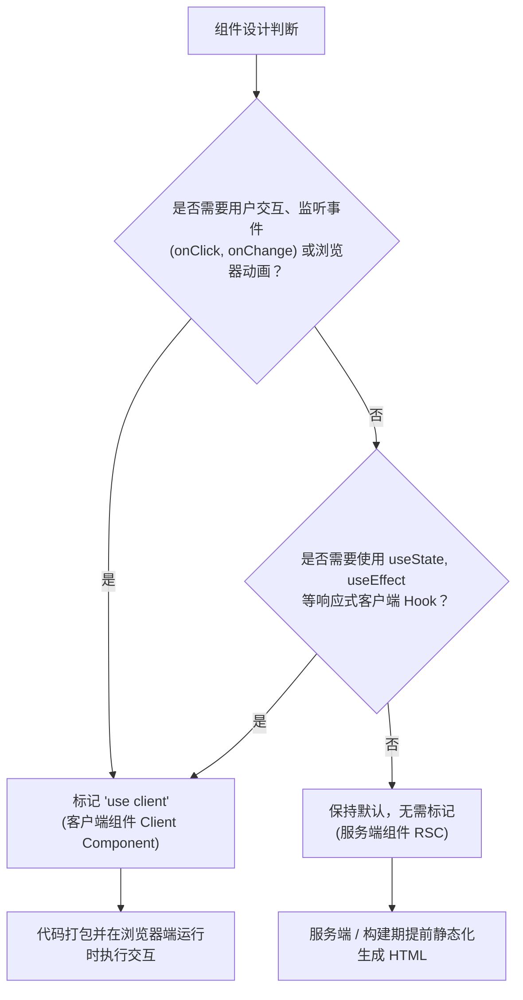
```mermaid
flowchart TD
    Start["组件设计判断"] --> Q1{"是否需要用户交互、监听事件<br/>(onClick, onChange) 或浏览器动画？"}
    Q1 -- 是 --> Client["标记 'use client'<br/>(客户端组件 Client Component)"]
    Q1 -- 否 --> Q2{"是否需要使用 useState, useEffect<br/>等响应式客户端 Hook？"}
    Q2 -- 是 --> Client
    Q2 -- 否 --> Server["保持默认，无需标记<br/>(服务端组件 RSC)"]
    
    Server --> RenderS["服务端 / 构建期提前静态化生成 HTML"]
    Client --> RenderC["代码打包并在浏览器端运行时执行交互"]
```

### 2. 为什么服务端组件（RSC）是杀手锏

- **默认即服务端组件**：Next.js 中所有未加 `'use client'` 声明的组件默认都在服务器或编译阶段运行。
- **零客户端运行时负担**：服务端组件引用的复杂依赖不会被打入客户端 bundle 中，直接在服务端被编译成纯粹的 HTML 文本并投递给浏览器。首屏秒开且爬虫一览无余，彻底根除了传统 SPA 的白屏与 SEO 弊端。

---

## 生产构建验证与项目改造实战
*(参考时间: 25:34)*

### 1. 验证预渲染输出产物

执行构建命令：
```bash
npm run build
```

控制台终端清晰打印出构建日志，提示静态路由 `○ /` 与 `○ /text-lab` 均已成功被预渲染为纯静态内容：

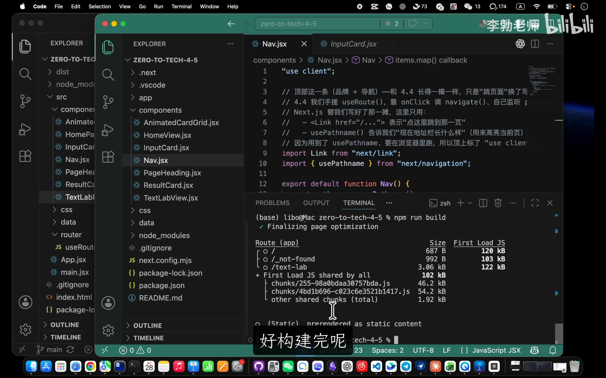

深入查看 `.next/server/app/` 产物目录，可以看到磁盘上真真切切地生成了物理静态文件：
- `index.html`（对应首页）
- `text-lab.html`（对应 `/text-lab` 页面）
- `_not-found.html`（404 兜底页）

这直接证实了开篇设想：**深层路径不再是动态运算出来的虚幻 DOM，而是实实在在躺在服务器磁盘上的物理文件**。

### 2. 实战：老项目原地升级步骤

由于当前的业务项目记录了完整的 Git 演进历程，我们采取“保留历史提交、全量替换代码树”的重构方式：

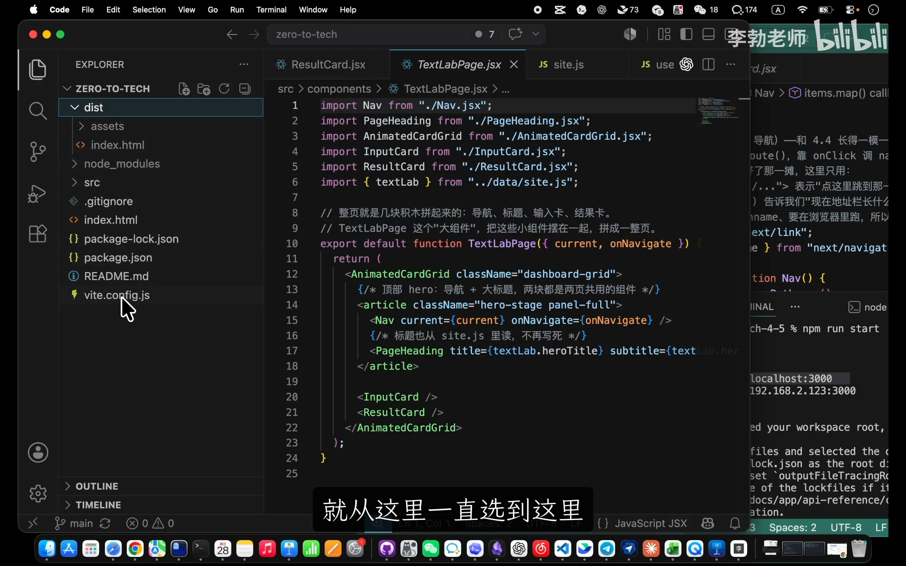

1. **备份并保护历史**：删除项目根目录下除 `.git/` 以外的所有旧代码（切勿误删 `.git/`，以完整保留分支与远程提交历史；清理 Mac 系统自动生成的 `.DS_Store`）。
2. **导入 Next.js 结构**：将新架构中的 `app/`、`components/`、`styles/`、`data/`、`package.json` 等文件拷贝至项目根目录（无需拷贝构建临时产物与 `.vscode` 装饰配置）。
3. **依赖安装与验证**：
   ```bash
   npm install
   npm run dev
   ```
4. **Git 归档提交**：
   ```bash
   git add .
   git commit -m "项目从React升级到Next.js框架"
   ```

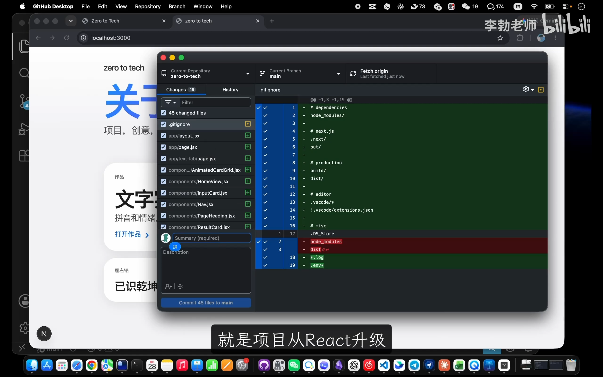

---

## 补充：快速起步与 Tailwind CSS 前瞻
*(参考时间: 32:07)*

在未来从零创建全新的 Next.js 项目时，无需手动搭建目录，推荐使用官方 CLI 工具：

```bash
npx create-next-app@latest my-next-app
```

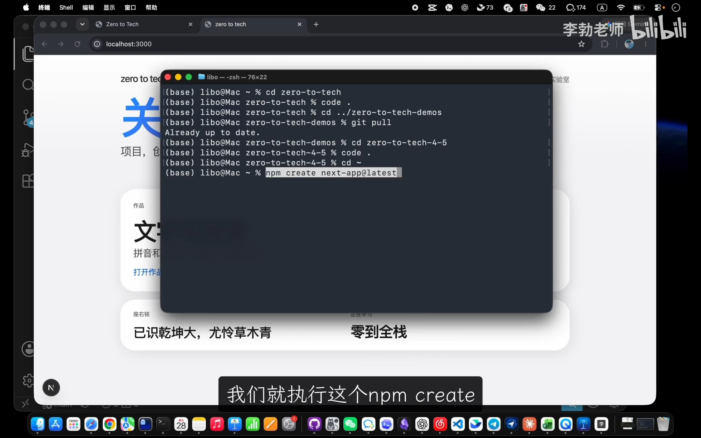

在交互式选项中，推荐遵循官方默认配置：
- **TypeScript**：类型系统保障代码健壮性。
- **Tailwind CSS**：现代前端最流行的实用类样式库（Utility-First CSS），通过在 HTML 类名中拼装原子化样式，特别适合由 AI 大模型自动生成和维护页面样式。

---

## 本章核心要点总结
*(参考时间: 33:53)*

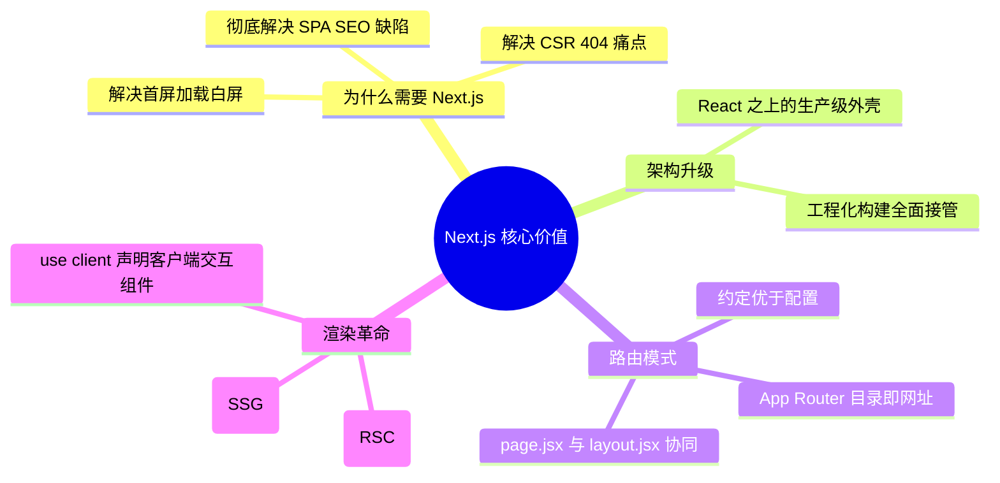
```mermaid
mindmap
  root((Next.js 核心价值))
    为什么需要 Next.js
      解决 CSR 404 痛点
      解决首屏加载白屏
      彻底解决 SPA SEO 缺陷
    架构升级
      React 之上的生产级外壳
      工程化构建全面接管
    路由模式
      App Router 目录即网址
      约定优于配置
      page.jsx 与 layout.jsx 协同
    渲染革命
      默认服务端组件 (RSC)
      构建期预渲染真实 HTML (SSG)
      use client 声明客户端交互组件
```

1. **痛点溯源**：传统 SPA 的空壳 HTML 依赖浏览器端执行 JS 绘制，导致深层 URL 404、首屏白屏慢、爬虫无法读取。
2. **架构分工**：React 专注组件开发，Next.js 负责组件之外的系统级生产任务（路由、预渲染、SEO 与构建优化）。
3. **约定路由**：`app/` 目录结构即 URL 路由映射，消除手写路由逻辑。
4. **双组件模型**：静态展示走服务端组件（RSC，预渲染生成 HTML），动态响应走客户端组件（`'use client'`）。

在下一章节中，我们将探索 Next.js 项目的两种核心部署形态：是将其打包为纯静态 HTML 托管于 Nginx，还是借助 Node.js 服务端容器进行全功能生产部署。
