# 【零到全栈】4.6 - Next.js 项目的两种部署方式：静态导出与常驻服务

在上一节中，我们成功将 React 单页应用重构升级为 Next.js 生产级框架，并探索了基于文件系统的 App Router 路由与服务端组件（RSC）。然而，在准备将项目推向公网生产服务器时，开发者往往会面临一个核心分水岭：**Next.js 项目到底该如何部署上线？**

上一节结尾留下的一个细节是：`next build` 生成的 `.next/` 目录结构十分庞杂，无法像过去 Vite 打包生成的 `dist/` 一样直接扔给 Nginx。

本章将系统对比 Next.js 的两种主流上线形态——**常驻 Node.js 动态服务（方案 A）** 与 **纯静态导出（方案 B）**，并带大家在真实 Ubuntu 服务器上实操静态导出（`output: 'export'`）、配置 Nginx 的 URL 重写规则（`try_files $uri.html`），最后深入探讨为什么在 AI 全栈开发中，“静态前端 + 独立后端 API”是比“Next.js 单体全栈”更可靠、更经典的架构方案。

---

## 为什么 .next 目录不能直接交给 Nginx
*(参考时间: 01:29)*

执行 `npm run build` 后，观察根目录下生成的 `.next/` 目录：

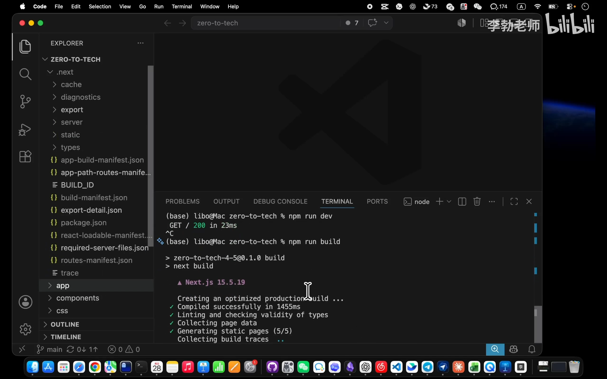

打开该目录会发现，虽然在 `.next/server/app/` 下确实存在 `index.html` 与 `text-lab.html`，但整个目录结构极其凌乱：
- 静态 CSS 与客户端 JS 散落于各级哈希子目录中，并非标准 Web 根目录规范。
- 包含了大量的运行时配置文件、路由清单（manifests）以及专供 Node.js 服务端加载的模块。

这是因为：**默认的 `.next` 产物根本不是一个现成的静态网站，而是供 `next start` 常驻服务消费的“运行时半成品”**。

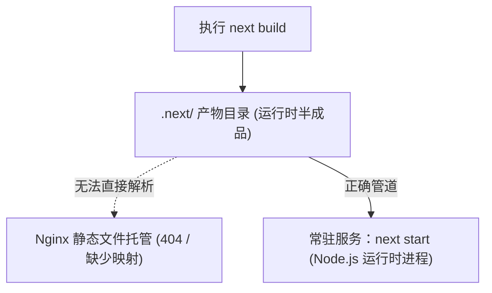

---

## 方案对比：常驻服务 (A) vs 静态导出 (B)
*(参考时间: 04:42)*

面对 Next.js 项目上线，工程上有两条明确的分支路线：

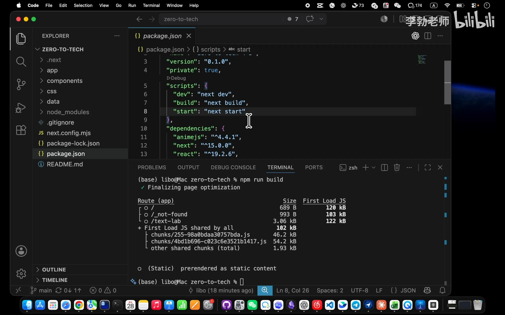

### 1. 方案 A：常驻 Node.js 服务（SSR 动态模式）

- **工作方式**：在服务器后台运行 `next start`（通常由 PM2 或 Docker 守护），7×24 小时常驻一个 Node.js 进程。
- **执行流程**：每个用户 HTTP 请求抵达服务器时，由常驻的 Node 进程根据用户身份、Cookie 或动态参数，**在服务端现场即时拼装渲染出定制化的 HTML** 并返回。

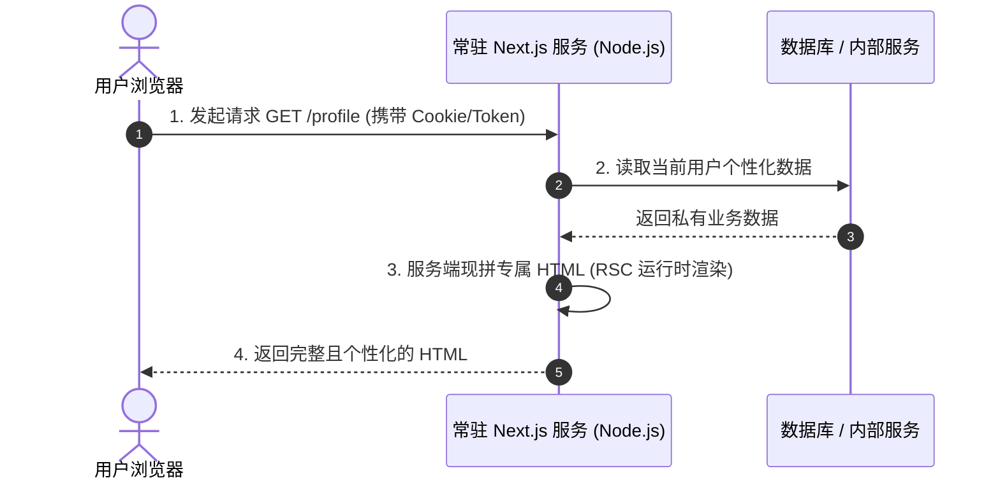

- **核心优势**：极致的灵活性，页面内容完全按请求动态计算，且能保障 SEO。
- **代价与短板**：
  - 必须维护一个常驻 Node 进程，占用 CPU 与内存开销较重。
  - 需要考虑 Node.js 进程崩溃重启、内存泄漏及容器运维成本。

---

### 2. 方案 B：纯静态导出（Static Export 模式）

- **工作方式**：在 `next.config.mjs` 中声明 `output: 'export'`。构建时，Next.js 会把每一个页面提前完整渲染成独立的静态 HTML 文件，连同 CSS/JS 打包入干净的 `out/` 目录。
- **执行流程**：服务器上无需安装 Node.js 运行时或启动常驻进程，直接由高性能的 Nginx 反向代理或静态服务器读取并分发文件。

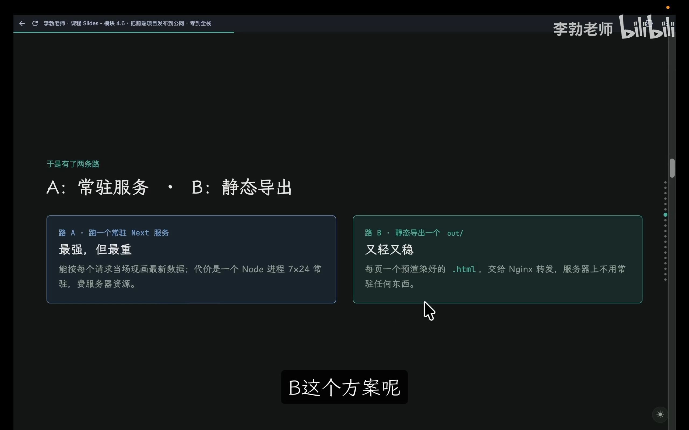

| 维度对比 | 方案 A：常驻 Node.js 服务 | 方案 B：静态导出 (output: 'export') |
|:---|:---|:---|
| **服务器端运行进程** | 常驻 Node.js 服务 (`next start`) | **仅需 Nginx**（无需常驻后端服务） |
| **页面生成时机** | 用户每次请求时**即时渲染** (SSR) | **编译构建时提前渲染** (SSG) |
| **服务器资源占用** | 较高（消耗内存与算力） | **极低**（纯静态文件 I/O，抗高并发） |
| **动态内容处理方式** | 服务端现场拼装直接输出 | 前端静态页面秒开 + 浏览器异步调用 API |
| **适用场景** | 电商大促、个性化流媒体、高频变动强 SEO 站点 | **企业官网、个人博客、文档站、前后端分离 Web 应用** |

---

### 3. 动态数据在静态架构下的破局：“静态前端 + 后端 API”

许多开发者误以为“选了静态导出就无法做动态业务（如登录、情感分析、打分）”。事实上，绝大多数动态业务场景均采用 **“静态前端骨架秒开 + 客户端向后端 API 异步索取数据”** 的经典模式：

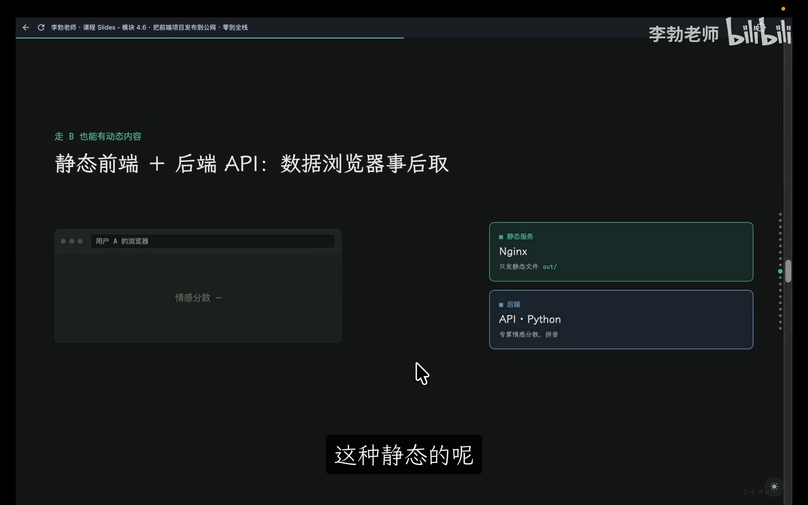

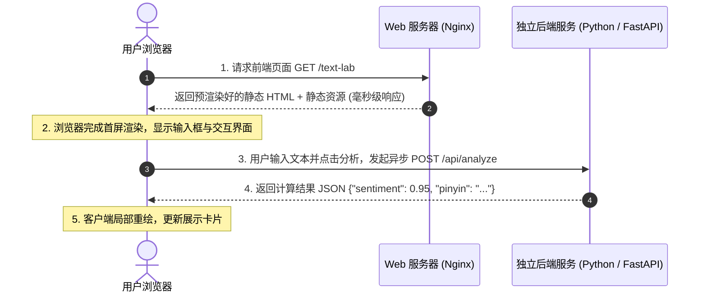

对于本课程的 `zero-to-tech` 项目，选用 **方案 B（静态导出）** 是最优解：架构极轻、极致稳定，且与下一阶段引入的 Python 后端 API 完美契合。

---

## 静态导出配置与构建验证
*(参考时间: 11:39)*

### 1. 修改 next.config.mjs

在项目根目录下打开配置文件 `next.config.mjs`，添加 `output: 'export'` 声明：

```javascript
/** @type {import('next').NextConfig} */
const nextConfig = {
  output: 'export', // 声明静态导出模式
};

export default nextConfig;
```

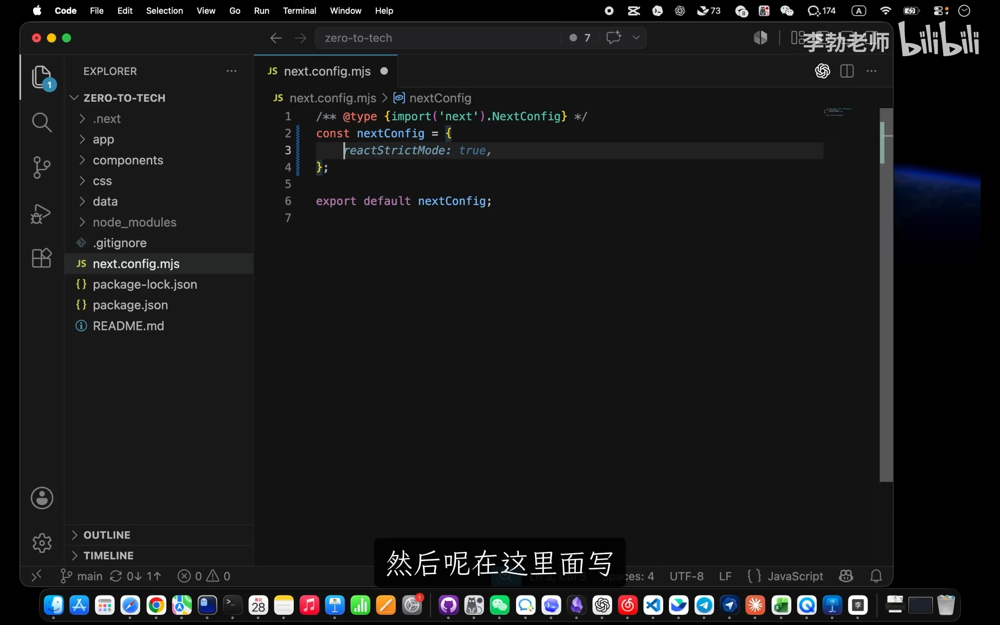

该配置明确告知 Next.js：放弃构建专供 `next start` 消费的半成品，在编译期将全站页面预渲染为纯静态文件，并统一收纳到 `out/` 文件夹中。

### 2. 本地构建与产物审查

执行构建命令：
```bash
npm run build
```

构建完成后，根目录下生成了一个纯净的 `out/` 目录：

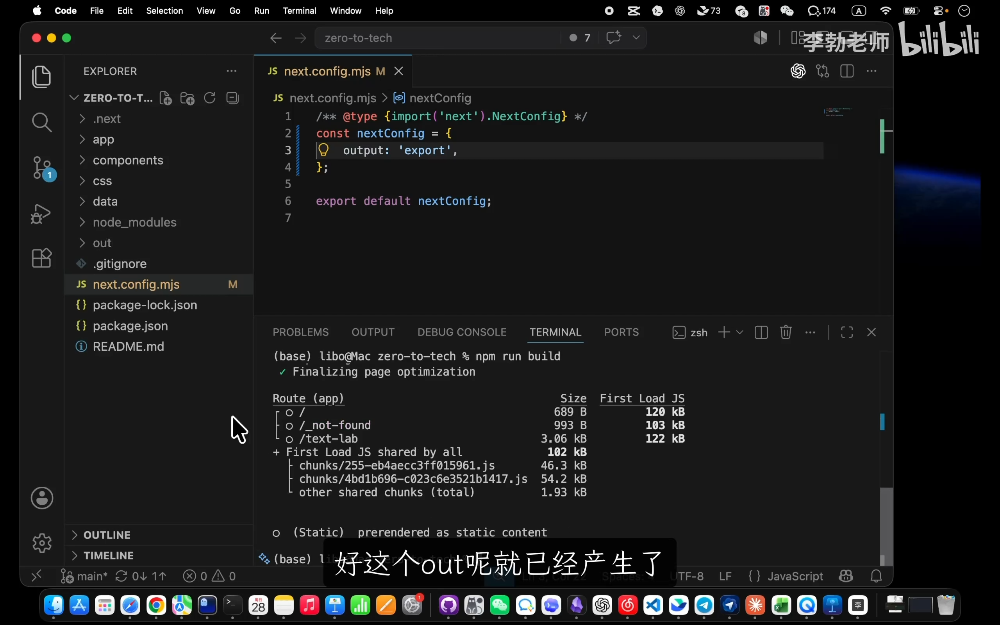

```
out/
├── _next/
│   └── static/           # 打包压缩后的 CSS 与 JS 静态资源
├── index.html            # 首页静态 HTML
├── text-lab.html         # /text-lab 静态 HTML
├── 404.html              # 静态 404 兜底页
└── favicon.ico
```

> [!TIP]
> `out/` 目录属于本地构建产物，已在 `.gitignore` 中被忽略，切勿将其提交入 Git 仓库。生产部署时，应在云服务器端拉取源码后现场执行 `npm run build` 生成 `out/`。

---

## 服务器部署与 Nginx 规则重写
*(参考时间: 14:07)*

### 1. 提交配置并推送到云端

在本地完成 Git 提交并推送至 GitHub：
```bash
git add next.config.mjs
git commit -m "支持静态构建"
git push origin main
```

SSH 登录远程 Ubuntu 云主机，进入项目目录执行更新与构建：

```bash
cd /home/ubuntu/zero-to-tech
git pull origin main
npm install
npm run build
```

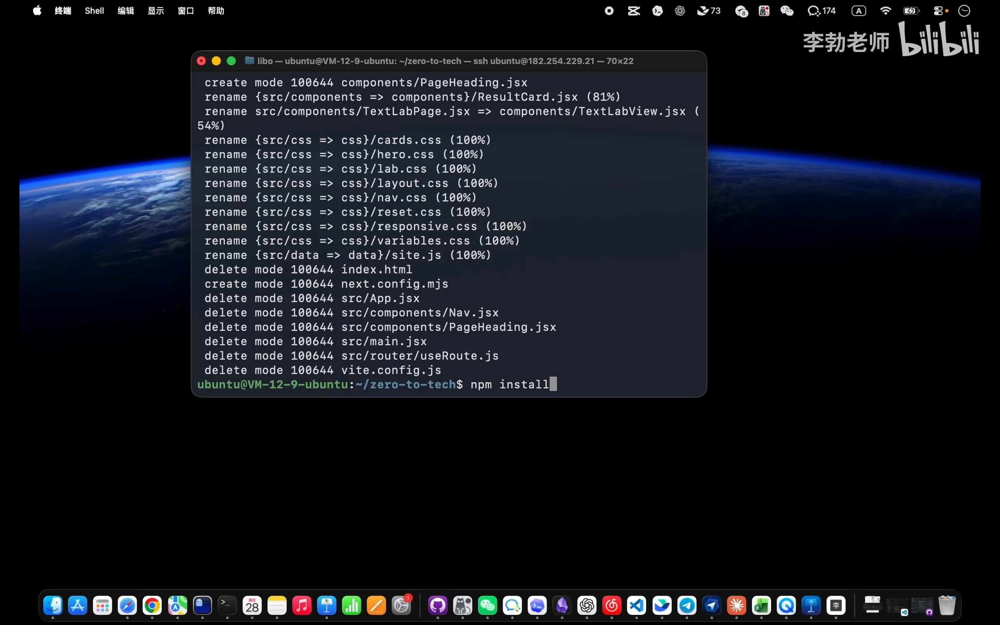

确认服务器磁盘上已成功生成 `/var/www/zero-to-tech/out` 静态产物目录。

---

### 2. 配置 Nginx：优雅支持 Clean URLs（$uri.html）

在旧版配置中，Nginx 指向的是 Vite 生成的 `dist/`，且未能识别无扩展名的路由。我们编辑 Nginx 站点配置：

```bash
sudo vim /etc/nginx/sites-available/default
```

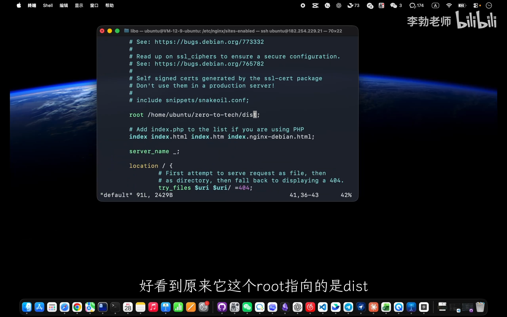

核心修改如下：

```nginx
server {
    listen 80;
    server_name _;

    # 1. 将根目录重定向至 Next.js 静态导出的 out 目录
    root /home/ubuntu/zero-to-tech/out;
    index index.html;

    location / {
        # 2. 核心路由回退匹配规则
        try_files $uri $uri.html $uri/ /index.html;
    }
}
```

#### 关键技术点拆解：`$uri.html` 的作用
- 当用户在浏览器输入 `http://your-server-ip/text-lab` 时，$uri 的值即为 `/text-lab`。
- 磁盘上的 `out/` 目录下并没有名为 `text-lab` 的无后缀文件或文件夹，只有 `text-lab.html`。
- 如果规则仅写 `try_files $uri $uri/`，Nginx 就会判定文件不存在而触发 404。
- 增加 `$uri.html` 匹配项后，Nginx 会自动在磁盘寻找 `text-lab.html`，成功读取并返回给用户，同时地址栏仍保持优雅的无后缀展示（Clean URL）。

### 3. 配置检验与平滑重载

保存配置后，执行语法测试并重载服务：

```bash
sudo nginx -t
sudo systemctl reload nginx
```

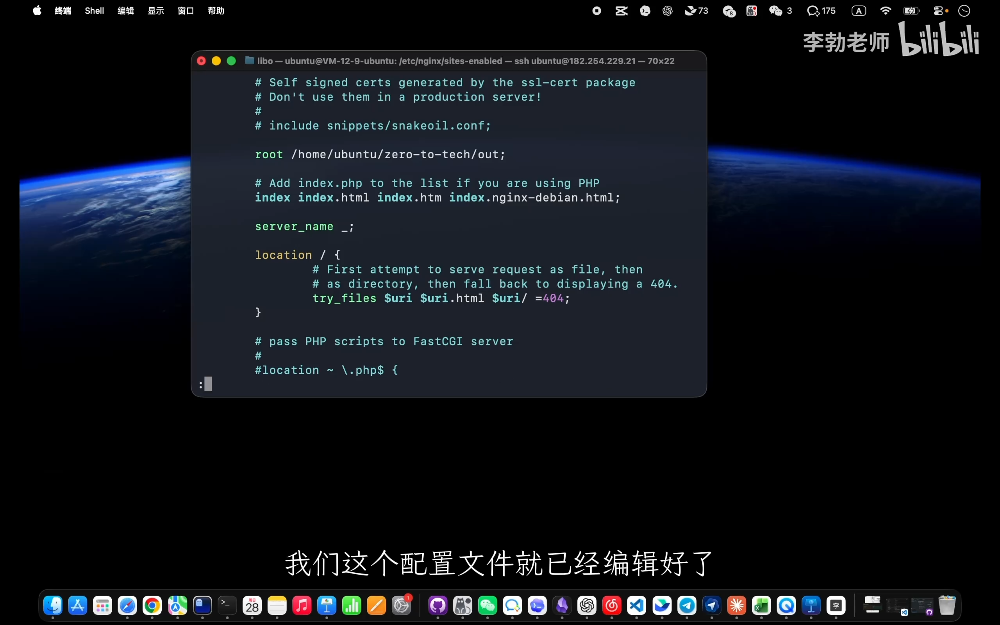

### 4. 浏览器验证与抓包检验

在浏览器中直接输入 `http://your-server-ip/text-lab` 刷新访问：
1. **页面正常呈现**：404 彻底消除，直达目标页面。
2. **首屏内容即时可见**：打开开发者工具 Network 面板，查看第一个 `text-lab` HTML 请求的响应体，完整且结构化的 HTML 内容已包含在内，无需等待 JavaScript 客户端二次运算。

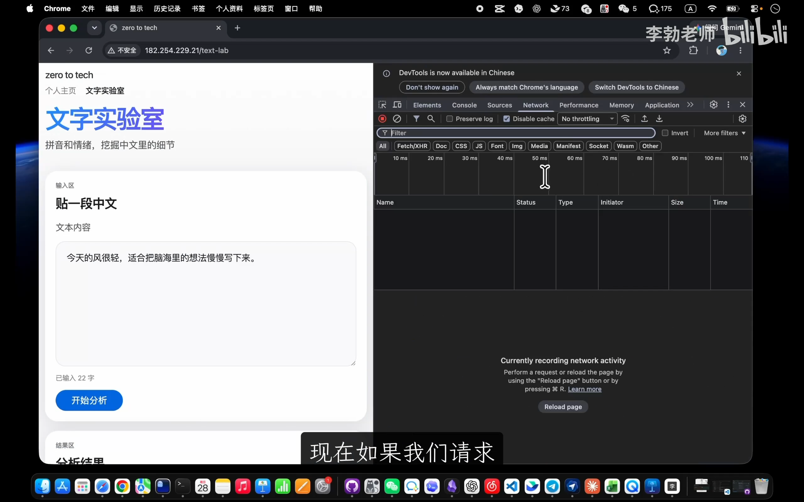

---

## 架构深思：为什么不做“Next.js 单体全栈”
*(参考时间: 21:54)*

随着 Next.js 的演进，社区开始大量推崇“Next.js 单体全栈”——即在同一个 Next 项目中，利用 Route Handlers 和 Server Actions 直接连接数据库与编写业务逻辑。

然而在工业界与本课程体系中，我们坚决选择 **“静态前端 + 独立后端 API”** 的解耦路线：

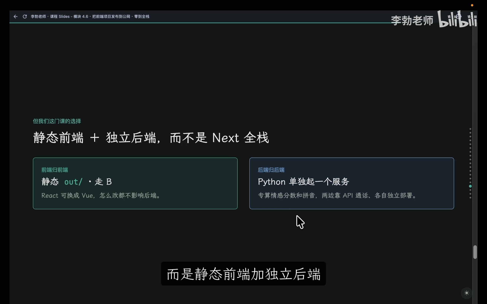

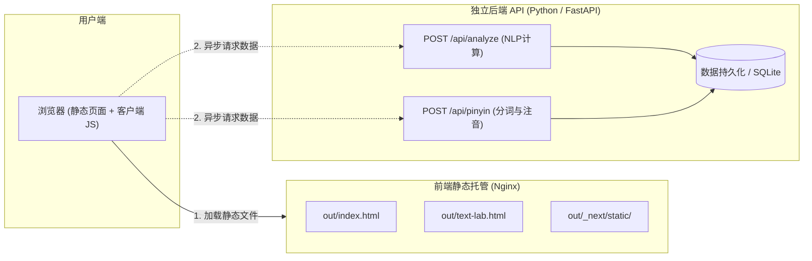

### 坚持前后端分离的三大考量：

1. **工程思维与心智模型的解耦**：
   - 将前后端杂糅在单体代码库中，极易模糊“客户端”与“服务端”的边界。对于全栈学习者而言，清晰划分两者的角色定位（前端负责交互表现与体验，后端负责业务校验与核心算力）是建立工程化素养的基石。
2. **算法与数据生态的匹配（Python 优势）**：
   - 现代 AI 应用核心在于文本分析、向量计算、模型调用与自然语言处理。Python 拥有成熟稳固的生态圈（FastAPI、jieba、PyTorch、Pandas），在计算与数据服务层面的效能与开发体验远超 Node.js。
3. **架构安全性与稳定性防御**：
   - 复杂的服务端动态拼装（RSC 动态运行机制）存在较大的攻击面。例如 Next.js 历史上曾爆发过无需认证的严重远程代码执行漏洞（RCE，攻击者仅凭特制 HTTP 请求即可控制服务器并植入勒索脚本）。
   - 相比之下，静态前端文件托管在 Nginx 之后，天然不存在服务端动态执行攻击面；后端 API 独立设防、按需扩容，系统的稳健性与容灾能力呈数量级提升。

---

## 模块四（现代前端）全景回顾
*(参考时间: 25:02)*

至此，课程的 **【模块四：现代前端】** 圆满落幕。我们经历了前端工业化完整的技术螺旋：

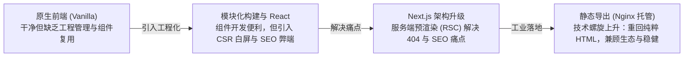

- **技术没有最优，只有最合适**：
  - 构建复杂企业级应用、需要依托庞大生态时，成熟框架是第一选择；
  - 制作一次性展示看板、课件演示文稿时，原生 HTML 轻便优雅、零环境依赖。

在接下来的 **【模块五：后端开发】** 中，我们将正式开启服务端之旅——从手搓一个最原始的 HTTP 服务开始，深入探究 API 的本质、掌握 Python 与 FastAPI 开发，打通前后端联调的完整闭环！
