# 【零到全栈】5.1 - 什么是 API：从零调用到揭秘 AI 时代的通用接口

“究竟什么是 API？”无论是刚接触编程的新手，还是希望使用大模型构建应用的开发者，几乎都会遇到这个核心概念。很多人喜欢用“餐馆服务员与后厨”打比方，但抽象的比喻往往让人听完更加迷糊。

理解 API 最快、最透彻的方式只有一个：**亲手调用一个真实的 API**。

本章作为课程【模块五：后端开发】的正式开篇，不讲枯燥的空洞理论，我们将通过终端工具 `curl` 亲手跑通两个真实的生产级 API——从零门槛的匿名公共网络接口，到需要身份鉴权的 DeepSeek 大语言模型接口。我们将彻底拆解 API 的请求与响应机制，解密 AI Agent 工具调用的底层真相，并为接下来亲手开发自研后端 API 奠定扎实的心智模型。

---

## 为什么后端的第一课必须是 API
*(参考时间: 01:14)*

在此前完成的【模块四：现代前端】中，我们将 `zero-to-tech` 项目部署上线。然而，当我们切换到“文字实验室”页面时，会发现一个关键问题：

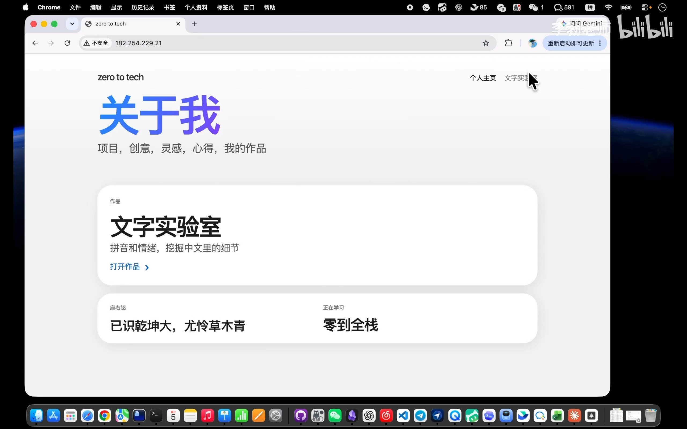

- 点击页面上的“开始分析”按钮毫无反应；
- 界面上的“拼音标注”与“情感倾向分数”全是在前端写死的假数据。

要让网页真正具备自然语言处理与文字计算能力，必须在服务器端运行一个具备计算逻辑的后端程序。而**前端与后端之间对话、传递数据的通用语言，正是 API**。

无论是在地图导航、天气预报、物流查询，还是在当今爆火的大语言模型、AI Agent 智能体以及跨端应用开发中，API 都是整个软件世界的底层血脉。

---

## 实战一：零门槛调用匿名公共 API（ipify）
*(参考时间: 03:04)*

我们首先调用一个完全免费、无需注册账号、无需申请 Key 的轻量级公共接口——**ipify**（`api.ipify.org`）。它只做一件事：查询当前调用者所处的公网 IP 地址。

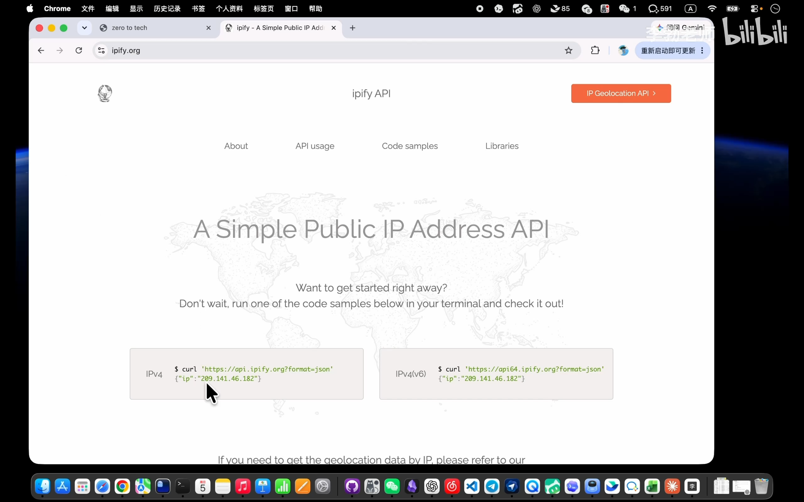

### 1. 认识终端网络利器：curl

平时我们习惯使用浏览器访问网址，但在服务端或自动化程序中，我们需要在终端中发起网络请求。`curl` 是一个功能强大的命令行网络工具，能够向指定 URL 发起请求并将服务器的响应结果原样打印在控制台中。macOS、Linux 以及现代 Windows 均已原生内置该命令。

在终端中执行以下命令（当 URL 中包含 `?` 等参数定界符时，用双引号包裹网址可避免 Shell 解析异常）：

```bash
curl "https://api.ipify.org?format=json"
```

终端瞬间返回了一小段紧凑的 JSON 数据：
```json
{"ip":"182.254.229.21"}
```

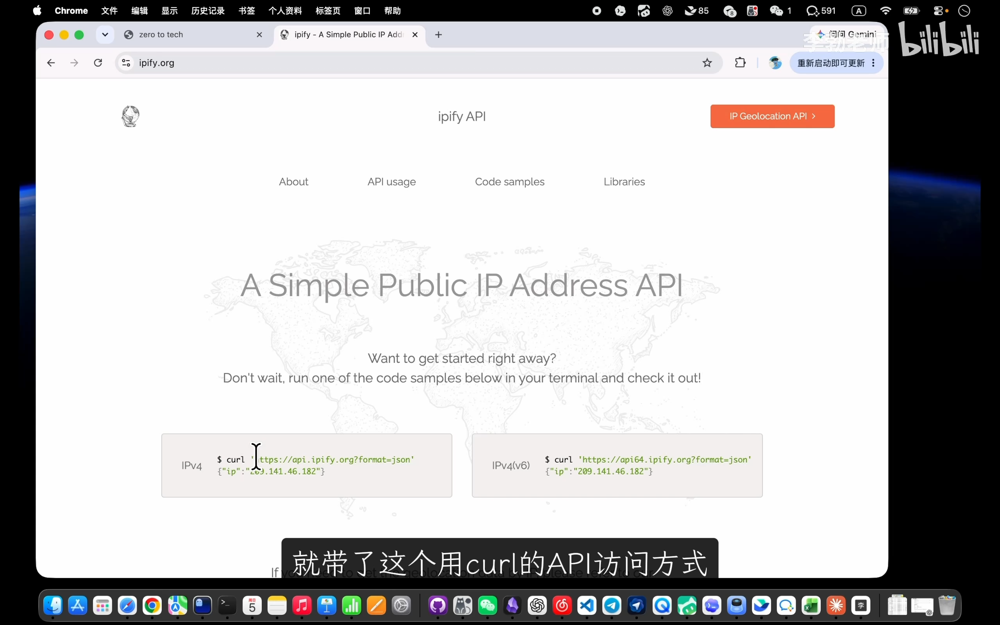

### 2. 验证：浏览器与 API 的本质相通

我们将这串相同的 URL 粘贴至 Chrome 或 Edge 的地址栏并回车：

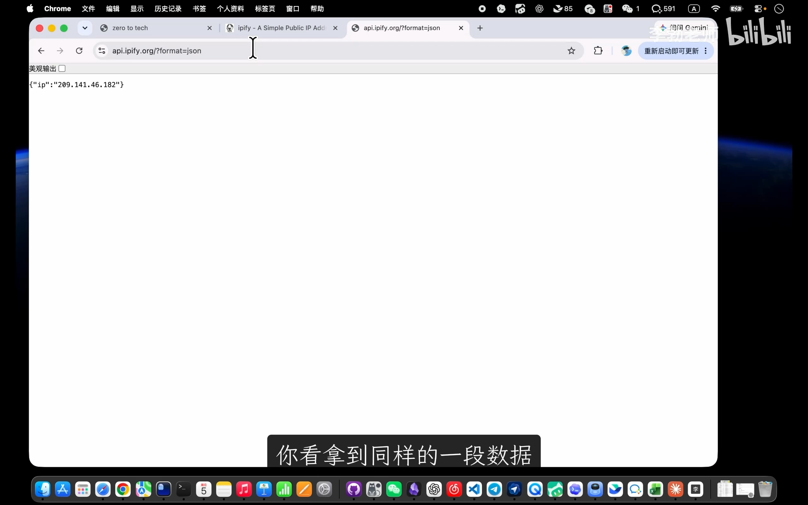

页面中呈现出完全一致的 JSON 文本。这印证了一个底层事实：**浏览器在地址栏输入网址打开页面的底层动作，本质上也是向服务器发起网络 HTTP 请求并接收响应**。

这种无需提供任何身份凭证、直接请求即可获取公共数据的调用方式，被称为**匿名调用（Anonymous Call）**。

---

## 实战二：调用大模型 API（DeepSeek）与鉴权机制
*(参考时间: 06:22)*

掌握了基础调用后，我们进一步挑战具有商业级鉴权机制的生产级接口——直接通过终端向 **DeepSeek** 大模型发起对话请求。

### 1. 为什么大模型 API 需要 API Key

与公共查询不同，大模型推理消耗巨额算力，且需要按 token 计量计费并防止滥用，因此服务端必须核实请求发起者的身份。

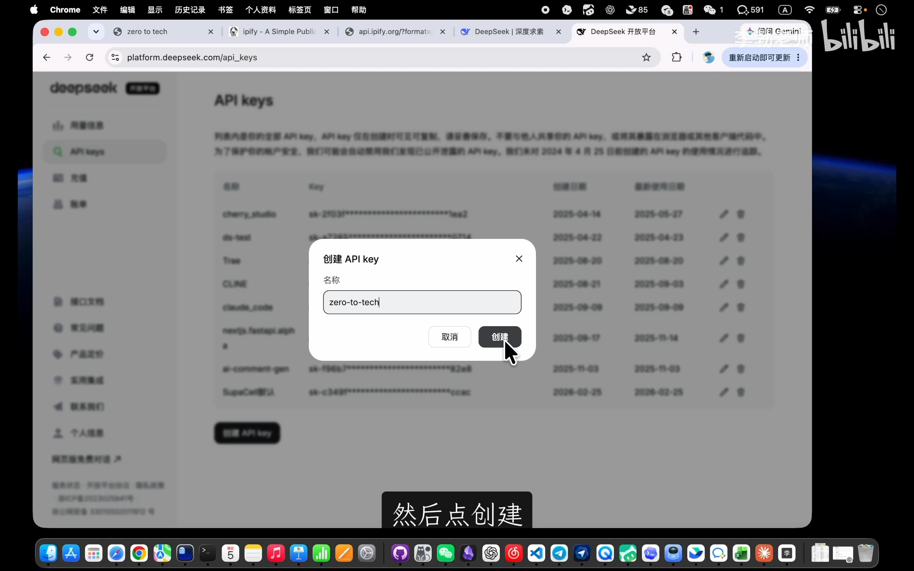

1. 登录 DeepSeek 开放平台，进入“API keys”管理界面；
2. 创建专属密钥，生成一串以 `sk-` 开头的令牌字符串（API Key）；
3. **安全警示**：API Key 相当于访问账户与余额的“数字钥匙”，生成后务必妥善保管，严禁推送到公开 Git 仓库或泄漏给他人。

### 2. 发起携带身份凭证的 POST 请求

查阅 DeepSeek 官方接口文档，获取对话接口的 `curl` 规范调用命令：

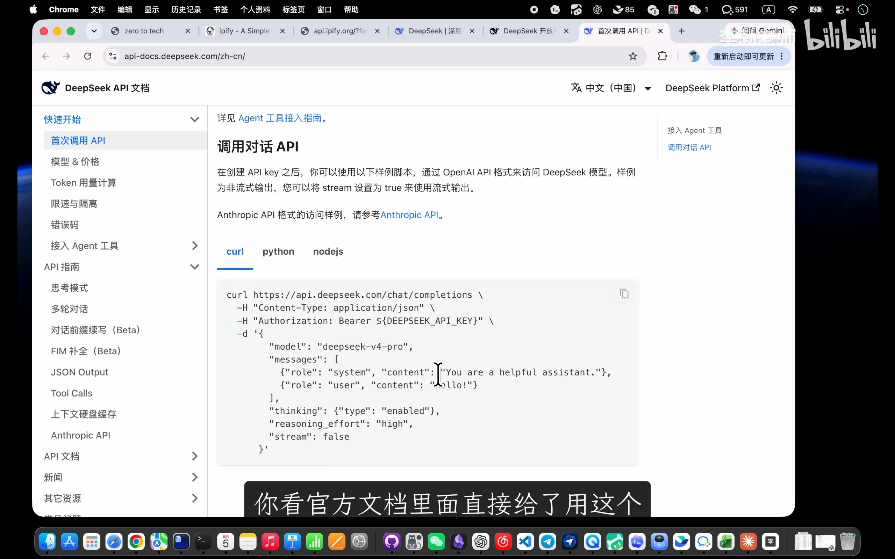

我们将身份 Key 注入请求头，并在请求体内提交问候内容：

```bash
curl https://api.deepseek.com/chat/completions \
  -H "Content-Type: application/json" \
  -H "Authorization: Bearer sk-YOUR_API_KEY" \
  -d '{
        "model": "deepseek-v4-pro",
        "messages": [
          {"role": "system", "content": "You are a helpful assistant."},
          {"role": "user", "content": "你好，请用一句话介绍下你自己！"}
        ],
        "thinking": {"type": "enabled"},
        "reasoning_effort": "high",
        "stream": false
      }'
```

执行后，终端成功返回大模型运算后的完整 JSON 数据：

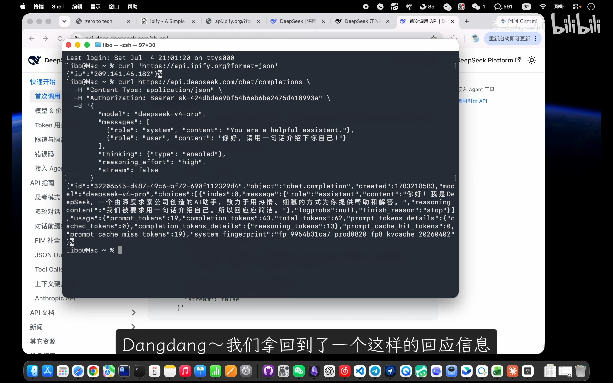

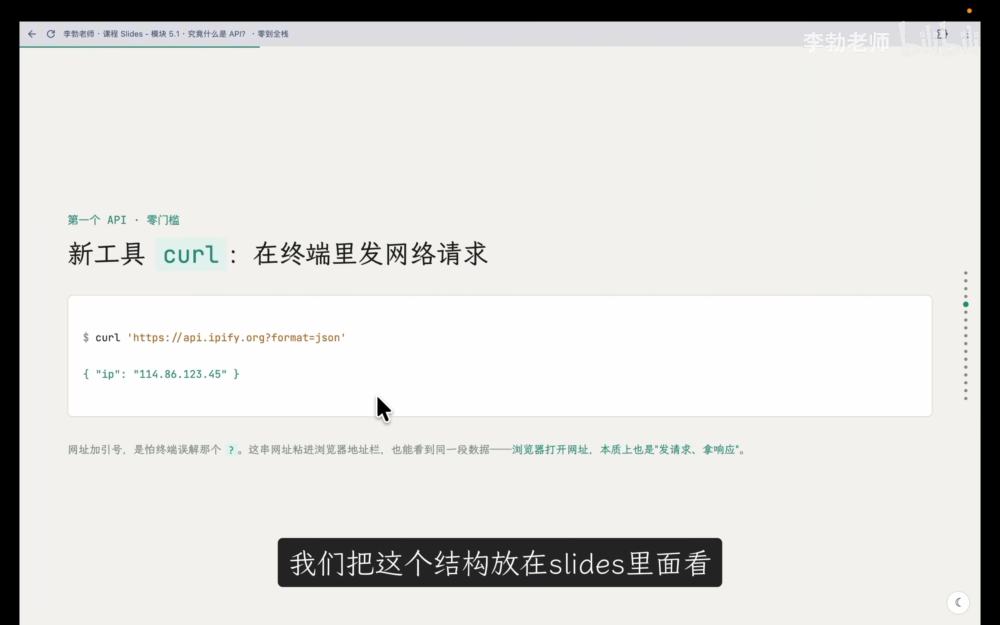

在返回的 JSON 结构中，核心回复文本清晰地嵌套在 `choices[0].message.content` 路径下：
> *“你好！我是 DeepSeek，一个由深度求索公司创造的 AI 助手，致力于用热情、细腻的方式为你提供帮助和解答。”*

我们没有打开任何网页聊天框，仅在终端控制台发送了一段标准的网络请求，就调动了远端数据中心的大模型算力完成推理！

---

## API 的核心本质与通用交互范式
*(参考时间: 12:29)*

通过上述两次真实调用，我们可以沉淀出 API 的核心本质：

> **API（Application Programming Interface，应用程序编程接口）** 是计算机程序之间相互通信的通道。它把内部复杂的计算与数据逻辑封装成一个**公开、固定、标准化**的入口，使其他程序能够无需理解内部实现细节，直接按规范索取其能力。

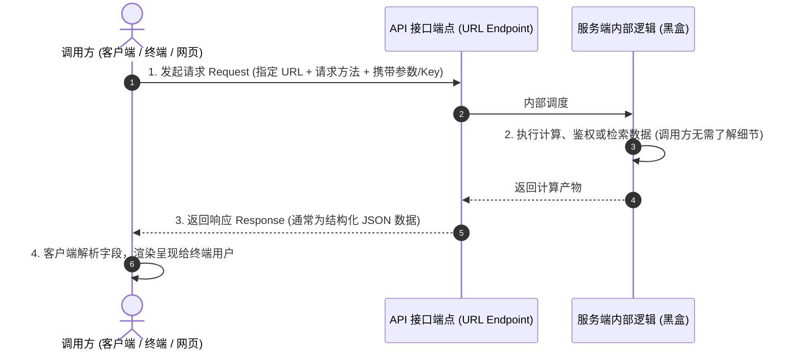

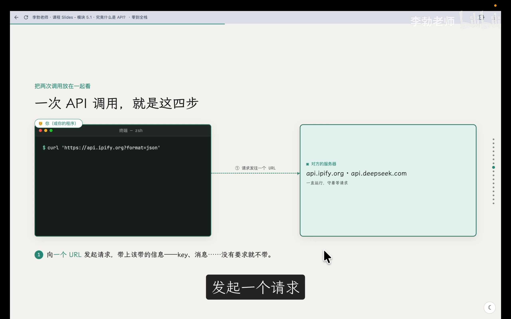

### API 的两大经典请求方法

在 HTTP 协议下，最常用的两种交互动词是：
1. **GET（向服务端“索取”数据）**：
   - 如调用 ipify 查询当前 IP。参数通常紧跟在 URL 查询字符串中，请求本身不附带复杂的包体数据。
2. **POST（向服务端“提交”数据）**：
   - 如调用 DeepSeek 进行对话。请求必须将待处理的大段文本或参数打包在请求体（Body）中提交给服务器处理。

### 语言与平台解耦的工业标准

API 最具价值的特性在于**语言与技术栈无关性**：
- 调用方完全无需关心 DeepSeek 的后端是用 Python、C++ 还是 Go 编写的；
- DeepSeek 的服务端也毫不在意客户端来自 Mac 终端的 `curl`、浏览器前端的 JavaScript，还是手机 App 中的 Swift/Kotlin。
- **只要遵循统一的 HTTP 协议与 JSON 数据格式，异构系统之间即可无缝协作**。

---

## 破除神秘感：AI Agent 与 MCP 的底层真相
*(参考时间: 16:15)*

理解了 API，就能顺势揭开如今各种大热的 **AI Agent（智能体）** 与 **MCP（Model Context Protocol）** 的神秘外衣：

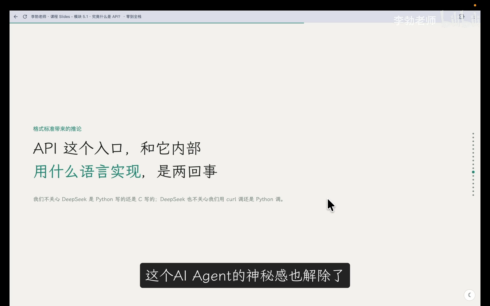

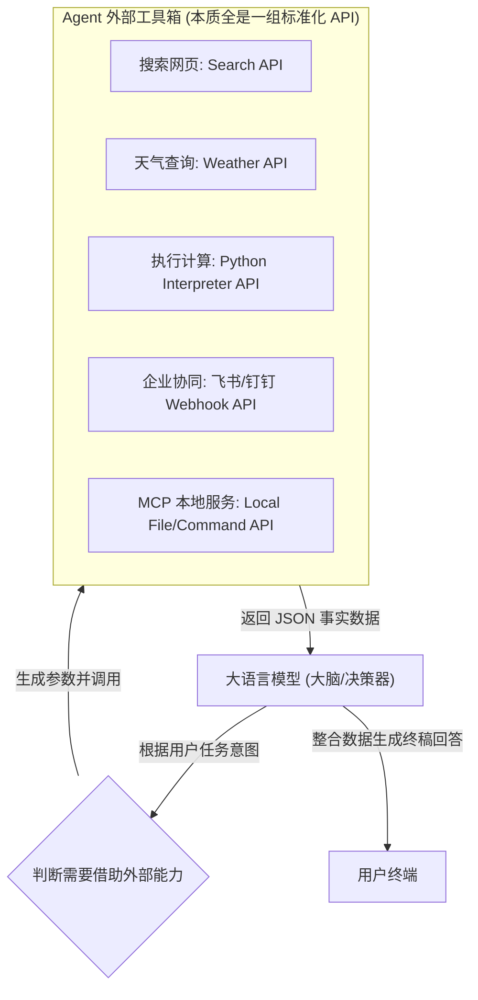

AI 智能体之所以看似“无所不能”，并非大语言模型本身无所不知，而是它具备了**工具调用（Function / Tool Calling）**的能力。其所谓“上网搜资料”、“查航班”、“收发消息”，底层全是在**不知疲倦地自动调用各种现成的外部 API**。

---

## 全栈项目演进：为文字实验室自研后端 API
*(参考时间: 18:43)*

回到我们的全栈项目 `zero-to-tech`，目前项目只有用户端能见到的纯静态前端页面。前端擅长界面排版与点击动画，但缺乏重型计算、分词注音与情感评估的能力。

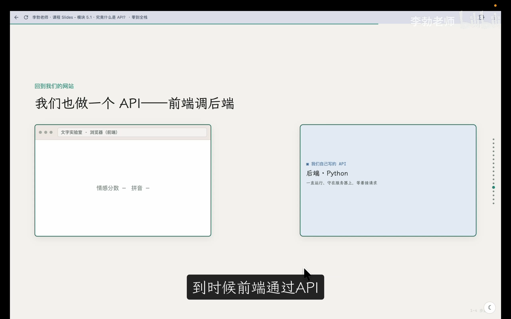

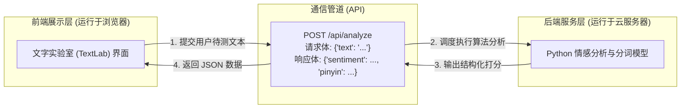

在接下来的几讲中，我们的主线任务就是：
1. **安装与配置 Python 开发环境**；
2. **用 Python 手搓最原始的 HTTP 接口，探究状态码与报文协议**；
3. **基于 FastAPI 构建现代异步 API 服务**；
4. **将前端“开始分析”按钮真正接通后端 API，完成数据联调闭环！**

---

## 本章核心要点总结
*(参考时间: 21:11)*

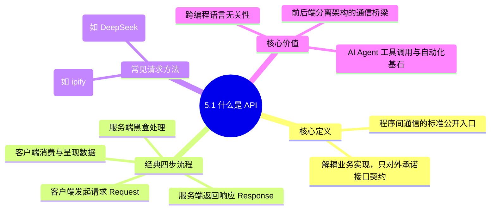

1. **接口的本质**：API 是为计算机程序量身定制的通信入口，遵循统一的数据规范（如 JSON），与底层开发语言彻底解耦。
2. **动词规范**：从服务器读取数据优先采用 `GET`，向服务器发送待加工数据优先采用 `POST`。
3. **全栈分工**：前端负责界面与用户交互体验，后端负责守护在服务器上处理复杂运算与数据存储，两者通过 API 协同共生。

在下一章节中，我们将在电脑中搭建 Python 运行环境并探索包管理机制，为亲手编写自研后端 API 做好一切准备！
