# 第 20 讲：Python 安装和环境设置（5.2）

在前面的章节中，我们完成了基于 Next.js 的全栈前端项目开发，并通过两种不同方式完成了自动化部署。从本节开始，我们的全栈探索之旅将正式跨入**后端开发**领域。

后端编程的第一步，正如前端开发需要预先安装 Node.js 运行时一样，是必须在操作系统中构建稳健、隔离、可复现的 **Python 运行时与依赖管理环境**。本节将深入剖析 Python 多版本共存原理、虚拟环境 `venv` 的底层隔离机制、与科学计算工具 Conda 的差异定位，并在我们的 `zero-to-tech` 项目中开辟 `backend/` 独立工程，完成第一个 Python 程序与第三方网络请求库的集成。

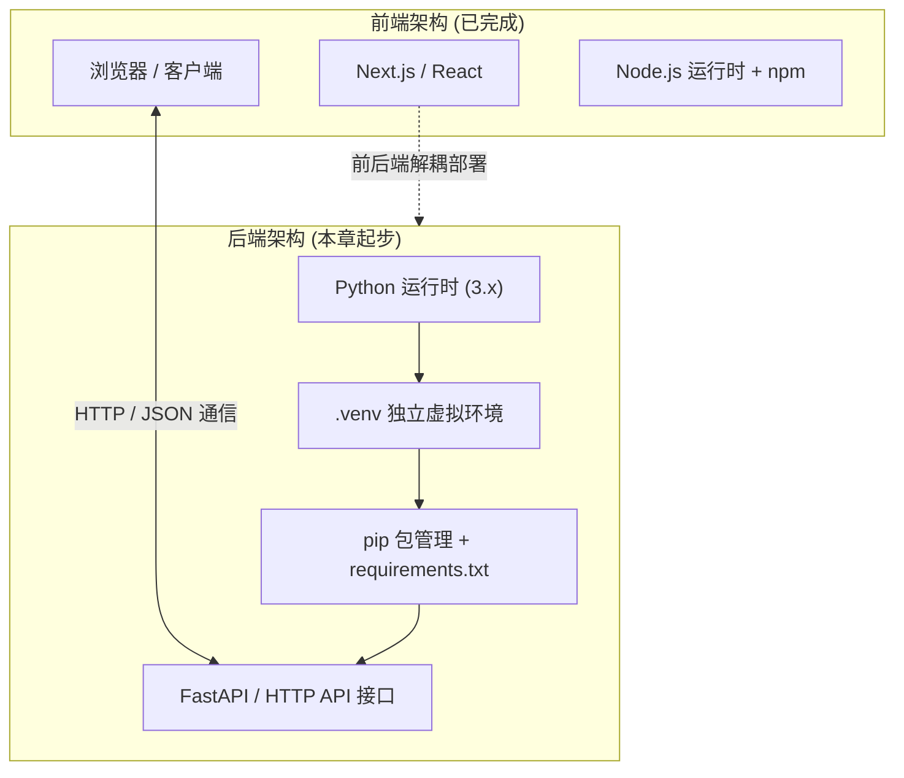
```mermaid
flowchart TD
    subgraph Frontend ["前端架构 (已完成)"]
        Browser["浏览器 / 客户端"]
        NextJS["Next.js / React"]
        NodeEnv["Node.js 运行时 + npm"]
    end

    subgraph Backend ["后端架构 (本章起步)"]
        PythonEnv["Python 运行时 (3.x)"]
        VenvIsolation[".venv 独立虚拟环境"]
        PipManager["pip 包管理 + requirements.txt"]
        ApiServices["FastAPI / HTTP API 接口"]
    end

    Browser <-->|HTTP / JSON 通信| ApiServices
    NextJS -.->|前后端解耦部署| Backend
    PythonEnv --> VenvIsolation
    VenvIsolation --> PipManager
    PipManager --> ApiServices
```

---

## 1. 从前端到后端：为什么需要 Python 运行环境？
*(参考时间: 01:10)*

在前端开发阶段，浏览器无法直接执行 TypeScript 或理解 Vite/Next.js 的打包指令，我们必须依赖 **Node.js** 作为宿主运行环境；同理，后端业务逻辑使用 Python 编写，服务器与本地操作系统必须安装 **Python 解释器**（Python Interpreter），负责将代码逐行解析执行。

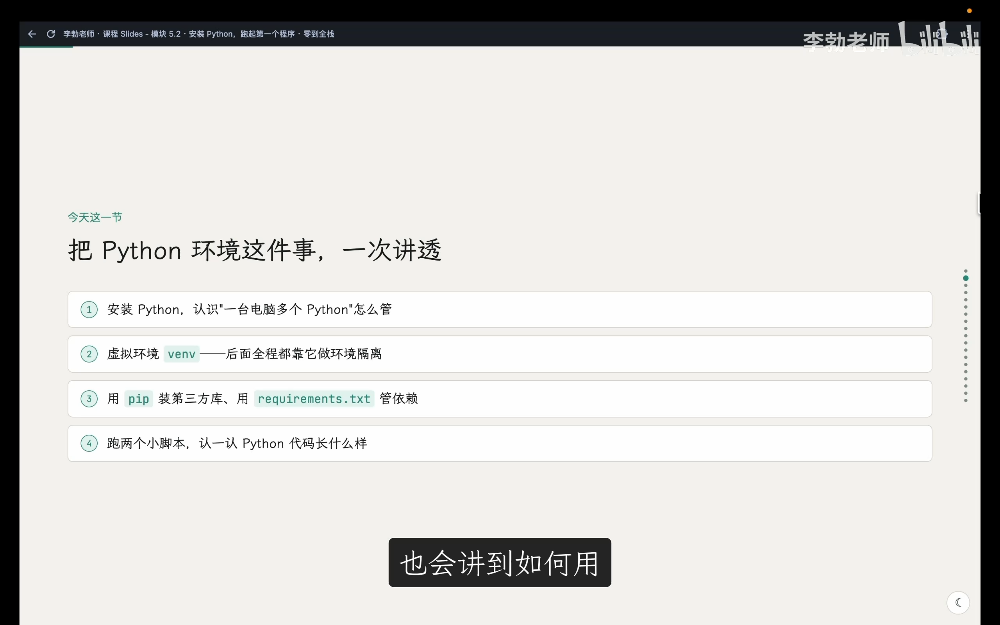

### 检查系统现存版本

在盲目下载安装器之前，应当首先在终端中探测当前系统是否已预装 Python：

* **macOS / Linux 系统**：
  ```bash
  python3 --version
  ```
* **Windows 系统**：
  ```cmd
  python --version
  # 或通过 py 启动器
  py --version
  ```

终端的返回通常有以下三种典型情况：
1. **输出 `Python 3.x.x`**：系统已就绪现代化 Python 环境。如果当前已有日常使用的版本且无破坏性需求，可直接使用；若版本较为陈旧，推荐安装最新稳定版。
2. **输出 `command not found` 或提示无法识别命令**：系统未配置环境变量或未安装 Python，需要进行全新安装。
3. **输出 `Python 2.7.x`**：必须引起高度警惕。Python 官方早在 2020 年已正式终止对 Python 2 的所有维护，全栈现代后端项目严禁使用 Python 2。

### 官方安装流程

访问 Python 官方网站下载页面，官网会自动识别当前访问操作系统并推荐适配安装包：

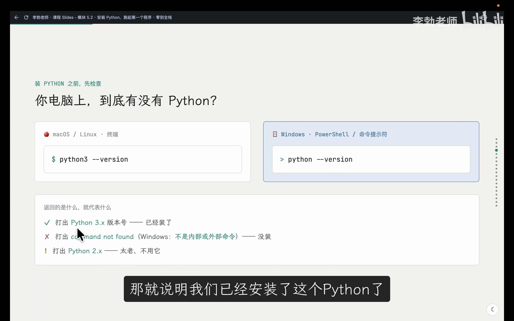

* **macOS 用户**：下载 `.pkg` 离线安装包，按照引导一路点击“继续”并同意许可协议完成安装。
* **Windows 用户**：下载 `.exe` 安装程序。**极其关键的一步**：在安装首屏务必勾选底部 **`Add python.exe to PATH`**（将 Python 添加至系统环境变量），否则在终端直接输入 `python` 将无法定位执行程序。

> [!IMPORTANT]
> 安装完成后，必须**完全关闭并重新打开终端窗口**，以使全新的系统 PATH 环境变量生效。

---

## 2. Python 版本历史与多版本共存管理
*(参考时间: 04:35)*

许多初学者常常困惑：为什么在 macOS 或 Linux 上往往要敲 `python3`，而在 Windows 或部分环境敲 `python` 也可以？这背后有一段软件工程演进的阵痛史。

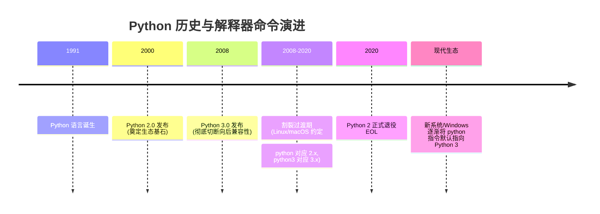
```mermaid
timeline
    title Python 历史与解释器命令演进
    1991 : Python 语言诞生
    2000 : Python 2.0 发布 (奠定生态基石)
    2008 : Python 3.0 发布 (彻底切断向后兼容性)
    2008-2020 : 割裂过渡期 (Linux/macOS 约定: python 对应 2.x, python3 对应 3.x)
    2020 : Python 2 正式退役 EOL
    现代生态 : 新系统/Windows 逐渐将 python 指令默认指向 Python 3
```

1. **Python 2 与 3 的不兼容大版本裂变**：2008 年发布的 Python 3 修复了早期语言设计层面的大量历史包袱（如 Unicode 字符串处理、print 作为函数等），但彻底不兼容 Python 2。为了保证操作系统内置脚本不崩溃，Linux 与 macOS 形成硬性约定：`python` 专用于 Python 2，而 `python3` 指向新版。
2. **现代系统的回归**：随着 Python 2 全面退役，现代 Windows 官方安装器与部分前沿 Linux 发行版已将 `python` 直接重定向至 Python 3。

### 精准定位当前的解释器路径

当单台计算机因各类软件安装了多个 Python 解释器时，敲下命令究竟由哪个二进制程序接管？我们可以通过路径追踪命令排查：

* **macOS / Linux**：
  ```bash
  which python3
  # 列出所有在 PATH 中的候选可执行程序（排在最前的为当前生效者）
  which -a python3
  ```
* **Windows CMD**：
  ```cmd
  where python
  ```
* **Windows PowerShell**：
  ```powershell
  Get-Command python
  ```

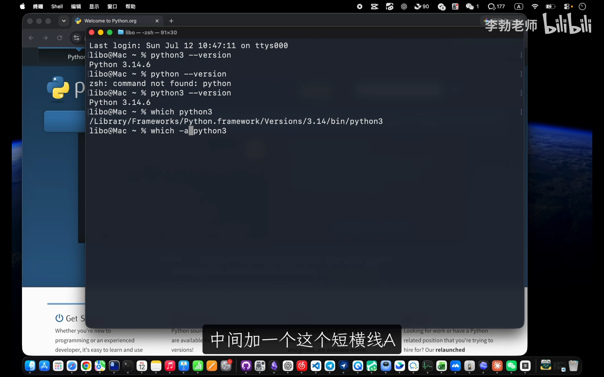

如果需要强制使用特定版本的解释器执行脚本，无需修改全局环境变量，直接使用完整二进制路径或精确版本号调用即可：
```bash
# 直接指定绝对路径执行
/Library/Frameworks/Python.framework/Versions/3.13/bin/python3 script.py

# 或是带小版本号的命令调用
python3.13 script.py
```

---

## 3. 全局安装的困境：为什么必须使用虚拟环境？
*(参考时间: 11:20)*

在前端工程中，所有依赖默认下载到项目根目录下的 `node_modules/` 中，实现了工程间的物理隔离。然而，Python 官方包管理工具 `pip` 默认的行为是将所有第三方库安装到 **Python 解释器自身的系统级或全局目录**（如 `/site-packages/`）。

这种“全局共享”模式在多项目开发时会引发严重的**依赖冲突（Dependency Hell）**：

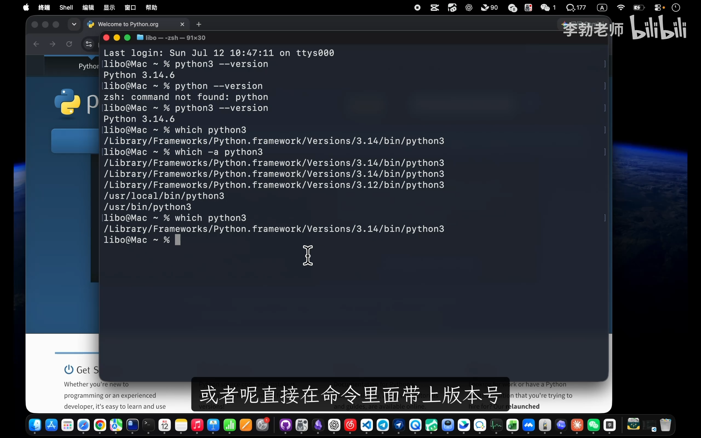

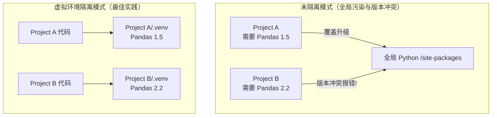
```mermaid
graph TD
    subgraph GlobalTrouble ["未隔离模式（全局污染与版本冲突）"]
        GlobalPython["全局 Python /site-packages"]
        ProjA["Project A<br/>需要 Pandas 1.5"] -->|覆盖升级| GlobalPython
        ProjB["Project B<br/>需要 Pandas 2.2"] -->|版本冲突报错!| GlobalPython
    end

    subgraph VenvIsolationMode ["虚拟环境隔离模式（最佳实践）"]
        VenvA["Project A/.venv<br/>Pandas 1.5"]
        VenvB["Project B/.venv<br/>Pandas 2.2"]
        ProjA_ISO["Project A 代码"] --> VenvA
        ProjB_ISO["Project B 代码"] --> VenvB
    end
```

如上图所示，当 Project A 依赖 `pandas 1.5`，而 Project B 依赖 `pandas 2.2` 时，全局安装会导致后安装的版本强制覆盖前者，导致依赖旧接口的项目直接运行崩溃。

解决方案与前端哲学一致：**依赖必须跟随项目走**。Python 官方自 3.3 起内置了轻量级虚拟环境工具 **`venv`**。

---

## 4. `venv` 核心机制：创建、激活与退出
*(参考时间: 14:05)*

`venv` 会在项目根目录下创建一个专属沙箱文件夹（通常命名为 `.venv`），内部包含该项目专用的 Python 二进制替身（符号链接或副本）及独立的依赖存放目录。

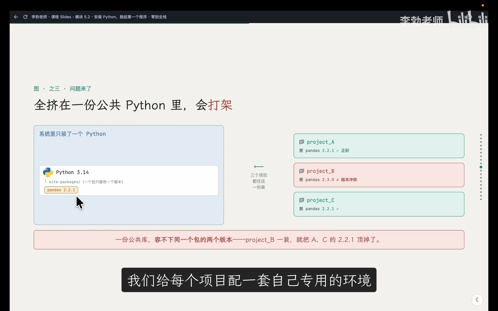

### 虚拟环境核心三板斧

| 操作阶段 | 命令语法 (macOS / Linux) | 命令语法 (Windows PowerShell) | 核心原理解析 |
| :--- | :--- | :--- | :--- |
| **1. 创建环境** | `python3 -m venv .venv` | `python -m venv .venv` | 依据当前运行的 Python 解释器在当前目录构建沙箱骨架 |
| **2. 激活环境** | `source .venv/bin/activate` | `.venv\Scripts\Activate.ps1` | 修改当前终端进程的 `$PATH` 变量，将沙箱 bin 置于最前 |
| **3. 退出环境** | `deactivate` | `deactivate` | 还原终端进程的环境变量设置，退出沙箱 |

> [!NOTE]
> 创建命令中 `python3 -m venv` 的含义是：调用 Python 解释器的 `-m`（module）参数将内置模块 `venv` 作为脚本运行。所创建虚拟环境的 Python 小版本完全取决于执行该命令时的宿主 Python 版本。

### 终端指示符与激活验证

执行激活命令后，终端提示符最前方会出现括号标记 `(.venv)`，这表明虚拟环境已完全接管当前终端会话：

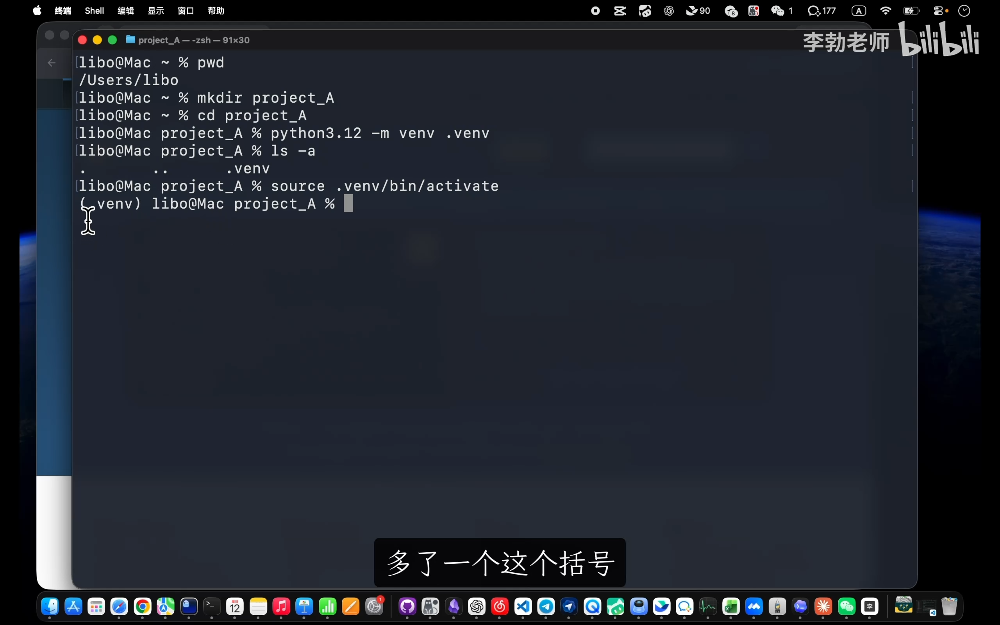

在激活状态下：
* 无论是执行 `python` 还是 `python3`，都会毫无歧义地指向 `.venv` 内部的解释器；
* 执行 `pip install` 安装的所有第三方模块均会被锁在 `.venv` 内，绝对不会污染外部系统。

### 自定义环境提示符（--prompt）

如果开发机上存在多个处于激活状态的项目，默认的 `(.venv)` 提示符无法一眼分辨当前所在工程。`venv` 提供了 `--prompt` 参数支持定制环境名：

```bash
python3 -m venv --prompt ProjectB .venv
source .venv/bin/activate
```

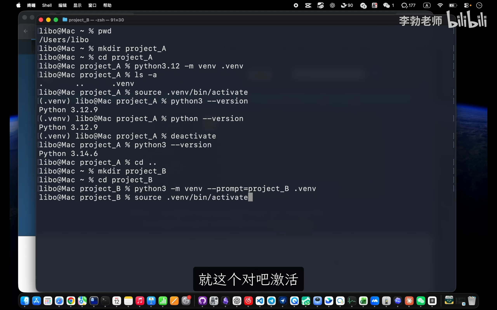

此时命令行行首会明确展示 `(ProjectB)`，而项目内的隔离文件夹依然保持规范的 `.venv` 名称。

---

## 5. Conda 用户避坑：与 venv 的选型决策
*(参考时间: 24:10)*

很多从事人工智能、数据分析的同学电脑中已经预装了 Anaconda 或 Miniconda。打开终端时，行首默认会带有一个 `(base)` 前缀。

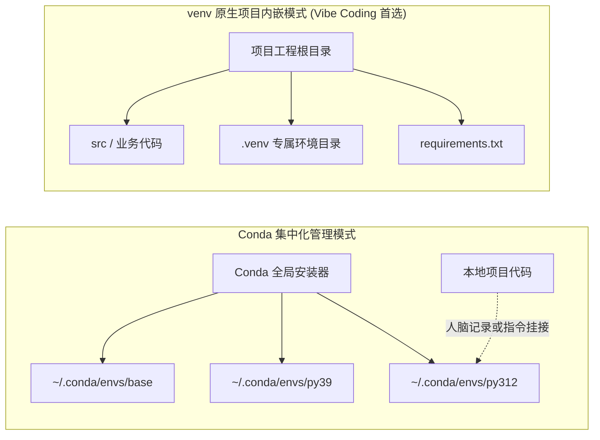
```mermaid
graph LR
    subgraph CondaMode ["Conda 集中化管理模式"]
        CondaCore["Conda 全局安装器"]
        EnvBase["~/.conda/envs/base"]
        EnvPy39["~/.conda/envs/py39"]
        EnvPy312["~/.conda/envs/py312"]
        CondaCore --> EnvBase
        CondaCore --> EnvPy39
        CondaCore --> EnvPy312
        ProjX["本地项目代码"] -.->|人脑记录或指令挂接| EnvPy312
    end

    subgraph VenvMode ["venv 原生项目内嵌模式 (Vibe Coding 首选)"]
        ProjRoot["项目工程根目录"]
        SrcCode["src / 业务代码"]
        LocalVenv[".venv 专属环境目录"]
        ReqTxt["requirements.txt"]
        ProjRoot --> SrcCode
        ProjRoot --> LocalVenv
        ProjRoot --> ReqTxt
    end
```

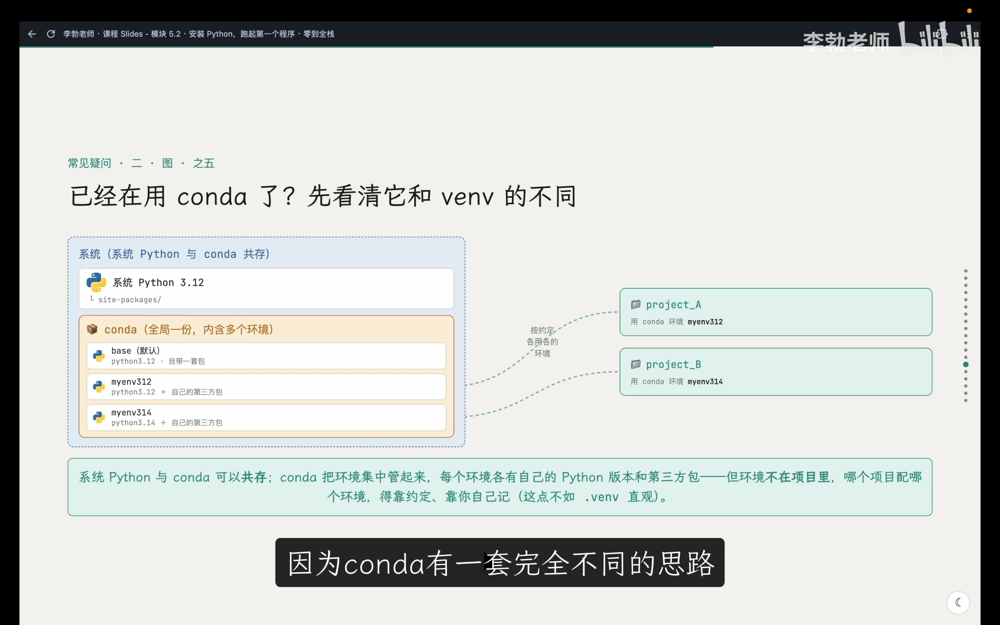

### 为什么在现代全栈与 AI 协作（Vibe Coding）时代推荐 venv？

1. **信息自内聚**：`venv` 的环境与配置直接内嵌在工程目录下。IDE（如 VS Code、Cursor）以及智能编程 Agent 一旦打开项目目录，能瞬间识别环境版本与依赖，无需人工跨目录绑定。
2. **严禁环境叠加**：切忌在已激活的 Conda `(base)` 环境中再次运行 `source .venv/bin/activate`，多重虚拟环境路径互相嵌套会引发动态链接库调用紊乱。
3. **关闭 Conda 自动激活**：
   如果希望跟着全栈课程采用原生 `venv` 标准，推荐禁用 Conda 打开终端时的自动接管：
   ```bash
   conda config --set auto_activate_base false
   ```
   关闭后重启终端，行首的 `(base)` 标识彻底消失，系统恢复干净清爽的环境。

---

## 6. 工程化实践：为 zero-to-tech 接入后端模块
*(参考时间: 30:00)*

现在，我们将这些理论正式落地到从第 1 讲一路陪伴我们的全栈项目 `zero-to-tech` 中。

### 目录结构规划与职责边界

在 `zero-to-tech` 项目根目录下，新建 `backend/` 目录用于承载后端代码体系：

```
zero-to-tech/
├── app/                  # Next.js 前端路由与页面
├── public/               # 前端静态资产
├── out/                  # 前端静态导出产物
├── package.json          # Node.js 依赖描述文件
└── backend/              # 👈 全新开辟的独立后端工程
    └── .venv/            # 👈 后端独立隔离的 Python 虚拟环境
```

> [!NOTE]
> 有同学会问：是否需要顺便将原本根目录的前端代码也挪入 `frontend/` 文件夹做“对称”？
> **完全没有必要。** 真实企业级演进项目中切忌无意义的过度重构。前端目录此前已与 Nginx 配置、Git 历史深度绑定；前后端解耦的核心本质在于**独立的运行时进程、独立的依赖管理、独立的部署流**，绝不在于文件夹名称的对称。

### 初始化后端专用虚拟环境

进入 `backend` 目录，创建提示符为 `zero-to-tech` 的专属沙箱并激活：

```bash
cd backend
python3 -m venv --prompt zero-to-tech .venv
source .venv/bin/activate
```

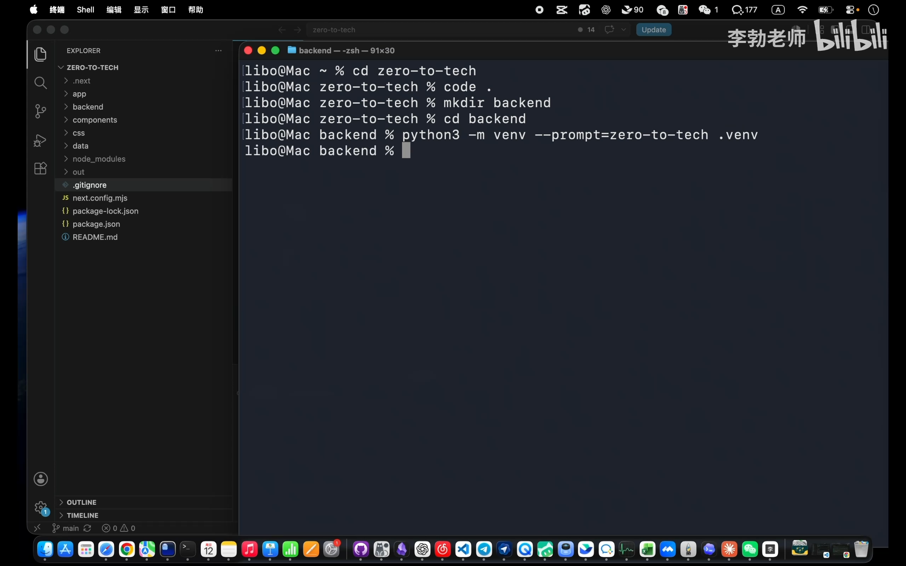

### VS Code 智能集成与终端自动激活

在 VS Code 扩展市场安装官方 **Python**（含 Python Environment Manager）插件。该插件会自动扫描工程根目录与子目录下的 `.venv` 解释器。

安装完成后，在 VS Code 内部新建终端并切换到 `backend/` 时，插件会自动注入环境变量激活命令，无需每次手动敲击 `source` 指令：

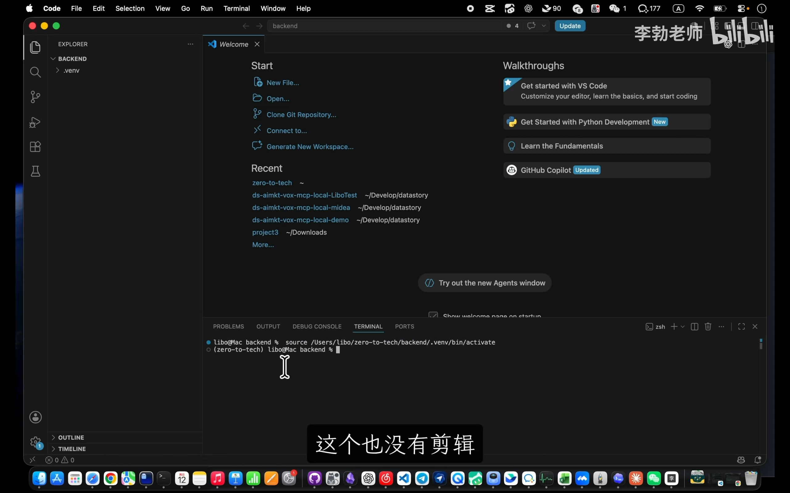

### 必须配置的 Git 忽略项

正如前端的 `node_modules` 绝不可提交至版本库一样，`.venv` 包含海量机器本地特定的二进制与动态链接文件，绝不能污染代码仓库。

在项目根目录的 `.gitignore` 中追加一行：
```gitignore
# 忽略后端 Python 虚拟环境
backend/.venv/
.venv/
```

---

## 7. 运行第一个 Python 程序：初识语法特色
*(参考时间: 35:50)*

在 `backend/` 目录下创建第一个 Python 脚本 `first_json.py`：

```python
import json

site_name = "zero-to-tech"

def make_data():
    data = {"message": "hello, world", "from": site_name}
    return json.dumps(data)

print(make_data())
```

在激活的虚拟环境中直接运行：
```bash
python first_json.py
```

终端将打印出序列化后的 JSON 字符串：
```json
{"message": "hello, world", "from": "zero-to-tech"}
```

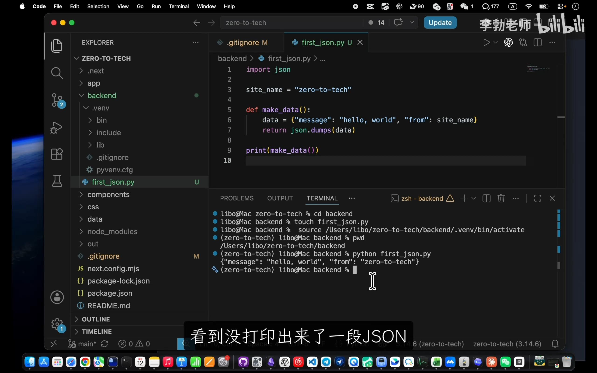

### Python 语法初印象与核心特征

1. **内置标准库（Standard Library）**：`import json` 调用的 JSON 模块由 Python 官方直接预装自带，无需网络下载，开箱即用。
2. **直观的变量赋值**：无需前端的 `let / const / var` 声明关键字，直接使用 `变量名 = 值` 即可。
3. **冒号与强制缩进（Indentation）**：Python 抛弃了 C/Java/JavaScript 传统的大括号 `{}` 作用域语法，使用**冒号 `:` + 4 个空格对齐**界定代码块范围。缩进即语法，缩进不规范代码会直接引发 `IndentationError`。
4. **简洁的终端输出**：直接通过内置函数 `print()` 打印内容至标准输出流。无需编译、打包或浏览器渲染，即写即跑。

---

## 8. 包管理与依赖固化：pip 与 requirements.txt
*(参考时间: 40:20)*

接下来我们尝试使用 Python 编写网络请求逻辑。新建 `api_demo.py`：

```python
import requests

resp = requests.get("https://api.ipify.org?format=json")
print(resp.json())
```

保存后直接执行：
```bash
python api_demo.py
```

此时终端抛出经典错误：
```text
ModuleNotFoundError: No module named 'requests'
```

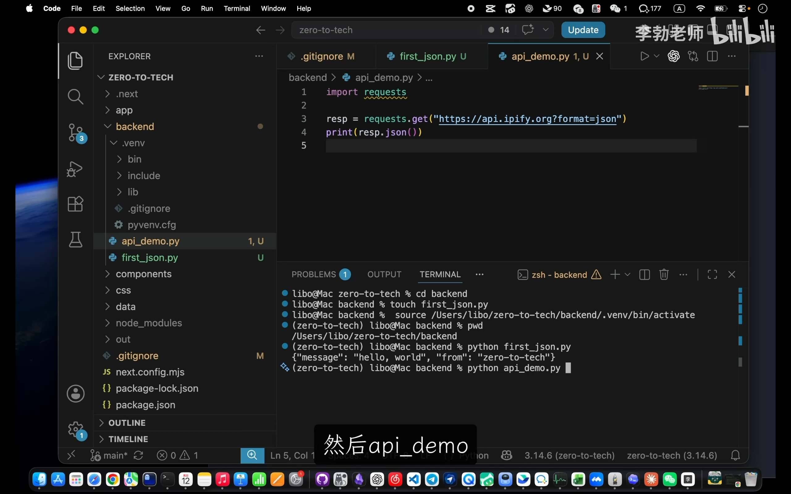

### 用 pip 安装第三方库

报错信息清晰明了：Python 标准库中并不包含 `requests` 模块。它属于开源社区最著名的 HTTP 客户端第三方库，类似于前端生态中的 `axios`。

使用 Python 官方包管理器 `pip`（随 Python 一起安装）下载安装：
```bash
pip install requests
```

`pip` 会解析依赖树，将 `requests` 及其底层的 `urllib3`、`certifi`、`idna`、`charset-normalizer` 依赖链完整拉取至本地。

### 检查依赖落盘路径

使用 `pip show` 查看安装详情：
```bash
pip show requests
```

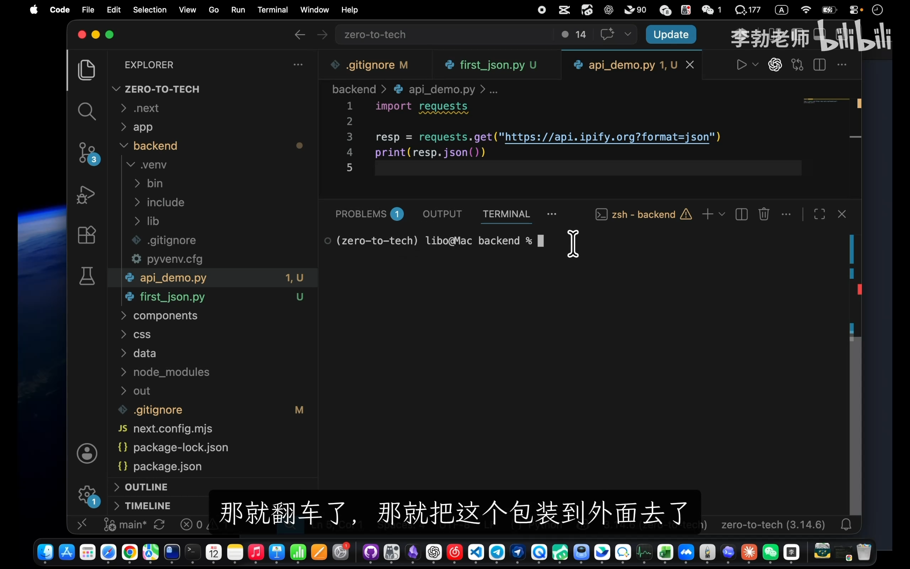

从输出的 `Location: /.../zero-to-tech/backend/.venv/lib/python3.x/site-packages` 可以清楚看到，依赖库精准存放在当前项目的 `.venv` 内部，完全隔离于操作系统全局环境。

再次运行程序，成功在终端打印外网 IP 数据：
```bash
python api_demo.py
# 输出: {'ip': '209.141.46.182'}
```

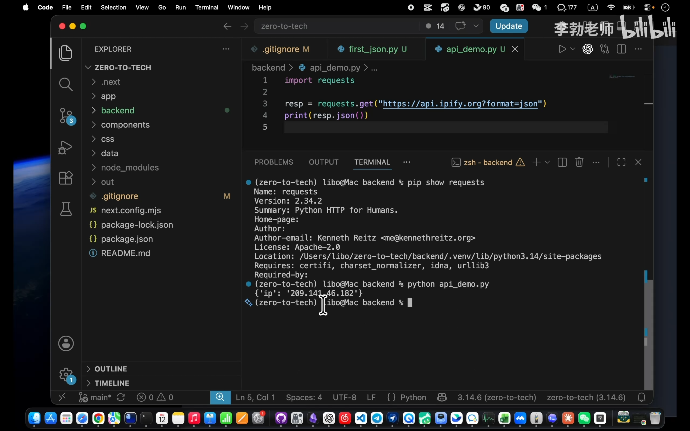

### 依赖版本固化：`requirements.txt`

既然 `.venv` 目录被 Git 忽略，团队其他成员拉取代码或后续部署到云端 Linux 服务器时，如何还原完全一致的 Python 依赖生态？

前端使用 `package.json` 记录包信息，而 Python 生态的标准规范是 **`requirements.txt`**：

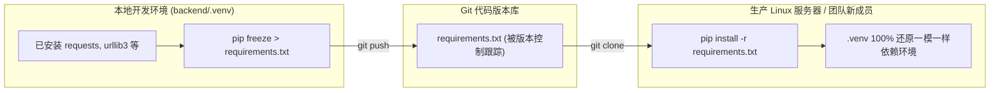
```mermaid
flowchart LR
    subgraph DevEnv ["本地开发环境 (backend/.venv)"]
        PipEnv["已安装 requests, urllib3 等"]
        PipFreeze["pip freeze > requirements.txt"]
        PipEnv --> PipFreeze
    end

    subgraph GitRepo ["Git 代码版本库"]
        ReqFile["requirements.txt (被版本控制跟踪)"]
        PipFreeze -->|git push| ReqFile
    end

    subgraph ServerEnv ["生产 Linux 服务器 / 团队新成员"]
        ServerPip["pip install -r requirements.txt"]
        ReqFile -->|git clone| ServerPip
        ServerPip --> BuildNewEnv[".venv 100% 还原一模一样依赖环境"]
    end
```

在激活的虚拟环境中，将当前安装的所有库及其精确版本号导出：
```bash
pip freeze > requirements.txt
```

生成的 `requirements.txt` 包含了精确版本锚定（Pinned Version）：
```text
certifi==2024.12.14
charset-normalizer==3.4.1
idna==3.10
requests==2.32.3
urllib3==2.3.0
```

任何人拿到该工程后，只需进入虚拟环境执行一条命令，即可全自动无缝补齐所有依赖：
```bash
pip install -r requirements.txt
```

> [!IMPORTANT]
> `requirements.txt` 是项目源代码不可分割的一部分，**必须提交至 Git 仓库**。

---

## 9. 新手避坑与本节小结
*(参考时间: 48:20)*

### 避坑：系统桌面应用图标的迷惑

在 macOS 系统完成 Python 官方包安装后，“启动台（Launchpad）”中往往会出现形如 `IDLE`、`Python Launcher` 或带有版本号的图形应用程序图标。很多新手点击后发现界面毫无响应或弹出一个极简控制台，误以为安装失败。

**解惑**：这些属于 Python 早期的历史遗留小工具。现代化全栈 Python 开发**完全基于命令行终端与专业 IDE（如 VS Code）**，请勿理会启动台中的图形图标，保持终端调用即可。

### 核心知识图谱速查

| 概念维度 | 核心概念 | 关键指令 / 文件 | 全栈对比映射 |
| :--- | :--- | :--- | :--- |
| **运行时** | Python 3 解释器 | `python3 --version`, `which python3` | Node.js (`node -v`) |
| **隔离沙箱** | venv 虚拟环境 | `python3 -m venv .venv`, `source .venv/bin/activate` | `node_modules` 独立隔离机制 |
| **包管理工具** | pip | `pip install <package>`, `pip show <package>` | `npm` / `pnpm` |
| **依赖清单** | 版本锁定配置 | `pip freeze > requirements.txt`, `pip install -r requirements.txt` | `package.json` + `package-lock.json` |

至此，我们的 `zero-to-tech` 项目已成功开辟独立的后端开发领地，完成了语言运行时安装、虚拟环境沙箱构建、VS Code 自动化终端集成与依赖固化管理。在下一节中，我们将手搓一个 HTTP API 服务，从协议底层彻底解密浏览器与后端服务器之间的数据交互对话。
