# 第 21 讲：理解 HTTP，手搓一个 API（5.3）

在前面两讲中，我们完成了 API 基础概念的建立，并在本地成功配置了 Python 隔离运行环境。但直到上一节为止，我们编写的代码（无论终端中的 `curl` 还是 Python 脚本中的 `requests.get`）始终站在**调用方（Client / 客户端）**的视角。

从本节开始，我们将发生根本性的视角转变——**成为被调用方（Server / 服务端）**。我们要编写一个守在服务器端口上的后端程序，等待外界发来请求并作出正确回应。

为了让服务端与形形色色的客户端顺畅交流，双方必须遵守同一套世界通用的网络对话规约——**HTTP 协议（HyperText Transfer Protocol）**。本节我们将通过理论剖析、`curl -v` 报文透视以及 Python 标准库原生“手搓”一个 API，彻底打通网络协议底层的任督二脉。

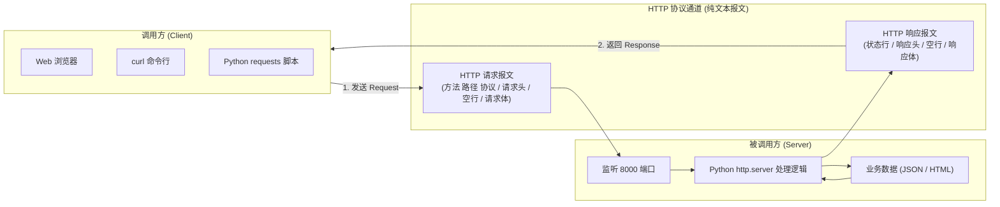

---

## 1. 视角的转变：从调用方跨入被调用方
*(参考时间: 01:15)*

在软件工程中，任何一次网络交互都包含两个对等的角色：
* **调用方（Client）**：主动发起提问的一方。负责按照协议组装好请求内容并向目标服务器发送。
* **被调用方（Server）**：被动守候应答的一方。在指定的网络端口上保持常驻监听，接收到请求后进行解析、处理，并组装响应报文送回。

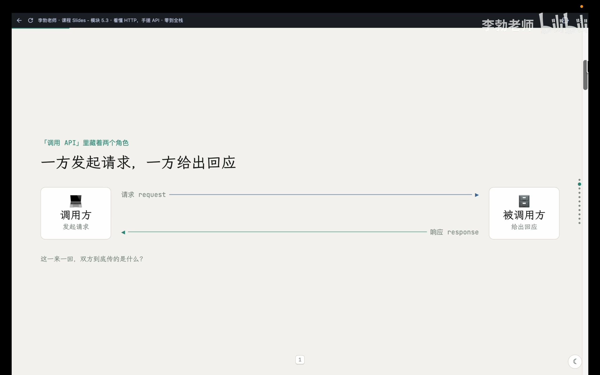

此前我们使用浏览器上网、使用 `curl` 探测 IP 或在终端调用 DeepSeek，各类客户端工具默默帮我们处理了复杂的协议细节，我们只需查看最终的返回内容。而作为服务端开发者，我们必须精确掌握协议规范中每一个字节的含义，否则任何格式错漏都会导致客户端无法解析。

---

## 2. 报文全貌：请求与响应的对称之美
*(参考时间: 03:00)*

HTTP 规定的一次完整网络对话，本质上就是**一去一回两段格式固定的纯文本**。发过去的那段叫**请求（Request）**，回过来的那段叫**响应（Response）**。

两段报文在结构上具有高度严谨的对称性，均由严格的四个部分构成：

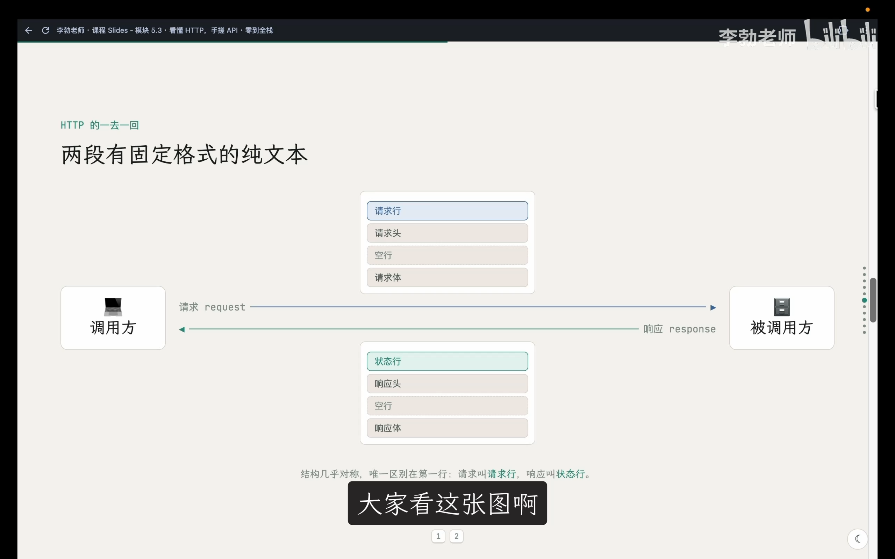

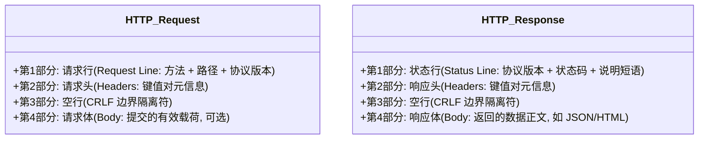

### 请求报文的四个部件

1. **请求行（Request Line）**：请求的第一行，交代三件事：
   * **请求方法（Method）**：表明意图（如 `GET` 取数据、`POST` 提交数据）；
   * **资源路径（Path）**：指定访问服务器上的哪个资源（如 `/` 或 `/api/home`）；
   * **协议版本（HTTP Version）**：如 `HTTP/1.1`。
2. **请求头（Request Headers）**：若干行 `Key: Value` 键值对，用于补充说明请求者的身份、目标主机与偏好格式（如 `Host`、`User-Agent`、`Accept`）。
3. **空行（CRLF）**：极其关键的分界线，明确告知服务器“头部元信息已结束，下方开始是正文数据”。
4. **请求体（Request Body）**：客户端提交给服务端的实际数据载荷（如 POST 表单或 JSON 内容）。`GET` 请求通常省略此部分。

### 响应报文的四个部件

1. **状态行（Status Line）**：响应的第一行，交代处理结果：
   * 协议版本（如 `HTTP/1.1`）；
   * **状态码（Status Code）**：三位数字，表示处理结果；
   * 状态说明（Reason Phrase）：如 `200 OK` 或 `404 Not Found`。
2. **响应头（Response Headers）**：若干行 `Key: Value`，交代返回数据的元属性，其中最重要的莫过于 `Content-Type`（指明响应体的数据格式）。
3. **空行（CRLF）**：分隔响应头与响应正文。
4. **响应体（Response Body）**：服务器真正交还给客户端的正文数据（如 HTML 源码或 JSON 字符串）。

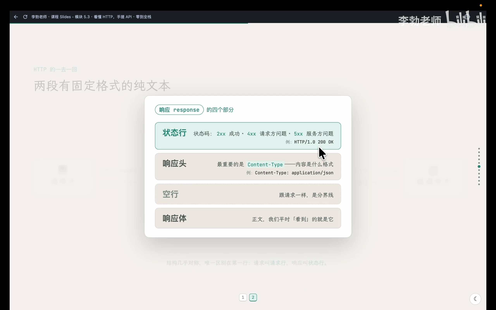

> [!TIP]
> **状态码核心规律速查**：
> * `2xx`（如 200）：成功（Success）。
> * `3xx`（如 301, 302）：重定向（Redirection），资源搬移至新路径。
> * `4xx`（如 400, 404, 403）：**客户端错误（Client Error）**。请求本身存在问题（如找错路径或缺少参数）。
> * `5xx`（如 500, 502）：**服务端错误（Server Error）**。服务端业务逻辑崩溃或代理挂起。

---

## 3. 报文透视：使用 `curl -v` 还原真实对话
*(参考时间: 07:10)*

平时我们在终端执行 `curl`，屏幕上只显示最终的响应体。在 `curl` 命令后添加 **`-v`（verbose / 详细模式）** 参数，`curl` 就会将握手与两段纯文本报文全过程完整打印出来。

```bash
curl -v https://api.ipify.org?format=json
```

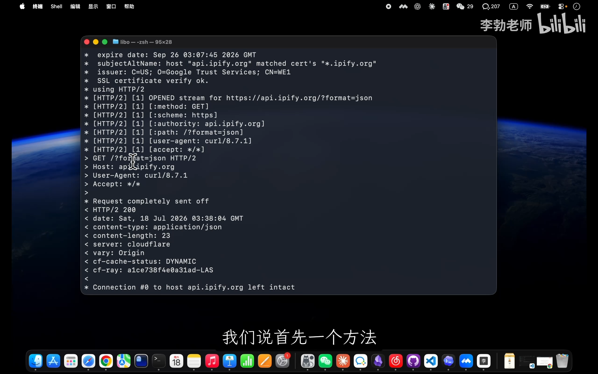

### 读懂终端中的三类行首标记

* **星号 `*` 开头**：`curl` 的底层旁白与网络连接事件（DNS 解析、TCP 三次握手、TLS 加密握手等），非 HTTP 报文内容。
* **大于号 `>` 开头**：**发往服务端的真实请求报文原文**。清晰包含请求行（`GET /?format=json HTTP/1.1`）以及请求头（`Host`, `User-Agent`, `Accept`）。
* **小于号 `<` 开头**：**服务端返还的真实响应报文原文**。清晰包含状态行（`HTTP/1.1 200 OK`）以及各类响应头（`content-type: application/json` 等）。

### 对比带请求体的 POST 报文

当我们使用 `curl` 调用 DeepSeek 接口时：
```bash
curl -v https://api.deepseek.com/chat/completions \
  -H "Content-Type: application/json" \
  -H "Authorization: Bearer YOUR_API_KEY" \
  -d '{"model":"deepseek-chat","messages":[{"role":"user","content":"Hello"}]}'
```

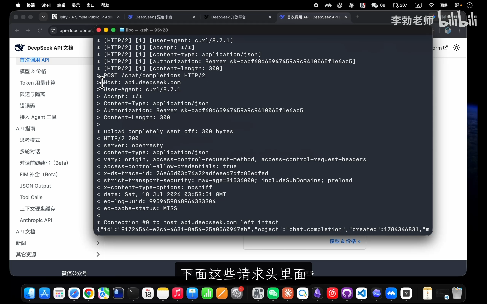

在请求段中，原本的 `GET` 变为了 `POST`，由 `-H` 传入的参数原样转化为 HTTP 请求头。而通过 `-d` 传递的 JSON 字符串则作为**请求体**发送给后端。

---

## 4. HTTP 方法的本质：意图而非数据流向
*(参考时间: 13:40)*

许多初学者常常产生误解：“`GET` 是从服务器往回拉数据，`POST` 是往外推数据”。这种理解存在根本性的认知偏差。

> [!IMPORTANT]
> **HTTP Method 描述的不是数据的物理流动方向，而是客户端发起请求的“业务意图”**。
> * 在调用 DeepSeek 的例子中，我们虽然推上去了 Prompt，但也接收到了几千字的 AI 回复；
> * **`GET` 的意图是“请将该资源呈现给我”**（安全、幂等，通常无请求体）；
> * **`POST` 的意图是“我提交了一份内容，请服务端进行处理/持久化”**（通常包含请求体）。

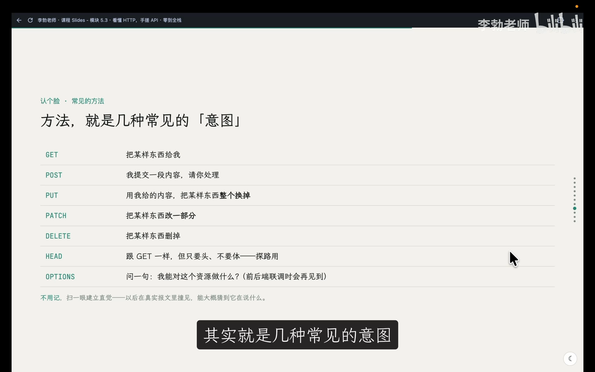

| 请求方法 | 核心业务意图 (Semantic Intent) | 是否通常包含请求体 |
| :--- | :--- | :--- |
| **GET** | 获取指定资源的当前表示 | 否 |
| **POST** | 向服务端提交数据，请求进行处理或创建新资源 | **是** |
| **PUT** | 使用请求体的内容完整替换目标资源 | 是 |
| **PATCH** | 对目标资源进行局部微调更新 | 是 |
| **DELETE** | 删除指定的远程资源 | 否 |
| **HEAD** | 与 GET 行为完全一致，但**不返回响应体**（仅探测响应头） | 否 |
| **OPTIONS** | 查询目标资源支持的通信方法（跨域预检常用） | 否 |

---

## 5. 核心头字段与服务端必做清单
*(参考时间: 16:10)*

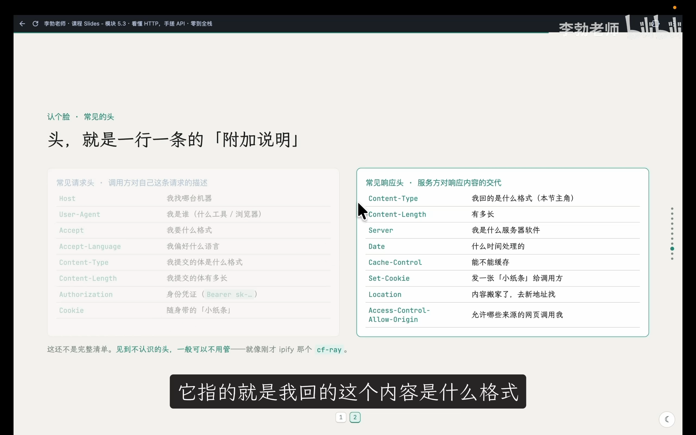

面对如此繁琐的 HTTP 规约，作为一名服务端编写者，哪些是必须处理的硬性指标？

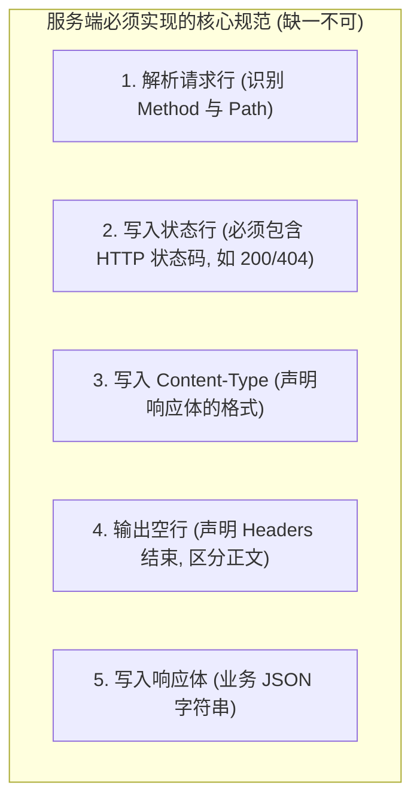

1. **必须读取请求方法与路径**：如果不判断路径与方法，就无法区分来访者要访问哪个接口；
2. **必须写回状态行（状态码）**：没有状态码的报文不符合协议，客户端会直接抛出协议错误；
3. **必须写入 `Content-Type` 响应头**：告知客户端响应体的编码与数据形态（如 `application/json`）；
4. **必须写入空行**：划分头部与数据正文的界线；
5. **按需写入响应体**：组装客户端所需的数据。

---

## 6. 原生手搓：用 Python 实现你的第一个 API
*(参考时间: 21:00)*

理解了底层规范后，我们无需安装任何第三方大型框架，直接利用 Python 内置的标准库 **`http.server`** 来亲手编写符合 HTTP 规范的服务端代码。

在 `zero-to-tech/backend/` 目录下创建 `main.py`：

```python
from http.server import BaseHTTPRequestHandler, HTTPServer
import json

# 模拟从前端 data.js 拆分出来的个人资料数据
profile = {
    "heroTitle": "关于我",
    "heroSubtitle": "项目, 创意, 灵感, 心得, 我的作品",
}

class Handler(BaseHTTPRequestHandler):
    def do_GET(self):
        # 1. 读取并判断请求路径
        if self.path == "/api/profile":
            # 2. 写入状态行 (200 OK)
            self.send_response(200)
            
            # 3. 写入响应头
            self.send_header("Content-Type", "application/json")
            
            # 4. 写入空行 (Header 结束界限)
            self.end_headers()
            
            # 5. 组装并写入响应体 (ensure_ascii=False 保证中文字符原生输出)
            body = json.dumps(profile, ensure_ascii=False)
            self.wfile.write(body.encode("utf-8"))
        else:
            # 路径不匹配时返回 404
            self.send_response(404)
            self.end_headers()

print("后端已启动: http://localhost:8000/api/profile")
HTTPServer(("", 8000), Handler).serve_forever()
```

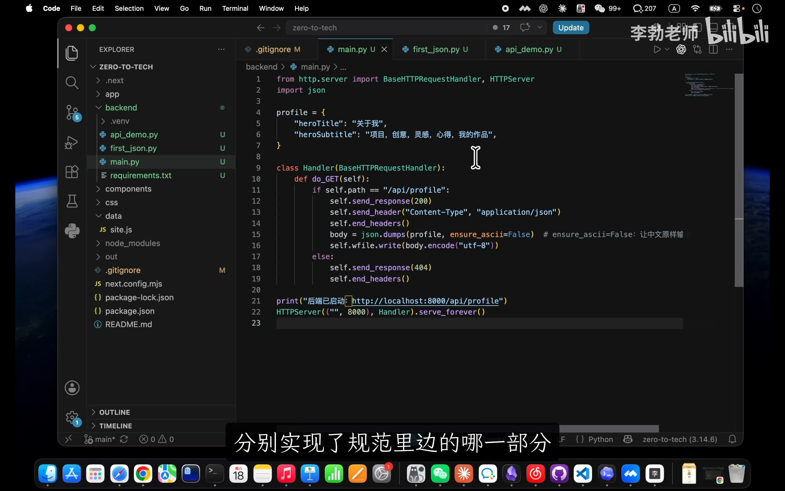

### 代码关键点解析

* `BaseHTTPRequestHandler`：Python 标准库中处理 HTTP 请求的基类。定义 `do_GET` 即代表专门拦截所有的 `GET` 请求。
* `self.send_response(200)`：负责向 TCP 通道写入状态行 `HTTP/1.0 200 OK`。
* `self.send_header("Content-Type", "application/json")`：生成数据格式说明头。
* `self.end_headers()`：**关键指令**，自动输出一个由 `\r\n` 构成的纯空行，标识头部的结束。
* `self.wfile.write(...)`：`wfile` 是一个底层的可写二进制流（Write File），必须将字符串通过 `.encode("utf-8")` 转换为字节才能网络传输。
* `HTTPServer(("", 8000), Handler).serve_forever()`：开启死循环监听 8000 端口。

### 启动与接口调用

在激活虚拟环境的终端中执行启动命令：
```bash
python3 main.py
```

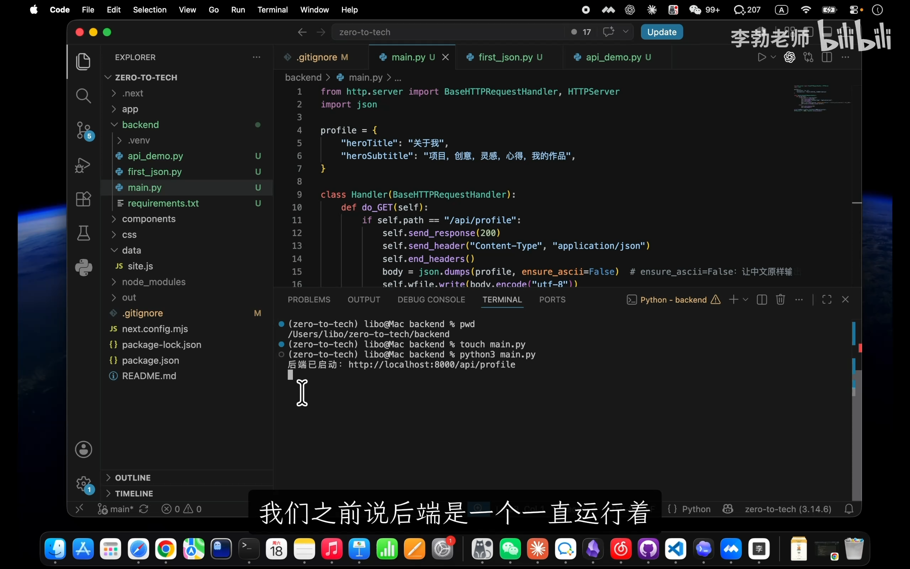

终端输出提示后光标停留在新行等待。保持该终端不动，打开另一个终端窗口或直接在浏览器中访问：

```bash
curl http://localhost:8000/api/profile
```

终端与浏览器均能成功获得标准的 JSON 字符串返回：
```json
{"heroTitle": "关于我", "heroSubtitle": "项目, 创意, 灵感, 心得, 我的作品"}
```

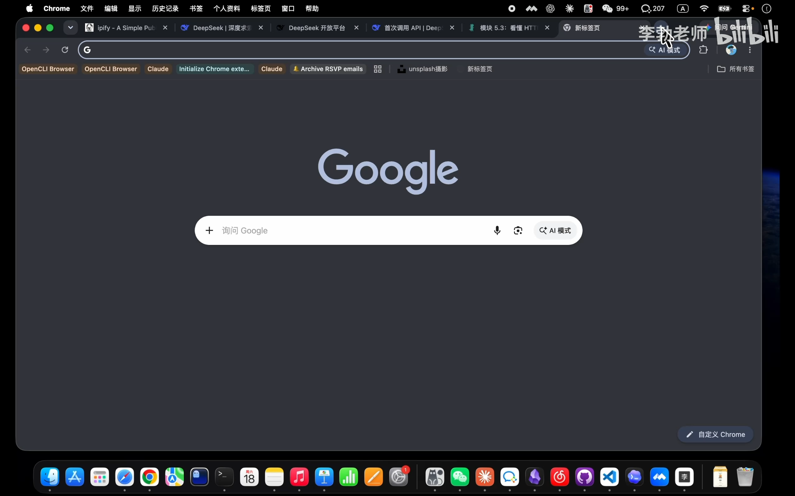

同时，服务端的控制台终端打印出了实时的访问日志：
```text
127.0.0.1 - - [15/Sep/2026 10:15:32] "GET /api/profile HTTP/1.1" 200 -
127.0.0.1 - - [15/Sep/2026 10:15:33] "GET /favicon.ico HTTP/1.1" 404 -
```

> [!NOTE]
> 浏览器访问时会自动触发一条对 `/favicon.ico`（标签页小图标）的额外请求。由于我们在代码中仅对 `/` 作了匹配，因此该请求命中 `else` 分支并正确返回了 `404` 状态码。

---

## 7. 深度实验一：`Content-Type` 与字符集的降维打击
*(参考时间: 33:00)*

为了直观验证 `Content-Type` 响应头的绝对支配力，我们在 `do_GET` 中追加一个路由分支测试：

```python
elif self.path == "/hello":
    self.send_response(200)
    self.send_header("Content-Type", "text/html; charset=utf-8")
    self.end_headers()
    self.wfile.write("<h1>你好，HTTP！</h1>".encode("utf-8"))
```

### 踩坑与乱码：字符集的作用

如果仅声明 `text/html` 而未显式声明 `charset=utf-8`，部分浏览器会按照操作系统的本地默认编码（如 Windows 下的 GBK 或 ISO-8859-1）尝试解析中文字符，导致网页出现中文乱码：

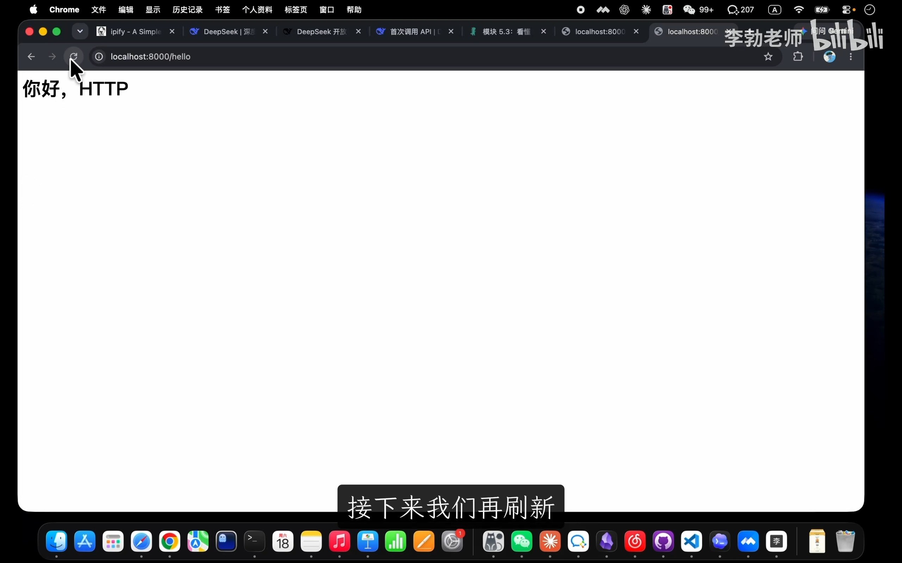

补全 `; charset=utf-8` 后刷新，浏览器便能正常呈现大号字体的 HTML 标题。

### 格式切换：网页与 API 的本质同一性

如果我们保持返回内容不变，仅仅将响应头修改为纯文本：
```python
self.send_header("Content-Type", "text/plain")
```

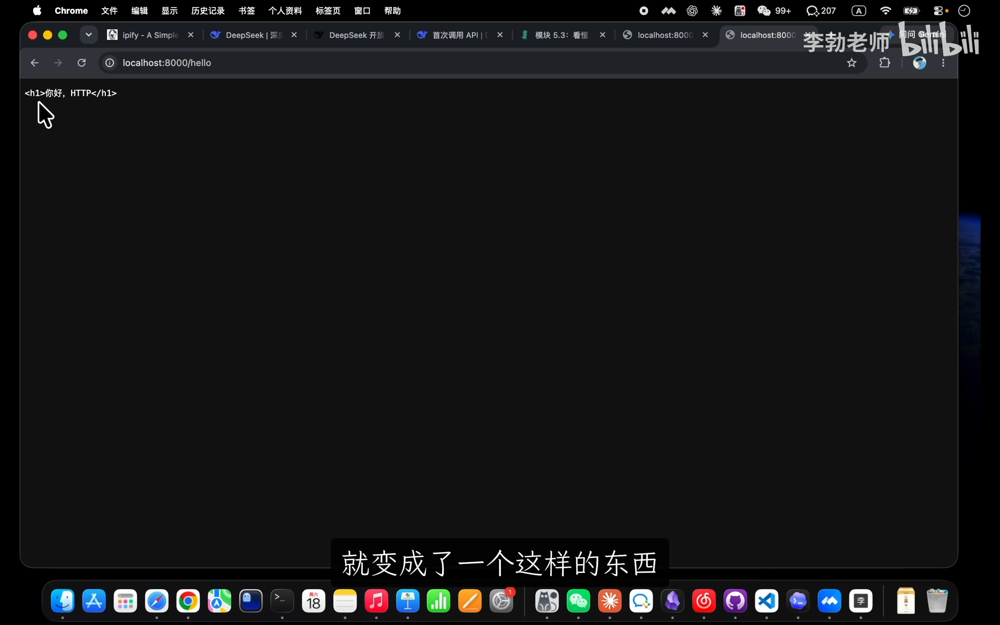

此时浏览器将不再解析 `<h1>` 标签，而是将其作为原始字符串逐字打印在屏幕上。

> [!IMPORTANT]
> **在现代网络世界里，网页与 API 没有本质区别**。它们底色上都是完全一致的 HTTP 交互报文。所谓做 API，不过是在 `Content-Type` 中选择告知客户端这是 `application/json` 还是 `text/html`。

---

## 8. 深度实验二：服务端眼中的世界与元信息透视
*(参考时间: 36:30)*

在 `do_GET` 头部增加两行日志打印：
```python
print("客户端请求头:\n", self.headers)
print("客户端真实 IP 地址:", self.client_address[0])
```

使用 `curl` 与浏览器分别请求服务，服务端的控制台展现出了截然不同的信息世界：

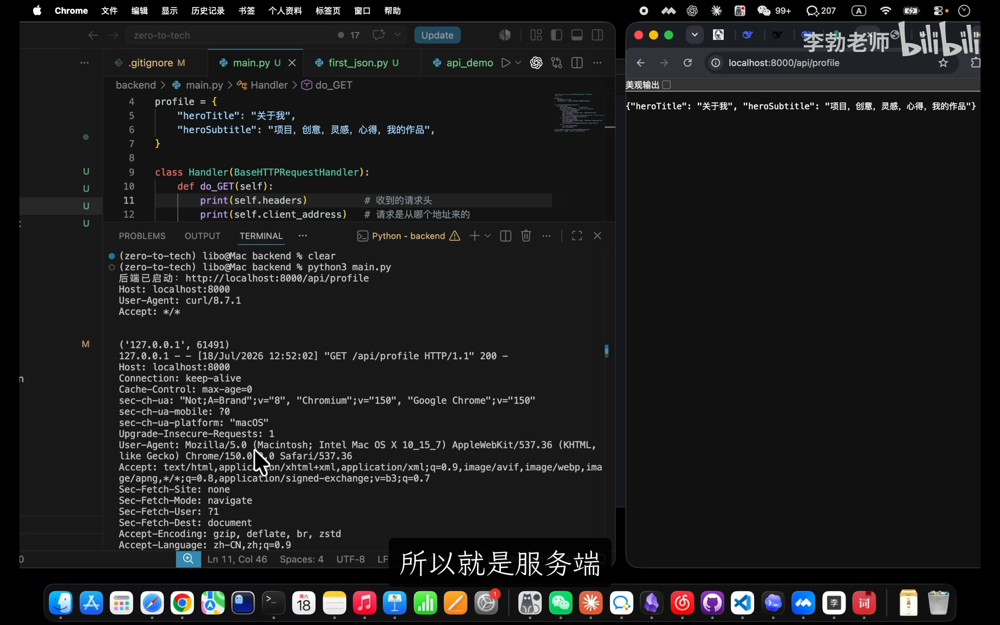

* **客户端完全透明**：`curl` 只上报简短的工具版本信息，而现代浏览器则会带上数十行请求头，包括操作系统版本、屏幕渲染引擎（`User-Agent`）、可接收的压缩算法（`Accept-Encoding`）等。
* **元信息的工程价值**：服务端正是利用这些元信息实现客户端设备统计、基于 IP 的风控防刷、以及根据 `Accept-Language` 自动呈现中文或英文界面的国际化能力。

### 避坑与安全：协议伪装

在浏览器开发者工具（F12）的 Network 面板中，对任意网络请求右键选择 **`Copy as cURL`**，即可直接复制出浏览器触发该请求时的所有请求头：

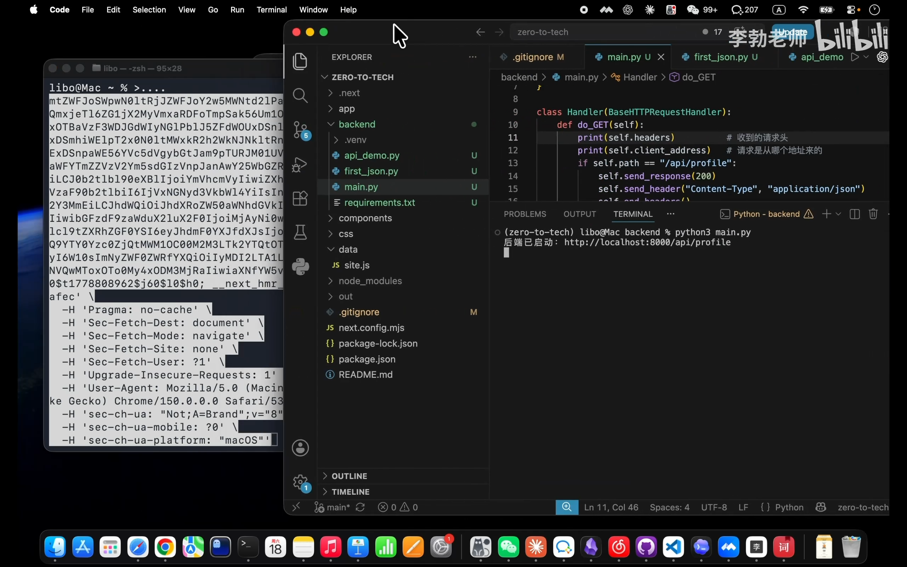

粘贴到终端执行时，服务端将毫无保留地认为这次请求来自于真正的 Google Chrome 浏览器。这也提醒我们：**HTTP 头部是完全由客户端自由组装的纯文本，绝不可无条件信任未签名的请求头作为唯一安全凭证**。

---

## 9. 为什么现实开发不能一直“手搓”？
*(参考时间: 42:30)*

在完成实验并验证逻辑后，我们在 Git 中提交本次里程碑：

```bash
# 清理第 20 讲中的临时演示脚本
rm first_json.py api_demo.py

# 提交干净的手搓 API 代码
git add main.py
git commit -m "feat: 手搓一个基础 HTTP API"
```

### 从手搓到框架（Framework）的必然演进

通过亲手编写这几十行代码，我们切身体会到了编写一个原生 API 的繁重工作量：
1. 每个路由都要手写 `if...elif...else` 进行字符串比对；
2. 必须手动管理 `send_response`、`send_header` 以及易错的 `end_headers` 空行；
3. 如果接口需要接收 POST 数据，还需要手动计算 `Content-Length` 并进行流式读取和字段校验；
4. 真实大型工程拥有上百个接口，手搓原生代码将陷入无尽的防御性重复造轮子中。

这些与业务无关、人人皆需遵循的 HTTP 规范底层繁琐杂活，催生了专门的工程利器——**Web 框架（Web Framework）**。

下一节中，现代 Python 生态中最著名的高性能异步后端框架 **FastAPI** 将正式登场。我们将见证几十行原生杂活如何在框架的优雅封装下，化繁为简为短短几行优雅代码。
