# 第 22 讲：FastAPI 入门（5.4）

在上一节中，我们仅仅依靠 Python 内置的 `http.server` 模块，“纯手工”搓出了一个基础的 HTTP API。虽然代码量不算多，但为了把一段简简单单的个人资料 JSON 数据发送出去，我们耗费了大量精力去处理 HTTP 协议底层的各种琐碎细节：逐行比对路径、手工写入状态码与响应头、精准输出 `\r\n` 空行、做二进制流编码与 404 兜底。

更关键的是，上一讲我们仅仅实现了一个最基础的 `GET` 接口。如果面对带有复杂参数、需要校验合法性的 `POST` 接口，手搓代码的繁重程度将呈指数级上升。

从本节开始，我们将告别手搓杂活，正式引入现代 Python 生态中最流行的高性能后端框架——**FastAPI**。我们将用极度优雅的几行代码重构上一节的接口，并进一步实现带有数据校验闸门的 `POST` 分析接口，直观体会框架带来的巨大生产力跃升。

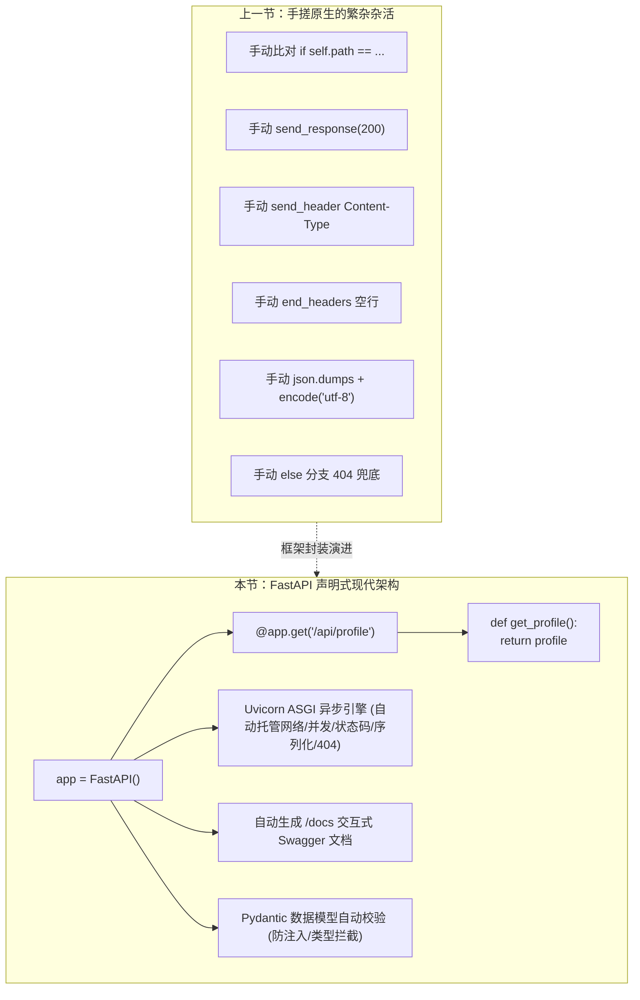
```mermaid
flowchart TD
    subgraph HandMadeHell ["上一节：手搓原生的繁杂杂活"]
        HM1["手动比对 if self.path == ..."]
        HM2["手动 send_response(200)"]
        HM3["手动 send_header Content-Type"]
        HM4["手动 end_headers 空行"]
        HM5["手动 json.dumps + encode('utf-8')"]
        HM6["手动 else 分支 404 兜底"]
    end

    subgraph FastAPIElegance ["本节：FastAPI 声明式现代架构"]
        App["app = FastAPI()"]
        RouteDecorator["@app.get('/api/profile')"]
        PyFunc["def get_profile():\n    return profile"]
        UvicornDriver["Uvicorn ASGI 异步引擎 (自动托管网络/并发/状态码/序列化/404)"]
        SwaggerAuto["自动生成 /docs 交互式 Swagger 文档"]
        PydanticGate["Pydantic 数据模型自动校验 (防注入/类型拦截)"]

        App --> RouteDecorator --> PyFunc
        App --> UvicornDriver
        App --> SwaggerAuto
        App --> PydanticGate
    end

    HandMadeHell -.->|框架封装演进| FastAPIElegance
```

---

## 1. 为什么需要框架？从协议杂活到专注业务
*(参考时间: 00:50)*

在上一讲手搓代码时，我们写的 80% 以上的代码都在“伺候” HTTP 协议：

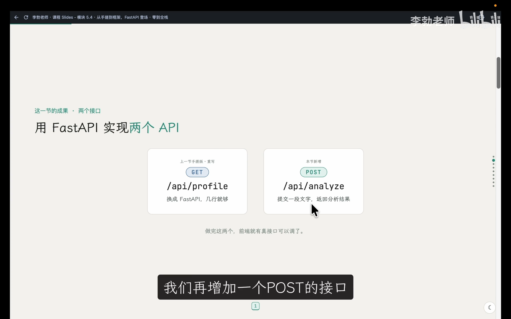

但从真实业务需求的角度来看，我们的诉求其实非常朴素：
> **“当外界请求 `/api/profile` 时，把个人资料数据字典送出去。”**

这就是**Web 后端框架（Web Framework）**诞生的根本价值：**将所有与具体业务无关的通用网络传输、报文解析、路由派发、序列化和错误兜底全部高度内聚封装，让开发者能够 100% 聚焦于核心业务逻辑本身**。

---

## 2. Python 后端三大框架横向对比
*(参考时间: 02:15)*

在 Python 浩瀚的开源生态中，有三个家喻户晓的 Web 框架：

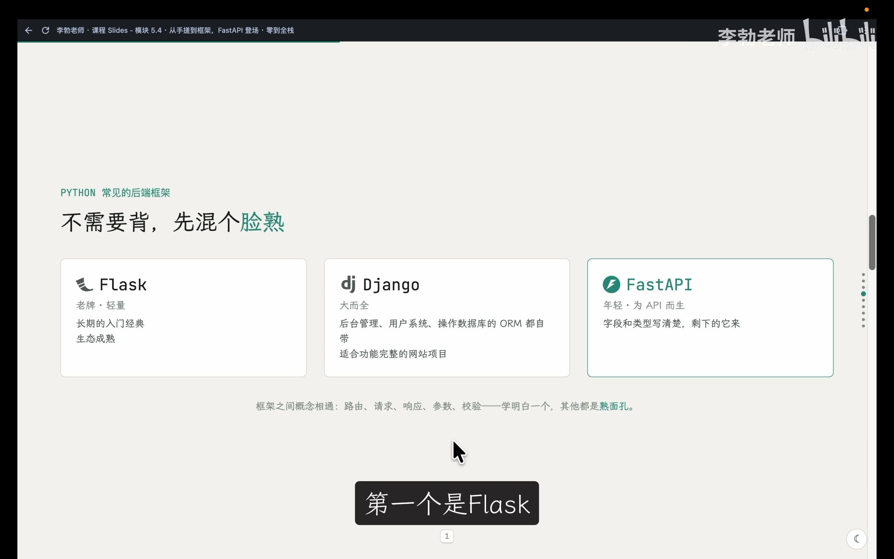

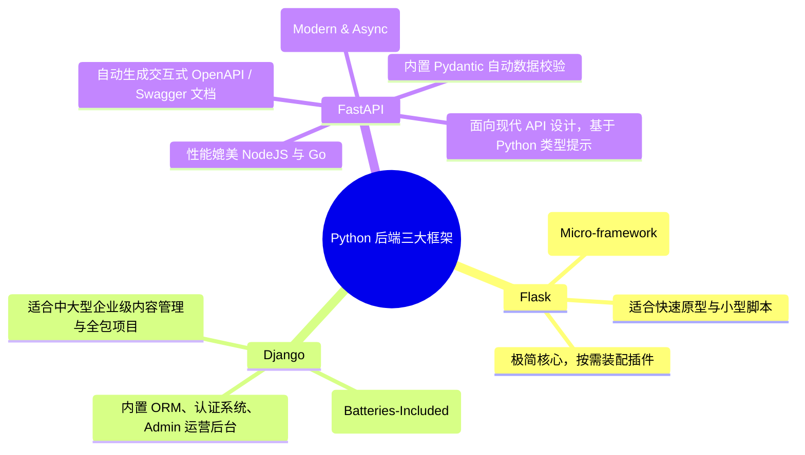
```mermaid
mindmap
  root((Python 后端三大框架))
    Flask
      老牌微框架 (Micro-framework)
      极简核心，按需装配插件
      适合快速原型与小型脚本
    Django
      大而全 (Batteries-Included)
      内置 ORM、认证系统、Admin 运营后台
      适合中大型企业级内容管理与全包项目
    FastAPI
      现代异步首选 (Modern & Async)
      面向现代 API 设计，基于 Python 类型提示
      内置 Pydantic 自动数据校验
      自动生成交互式 OpenAPI / Swagger 文档
      性能媲美 NodeJS 与 Go
```

### 为什么本课程选择 FastAPI？

1. **上手门槛低且代码极致优雅**：基于 Python 原生 Type Hints 类型注解，几乎不需要学习冗长的心智模型；
2. **自动化开箱即用**：无需额外安装复杂库，自带数据解析、请求拦截与交互式接口文档；
3. **顶级的官方文档**：FastAPI 官网的用户教程（User Guide）编写极其详实细腻，不仅教“怎么用”，还通俗解释“为什么这么设计”，被无数开发者誉为绝佳的工程学习教材。

---

## 3. 架构分工：FastAPI 与 Uvicorn 的默契配合
*(参考时间: 05:20)*

在手搓代码中，我们既写了处理逻辑（Handler），又在末尾调用了 `HTTPServer.serve_forever()` 去监听端口。但在现代化框架工程中，这两项职责进行了彻底解耦：

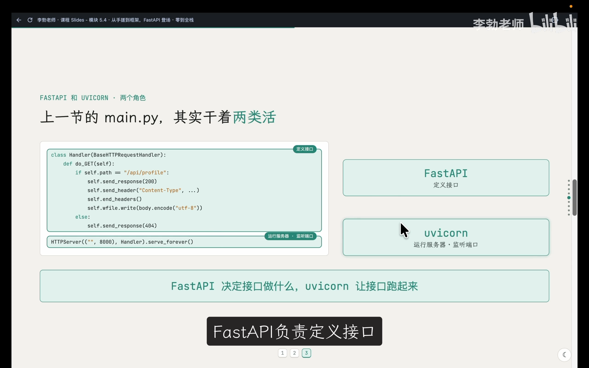

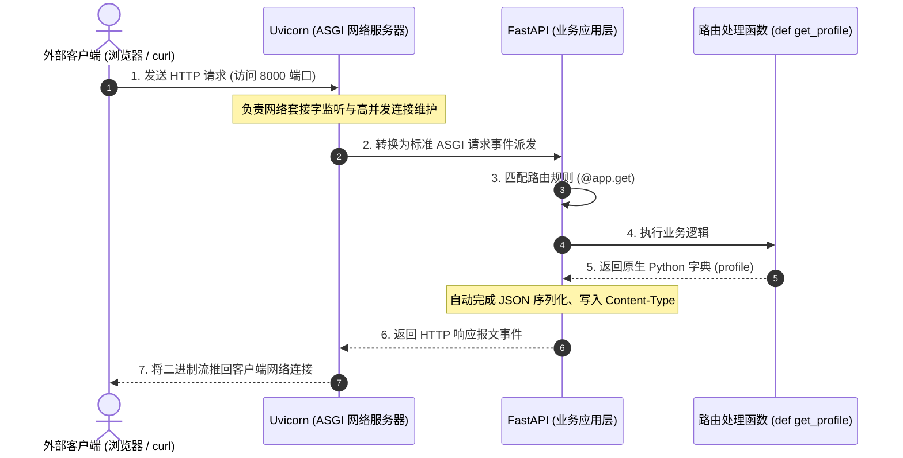
```mermaid
sequenceDiagram
    autonumber
    actor Client as 外部客户端 (浏览器 / curl)
    participant Uvicorn as Uvicorn (ASGI 网络服务器)
    participant FastAPI as FastAPI (业务应用层)
    participant Handler as 路由处理函数 (def get_profile)

    Client->>Uvicorn: 1. 发送 HTTP 请求 (访问 8000 端口)
    Note over Uvicorn: 负责网络套接字监听与高并发连接维护
    Uvicorn->>FastAPI: 2. 转换为标准 ASGI 请求事件派发
    FastAPI->>FastAPI: 3. 匹配路由规则 (@app.get)
    FastAPI->>Handler: 4. 执行业务逻辑
    Handler-->>FastAPI: 5. 返回原生 Python 字典 (profile)
    Note over FastAPI: 自动完成 JSON 序列化、写入 Content-Type
    FastAPI-->>Uvicorn: 6. 返回 HTTP 响应报文事件
    Uvicorn-->>Client: 7. 将二进制流推回客户端网络连接
```

* **FastAPI（应用大脑）**：决定接口做什么（路由、校验、组装数据）；
* **Uvicorn（动力引擎）**：负责监听端口、维持网络连接，并将 HTTP 数据流转交给 FastAPI。

### 安装 FastAPI 标准全家桶

确保位于 `zero-to-tech/backend/` 目录下且虚拟环境处于激活状态，执行安装命令：

```bash
pip install "fastapi[standard]"
```

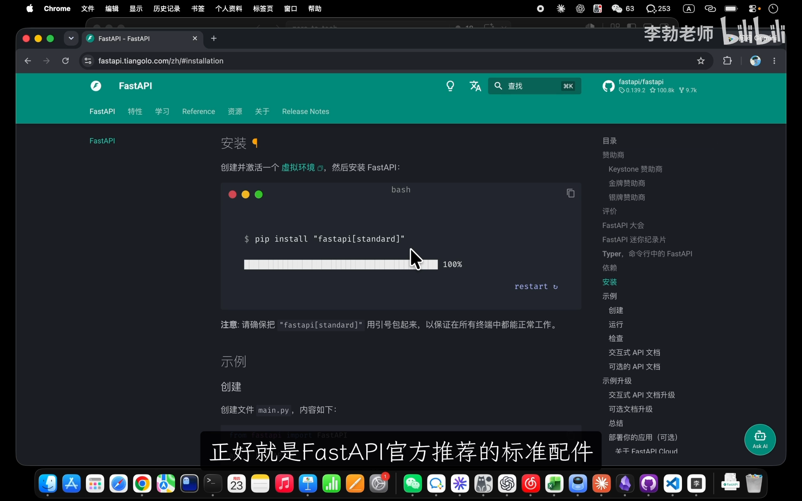

> [!NOTE]
> 包名后方中括号 `[standard]` 是 pip 的“扩展套餐”语法，表示在安装 FastAPI 本体的同时，自动捆绑拉取官方推荐的全部标准配件（包括高性能 ASGI 服务器 `uvicorn`、类型校验库 `pydantic` 等），省去逐一单独配置的麻烦。

---

## 4. 极简重构：重写 `GET /api/profile`
*(参考时间: 09:15)*

为了保留历史学习足迹，我们先将上一节的手搓文件重命名备份：
```bash
mv main.py handmade.py
```

接着，新建全新的 `main.py` 并写入以下代码：

```python
from fastapi import FastAPI

app = FastAPI()

profile = {
    "heroTitle": "关于我",
    "heroSubtitle": "项目, 创意, 灵感, 心得, 我的作品",
}

@app.get("/api/profile")
def get_profile():
    return profile
```

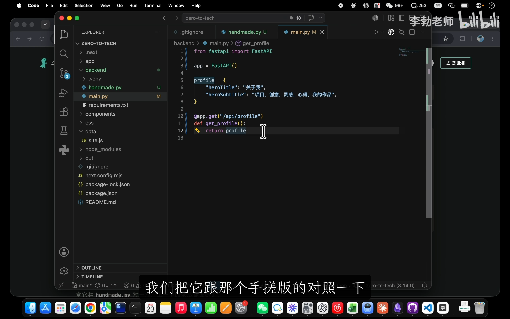

对比上一节手搓的数十行代码，框架重构后的代码仅仅只有 10 余行！

### 核心语法剖析

* `app = FastAPI()`：创建框架的核心应用实例；
* `@app.get("/api/profile")`：**路由装饰器（Route Decorator）**。向框架注册规则——凡是发往 `/api/profile` 的 `GET` 请求，全部交由下方绑定的函数处理；
* `return profile`：无需调用 `json.dumps()`，无需 `.encode("utf-8")`，直接返回原生 Python 字典，框架会自动将其序列化为合法的 JSON 字符串，并自动在响应头中附带 `Content-Type: application/json` 和状态码 `200 OK`。

---

## 5. 服务的运行与开发模式热重载
*(参考时间: 13:00)*

### 传统 Uvicorn 启动方式

```bash
uvicorn main:app --reload
```

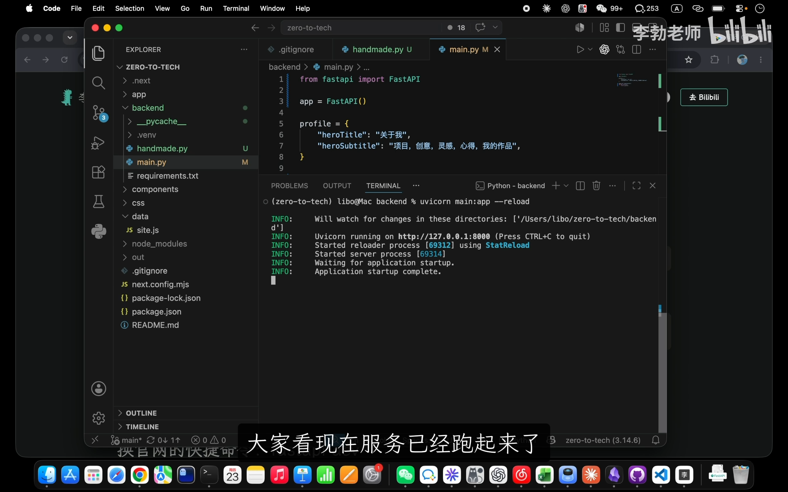

* `main:app`：冒号左侧的 `main` 对应 Python 文件名 `main.py`；右侧的 `app` 对应代码内部创建的 `app = FastAPI()` 实例对象；
* `--reload`：**开启热更新（Hot Reloading）**。文件保存后无需手动重启终端，后台进程会自动重新加载最新代码。

### 现代化官方标准命令：`fastapi dev`

FastAPI 新版本引入了专为开发量身定制的集成指令：
```bash
fastapi dev
```

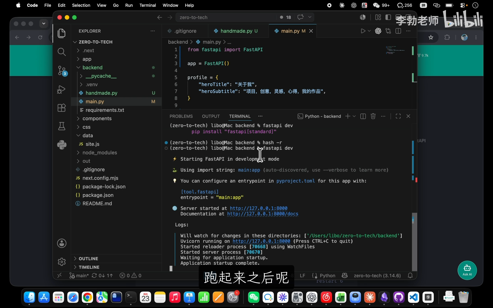

`fastapi dev` 默认自动定位当前目录下的 `main.py` 及其中的 `app`，并全自动开启热更新与详细调试日志，更加简洁直观。

> [!TIP]
> 如果首次运行提示 `command not found: fastapi`，说明终端尚未更新虚拟环境的可执行程序缓存，在终端执行 `hash -r` 刷新命令索引即可。

### 接口调用与 404 智能兜底

在另一个终端使用 `curl` 验证接口：
```bash
curl http://localhost:8000/api/profile
```
终端立即返还了正确的 JSON 数据：
```json
{"heroTitle":"关于我","heroSubtitle":"项目, 创意, 灵感, 心得, 我的作品"}
```

如果故意访问一个不存在的路由（如 `curl http://localhost:8000/hi`）：

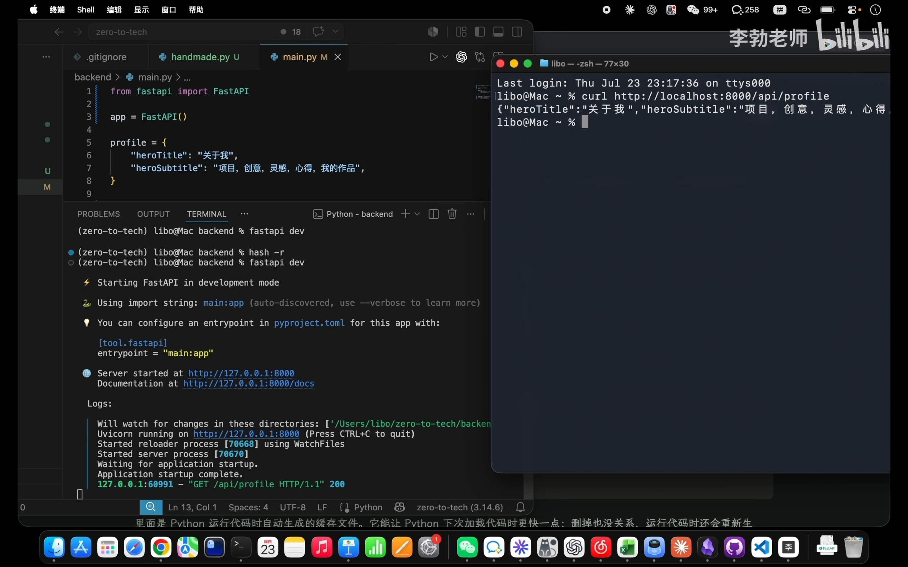

FastAPI 会自动拦截并返回标准的 HTTP 404 响应：
```json
{"detail":"Not Found"}
```
我们无需编写任何 `else` 兜底逻辑，框架已将异常处理打磨至极致。

### 配置 Git 忽略文件

服务运行后，Python 会在项目根目录下生成 `__pycache__/` 目录，存放编译好的 `.pyc` 字节码文件以加速下次启动。此类缓存属于运行产物，严禁提交进代码仓库。

在根目录 `.gitignore` 中追加：
```gitignore
# Python 字节码缓存目录与文件
__pycache__/
*.pyc
```

---

## 6. 神仙特性：自动生成的 Swagger 交互式文档
*(参考时间: 19:20)*

启动服务时，控制台有一行引人注目的日志：
```text
INFO:     Documentation at: http://127.0.0.1:8000/docs
```

在浏览器中直接访问该地址，屏幕上呈现出一个完全由框架根据代码静态推导生成的 **Swagger UI 交互式接口文档**：

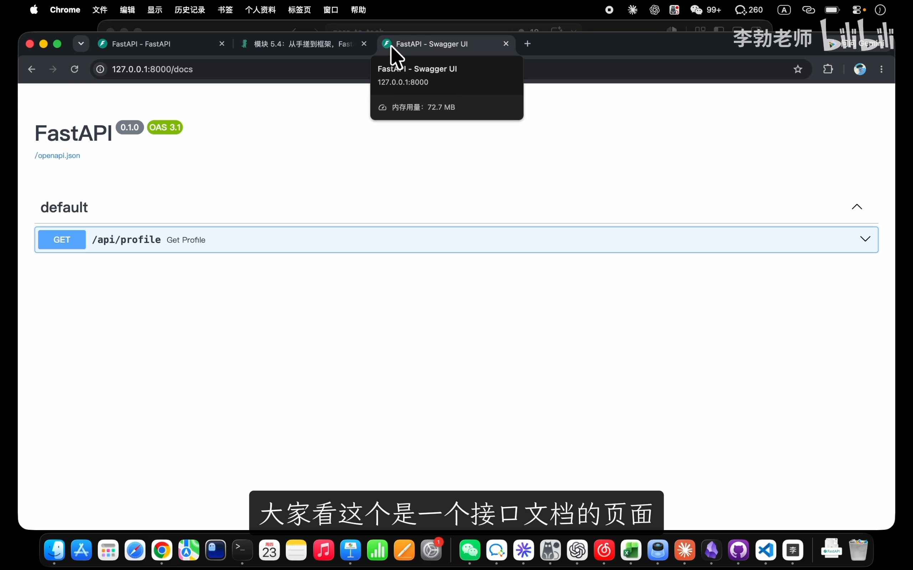

点开接口条目，点击右侧的 **`Try it out`** 并点击 **`Execute`**，网页将直接向本地运行的后端发起真实的 HTTP 请求，并在下方清晰展示 `Request URL`、`Response Body` 以及 `Response Headers`：

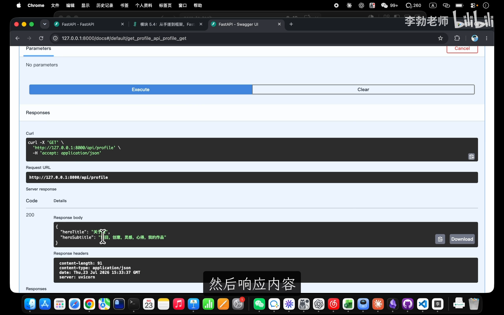

这彻底解决了传统全栈开发中“代码更新了但文档遗漏未改”的行业通病，前后端协作调试效率成倍提升。

---

## 7. 实战进阶：增加 `POST /api/analyze` 与 Pydantic 校验闸门
*(参考时间: 21:00)*

在前端第 3 模块中，我们曾经开发过一个“文字实验室（Text Lab）”组件，用户在文本框输入文字后，页面需要展示原文、拼音、字数评分与情感倾向卡片。

现在，我们为该业务量身打造一个 `POST` 接口。

### 业务接口需求定义

1. **客户端入参**：必须提交一个 JSON 对象，包含文本字段 `text`（字符串类型）；
2. **服务端返回**：返回带有四个卡片结果的 JSON 数据。

在 `main.py` 中引入 Pydantic 的 `BaseModel` 并扩建代码：

```python
from fastapi import FastAPI
from pydantic import BaseModel

app = FastAPI()

# 1. 定义入参数据结构规范 (Schema)
class AnalyzeRequest(BaseModel):
    text: str

# 原个人资料数据保持不变
profile = {
    "heroTitle": "关于我",
    "heroSubtitle": "项目, 创意, 灵感, 心得, 我的作品",
}

@app.get("/api/profile")
def get_profile():
    return profile

# 2. 注册 POST 路由并挂载请求体模型
@app.post("/api/analyze")
def analyze(req: AnalyzeRequest):
    return {
        "text": req.text,
        "score": 0.5,
        "label": "偏平静",
        "pinyin": "（模块 6 再说）",
    }
```

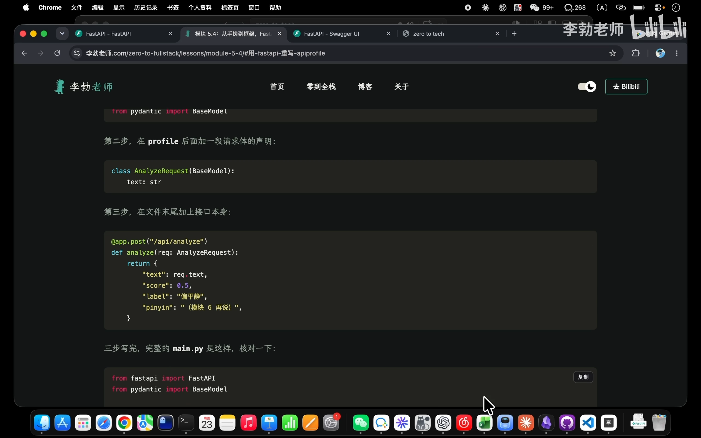

### Pydantic 数据校验闸门机制

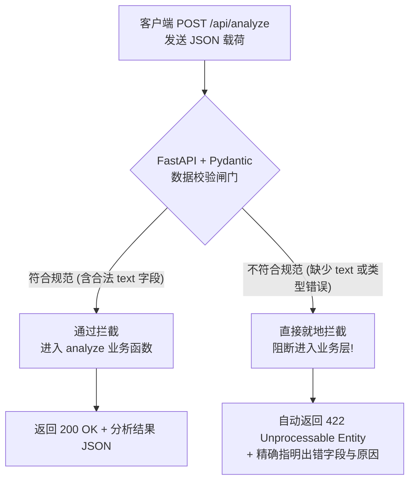
```mermaid
flowchart TD
    ClientReq["客户端 POST /api/analyze<br/>发送 JSON 载荷"] --> Gateway{"FastAPI + Pydantic<br/>数据校验闸门"}

    Gateway -- "符合规范 (含合法 text 字段)" --> SuccessBranch["通过拦截<br/>进入 analyze 业务函数"]
    SuccessBranch --> Return200["返回 200 OK + 分析结果 JSON"]

    Gateway -- "不符合规范 (缺少 text 或类型错误)" --> RejectBranch["直接就地拦截<br/>阻断进入业务层!"]
    RejectBranch --> Return422["自动返回 422 Unprocessable Entity<br/>+ 精确指明出错字段与原因"]
```

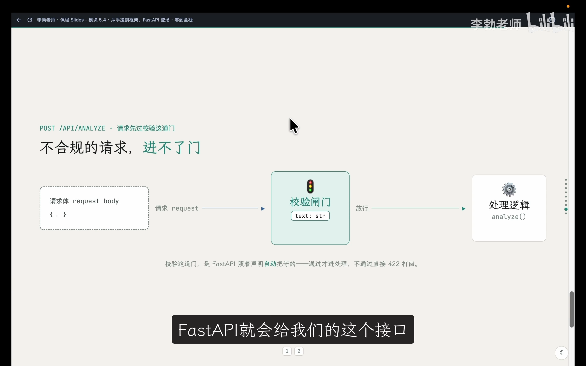

我们仅仅在函数入参中写了 `req: AnalyzeRequest`，FastAPI 就会在底层自动调用 Pydantic 执行严格的格式审查。

### 正确请求测试

在终端中发起符合规约的 POST 请求：
```bash
curl http://localhost:8000/api/analyze \
  -H "Content-Type: application/json" \
  -d '{"text": "今天的风很轻，适合把想法写下来"}'
```

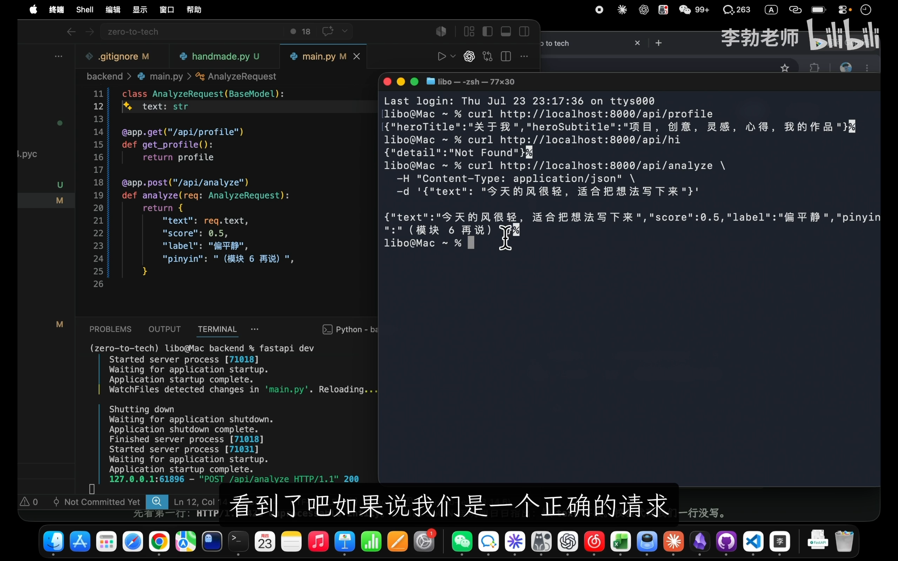

终端成功获得期望的数据结构返回：
```json
{"text":"今天的风很轻，适合把想法写下来","score":0.5,"label":"偏平静","pinyin":"（模块 6 再说）"}
```

---

## 8. 调试与排错：422 vs 500 与 Traceback 抓漏秘籍
*(参考时间: 28:00)*

### 场景一：客户端参数错误（422 Unprocessable Entity）

如果客户端不小心把 `text` 字段少打了一个字母写成了 `txt`：
```bash
curl -i -X POST http://localhost:8000/api/analyze \
  -H "Content-Type: application/json" \
  -d '{"txt": "你好，全栈！"}'
```

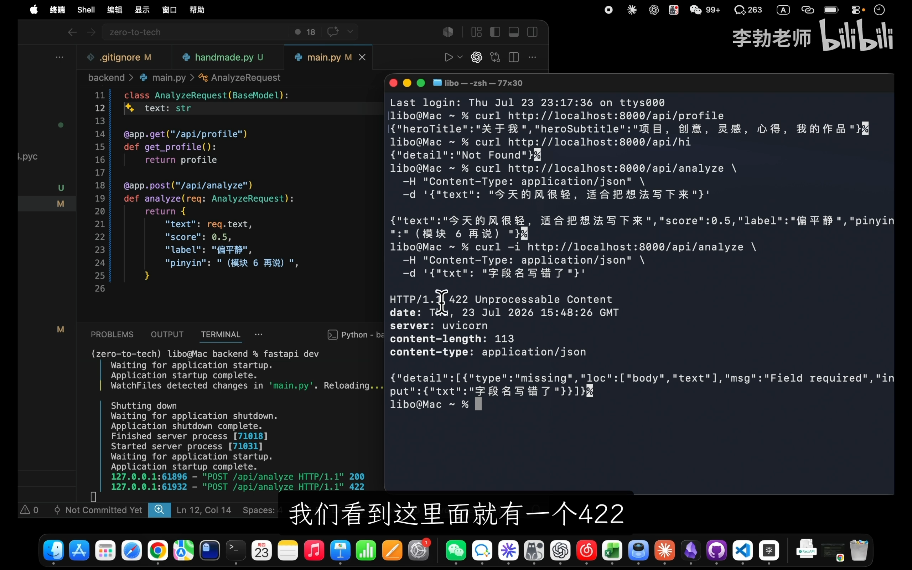

终端立即拦截并返回了详细的报错清单：
```http
HTTP/1.1 422 Unprocessable Entity
content-type: application/json
```
```json
{
  "detail": [
    {
      "type": "missing",
      "loc": ["body", "text"],
      "msg": "Field required",
      "input": {"txt": "你好，全栈！"}
    }
  ]
}
```

> [!TIP]
> **HTTP 状态码的责任划分**：
> * **`4xx`（如 422）**：代表**调用方（客户端）的过错**。请求参数缺失或非法，服务端守门人拒绝入内；
> * **`5xx`（如 500）**：代表**被调用方（服务端）的过错**。业务代码逻辑抛出未捕获的严重异常。

### 场景二：服务端代码 Bug（500 Internal Server Error）

假设后端开发者在处理函数中手滑写错，试图访问不存在的属性（如 `return {"text": req.txt, ...}`）：

客户端发送正确的请求后，服务端直接崩溃并返回：
```http
HTTP/1.1 500 Internal Server Error
```
```json
{"detail":"Internal Server Error"}
```

此时客户端只知道服务器内部出错了，但无法探知具体的代码行。**此时排查问题的唯一阵地是服务端的控制台终端**。

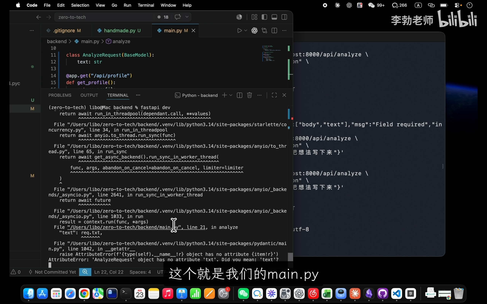

### 读懂 Python Traceback 的两大诀窍

面对终端刷出的一长串调用栈，切忌慌乱关掉窗口。掌握以下两个排查顺序，10 秒内定位根因：

1. **第一眼直奔最底行**：最末尾的一行直接道破了错误原因（Root Cause）：
   ```text
   AttributeError: 'AnalyzeRequest' object has no attribute 'txt'
   ```
2. **从下往上找自己编写的文件**：跳过框架和 Python 库内部的繁杂栈帧，寻找带有 `main.py` 的行号标识：
   ```text
   File ".../zero-to-tech/backend/main.py", line 28, in analyze_text
   ```
   清晰定位第 28 行！将 `req.txt` 改回 `req.text` 保存，热重载自动修复，服务满血复活。

---

## 9. 依赖固化与版本提交
*(参考时间: 33:40)*

本节通过 `pip install "fastapi[standard]"` 引入了完整的现代后端技术栈。按照工程规范，必须将更新后的依赖版本精确写入清单：

```bash
pip freeze > requirements.txt
```

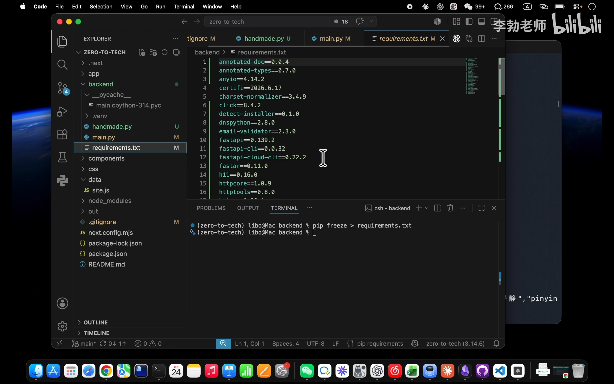

此时打开 `requirements.txt`，可以看到 `fastapi`、`uvicorn`、`pydantic`、`starlette` 等数十个核心依赖库均已精确锚定版本号。

在 Git 中完成本次里程碑的提交：
```bash
git add main.py handmade.py requirements.txt .gitignore
git commit -m "feat: 使用 FastAPI 重构后端并实现参数校验与自动化文档"
```

---

## 10. 本节小结与下一阶段展望
*(参考时间: 35:00)*

在本节中，我们见证了从原生手搓到现代 Web 框架的降维式提升：
* **路由派发**：从繁复的字符串 `if...else` 进化为优雅的 `@app.get` / `@app.post` 装饰器；
* **异步引擎**：利用 Uvicorn 实现了高并发请求接管与热更新开发体验；
* **数据校验**：基于 Pydantic 的 `BaseModel` 筑起了牢固的数据防线；
* **交互文档**：开箱即用的 `/docs` Swagger UI 彻底重塑了接口自解释与在线调试标准。

此时此刻，我们的前端页面在 `localhost:3000` 优雅呈现，后端接口在 `localhost:8000` 蓄势待发。然而，前后端之间依然是一座孤岛。在下一讲中，我们将让前端正式跨越端口调用这两个后端接口，并彻底攻克现代全栈开发中无人能逃的经典关卡——**跨域资源共享（CORS）**。
