# 第 23 讲：前后端联调和 CORS（5.5）

在之前的章节中，我们已经分别完成了两项独立工程：
1. **前端工程**：基于 Next.js 开发的高颜值响应式个人作品集与文字实验室界面，但页面上展示的文本仍然写死在静态的 `site.js` 中；
2. **后端工程**：基于 FastAPI 构建了两个接口——`GET /api/profile`（获取个人主页数据）与 `POST /api/analyze`（提交文本并进行校验与多维度分析），但此前仅在终端中使用 `curl` 进行过单元调试。

此时此刻，前端与后端犹如两个各自能跑、却互不相识的独立王国。

本节我们将正式拉开**前后端集成联调（Integration）**的序幕，让运行在浏览器中的前端脚本跨越端口向后端发起真实请求。在此过程中，我们将直面现代 Web 全栈开发中最著名的经典门槛——**跨源资源共享（CORS）**与 **OPTIONS 预检（Preflight）机制**，并建立生产级的环境变量集中配置体系。

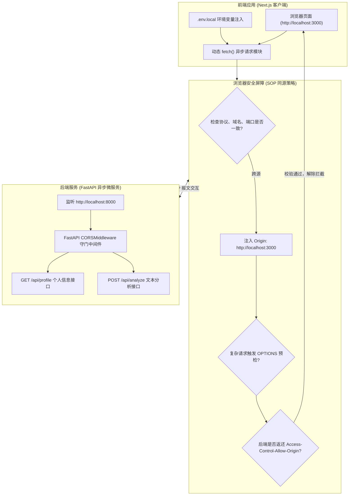
```mermaid
flowchart TD
    subgraph FrontendApp ["前端应用 (Next.js 客户端)"]
        direction TB
        BrowserPage["浏览器页面 (http://localhost:3000)"]
        FetchModule["动态 fetch() 异步请求模块"]
        EnvConfig[".env.local 环境变量注入"]
        EnvConfig --> FetchModule
        BrowserPage --> FetchModule
    end

    subgraph SecurityBorder ["浏览器安全屏障 (SOP 同源策略)"]
        direction TB
        CheckOrigin{"检查协议、域名、端口是否一致?"}
        OriginHeader["注入 Origin: http://localhost:3000"]
        PreflightCheck{"复杂请求触发 OPTIONS 预检?"}
        CORSResponse{"后端是否返还 Access-Control-Allow-Origin?"}

        CheckOrigin -->|跨源| OriginHeader
        OriginHeader --> PreflightCheck
        PreflightCheck --> CORSResponse
    end

    subgraph BackendApp ["后端服务 (FastAPI 异步微服务)"]
        direction TB
        ListenPort["监听 http://localhost:8000"]
        CORSMiddleware["FastAPI CORSMiddleware 守门中间件"]
        ProfileRoute["GET /api/profile 个人信息接口"]
        AnalyzeRoute["POST /api/analyze 文本分析接口"]

        ListenPort --> CORSMiddleware
        CORSMiddleware --> ProfileRoute
        CORSMiddleware --> AnalyzeRoute
    end

    FetchModule --> SecurityBorder
    SecurityBorder <-->|HTTP 报文交互| BackendApp
    CORSResponse -->|校验通过，解除拦截| BrowserPage
```

---

## 1. 联调准备：双进程常驻与调试环境规划
*(参考时间: 01:10)*

前后端分离架构的调试，必须在本地操作系统中**同时并行运行两个服务进程**：

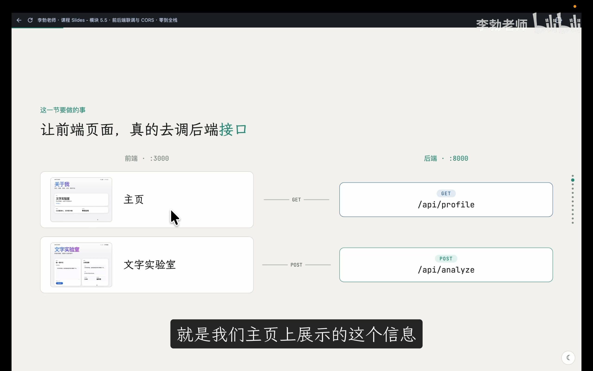

* **前端开发服务器**：运行在 `http://localhost:3000`（由 Next.js 驱动）；
* **后端 API 服务器**：运行在 `http://localhost:8000`（由 FastAPI / Uvicorn 驱动）。

为了便于左右对比观测控制台日志，我们可以开启两个终端窗口。视频中演示使用了支持分屏特性的现代化终端工具 **Ghostty**，也可以直接在 VS Code 内部通过拆分终端（Split Terminal）实现双屏监控：

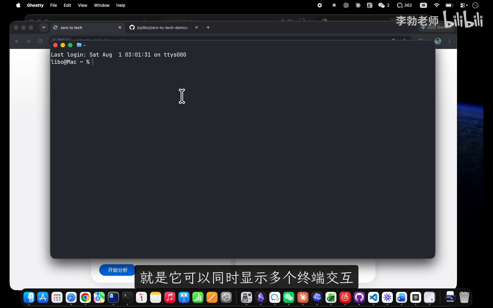

```bash
# 终端 1：启动前端 Next.js 服务
cd zero-to-tech
npm run dev

# 终端 2：启动后端 FastAPI 服务
cd zero-to-tech/backend
fastapi dev
```

---

## 2. 丰富后端接口：同步真实页面完整字段
*(参考时间: 03:00)*

在第 22 讲中，为了讲解极简入门，我们的 `profile` 字典仅包含了 `heroTitle` 和 `heroSubtitle`。但前端主页要呈现完整的个人名片、关于我、作品列表等内容，数据字段远比这两个字段丰富。

我们将原本静态的 `data/site.js` 中的 `home` 结构完整迁移至后端的 `main.py` 中，并刻意将主标题微调为 **`"关于我（来自后端）"`** 作为视觉锚点，以便在浏览器中一目了然地确认数据是否真正来源于后端：

```python
from fastapi import FastAPI
from pydantic import BaseModel

app = FastAPI()

class AnalyzeRequest(BaseModel):
    text: str

profile = {
    "heroTitle": "关于我（来自后端）",
    "heroSubtitle": "项目, 创意, 灵感, 心得, 我的作品",
    "about": "这里是一段从后端 API 动态获取并实时渲染的个人简介内容...",
    "projects": [
        {"title": "全栈教程", "desc": "从零单排全栈技术体系", "link": "/course"},
        {"title": "文字实验室", "desc": "基于 AI 与 NLP 的文本情感分析", "link": "/lab"}
    ]
}

@app.get("/api/profile")
def get_profile():
    return profile

@app.post("/api/analyze")
def analyze(req: AnalyzeRequest):
    return {
        "text": req.text,
        "score": 0.5,
        "label": "偏平静",
        "pinyin": "（模块 6 再说）",
    }
```

保存后，后端 Uvicorn 触发热更新。在终端使用 `curl` 验证：
```bash
curl http://localhost:8000/api/profile
```

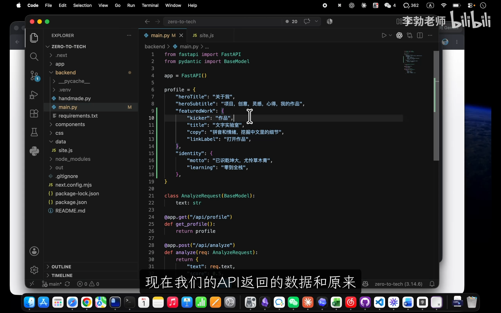

后端接口就绪，返回数据无误！

---

## 3. 前端客户端组件重构：从静态到动态 `fetch`
*(参考时间: 06:20)*

接下来改造前端。前端原本的代码直接静态导入了本地 JS 文件，现在需要改为在浏览器中动态向 `http://localhost:8000` 发起网络请求。

我们将课程官方提供的联调示例组件（包含 `HomeView.tsx`、`InputCard.tsx`、`ResultCard.tsx` 等）覆盖至前端项目对应的目录中：

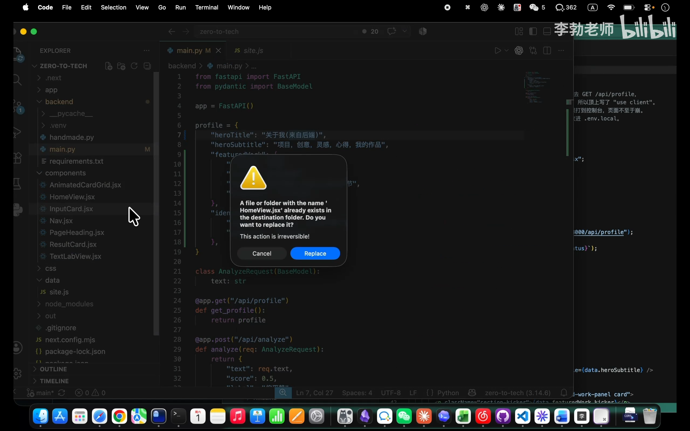

### 核心改造点解析

1. **`use client` 声明**：
   在 Next.js App Router 中，默认的 Server Components 无法直接使用浏览器特定的事件监听和生命周期钩子。为了在用户浏览器中执行 `fetch` 请求并用 `useState` / `useEffect` 驱动 UI 重新渲染，文件首行必须显式标记 `'use client'`。
2. **渐进式数据降级（Graceful Degradation）**：
   在请求发起且后端尚未返回的短暂空窗期内，组件依然保留本地 `site.js` 中的默认数据进行“骨架占位”，避免页面在首屏出现刺眼的闪烁或空白。
3. **事件驱动 POST**：
   在文字实验室的 `InputCard` 中，用户点击“开始分析”按钮后，将文本框中的内容组装为 JSON 载荷，通过 `fetch('http://localhost:8000/api/analyze', { method: 'POST', ... })` 发送至后端。

---

## 4. 第一次翻车：排查三现场诊断法
*(参考时间: 11:10)*

按理说前后端都已编写完备，此时打开浏览器访问 `http://localhost:3000`：

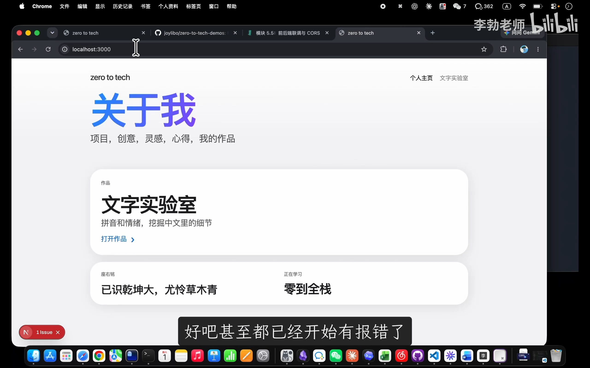

页面上的大标题依然是旧内容，并未展示后端的“关于我（来自后端）”！后端明明通过 `curl` 验证过，前端也是官方代码，数据究竟卡死在了哪一环？

> [!TIP]
> **排查全栈网络故障的“三现场排查法”**：
> 1. **现场一：浏览器开发者工具 Network 面板**（请求是否真的发出去了？状态码是什么？）
> 2. **现场二：服务端的控制台终端**（后端到底有没有收到请求？有没有抛出未捕获异常？）
> 3. **现场三：浏览器开发者工具 Console 面板**（数据回到客户端后，浏览器引擎作出了什么裁决？）

### 现场一：查看浏览器 Network 面板

在页面按 F12 打开 Network 面板并刷新：

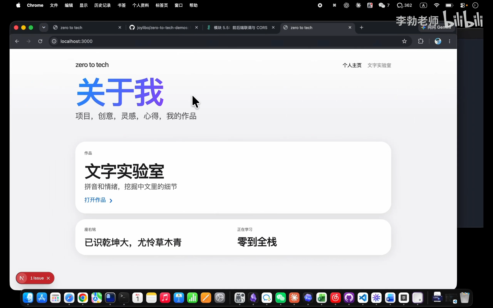

我们找到了发往 `/api/profile` 的网络记录，不仅请求发出去了，而且状态码赫然显示为 **`200 OK`**！这证明前端网络逻辑完全正确。

### 现场二：查看后端服务端控制台

切换到后端的终端窗口：

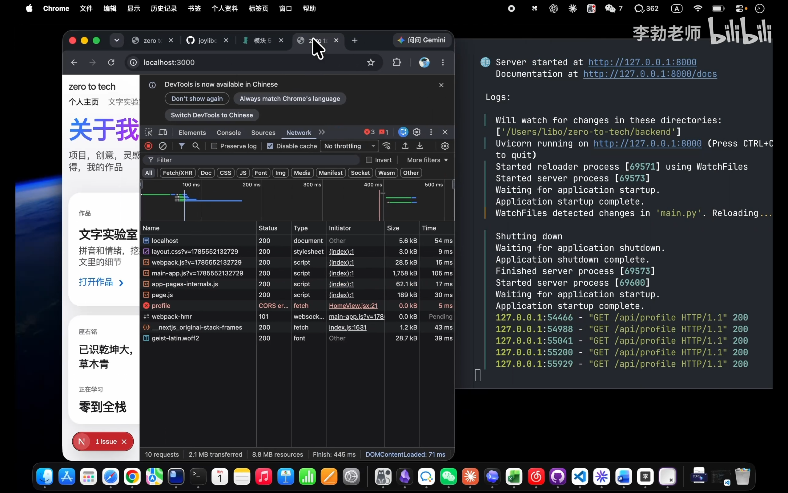

控制台实时滚出了访问日志：`"GET /api/profile HTTP/1.1" 200 -`。这证明请求已经到达后端，后端顺利处理并把数据完整推回了网络连接。

### 现场三：查看浏览器 Console 面板

既然一去一回都完成了，为什么页面就是拿不到数据？打开 Console 面板，真相大白：

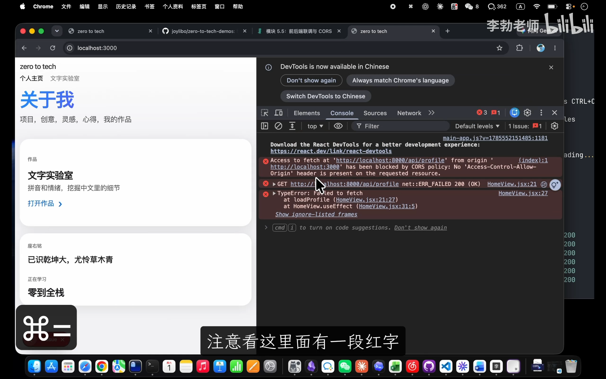

屏幕上打印出前端开发者最为熟知的刺目红字：
```text
Access to fetch at 'http://localhost:8000/api/profile' from origin 'http://localhost:3000'
has been blocked by CORS policy: No 'Access-Control-Allow-Origin' header is present on the requested resource.
```

---

## 5. 探秘同源策略与 CORS 本质
*(参考时间: 15:30)*

为什么此前用 `curl` 测试一路绿灯，一换到浏览器就会被无情拦截？

> [!IMPORTANT]
> **CORS（Cross-Origin Resource Sharing，跨源资源共享）限制是且仅是“浏览器”为了保护最终用户而制定的安全围栏，绝非 HTTP 协议本身的限制，更不是服务端的故障**。
> `curl`、Postman、Python 脚本等非浏览器工具不受同源策略约束，因此永远不会被 CORS 拦截。

### 什么是“源”（Origin）？同源三要素

对于浏览器而言，一个合法的“源”由三项绝对要素共同界定：

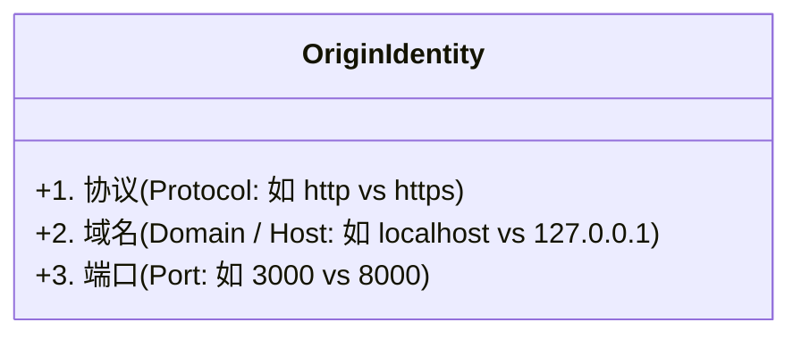
```mermaid
classDiagram
    class OriginIdentity {
        +1. 协议 (Protocol: 如 http vs https)
        +2. 域名 (Domain / Host: 如 localhost vs 127.0.0.1)
        +3. 端口 (Port: 如 3000 vs 8000)
    }
```

三者只要有**任意一项不完全一致**，浏览器便将其视为两个互不信任的“不同源（Cross-Origin）”。在我们的联调场景中：
* 前端页面跑在 `http://localhost:3000`；
* 后端服务跑在 `http://localhost:8000`；
* 协议相同、域名相同，但**端口不同（3000 ≠ 8000）**，因此构成了典型的跨源调用。

### 浏览器拦截的微观过程

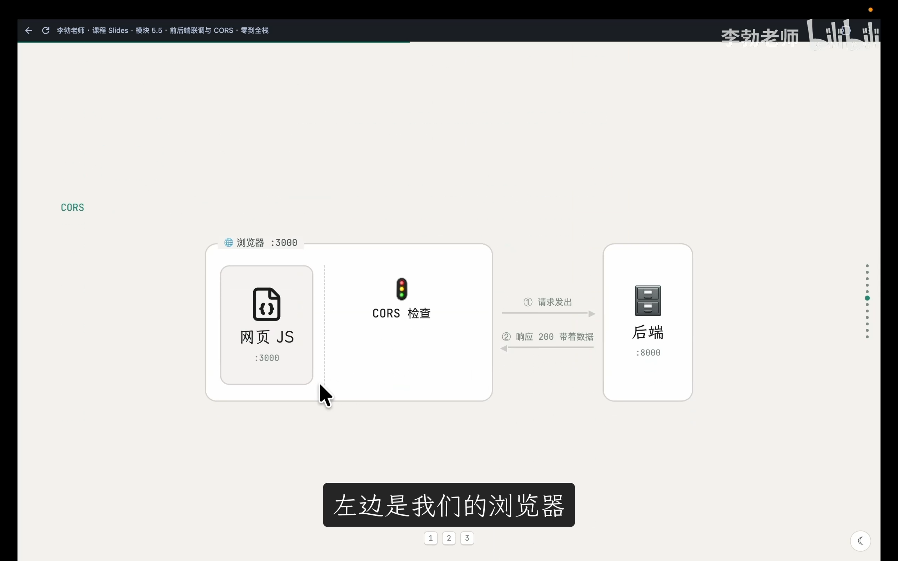

1. 前端在 `localhost:3000` 页面内通过 JS 发起请求，浏览器会自动在请求头中盖上公章：
   ```http
   Origin: http://localhost:3000
   ```
2. 后端接收请求并返回正常数据；
3. 响应报文进入浏览器后，**浏览器的同源安全引擎立即执行核验**：它翻遍了响应头，发现服务端**没有返回 `Access-Control-Allow-Origin` 响应头**；
4. 浏览器得出结论：“服务端并未显式授权 `localhost:3000` 的脚本读取该数据”，随即就地拉下电闸，拒绝把已到达内存的数据交给前端 JavaScript，并在控制台抛出 CORS 阻断异常。

---

## 6. 破局之道：FastAPI 中间件与 CORSMiddleware
*(参考时间: 18:30)*

解决该问题的钥匙在**服务端**手中：只要后端在响应报文中附带合法的 `Access-Control-Allow-Origin` 响应头，明确告知浏览器“我允许 `http://localhost:3000` 读取我的数据”，安全锁便会自动解除。

如果在每个接口函数里手动写 `send_header`，项目中有成百上千个接口将不堪重负。FastAPI 提供了优雅的全局管道——**中间件（Middleware）**。

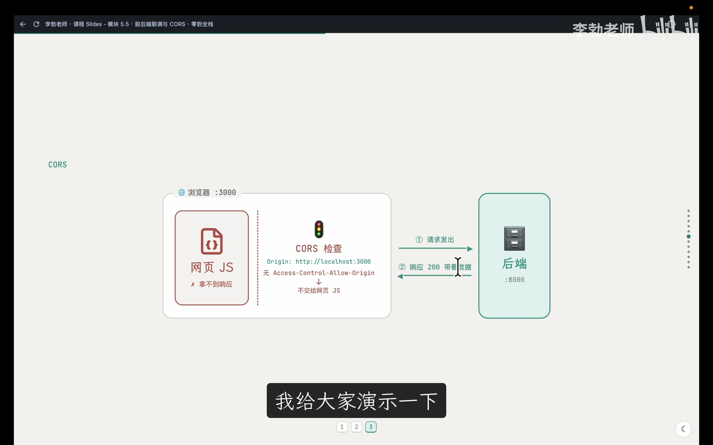

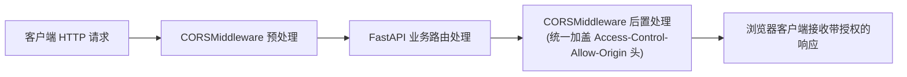
```mermaid
flowchart LR
    ClientReq["客户端 HTTP 请求"] --> MW_In["CORSMiddleware 预处理"]
    MW_In --> RouteLogic["FastAPI 业务路由处理"]
    RouteLogic --> MW_Out["CORSMiddleware 后置处理<br/>(统一加盖 Access-Control-Allow-Origin 头)"]
    MW_Out --> ClientResp["浏览器客户端接收带授权的响应"]
```

### 在 FastAPI 中挂载 CORSMiddleware

在 `zero-to-tech/backend/main.py` 中引入并激活中间件：

```python
from fastapi import FastAPI
from fastapi.middleware.cors import CORSMiddleware
from pydantic import BaseModel

app = FastAPI()

# 挂载 CORS 中间件，向特定前端源开放授权
app.add_middleware(
    CORSMiddleware,
    allow_origins=["http://localhost:3000"],  # 白名单放行源
)
```

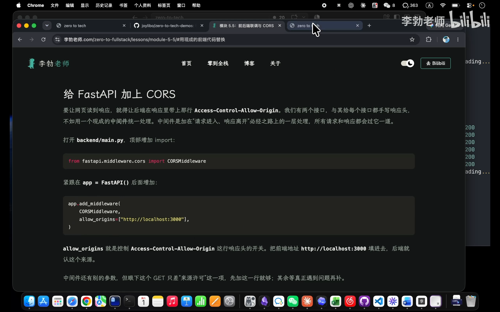

代码保存后，回到浏览器刷新页面：

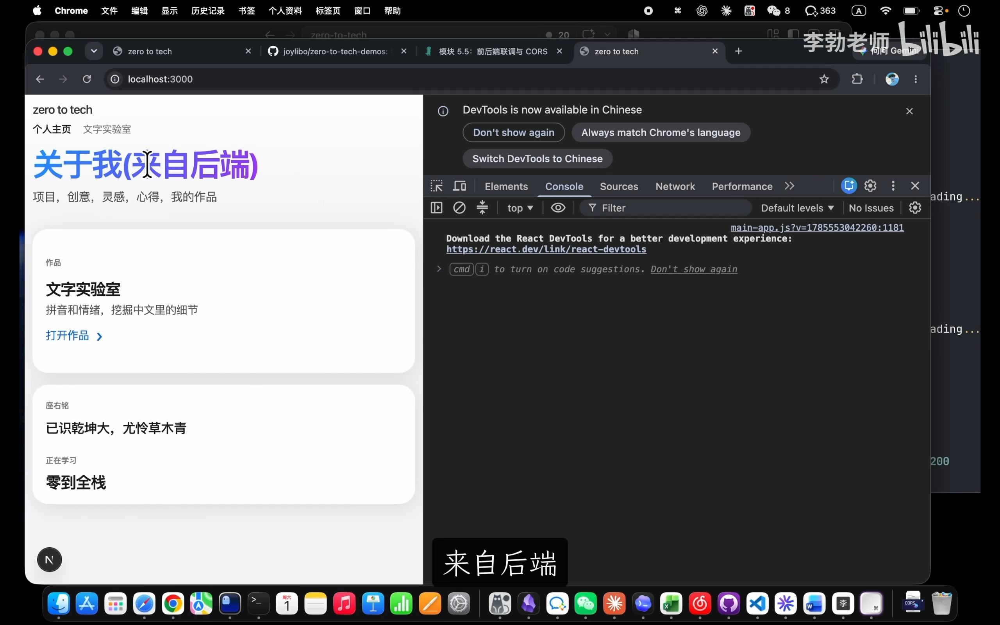

大标题瞬间刷新为 **“关于我（来自后端）”**！检查 Network 面板，Response Headers 中赫然多出了 `Access-Control-Allow-Origin: http://localhost:3000`，`GET` 接口成功打通。

---

## 7. 第二次翻车：文字实验室的神秘 `OPTIONS` 预检
*(参考时间: 22:30)*

主页的 `GET` 成功了，那文字实验室的 `POST` 接口如何？

切换到文字实验室页面，在文本框输入一段文字并点击“开始分析”：
控制台瞬间再次飘红，页面弹出提示：`TypeError: Failed to fetch`。

打开 Network 面板观察发出的请求：

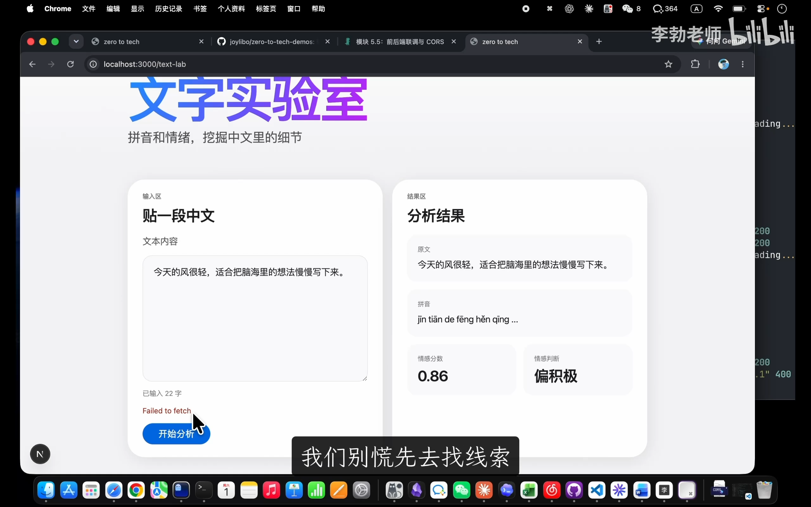

奇怪的现象发生了：我们在前端代码里明明写的是 `method: 'POST'`，为什么 Network 面板上记录的不是 `POST`，而是一个名为 **`OPTIONS`** 的请求？且这个 `OPTIONS` 居然触发了 `CORS error`！

### 简单请求 vs 复杂请求（预检机制）

这是浏览器的又一层高级防护。在同源策略规范中，跨源请求被严格划分为两类：

| 请求类别 | 典型特征 | 浏览器策略 |
| :--- | :--- | :--- |
| **简单请求 (Simple Request)** | 普通 `GET` / `HEAD`，且仅携带最基础的标准头 | 浏览器**直接发出**真实请求，事后检查响应头 |
| **复杂请求 (Preflighted Request)** | `POST` / `PUT` / `DELETE`，或声明了 **`Content-Type: application/json`** | 浏览器**严禁直接发出真实请求**，必须先派兵探路（预检） |

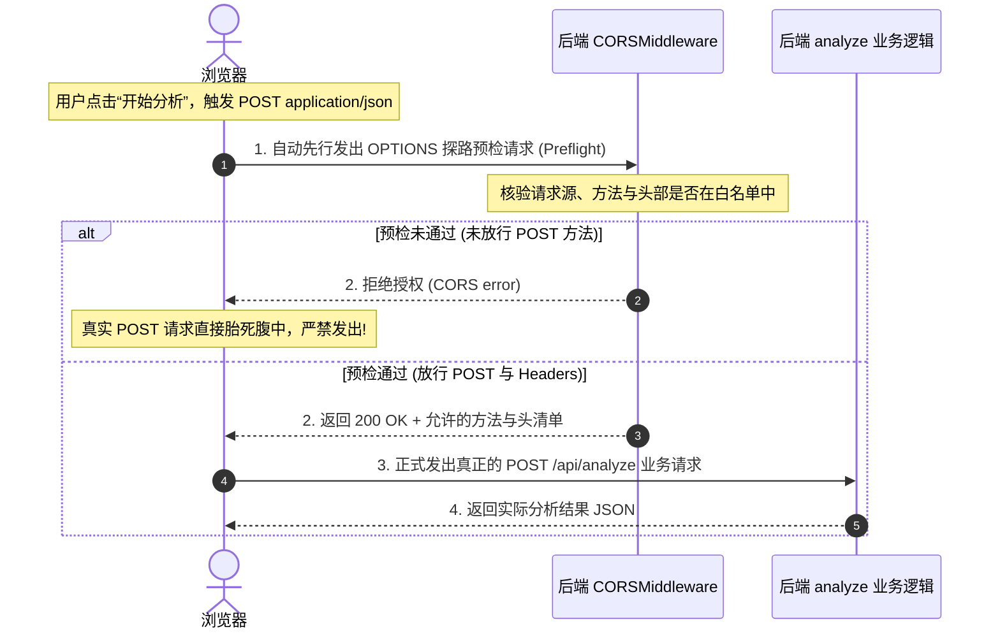
```mermaid
sequenceDiagram
    autonumber
    actor Browser as 浏览器
    participant Middleware as 后端 CORSMiddleware
    participant API as 后端 analyze 业务逻辑

    Note over Browser: 用户点击“开始分析”，触发 POST application/json
    Browser->>Middleware: 1. 自动先行发出 OPTIONS 探路预检请求 (Preflight)
    Note over Middleware: 核验请求源、方法与头部是否在白名单中
    alt 预检未通过 (未放行 POST 方法)
        Middleware-->>Browser: 2. 拒绝授权 (CORS error)
        Note over Browser: 真实 POST 请求直接胎死腹中，严禁发出!
    else 预检通过 (放行 POST 与 Headers)
        Middleware-->>Browser: 2. 返回 200 OK + 允许的方法与头清单
        Browser->>API: 3. 正式发出真正的 POST /api/analyze 业务请求
        API-->>Browser: 4. 返回实际分析结果 JSON
    end
```

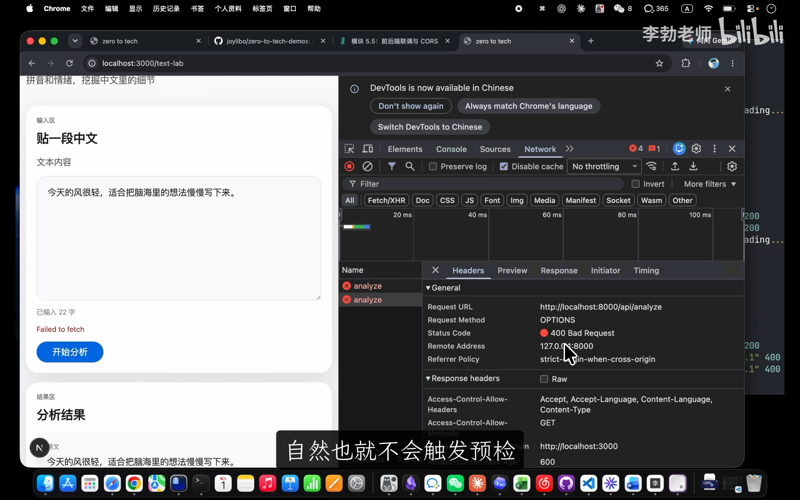

### 为什么必须存在预检？防止不可逆的严重副作用

如果是转账或删库的 `POST` 操作，一旦由于服务端未设防先发了出去，即便浏览器在收到结果后进行 CORS 阻断，**服务端的数据库也已经被彻底修改，覆水难收**！

因此，对于带有 JSON 载荷的复杂请求，浏览器坚持**宁可先问后发**。先发一个无害的 `OPTIONS` 方法向服务端打探底细：*“我接下来想使用 POST 方法并携带 JSON 请求头，请问你允许吗？”*

如果服务端在 `OPTIONS` 应答中明确点头，浏览器才会放行真正的 `POST` 载荷；如果不点头，真正的 `POST` 根本连离开浏览器的机会都没有！

---

## 8. 彻底放行：完善中间件的方法与头部白名单
*(参考时间: 29:00)*

此前我们的中间件配置仅写了 `allow_origins=["http://localhost:3000"]`，并没有告诉预检服务允许接收哪些方法和头部。当预检问询 `POST` 时，中间件只能按照默认策略予以回绝。

在中间件中追加 `allow_methods` 声明：

```python
app.add_middleware(
    CORSMiddleware,
    allow_origins=["http://localhost:3000"],
    allow_methods=["GET", "POST"],
)
```

> [!NOTE]
> * **`allow_methods`**：声明该接口允许被哪些 HTTP 方法跨源调用。当前项目中用到了 `GET` 和 `POST`，如实填写即可。
> * **关于 `allow_headers`**：预检其实还会问“能不能带某些请求头”。此处前端携带的 `Content-Type: application/json` 属于现代浏览器默认安全范围内的常见头，FastAPI / Starlette 中间件对此提供了开箱即用的支持，无需专门声明；将来如果请求要带自定义鉴权头（例如 `Authorization: Bearer <token>`），才需要在 `allow_headers` 中显式放行。

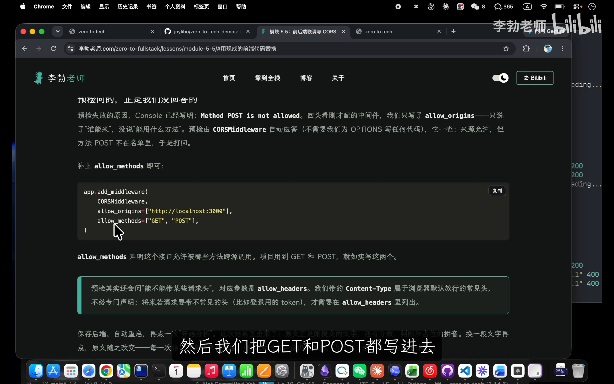

保存后重新在页面点击“开始分析”：

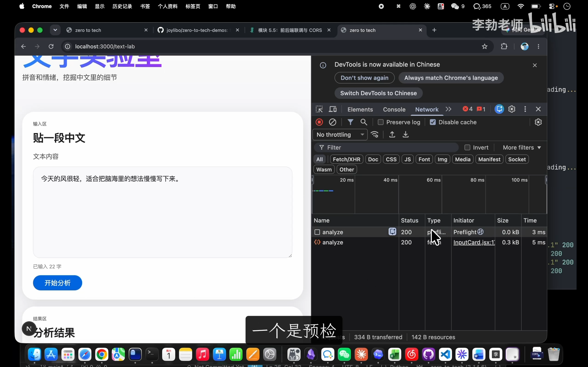

Network 面板上连贯出现了两条绿色的 200 记录：
1. **第 1 条 `OPTIONS /api/analyze` (200 OK)**：预检成功通过；
2. **第 2 条 `POST /api/analyze` (200 OK)**：真实业务请求成功执行！
页面下方的分析结果卡片瞬间点亮，文字、字数、情感倾向全线实时联动！

---

## 9. 工程化规范：告别代码中的 IP 硬编码
*(参考时间: 33:00)*

功能虽然全部跑通，但目前的代码中埋藏着一个极其危险的隐患：
我们在 `HomeView.tsx` 和 `InputCard.tsx` 中，直接将 `http://localhost:8000` 这串 URL 字符串硬编码（Hardcode）写死在了组件内部。

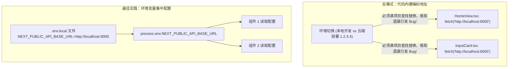
```mermaid
flowchart TD
    subgraph BadPractice ["反模式：代码内硬编码地址"]
        CodeComp1["HomeView.tsx: fetch('http://localhost:8000')"]
        CodeComp2["InputCard.tsx: fetch('http://localhost:8000')"]
        EnvChange["环境切换 (本地开发 vs 云端部署 1.2.3.4)"]
        EnvChange -->|必须满项目查找替换，极易遗漏引发 Bug!| CodeComp1
        EnvChange -->|必须满项目查找替换，极易遗漏引发 Bug!| CodeComp2
    end

    subgraph BestPractice ["最佳实践：环境变量集中配置"]
        EnvFile[".env.local 文件<br/>NEXT_PUBLIC_API_BASE_URL=http://localhost:8000"]
        ProcessEnv["process.env.NEXT_PUBLIC_API_BASE_URL"]
        EnvFile --> ProcessEnv
        ProcessEnv --> CodeComp1_ISO["组件 1 读取配置"]
        ProcessEnv --> CodeComp2_ISO["组件 2 读取配置"]
    end
```

在真实生产中，开发机是 `localhost:8000`，测试机是局域网 IP，云端生产机是顶级域名。如果写死在代码里，每次发布部署都必须修改源码并重新提交 Git，这是重大的工程禁忌。

**规则：配置与代码严格分离**。

### 创建 `.env.local` 环境变量文件

在前端项目根目录（与 `package.json` 同级）新建 `.env.local`：

```env
NEXT_PUBLIC_API_BASE_URL=http://localhost:8000
```

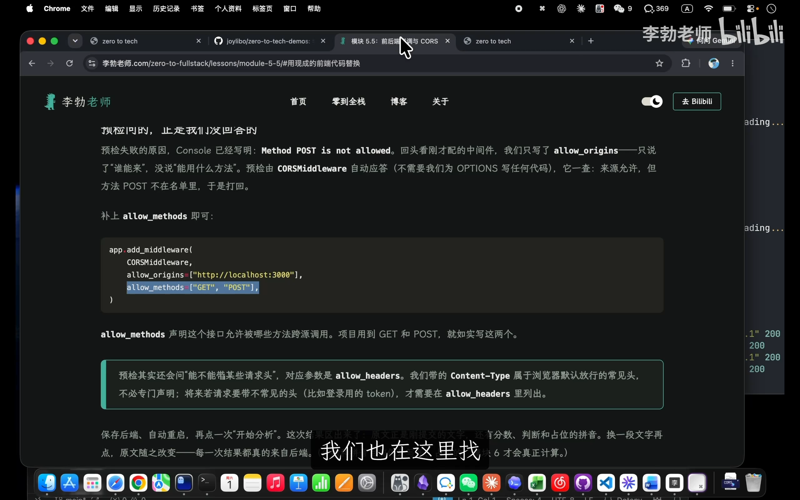

> [!NOTE]
> **Next.js 的命名安全边界**：
> 变量名必须以 **`NEXT_PUBLIC_`** 开头，Next.js 才会允许该配置变量在打包时被打包进客户端浏览器脚本中。普通的无前缀变量仅在 Node.js 服务端可见，以此防止后端私钥泄露。

### 组件动态读取环境变量

在前端组件（如 `components/InputCard.jsx` 与 `components/HomeView.jsx`）中统一通过 `process.env` 读取：

```javascript
// 提取环境变量基准地址
const API = process.env.NEXT_PUBLIC_API_BASE_URL;

// 动态拼装请求地址
const res = await fetch(`${API}/api/analyze`, {
  method: "POST",
  headers: { "Content-Type": "application/json" },
  body: JSON.stringify({ text }),
});
```

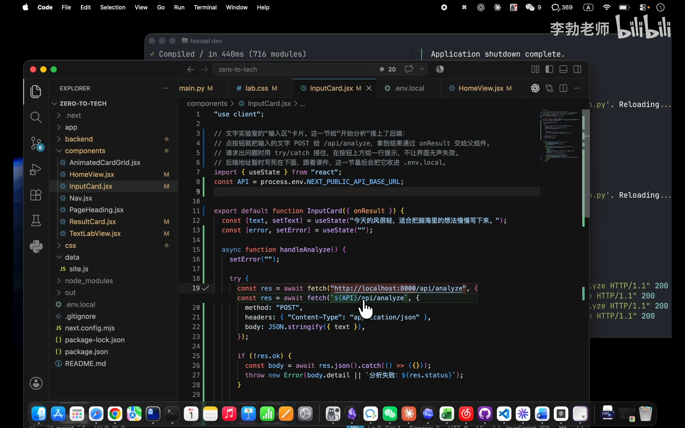

> [!IMPORTANT]
> 修改了 `.env.local` 文件后，必须**完全停止并重新启动前端开发服务器（`npm run dev`）**，新的环境变量才能在 Node.js 启动期被注入。

由于根目录 `.gitignore` 默认已经包含了 `.env*.local`，该本地环境配置文件绝不会被意外推送到公共代码仓库中。

---

## 10. 模块五全貌复盘与后续规划
*(参考时间: 39:50)*

至此，课程的第 5 大模块——**后端与接口体系**宣告圆满收官！我们完整经历了从零到全栈的关键成长跨越：

| 课时节点 | 核心突破点 |
| :--- | :--- |
| **5.1 什么是 API** | 建立调用方与被调用方心智模型，掌握 `curl` 调试真实世界 API |
| **5.2 Python 环境设置** | 掌握多解释器共存原理，建立 `venv` 独立沙箱与 `pip` 依赖版本锁定 |
| **5.3 理解 HTTP，手搓 API** | 剖析报文对称性与 `curl -v` 探秘，原生手搓 `http.server` 洞悉协议底层 |
| **5.4 FastAPI 入门** | 拥抱现代框架生产力，体验声明式路由、Pydantic 校验与 Swagger 自动文档 |
| **5.5 前后端联调与 CORS** | 全栈握手，彻底打通同源策略、CORS 中间件配置、OPTIONS 预检与环境变量治理 |

在当前的代码中，我们还留有两笔明显的“业务欠账”：
1. 分析接口中的拼音、情感倾向和打分目前还是假数据；
2. 用户每次分析完的记录用完即焚，刷新后荡然无存。

在接下来的第 6 模块中，我们将跨入数据处理与持久化存储领域，引入 Python 生态强大的第三方 NLP 算法库让文本分析成真，并深入学习文件存储与数据库技术，为全栈应用注入真正的持久化生命力！
