# 第 24 讲：第三方库与 PyPI（6.1）

在上一模块（模块五）中，我们完成了 Web 全栈开发中至关重要的一步——前后端握手联调。前端 Next.js 页面与后端 FastAPI 进程跨越端口鸿沟，通过 CORS 中间件与环境变量配置实现了稳定通信。

然而，在当前的工程体系中，我们依然留有两笔明显的“业务欠账”：
1. **分析数据纯属虚构**：文字实验室调用的 `POST /api/analyze` 接口，当前返回的拼音是一个固定占位符，情感打分与状态标签也是完全写死的 Mock 数据；
2. **分析记录阅后即焚**：用户在前端提交的每一次文本分析，在页面刷新后便荡然无存，整个后端没有任何持久化存储与“记忆”能力。

从本讲开始，我们将正式步入**模块六：数据处理与持久化体系**。在模块六的前两讲中，我们将重点兑现第一笔欠账——**引入 Python 强大的自然语言处理（NLP）生态，用真正的算法算出真实的拼音与情感分值**。

本节我们将深入探讨现代软件工程的核心思想：**拒绝重新发明轮子（Don't Reinvent the Wheel）**，认识 Python 官方包仓库 **PyPI**，掌握“找库、验库、玩库（REPL）、入库”的标准化工程方法论，并固化项目依赖。

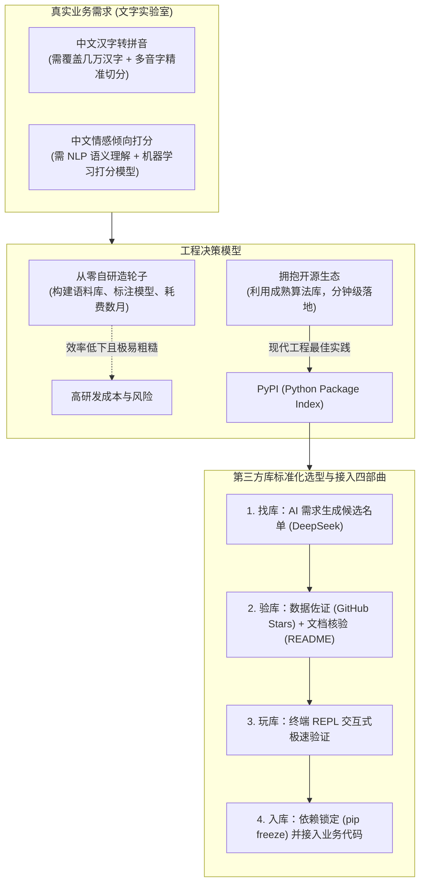
```mermaid
flowchart TD
    subgraph Requirements ["真实业务需求 (文字实验室)"]
        ReqPinyin["中文汉字转拼音<br/>(需覆盖几万汉字 + 多音字精准切分)"]
        ReqSentiment["中文情感倾向打分<br/>(需 NLP 语义理解 + 机器学习打分模型)"]
    end

    subgraph Decision ["工程决策模型"]
        direction TB
        Reinvent["从零自研造轮子<br/>(构建语料库、标注模型、耗费数月)"]
        OpenSource["拥抱开源生态<br/>(利用成熟算法库，分钟级落地)"]
        Reinvent -.->|效率低下且极易粗糙| Fail["高研发成本与风险"]
        OpenSource -->|现代工程最佳实践| PyPI["PyPI (Python Package Index)"]
    end

    subgraph Pipeline ["第三方库标准化选型与接入四部曲"]
        direction TB
        Step1["1. 找库：AI 需求生成候选名单 (DeepSeek)"]
        Step2["2. 验库：数据佐证 (GitHub Stars) + 文档核验 (README)"]
        Step3["3. 玩库：终端 REPL 交互式极速验证"]
        Step4["4. 入库：依赖锁定 (pip freeze) 并接入业务代码"]
        Step1 --> Step2 --> Step3 --> Step4
    end

    Requirements --> Decision
    PyPI --> Pipeline
```

---

## 1. 业务痛点与“不造轮子”哲学
*(参考时间: 00:00)*

回顾我们文字实验室的交互设计：用户在网页端输入任意一段文字，后端应返回两项核心元数据：
1. **精准拼音**：将每个汉字转换为带声调的拼音；
2. **情感量化**：输出一个 0 到 1 之间的分值（越接近 1 越积极，越接近 0 越消极），并据此打上“积极”、“消极”或“平静”的标签。

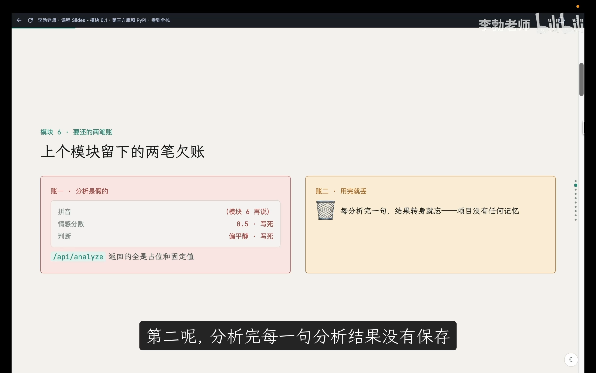

要自己纯手工手搓一套这样的算法，底层难度到底有多大？

### 挑战一：汉字拼音标注与复杂多音字
中文常用汉字多达数千，生僻字与扩展集更是超过数万。仅仅建立一张“汉字 -> 拼音”的字典表是远远不够的，因为中文存在海量的**多音字（Polyphone）**：
* “**重**庆”读作 `chóng`，而“**重**要”读作 `zhòng`；
* “银**行**”读作 `háng`，而“**行**走”读作 `xíng`。

计算机必须能够结合**上下文分词**与**词组规则库**，才能在句子中判定多音字的真实读音。

### 挑战二：情感量化与语义深度
情感倾向绝非简单的查字典能够解决。一句表面看似平静的话可能蕴含强烈的讽刺或支持。要量化情感，通常必须从海量标注语料库出发，使用自然语言处理算法或机器学习分类器训练出推理模型。

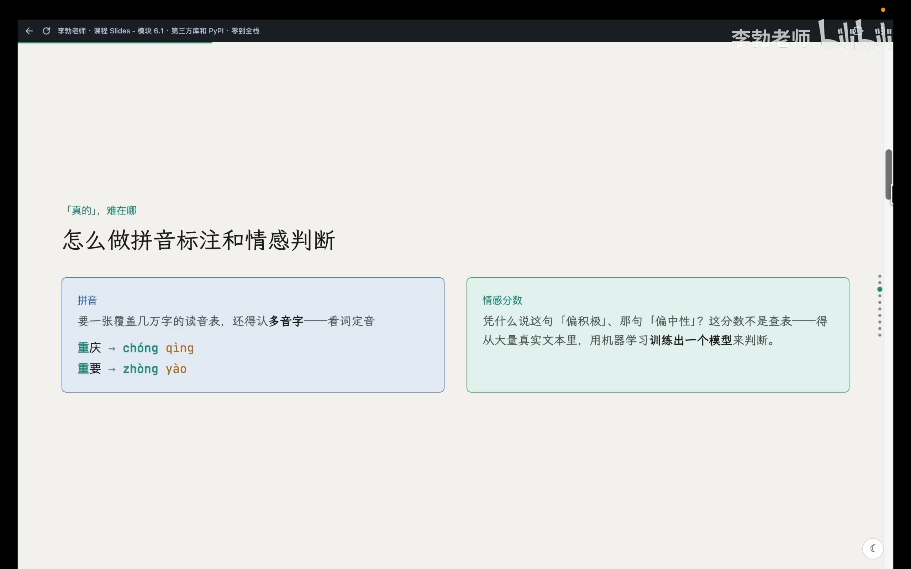

> [!IMPORTANT]
> **软件工程的“轮子定理”**：
> 软件工程中有一句著名的谚语叫**“不要重新发明轮子”（Don't Reinvent the Wheel）**。
> 既然前人已经花费数年时间用汗水打磨出了高可靠性、经过工业级检验的高性能轮子，我们再从头手搓一个不仅费时费力，且搓出来的多半比现成的更为粗糙。
> **优秀的软件工程师并非所有代码都亲手一行行写，而是深谙如何在开源生态中站在巨人的肩膀上，挑选并组装高质量的轮子**。

---

## 2. Python 生态枢纽：认识 PyPI 与 pip
*(参考时间: 02:40)*

既然有现成的轮子，这些由全世界开发者共同贡献的第三方库（Third-party Libraries）存放在哪里？

很多初学者的第一反应是：“在 **GitHub** 上！”

没错，开源项目的**源代码**绝大多数托管在 GitHub 上。然而在开发中，如果我们每引用一个库都要把它的 Git 源码 clone 下来、自己配置编译，效率依然极其低下。

* 在前端领域，我们在 npm 注册表上发布与下载包，只需一行 `npm install animejs`；
* 在 Python 领域，对标 npm 的官方公共包仓库名为 **PyPI（Python Package Index）**。

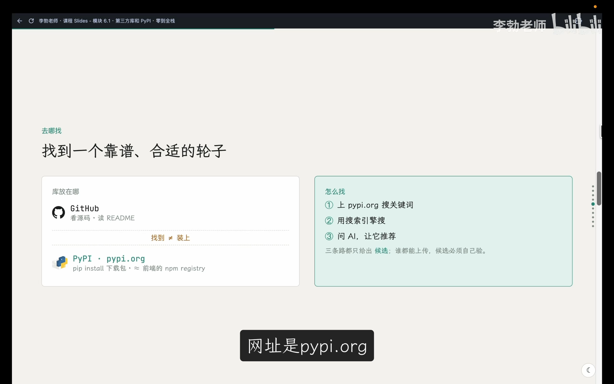

### 什么是 PyPI？
PyPI（网址：[pypi.org](https://pypi.org/)）是全世界所有 Python 共享代码与预编译轮子（Wheel 包）的中心枢纽。截至目前，PyPI 上托管着超过数十万个开源软件包。

当我们在终端敲下：
```bash
pip install <包名>
```
Python 的包管理器 `pip` 就会跨越网络直连 `pypi.org`，自动解析版本依赖，将编译打包好的库文件安全、高速地安装至当前 Python 环境的 `site-packages` 目录中。

---

## 3. 现代寻库范式：AI 辅助生成候选名单
*(参考时间: 04:00)*

面对 PyPI 上浩如烟海的几十万个库，我们如何精准定位哪一个库最符合我们的业务需求？

在传统搜索引擎时代，我们需要在 Google 或百度中翻找各种博客和过时对比。而在现代 AI 时代，最佳的检索范式是：**将结构化需求描述给大语言模型（如 DeepSeek、ChatGPT），让 AI 迅速输出头部候选名单**。

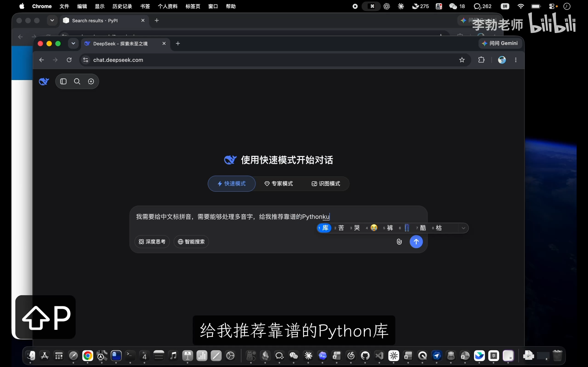

我们在对话中提出具体诉求：
1. *“我需要给中文标拼音，需要能够处理多音字，给我推荐靠谱的 Python 库。”*
   * AI 首选推荐：**`pypinyin`**（覆盖全面、多音字词典完备、汉字转拼音标杆）。
2. *“我还需要给中文做情感判断，直接给一句话打一个情感分，推荐什么库？”*
   * AI 首选推荐：**`snownlp`**（轻量级、开箱即用、自带中文朴素贝叶斯情感分类模型）。

> [!WARNING]
> **AI 建议不能盲目照单全收**：
> 1. **知识滞后**：AI 可能推荐数年前流行、但如今作者已停更甚至存在安全漏洞的废弃库；
> 2. **幻觉伪造**：AI 有时会一本正经地编造出一个根本不存在的库名（如 `chinese-sentiment-analysis-fast`）；
> 3. **质量参差**：PyPI 属于公共开放平台，任何人都可以上传同名或近似包，甚至存在恶意仿冒钓鱼包。
> 
> 因此，**让 AI 提供候选只是第一步，工程师必须亲自把关第二步——验库**！

---

## 4. 严谨验库双重关卡：数据佐证与文档核验
*(参考时间: 06:30)*

如何验证一个第三方库是否靠谱、能不能满足项目需求？我们必须建立**双重核验关卡**：

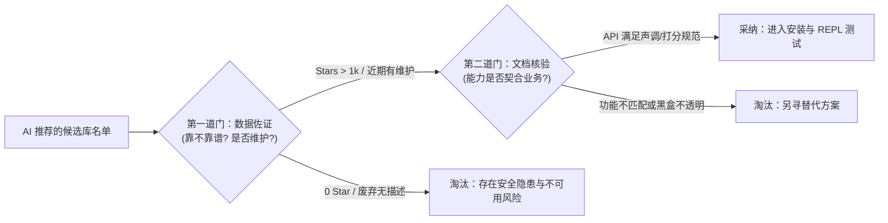
```mermaid
flowchart LR
    Candidate["AI 推荐的候选库名单"] --> Gate1{"第一道门：数据佐证<br/>(靠不靠谱? 是否维护?)"}
    Gate1 -->|Stars > 1k / 近期有维护| Gate2{"第二道门：文档核验<br/>(能力是否契合业务?)"}
    Gate1 -->|0 Star / 废弃无描述| Reject1["淘汰：存在安全隐患与不可用风险"]
    Gate2 -->|API 满足声调/打分规范| Adopt["采纳：进入安装与 REPL 测试"]
    Gate2 -->|功能不匹配或黑盒不透明| Reject2["淘汰：另寻替代方案"]
```

### 第一道门：数据佐证（GitHub Stars 与维护状态）

在 PyPI 搜索 `pypinyin`：
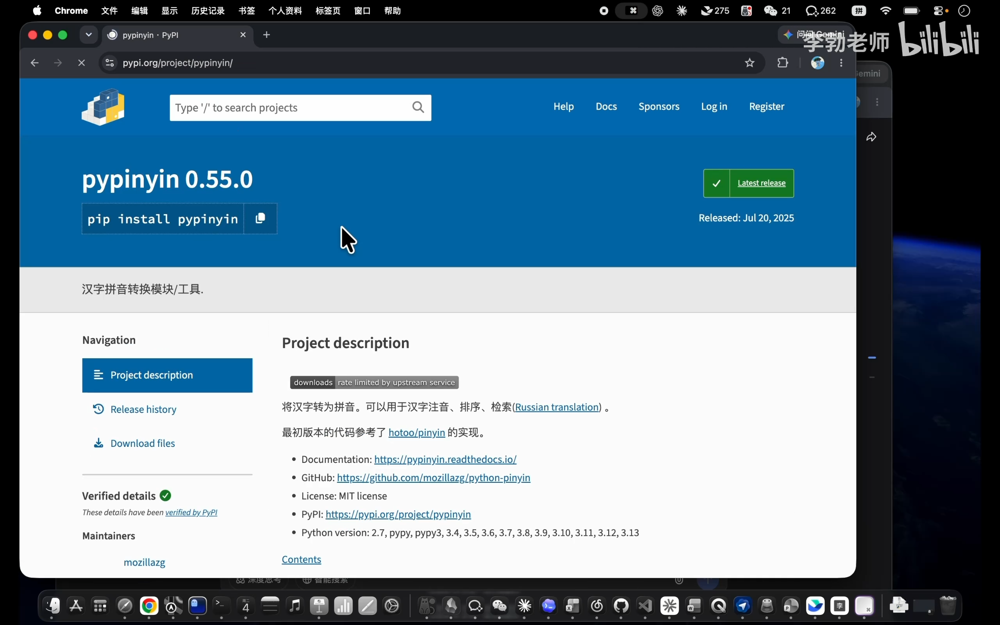

点击页面左侧的 **Homepage** 跳转至 GitHub 仓库：
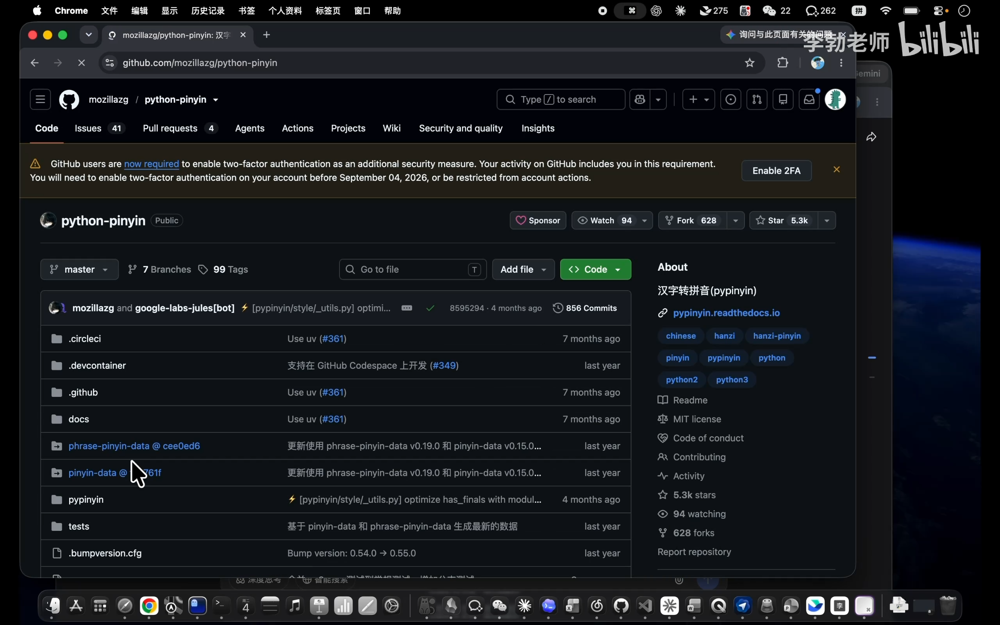

* **Star 数量**：Star 达到数千（几 K）以上，代表经过了全网大量开发者与企业的实际考验；
* **最近更新（Last Commit）**：近几个月内仍有代码提交和 Issue 响应，证明项目拥有活跃维护者。

#### 反面案例甄别：`snownlp` vs `snownlp-pro`
当在 PyPI 搜索 `snownlp` 时，搜索结果中还会跳出一个名字看似更高级的 `snownlp-pro`：
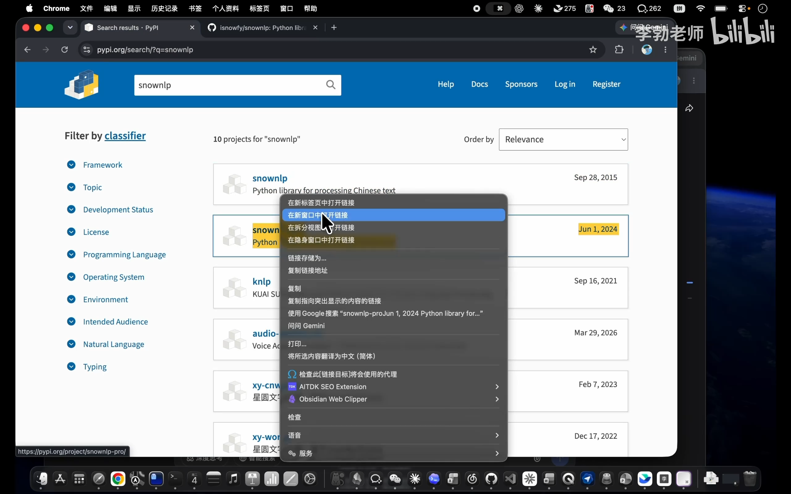

* **`snownlp`**：拥有数千 Stars，虽然由于传统 NLP 技术成熟近期更新放缓，但其代码底座极为稳定；
* **`snownlp-pro`**：Project Description 为空，打开 GitHub 一看竟是 **0 Stars** 的个人试验品！
如果仅仅凭名字“Pro”盲目选用，项目将埋下巨大的安全与稳定性隐患。

### 第二道门：文档核验（README 与 API 契合度）

靠谱不等于合用。我们必须翻看官方 GitHub 的 `README.md`，逐一对照我们的业务参数：

1. **核验 `snownlp` 情感分析能力**：
   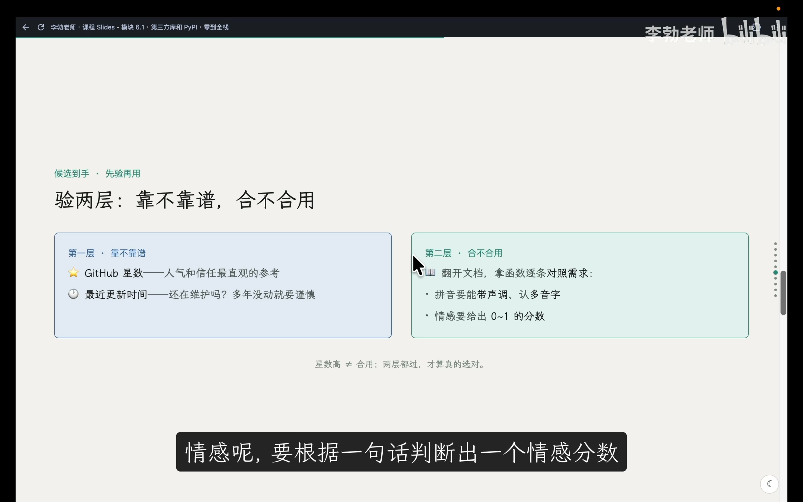
   文档明确给出：`s.sentiments` 会输出一个 `0.0 ~ 1.0` 之间的浮点数。例如句子“这个东西真心很赞”得分在 `0.9` 以上（高度 positive）。完全契合我们的打分需求！

2. **核验 `pypinyin` 拼音与多音字能力**：
   
   文档明确展示了多音字的处理能力（如“中心”与“命中”的声调自动切分），且提供了多种声调输出模式。完全契合业务！

---

## 5. 沙箱安装：将第三方库置入虚拟环境
*(参考时间: 10:00)*

核验通过后，我们正式将其安装到后端项目中。

> [!CAUTION]
> **绝对不可在全局 Python 中随意安装**！
> 在第 20 讲中我们反复强调：必须先激活当前后端的独立沙箱虚拟环境（Terminal 提示符前显示括号 `(.venv)`），确保库文件仅被限制在当前项目中，绝不污染系统全局环境。

```bash
# 进入后端目录
cd zero-to-tech/backend

# 激活虚拟环境 (Windows PowerShell)
.venv\Scripts\Activate.ps1

# 安装拼音处理库
pip install pypinyin

# 安装自然语言处理库
pip install snownlp
```

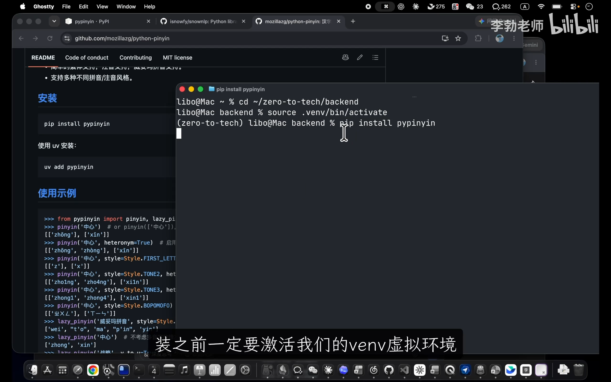

安装过程瞬间完成，`pip` 自动解析并下载了两个库及其关联的轻量级依赖。

---

## 6. 交互式神器：深入 Python REPL 模式
*(参考时间: 12:40)*

库安装好了，我们接下来该怎么跑一跑、验证一下效果？

按照传统思路，很多初学者会新建一个 `test.py` 脚本，在里面写代码、保存、运行、打印、然后再手动删掉这个临时测试文件。

如果只是想快速试一试几个 API，这种方式显得笨重且拖沓。现代编程语言普遍提供了一种更加优雅迅捷的工具——**REPL**。

### 什么是 REPL？
REPL 是 **Read-Eval-Print Loop（读取-求值-输出循环）** 的首字母缩写：
* **Read**：接收用户在终端键盘键入的表达式；
* **Eval**：Python 引擎就地对代码进行求值计算；
* **Print**：无需显式写 `print()`，直接把计算出的结果在屏幕上回显；
* **Loop**：等待用户下一次输入，周而复始。

在激活了虚拟环境的终端中，直接敲入 `python` 回车，终端提示符就会转变为经典的 **`>>>`**：

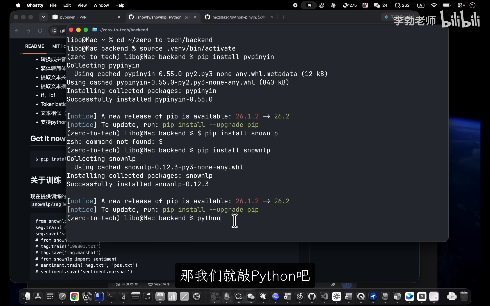

在 REPL 中，任何表达式都会即时得出结果：
```python
>>> 1 + 1
2
>>> x = 10 + 20
>>> x
30
```

### 跨语言的 REPL 思想
不仅 Python 拥有 REPL，几乎所有现代化语言都具备该特性：
* **Node.js**：终端敲 `node` 即可进入 Node REPL（输入 `.exit` 退出）；
* **Python**：终端敲 `python` 进入，输入 `exit()` 或按快捷键 `Ctrl + Z`（Windows）/ `Ctrl + D`（Mac/Linux）退出。

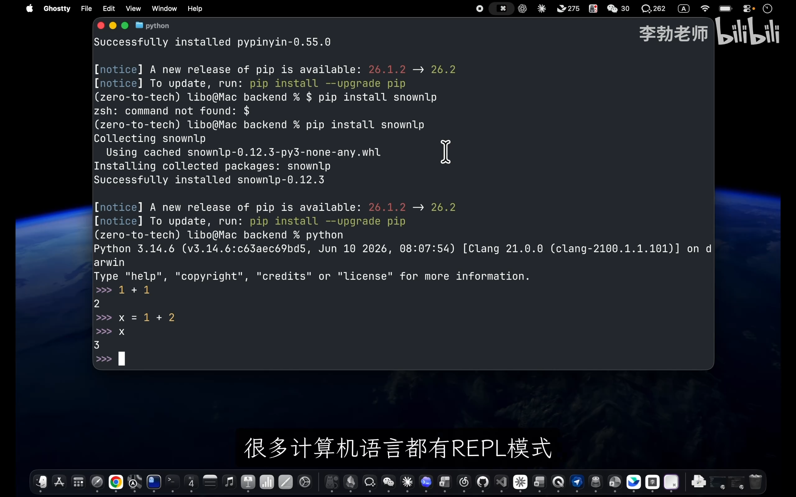

---

## 7. REPL 现场实战：玩转 `pypinyin` 与 `snownlp`
*(参考时间: 14:50)*

现在，我们在 Python REPL 提示符 `>>>` 下现场探索这两个新武器。

### 实战一：`pypinyin` 多音字与扁平化格式

首先导入并测试默认的 `pinyin()` 函数：
```python
>>> import pypinyin
>>> from pypinyin import pinyin, lazy_pinyin, Style

# 基础测试
>>> pinyin("你好")
[['nǐ'], ['hǎo']]
```
默认的 `pinyin()` 会为每个字生成一个包含声调的单元素列表，整个句子则是一层外层大列表。

测试核心的多音字甄别能力：
```python
>>> pinyin("重庆")
[['chóng'], ['qìng']]

>>> pinyin("重要")
[['zhòng'], ['yào']]
```

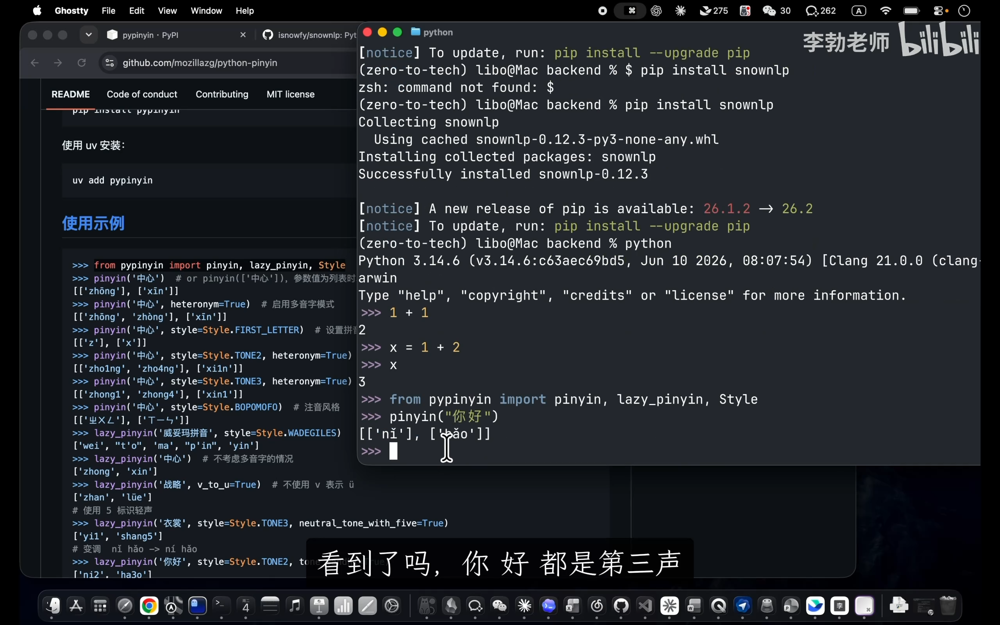

多音字识别精准无误！
但二维嵌套列表 `[['zhòng'], ['yào']]` 在返回给前端 JSON 时结构略显繁琐。如何输出单层扁平列表？
查阅文档发现，库提供了 **`lazy_pinyin`**：

```python
>>> lazy_pinyin("重要")
['zhong', 'yao']
```
单层列表虽然简洁，但声调符号丢失了！
如何让 `lazy_pinyin` 既保持单层扁平结构，又能完整输出准确的声调符号？查阅文档中的 `Style` 模块，传入 `style=Style.TONE` 即可：

```python
>>> lazy_pinyin("重要", style=Style.TONE)
['zhòng', 'yào']
```

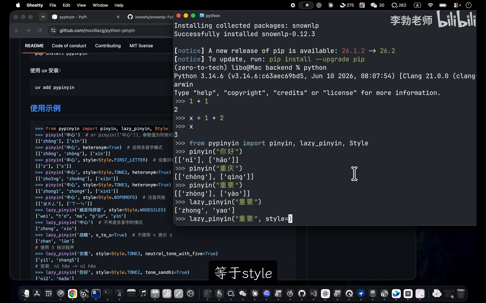

单层扁平列表 + 准确声调符号，这正是我们后面前后端联调所期望的最理想数据格式！

---

### 实战二：`snownlp` 情感倾向打分实测

接下来验证 `snownlp`。先导入核心类 `SnowNLP`：
```python
>>> from snownlp import SnowNLP
```

#### 场景 1：强烈正面情绪
```python
>>> s = SnowNLP("这个东西真心很赞")
>>> s.sentiments
0.9678129486029384
```
分值高达 `0.96+`，极为接近上限 `1.0`，准确判定为强烈积极倾向。

#### 场景 2：强烈负面情绪
```python
>>> s = SnowNLP("太失望了很不好吃以后不来了")
>>> s.sentiments
0.0123512803861298
```
分值仅为 `0.012`，极度靠近下限 `0.0`，准确判定为强烈消极倾向。

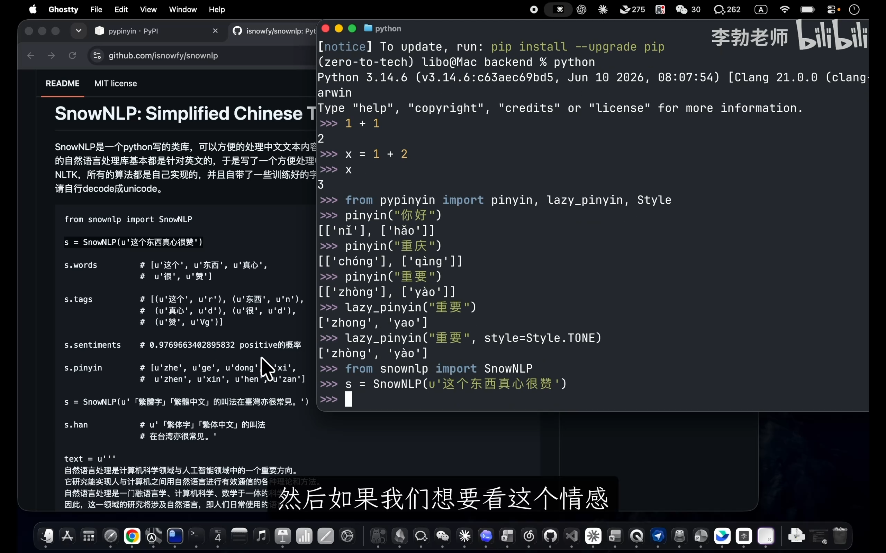

> [!NOTE]
> **辩证看待传统 NLP 算法与现代大模型**：
> `snownlp` 基于传统的贝叶斯统计机器学习模型。它的优势是**超轻量、纯本地执行、毫秒级响应、不消耗 GPU 显存与 API Token 费用**，非常适合做简单、高并发的快速打分。
> 但它对现代网络上的复杂隐喻、反讽（阴阳怪气）理解有限。在工业界更复杂的场景下，我们可以结合更高级的深度学习或大模型推理，但在我们当前的基础教学与小型 Web 实验室中，`snownlp` 堪称完美契合的轻量级首选。

验证完毕后，键入 `exit()` 干净利落地退回到系统命令行：
```python
>>> exit()
```

---

## 8. 方法论升华：第三方库集成四部曲
*(参考时间: 18:45)*

回顾刚才从无到有的整个过程，我们走过了一套不仅适用于 Python、更适用于所有现代软件工程的**标准化第三方库集成流水线**：

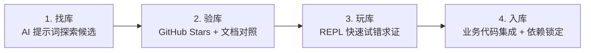
```mermaid
flowchart LR
    Find["1. 找库<br/>AI 提示词探索候选"] --> Verify["2. 验库<br/>GitHub Stars + 文档对照"]
    Verify --> Play["3. 玩库<br/>REPL 快速试错求证"]
    Play --> Commit["4. 入库<br/>业务代码集成 + 依赖锁定"]
```

1. **找库（Find）**：清晰提炼自身业务输入与输出，借助 AI 快速检索生态中已有的候选方案；
2. **验库（Verify）**：严把质量关，通过社区关注度（Star）、更新频次以及官方文档规避死库与假库；
3. **玩库（Play）**：利用 REPL 交互环境，不建文件、不造垃圾，在几分钟内快速验证关键 API 传参和返回；
4. **入库（Integrate）**：确认无误后正式编写进项目业务文件，并锁定环境依赖。

### 俯瞰 Python 的广袤生态
今天我们学习的 `pypinyin` 和 `snownlp` 属于自然语言处理（NLP）领域。但这仅仅是 Python 庞大开源版图中的冰山一角：

| 领域方向 | 行业事实标准第三方库 |
| :--- | :--- |
| **网络爬虫与网络请求** | `requests`, `httpx`, `beautifulsoup4`, `scrapy` |
| **数据科学与数据分析** | `pandas`, `numpy`, `matplotlib`, `seaborn` |
| **人工智能与深度学习** | `PyTorch`, `TensorFlow`, `transformers`, `scikit-learn` |
| **Web 异步与微服务** | `fastapi`, `uvicorn`, `django`, `flask` |
| **办公自动化与文件处理**| `openpyxl`, `python-docx`, `pypdf`, `pillow` |

无论未来你涉足哪个垂直领域，只要你掌握了今天这套四步法，你就能在最短时间内把全世界顶尖开发者的智慧纳为己用。

---

## 9. 依赖固化与版本锁定：`pip freeze`
*(参考时间: 21:15)*

在第 20 讲中，我们建立了一个极其重要的工程规范：**任何新安装了第三方库的改动，都必须立即同步更新到环境清单文件中**。

否则，一旦团队其他成员拉取代码，或者我们将项目部署到云端服务器，其他机器将完全不知道该项目新增了 `pypinyin` 和 `snownlp`，从而在启动时抛出致命的 `ModuleNotFoundError`。

在激活了虚拟环境的终端中，执行依赖导出：

```bash
pip freeze > requirements.txt
```

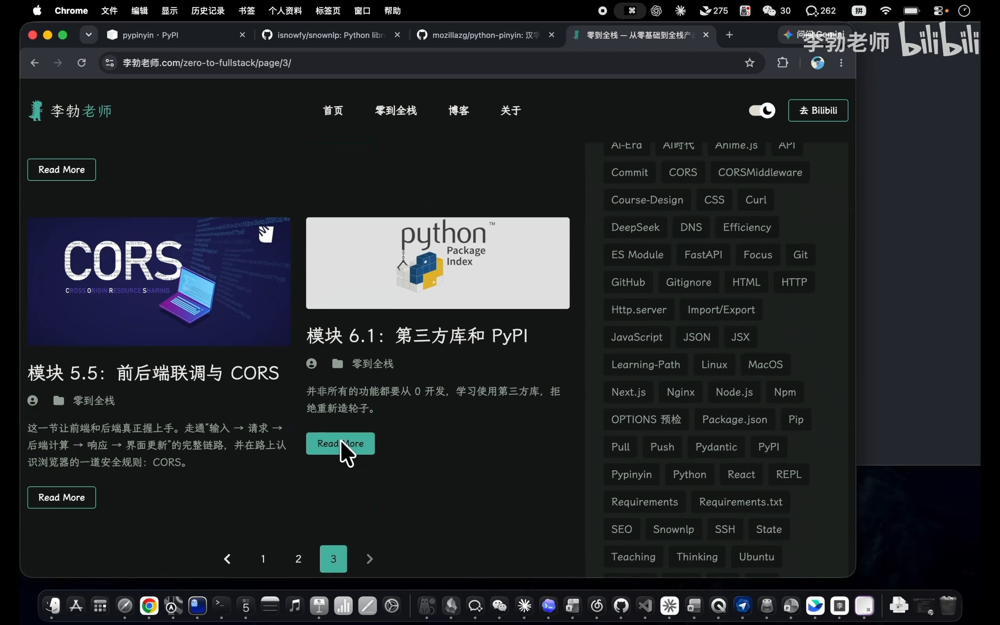

打开 `backend/requirements.txt` 检查，可以看到末尾已经准确追加了新依赖项及其严格的版本号：
```text
pypinyin==0.55.0
snownlp==0.12.3
```

最后，将变更提交至 Git 仓库，形成稳健的版本里程碑：

```bash
git add requirements.txt
git commit -m "添加 pypinyin 和 snownlp 到 requirements.txt"
```

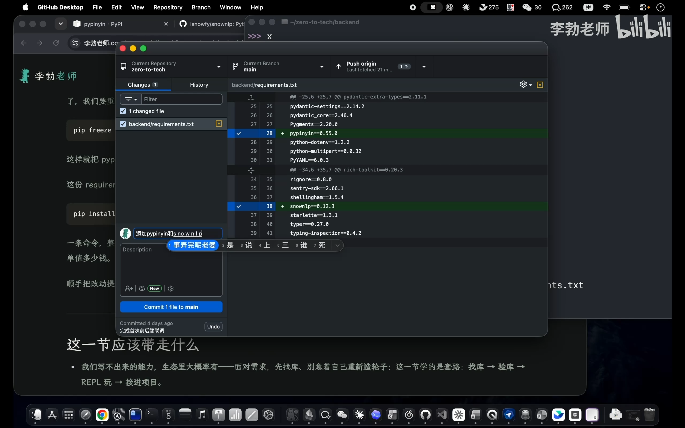

---

## 10. 本讲小结与下节展望
*(参考时间: 22:30)*

在本讲中，我们完成了两项关键认知跃升与工程落地：
* **认知升维**：树立了“拒绝重复造轮子”的工程哲学，建立了 PyPI 与包管理器的宏大图景，掌握了现代 AI 时代“找库、验库、玩库、入库”的完整工程闭环；
* **环境准备**：在虚拟环境中成功安装并测试了 `pypinyin` 与 `snownlp`，利用 REPL 敲定了最适合前端渲染的 API 传参，并用 `pip freeze` 固化了依赖环境。

在下一讲（第 25 讲：6.2 让网页真的会分析文字）中，我们将把今天在 REPL 中验证成功的代码正式接入 FastAPI 的 `POST /api/analyze` 路由中，打通前端文字输入、后端实时 NLP 计算与前端结果卡片动态反馈的完整链路，让网页真正拥有智能分析的能力！
