# 第 25 讲：让网页真的会分析文字（6.2）

在上一讲中，我们树立了“拒绝重复造轮子”的工程思维，认识了 Python 官方包仓库 PyPI，并通过 AI 辅助选型与 GitHub 数据把关，锁定了两款优秀的第三方自然语言处理（NLP）库：**`pypinyin`**（汉字拼音与多音字处理）与 **`snownlp`**（轻量级中文情感分析）。我们还在终端 REPL 中充分验证了它们的 API 表现，并将它们固化到了 `requirements.txt` 中。

本讲我们将正式兑现项目中的第一笔业务欠账——**将这两个库完整接入 FastAPI 的核心路由 `POST /api/analyze`，让运行在浏览器里的文字实验室真正拥有智能分析与多音字标注的能力**！

在此过程中，我们将深刻体会现代分布式系统与微服务架构的基石思想：**API 契约守恒定律（The Law of API Contract Invariance）**，并在生产实测中客观探寻传统小模型与现代大语言模型的认知边界。

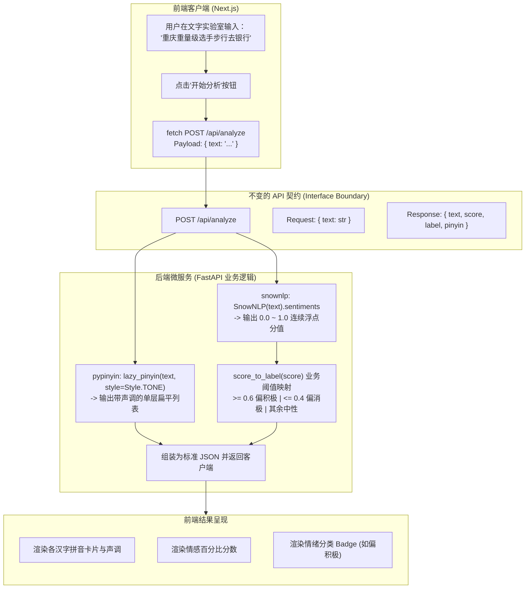

---

## 1. 现状审视与接口契约守恒
*(参考时间: 00:00)*

打开后端项目的入口文件 `zero-to-tech/backend/main.py`，查看上一模块留下的 `analyze` 路由：

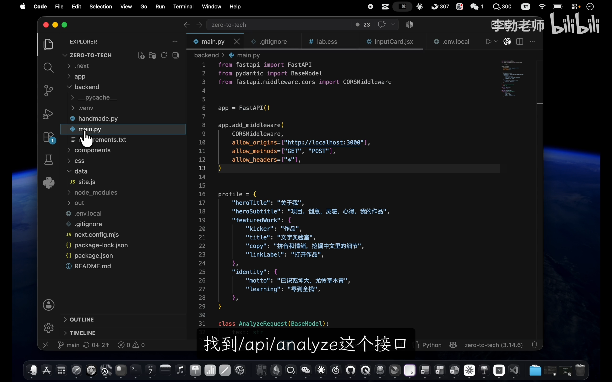

```python
# 改造前的占位实现
@app.post("/api/analyze")
def analyze(req: AnalyzeRequest):
    return {
        "text": req.text,                 # 唯一真实的数据：原样回传用户输入的文本
        "score": 0.5,                     # 假数据：写死 0.5 分
        "label": "偏平静",                 # 假数据：写死静态标签
        "pinyin": "（模块 6 再说）",        # 假数据：写死提示字符串
    }
```

### 严格的改造准则：只变实现，不改契约
在重构这个接口时，我们必须遵守严格的软件工程规范：
* **接口路径不变**：依然是 `/api/analyze`；
* **HTTP 方法不变**：依然是 `POST`；
* **请求体模型不变**：依然是通过 `AnalyzeRequest(BaseModel)` 接收包含 `text` 的 JSON；
* **响应 JSON 键名不变**：依然严密对应 `text`、`score`、`label`、`pinyin` 四个键。

只要守住这个**契约（Contract）**，前端代码就完全无需任何修改，实现真正的平滑升级。

---

## 2. 后端重构：接入第三方库与算法计算
*(参考时间: 01:40)*

从课程讲义中获取标准的改造逻辑与函数导入：

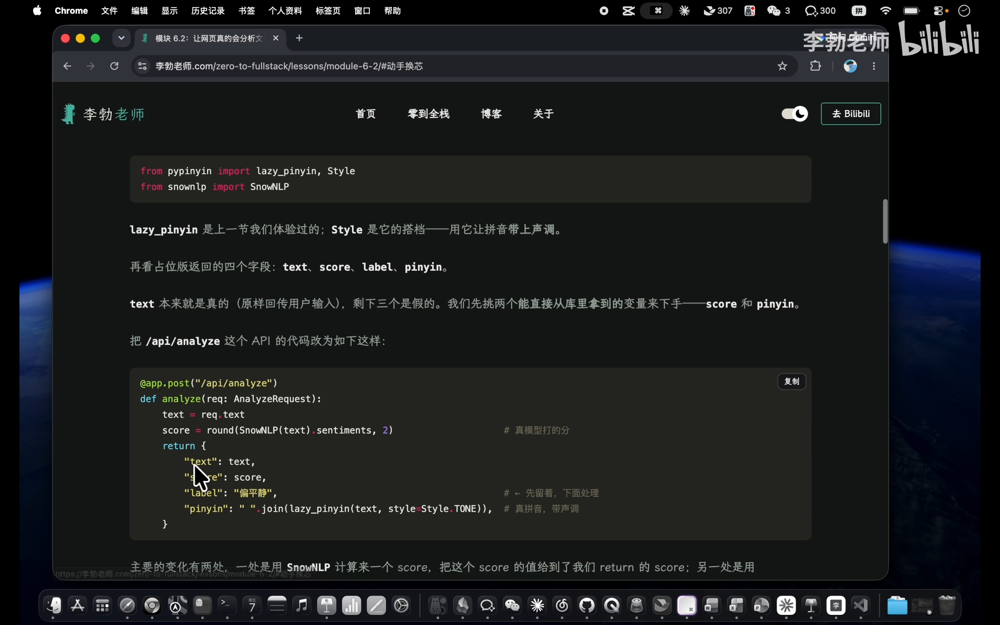

### 步骤 1：在 `main.py` 顶部导入核心类与方法
```python
from pypinyin import lazy_pinyin, Style
from snownlp import SnowNLP
```
* **`lazy_pinyin`**：能够直接输出单层扁平列表，避免默认 `pinyin()` 带来的双重嵌套中括号；
* **`Style`**：配合 `Style.TONE` 参数，确保输出的拼音携带准确的声调符号；
* **`SnowNLP`**：情感分析核心处理类。

### 步骤 2：用 `SnowNLP` 计算情感打分
在 `analyze` 函数体内部，利用 `req.text` 实例化模型，提取 `sentiments` 属性，并使用内置的 `round()` 函数保留两位小数：

```python
s = SnowNLP(req.text)
score = round(s.sentiments, 2)
```

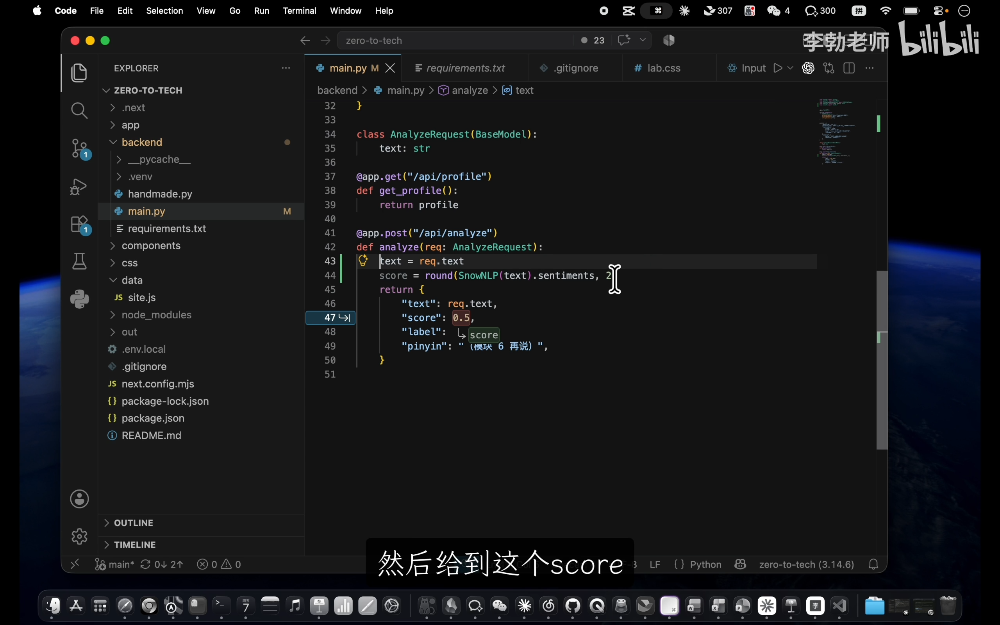

### 步骤 3：用 `lazy_pinyin` 转换拼音
直接调用 `lazy_pinyin`，将原文字串转换为携带音调的列表：

```python
pinyin_list = lazy_pinyin(req.text, style=Style.TONE)
```

---

## 3. 业务逻辑补充：编写 `score_to_label` 映射函数
*(参考时间: 04:30)*

为什么我们需要额外编写一段逻辑？
* `pypinyin` 和 `snownlp` 提供了优秀的通用算法底层，但它们输出的是连续的浮点概率（如 `0.9678...`）；
* 我们的前端界面需要向最终用户直观展示“偏积极”、“偏消极”或“中性”的情绪状态标签。
算法库无法代替我们做这种特定的业务判定，**将连续的算法分值转化为离散的业务标签，属于典型的后端业务逻辑**。

我们在 `analyze` 函数上方定义纯函数 `score_label`：

```python
def score_label(score):
    if score >= 0.6:
        return "偏积极"
    elif score <= 0.4:
        return "偏消极"
    else:
        return "中性"
```

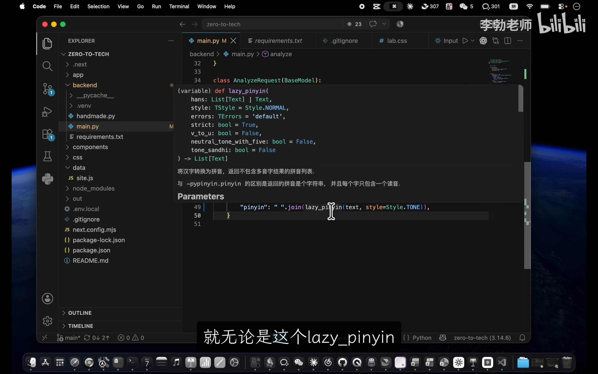

> [!NOTE]
> 这里的 `0.6` 与 `0.4` 是业务阈值线。如果后续团队希望更严格，也可以自由调成 `0.7` 和 `0.3`。这种逻辑独立抽离成函数，极大地提高了代码的可维护性与可测性。

### 改造后的完整接口代码
将上述逻辑装配至路由中：

```python
@app.post("/api/analyze")
def analyze(req: AnalyzeRequest):
    text = req.text
    score = round(SnowNLP(text).sentiments, 2)
    return {
        "text": req.text,
        "score": score,
        "label": score_label(score),
        "pinyin": lazy_pinyin(text, style=Style.TONE),
    }
```

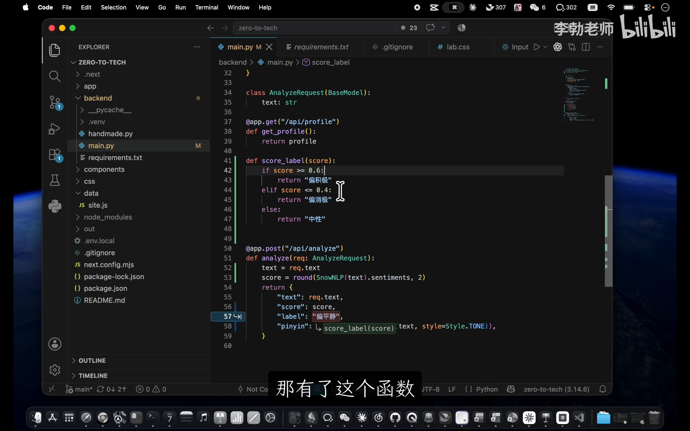

整个改动仅十几行代码，却让接口脱胎换骨，具备了真正的 NLP 计算能力。

---

## 4. 全栈联动实测：文字实验室成真
*(参考时间: 05:50)*

保存后端代码，由于 `fastapi dev` 开启了自动热重载，后端立即完成了更新。
同时确保前端 Next.js 服务正常运行：

```bash
# 终端 1 (前端)
npm run dev

# 终端 2 (后端)
fastapi dev
```

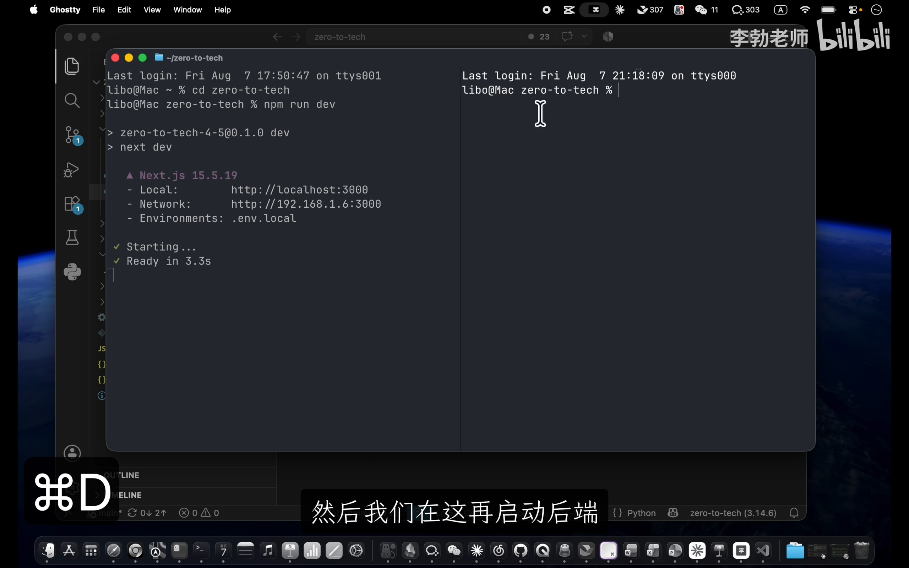

在浏览器中打开前端页面 `http://localhost:3000/text-lab`，在“文字实验室”界面进行全面实测。

### 测试用例 1：多音字综合辨析
在输入框键入包含多重多音字的复杂语句：
> **“重庆重量级选手，步行去银行”**

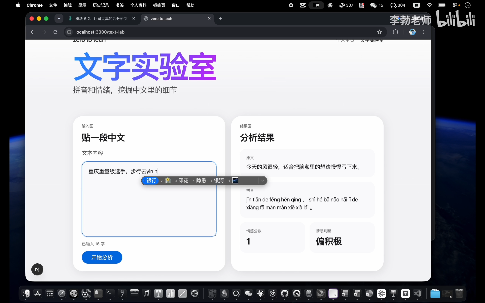

点击“开始分析”：
* **拼音精准度**：“重庆”输出 `chóng qìng`，“重量级”输出 `zhòng liàng jí`，“步行”输出 `bù xíng`，“银行”输出 `yín háng`！多音字全部结合语境识别正确，声调分毫不差；
* **情感分数与标签**：得分 `0.5`，标签准确归类为 **中性**。

### 测试用例 2：正面赞扬与负面批评
* 输入：“**我特别喜欢这部电影**” -> 接口返回 `score: 0.98`，标签准确显示 **偏积极**；
* 输入：“**太失望了再也不来了**” -> 接口返回 `score: 0.01`，标签准确显示 **偏消极**。

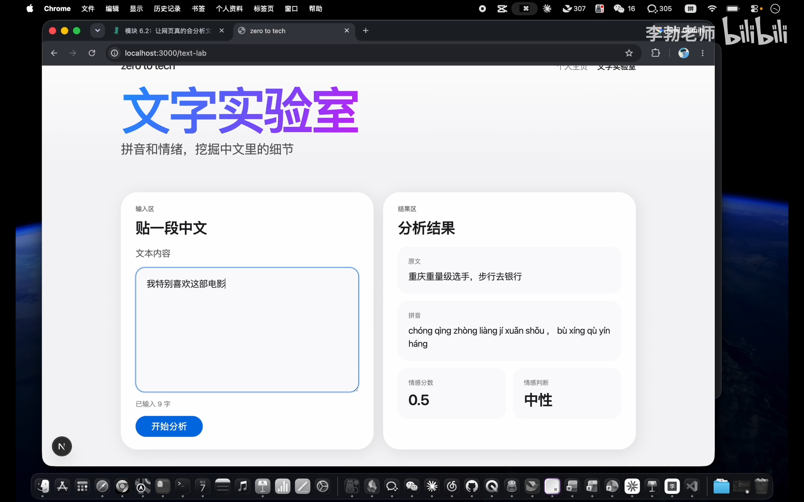

全链路联调大获全胜！我们在 VS Code 或 GitHub Desktop 中提交本次改动：

```bash
git add backend/main.py
git commit -m "完成 analyze 接口的实现"
```

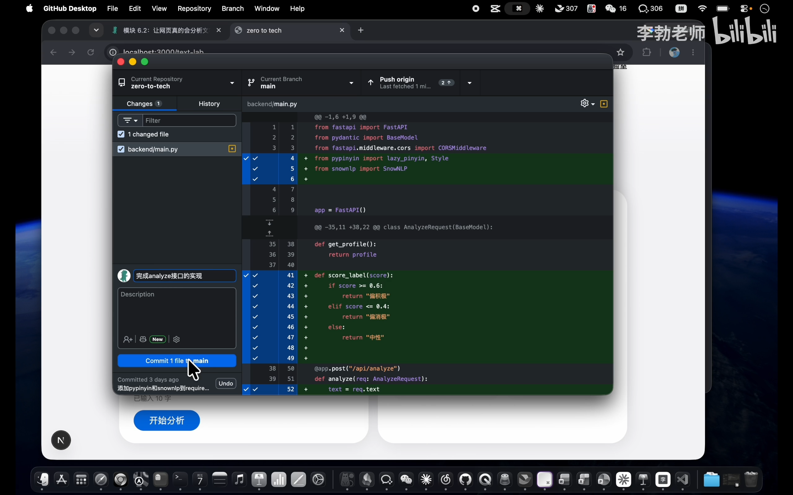

---

## 5. 架构深思：API 契约守恒定律
*(参考时间: 07:50)*

在刚才的整个改造过程中，细心的读者一定会注意到一个惊人的事实：
**从头到尾，我们没有改动前端 Next.js 的任何一行代码！**

为什么前端无需改动？
因为**服务端的实现细节对调用方是完全透明的**。

```mermaid
classDiagram
    class APIContract {
        <<Interface>>
        +POST /api/analyze
        +Header: Content-Type: application/json
        +Request: {"text": string}
        +Response: {"text": string, "score": float, "label": string, "pinyin": string[]}
    }

    class MockImplementation {
        -写死 0.5 和假占位符
    }

    class LocalNLPImplementation {
        -pypinyin
        -snownlp
    }

    class LLMCloudImplementation {
        -DeepSeek API
        -OpenAI API
    }

    APIContract <|.. MockImplementation : 模块五初版
    APIContract <|.. LocalNLPImplementation : 模块六当前版
    APIContract <|.. LLMCloudImplementation : 未来扩展版
```

我们打开浏览器访问 FastAPI 自带的 Swagger 自动文档（`http://localhost:8000/docs`）：

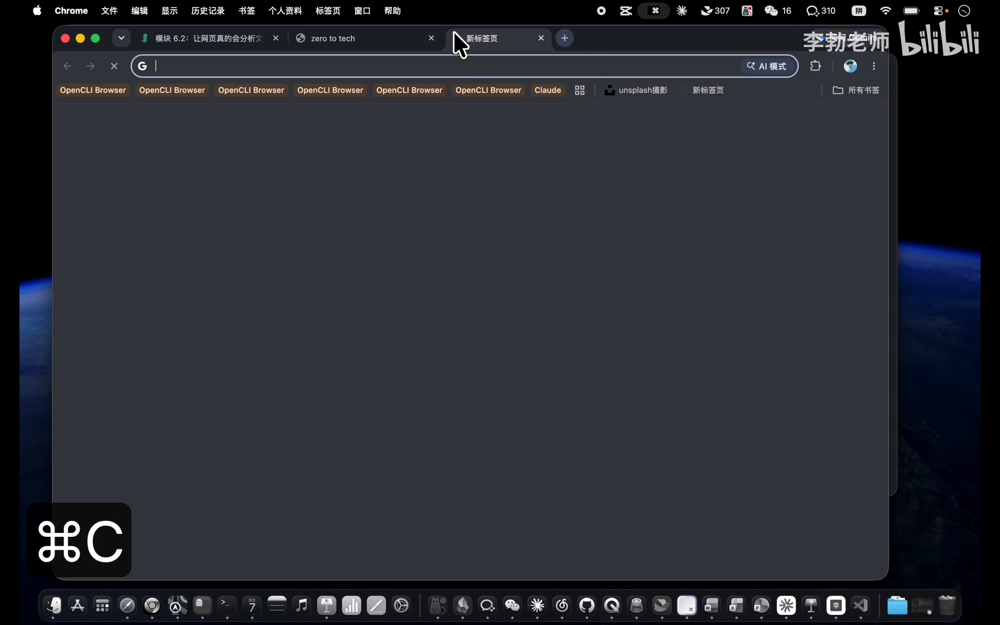

可以看到，文档中声明的路径、参数模型和响应模式，与上一节课一模一样。

> [!IMPORTANT]
> **API 契约守恒定律**：
> 只要服务端严格遵守约定的 API 契约（URL、HTTP Method、Payload Schema、Response Schema），**服务端内部的代码无论怎么重构、换 Python 库、甚至用 Java / Go 完全推倒重写，只要接口契约不变，前端调用方都完全无感知，业务平滑无阻断**。
> 这正是现代前后端分离与微服务架构能够支撑万人协同大兵团作战的核心秘密！

---

## 6. 模型探索：探寻传统 NLP 算法的边界
*(参考时间: 10:00)*

功能虽然跑通了，但 `snownlp` 真的是无懈可击的神器吗？我们继续提升测试用例的难度，探寻其智能边界：

### 异常案例 1：完全中性的客观陈述
* 测试句子：“**今天下午三点开会**”
* 预期：没有任何感情色彩，理应判定为“中性”（`score ≈ 0.5`）；
* 实测：`snownlp` 打出了 **`0.33`（偏消极）**！
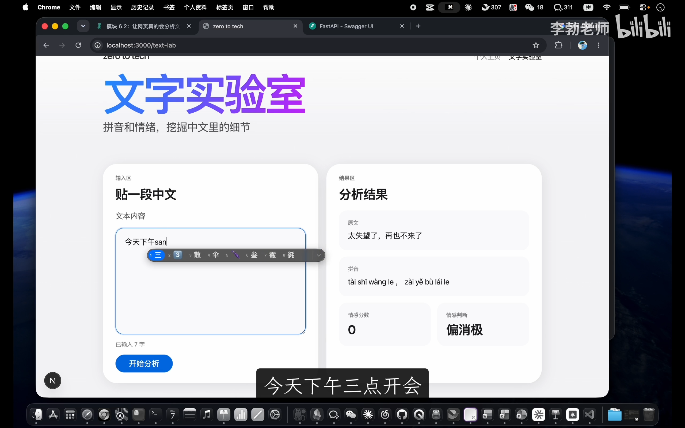

### 异常案例 2：现代网络反讽（阴阳怪气）
* 测试句子：“**呵呵好吧那你好棒**”
* 预期：人类一听便知是嘲弄与反讽，属于极度负面/消极；
* 实测：`snownlp` 打出了 **`0.9+`（偏积极）**！因为它单纯识别出了“好”、“棒”等褒义高频词，被字面表象彻底蒙蔽。
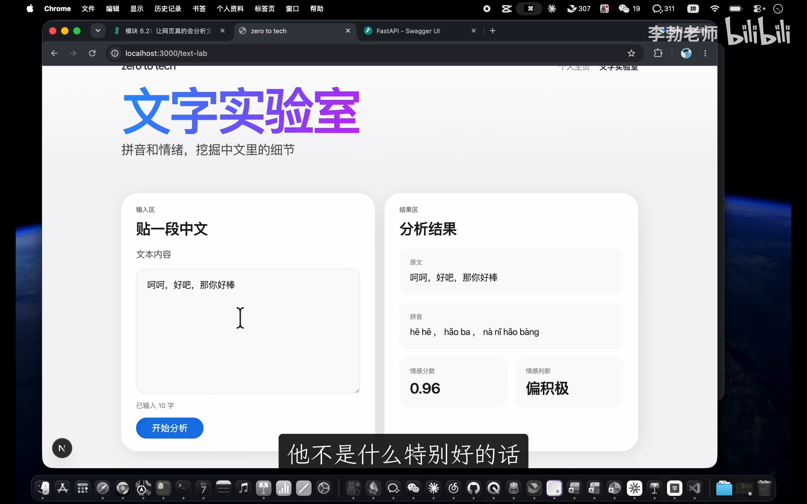

### 异常案例 3：特殊领域戏剧台词
* 测试句子：“**臣妾告发熹贵妃私通温太医**”
* 预期：宫斗阴谋与危机情境；
* 实测：打出了 **`0.7+`（偏积极）**！
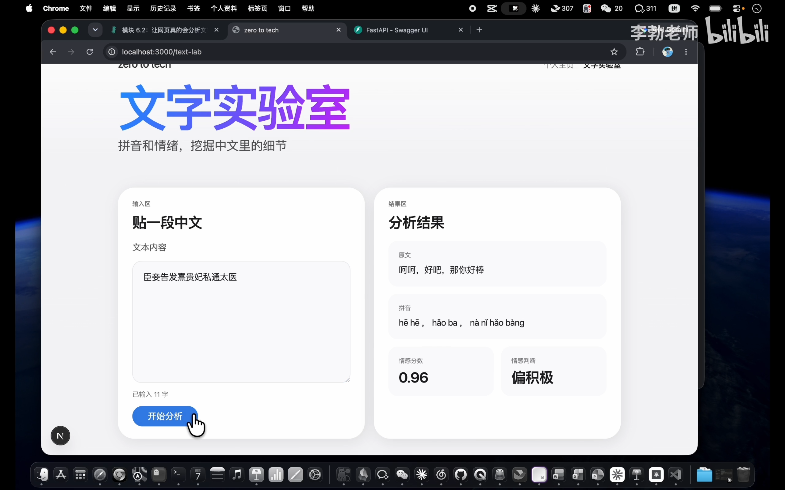

### 根因深度剖析：模型是用数据喂出来的
为什么会出现上述偏差？
`snownlp` 内置的情感模型，在设计之初主要是抓取电商购物网站上的**商品好评与差评评论语料**训练出来的。
* 它非常擅长处理：*“包装精美，物流很快，非常满意”* 或 *“质量极差，服务态度恶劣，退货”*；
* 但面对缺乏好评差评特征的日常事务通知、深层次反讽修辞、文言古风台词，它完全没有常识，只能按照词频概率强行推导。

> [!TIP]
> **所有机器学习模型的核心困境**：
> **模型自身是没有通用世界常识的，它只是擅长处理在其训练集中大量出现过的数据分布**。
> 哪怕到了如今的大模型（LLM）时代，模型幻觉与认知盲区依然存在，只是边界被推得更远、伪装得更隐蔽。

---

## 7. 方案选型技术谱系：如何选择适合的方案？
*(参考时间: 12:10)*

既然有更强的大模型（如 DeepSeek、ChatGPT），我们为什么不在本节直接调用云端大模型 API，而选择本地小模型？

在工业级系统设计中，没有一种技术方案是绝对占优的。技术决策本质上是**全方位权衡（Trade-off）**的结果：

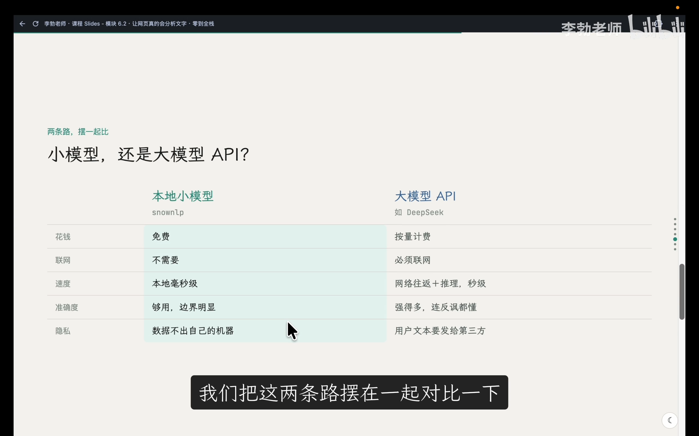

| 对比维度 | 本地统计小模型 (如 `snownlp`) | 云端商业大模型 API (如 DeepSeek / OpenAI) | 开源大模型本地私有化部署 (如 Ollama / vLLM) |
| :--- | :--- | :--- | :--- |
| **经济成本** | **完全免费** | 按 Token 用量持续计费 | 需投入高端显卡硬件购置成本 |
| **网络依赖** | **完全离线运行** | 强依赖公网连接 | 完全离线局域网运行 |
| **推理耗时** | **毫秒级 (< 5ms)** | 秒级 (受网络传输与排队影响) | 取决于本地 GPU 算力 (几百毫秒至几秒) |
| **语义理解深度** | 弱 (仅限关键词统计) | **极强 (懂隐喻、反讽与多轮常识)** | **强 (视参数量 7B~70B 而定)** |
| **数据隐私安全** | **绝对安全 (数据不出内存)** | 文本需上传第三方云厂商 | **绝对安全 (数据不出企业内网)** |
| **运维复杂度** | 极简 (一行 `pip install`) | 极简 (只需 API Key) | 极高 (驱动、显存调度、模型量化) |

对于我们当前的教学演示与文字实验室应用而言，**免成本、无网络依赖、毫秒级响应**的本地库无疑是最佳工程选择。

而在未来真实的商业产品中，无论你根据预算和精度需求将后端替换为云端大模型还是本地 Ollama，依靠今天建立的 **API 契约守恒**，你的前端系统都能保持零改动，轻松享受后端技术栈升级的红利！

---

## 8. 本讲小结与引申：赋予应用持久记忆
*(参考时间: 15:30)*

回顾本节内容：
1. 我们用不到二十行 Python 代码，将 `pypinyin` 与 `snownlp` 深度整合进 FastAPI 后端；
2. 我们亲身体验了前端不改一行代码、全栈功能平滑飞跃的“契约守恒”魅力；
3. 我们理性验证了传统 NLP 小模型的长处与局限，建立了现代工程选型的全局视野。

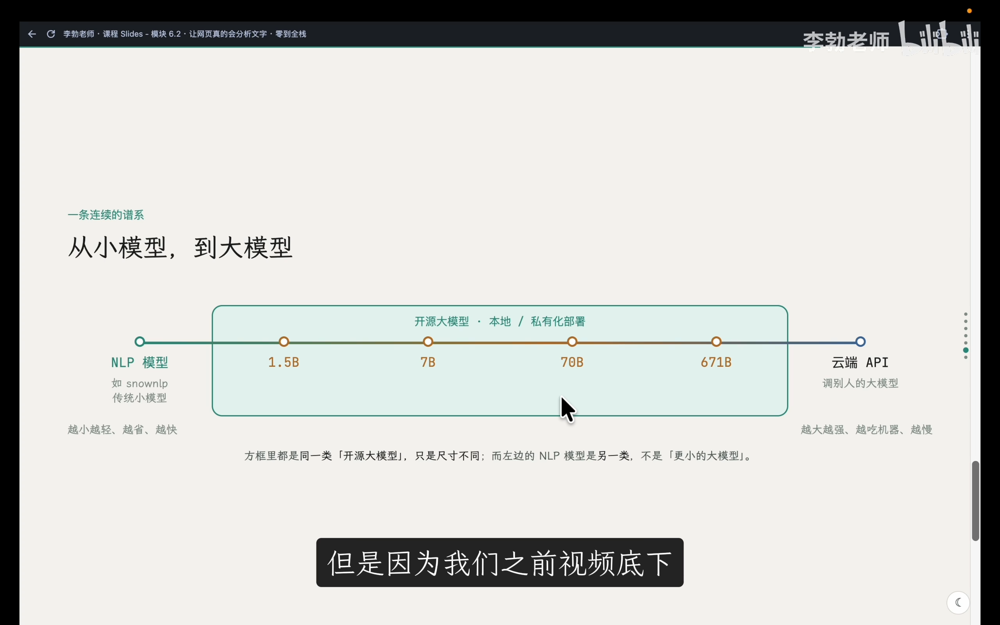

至此，第一笔欠账顺利结清。
但是，我们的系统目前还面临着第二笔欠账：**缺乏记忆**。
用户在网页上辛辛苦苦输入测试的好句子，只要随手按一次 F5 刷新页面，所有数据就彻底灰飞烟灭。

从下一讲（第 26 讲：6.3 数据库前传——文件存储）开始，我们将正式叩开**持久化存储（Persistence）**的大门，从最底层的文本与 JSON 文件存储讲起，一路推演至关系型数据库 SQLite，赋予全栈系统真正的“持久记忆”！
