# 第 26 讲：数据库前传——文件存储（6.3）

在前面的课时中，我们完成了两项振奋人心的里程碑：
1. **前后端集成联调**：利用 CORS 中间件与环境变量，打通了浏览器客户端与 FastAPI 后端；
2. **算法能力落地**：接入了 `pypinyin` 与 `snownlp`，让“文字实验室”真正能够计算出汉字拼音与情感量化分值。

然而，当前的系统依然存在一个根本性的硬伤——**它没有任何“记忆”**。
* 用户在页面输入一段话分析，结果刚出来；只要再分析下一句，前一条记录就消失了；
* 随手按 F5 刷新网页，历史内容空空如也；
* 如果在终端停止并重启后端服务，此前所有计算过的数据彻底烟消云散。

它就像一台老式的掌上计算器：按一下算一下，算完就忘。

本讲我们正式拉开**数据持久化存储体系**的大幕。在引入大型关系型数据库之前，我们将从计算机最基础的存储形态——**文件系统（File Storage）**切入，亲手搭建一套基于 JSON 的持久化读写引擎，理解时区与 UTC 黄金法则，并直面高并发下文件存储遭遇的**三大致命天花板（性能雪崩、脏读脏写、全盘损毁）**，彻底理解数据库诞生的必然逻辑。

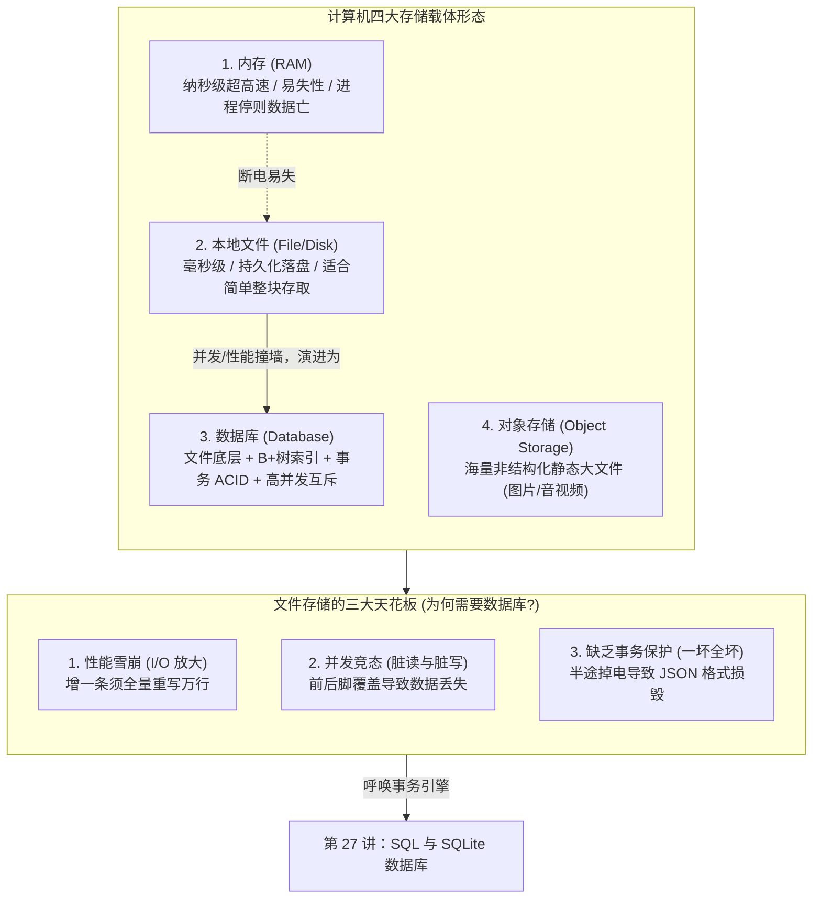
```mermaid
flowchart TD
    subgraph StorageLandscape ["计算机四大存储载体形态"]
        direction TB
        RAM["1. 内存 (RAM)<br/>纳秒级超高速 / 易失性 / 进程停则数据亡"]
        File["2. 本地文件 (File/Disk)<br/>毫秒级 / 持久化落盘 / 适合简单整块存取"]
        DB["3. 数据库 (Database)<br/>文件底层 + B+树索引 + 事务 ACID + 高并发互斥"]
        Cloud["4. 对象存储 (Object Storage)<br/>海量非结构化静态大文件 (图片/音视频)"]
        RAM -.->|断电易失| File
        File -->|并发/性能撞墙，演进为| DB
    end

    subgraph FileStorageLimits ["文件存储的三大天花板 (为何需要数据库?)"]
        direction TB
        Limit1["1. 性能雪崩 (I/O 放大)<br/>增一条须全量重写万行"]
        Limit2["2. 并发竞态 (脏读与脏写)<br/>前后脚覆盖导致数据丢失"]
        Limit3["3. 缺乏事务保护 (一坏全坏)<br/>半途掉电导致 JSON 格式损毁"]
    end

    StorageLandscape --> FileStorageLimits
    FileStorageLimits -->|呼唤事务引擎| NextStep["第 27 讲：SQL 与 SQLite 数据库"]
```

---

## 1. 业务痛点：为什么必须拥有持久化？
*(参考时间: 00:01)*

在当前的文字实验室中，数据呈现出典型的“用完即弃”状态：

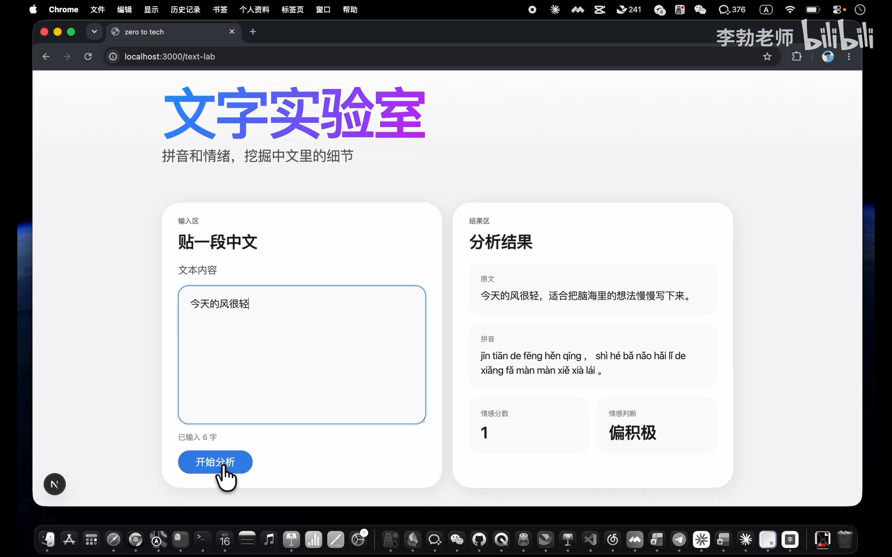

没有记忆到底有没有关系？我们必须分两个视角来看：
* **用户视角**：对于一个轻量级的查询小工具，用户查完拿到结果就走，是否记住上次的内容或许感知不强；
* **运营者与产品视角**：如果不做记录，损失将是灾难性的！
  * 我们无法获知每天到底有多少人次使用；
  * 我们无法统计用户最常输入的关键词与高频领域；
  * 我们更无法回溯评估 `snownlp` 模型在用户真实语料下的准确度表现。

**数据是软件产品最宝贵的资产底座**。只有把数据永久存下来，后续的运营分析、算法迭代与业务沉淀才有可能展开。

在计算机科学中，让程序把易失性的数据保存到不易失的存储介质上、即使重启后依然可用的过程，被称为**持久化（Persistence）**。

---

## 2. 存储本质与计算机存储层次
*(参考时间: 02:40)*

说到存储，很多初学者的第一反应就是：“那必须马上装个数据库！”
但工程逻辑有着严格的先后顺序：**先有了存储信息的需求，才逐步催生出各种存储介质与数据库软件**。

存储的需求远比计算机本身古老得多：从几千年前原始社会的结绳记事，到刻在泥板、记在账本、归档于档案柜，都是存储信息的形态。

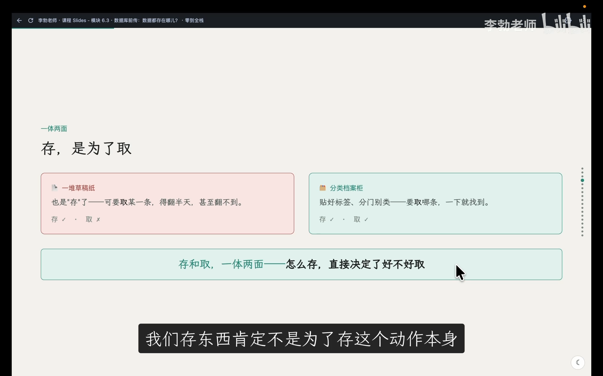

> [!IMPORTANT]
> **存与取的“一体两面”哲学**：
> 1. 我们存东西绝非为了“存”这个动作本身，而是为了未来能够**高效、准确地取出来**；
> 2. **怎么存，直接决定了未来好不好取**。一堆胡乱堆叠的草稿纸是存储，一个贴好标签、分门别类的档案柜也是存储。两者的根本差异，全部暴露在“取数据”的那一瞬间。

### 计算机中的四大存储载体

在现代计算机体系中，数据通常流转于四种主要空间：

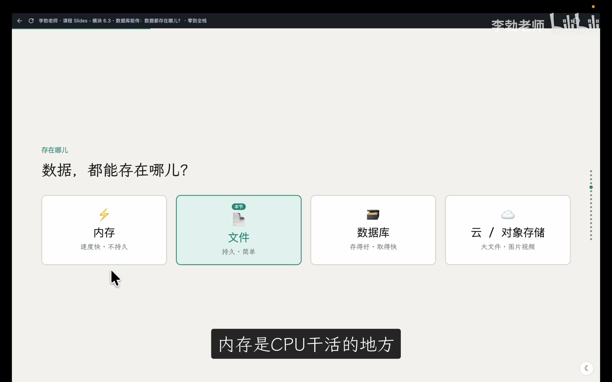

| 存储形态 | 读写速度 | 易失性 (Persistence) | 适用场景 |
| :--- | :--- | :--- | :--- |
| **1. 内存 (RAM)** | 极快 (纳秒级) | **完全易失** (断电/进程退出即清空) | CPU 运算、临时变量、缓存 |
| **2. 文件 (File)** | 较快 (毫秒级) | **持久化** (保存在硬盘中) | 配置文件、简单日志、文档备份 |
| **3. 数据库 (DB)** | 快 (含缓存与索引) | **持久化** (带事务与一致性保障) | 结构化业务数据、关系查询、高并发 |
| **4. 对象存储 (OSS/S3)** | 受限于网络带宽 | **持久化** (跨机房冗余备份) | 图片、视频、安装包等大体量静态文件 |

---

## 3. 深入内存：REPL 实测易失性
*(参考时间: 05:50)*

我们日常编写的代码，本质上就是一个不断在读写内存的过程。每一个定义的变量，都驻留在操作系统的物理内存（RAM）中。

在终端启动 Python REPL 验证：
```python
>>> brothers = ["刘备", "关羽", "张飞"]
>>> brothers
['刘备', '关羽', '张飞']
```
只要当前的 Python 进程持续运行，`brothers` 随时可以秒级读取。

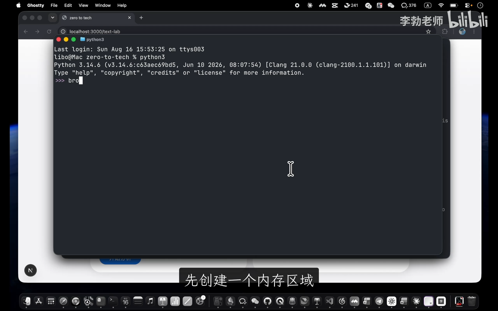

现在，敲入 `exit()` 退出 REPL，重新启动并再次访问：
```python
>>> brothers
NameError: name 'brothers' is not defined
```
变量彻底消失！因为当进程退出时，操作系统会将其占用的内存空间整体回收。前端 React 组件的状态刷新即失、后端未做持久化的全局变量重启即丢，底层皆是同一个物理法则。

### 搞清概念：内存（RAM）vs 存储（Disk）
许多新手在购买电脑或云主机时经常混淆这两项配置：
* **内存（RAM，如 16GB / 32GB）**：CPU 的临时工作台，速度极快但容量有限，掉电即失；
* **存储（Disk/SSD，如 512GB / 1TB）**：存放文件与系统的永久仓库，断电后数据安然无恙。

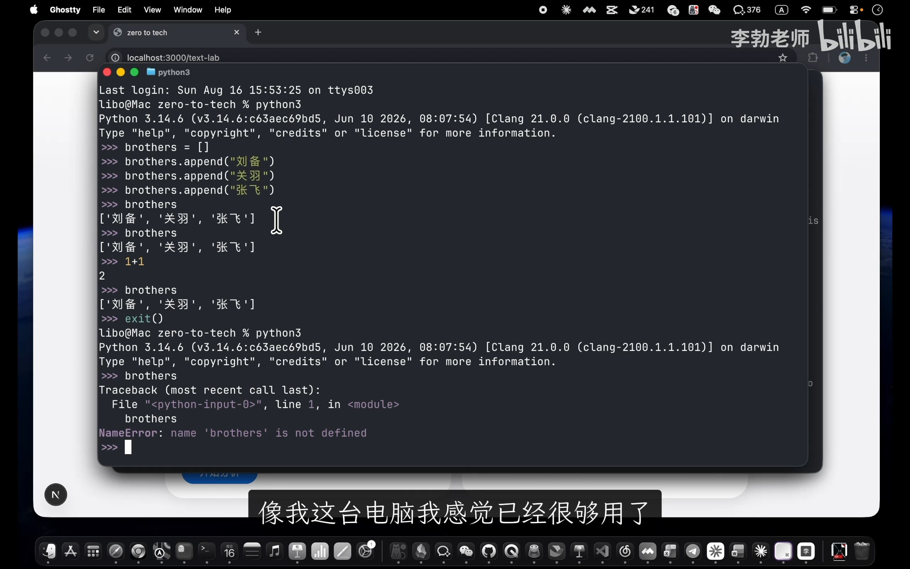

对于文字实验室的历史记录，我们显然必须将数据写入**硬盘（文件）**。

---

## 4. 存储格式抉择：CSV/文本 vs JSON
*(参考时间: 09:20)*

要把用户的每一次分析记录落盘到硬盘，我们必须明确两件事：
1. **存什么内容**；
2. **用什么格式存**。

### 记录元数据设计
一条标准的用户分析记录应包含 5 个核心维度：
* `text`：用户提交的原始文本；
* `score`：情感模型打分；
* `label`：情绪分类标签；
* `pinyin`：带声调的拼音列表；
* `created_at`：记录产生的绝对时间戳。

### 格式陷阱：为什么不能简单用逗号分隔（CSV/纯文本）？
最朴素的想法是每条记录写一行纯文本，字段之间用逗号 `,` 分隔。
但这种设计极其脆弱！

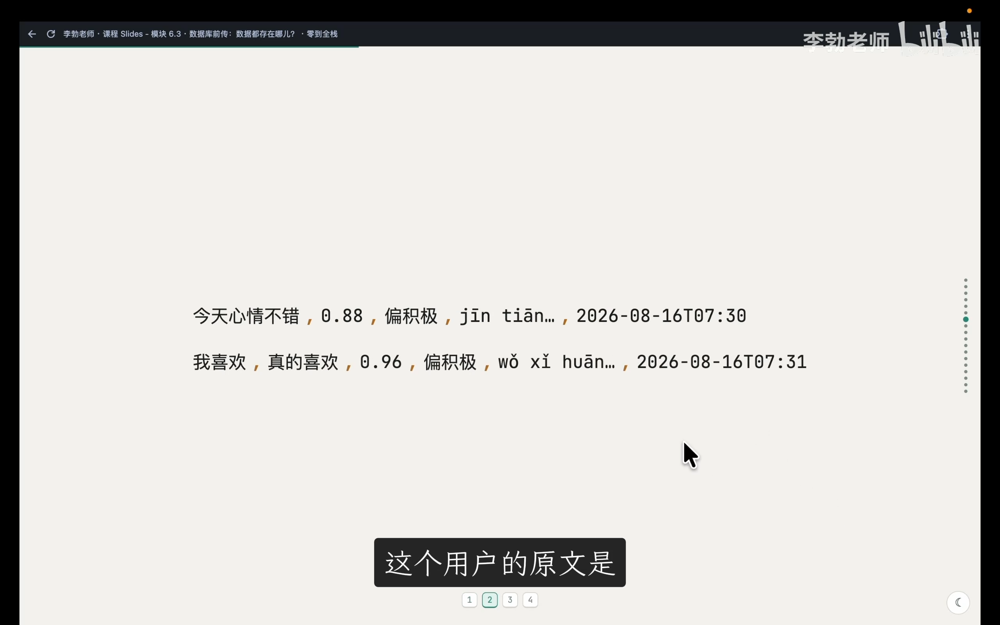

当用户输入包含逗号的句子时（如：`我喜欢，真的喜欢`）：
* 写入时毫无异样；
* 读取解析时，程序按照逗号切分，原句被腰斩为两截，导致整行字段错位、数据彻底错乱！

虽然可以通过自行定义转义规则（如用引号包裹内部逗号）来修复，但**永远不要自行发明转义规则**。

### 黄金标准：拥抱通用 JSON
JSON（JavaScript Object Notation）拥有成熟自洽的标准：

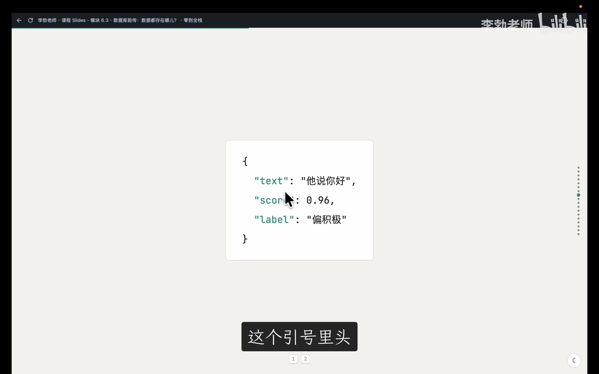

* 每个字段均有明确的键名键值对；
* 即使文本内部包含双引号或特殊字符，Python 的 `json` 标准库也会全自动完成规范转义（如 `\"`），完全不需要开发者手写脏活。

---

## 5. 时间的陷阱：时区与 UTC 规范
*(参考时间: 13:30)*

在记录中引入时间字段看似简单，却暗藏着一个巨大的跨国工程陷阱——**时区（Timezone）**。

如果直接调用 `datetime.now()`，获取的是当前服务器所在操作系统的本地时间：
* 若服务器部署在广州，记录显示 `15:00`；
* 若服务器部署在美西硅谷，记录显示 `23:00`。
两台跨国服务器上的同样日志，物理时刻完全对不上，排查问题将陷入巨大混乱！

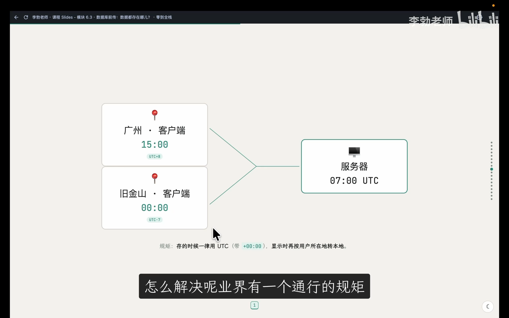

> [!IMPORTANT]
> **全栈时间处理的黄金法则**：
> 1. **存储时一律归一化为 UTC**：UTC（协调世界时，伦敦格林尼治零度经线标准时）是全球通用的绝对物理时间刻度；
> 2. **展示时按用户当地时区渲染**：例如中国用户按 UTC+8 转换为北京时间，旧金山用户按 UTC-7 转换。
> 内部系统通信与数据落盘永远只认 UTC ISO-8601 格式字符串（如 `2026-09-15T02:40:00Z`）。

---

## 6. 代码实战：构建 JSON 文件存储引擎
*(参考时间: 16:00)*

打开 `zero-to-tech/backend/main.py`，逐步注入文件持久化能力。

### 步骤 1：导入标准库
在文件顶部引入标准库（Python 内置，无需额外 `pip install`）：
```python
import json
from datetime import datetime, timezone
```

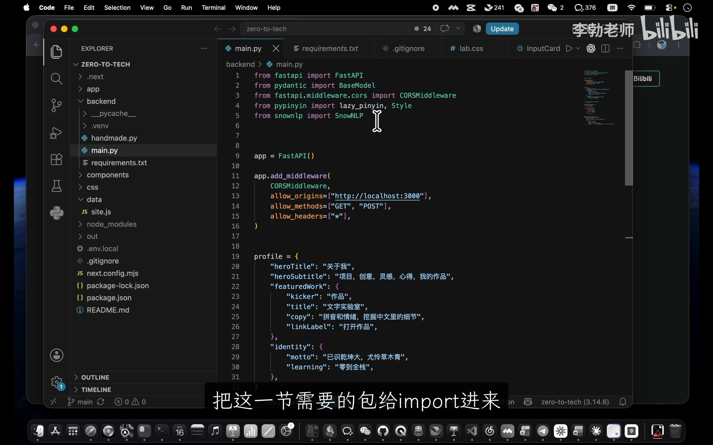

### 步骤 2：封装底层文件读写函数
在路由上方定义持久化路径与辅助函数：

```python
HISTORY_FILE = "history.json"

def load_history():
    """从磁盘文件中读取全部历史记录"""
    try:
        with open(HISTORY_FILE, "r", encoding="utf-8") as f:
            return json.load(f)
    except FileNotFoundError:
        return []

def save_record(record):
    """追加单条记录并全量持久化落盘"""
    records = load_history()
    records.append(record)
    with open(HISTORY_FILE, "w", encoding="utf-8") as f:
        json.dump(records, f, ensure_ascii=False, indent=2)
```

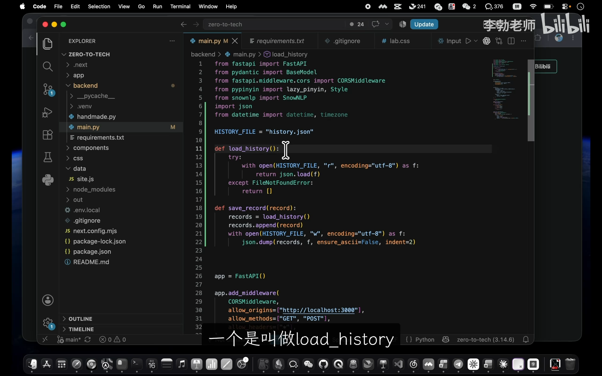

### 步骤 3：在 `analyze` 路由中埋点入库
修改 `POST /api/analyze` 路由：在向前端返回响应前，组装带有 UTC 时间戳的完整字典，并调用 `save_record`：

```python
@app.post("/api/analyze")
def analyze(req: AnalyzeRequest):
    text = req.text
    score = round(SnowNLP(text).sentiments, 2)
    result = {
        "text": text,
        "score": score,
        "label": score_label(score),
        "pinyin": " ".join(lazy_pinyin(text, style=Style.TONE)),
        "created_at": datetime.now(timezone.utc).isoformat(),
    }

    # 持久化落盘
    save_record(result)

    return result
```

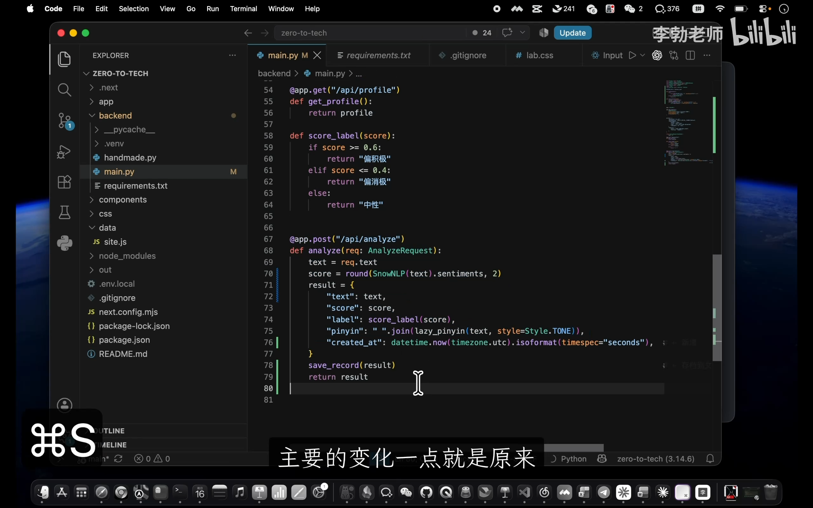

> [!NOTE]
> 接口返回从 4 个字段扩展为 5 个字段（追加 `created_at`）。这符合**向后兼容契约原则**：老前端不认识新字段会直接忽略，绝不会引发崩溃。

### 步骤 4：新增历史记录查询接口
在文件末尾新增专用查询接口：

```python
@app.get("/api/history")
def history():
    """获取所有历史分析记录"""
    return load_history()
```

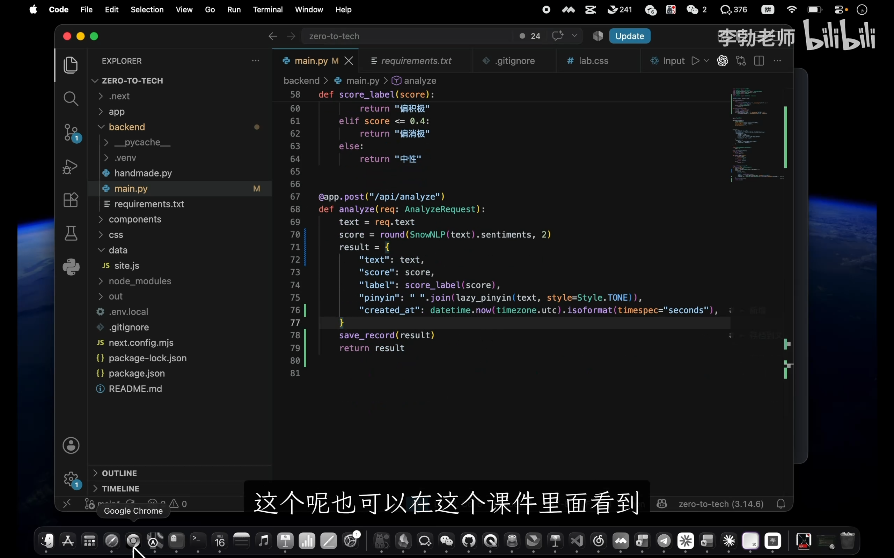

---

## 7. 联调验证：curl 探测与浏览器可视化
*(参考时间: 21:55)*

重启前后端服务，首先使用 `curl` 探测新接口：
```bash
curl http://localhost:8000/api/history
```
返回 `[]`，符合初始为空的预期。

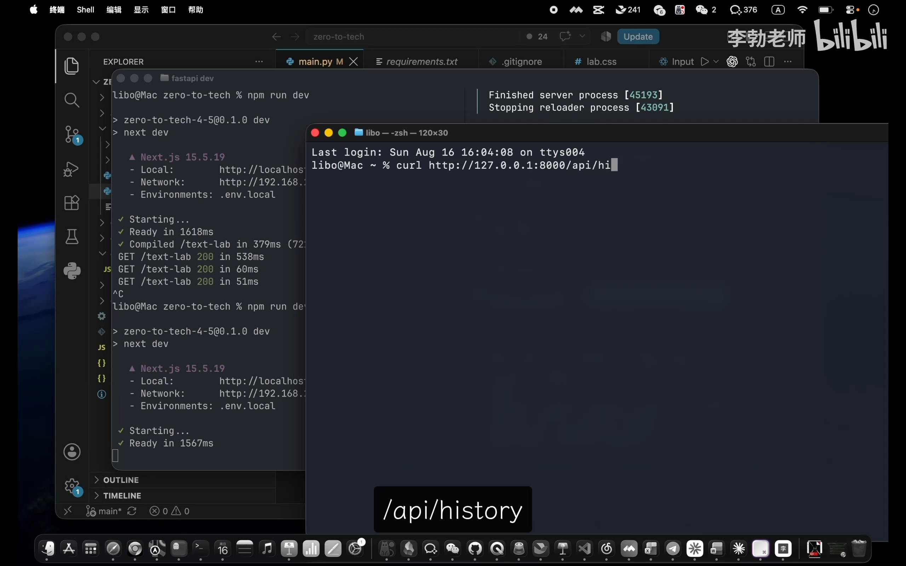

接下来在浏览器中打开 `http://localhost:3000/text-lab`，连续提交多句测试文本：
1. `这部电影很不错`；
2. 包含英文引号的文本：`我正式圈朋友们学一点计算机技术，写个什么"牛来"`。

提交完毕后，直接在浏览器中访问 `http://localhost:8000/api/history`：

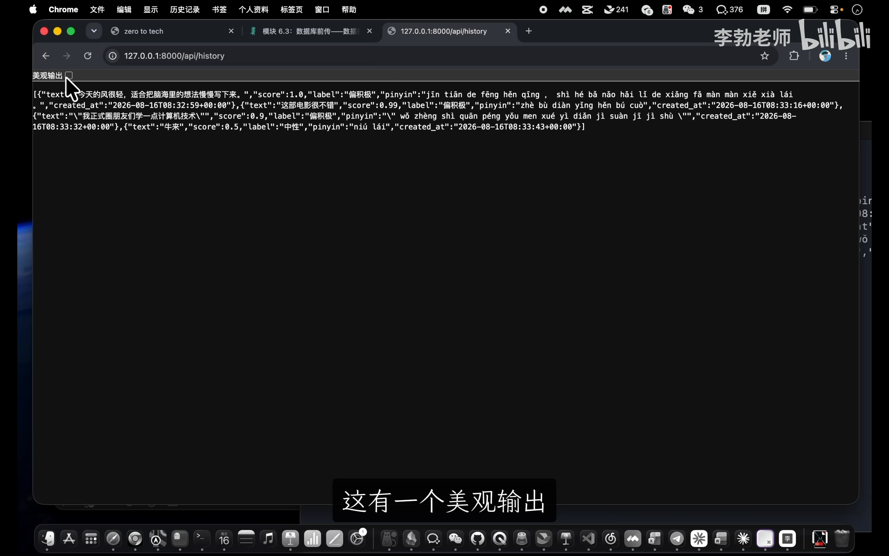

浏览器中勾选“美观输出”，清晰呈现出规整的 JSON 列表！

---

## 8. 查询能力进阶：倒序与切片
*(参考时间: 24:15)*

随着历史记录不断累积，用户通常更希望**最新产生的记录排在最上方**，且首屏**只加载最新的前几条**。

我们在 `history` 路由中加入 Python 原生列表反转与切片语法：

```python
@app.get("/api/history")
def history():
    records = load_history()  # 读出文件里的全部记录
    records.reverse()         # 1. 就地倒序：让最新记录位列最前
    return records[:2]        # 2. 列表切片：截取最新的前 2 条演示
```

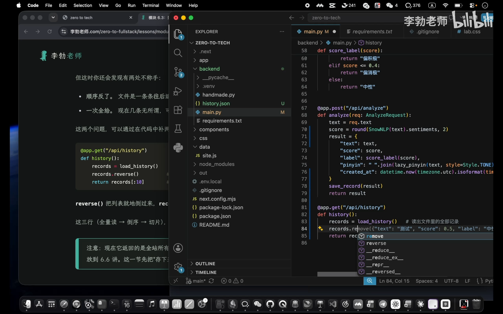

再次访问接口，最新提交的记录瞬间置顶，且数量精准受控。此时查看 VS Code 左侧，`history.json` 文件已真实稳固落盘：

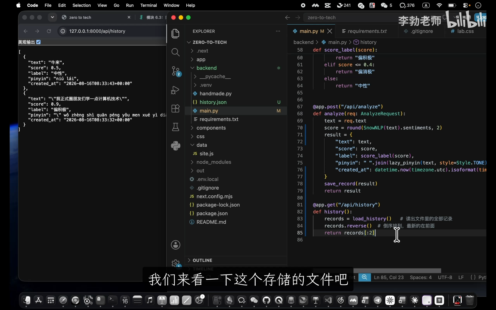

**数据成功完成持久化落盘（Persisted to Disk）**！无论如何杀死进程、重启电脑，历史记录永不丢失。

---

## 9. 方案反思：文件存储的三大致命天花板
*(参考时间: 27:30)*

至此，我们的简易文件存储系统运行良好。但在真实的互联网生产环境中，这种“基于单个文件的整存整取”模式隐藏着三个足以摧毁系统的致命隐患：

```mermaid
flowchart TD
    subgraph Bottleneck1 ["致命天花板 1：性能雪崩 (I/O 放大)"]
        AppendOne["新增 1 条数据"] --> LoadAll["必须在内存读出已有 10,000 条"]
        LoadAll --> DumpAll["必须将 10,001 条整份重写刷入磁盘"]
        DumpAll -->|O(N) 读写放大| IOHalt["磁盘 I/O 阻塞，响应延迟暴增"]
    end

    subgraph Bottleneck2 ["致命天花板 2：并发冲突 (脏写与脏读)"]
        UserA["用户 A: 分析'今晚夜色真美'"]
        UserB["用户 B: 分析'这车动力很足'"]
        UserA & UserB -->|同时读取| SameState["都读取到相同的前置 100 条"]
        UserA -->|第 1 毫秒写回 101 条| Overwrite1["写入文件 (含 A)"]
        UserB -->|第 2 毫秒写回 101 条| Overwrite2["覆写文件 (含 B 但抹杀 A!)"]
        Overwrite2 -->|A 的记录永久丢失!| DirtyWrite["典型脏写 (Dirty Write) 灾难"]
    end

    subgraph Bottleneck3 ["致命天花板 3：一坏全坏 (缺乏原子性)"]
        Writing["正在写入 10MB 的 JSON 字符串..."]
        PowerCut["突然断电 / 进程崩溃 / 硬盘写满"]
        Writing --> PowerCut
        PowerCut --> CorruptJSON["末尾缺失花括号 }]"]
        CorruptJSON --> Panic["json.load() 语法报错，全部历史记录瞬间归零!"]
    end
```

### 天花板 1：性能雪崩（I/O 读写放大）
观察 `save_record` 的逻辑：无论新记录多小，都必须将整个文件**全量读入内存、再全量刷回磁盘**。
当数据达到 10 万条时，哪怕只追加一个字，也必须承受整整 10 万条记录的磁盘 I/O 序列化与反序列化，系统吞吐量将出现断崖式下跌。

### 天花板 2：并发竞态（脏写与脏读）

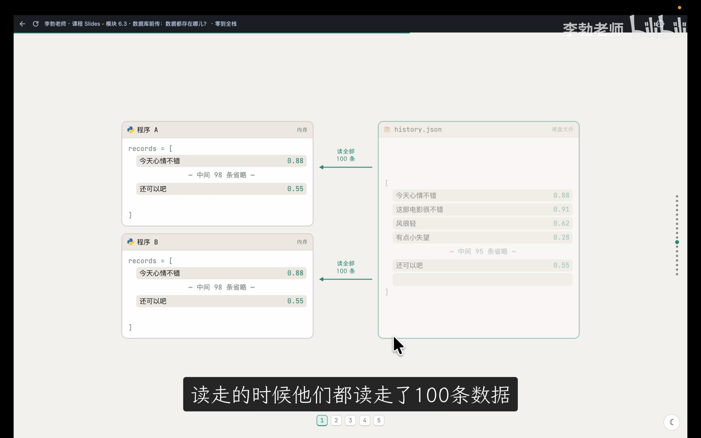

现代 Web 服务器是多线程/多进程并发处理请求的：
1. 用户 A（提交“今晚夜色真美”）与用户 B（提交“这车动力很足”）几乎在同一毫秒发起请求；
2. 两人同时执行 `load_history()`，内存中拿到的都是原本的旧数组；
3. A 在自身内存中追加后率先写回磁盘；
4. 紧接着 1 毫秒后，B 也将自己追加后的数组全量写回磁盘，**强行覆盖了 A 刚写入的文件**！
5. **用户 A 的记录在没有任何报错的情况下凭空彻底蒸发**！这就是计算机科学中臭名昭著的**脏写（Dirty Write）**。
同理，当一个请求写了一半，另一个请求刚好读取，读到的将是破损的中间状态，构成**脏读（Dirty Read）**。

### 天花板 3：一坏全坏（缺乏原子性 ACID）
在写回磁盘的纳秒窗口期内，一旦服务器突然断电或内存溢出崩溃，文件末尾可能只写了一半。
由于缺少关闭括号，下一次调用 `json.load()` 将直接抛出解析异常，**导致整份文件的全部历史数据陪葬，不可恢复**！

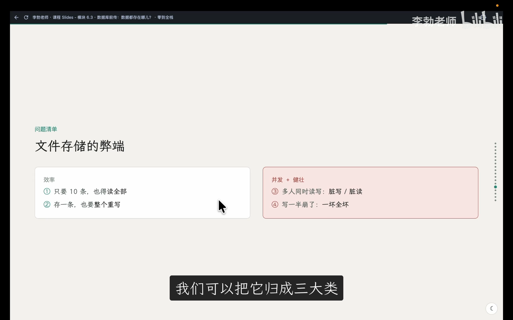

---

## 10. 业务合规深思与后续路线规划
*(参考时间: 34:30)*

在进入数据库实战前，我们还需要审视一个非技术层面的关键合规问题：
当前 `history.json` 把**所有不相识访客的输入混在一起公开展出**。

> [!CAUTION]
> **UGC 内容与互联网合规红线**：
> 最终用户自行上传的内容属于 **UGC（User Generated Content）**。
> 在中国互联网法规中，将不特定访客的 UGC 内容公开展示在页面上，需要专门的经营性牌照与严格的先审后发资质，个人备案网站严禁涉足此类公开展出。

合理的业务边界是：**每个用户只能查看自己曾经提交过的历史记录**。
要做到这一点，系统必须具备**识别用户**的能力：
1. **第一层：会话体系（Session）**：在不强制登录的前提下，利用 Cookie 机制记住当前浏览器，让同一个浏览器在多次请求与刷新间保持关联（我们将在第 29 讲 6.6 中深度攻坚）；
2. **第二层：账号与认证体系（Auth）**：账号、密码、Token、加密与权限控制（涉及庞大的安全工程）。

---

## 11. 本讲小结与下节展望
*(参考时间: 38:00)*

在本讲中，我们完成了两项关键认知跃升与代码实践：
* **实践落地**：用最接地气的文件系统实现了持久化，掌握了时区与 UTC 处理的最佳实践，成功给文字实验室注入了“记忆”；
* **瓶颈叩问**：深刻论证了普通文件面对高并发在线增删查改时的无力感，为引入工业级存储扫清了认知障碍。

如何解决单条记录高效检索追加？如何让成千上万个并发请求互不冲突？如何保证即使断电数据也绝不损坏？
业界给出的终极答案是：**数据库（Database）与事务（Transaction）机制**。

在下一讲（第 27 讲：6.4 数据库正传——SQL 与 SQLite）中，我们将正式推开数据库神殿的大门，结识轻量级关系型数据库之王 **SQLite**，掌握结构化查询语言 SQL，用专业武器彻底终结文件存储的痛点！
