# 6.4 数据库正传：SQL 基础与 SQLite 实践

在上一讲“数据库前传--文件存储”中，我们亲手基于 JSON 文件为 ZeroTech 文本分析系统构建了持久化历史记录功能。虽然该方案能够完成基本的数据读写，但在实际生产场景中暴露出了致命的缺陷：**每次写入都需要全量重写磁盘文件、多进程并发写入会发生相互覆盖、写入途中异常崩溃导致整库损坏，以及随数据量增长所带来的内存爆炸风险**。

正如我们在软件工程中所总结的铁律：“**在计算机软件领域，只要是人人都会遇到的普遍问题，七步之内必有成熟解药**。”人类对于持久化、安全、高效存储信息的需求早已存在了数千年，而在计算机发展史上，专门用于解决这一难题的核心技术便是**数据库（Database）**。早在互联网协议诞生之前八年，数据库系统就已经在工业界萌芽并快速演进。

本讲作为数据库正传，将系统梳理现代数据库的核心分类体系，深入剖析轻量级嵌入式数据库 SQLite 的设计哲学与极简类型系统，通过 Python `sqlite3` 原生驱动演练 DDL/DML 语句与事务控制，深度揭示 SQL 注入攻击的破坏机制与参数化查询防御铁律，并揭秘数据库在大数据量下的外部排序与索引底层运作机理。

---

## 目录
1. [数据库的发展历程与两大分类维度](#一数据库的发展历程与两大分类维度)
2. [为什么是 SQLite：零配置嵌入式数据库的选型逻辑](#二为什么是-sqlite零配置嵌入式数据库的选型逻辑)
3. [SQLite 极简类型系统与 DDL 建表规范](#三sqlite-极简类型系统与-ddl-建表规范)
4. [数据写入与事务（Transaction）的原子性保障](#四数据写入与事务transaction的原子性保障)
5. [数据查询、游标控制与数据操纵语句（DML）](#五数据查询游标控制与数据操纵语句dml)
6. [SQL 注入攻击机理与参数化查询铁律](#六sql-注入攻击机理与参数化查询铁律)
7. [大数据量操纵：排序（ORDER BY）与分页截断（LIMIT）](#七大数据量操纵排序order-by与分页截断limit)
8. [底层揭秘：数据库海量数据排序与外部归并机制](#八底层揭秘数据库海量数据排序与外部归并机制)
9. [性能优化的核心武器：索引（Index）的工作原理与代价](#九性能优化的核心武器索引index的工作原理与代价)
10. [数据库可视化工具（GUI）实操与进阶学习指引](#十数据库可视化工具gui实操与进阶学习指引)

---

## 一、数据库的发展历程与两大分类维度
*(参考时间: 00:00 - 04:30)*

当前开源与商业数据库领域百花齐放，从老牌的 MySQL、PostgreSQL、Oracle 到新型的 MongoDB、Redis、DuckDB 等。要清晰把握数据库全貌，可以从**数据形态模型**与**服务部署方式**两个核心维度进行解构。

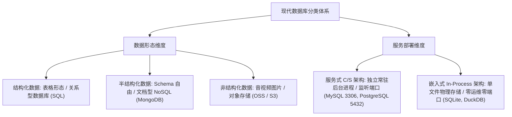
```mermaid
flowchart TD
    Root["现代数据库分类体系"]
    
    Root --> M1["数据形态维度"]
    M1 --> S1["结构化数据: 表格形态 / 关系型数据库 (SQL)"]
    M1 --> S2["半结构化数据: Schema 自由 / 文档型 NoSQL (MongoDB)"]
    M1 --> S3["非结构化数据: 音视频图片 / 对象存储 (OSS / S3)"]

    Root --> M2["服务部署维度"]
    M2 --> D1["服务式 C/S 架构: 独立常驻后台进程 / 监听端口 (MySQL 3306, PostgreSQL 5432)"]
    M2 --> D2["嵌入式 In-Process 架构: 单文件物理存储 / 零运维零端口 (SQLite, DuckDB)"]
```

### 1. 维度一：数据形态模型（Data Model）
- **结构化数据（Structured Data）**：具有清晰预定义的 Schema，字段结构固定，各记录对齐呈现为行列规整的二维表格。最适合的工具是**关系型数据库（RDBMS）**，通过统一的结构化查询语言（SQL）进行增删改查。
- **半结构化数据（Semi-structured Data）**：虽然包含自描述标签或层级结构，但允许记录间字段形态差异（例如 JSON 格式）。通常交由**文档型 NoSQL 数据库**（如 MongoDB）托管。
- **非结构化数据（Unstructured Data）**：如用户上传的图片、音视频多媒体文件及原始二进制日志。此类文件不适合直接作为大对象（BLOB）塞入关系型数据库表中，而是交给专门的**云原生对象存储（Object Storage Service，如 AWS S3、阿里云 OSS）**。

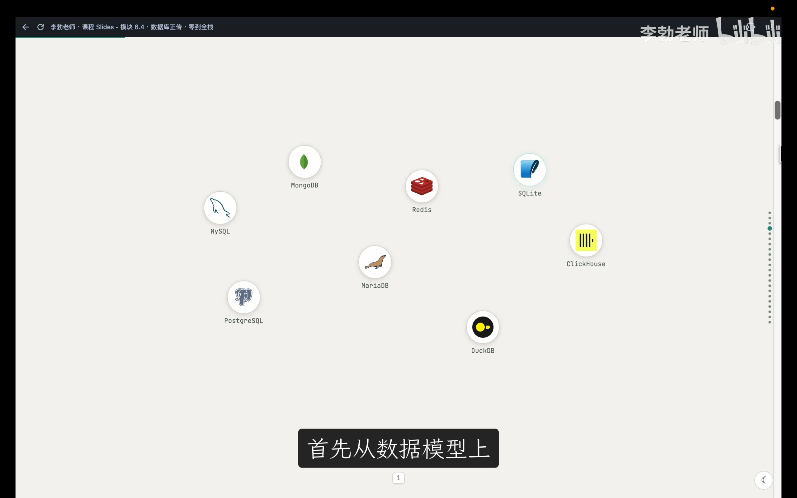

### 2. 维度二：服务部署架构（Deployment Architecture）
- **服务式数据库（Client-Server RDBMS）**：如 MySQL（默认监听 `3306` 端口）、PostgreSQL（默认监听 `5432` 端口）。这类数据库在操作系统中作为独立的长生命周期后台守护进程运行，客户端通过 TCP/IP 网络连接与身份验证交互。具备承载大规模并发连接、高可用集群与企业级权限隔离能力。
- **嵌入式数据库（Embedded In-Process Database）**：如 SQLite、DuckDB。其在物理上表现为一个普通的磁盘文件，没有独立常驻的服务进程，也不占用网络端口。应用代码通过嵌入在运行环境内部的驱动直接读写该文件。

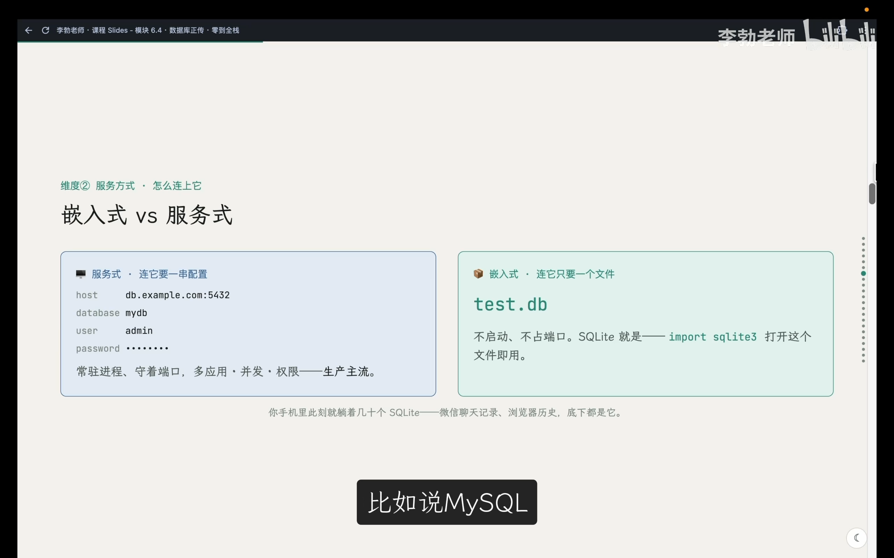

---

## 二、为什么是 SQLite：零配置嵌入式数据库的选型逻辑
*(参考时间: 04:30 - 07:45)*

回到我们的 ZeroTech 文本分析实验室项目：
1. **数据形态匹配**：系统存储的文本分析记录包含用户原文、评分、情绪标签、处理时间等固定字段，是典型的规整**结构化数据**，首选关系型数据库。
2. **业务并发规模**：作为一个小型单体原型或轻量化服务，系统不需要多台跨机器服务并发共享访问同一张数据库实例，无需承担维护独立数据库守护进程、配置防火墙与用户权限体系的运维心智负担。
3. **语言生态集成**：Python 标准库原生内置了 `sqlite3` 模块，无需执行任何 `pip install` 即可开箱即用。

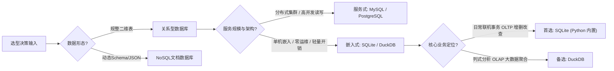
```mermaid
flowchart LR
    A[选型决策输入] --> B{数据形态?}
    B -->|规整二维表| C[关系型数据库]
    B -->|动态Schema/JSON| D[NoSQL文档数据库]
    C --> E{服务规模与架构?}
    E -->|分布式集群 / 高并发读写| F[服务式: MySQL / PostgreSQL]
    E -->|单机嵌入 / 零运维 / 轻量开销| G[嵌入式: SQLite / DuckDB]
    G --> H{核心业务定位?}
    H -->|日常联机事务 OLTP 增删改查| I["首选: SQLite (Python 内置)"]
    H -->|列式分析 OLAP 大数据聚合| J[备选: DuckDB]
```

SQLite 是全球部署量最大的数据库引擎之一。它不仅广泛运行在各类嵌入式设备中，现代智能手机内部的微信聊天记录、浏览器书签与本地缓存均由几十个 SQLite 数据库文件在底层默默支撑。

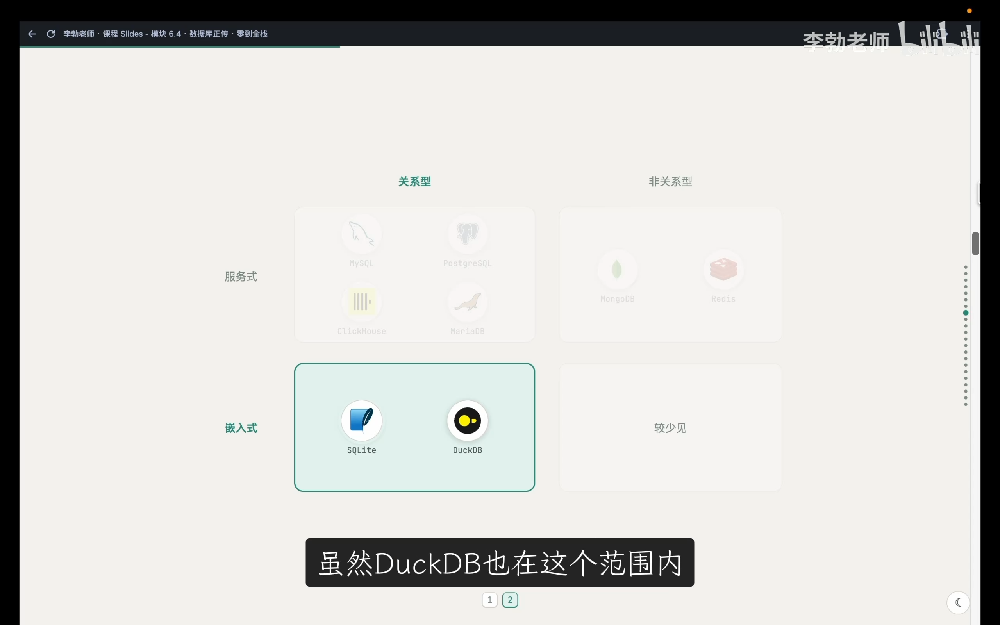

在 Python REPL 中，只需简单的三行代码即可初始化一个全新的本地数据库：

```python
import sqlite3

# 建立连接：若 test.db 文件不存在，引擎将在指定路径自动创建
conn = sqlite3.connect('test.db')

# 获取数据库操作游标
cursor = conn.cursor()
```

此时退出 Python 交互终端并在文件系统查看当前目录，即可发现一个大小为数 KB 的物理文件 `test.db`。这就是嵌入式数据库的全部载体。

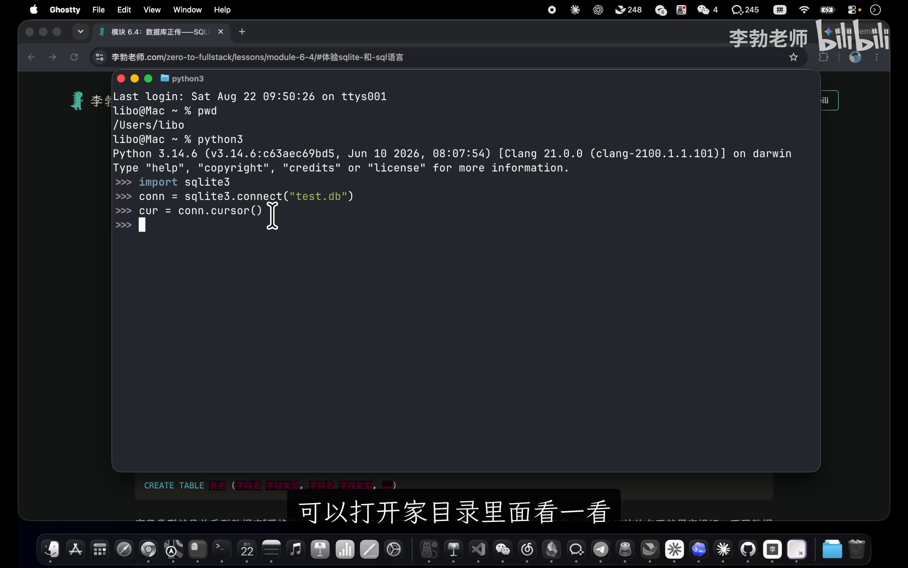

---

## 三、SQLite 极简类型系统与 DDL 建表规范
*(参考时间: 07:45 - 13:15)*

虽然不同的关系型数据库均支持 SQL 标准，但各家引擎在具体数据类型与扩展语法上均存在细微差异（即“SQL 方言”）。SQLite 遵循“极简与轻便”的工程哲学，其类型系统经过了高度收敛。

### 1. SQLite 极简数据类型系统
主流数据库如 PostgreSQL 拥有数十种严谨的数据类型，而 SQLite 核心仅有 3 种原生存储类别：
- `INTEGER`：有符号整数（根据数值大小自动采用 1~8 字节动态存储）。
- `REAL`：浮点数（IEEE 8-byte 浮点数）。
- `TEXT`：文本字符串（采用 UTF-8 编码）。

> [!NOTE] 缺失的原生类型如何表达？
> SQLite **没有专门的布尔（BOOLEAN）与日期时间（DATETIME）存储类**：
> - 布尔逻辑：通常约定使用整型 `0`（False）与 `1`（True）表达。
> - 日期时间：通常约定使用 `TEXT` 存储符合 ISO 8601 标准的 UTC 时间字符串（例如 `"2026-09-15 11:00:00"`），配合内建日期时间函数进行运算。

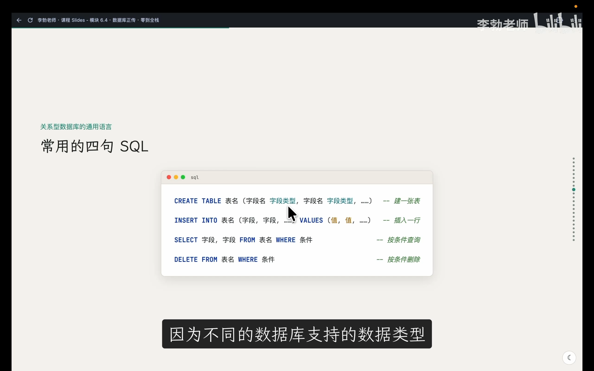

### 2. DDL 规范：创建电影数据表（films）
为演示 SQL 增删改查，我们规划一张经典电影信息表 `films`：
- `id`：主键，整数自增，唯一标识每一行记录。
- `title`：电影名称，文本类型。
- `language`：语言类别，文本类型。
- `release_date`：上映时间，文本类型。
- `created_at`：记录写入时间，文本类型。

```sql
CREATE TABLE films (
    id INTEGER PRIMARY KEY AUTOINCREMENT,
    title TEXT,
    language TEXT,
    release_date TEXT,
    created_at TEXT
);
```

> [!IMPORTANT] 为什么数据表必须引入自增主键（PRIMARY KEY AUTOINCREMENT）？
> 现实世界中的自然属性（如电影名称、语言、上映日期）在理论上均存在同名、变更或重复的可能。在关系型数据库设计范式中，必须为每条数据赋予一个与业务逻辑解耦的无物理意义代理键（Surrogate Key），配合 `AUTOINCREMENT` 自增机制保证绝对唯一，同时主键默认会自动创建 B-Tree 索引以保障检索性能。

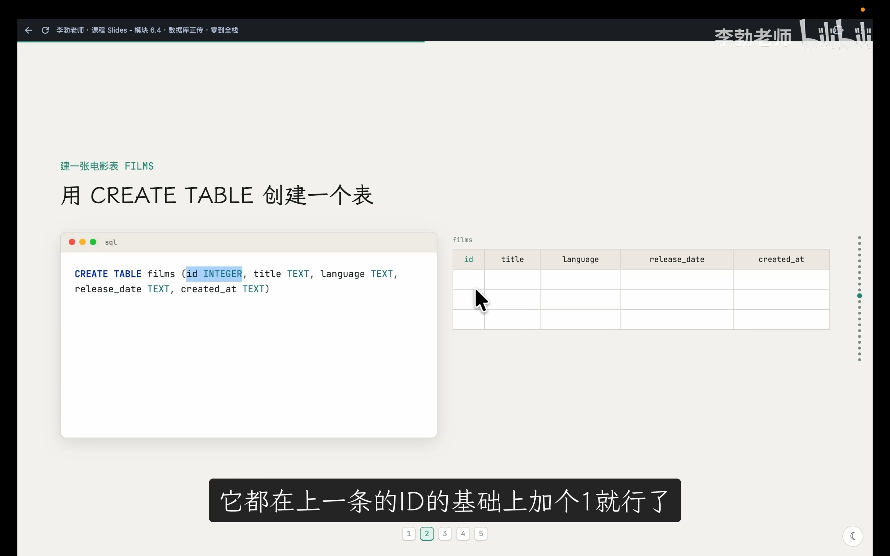

在 Python 中执行建表 DDL 时，通过游标对象的 `execute()` 方法发送 SQL 语句：

```python
cursor.execute('''
CREATE TABLE films (
    id INTEGER PRIMARY KEY AUTOINCREMENT,
    title TEXT,
    language TEXT,
    release_date TEXT,
    created_at TEXT
)
''')
```

---

## 四、数据写入与事务（Transaction）的原子性保障
*(参考时间: 13:15 - 18:20)*

建表完成后，便可使用 `INSERT INTO` 语句向表中灌入数据。

### 1. 插入单条记录
```python
cursor.execute('''
INSERT INTO films (title, language, release_date, created_at)
VALUES ('肖申克的救赎', '英语', '1994-09-10', datetime('now'))
''')
conn.commit()  # 关键：提交事务
```

语句要点剖析：
1. **字符串字面量**：SQL 语法中，文本字面量必须使用单引号 `'...'` 包裹。
2. **内建时间函数**：`datetime('now')` 是 SQLite 内建的时间函数，无需在 Python 端获取本地系统时区时间，SQLite 会自动读取当前 UTC 时间并生成标准格式文本。
3. **省略自增主键**：`id` 字段由于配置了 `AUTOINCREMENT`，无需在 INSERT 列表显式指定，数据库底层自动自增分配。

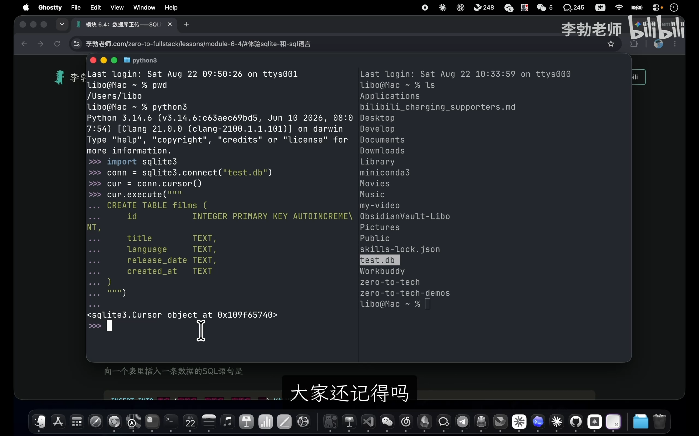

### 2. 核心机制：事务（Transaction）与 `commit()` 的原子性保障
很多初学者常产生疑问：*“为什么 `cursor.execute()` 执行之后，必须额外调用 `conn.commit()`？为什么不让每条语句直接物理写入磁盘？”*

答案在于**保证业务单元的原子性（Atomicity）与数据一致性（Consistency）**。

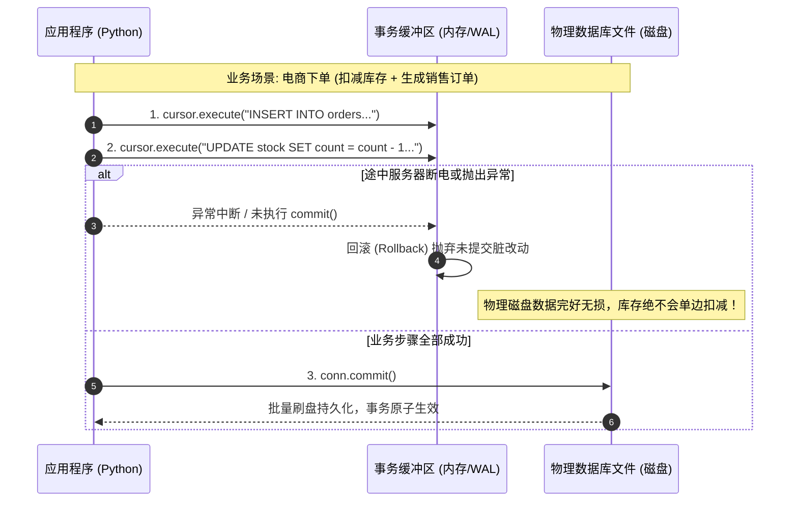
```mermaid
sequenceDiagram
    autonumber
    participant App as 应用程序 (Python)
    participant Trans as 事务缓冲区 (内存/WAL)
    participant Disk as 物理数据库文件 (磁盘)

    Note over App, Disk: 业务场景: 电商下单 (扣减库存 + 生成销售订单)
    App->>Trans: 1. cursor.execute("INSERT INTO orders...")
    App->>Trans: 2. cursor.execute("UPDATE stock SET count = count - 1...")
    alt 途中服务器断电或抛出异常
        App-->>Trans: 异常中断 / 未执行 commit()
        Trans->>Trans: 回滚 (Rollback) 抛弃未提交脏改动
        Note over Disk: 物理磁盘数据完好无损，库存绝不会单边扣减！
    else 业务步骤全部成功
        App->>Disk: 3. conn.commit()
        Disk-->>App: 批量刷盘持久化，事务原子生效
    end
```

以企业进销存业务为例：一笔销售业务逻辑上必须同时完成两件事：
1. 向销售记录表插入一条订单。
2. 在库存商品表中扣减对应的库存计数。

若没有事务机制，当第一条语句写入成功、而第二条语句因网络或断电执行失败时，数据库将处于“订单存在但库存未扣”的脏数据撕裂状态。**事务确保了一组操作要么全部成功持久化，要么全部不生效（回滚 Rollback）**。

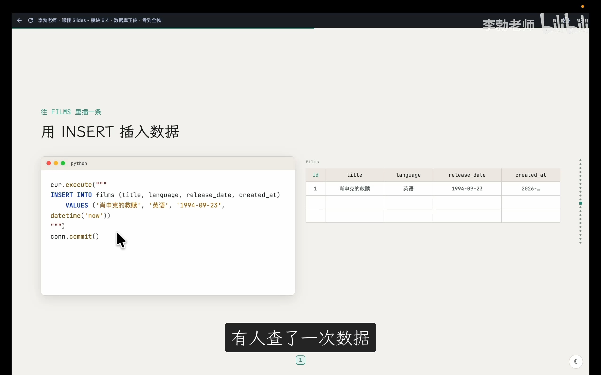

---

## 五、数据查询、游标控制与数据操纵语句（DML）
*(参考时间: 18:20 - 22:25)*

### 1. 查询基础与游标提取（SELECT & FETCH）
查询数据采用标准的 `SELECT` 语法结构：`SELECT 字段名 FROM 表名 WHERE 过滤条件`。
- 若需要提取表内所有字段，可使用通配符星号 `*`。
- 在 Python 中，`cursor.execute()` 仅仅是将查询请求推送到引擎并初始化结果集游标，程序必须通过调用游标的提取方法将结果载入内存：
  - `cursor.fetchall()`：提取满足条件的全部记录（返回由元组构成的列表）。
  - `cursor.fetchone()`：仅提取下一条匹配记录。

```python
cursor.execute("SELECT * FROM films WHERE id = 1")
result = cursor.fetchall()
print(result)
# 输出: [(1, '肖申克的救赎', '英语', '1994-09-10', '2026-09-15 03:00:00')]
```

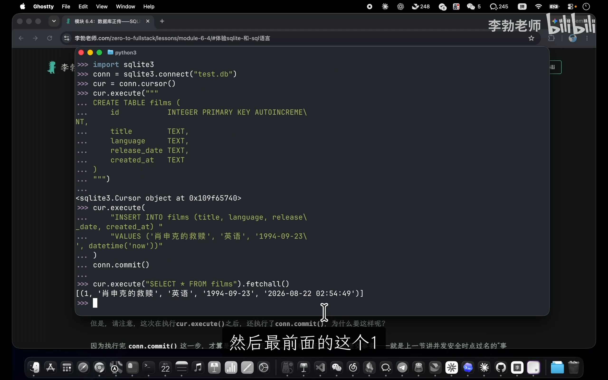

### 2. 数据更新与删除的红线警示
- **数据更新（UPDATE）**：
  ```sql
  UPDATE films SET language = '中文字幕' WHERE id = 1;
  ```
- **数据删除（DELETE）**：
  ```sql
  DELETE FROM films WHERE id = 1;
  ```
  > [!CAUTION] 永远敬畏没有 WHERE 的 DELETE 与 DROP！
  > `DELETE FROM films;` 若不带 `WHERE` 条件，将瞬间清空整张表的所有数据行！
  > 而 `DROP TABLE films;` 则是将数据与表结构彻底从物理磁盘抹除（即俗称的“删库跑路”）。涉及修改与删除的操作必须经过严格校验并调用 `conn.commit()` 才会持久化落盘。

---

## 六、SQL 注入攻击机理与参数化查询铁律
*(参考时间: 22:25 - 28:05)*

在日常 Web 业务开发中，根据用户输入的关键词动态检索数据是最基本的功能。然而，如果开发者采用直接**拼接 SQL 字符串**的方式传参，就会埋下计算机安全史上最为经典且灾难性的安全漏洞——**SQL 注入（SQL Injection）**。

### 1. 致命的字符串拼接漏洞演示
假设后端编写了一个根据电影标题搜索详情的接口，代码逻辑如下：

```python
# 危险的反面教材：使用 f-string 或 format 拼接 SQL
user_input = "花样年华"
query = f"SELECT * FROM films WHERE title = '{user_input}'"
cursor.execute(query)
```

当正常用户输入 `"花样年华"` 时，拼接出的 SQL 为：
```sql
SELECT * FROM films WHERE title = '花样年华'
```
逻辑正常，平稳运行。

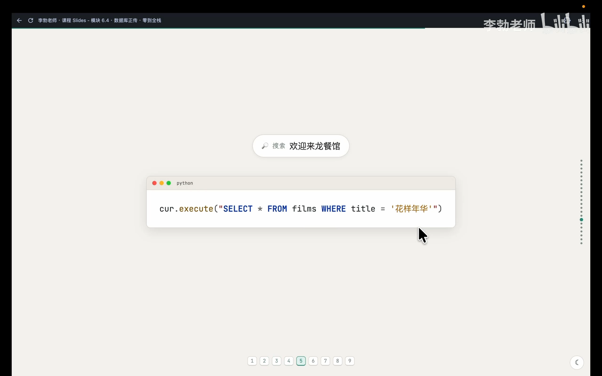

### 2. SQL 注入攻击与提权机理
假设某个恶意攻击者（或特殊命名的输入内容）提交了如下字符串：
```text
' OR '1'='1
```
代入字符串拼接逻辑后，引擎最终收到的完整 SQL 被篡改为：

```sql
SELECT * FROM films WHERE title = '' OR '1'='1'
```

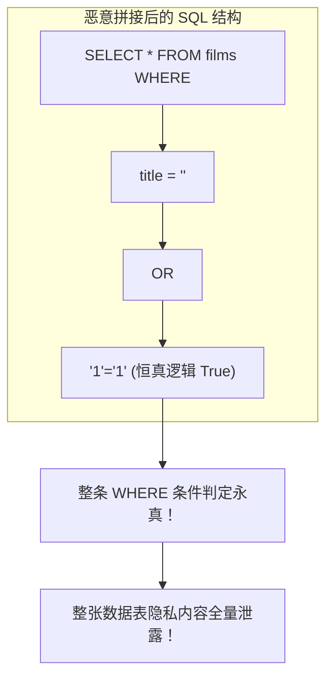
```mermaid
flowchart TD
    subgraph 恶意拼接后的 SQL 结构
        A["SELECT * FROM films WHERE"] --> B["title = ''"]
        B --> C["OR"]
        C --> D["'1'='1' (恒真逻辑 True)"]
    end
    D --> E["整条 WHERE 条件判定永真！"]
    E --> F["整张数据表隐私内容全量泄露！"]
```

攻击机理深度剖析：
1. 用户输入开头的单引号 `'`，与代码中原有的闭合单引号相撞，**提前闭合了原本用于框定文本数据的字符串边界**。
2. 注入者输入了 SQL 逻辑运算符 `OR` 以及一个恒真表达式 `'1'='1'`。
3. 对数据表中的每一行而言，不论 `title` 实际为何，`'1'='1'` 均永远成立，导致整张表的数据无死角全量泄露！如果恶意输入中注入了 `; DROP TABLE films;`，甚至能直接造成物理删库。

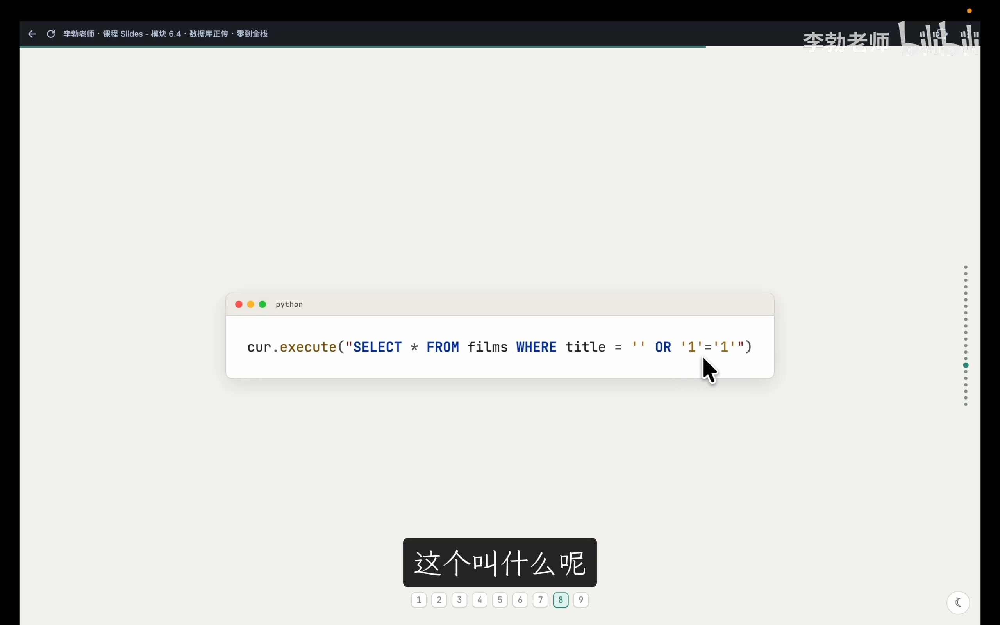

### 3. 唯一的工业级解药：参数化查询（Parameterized Query）
安全防御的核心铁律是：**“永远不要信任任何来自客户端或用户的外部输入；绝对禁止将用户输入直接作为可执行代码片段进行拼接。”**

正确的解法是使用数据库驱动支持的**参数化查询（占位符绑定机制）**：

```python
# 工业级标准解法：使用 ? 占位符 + 参数元组传递
safe_input = "' OR '1'='1"
safe_sql = "SELECT * FROM films WHERE title = ?"
cursor.execute(safe_sql, (safe_input,))
```

参数化查询的底层原理：
- 数据库引擎首先对带 `?` 占位符的 SQL 模板进行编译和词法语法解析，确立了语法树骨架。
- 随后传入的参数被驱动程序强制当成**纯文本数据值**传入，驱动会自动处理引号转义。无论参数中含有多少引号、分号或 SQL 关键字，都绝不可能跨越边界成为可执行指令。

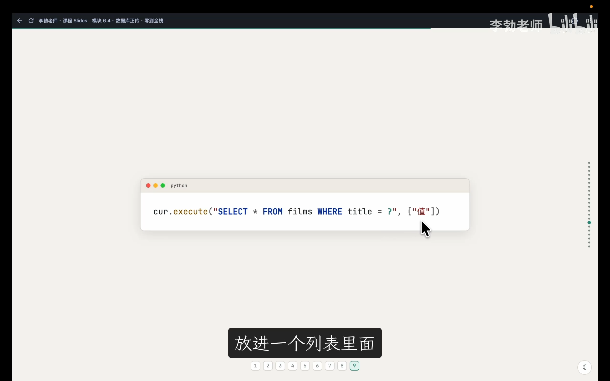

---

## 七、大数据量操纵：排序（ORDER BY）与分页截断（LIMIT）
*(参考时间: 28:05 - 34:00)*

数据库的真正威力在于处理数万乃至数亿级海量数据时的稳定与高效。为了实测大数据量下的核心功能，我们编写一段数据种子灌装脚本 `seed_data.py`。

### 1. 种子数据批量灌装脚本
```python
# seed_data.py
import sqlite3
import time

conn = sqlite3.connect('test.db')
cur = conn.cursor()

# 销毁旧表并重建
cur.execute("DROP TABLE IF EXISTS films")
cur.execute('''
CREATE TABLE films (
    id INTEGER PRIMARY KEY AUTOINCREMENT,
    title TEXT,
    language TEXT,
    release_date TEXT,
    created_at TEXT
)
''')

movies = [
    ("肖申克的救赎", "英语", "1994-09-10"),
    ("霸王别姬", "汉语", "1993-01-01"),
    ("阿甘正传", "英语", "1994-06-23"),
    ("泰坦尼克号", "英语", "1997-11-01"),
    ("千与千寻", "日语", "2001-07-20"),
    ("美丽人生", "意大利语", "1997-12-20"),
    ("星际穿越", "英语", "2014-10-26"),
    ("盗梦空间", "英语", "2010-07-08"),
    ("寄生虫", "韩语", "2019-05-21"),
    ("欢迎来龙餐馆", "德语", "2023-01-01")
]

for title, lang, rel in movies:
    cur.execute('''
    INSERT INTO films (title, language, release_date, created_at)
    VALUES (?, ?, ?, datetime('now'))
    ''', (title, lang, rel))
    conn.commit()
    time.sleep(1)  # 每次插入休眠1秒，确保每条记录的 created_at 时间错开

conn.close()
print("种子数据灌装完毕！")
```

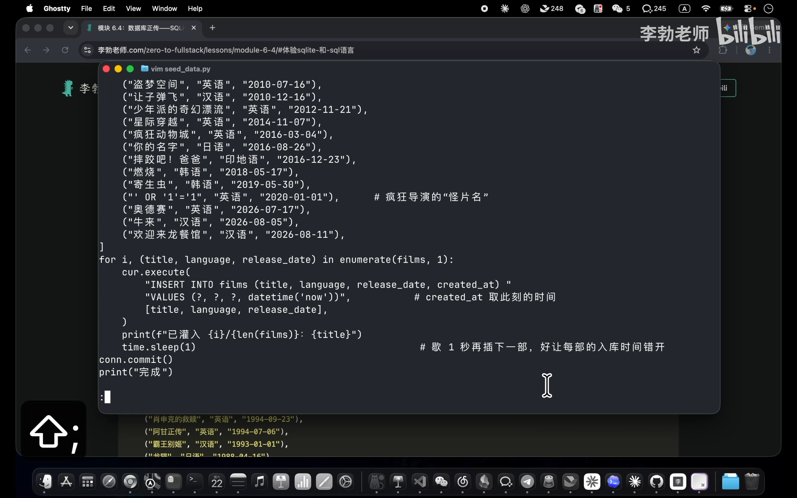

### 2. 排序与分页截断语法
- `ORDER BY <column> [ASC|DESC]`：按照指定列排序。默认 `ASC`（升序，从小到大）；指定 `DESC` 则为降序（从大到小）。
- `LIMIT <n>`：限制结果集仅返回前 $n$ 条记录。

```sql
-- 按照入库时间 created_at 逆序排列，仅获取最新的 5 部电影
SELECT title, language, created_at 
FROM films 
ORDER BY created_at DESC 
LIMIT 5;
```

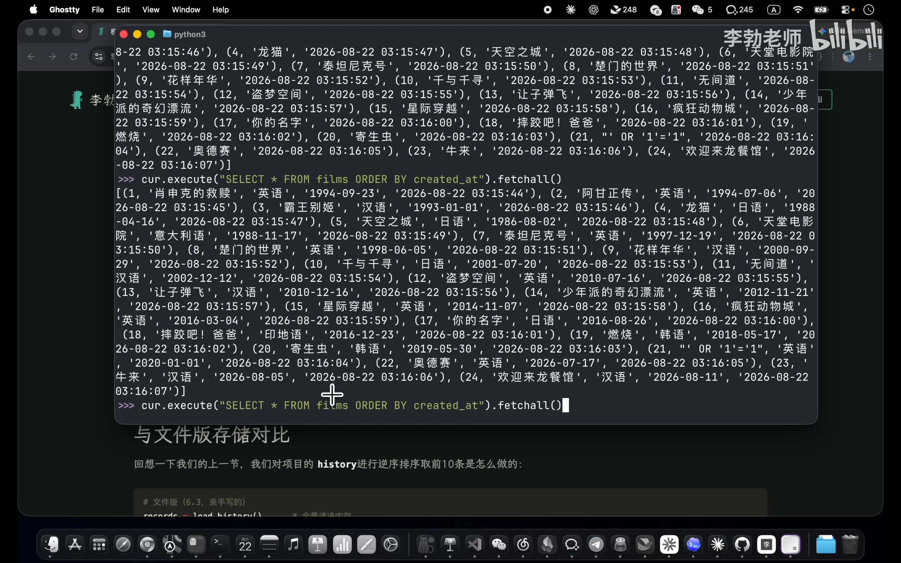

### 3. 文件方案 vs 数据库方案的本质思维跃迁
回顾上一讲中纯 Python + JSON 文件方案的实现：
```python
# 文件存储模式: 命令式 (Imperative)
# 1. 读出整份 JSON 文件并反序列化为内存中的巨型列表
# 2. 调用 Python 内置 sorted() 按照时间戳重新排布
# 3. 使用列表切片 [:5] 取出前 5 项
```
而在数据库方案中，只需向引擎发送一行声明式的 SQL 语句：
> **“命令式思维关注过程（一步一步告诉计算机怎么读、怎么排、怎么切片）；而 SQL 声明式思维关注结果（只告诉引擎‘我要按时间倒序的前五条’，具体的物理存储、并发安全与执行优化全部交给数据库内核）。”**

---

## 八、底层揭秘：数据库海量数据排序与外部归并机制
*(参考时间: 34:00 - 41:00)*

有经验的开发者会追问：*“如果全表有一亿条数据，而服务器内存只有 4GB，此时执行没有 LIMIT 的全量 ORDER BY，数据库难道不会因为将一亿条数据全搬进内存而导致 OOM（内存溢出）崩溃吗？”*

答案是：**数据库采用了极其精妙的外部排序（External Merge Sort）与局部打擂台算法**。

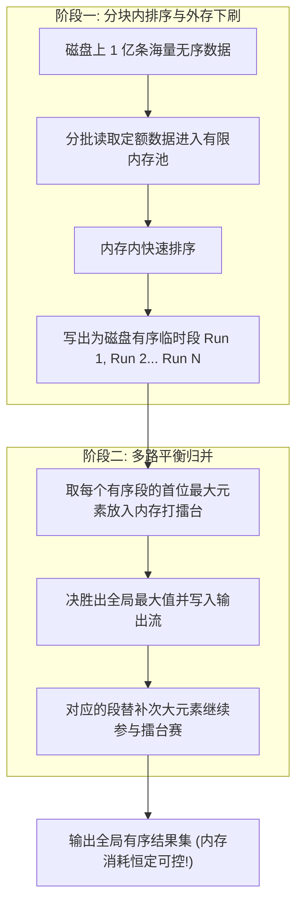
```mermaid
flowchart TD
    subgraph 阶段一: 分块内排序与外存下刷
        A[磁盘上 1 亿条海量无序数据] --> B[分批读取定额数据进入有限内存池]
        B --> C[内存内快速排序]
        C --> D[写出为磁盘有序临时段 Run 1, Run 2... Run N]
    end
    subgraph 阶段二: 多路平衡归并
        D --> E[取每个有序段的首位最大元素放入内存打擂台]
        E --> F[决胜出全局最大值并写入输出流]
        F --> G[对应的段替补次大元素继续参与擂台赛]
    end
    G --> H["输出全局有序结果集 (内存消耗恒定可控!)"]
```

### 1. 场景 A：带有 `LIMIT K` 的 Top-K 堆内存擂台赛
当 SQL 语句指定了 `ORDER BY created_at DESC LIMIT 10` 时：
1. 数据库在内存中仅开辟容纳 10 个元素的小型内存堆（如最小堆）。
2. 从磁盘逐行流式扫描记录：先填满这 10 个位置。
3. 后续每读入一条新记录，仅与当前堆中的最小值比较（打擂台）。如果新记录比当前第 10 名还要小，直接就地丢弃；若大于第 10 名，则淘汰旧的第 10 名并将新记录推入调整。
4. **全表扫描完毕后，内存中常驻的始终是全局最大的 10 条记录，内存占用极低且恒定**。

### 2. 场景 B：全量排序时的外部归并排序（External Merge Sort）
当无法通过 `LIMIT` 截断时，数据库通过两阶段策略避免 OOM：
1. **分段划分（Chunking & Run Generation）**：按照配置的内存缓冲区大小（例如 64MB），依次读入一批数据，在内存中完成排序后，作为一个个独立的有序临时文件（Run）刷写到磁盘外存。
2. **多路归并（Multi-way Merge）**：每个临时段均已内部有序。此时只需从各段的头部各取出 1 条数据放入内存比对，胜出者即为全局最大值并输出；随后从该胜出者所在的段中补入次大元素继续比拼。最终以极小的内存占用完成了对海量数据的全局稳定排序。

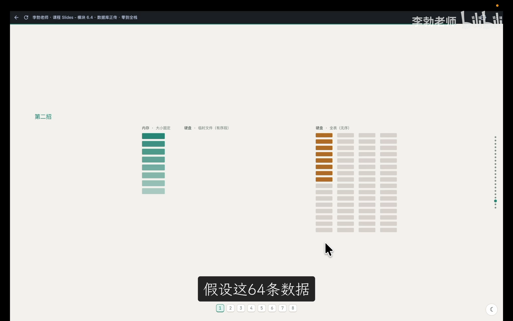

---

## 九、性能优化的核心武器：索引（Index）的工作原理与代价
*(参考时间: 41:00 - 45:30)*

虽然外部归并排序解决了“内存不会爆炸”的问题，但频繁与物理磁盘打交道进行临时文件读写，会导致查询延迟急剧升高。要实现“既不爆内存，又具备毫秒级极致检索响应”，解药便是数据库的核心机制——**索引（Index）**。

### 1. 索引的本质：排序前置与按图索骥
索引的本质是**在数据写入时，提前维护好一份基于特定列排序的轻量级检索目录（通常采用 B+Tree 结构）**。

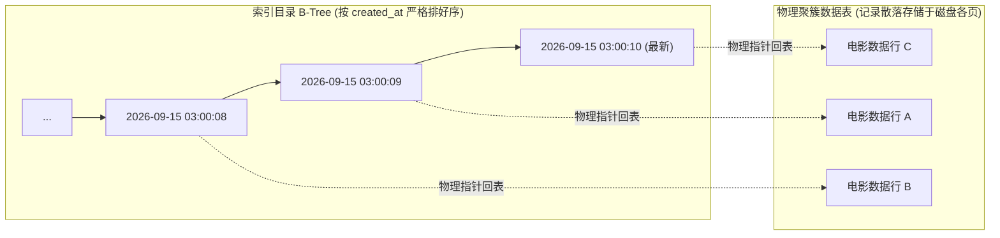
```mermaid
flowchart LR
    subgraph IndexDir["索引目录 B-Tree (按 created_at 严格排好序)"]
        I1["..."] --> I2["2026-09-15 03:00:08"]
        I2 --> I3["2026-09-15 03:00:09"]
        I3 --> I4["2026-09-15 03:00:10 (最新)"]
    end
    subgraph ClusteredTable["物理聚簇数据表 (记录散落存储于磁盘各页)"]
        R1["电影数据行 A"]
        R2["电影数据行 B"]
        R3["电影数据行 C"]
    end
    I4 -.->|物理指针回表| R3
    I3 -.->|物理指针回表| R1
    I2 -.->|物理指针回表| R2
```

当 `created_at` 字段建立了索引后：
- 如果我们要获取最新 3 条电影，数据库**无需扫描整张数据表，也无需执行任何排序算法**。
- 引擎直接沿着索引树直接定位到最右侧末尾的 3 个叶子节点，顺着节点携带的物理行指针（RowID），精准直达磁盘对应位置提取真实数据行（回表操作）。

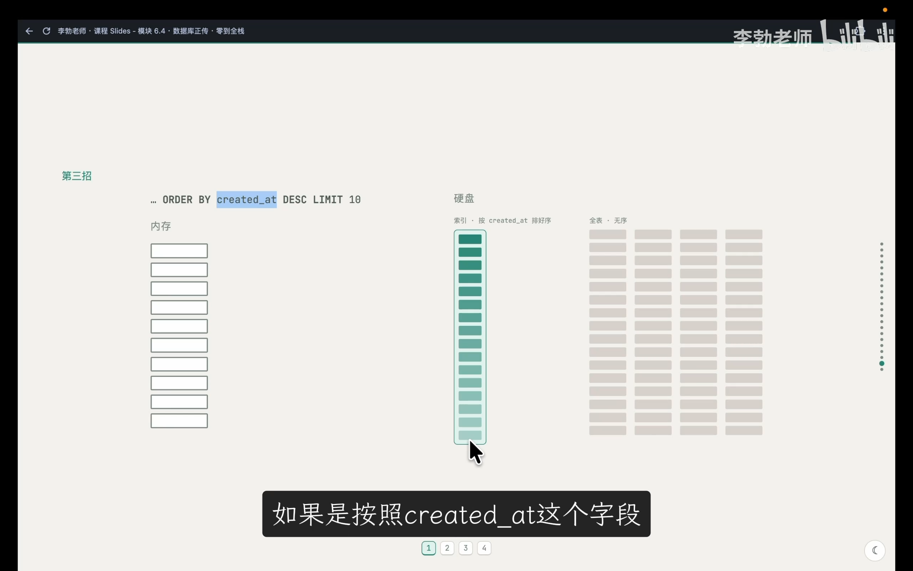

### 2. 软件工程的权衡：索引的三大代价
“天底下没有免费的午餐，所有看似完美的架构设计背后都有代价”：
1. **物理磁盘空间代价**：索引本身是一份独立的树状数据结构，需要占用额外的磁盘空间。
2. **写入与变更性能损耗**：每次执行 `INSERT`、`UPDATE`、`DELETE` 操作时，数据库内核都必须同步修改并重平衡索引树，导致数据写入吞吐量下降。
3. **维护心智代价**：除主键（`PRIMARY KEY`）默认自带索引外，普通列不会自动建立索引。必须由架构师根据高频查询场景明确声明（如 `CREATE INDEX idx_created_at ON films(created_at);`）。

> [!TIP] 生产环境建索引的黄金准则
> 严禁“雨露均沾”地为每个字段都盲目创建索引！只给经常作为 `WHERE` 过滤条件、`ORDER BY` 排序基准或 `JOIN` 关联键的高频字段创建索引。

---

## 十、数据库可视化工具（GUI）实操与进阶学习指引
*(参考时间: 45:30 - 51:35)*

### 1. SQLite 常用可视化管理客户端
在实际项目调试与数据排查时，纯代码交互不够直观。我们可以借助成熟的开源 GUI 工具直观探索数据库内容：
- **DB Browser for SQLite**：专为 SQLite 设计的开源跨平台工具，轻量快速，支持可视化查看表结构、浏览数据行与即时执行 SQL。
- **DBeaver**：功能强大的通用多数据库管理软件（社区版免费且跨平台）。
- **商业化专业工具**：如 JetBrains DataGrip、Navicat（适合对企业级多数据库协作有更高要求的开发者）。

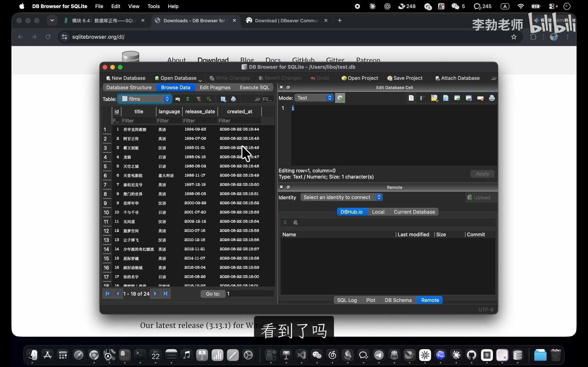

在 DB Browser for SQLite 中：
1. 点击 **Open Database** 打开本地 `test.db` 文件。
2. 切换到 **Browse Data** 选项卡，即可如同电子表格般直观查看 `films` 表内的所有行与列。
3. 切换到 **Execute SQL** 选项卡，支持直接编写并运行 SQL 查询，实时观察返回的数据集与执行耗时。

### 2. 总结与下阶段路线
通过本讲的学习，我们系统建立了对关系型数据库与 SQLite 的核心认知：
- **理解了持久化选型**：明确了关系型 vs 非关系型、服务式 vs 嵌入式的应用边界，厘清了 ZeroTech 选用 SQLite 的必然性。
- **掌握了数据库交互**：熟悉了 Python `sqlite3` 原生驱动、DDL 建表、DML 增删查改与游标处理机制。
- **筑牢了安全防线**：深刻领悟了 SQL 注入攻击的破坏机理，牢记**绝对使用参数化查询（`?` 占位符）**的开发铁律。
- **洞察了底层性能机理**：理解了海量数据下的外部归并排序与索引（Index）的以空间换时间哲学。

在接下来的第 28 讲中，我们将重返 ZeroTech 项目，彻底拆除老旧的 JSON 文件存储架构，利用 SQLite 重构文本实验室的持久化系统，全面拥抱真正的现代化数据库！
