# 6.5 重构：在项目中使用 SQLite

在上一讲“数据库正传--SQL与SQLite”中，我们系统学习了关系型数据库的基础理论、SQLite 的极简设计哲学、DDL/DML 语法规范、事务控制，以及使用参数化查询防御 SQL 注入的工业级标准。

然而，截至目前，我们的 ZeroTech 文本分析系统依然在使用老旧的 `history.json` 文件方案维护历史记录。本讲的目标是将 ZeroTech 的存储层进行彻底现代化改造：**将底层物理存储平滑迁移至 SQLite 数据库，同时确保对外 HTTP API 契约与前端交互 100% 保持不变**。

在动手编写 SQL 之前，我们将首先对后端的架构职责进行严格审视，遵循软件工程中**“重构（Refactoring）”**的黄金准则，采用**“先搬家、后装修”**的两阶段工程策略，将混杂在 `main.py` 中的接口层、业务层与存储层清晰剥离，为后续换库乃至未来架构演进筑牢坚实的边界。

---

## 目录
1. [审视现有架构：`main.py` 的职责混杂痛点](#一审视现有架构mainpy-的职责混杂痛点)
2. [重构的核心法则与“先搬家后装修”策略](#二重构的核心法则与先搬家后装修策略)
3. [第一阶段（搬家）：抽离 `storage.py` 存储模块](#三第一阶段搬家抽离-storagepy-存储模块)
4. [深化架构边界：`LIMIT` 分页截断的决定权归属](#四深化架构边界limit-分页截断的决定权归属)
5. [第二阶段（装修）：`storage.py` 全面接入 SQLite](#五第二阶段装修storagepy-全面接入-sqlite)
6. [`main.py` 接入初始化与系统全链路联调](#六mainpy-接入初始化与系统全链路联调)
7. [生产级工程规范：数据不进 Git 与老资产清理](#七生产级工程规范数据不进-git-与老资产清理)
8. [架构拓展视野：ORM（对象关系映射）核心机理](#八架构拓展视野orm对象关系映射核心机理)
9. [高频查询优化：在代码中声明式创建索引](#九高频查询优化在代码中声明式创建索引)
10. [总结与下一阶段演进：会话与状态隔离](#十总结与下一阶段演进会话与状态隔离)

---

## 一、审视现有架构：`main.py` 的职责混杂痛点
*(参考时间: 00:00 - 03:00)*

打开我们当前的 `backend/main.py`，虽然文件仅有几十行代码，但仔细梳理会发现它同时承担了三种完全不同的系统职责：

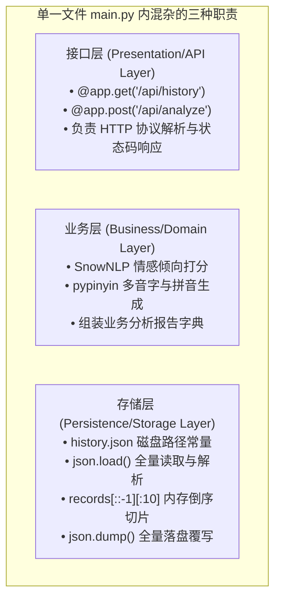
```mermaid
graph TD
    subgraph 单一文件 main.py 内混杂的三种职责
        R1["接口层 (Presentation/API Layer)<br/>• @app.get('/api/history')<br/>• @app.post('/api/analyze')<br/>• 负责 HTTP 协议解析与状态码响应"]
        R2["业务层 (Business/Domain Layer)<br/>• SnowNLP 情感倾向打分<br/>• pypinyin 多音字与拼音生成<br/>• 组装业务分析报告字典"]
        R3["存储层 (Persistence/Storage Layer)<br/>• history.json 磁盘路径常量<br/>• json.load() 全量读取与解析<br/>• records[::-1][:10] 内存倒序切片<br/>• json.dump() 全量落盘覆写"]
    end
```

在功能原型阶段，几行读写文件的逻辑顺手写在路由函数内尚可接受。但当我们需要将存储底层从 JSON 替换为 SQLite 时，这种耦合就会引发灾难：**我们本只想改动数据的持久化方式，却不得不深入修改接口层路由函数内部的代码**。

如果在接口函数内直接混入 SQL 语句或数据库连接游标，未来当存储介质需要从 SQLite 升级为分布式 PostgreSQL 时，所有的业务与接口代码都将被迫再次遭受牵连。因此，在正式切换数据库之前，必须先对代码结构进行解耦。

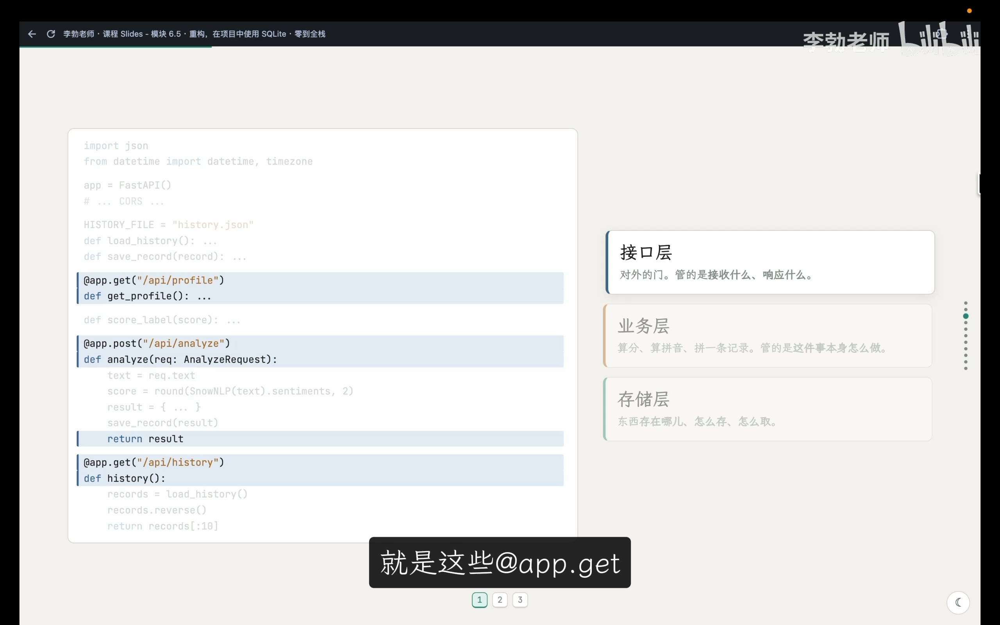

---

## 二、重构的核心法则与“先搬家后装修”策略
*(参考时间: 03:00 - 08:30)*

### 1. 重构的严谨定义与唯一标尺
软件工程领域对**代码重构（Refactoring）**有着严格的定义：
> **“重构是在不改变软件系统‘外部可观察行为’的前提下，改善其内部结构的高级技术。”**

重构的核心纪律是：**只挪位置，不改行为**。重构前后，系统接收相同的输入，必须产生绝对相同的输出。这一原则为重构提供了天然的验收标尺：重构完毕后运行测试，但凡结果有一丝一毫不同，就证明重构出现了偏差。

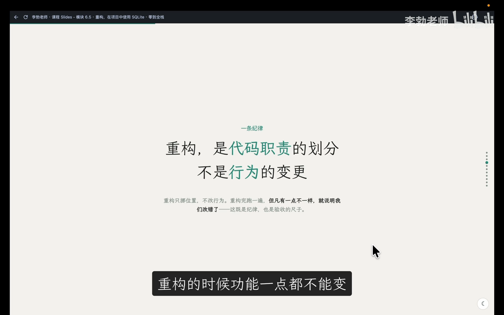

### 2. 为什么新建的文件命名为 `storage.py`？
我们将拆分出的存储层模块命名为 `storage.py`，而不是 `sqlite.py` 或 `db.py`。
- **依据职责命名，而非依据实现命名**：这一层的核心职责是“提供存储能力（Storage）”，其实现介质今天可以是本地 JSON，明天可以是 SQLite，未来还可以是云端 PostgreSQL。
- **调用方接口稳定**：外部接口始终调用 `save_record()` 与 `get_history()`，无论底层物理介质如何翻天覆地，上层消费方无需感知任何名称变更。

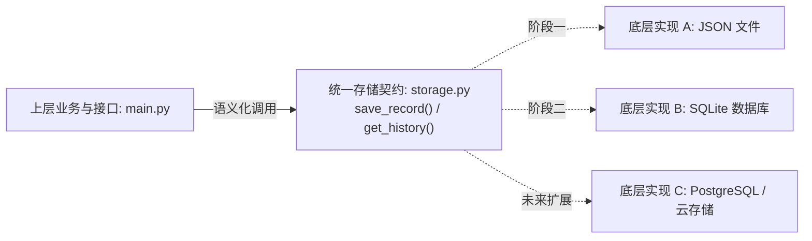
```mermaid
flowchart LR
    A[上层业务与接口: main.py] -->|语义化调用| B["统一存储契约: storage.py<br/>save_record() / get_history()"]
    B -.->|阶段一| C[底层实现 A: JSON 文件]
    B -.->|阶段二| D[底层实现 B: SQLite 数据库]
    B -.->|未来扩展| E[底层实现 C: PostgreSQL / 云存储]
```

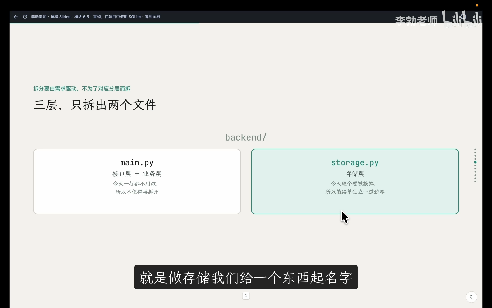

### 3. “先搬家、后装修”两阶段策略
许多开发者习惯“边搬文件、边改写为 SQL”，但这往往会导致灾难性的调试泥潭：
- **“搬坏了”**：导入路径错误、函数作用域丢失、少拷了一行常量。
- **“改坏了”**：SQL 语法报错、数据类型不匹配、事务未提交。

如果两件事混在一起，一旦系统报错，我们将无法判断究竟是文件拆分导致还是数据库驱动导致，唯一的“行为不变”验证标尺瞬间失效。因此，工程上的稳健策略是**两步走**：
1. **第一阶段（搬家）**：把 JSON 存储代码原封不动搬入 `storage.py`，保持功能 100% 不变，验证通过后形成一个独立的 Git 提交。
2. **第二阶段（装修）**：将 `storage.py` 内部彻底替换为 SQLite 实现，此时 `main.py` 几乎无需任何改动。

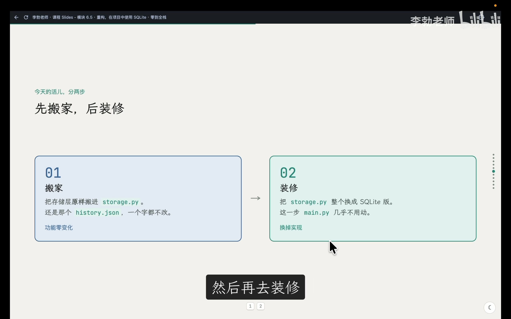

---

## 三、第一阶段（搬家）：抽离 `storage.py` 存储模块
*(参考时间: 08:30 - 16:00)*

### 1. 新建 `backend/storage.py` 并迁入文件存储代码
在 `backend/` 目录下创建 `storage.py`，将原本混杂在 `main.py` 中的存储相关资产完整迁移过来：

```python
# backend/storage.py (第一阶段: 原样搬迁版)
import json
from pathlib import Path

# 持久化数据文件路径常量
HISTORY_FILE = Path(__file__).parent / "history.json"

def load_history():
    """读取并反序列化完整的历史记录列表"""
    if not HISTORY_FILE.exists():
        return []
    try:
        with open(HISTORY_FILE, "r", encoding="utf-8") as f:
            return json.load(f)
    except Exception:
        return []

def save_record(record: dict):
    """追加写入单条分析记录"""
    history = load_history()
    history.append(record)
    with open(HISTORY_FILE, "w", encoding="utf-8") as f:
        json.dump(history, f, ensure_ascii=False, indent=2)

def get_history():
    """获取格式化后的最近历史记录列表"""
    records = load_history()
    records.reverse()  # 逆序排布，最新的排在最前
    return records[:2]  # 原接口中内嵌的切片逻辑
```

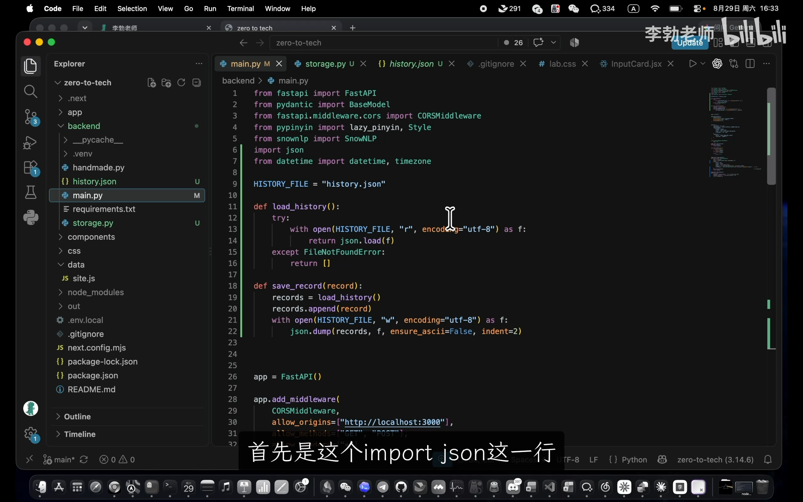

### 2. 净化 `main.py`：仅引入存储接口
在 `backend/main.py` 中移除 `import json` 和底层读写逻辑，通过模块导入消费存储能力：

```python
# backend/main.py 顶部引入
from storage import save_record, get_history

# /api/history 路由函数被大幅精炼
@app.get("/api/history")
def read_history():
    return get_history()
```

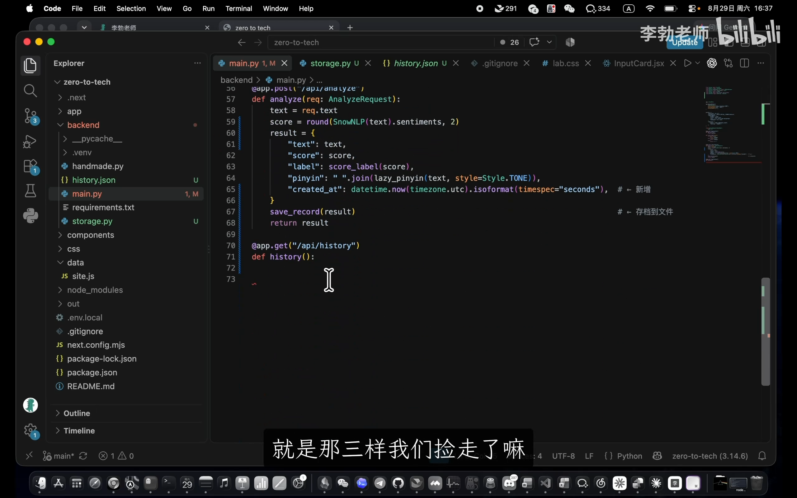

### 3. 第一阶段验证：外部行为完全一致
重启 FastAPI 后端服务（避免热更新未捕获模块新增）：
1. 在前端页面输入并提交测试文本：`“生活没有标准答案，但每一天都值得认真感受”`。
2. 访问 `http://localhost:8000/api/history` 检查返回的 JSON 数据。
3. 查验本地 `history.json` 文件已成功写入新记录。

验证表明：**系统功能与数据流与拆分前毫无二致，“搬家”成功！**

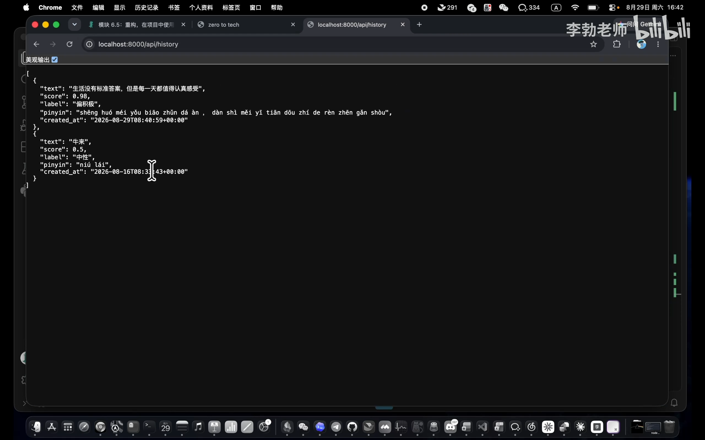

---

## 四、深化架构边界：`LIMIT` 分页截断的决定权归属
*(参考时间: 16:00 - 22:30)*

在完成文件搬迁后，我们重新审视 `storage.py` 中的 `get_history()` 函数：
```python
def get_history():
    records = load_history()
    records.reverse()
    return records[:2]  # 思考：这里的硬编码 [:2] 是否合理？
```

### 1. 动作权 vs 决定权
- **执行动作（Action）**：从底层读取数据、逆序排布、只截取前 $N$ 条，这是存储层的职责（在 SQL 中对应 `ORDER BY ... LIMIT ?`）。
- **决定数量（Decision）**：到底展示 2 条、10 条还是 50 条？**这个决定权绝对不属于存储层**！
  - 存储层不感知客户端究竟是屏幕狭小的手机端、还是大屏桌面端；
  - 存储层更不感知 UI 页面为历史记录区域分配了多大的展示高度。

如果把数量写死在存储层，未来移动端若需要展示 5 条记录，就不得不去修改底层的 `storage.py`。

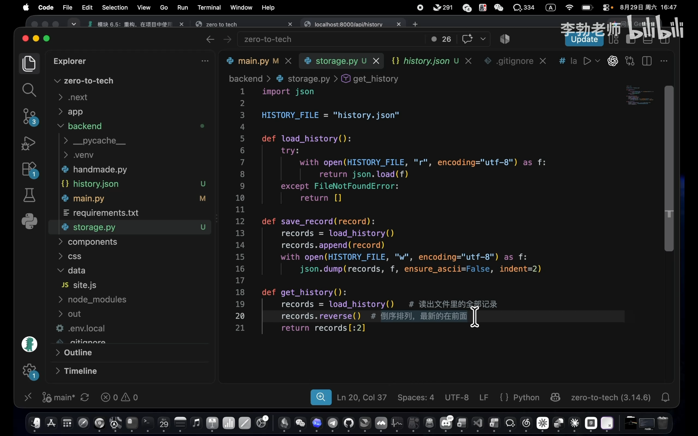

### 2. 控制反转：将决定权交还调用方
重构方案是：为 `get_history()` 引入显式参数 `limit: int`，存储层只执行命令，数量由上层调用者裁定：

```python
# backend/storage.py
def get_history(limit: int):
    """存储层仅负责根据传入的 limit 参数执行截断"""
    records = load_history()
    records.reverse()
    return records[:limit]

# backend/main.py
@app.get("/api/history")
def read_history():
    """接口层作为调用方，明确指定业务所需的数据量"""
    return get_history(limit=10)
```

通过这一调整，我们理顺了组件间的职责契约，为下一步将切片动作映射到 SQL `LIMIT` 语句铺平了道路。

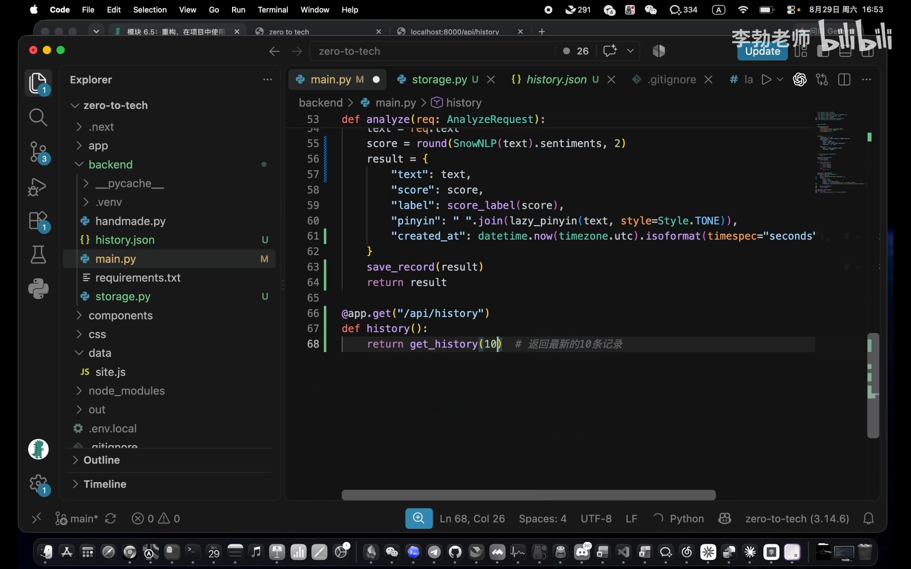

---

## 五、第二阶段（装修）：`storage.py` 全面接入 SQLite
*(参考时间: 22:30 - 31:30)*

架构边界清晰后，我们正式执行第二阶段“装修”，在保持对外函数签名不变的前提下，将 `backend/storage.py` 的底层驱动完整切换为 SQLite。

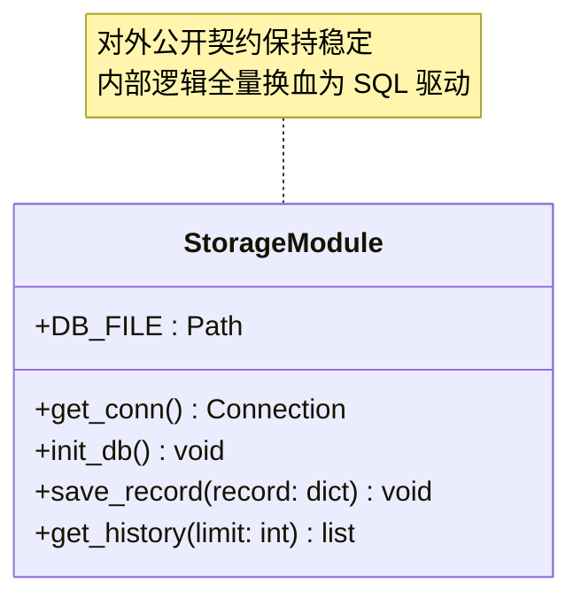
```mermaid
classDiagram
    class StorageModule {
        +DB_FILE : Path
        +get_conn() Connection
        +init_db() void
        +save_record(record: dict) void
        +get_history(limit: int) list
    }
    note for StorageModule "对外公开契约保持稳定<br/>内部逻辑全量换血为 SQL 驱动"
```

六处关键改造规划如下：
1. **替换驱动库**：移除 `json`，引入标准库 `sqlite3`。
2. **定义连接池辅助函数**：封装 `get_conn()` 并注入 `row_factory`。
3. **实现幂等性建表**：编写 `init_db()` 初始化 `history` 数据表。
4. **改造写入逻辑**：在 `save_record()` 中使用参数化 `INSERT` 替换文件追加。
5. **改造读取逻辑**：在 `get_history()` 中使用 `ORDER BY ... LIMIT ?` 单行 SQL 替换内存全量排序。
6. **清理废弃函数**：安全移除已无调用方的 `load_history()`。

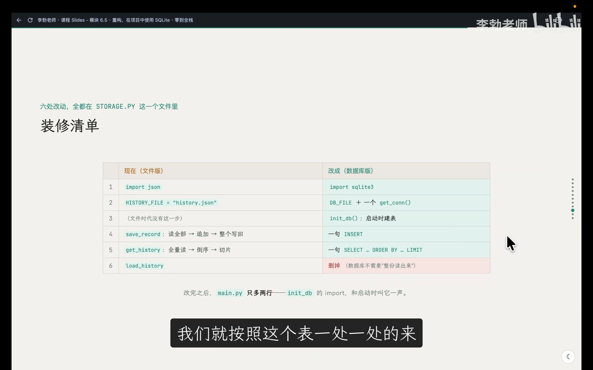

### 1. 连接管理与字典化游标配置
```python
import sqlite3
from pathlib import Path

DB_FILE = Path(__file__).parent / "history.db"

def get_conn():
    """建立数据库连接，并配置 Row 工厂以实现字典化按列名访问"""
    conn = sqlite3.connect(DB_FILE)
    conn.row_factory = sqlite3.Row  # 关键：让查询结果以类似字典的对象返回
    return conn
```

> [!NOTE] 为什么必须配置 `conn.row_factory = sqlite3.Row`？
> 默认情况下，SQLite 查询返回的是纯元组（如 `(1, '你好', 0.8)`）。必须依靠下标访问。配置 `sqlite3.Row` 之后，既可以通过索引也可以通过列名 `row["text"]` 直接读取，极大提升了代码的可读性与向后兼容性。

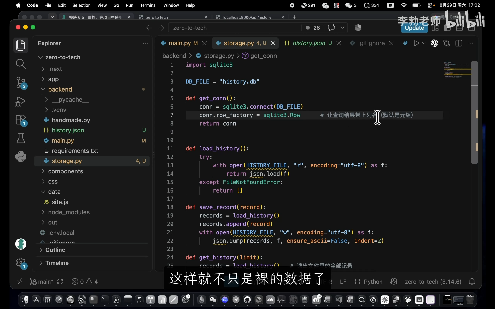

### 2. 幂等建表函数 `init_db()`
数据库不能像文件那样无序写入，必须在写入前确立 Schema。我们在应用代码中统一管理建表 DDL：

```python
def init_db():
    """初始化数据库与数据表，具备幂等性 (IF NOT EXISTS)"""
    conn = get_conn()
    cur = conn.cursor()
    cur.execute('''
    CREATE TABLE IF NOT EXISTS history (
        id INTEGER PRIMARY KEY AUTOINCREMENT,
        text TEXT,
        score REAL,
        label TEXT,
        pinyin TEXT,
        created_at TEXT
    )
    ''')
    conn.commit()
    conn.close()
```

> [!TIP] 幂等性设计（Idempotence）
> 引入 `IF NOT EXISTS` 关键字后，系统每次启动时执行建表语句均绝对安全：表不存在时创建，表已存在时静默跳过，避免重复建表抛出异常。

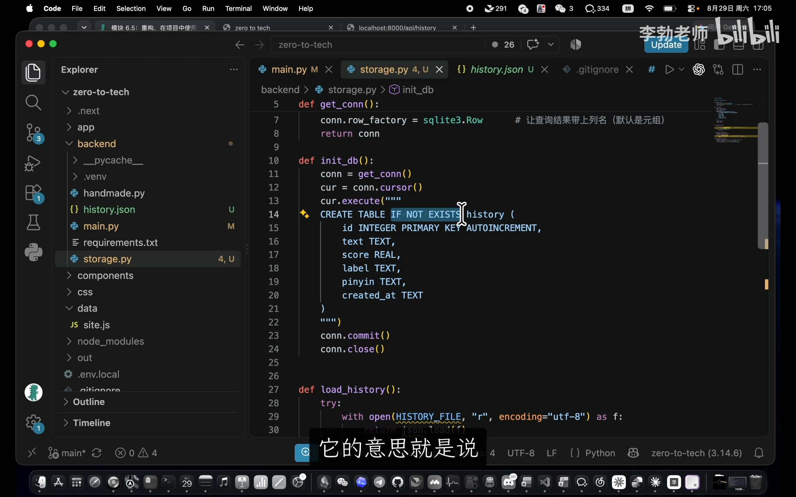

### 3. 参数化插入记录 `save_record()`
```python
def save_record(record: dict):
    """将文本分析记录安全插入数据库"""
    conn = get_conn()
    cur = conn.cursor()
    # 严格采用 ? 占位符传递参数，杜绝 SQL 注入漏洞
    cur.execute('''
    INSERT INTO history (text, score, label, pinyin, created_at)
    VALUES (?, ?, ?, ?, ?)
    ''', [
        record.get("text"),
        record.get("score"),
        record.get("label"),
        record.get("pinyin"),
        record.get("created_at")
    ])
    conn.commit()
    conn.close()
```

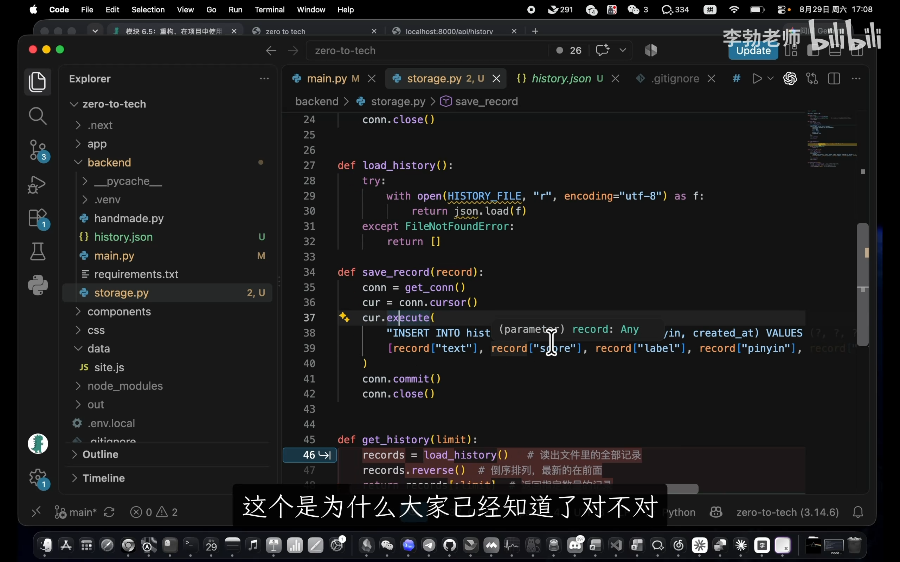

### 4. 声明式高效查询 `get_history()`
```python
def get_history(limit: int = 10):
    """利用 SQL 内核高效检索最新的 N 条历史记录"""
    conn = get_conn()
    cur = conn.cursor()
    cur.execute('''
    SELECT * FROM history 
    ORDER BY created_at DESC 
    LIMIT ?
    ''', [limit])
    rows = cur.fetchall()
    conn.close()
    
    # 将 sqlite3.Row 映射为通用字典列表，适配 FastAPI JSON 序列化
    return [dict(row) for row in rows]
```

对比旧版文件操作，这一行 SQL 将“全盘读取”、“内存倒排”、“切片截断”的所有繁琐计算全部下沉至 C 语言编写的 SQLite 高性能内核中，彻底摆脱了应用层 OOM 风险。

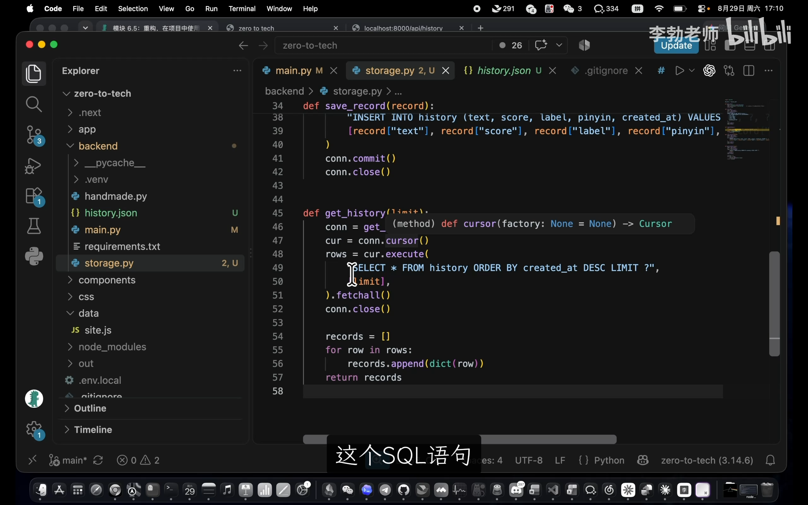

---

## 六、`main.py` 接入初始化与系统全链路联调
*(参考时间: 31:30 - 35:10)*

在 `backend/main.py` 中引入 `init_db` 并在应用全局启动时完成数据库表的就绪检查：

```python
# backend/main.py
from fastapi import FastAPI
from storage import init_db, save_record, get_history

app = FastAPI()

# 服务启动时即刻初始化数据库 Schema
init_db()
```

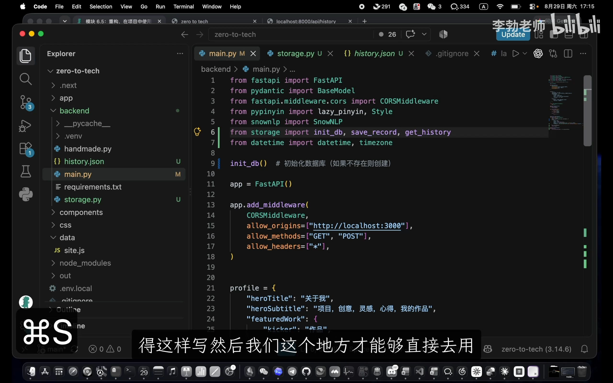

### 全链路联调与 GUI 核查
1. 重启 FastAPI 服务，终端无任何异常报错。
2. 在前端 Web 页面输入新文本：`“今晚月色真美”`，点击提交。
3. 接口顺利响应分析结果，下方历史记录区域即时呈现出最新记录。
4. 使用 **DB Browser for SQLite** 打开新生成的 `backend/history.db` 文件，切换到 **Browse Data** 视图，可以清晰看到数据库已经自动分配了自增主键 `id`，数据整齐规整地存入表中。

> [!NOTE] 契约向前兼容
> 虽然接口返回的记录中新增了 `id` 字段，但在 RESTful API 设计中，**向响应中增加非破坏性字段完全符合契约兼容原则**，原有的前端应用依然平稳运行，零代码改动！

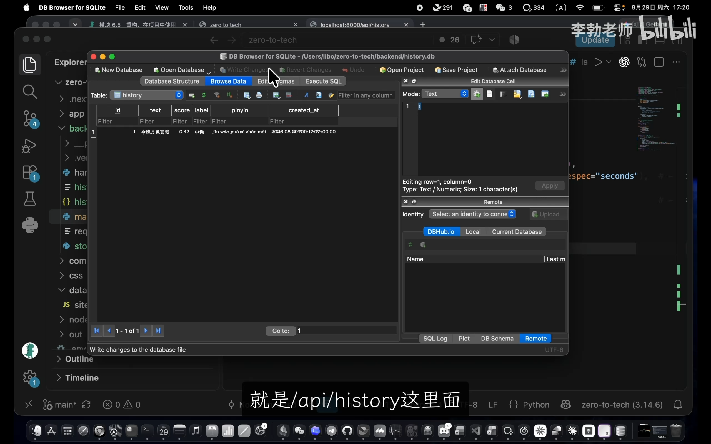

---

## 七、生产级工程规范：数据不进 Git 与老资产清理
*(参考时间: 35:10 - 37:25)*

数据库改造完成后，必须遵循专业团队的软件工程基准进行收尾。

### 1. 软件工程铁律：数据不进 Git 代码仓库
物理文件 `backend/history.db` 是服务在运行时动态产生的**运行时状态数据（State/Data）**。
- 源代码（Code）属于版本控制的资产；
- 数据（Data）具有环境隔离性（开发、测试、生产各自拥有独立的真实数据），绝不能混入 Git 仓库中。

我们在项目根目录的 `.gitignore` 中追加一行规则：
```gitignore
# 忽略 SQLite 物理数据库文件
backend/*.db
backend/*.sqlite3
```

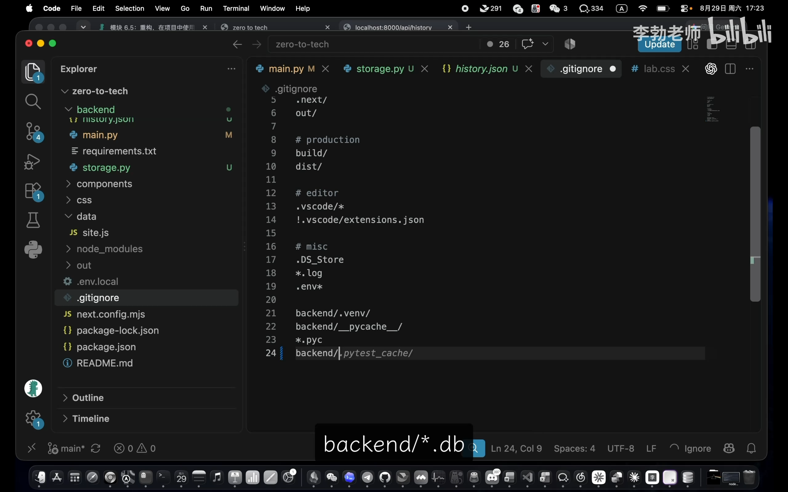

### 2. 废弃文件清理与历史数据迁移的思考
- **清理过渡资产**：在项目中执行 `git rm backend/history.json`，将旧版文件存储资产安全下线。
- **工业界数据迁移（Data Migration）的现实要求**：在本课程实验中，由于是尚未上线的开发原型，我们可以直接丢弃 `history.json` 中的历史数据。但在生产环境中，**数据迁移是一项极其严肃的核心工程**，必须编写严格的迁移脚本（Migration Script），确保旧有成千上万条历史数据 100% 格式对齐并完整入库，容不得半点差池。

---

## 八、架构拓展视野：ORM（对象关系映射）核心机理
*(参考时间: 37:25 - 39:50)*

在大型现代后端项目中，很多团队并不推荐在 Python 逻辑中手写原生 SQL 字符串，而是广泛使用 **ORM（Object-Relational Mapping，对象关系映射）** 框架（如 FastAPI 官方力推的 `SQLModel`，以及 `SQLAlchemy`、Django ORM 等）。

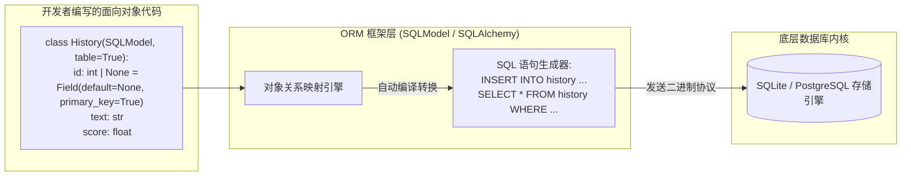
```mermaid
flowchart LR
    subgraph DevCode["开发者编写的面向对象代码"]
        A["class History(SQLModel, table=True):<br/>    id: int | None = Field(default=None, primary_key=True)<br/>    text: str<br/>    score: float"]
    end
    subgraph ORMLayer["ORM 框架层 (SQLModel / SQLAlchemy)"]
        B["对象关系映射引擎"]
        B -->|自动编译转换| C["SQL 语句生成器:<br/>INSERT INTO history ...<br/>SELECT * FROM history WHERE ..."]
    end
    subgraph DBLayer["底层数据库内核"]
        D[("SQLite / PostgreSQL 存储引擎")]
    end
    A --> B
    C -->|发送二进制协议| D
```

ORM 的核心价值在于：
- **用面向对象编程（OOP）统一数据操作**：开发者无需脱离 Python 语法上下文，直接实例化类、修改属性即可完成数据库变更。
- **自动适配多方言**：编写一套 ORM 模型，底层无论是 SQLite、MySQL 还是 PostgreSQL，框架会自动翻译为对应的 SQL 方言。
- **但底层的本质依然是 SQL**：数据库引擎永远只认识并执行原生 SQL。理解手写 SQL 的运行机制，是真正掌握并驾驭 ORM 的基石。

---

## 九、高频查询优化：在代码中声明式创建索引
*(参考时间: 39:50 - 44:00)*

在业务中，每次拉取历史记录都必须执行 `ORDER BY created_at DESC`。当数据表积攒到几十万条后，排序将成为严重的性能瓶颈。

### 1. 在 `init_db()` 中声明式引入索引
为践行“代码即基础设施”的规范，避免在生产环境中依赖运维人员通过 GUI 手动执行命令，我们在 `init_db()` 中同步追加索引创建 DDL：

```python
def init_db():
    conn = get_conn()
    cur = conn.cursor()
    # 1. 幂等创建数据表
    cur.execute('''
    CREATE TABLE IF NOT EXISTS history (
        id INTEGER PRIMARY KEY AUTOINCREMENT,
        text TEXT,
        score REAL,
        label TEXT,
        pinyin TEXT,
        created_at TEXT
    )
    ''')
    # 2. 幂等创建基于 created_at 的排序检索索引
    cur.execute('''
    CREATE INDEX IF NOT EXISTS idx_history_created_at 
    ON history(created_at)
    ''')
    conn.commit()
    conn.close()
```

按照业界命名惯例，索引通常命名为 `idx_<表名>_<字段名>`（如 `idx_history_created_at`）。

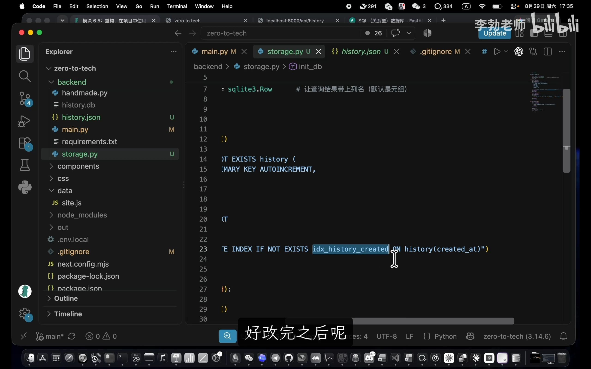

重启后端服务后，在 DB Browser for SQLite 界面刷新，可以清晰看到 `history` 表结构下方已成功挂载了 `idx_history_created_at` 索引节点。

---

## 十、总结与下一阶段演进：会话与状态隔离
*(参考时间: 44:00 - 45:51)*

本讲我们完成了一场极具工程教科书意义的系统重构：
1. **理顺了系统分层**：将单一的 `main.py` 拆分为接口层与专职的 `storage.py` 存储模块，杜绝逻辑耦合。
2. **践行了重构准则**：通过“先搬家、后装修”两阶段策略，以“外部行为不变”为标尺，稳健推进架构换血。
3. **拥抱了现代数据库**：利用 SQLite、事务原子性、参数化防注入、字典化游标与索引机制，彻底革新了持久层体系。

### 现有系统的遗留痛点与下节预告
此时系统依然存在一个严重的业务缺陷：**所有访客的历史记录全部混在同一张 `history` 表内，任何人请求 `/api/history` 看到的都是全站所有人的分析历史**！

在接下来的第 29 讲（模块收官之作）中，我们将引入现代 Web 的核心机制——**会话与状态（Cookie / Session）**，为每一位访问者颁发专属的身份标识，让每个人在页面上只能看到属于自己的分析足迹！
