# 6.6 状态与会话：让 Web 系统真正“认得人”

在上一讲“重构：在项目中使用 SQLite”中，我们顺利完成了 ZeroTech 文本分析系统的存储层解耦，将历史记录持久化移交给了嵌入式关系型数据库 SQLite，并通过索引大幅优化了检索效率。

然而，如果将当前的代码直接打包部署上线，系统将遭遇灾难性的**隐私灾难与体验坍塌**：**所有的访客记录全都被无差别地塞在同一张 `history` 数据表中，任何人只要访问页面，就能一览无余地查看到全网所有陌生用户输入的历史记录**！

本讲作为“零到全栈”模块六（后端与数据基石）的终极大收官，将深入探究 Web 底层最为迷人的核心机制——**状态（State）与会话（Session）**。我们将剖析 HTTP 协议与大模型 API 为何生来是**无状态（Stateless）**的架构取舍，系统梳理 Cookie、Session 与 Token 的核心差异，通过 CORS 跨域凭证传递、UUID、数据库复合索引与 FastAPI 响应头下发，彻底为 ZeroTech 实现工业级多用户历史记录隔离，并以全局视角对比 Web 会话与大模型上下文工程（Context Engineering）的底层逻辑。

---

## 目录
1. [隐私灾难：为什么“不认人”的网站无法投入生产？](#一隐私灾难为什么不认人的网站无法投入生产)
2. [计算机哲学：HTTP 与大模型的无状态（Stateless）本质](#二计算机哲学http-与大模型的无状态stateless本质)
3. [破局之道：会话（Session）与 Cookie 的精妙配合](#三破局之道会话session与-cookie-的精妙配合)
4. [Cookie 核心属性体系与跨源（CORS）凭证配置](#四cookie-核心属性体系与跨源cors凭证配置)
5. [数据库改造：`session_id` 字段与联合复合索引](#五数据库改造session_id-字段与联合复合索引)
6. [服务端实现：UUID 凭证颁发与数据层多租户隔离](#六服务端实现uuid-凭证颁发与数据层多租户隔离)
7. [全链路抓包验证与双浏览器隔离实战](#七全链路抓包验证与双浏览器隔离实战)
8. [深度拓展：大模型（LLM）是如何实现“会话记忆”的？](#八深度拓展大模型llm是如何实现会话记忆的)
9. [模块六全景复盘与模块七（全栈部署）路线展望](#九模块六全景复盘与模块七全栈部署路线展望)

---

## 一、隐私灾难：为什么“不认人”的网站无法投入生产？
*(参考时间: 00:00 - 03:40)*

在进入本讲前，我们在 ZeroTech 前端中补充了历史记录查看弹窗（通过请求后端 `/api/history` 接口获取数据）。

此时，如果开发者在电脑上做这样一个极具代表性的对比实验：
1. 在 **Google Chrome** 浏览器中打开文字实验室，输入并分析句子：`“生活没有标准答案”`。
2. 随后启动另一个完全独立的浏览器（如 **Apple Safari** 或 **Microsoft Edge**，亦或是 Chrome 无痕模式），访问相同的网址，直接点击历史记录弹窗。

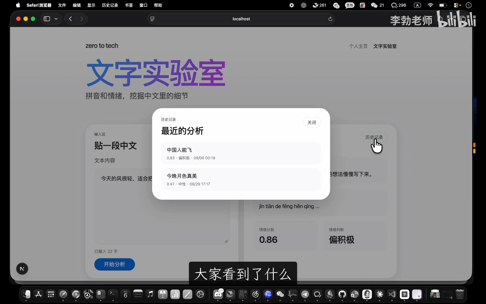

令人震惊的现象发生了：**Safari 浏览器的弹窗中，竟然赫然列出了刚才在 Chrome 中输入的分析记录**！

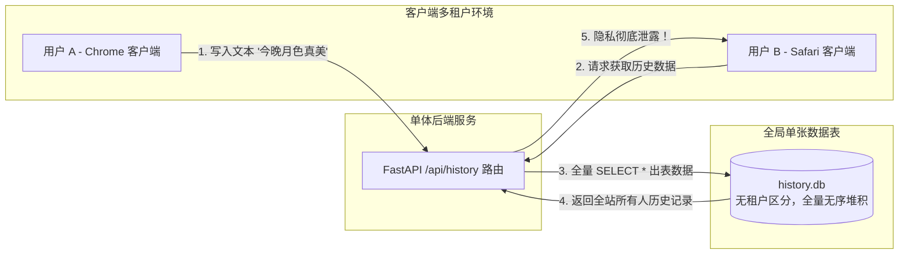
```mermaid
flowchart LR
    subgraph ClientEnv["客户端多租户环境"]
        U1["用户 A - Chrome 客户端"]
        U2["用户 B - Safari 客户端"]
    end
    subgraph BackendSvc["单体后端服务"]
        S["FastAPI /api/history 路由"]
    end
    subgraph GlobalDB["全局单张数据表"]
        DB[("history.db<br/>无租户区分，全量无序堆积")]
    end

    U1 -->|1. 写入文本 '今晚月色真美'| S
    U2 -->|2. 请求获取历史数据| S
    S -->|3. 全量 SELECT * 出表数据| DB
    DB -->|4. 返回全站所有人历史记录| S
    S -->|5. 隐私彻底泄露！| U2
```

这一实验逼真地模拟了生产环境中两位素不相识的陌生用户：**如果后端不具备“认人”的能力，所有用户在输入框键入的敏感字符都将对全网公开**。因此，赋予 Web 系统区分独立访客、实现数据隔离的能力，是任何生产级应用不可逾越的底线。

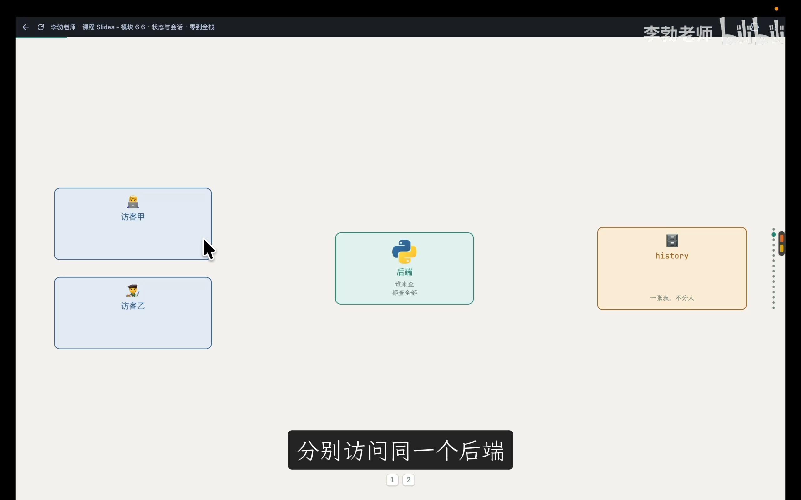

---

## 二、计算机哲学：HTTP 与大模型的无状态（Stateless）本质
*(参考时间: 03:40 - 13:40)*

系统之所以“不认人”，根本原因在于 **HTTP 协议的骨子里是彻底无状态（Stateless）的**。

### 1. HTTP 为什么被刻意设计为无状态？
在 HTTP 的规范中，一次交互仅仅是一轮由客户端发起、服务端响应的单次闭环：

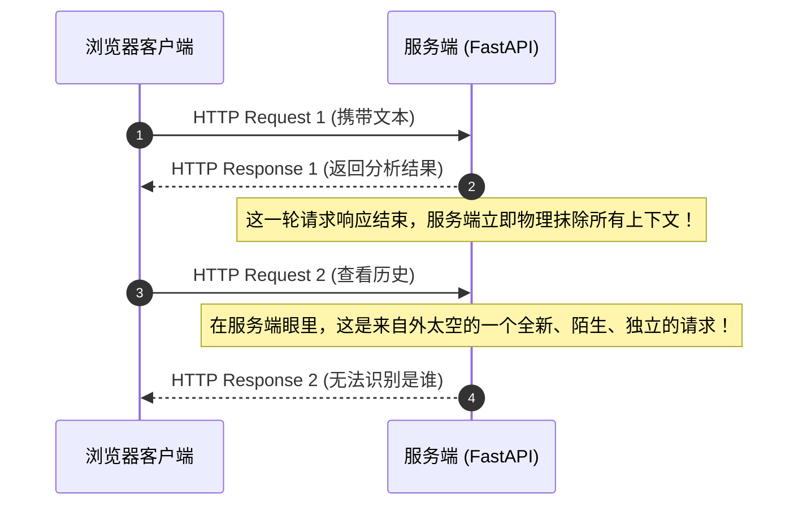
```mermaid
sequenceDiagram
    autonumber
    participant C as 浏览器客户端
    participant S as 服务端 (FastAPI)

    C->>S: HTTP Request 1 (携带文本)
    S-->>C: HTTP Response 1 (返回分析结果)
    Note over S: 这一轮请求响应结束，服务端立即物理抹除所有上下文！
    C->>S: HTTP Request 2 (查看历史)
    Note over S: 在服务端眼里，这是来自外太空的一个全新、陌生、独立的请求！
    S-->>C: HTTP Response 2 (无法识别是谁)
```

很多初学者容易将“无状态”误当成 HTTP 协议的设计缺陷，但恰恰相反——**无状态是现代互联网能够承载全球数十亿人并发访问的至尊基石**！

我们可以将 HTTP 与典型的有状态协议（如用于远程登录服务器的 **SSH 协议**）进行深度对比：

| 对比维度 | 有状态协议（如 SSH） | 无状态协议（如 HTTP） |
| :--- | :--- | :--- |
| **连接形态** | 极少量的长时间持续连接 | 海量、极短生命周期、高频并发连接 |
| **内存开销** | 服务端必须为每个连接在内存常驻现场 | 请求处理完毕即刻释放内存，无常驻包袱 |
| **弹性负载均衡** | 极差（后续所有请求必须锁死在同一台服务器） | **极致优秀**（任何一台服务器都能接管任意请求，网关任意分流） |
| **节点容灾弹性** | 服务器节点宕机，所有用户现场全毁 | 某台服务器宕机，流量无缝漂移至备用机，用户毫无感知 |

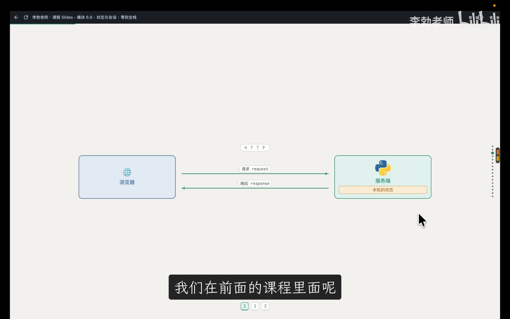
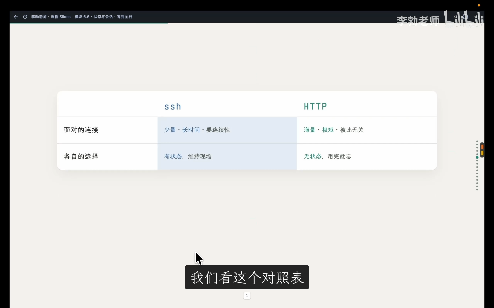

> [!NOTE] 架构的取舍（Trade-off）
> 如果把 HTTP 协议本身做成有状态的，面对双十一千万级并发请求时，没有任何一台单机内存能存得下千万份会话现场，更无法实现弹性扩容缩容。因此，协议底层坚决选择“遗忘”，将**“如何记忆用户”的权利和责任完整交给了上层应用层**。

### 2. 大模型 API（LLM）同样是纯粹的无状态
不仅 Web 协议如此，当今最前沿的生成式大语言模型（LLM，如 DeepSeek、OpenAI GPT、Claude）在 API 层面同样是彻底无状态的。

我们在终端中使用 `curl` 命令调用 DeepSeek API 进行实测：
- 第一步：向模型发送 `curl` 请求：“你好，我的名字叫李博。”模型礼貌回复：“你好李博，很高兴认识你！”
- 第二步：紧接着发送第二条 `curl` 请求：“请问我叫什么名字？”
- 模型的回答令人大跌眼镜：“抱歉，我不知道您的名字，请告诉我该如何称呼您。”

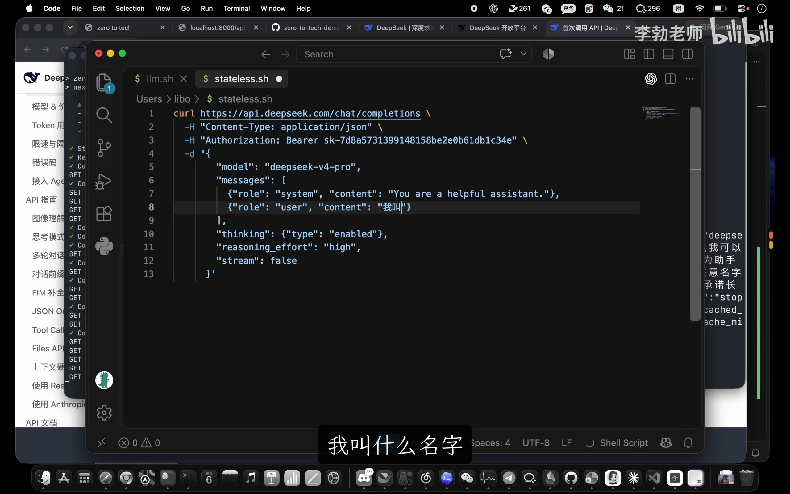

大模型在生成完最后一个 Token 后，其计算图和注意力缓存便随之销毁，对于它而言，下一次请求永远是“人类对它说的第一句话”。

---

## 三、破局之道：会话（Session）与 Cookie 的精妙配合
*(参考时间: 13:40 - 22:20)*

既然底层协议追求遗忘，而人类的业务活动（如查看自己的历史、购物车、下订单）又必须拥有前因后果，矛盾该如何化解？

工程界给出的精妙答案是：**“以最小的开销，在应用层把状态长回来！”**

### 1. 存包柜模型：会话（Session）的抽象
我们不需要把整个用户的所有历史数据塞在每一个请求里来回传输，这如同我们去超市使用**自动存包柜**：
1. 顾客（客户端）把包裹交给柜台（服务端）。
2. 柜台把包裹放入柜子，生成一个唯一的纸条编码（如 `088`），交还给顾客。
3. 柜台服务员根本不需要认识顾客的长相，只要下次顾客带着纸条 `088` 前来，柜台就能精准取出对应的包裹。

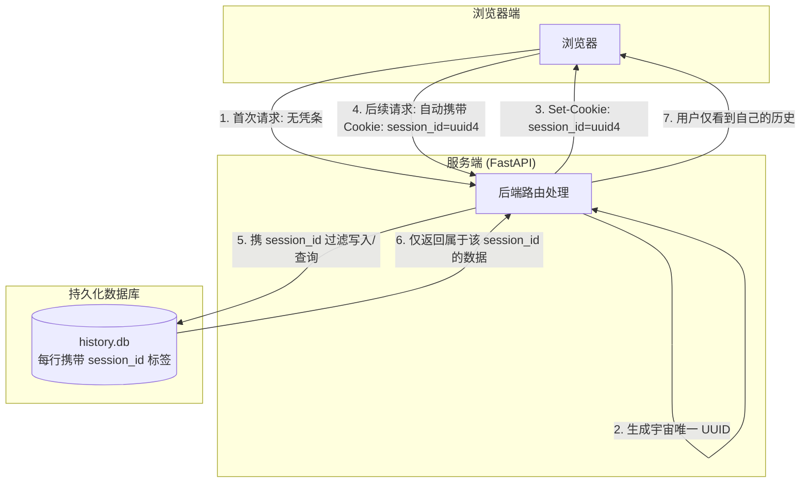
```mermaid
flowchart TD
    subgraph BrowserSide["浏览器端"]
        B["浏览器"]
    end
    subgraph ServerSide["服务端 (FastAPI)"]
        S["后端路由处理"]
    end
    subgraph PersistDB["持久化数据库"]
        DB[("history.db<br/>每行携带 session_id 标签")]
    end

    B -->|1. 首次请求: 无凭条| S
    S -->|2. 生成宇宙唯一 UUID| S
    S -->|3. Set-Cookie: session_id=uuid4| B
    B -->|4. 后续请求: 自动携带 Cookie: session_id=uuid4| S
    S -->|5. 携 session_id 过滤写入/查询| DB
    DB -->|6. 仅返回属于该 session_id 的数据| S
    S -->|7. 用户仅看到自己的历史| B
```

在计算机科学中：
- **会话（Session）**：将一连串原本孤立、无状态的 HTTP 请求，**在业务逻辑上认定为同一个来访者的连续交互**。它是一种逻辑关系。
- **Cookie**：浏览器为服务端在本地代管的一小块键值对数据，并在后续同源请求中**自动通过 HTTP 头携带回传的物理载体**。

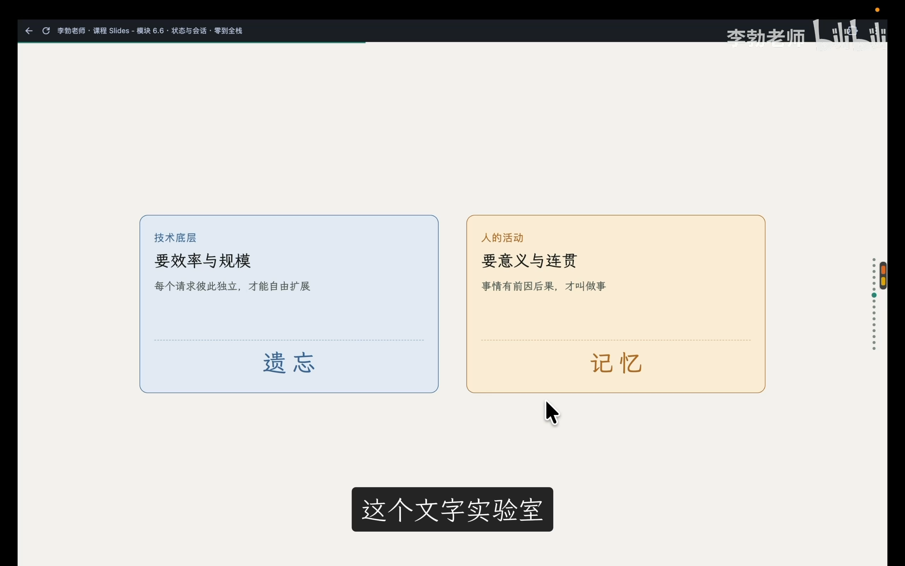

### 2. 面试高频考点：Cookie 与 Session 的本质区别
很多面试经常考问：*“请简述 Cookie 和 Session 的区别？”* 许多开发者容易将其混为一谈。
- **Session（会话）是概念与关系**：是服务器为了跟踪用户状态而建立的上下文会话。
- **Cookie 是技术与工具**：是浏览器提供的一种轻量存储与自动传输机制。
- **两者的交集**：在 Web 体系中，服务器生成一个随机唯一的 `session_id`，利用 `Set-Cookie` 响应头下发给浏览器，浏览器后续通过 `Cookie` 请求头带回该 ID，从而达成会话保持。而在手机原生 App 中没有 Cookie，工程师则通常将 `session_id` 放在名为 `Authorization: Bearer <token>` 的自定义请求头中传递，底层哲学完全相通。

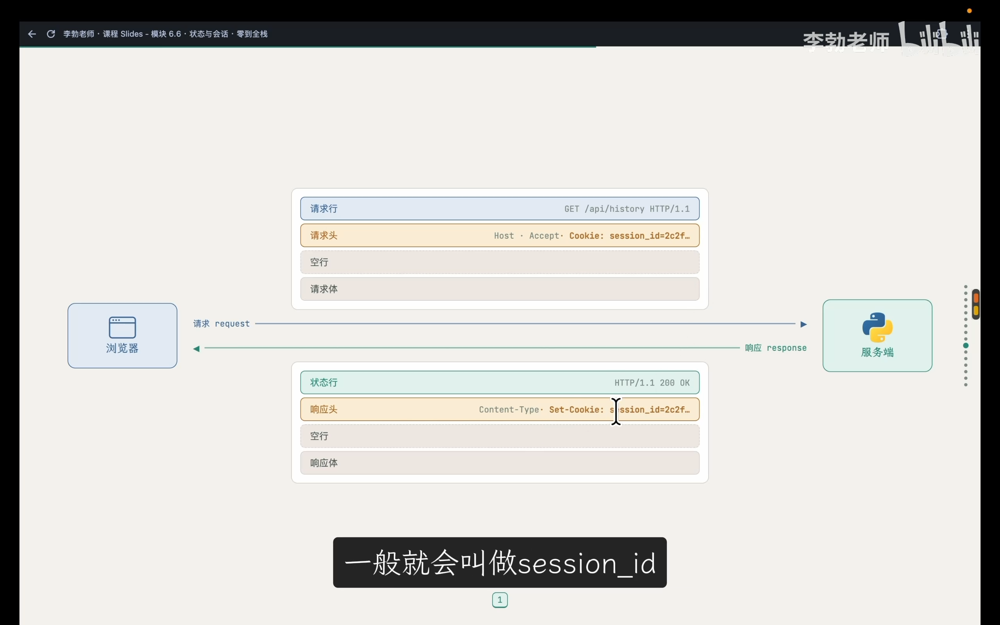

---

## 四、Cookie 核心属性体系与跨源（CORS）凭证配置
*(参考时间: 22:20 - 29:15)*

### 1. 一个合格 Cookie 的安全属性体系
当后端向前端签发凭证时，并不是简简单单写入一个字符串，而必须附带严密的安全指令集：

```http
Set-Cookie: session_id=a1b2c3d4; Max-Age=2592000; Path=/; HttpOnly; SameSite=Lax
```

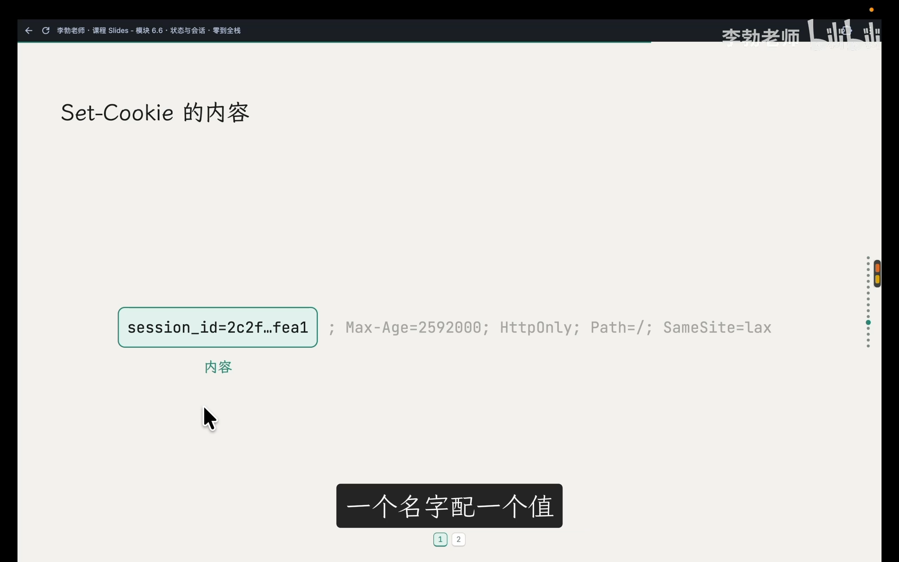

各核心属性深度解析：
1. **`session_id=...`**：键值对主体，承载真正的凭证内容。
2. **`Max-Age=2592000`**：生命周期（以秒为单位，此处为 $30 \times 24 \times 3600 = 30$ 天）。
   > [!IMPORTANT] 若不指定 Max-Age 会发生什么？
   > 若缺省，该 Cookie 将退化为“会话级 Cookie（Session Cookie）”，保存在内存中，只要用户完全关闭浏览器，凭证就会被瞬间抹除！
3. **`HttpOnly`**：防跨站脚本（XSS）攻击铁律。声明该 Cookie **禁止被网页内 JavaScript 代码（如 `document.cookie`）直接读取**，仅由浏览器在 HTTP 网络传输中收发，杜绝了恶意 XSS 脚本窃取身份令牌。
4. **`SameSite=Lax`**：防跨站请求伪造（CSRF）防护策略，限制第三方网站在跨站跳转或嵌入请求时携带本站 Cookie。
5. **`Path=/`**：作用域路径，声明在当前域名下的所有子路径请求均默认携带该 Cookie。

### 2. 跨源（CORS）环境下的凭证传输配置
由于我们的 ZeroTech 前端运行在 `http://localhost:3000`，而后端运行在 `http://localhost:8000`，端口不同构成了典型的**跨源请求（Cross-Origin Request）**。
现代浏览器为了安全，**默认禁止跨源请求携带任何 Cookie**！必须双向开绿灯：

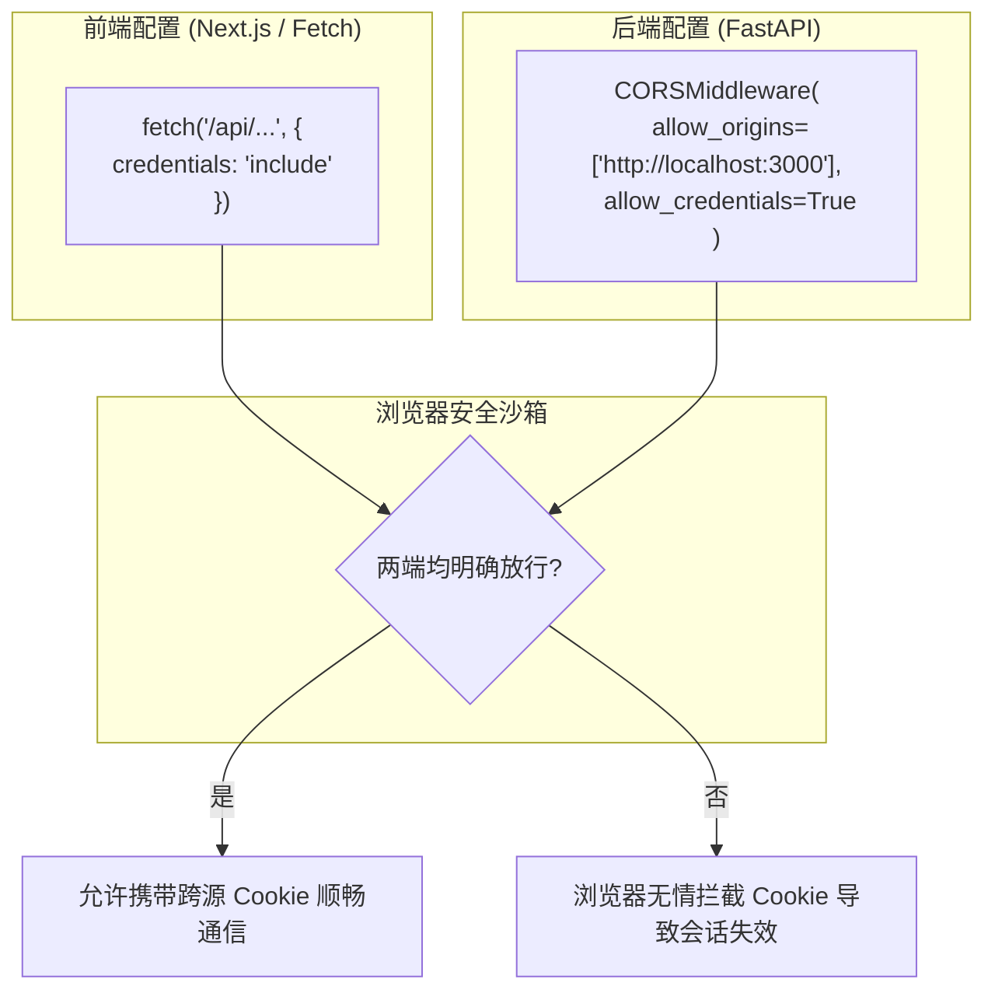
```mermaid
flowchart TD
    subgraph FrontendConfig["前端配置 (Next.js / Fetch)"]
        A["fetch('/api/...', {<br/>    credentials: 'include'<br/>})"]
    end
    subgraph Sandbox["浏览器安全沙箱"]
        B{"两端均明确放行?"}
    end
    subgraph BackendConfig["后端配置 (FastAPI)"]
        C["CORSMiddleware(<br/>    allow_origins=['http://localhost:3000'],<br/>    allow_credentials=True<br/>)"]
    end

    A --> B
    C --> B
    B -->|是| D["允许携带跨源 Cookie 顺畅通信"]
    B -->|否| E["浏览器无情拦截 Cookie 导致会话失效"]
```

- **后端 FastAPI 中间件改动**：
  ```python
  app.add_middleware(
      CORSMiddleware,
      allow_origins=["http://localhost:3000"],  # 注意：启用凭据时严禁写通配符 '*'
      allow_credentials=True,                   # 必须显式开启凭证许可
      allow_methods=["*"],
      allow_headers=["*"],
  )
  ```
- **前端 `fetch` 改动**：在 `InputCard.tsx`（提交文本分析）与 `TextLabView.tsx`（加载历史弹窗）中，调用 `fetch` 时必须显式声明：
  ```javascript
  credentials: "include" // 明确要求浏览器在跨源时带上本地凭据
  ```

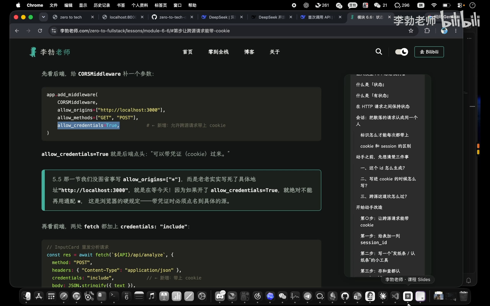

---

## 五、数据库改造：`session_id` 字段与联合复合索引
*(参考时间: 29:15 - 32:40)*

为了让数据库具备用户感知能力，我们需要对 `backend/storage.py` 中的表结构和索引进行关键升级。

### 1. 表结构扩展
在 `history` 数据表中增加 `session_id TEXT` 字段：

```sql
CREATE TABLE IF NOT EXISTS history (
    id INTEGER PRIMARY KEY AUTOINCREMENT,
    session_id TEXT,
    text TEXT,
    score REAL,
    label TEXT,
    pinyin TEXT,
    created_at TEXT
);
```

### 2. 联合复合索引的设计哲学（Composite Index）
在上一讲中，我们只对 `created_at` 建立了单列索引。而现在，我们的高频查询变为了：
> *“筛选出指定 `session_id` 的记录，并且按照 `created_at DESC` 倒序排布！”*

此时，必须建立基于两个字段的**联合复合索引**：

```sql
CREATE INDEX IF NOT EXISTS idx_history_session_created 
ON history(session_id, created_at);
```

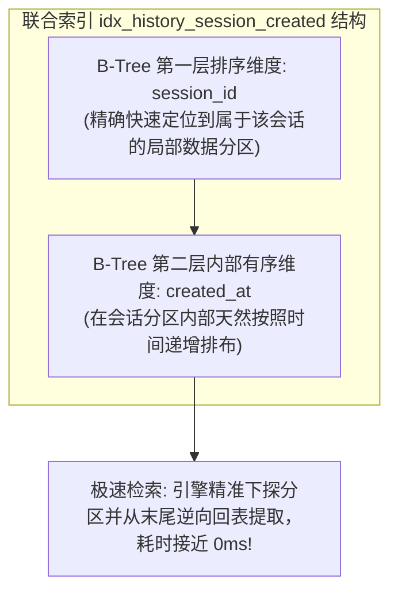
```mermaid
flowchart TD
    subgraph CompositeIndex["联合索引 idx_history_session_created 结构"]
        A["B-Tree 第一层排序维度: session_id<br/>(精确快速定位到属于该会话的局部数据分区)"]
        A --> B["B-Tree 第二层内部有序维度: created_at<br/>(在会话分区内部天然按照时间递增排布)"]
    end
    B --> C["极速检索: 引擎精准下探分区并从末尾逆向回表提取，耗时接近 0ms!"]
```

> [!TIP] 联合索引字段顺序的黄金准则：最左匹配原则
> **先写用于等值过滤（WHERE session_id = ?）的字段，后写用于范围或排序（ORDER BY created_at）的字段**。如果顺序颠倒写成 `(created_at, session_id)`，索引将被全表打散，无法发挥前置分区的威力。

由于 SQLite 无法在现有表上通过 `CREATE TABLE IF NOT EXISTS` 追加字段，我们在开发期直接删除老旧的 `backend/history.db` 文件，重启应用让全新的 DDL 重新生成。

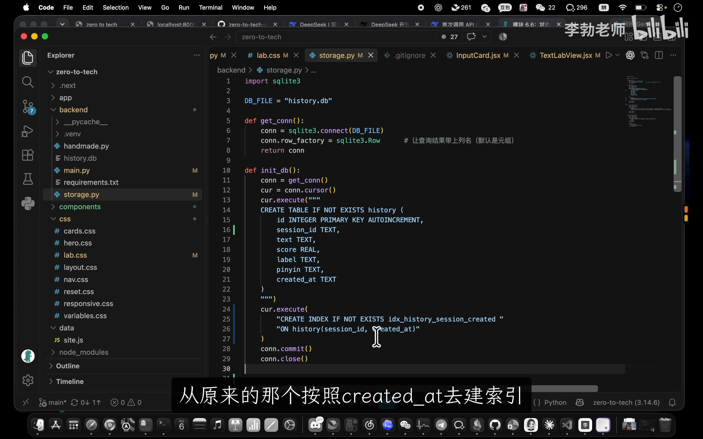

---

## 六、服务端实现：UUID 凭证颁发与数据层多租户隔离
*(参考时间: 32:40 - 38:25)*

### 1. 使用 Python 标准库 `uuid` 生成防碰撞会话 ID
会话 ID 必须满足两个严苛条件：**全局唯一**且**无法被猜测**。
Python 标准库提供了 `uuid.uuid4()`，基于强伪随机数生成 128 位的通用唯一识别码（形如 `c83f12a9-4b6e-4c7a-9321-7e8e50b16f2c`）。两个 UUID4 重复的概率约等于在宇宙两端各扔一粒沙子发生相撞的概率，在实际工程中可视为绝对不重复。

在 `backend/main.py` 中编写凭据分发辅助函数：

```python
import uuid
from fastapi import Request, Response

def get_session_id(request: Request, response: Response) -> str:
    """提取现有会话ID；若不存在则签发全新 UUID 并写入 Set-Cookie 响应头"""
    session_id = request.cookies.get("session_id")
    if not session_id:
        session_id = str(uuid.uuid4())
        response.set_cookie(
            key="session_id",
            value=session_id,
            max_age=30 * 24 * 60 * 60,  # 30天
            httponly=True,
            samesite="lax"
        )
    return session_id
```

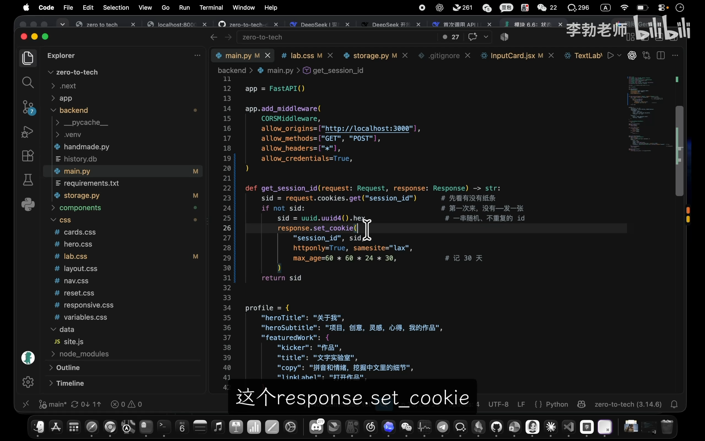

### 2. 存储层接入 `session_id` 过滤
在 `backend/storage.py` 中，全面改写数据读写接口：

```python
def save_record(session_id: str, record: dict):
    """持久化记录时，强制绑定当前用户的 session_id"""
    conn = get_conn()
    cur = conn.cursor()
    cur.execute('''
    INSERT INTO history (session_id, text, score, label, pinyin, created_at)
    VALUES (?, ?, ?, ?, ?, ?)
    ''', [
        session_id,
        record.get("text"),
        record.get("score"),
        record.get("label"),
        record.get("pinyin"),
        record.get("created_at")
    ])
    conn.commit()
    conn.close()

def get_history(session_id: str, limit: int = 10):
    """严格按 session_id 进行租户隔离查询"""
    conn = get_conn()
    cur = conn.cursor()
    cur.execute('''
    SELECT * FROM history 
    WHERE session_id = ? 
    ORDER BY created_at DESC 
    LIMIT ?
    ''', [session_id, limit])
    rows = cur.fetchall()
    conn.close()
    return [dict(row) for row in rows]
```

在 `main.py` 的路由中，无论是 `/api/analyze` 还是 `/api/history`，第一件事都是获取 `session_id`，并将其作为第一参数传递给存储层，彻底终结了“不认人”的混乱局面！

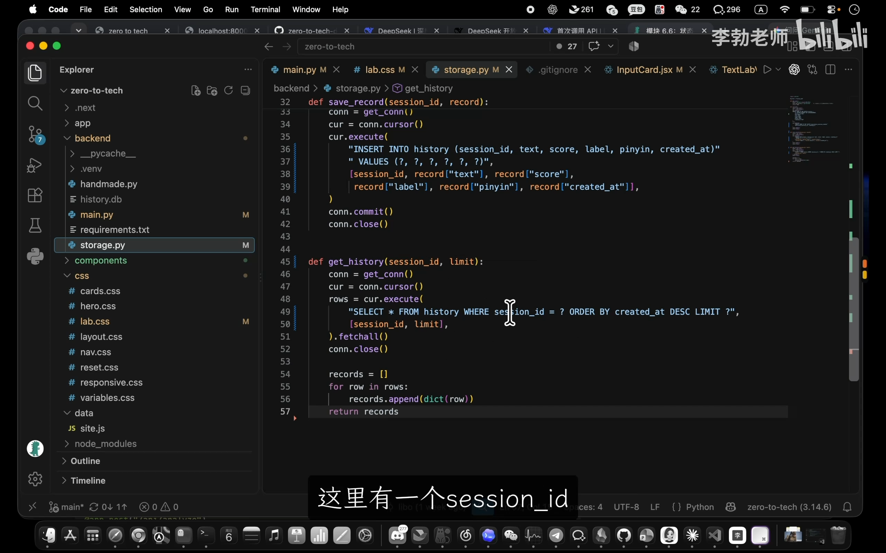

---

## 七、全链路抓包验证与双浏览器隔离实战
*(参考时间: 38:25 - 43:10)*

代码编写完成后，我们进行严谨的三级验证。

### 1. 命令行 `curl` 抓包观测 `Set-Cookie`
通过终端向后端发送探针请求：
```bash
curl -i http://localhost:8000/api/history
```
在返回的原始响应报文中，可以清晰看到后端发放的“小纸条”：
```http
HTTP/1.1 200 OK
set-cookie: session_id=e7b45821-2e65-4d0c-a9a5-17a4c7e6ebbb; Max-Age=2592000; Path=/; HttpOnly; SameSite=lax
content-type: application/json
```
由于 `curl` 默认不保留 Cookie，再次执行该命令时，服务器会认为又来了一位新访客，签发一个全新的 UUID。

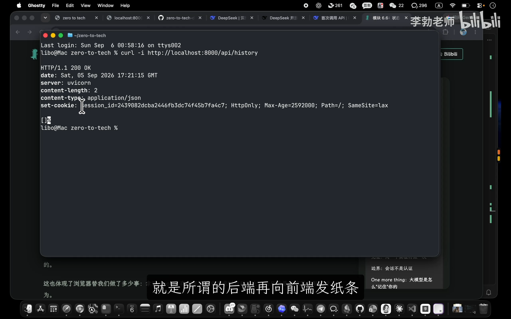

### 2. 浏览器开发者工具（DevTools）全链路核查
在 Chrome 浏览器中打开文字实验室：
1. 打开 **DevTools -> Application -> Storage -> Cookies**，可以看到名为 `session_id` 的 Cookie 已经稳稳写入，且 `HttpOnly` 标记勾选生效。
2. 切换到 **Network** 选项卡，查看向 `/api/history` 发起的请求头，可以清晰看到 `Cookie: session_id=...` 已经由浏览器内核在每次网络请求时自动携带！

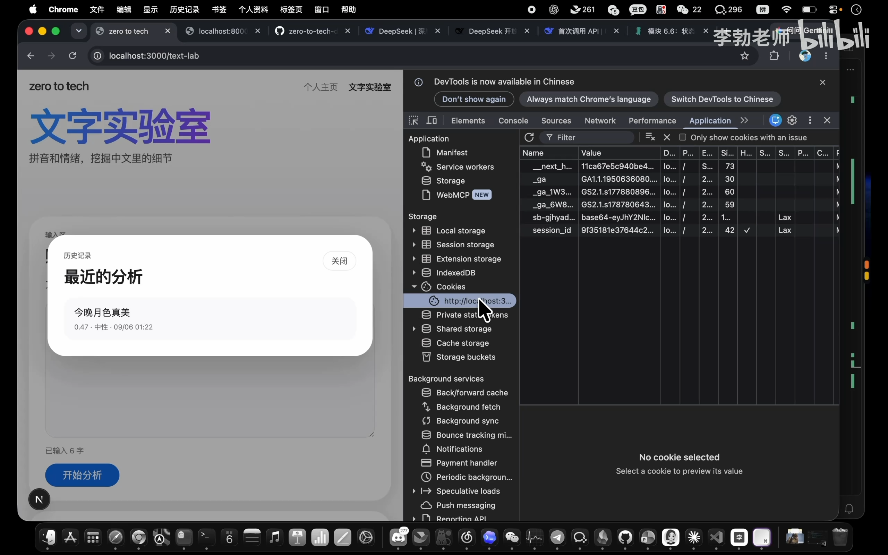

### 3. 终极对决：Chrome vs Safari 双浏览器实测
重演开篇时的实验：
- 在 Chrome 中输入分析：“今天天气真好”；
- 在 Safari 中输入分析：“这个电影真好看”；
- 分别点开各自的历史记录弹窗。

结果令人振奋：**Chrome 仅展示属于 Chrome 的分析历史，Safari 仅展示属于 Safari 的分析足迹**！系统成功达成了多租户级别的会话隔离，文字实验室已具备了健壮的生产雏形！

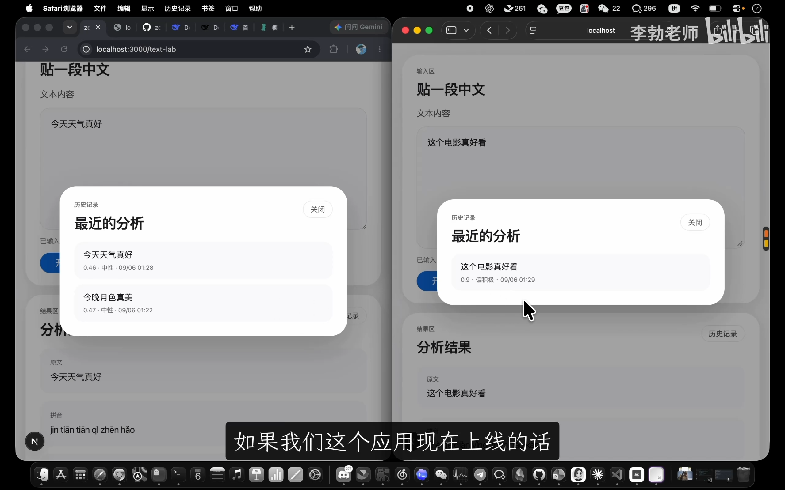

---

## 八、深度拓展：大模型（LLM）是如何实现“会话记忆”的？
*(参考时间: 43:10 - 48:45)*

在理解了 Web 体系的会话机制后，我们回过头来解开第二节留下的悬念：*“既然大模型 API 是无状态的，为什么 ChatGPT、Claude 或日常 AI 编程工具能够记住我们的多轮对话？”*

### 1. 核心机理揭秘：客户端全量上下文回传
答案出人意料地质朴：**大模型服务端根本没有记住任何东西，所有的‘记忆’都是由客户端在每一次发起调用时，将历史对话全部塞入 `messages` 数组重新提交的！**

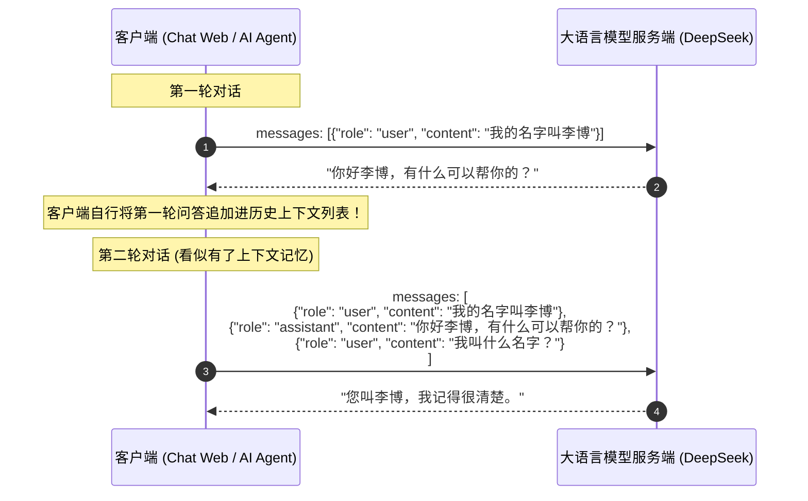
```mermaid
sequenceDiagram
    autonumber
    participant App as 客户端 (Chat Web / AI Agent)
    participant LLM as 大语言模型服务端 (DeepSeek)

    Note over App: 第一轮对话
    App->>LLM: messages: [{"role": "user", "content": "我的名字叫李博"}]
    LLM-->>App: "你好李博，有什么可以帮你的？"
    Note over App: 客户端自行将第一轮问答追加进历史上下文列表！

    Note over App: 第二轮对话 (看似有了上下文记忆)
    App->>LLM: messages: [<br/>  {"role": "user", "content": "我的名字叫李博"},<br/>  {"role": "assistant", "content": "你好李博，有什么可以帮你的？"},<br/>  {"role": "user", "content": "我叫什么名字？"}<br/>]
    LLM-->>App: "您叫李博，我记得很清楚。"
```

我们在代码中构造包含前序上下文的 `messages` 请求，大模型便立刻给出了精准的回答。**大模型所谓的多轮交互能力，本质上是模型强大的上下文阅读理解能力（In-Context Learning）**。

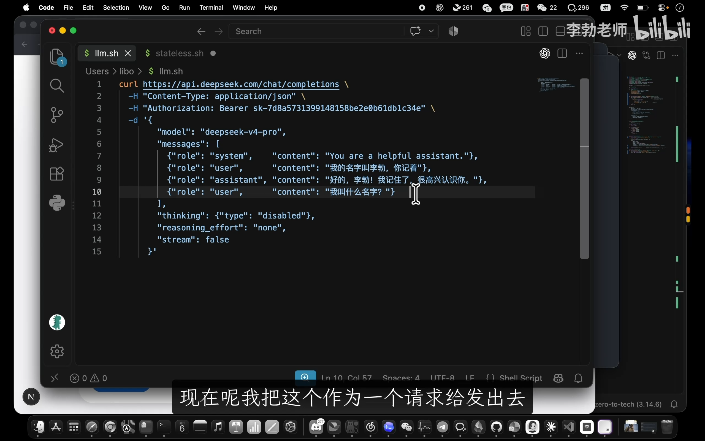

### 2. Web 会话 vs 大模型会话的底层架构对比
这一对比揭示了两种截然不同的架构哲学：

| 对比维度 | 经典 Web 架构会话 | 大语言模型（LLM）会话 |
| :--- | :--- | :--- |
| **状态存储驻留地** | **服务端**（关系型数据库 / Redis） | **客户端**（由客户端或 Agent 本地维持） |
| **网络传输荷载** | **极轻**（请求中仅携带几个字节的 `session_id`） | **极重**（每一次请求都必须携带全量历史对话上下文） |
| **计费与开销** | 与会话轮次弱相关，存储成本极低 | **随对话轮次呈二次方暴增**（按 Token 计费，越聊越贵） |
| **规模限制** | 理论上仅受物理磁盘存储限制 | 受大模型**上下文窗口（Context Window）**物理硬上限约束 |

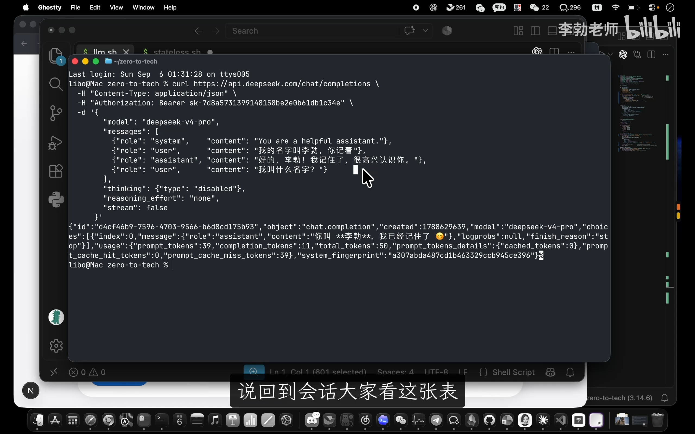

理解了这一点，在现代 AI Agent（如 Claude Code、Cursor、Windsurf）开发中所接触到的繁复名词瞬间迎刃而解：所谓的**提示词工程（Prompt Engineering）、RAG 知识库检索、Agent Skills**，其本质全都是在精打细算地决定：*“在有限且昂贵的上下文窗口内，究竟塞入哪些最具价值的上下文片段！”*

---

## 九、模块六全景复盘与模块七（全栈部署）路线展望
*(参考时间: 48:45 - 50:56)*

至此，**“零到全栈”模块六（后端与数据基石）全部六讲宣告圆满收官**！

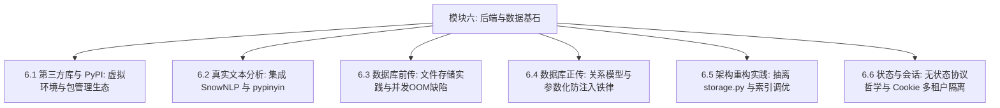
```mermaid
flowchart TD
    Root["模块六: 后端与数据基石"]
    
    Root --> M1["6.1 第三方库与 PyPI: 虚拟环境与包管理生态"]
    Root --> M2["6.2 真实文本分析: 集成 SnowNLP 与 pypinyin"]
    Root --> M3["6.3 数据库前传: 文件存储实践与并发OOM缺陷"]
    Root --> M4["6.4 数据库正传: 关系模型与参数化防注入铁律"]
    Root --> M5["6.5 架构重构实践: 抽离 storage.py 与索引调优"]
    Root --> M6["6.6 状态与会话: 无状态协议哲学与 Cookie 多租户隔离"]
```

回顾这六讲，我们的 ZeroTech 系统完成了一次脱胎换骨的跃迁：
- **从纯玩具走向工程落地**：从最初硬编码的假数据，演进为真正具备自然语言计算能力、安全 SQLite 持久层、支持多租户会话隔离的现代化全栈架构。
- **构建了完备的工程武器库**：熟练驾驭 Python、FastAPI、SQLite、SQL 注入防御、代码重构思维、B-Tree 索引优化与 HTTP 状态管理。

### 下一阶段：迈向模块七（云端全栈部署）
当前，我们的全栈应用由三部分组成：**静态编译的 Next.js 前端、FastAPI 驱动的后端 API、以及本地的 SQLite 数据库**。

在即将开启的**模块七（上线与部署实战）**中，我们将踏上真正的云端运维征程：
1. **构建生产级前端**：学习 Next.js 前端工程在云端的高性能构建。
2. **守护后端常驻**：使用 Linux `systemd` 将 Python 后端提升为 7×24 小时高可用守护进程。
3. **同源化架构收口**：配置 Nginx 反向代理与云端域名，彻底消除跨源 CORS 烦恼，让前后端融为一体！

感谢大家在模块六中的坚持与同行，我们模块七云端见！
