# 如何用 AI 更高效地学习：一对一 AI 教学系统的设计与实战

> 本书整理自 Eero Alvar 的视频《我是怎么用 AI 学东西的》（中文配音版，B 站 BV1cSbi62Eu5），
> 将口语分享重构为书面化技术指南。文中视频卡片可直接跳转回原片对应时刻。

## 引言：AI 是优化学习的完美工具吗？

*(参考时间: 00:00)*

我们能不能用 AI 学得更好？总该有某种用 AI 优化学习的办法——AI 看起来正是做这件事的完美工具，只是"具体怎么做"还不清楚。本视频（及本书）分享作者目前的一套完整做法：

1. 先讲清这套方法背后的**思路与设计**：传统学习方式的结构性低效在哪里，理想形态是什么；
2. 再做一次**实时演示**：用搭建好的 AI 智能体系统，从零开始学习"微分形式"这一真实的数学主题，走完一个完整的学习循环。

## 1. 传统学习的结构性低效：多对多关系

*(参考时间: 00:23)*

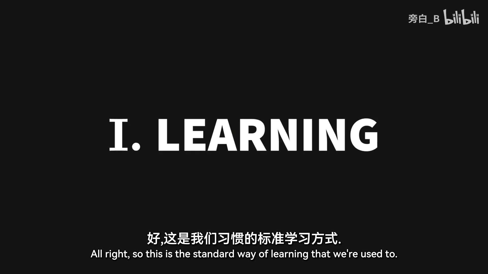

我们习惯的标准学习方式是一个**多对多**的结构：

- 每个教学渠道——一位老师、一本书、一门课，不管是什么——都是**为教很多学生**而设计的；
- 同时，每个学生也**从很多教学渠道**学习。

学习者和教学渠道之间的这种多对多关系，在两个方向上各自产生不同形式的低效。

### 1.1 一对多：为众人设计的教学不可能对任何一个人最优

*(参考时间: 00:46)*

第一个低效来自"一个教学渠道教很多人"：**为很多人设计的教学渠道，不可能对其中任何一个人是最优的**。

所谓"最优教学"完全取决于学习者当前的理解状态，这包括两层含义：

- **整条教学弧线**：从学习者当前理解到目标理解之间的完整路径；
- **过程中的每一个解释**：路径上每一步的讲法。

一条最优的教学路径应当：

- 尽量**少教学习者已经掌握**的东西；
- 尽量**少教他们还无法理解**的东西；
- 因此它应该**恰好作用在学习者理解的边界上**。

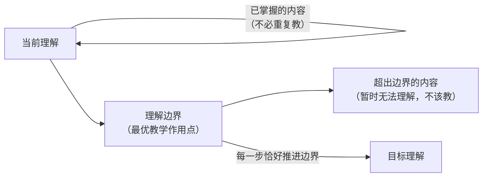
```mermaid
graph LR
    A[当前理解] -->|"已掌握的内容<br/>（不必重复教）"| A
    A --> B["理解边界<br/>（最优教学作用点）"]
    B --> C["超出边界的内容<br/>（暂时无法理解，不该教）"]
    B -->|"每一步恰好推进边界"| D[目标理解]
```

所以理想情况下，**一个老师应该只有一个学生**。

### 1.2 多对一：适应多个渠道消耗心智，更深的代价是信任

*(参考时间: 01:29)*

第二个低效来自"一个学生从很多教学渠道学习"。这意味着学习者要不断适应：

- 很多**教学风格**；
- 很多**符号体系**；
- 很多**可靠性水平**；
- 很多**界面**。

在它们之间切换所消耗的心智努力，**没有投入到学习材料本身**。

但作者认为这里还有一个更深的代价：**信任**。面对不熟悉的教学渠道，大脑会有所保留——在这个渠道证明自己足够熟悉之前，大脑不会完全投入地去接受一个事实。

一个恰当的例子：假设我们想理解**毛球定理**（hairy ball theorem），手头有两份**一模一样**的解释，一份来自 3Blue1Brown 的视频，另一份来自 X（推特）上某个路人。即使解释完全相同，我们显然会从**熟悉的来源**那里学得更好——当大脑信任这个教学渠道时，它会更容易内化信息。

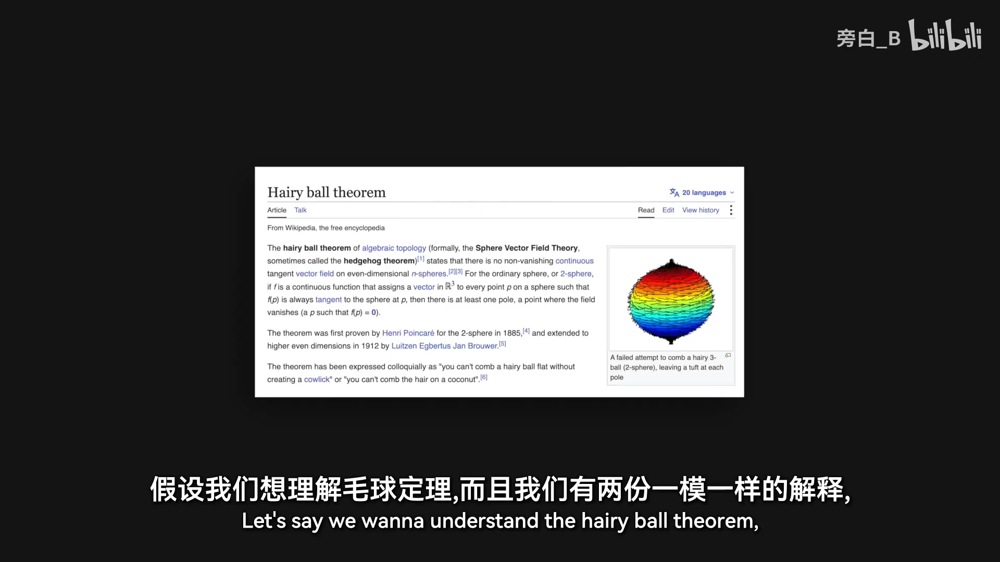

所以理想情况下，**一个学生应该只有一位老师**。

## 2. 理想形态：双向一对一

*(参考时间: 02:41)*

综合上面两个方向，理想场景是**双向的一对一**：一个老师只教一个学生，一个学生只跟一位老师。

### 2.1 反驳"单一视角"：接口 ≠ 来源

对这个理想形态有一个明显的反对意见：只有一位老师，岂不是只能获得一种视角？

作者认为这个反对意见**把"来源"和"接口"混为一谈了**。一位老师并不会减少来源和视角的数量——相反，他会**把所有来源和视角汇总起来，通过一个统一的接口来传递**。我们不会失去多种视角，失去的只是多个互不相通的界面。

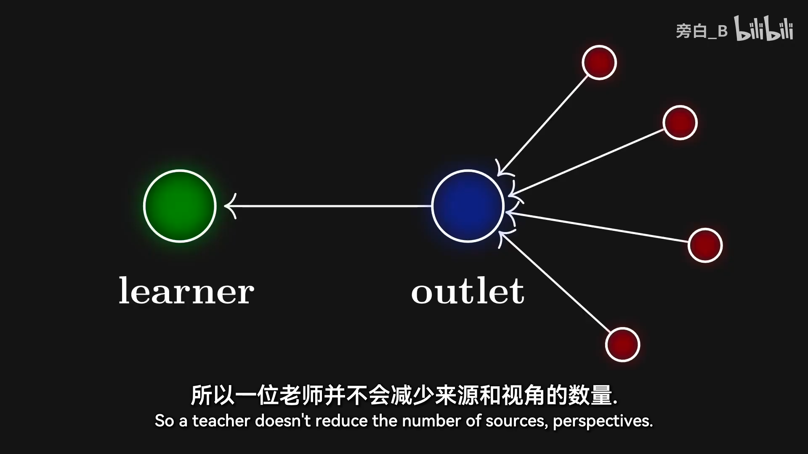

### 2.2 AI 老师的信任是"被设计出来的"

在 AI 作为老师的情况下，**信任不是随着时间慢慢建立的，而是被设计进系统里的**。系统必须内建可靠的**验证与事实核查**机制，原因有二：

1. **正确性**：我们绝对不希望 AI 产生幻觉、给出虚假信息；
2. **学习效率**：当我们**知道**系统是可靠的，学习会变得更容易——大脑无需保留，可以放心内化。

一句话总结这个理想形态：**一个接口，适配一个大脑，覆盖所有来源。**

## 3. 系统的两条设计原则

*(参考时间: 03:46)*

前面讨论的两个低效之处，直接给出了系统运行所依赖的两个原则：

| 低效 | 对应原则 |
|---|---|
| 一对多：教学对个体不最优 | **原则一：优化教学** |
| 多对一：多渠道切换消耗心智与信任 | **原则二：优化脑力资源的分配** |

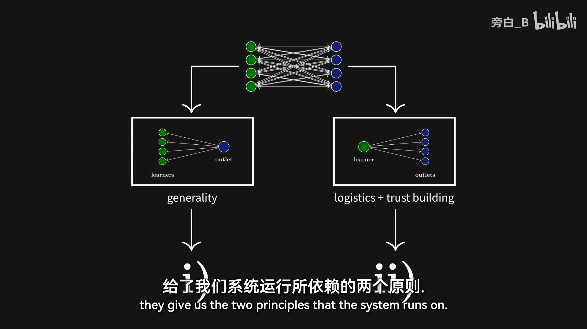

需要特别强调的是，原则二**并不意味着消除困难**。恰恰相反：

- 我们想要**最大化挣扎**——我们想学难的东西，挣扎非常重要；
- 但挣扎必须发生在**材料本身**，而不是**后勤安排**上。

做计划、找资源、核实事实、想清楚学什么、按什么顺序学——这些"后勤"全都由系统承担，让学习者把全部认知工作集中到材料本身。

## 4. 工作流程：探查 → 规划 → 教学

*(参考时间: 04:29)*

具体流程分为三个阶段：

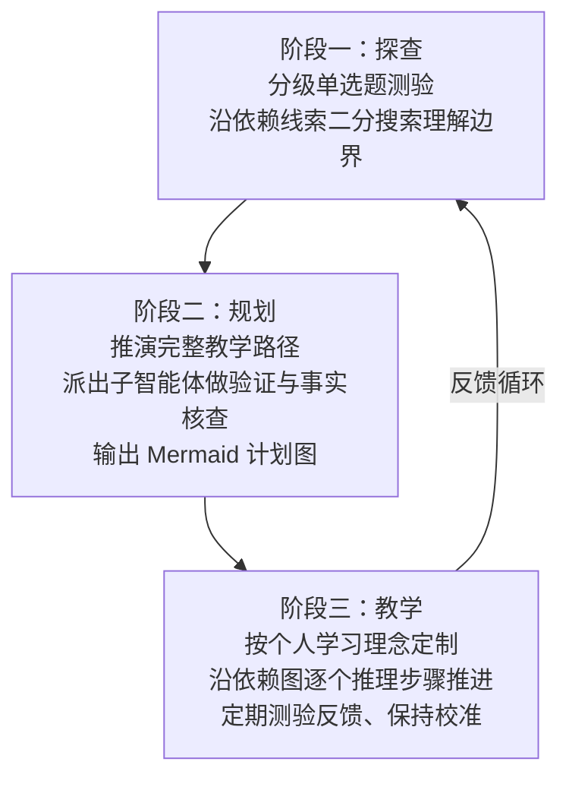
```mermaid
graph TD
    A["阶段一：探查<br/>分级单选题测验<br/>沿依赖线索二分搜索理解边界"] --> B["阶段二：规划<br/>推演完整教学路径<br/>派出子智能体做验证与事实核查<br/>输出 Mermaid 计划图"]
    B --> C["阶段三：教学<br/>按个人学习理念定制<br/>沿依赖图逐个推理步骤推进<br/>定期测验反馈、保持校准"]
    C -->|"反馈循环"| A
```

### 4.1 阶段一：探查（Probe）

要做到最优教学——不管"最优"因人而异差别多大——系统显然需要知道**这个人当前确切的理解程度**，所以它必须去**测量**。

系统通过一个**测验工具**完成测量：

- 出**有分级的单选题**；
- 先问**非常宽泛**的问题；
- 然后在课程会依赖的**每一条可能线索**上做**二分搜索**，找到理解边界。

最终得到一张学习者理解情况的**非常详细的地图**。

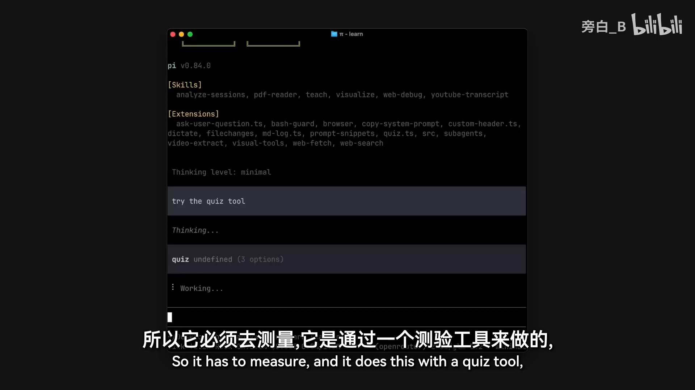

### 4.2 阶段二：规划（Plan）

规划阶段基本上就是**把一切都推演清楚**："我怎么才能把这个具体的东西交给这个头脑？"

这个阶段有两件关键的事：

1. 系统会派出**第一批做验证和事实核查的子智能体**；
2. 把计划呈现为一张 **Mermaid 图表**（依赖图/示意图）。

展示计划图有两个理由：

- 其一，让学习者更清楚接下来要学什么；
- 其二——**这才是真正实现它的原因**——**逼迫 AI 把一切都推演清楚**，这样它就不能偷懒、不能即兴糊弄。

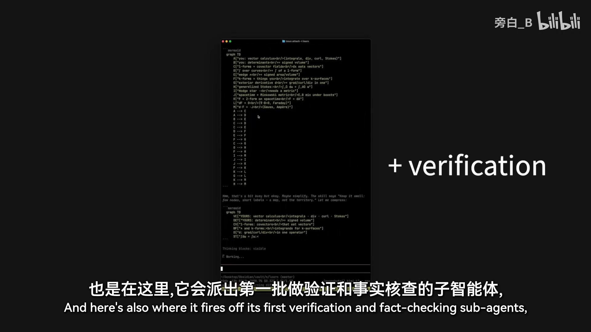

### 4.3 阶段三：教学（Teach）与反馈

教学阶段会非常不一样，因为它**完全取决于你想怎么学**——你要把自己的学习理念、以及"怎么学效果最好"装进这个系统里。

但有一个细节，不管具体的学习方式是什么都很重要：**反馈**。AI 会**定期考你**，检查你是不是真的理解了。这很重要，有三个原因：

1. **防自欺**：人很容易在某种程度上自欺欺人、以为自己懂了——用 AI 学习时尤其如此，真正检验你的理解是对你自己很重要的反馈；
2. **系统校准**：系统需要持续反馈来保持校准（知道你的理解边界移动到哪里了）；
3. **巩固理解**：应用材料做练习题、使用你学到的东西，本身就是新信息和新理解得以巩固的一部分。

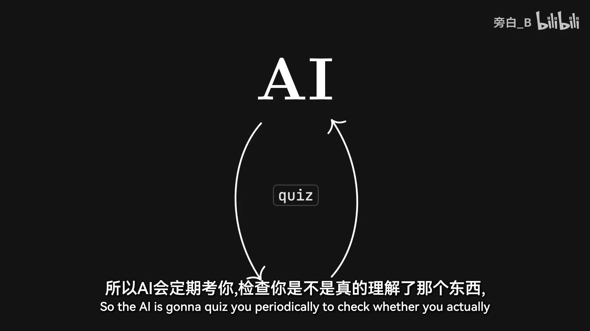

## 5. 实时演示：从零学习微分形式

*(参考时间: 06:51)*

### 5.1 系统环境

演示在一个 **pi 智能体框架**中进行，作者的学习目录里预置了：

- **teach 技能**（教学技能，指令写得相当具体）；
- 一些**可视化工具**；
- **测验扩展**；
- **MD 日志扩展**：把一个 Markdown 文件关联到会话上，所有输出都打印在这个文件里——配合 **Obsidian** 作为界面，能获得 **LaTeX 渲染**，且每次学习会话都留下**持久化记录**；
- 两个用来**制作视觉材料的子智能体**。

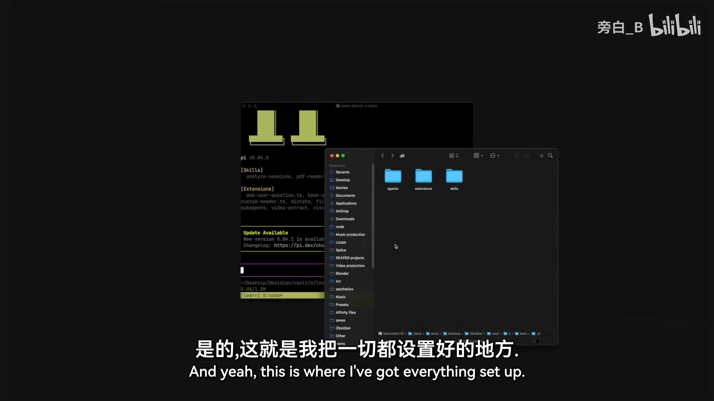

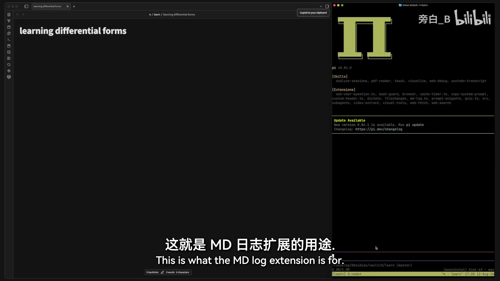

演示这样一个系统的唯一方法，就是**真的去学点东西、走完一个完整循环**。作者选择的学习目标是**微分形式**（differential forms）：在他之前一个与学习相关的视频里提到过，麦克斯韦方程组用微分形式只需**两个方程**就能表达——而他对微分形式其实一窍不通，正好是一个真实的学习过程。

演示使用的模型是某顶级大模型的 **Max 档**——因为作者真心觉得，**模型的智能程度对教学影响很大**。

指令只有一句话：

> 教我，想对微分形式来一次扎实的入门学习。

### 5.2 探查阶段实录

这次作者故意给的背景信息非常少（不预先声明自己已经懂什么），所以会有一个很长的探查阶段。系统开始出分级单选题：

- **线积分**：向量场 F 作用在一个沿曲线 C 运动的粒子上，这个线积分计算的是什么？（选项涉及保守场；对任意向量场 F，正确答案是"场对粒子做的功"。）
- **散度**：向量场在某一点的散度，衡量的是该点每单位体积的径向外通量。
- **斯托克斯定理**、**法拉第电磁感应定律**……
- 甚至一路问进了**狭义相对论**：当你换到一个运动参考系时，电场和磁场会发生什么？正确答案是——**它们会混合**：一个参考系中的纯电场，在另一个参考系中会同时具有电场部分和磁场部分。

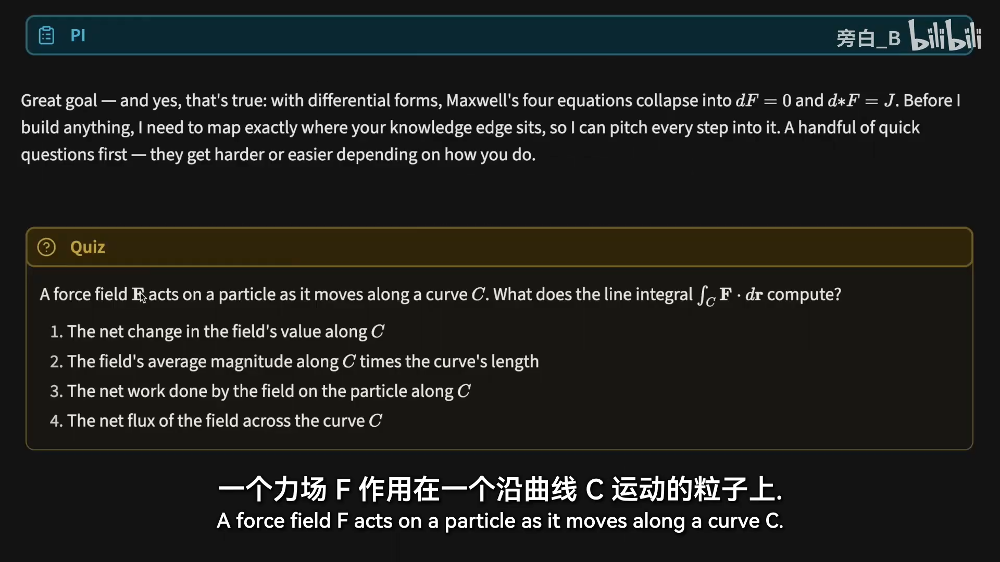

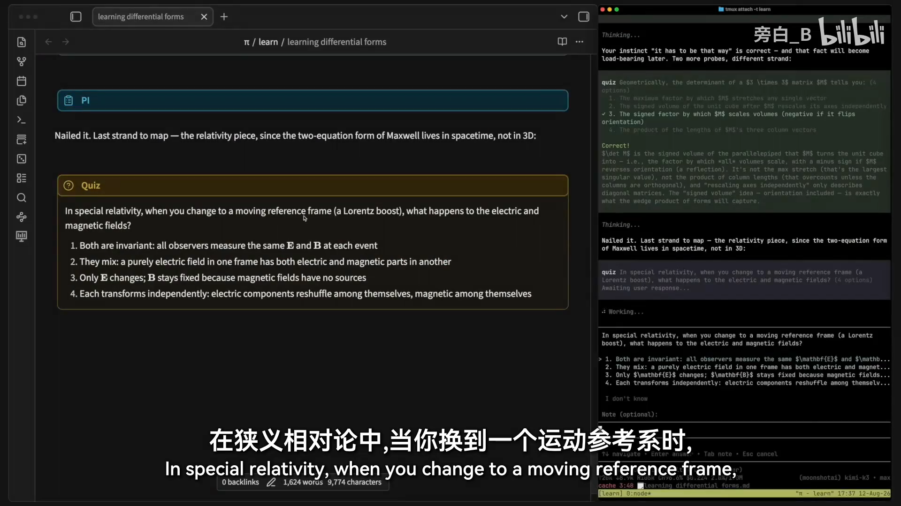

探查阶段结束后，系统对学习者的理解程度已经有了一幅非常细致的图谱。作者的感受是：**这本身也是个不错的热身**——完全不用操心别的，只需要回答问题，所有流程安排系统都会处理。期间还有一个"研究员"子智能体在后台继续跑事实核查（数学通常不太需要事实核查，但这是个好习惯）。

### 5.3 规划阶段实录

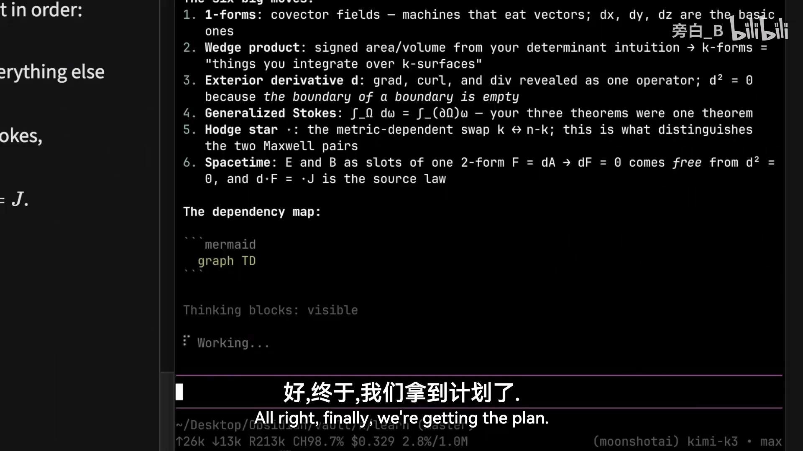

系统给出了完整计划（Mermaid 依赖图，在 Obsidian 中渲染）。作者注意到一个有趣的安排：**在到达真正目标（麦克斯韦方程组的微分形式表达）之前，会先接触到广义斯托克斯定理**——依赖关系被完整推演了出来。

### 5.4 教学阶段实录

教学开始后，系统调用可视化技能生成 SVG 图示。值得注意的工程细节：

- SVG 生成放在**子智能体**里做（为了保留主会话上下文）；
- 子智能体会**查看生成的图像**，确认它看起来是否真的正确——写了一个 SVG 之后先查看、再稍微编辑、再看一遍，确认无误才交付。

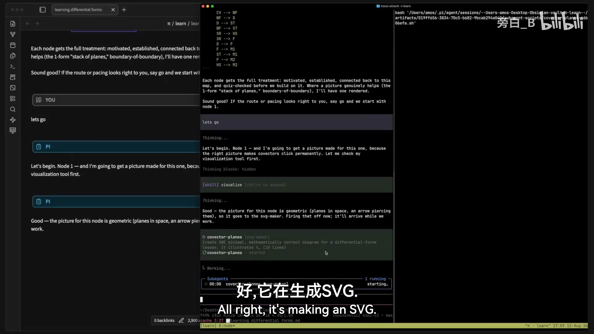

然后系统沿着规划好的依赖图，**一次只推进一个推理步骤**：

- **余向量（covector）**：引入余向量，并给 dx 一个全新的视角；
- 立刻**就这个推理步考一下学习者**，确认内容真的被理解。例如：设 α = 3dx − 2dy，问 α 作用在向量 v 上等于多少？（答案：4。）可视化图示在这里帮了大忙；
- **余向量场**：把余向量扩展成余向量场，于是"线积分到底是什么"有了新的视角；
- **1-形式**：所有在一维对象上的积分，都是 1-形式的积分；
- **k-形式**：对 k-形式，就是在 k 维曲面上做积分的那种对象；
- **楔积（wedge product）**：双线性、而且反对称的"机器"。要让一个不反对称的东西变反对称，最小修法就是老掉牙的那招——交替化（对交换的两个输入取差），这样就能得到反对称的东西。

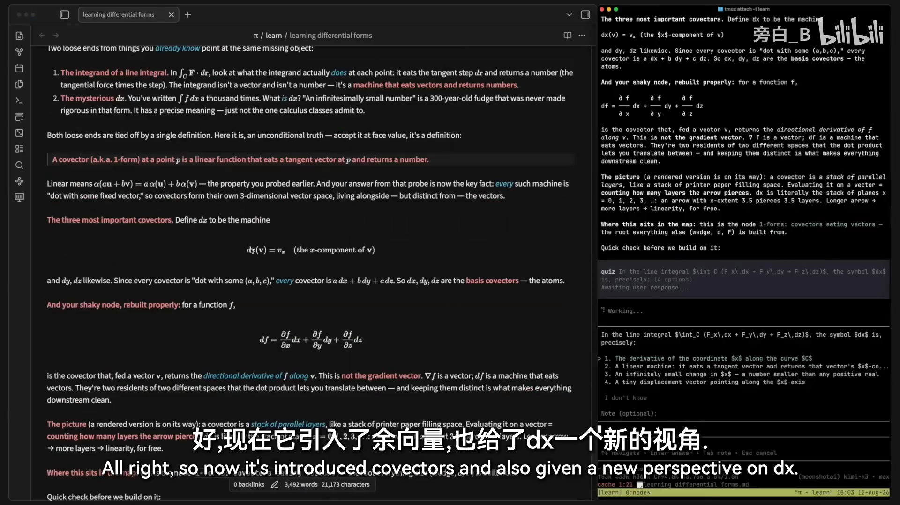

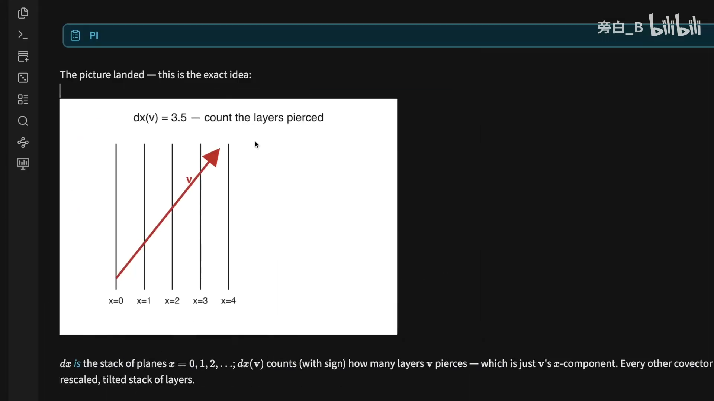

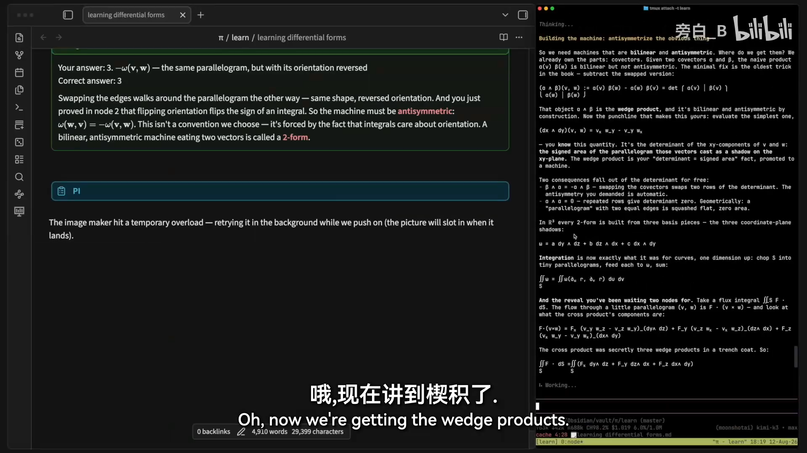

关于**节奏**，作者特别强调：通常和 ChatGPT 之类的模型聊天、让它解释或教你任何东西，它往往"太兴奋了"，一口气冲完整个内容。而他喜欢保持**非常慢的节奏，一次一个推理步骤**：

- 任何时候有问题都可以随时问，系统不会急着往前冲；
- 每一步都很容易消化——"他会给我所有我能照单全收的东西"。

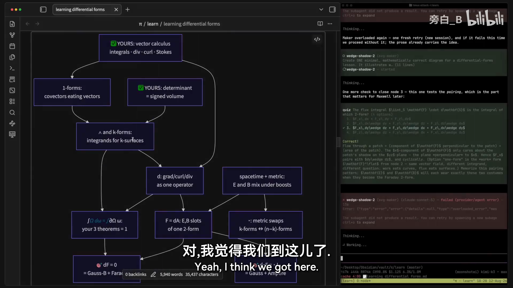

演示进行到快接近**广义斯托克斯定理**时收尾——显然不打算在视频里把整个依赖图走完。

## 6. 总结：把学习理念落实成 AI 系统

*(参考时间: 15:37)*

这个视频真正在讲的是：**怎么把一种学习理念或教学方式，落实成一个 AI 系统**。

作者坦言，这套系统对他如此有效，主要原因并不是视频中讲的这些结构性内容，而是他上一个视频里讲过的**那种教学风格**。教学风格恰好影响两件事：

1. **学习路径**——从当前理解走向目标理解要走的路；
2. **沿途的每一个步骤和讲解**。

核心要点回顾：

- 传统学习的多对多结构在两个方向上都低效：**教学不最优** + **心智与信任被渠道切换消耗**；
- 理想形态是**双向一对一**：一个接口适配一个大脑、汇总所有来源；AI 老师的信任靠**设计进系统的验证与事实核查**建立；
- 两条原则：**优化教学**、**优化脑力资源分配**——挣扎要发生在材料本身，后勤全部交给系统；
- 三个阶段：**探查**（分级测验 + 二分搜索理解边界）→ **规划**（子智能体核查 + Mermaid 依赖图逼 AI 推演清楚）→ **教学**（一次一个推理步骤 + 定期测验反馈）；
- 把你自己的学习理念装进系统，模型的智能程度对教学质量影响很大。

这些想法供你参考。这个系统还能怎么改进？你是怎么用 AI 学习的？欢迎沿着这个方向继续打磨。
