# 让 Agent 不再等待:基于 RocketMQ 的异步协作架构实战

> 讲者:周礼(阿里云智能高级技术专家,RocketMQ 核心成员)
>
> 主题:面向 AI Agent 大规模部署场景,RocketMQ 推出的轻量级异步消息事件载体 **LiteTopic**,及其在异步会话网关、平台级精细限流、系统级 Agent 协作中的落地实践。

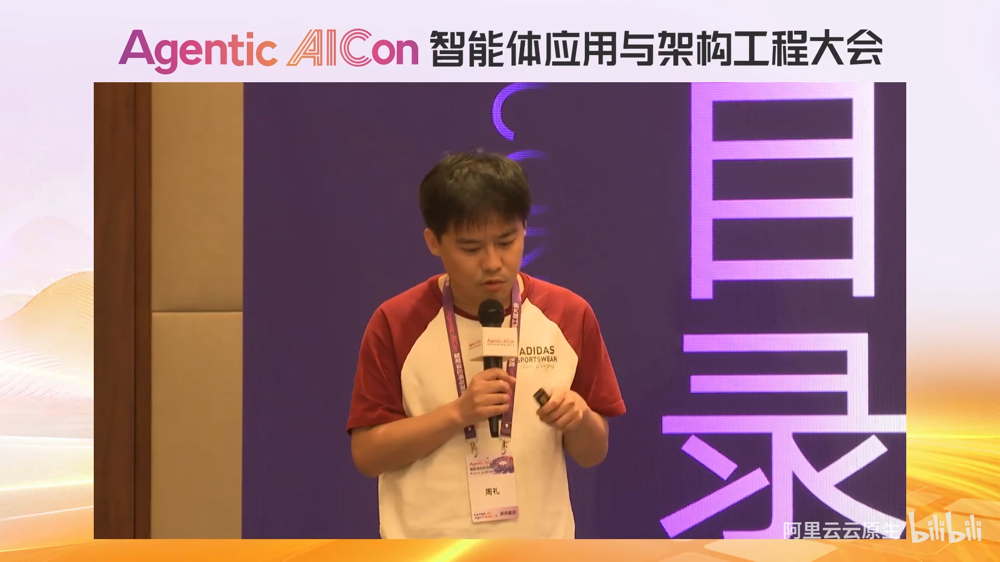

本文分为四个部分:

1. AI Agent 新的业务场景给消息中间件带来的新需求与挑战;
2. LiteTopic——面向 AI Agent 场景的轻量级异步消息事件载体;
3. 案例:基于 LiteTopic 构建纯异步的会话网关;
4. 两个真实落地实践:大模型网关的精细化限流、系统到 Agent 的异步协作通道。

---

## 一、AI Agent 规模化部署带来的新挑战

*(参考时间: 02:22)*

### 1.1 头部厂商已经注意到了这些问题

今年可以观察到,几个头部厂商在 Agent 应用企业化、规模化部署的过程中,已经开始直面其中暴露出的分布式问题。

**MCP 的 2026 年 3 月 Roadmap** 明确宣布:未来不再以里程碑方式发布版本,而是转向四个优先级领域。其中前两条与分布式系统直接相关:

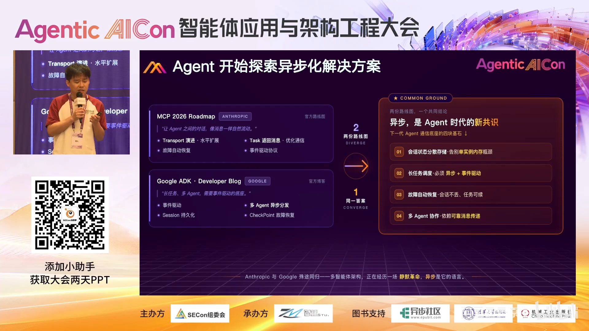

1. **扩展 Transport 层**:让 MCP Server 能够方便地水平扩展。此前 MCP Server SDK 并没有解决会话管理问题——单机部署时,多会话的状态都存在同一个节点上,没有跨节点共享状态的方案。一旦多轮请求没有落在同一台机器上,就会**丢失整个上下文**,影响下一步调用结果;同时因为状态绑定单机,服务能力难以水平扩展,必然出现性能瓶颈。
2. **Task 机制(实验阶段)**:概念与 A2A 的 Task 类似——创建一个 task,不断轮询其状态,直到完成后取回结果。但其官方自己也承认存在未定义的问题:
   - 任务**失败**了应该怎么办?
   - 任务**超时/过期**了应该怎么办?
   - 失败重试的取舍策略是什么?(大模型的任务"慢是肯定的",成本也远高于传统调用)

   这些正是他们今年的后续工作。

**Google 方面**,无论是官方博客还是开发者博客,都反复提到"长任务、多 Agent"的问题:教程式聊天机器人把全部上下文塞给大模型的做法,到了真正的企业级应用中会遇到挑战——很多业务场景可能要**运行好几天**,这时就需要事件驱动的机制。Google 从一开始就提出 A2A 协议,做多 Agent 异步分发。

**MCP 上个月的一篇文章**中还提出了 Session 外化(session log)的概念:通过类似 `get events` / `get session` 的能力,随时随地把上下文取出来,从任意固定节点恢复——这与 Google 提到的 **Session 持久化 + Checkpoint 故障恢复**思路高度一致。


### 1.2 四条共性结论

从这两家公司今年提出的概念,可以得出一个简单结论:**异步化**很可能是今年主流场景里大家共同要攻克的方向。归纳为四条核心需求:

| # | 需求 | 说明 |
|---|------|------|
| 1 | **会话状态存储** | 上下文该存在哪里?如何外化、持久化 |
| 2 | **长任务调度** | 通过异步或事件驱动执行长耗时任务 |
| 3 | **故障恢复** | 机器宕机后,前面多轮交互的成果不能浪费——要能带着当前结果在新节点继续任务 |
| 4 | **多 Agent 协作** | 节点之间依赖可靠的消息传递(消息系统、RPC 或 HTTP 均可) |

### 1.3 AI 应用与传统互联网应用的本质差异

*(参考时间: 07:23)*

中间件是为应用服务的。从传统互联网架构向 AI 应用架构演进的过程中,讲者总结了两者在行为模式上的关键区别:

| 维度 | 传统互联网应用 | AI Agent 应用 |
|------|----------------|---------------|
| 行为模式 | **可知系统**:流程由产品文档与程序员代码预先编排,任何用户下任何订单,业务流程大同小异 | **未知系统**:主动执行,同一问题换不同问法/上下文,结果可能完全不同 |
| 耗时特征 | 毫秒级(1ms/10ms/20ms),差异极小 | 分钟级甚至按天计,波动巨大 |
| 交互方式 | 工作流式,一步步向下推进 | 聊天式多轮交互,上下文不断叠加迭代 |
| 扩容弹性 | CPU 近乎无限,"能靠扩容解决问题的都是好架构" | GPU 昂贵且稀缺,难以无限扩容 |

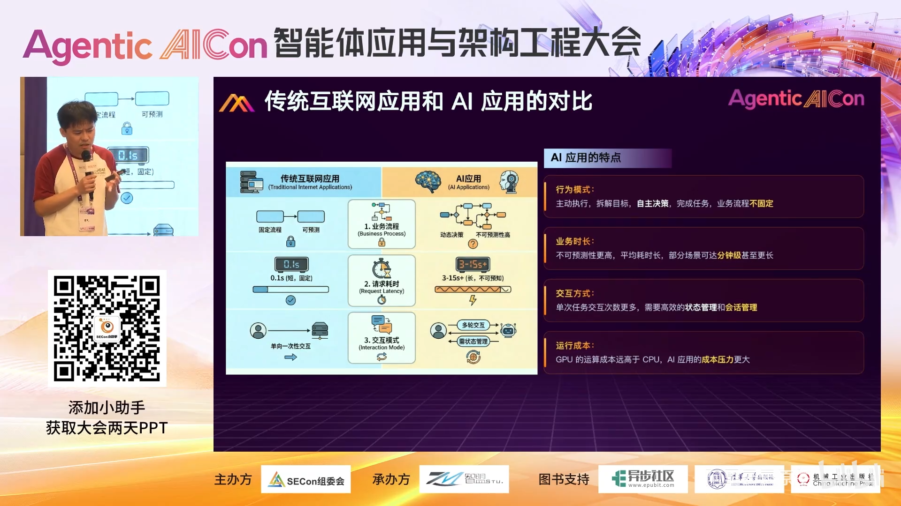

### 1.4 对消息中间件提出的新要求

*(参考时间: 10:18)*

对于做异步化、事件驱动的团队,场景变化直接转化为两条设计要求:

1. **防止队头阻塞(Head-of-Line Blocking)**:消息队列先进先出,任务时长从毫秒级变为分钟级后,单条长耗时消息就会卡住其后的所有用户——一个人堵住所有人。必须想办法让不同用户的业务**打散隔离**,互不影响。
2. **失败恢复后可取回历史结果**:系统异常恢复后,要能获取历史任务的结果,避免重复请求大模型、减少冗余推理、降低成本。

### 1.5 RocketMQ 面向 AI 场景的演进方向

*(参考时间: 11:29)*

基于以上分析,RocketMQ 过去一年面向 AI 应用场景的演进主打三点:

1. **隔离性**:从传统"面向同类任务"(少量 Topic 即可承载)转向"异步动态产生任务"的场景,按需、轻量地为每个用户提供独立的资源隔离——消息的隔离粒度从 **Topic 级下沉到任务级、会话级**,每次会话都有独立的通道与生命周期。
2. **海量通道**:隔离粒度下沉意味着单机队列数要从 1 万扩展到 **100 万**级别,数据在队列级别物理隔离,支持的隔离用户/会话数随之提升两个数量级。
3. **会话粘性**:多轮交互要求上下文落在同一台机器上,消息系统要从"无状态的单次事件驱动"演进为支持**会话级消息编排**。

---

## 二、LiteTopic:轻量级异步消息事件载体

*(参考时间: 13:04)*

### 2.1 从共享消费到差异化订阅

RocketMQ 4.0 / 5.0 目前提供的两种消费模型,与几乎所有消息队列(Kafka 等)一样,都是**基于 Group 的共享消费**:一个消费组内多台机器订阅同一个 Topic,队列中的数据会被组内任意一台消费者接收。这与 HTTP 负载均衡后面挂服务、RPC 服务发现随机路由是同构的——**消息落到哪台机器是不可控的**。

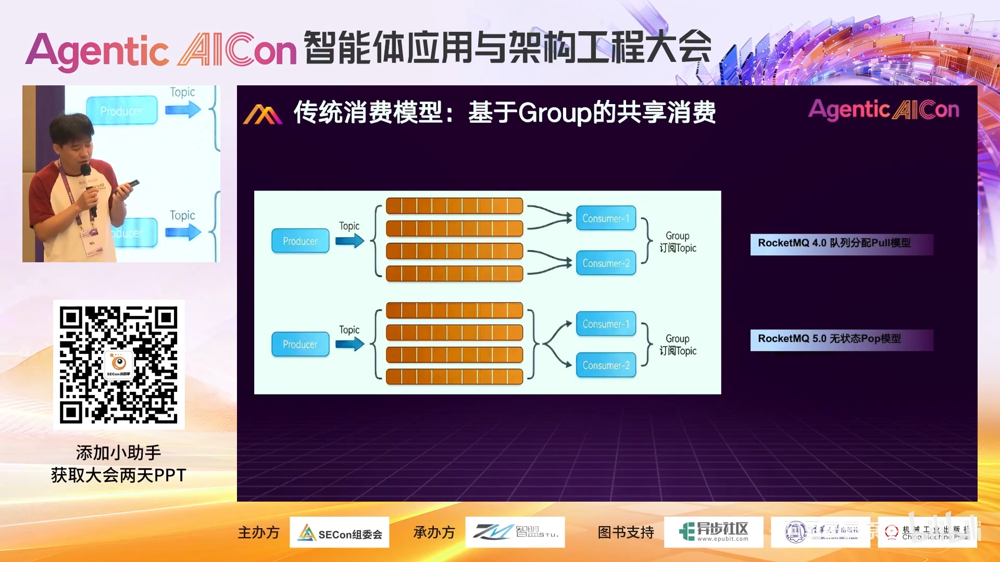

而 LiteTopic 主打的是**差异化订阅**:同一个消费组内的多个订阅者(consumer1 订 5 个、consumer2 订 10 个、consumer3 订 100 个),可以使用同一个消息 Group,却订阅**完全不同的队列集合**,各队列之间物理隔离、互不干扰,由此实现数据层面的精细隔离。

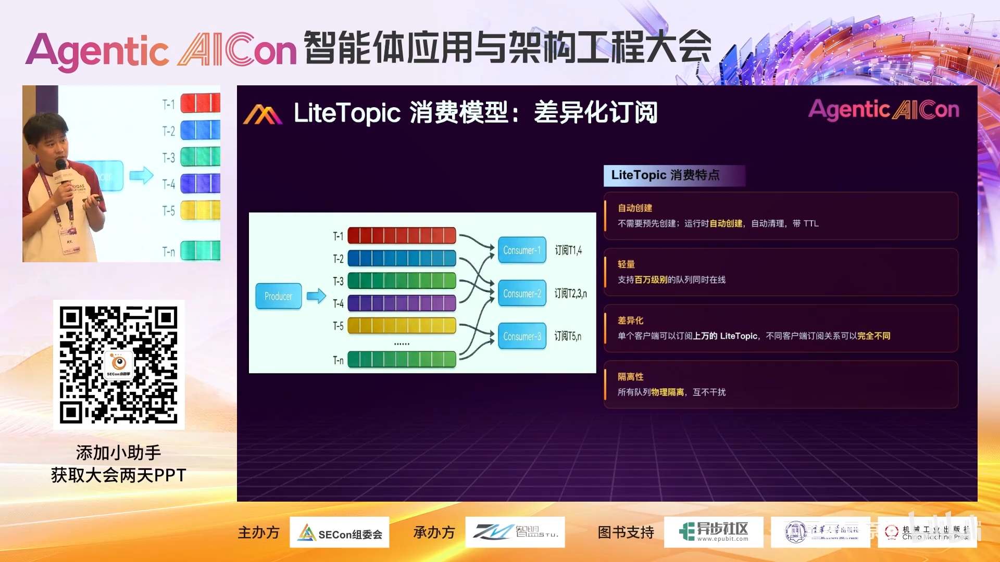

如果把一台订阅了 100 万个 LiteTopic 的 Consumer 机器想象成网关,那就相当于同时有 100 万个会话进来,**每个会话都拥有独立的会话通道**,数据互不混淆。

### 2.2 LiteTopic 的核心特性

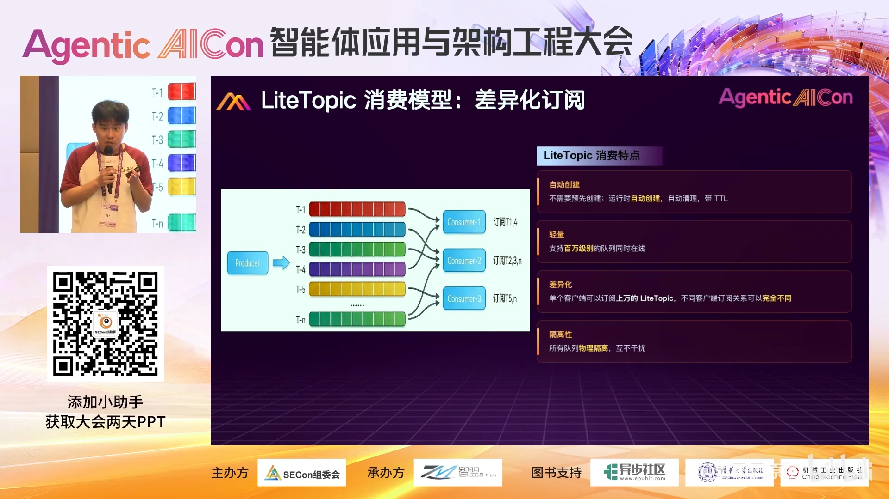

- **无需手动创建**:发送即自动创建,运行期自动创建、自动清理;
- **支持 TTL**:轻量队列有生命周期,到期自动销毁;
- **海量规模**:单台 Broker 支持**百万级** LiteTopic;单个客户端(一台机器/一个消费者实例)可订阅**上万个** LiteTopic;
- **物理隔离**:不同队列之间数据完全隔离,互不影响。

### 2.3 为什么不能用现有方案实现?

*(参考时间: 15:46)*

做大型分布式系统的经验是:**任何量变都会引起质变**。要实现 100 万路会话隔离:

| 方案 | 代价 |
|------|------|
| 传统方式 | 创建 100 万个 Topic——元数据、管理、资源开销都不可接受 |
| LiteTopic 方式 | 只需创建 **1 个** Topic,下面全部用轻量级 LiteTopic 缩建;同时消费过程减少大量无效轮询,降低 CPU 开销 |

### 2.4 事件分发机制:Ready Set

*(参考时间: 16:27)*

与原有模型最大的不同,是引入了一套**事件分发机制**:每个客户端拥有自己独立的 **ready set**(类似文件系统中 epoll/kqueue 的就绪集合)。有事件写入某个队列时,服务端把该事件放进对应客户端的 ready set,客户端只需处理自己 ready set 里的事件——避免了对百万队列的无效轮询,同时保证传输高效。

效果:集群上承载百万个会话的数据持续写入,下游消费者哪怕每人订阅七八万个队列,**端到端延迟仍可做到毫秒级(约 10–20ms)**。异步链路中不必同步等待——只要有数据写进会话队列,就立刻通过通道推送给订阅者。

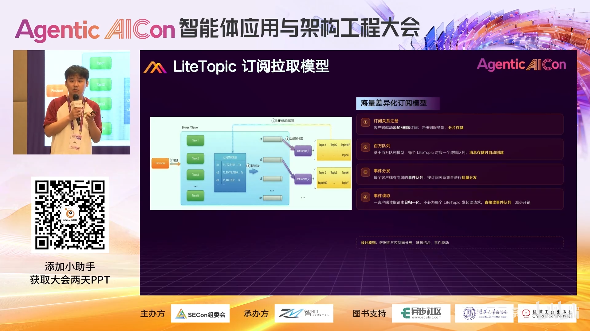

### 2.5 消费线程池的 Suspend 优化

*(参考时间: 17:30)*

传统消费模型中,消息拉到客户端后进入消费线程池处理。若此时要对某个用户限流,常规做法是 `sleep`——但 sleep 期间**线程池线程仍被占用**,无法消费其他消息,sleep 越长资源浪费越严重。

LiteTopic 在消费线程池端引入了 **suspend** 语义:

- 对某个队列执行 `suspend` 后,该队列的数据**停止拉取**;
- 消费线程**立即释放**,可以去消费其他用户的数据。

举例:两个用户的数据分别写入两个队列并同时消费,若用户 A 数据量大需要限流,只需对 A 调一次 `suspend`——A 的消费暂停,线程马上转去服务用户 B。这与传统"sleep 式限流"占用线程池的做法形成鲜明对比。

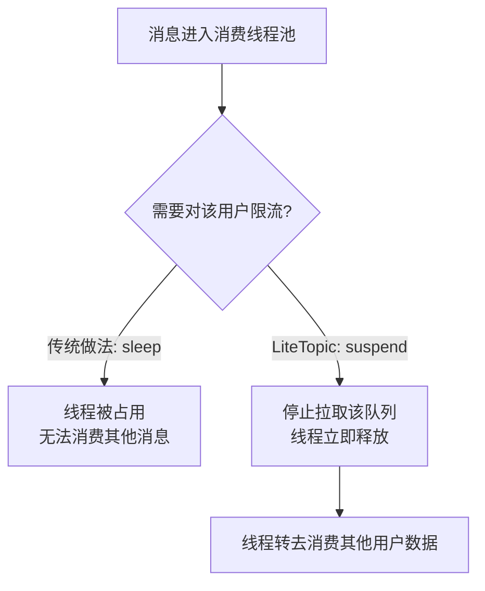
```mermaid
graph TD
    A[消息进入消费线程池] --> B{需要对该用户限流?}
    B -- 传统做法: sleep --> C[线程被占用<br/>无法消费其他消息]
    B -- LiteTopic: suspend --> D[停止拉取该队列<br/>线程立即释放]
    D --> E[线程转去消费其他用户数据]
```

---

## 三、案例实战:基于 LiteTopic 的纯异步会话网关

*(参考时间: 18:56)*

### 3.1 旧方案:七步流程 + 广播通知

这是一个真实用户案例。需求背景:用户规模大,若同步等待,请求会一直卡在前排耗尽入口资源,因此要做全异步化。旧架构基于"共享消费"模型,流程长达七步:

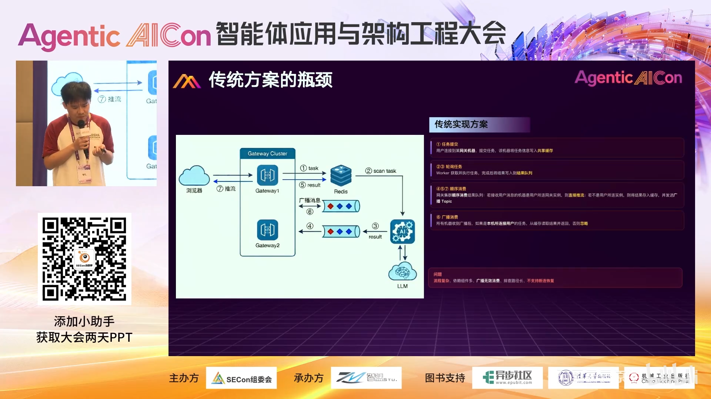

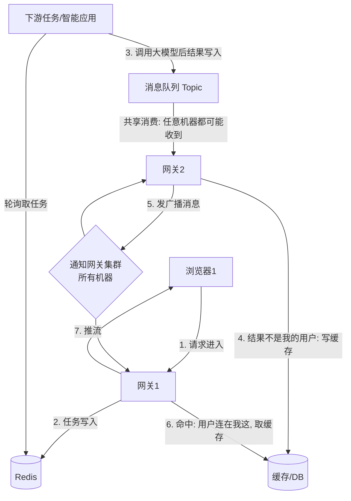
```mermaid
graph TD
    U1[浏览器1] -->|1. 请求进入| GW1[网关1]
    GW1 -->|2. 任务写入| R[(Redis)]
    W[下游任务/智能应用] -->|轮询取任务| R
    W -->|3. 调用大模型后结果写入| MQ[消息队列 Topic]
    MQ -->|共享消费: 任意机器都可能收到| GW2[网关2]
    GW2 -->|4. 结果不是我的用户: 写缓存| C[(缓存/DB)]
    GW2 -->|5. 发广播消息| BCAST{通知网关集群<br/>所有机器}
    BCAST --> GW1
    BCAST --> GW2
    GW1 -->|6. 命中: 用户连在我这, 取缓存| C
    GW1 -->|7. 推流| U1
```

1. 浏览器①的请求进入网关①;
2. 网关①把任务放进 Redis;
3. 下游任务轮询 Redis,发现用户有新任务后调用大模型;
4. 大模型结果写入消息队列的某个 Topic;
5. **问题来了**:所有网关机器在同一 Group 下共享订阅该 Topic,结果可能被**网关②**消费到,而用户明明连在网关①;
6. 网关②只能把结果写到某处缓存,并发出**广播消息**通知集群所有机器:"有个用户的结果回来了,看看是不是你连着的用户";
7. 命中的网关①从缓存/DB 取出结果推流回浏览器;没命中的机器什么都不做。

这个异步化思路本身没有问题,麻烦在于**传统消费模型做不到会话粘性**——结果回程时无法定向到发起连接的那台网关,只能靠额外的缓存与广播机制补全,中间过程冗余繁多。

### 3.2 新方案:三步完成的会话亲和

改用 LiteTopic 后,流程极大简化:

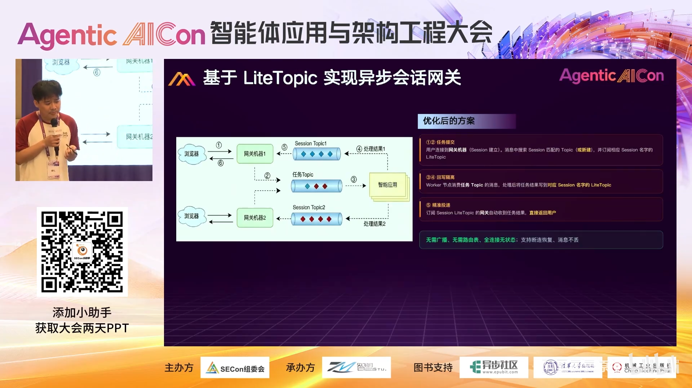

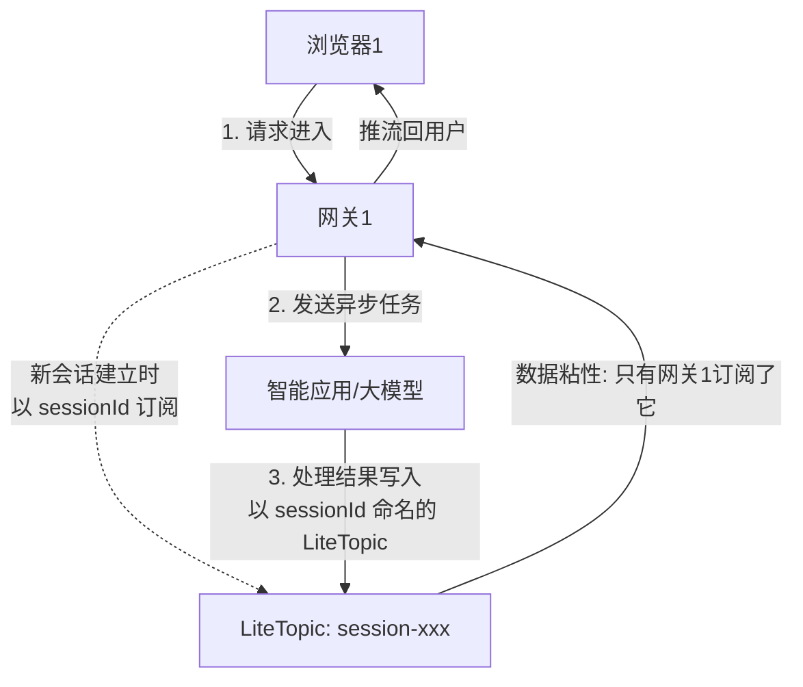
```mermaid
graph TD
    U1[浏览器1] -->|1. 请求进入| GW1[网关1]
    GW1 -->|2. 发送异步任务| APP[智能应用/大模型]
    GW1 -.->|新会话建立时<br/>以 sessionId 订阅| LT[LiteTopic: session-xxx]
    APP -->|3. 处理结果写入<br/>以 sessionId 命名的 LiteTopic| LT
    LT -->|数据粘性: 只有网关1订阅了它| GW1
    GW1 -->|推流回用户| U1
```

1. 浏览器①请求进入网关①;网关①发出一条异步任务给下游智能应用(纯事件驱动,发完即释放,不等待);
2. 每台网关机器清楚自己持有哪些会话连接,**每个新会话建立时,直接以该 `session id` 作为 LiteTopic 名字进行订阅**;
3. 下游智能应用处理完毕,把结果写入**对应 session 名字的 LiteTopic**。

由于队列级物理隔离 + 差异化订阅,只有持有该用户的网关①订阅了这个队列,因此不管中间经历怎样的异步流转,**大模型的最终结果一定回到网关①**——数据粘性问题被队列模型天然解决。收益:

- **去掉冗余**:不再依赖数据库/Redis 保存中间过程,不再需要广播通知机制;
- **流程从七步简化为三步**,对用户完全透明;
- **天然的断流恢复**:数据全部持久化在 RocketMQ 中。若网关机器宕机,只要恢复后重建"我当前有哪些未完成会话"的清单并重新订阅,即可把宕机期间未消费的消息**全部取回**,继续推流,实现故障后的会话恢复。

---

## 四、落地实践一:大模型网关的精细化限流(百炼)

*(参考时间: 23:43)*

### 4.1 场景与痛点

该需求来自阿里云百炼网关——类似于 Token Plan / Coding Plan 这类产品,所有流量先到百炼网关,再路由调用各大模型。核心需求:

- **资源隔离**:不同用户 QPS 不同、流量画像不同;
- **防止队头阻塞**:某用户突然涌入大量调用且处理很慢,如果消息流里队头全是它的消息,后面所有用户全部卡住;
- **限流不伤及无辜**:传统 `sleep` 式限流会让整个下游消费线程全部阻塞,所有人都要等待,解决不了资源隔离问题。

传统做法把所有用户的事件驱动请求塞进同一个 Topic,所有用户数据混在一起,处理时长不一导致整个队列阻塞——单个用户的慢任务会阻碍所有用户,无法做到物理隔离。

### 4.2 方案:每用户一个 LiteTopic + Suspend

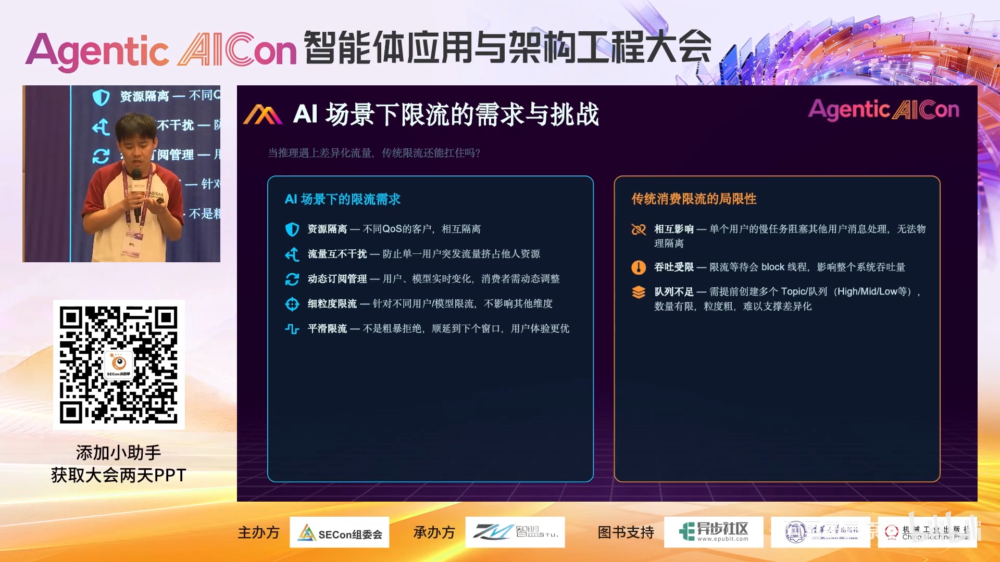

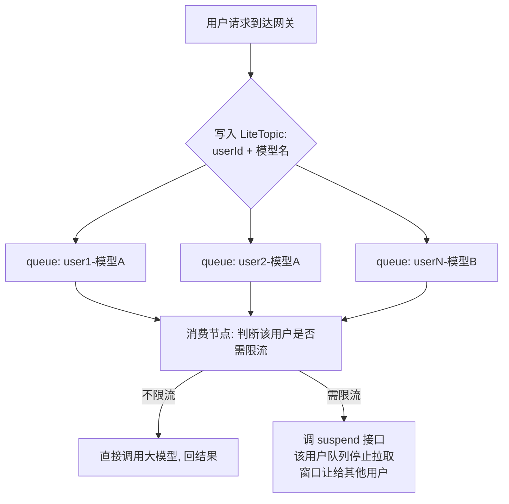
```mermaid
graph TD
    REQ[用户请求到达网关] --> LT{写入 LiteTopic:<br/>userId + 模型名}
    LT --> Q1[queue: user1-模型A]
    LT --> Q2[queue: user2-模型A]
    LT --> QN[queue: userN-模型B]
    Q1 --> C1[消费节点: 判断该用户是否需限流]
    Q2 --> C1
    QN --> C1
    C1 -->|不限流| LLM[直接调用大模型, 回结果]
    C1 -->|需限流| S[调 suspend 接口<br/>该用户队列停止拉取<br/>窗口让给其他用户]
```

- 每个用户进入排队消费时,写入以 **`user id`** 命名的 LiteTopic;若同时区分模型,则以 **`user id + 模型名`** 命名——如 user1 调千问、调 MiniMax,各排各的队;
- 10 万个用户就有 10 万个队列,**队列极轻,无需创建,发进去自动生成**;
- 消费节点收到用户请求后,按自己的限流算法判断是否需要对**该用户**限流;若需要,调用 `suspend` 接口——这个用户的全部消费与拉取立即停止,处理窗口全部让给其他用户。

对大型平台而言,最怕的就是**爆炸半径**:单个用户影响整集群所有用户。该方案保证限流只作用于单一队列——限流你,百分之百不影响其他人。

### 4.3 代码:极简的发送与消费

发送端只需在消息属性上设置 LiteTopic 名:

```java
// 发送端:以 user id + 模型名 作为 LiteTopic,不存在则自动创建
Message message = new Message("parent_topic", body);
message.setLiteTopic(userId + ":" + modelName);
producer.send(message);
```

消费端在需要限流时挂起该队列:

```java
// 消费端:判定需要对该用户限流时
consumer.suspend(liteTopic, duration);  // 队列停止拉取,消费线程立即释放
```

### 4.4 分级限流策略

| 限流等级 | suspend 时长 | 效果 |
|----------|--------------|------|
| 轻度限流(当前时间窗口不够) | 50–100ms | 把这波请求放到下一个窗口 |
| 明显控量(流量过大) | 1–2 秒 | 快速削峰 |
| 低优先级任务降级 | 最长 10 小时 | 例如资源不足时,把集团内非紧急调用从白天停到晚上——`suspend(10h)`,白天的任务自然排到晚上执行,把 GPU 资源让给白天更高优先级的业务 |

通过 `suspend` 时长这一个旋钮,就能把固定用户控制在固定速率、固定时间窗内执行,而不影响其他用户。

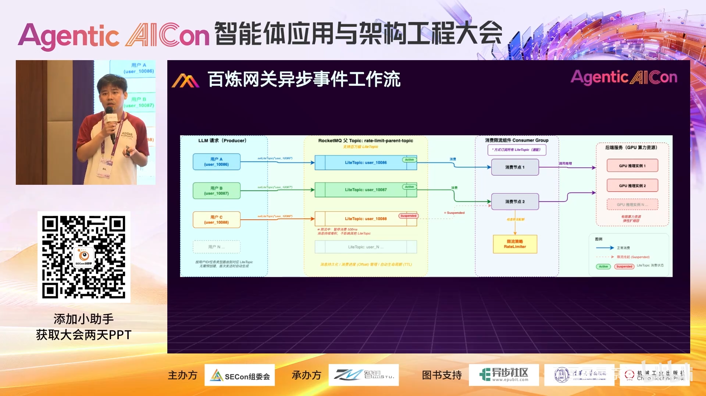

还有一类**同步/异步并行**的玩法:普通用户触发限流时可以直接返回失败;而对不能接受失败的核心关键用户,则把请求**从同步转异步**,放入专属队列慢慢排队消费——保证重要业务无损。这是目前网关场景中用得较多的模式。

---

## 五、落地实践二:系统到 Agent 的异步协作通道(OpenClaw Channel)

*(参考时间: 30:27)*

### 5.1 目标:让消息成为两个 AI 系统之间的桥梁

传统的 OpenClaw(年初流行的开源个人 Agent 助理)玩法是**人通过 IM(Telegram、WhatsApp、微信、钉钉)与 Agent 交互**。这个实践想做一种新尝试:**两个系统之间、系统与 OpenClaw 之间、甚至两个 OpenClaw 之间,通过 RocketMQ 做任务级的异步交互**——把 OpenClaw 从"个人助理"升级为"企业级的消息处理节点"。

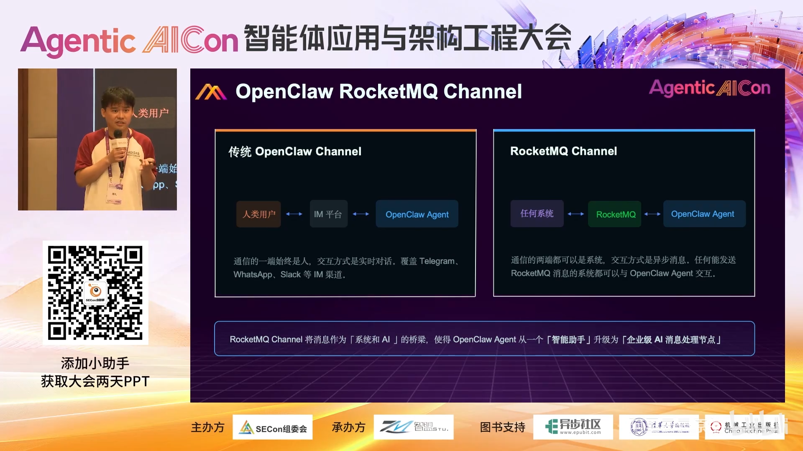

### 5.2 机器间协作需要标准协议

人与机器交互可以用自然语言让模型拆解;但应用与应用、机器与机器之间,必须有**明确的协议**。为此设计了一套消息协议规范:

| 字段 | 含义 |
|------|------|
| `message_id` | 消息唯一标识(用于幂等/去重) |
| `session_id` | 本次会话管理的 ID |
| `source_agent_id` | 发送方 Agent 标识 |
| `target_agent_id` | 目标节点 Agent 标识 |
| `target_topic` | 下一步/回程投递的队列指令 |
| `body` | 消息内容 |

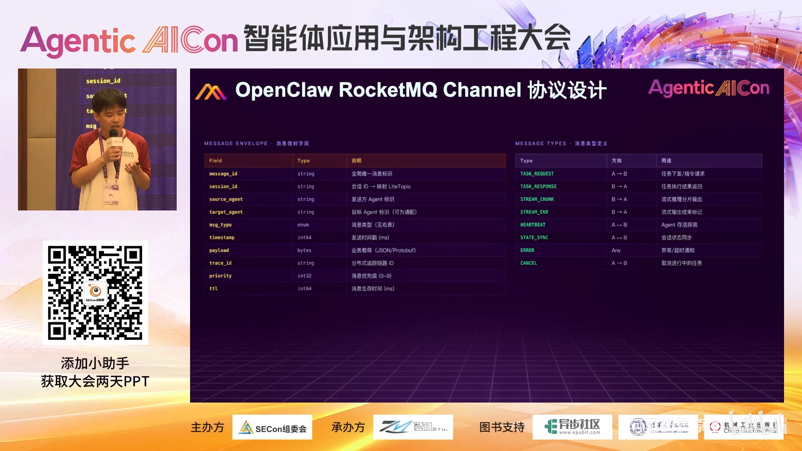

### 5.3 端到端流程

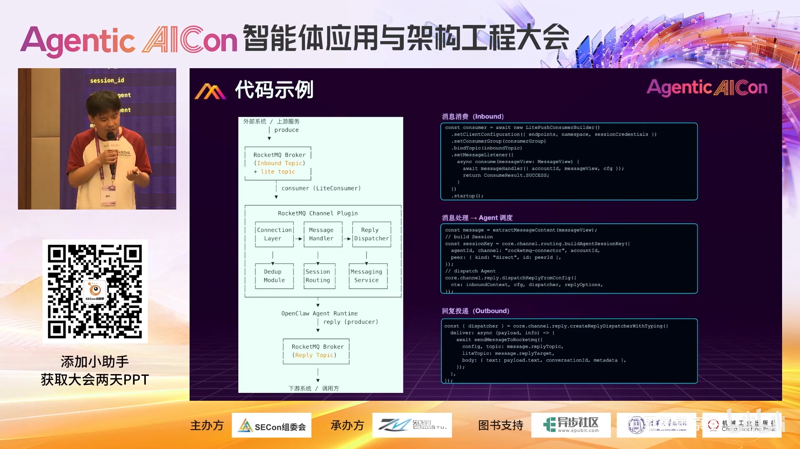

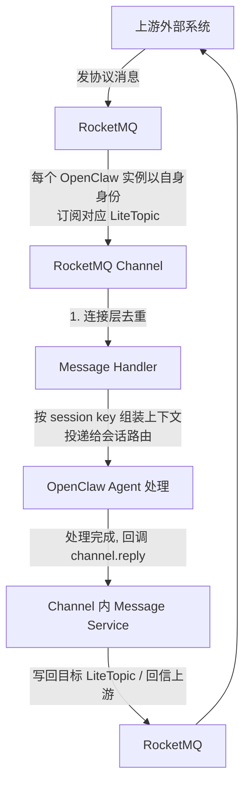
```mermaid
graph TD
    SYS[上游外部系统] -->|发协议消息| MQ[RocketMQ]
    MQ -->|每个 OpenClaw 实例以自身身份<br/>订阅对应 LiteTopic| CH[RocketMQ Channel]
    CH -->|1. 连接层去重| MH[Message Handler]
    MH -->|按 session key 组装上下文<br/>投递给会话路由| OC[OpenClaw Agent 处理]
    OC -->|处理完成, 回调 channel.reply| MS[Channel 内 Message Service]
    MS -->|写回目标 LiteTopic / 回信上游| MQ2[RocketMQ]
    MQ2 --> SYS
```

1. 上游外部系统先发一条消息到 RocketMQ;
2. 每个 OpenClaw 实例分配一个身份,**这个身份就是它的 LiteTopic 名字**,并异步订阅该队列(纯事件驱动,零轮询);
3. 消息进入 Channel 连接层,先做**去重**处理,再进入 Message Handler;
4. Message Handler 根据消息里的 `session_id` 组装 OpenClaw 所需的 session key,传入其会话路由;
5. OpenClaw 自身完成推理处理;
6. 处理完成后,通过 OpenClaw 的 `channel.reply` 机制回调 Channel 内置的 Message Service;
7. Message Service 按协议中的 `target_topic` 指令,把结果发往下游系统或回信给调用方——若对方是工作流,这就是下一环节的事件;若是回信,则完成一次多轮任务交互。

整个流程类似 Google A2A 协议所描述的 Agent 间协作,但传输层换成了可靠的异步消息。

### 5.4 零侵入的实现方式

**全过程没有修改 OpenClaw 的任何一行代码**,完全基于其对外开放的 Channel 扩展机制,在外侧以轻量方式实现了任务下发、结果回写,以及生命周期管理与上下文管理。

典型应用场景如**工单系统**:产生新工单时把数据推给 RocketMQ,RocketMQ 推给 OpenClaw 自动分析处理;其他系统联动场景可依此类推。

---

## 六、Q&A 精选

*(参考时间: 35:58)*

**Q1:LiteTopic 对比传统 MQ Topic,单通道的性能差异?**

- **写入侧**:队列少(单通道),峰值 QPS 上限确实低于传统多队列 Topic。但**拆分零成本**:若担心单通道写入慢,把 `user` 拆成 `user-1`、`user-2`、`user-3` 即可,发送时随意打标。
- **消费侧**:LiteTopic 是顺序消费,并发能力对标 RocketMQ 传统的顺序消息;与传统非顺序并发消费相比肯定慢一些。当前**单通道消费 QPS 约 8000–10000**。
- **时延**:端到端(发送→接收)与传统顺序消息无明显差别;比普通并发消费大约慢 5–10ms。

**Q2:作为消费者,事件通知机制与原来有什么不同?**

原来是**轮询**(Topic 有 100 个队列,消费者逐队列查看有无消息);LiteTopic 创建成本极低,单机可能有 100 万个队列,逐队列轮询效率极低、大部分是空轮询。现在改为 **ready set**:每台客户端一个就绪集合(类似 epoll 模型),有数据进来才放入,机器只管自己的事件。本质是**空间换时间**——内存消耗略增,时间上的 gap 基本抹平。

对追问"内存消耗是否会更大":几千到几万个队列的常规规模下,与传统方案**基本没有区别**——"你能跑 100 万个队列吗?跑不到的话开销可以忽略。"

**Q3:与 HiClaw 中的 Matrix、以及 NATS 相比有什么区别?为什么不用更轻的 NATS?**

- **与 Matrix 定位不同**:Matrix 本质是聊天室场景,HTTP 模型,带 room 等**业务层**概念;LiteTopic 更底层,只做 Agent/系统间**通信**,是基础设施层。两者不是同类产品,也不构成竞争,反而可以结合——HiClaw 的 room 业务层与其无关,但下层通信可以由消息中间件承担。双方团队已在探讨合作:HiClaw 目前的 Agent 事件驱动采用轮询方案(借助 MinIO 这类对象存储,所有事件先写入,每台机器不停轮询),比较低效;未来可能改造为通过消息中间件做**事件驱动 + 结果回写**,从轮询架构升级为消息通知机制。MCP 的 Task 轮询机制同样"不是终态"——面对要执行几小时、几天的任务,轮询成本非常高,未来必然向异步推送演进。
- **与 NATS 的选择**:演讲者的建议是"我的建议不重要,**你自己试一下就知道**"。并补充了规模底气:RocketMQ 在集团内双 11 承载的是**亿级 QPS**,设计目标就是支撑十万、百万级会话规模;10 万队列以内,只要不是 0.5 核 2G 这种极小规格机器,都没问题。性能对比这类问题,要到达一定规模量之后才会显现差异。

---

## 总结

1. **异步化是 AI Agent 企业级落地的必答题**:会话状态存储、长任务调度、故障恢复、多 Agent 可靠通信,是 MCP/Google 等头部生态共同指向的四大方向。
2. **LiteTopic** 以"发送即建、TTL 自动清理、单机百万队列、差异化订阅"的轻量模型,把消息隔离粒度从 Topic 级下沉到会话/任务级,并以 ready set 与 suspend 两项机制兼顾海量通道的效率与弹性。
3. 在**会话网关**场景中,LiteTopic 天然解决回程粘性,七步流程简化为三步,且宕机后可凭持久化队列断点续传。
4. 在**百炼网关**实践中,`userId+模型名` 的专属队列配合分级 suspend,实现爆炸半径为零的精细化限流与无损降级。
5. 在 **OpenClaw Channel** 实践中,RocketMQ 作为两个 AI 系统之间的异步协议通道,零侵入地把个人助理接入企业级系统协作网络。

> 让 Agent 不再等待——把"同步阻塞"的世界,重构为"事件驱动"的世界。
